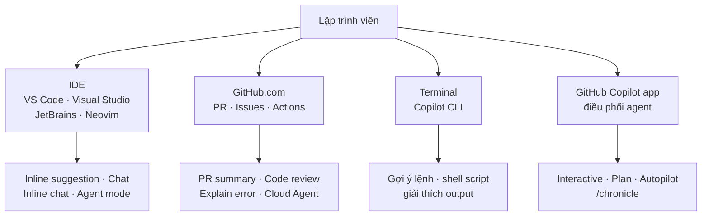

# MOC: GitHub Copilot — ôn chứng chỉ GH-300

> **Nguồn:** 2 learning path chính thức Microsoft Learn — *GitHub Copilot Fundamentals Part 1 of 2* & *Part 2 of 2* (14 module).
> **Mục tiêu:** đủ để ôn thi **GH-300 GitHub Copilot** mà không phải xem lại khoá học.
> Mỗi note theo chuẩn vault: TL;DR → bảng phân biệt → Mermaid → `★ Insight` → Q&A phỏng vấn → Tự kiểm tra.

> 🔎 Chỗ nào tôi bổ sung ngoài 2 file nguồn đều được đánh dấu bằng dòng `> 🔎 **Ngoài nguồn**`.

> *Ảnh minh hoạ:* folder `_img/` chứa ảnh chọn lọc từ Microsoft Learn (© Microsoft, dùng cho mục đích học tập, nguồn ghi dưới từng ảnh); sơ đồ khái niệm còn lại vẽ lại bằng Mermaid bám sát bản gốc.

**Trạng thái:** 🚧 đang viết — xong Đợt 2/6 (cụm A + B).

## Cụm A — Nền tảng & Responsible AI

| # | Note | Nội dung | Trạng thái |
|---|------|----------|------------|
| 1 | [[01-Responsible-AI-voi-Copilot\|Responsible AI với Copilot]] | Rủi ro AI & cách giảm thiểu; **6 nguyên tắc RAI** của Microsoft/GitHub | ✅ |
| 2 | [[02-Copilot-la-gi-va-cac-goi\|Copilot là gì & 5 gói]] | AI pair programmer, 5 tính năng lớn, bảng Free/Pro/Pro+/Business/Enterprise | ✅ |
| 3 | [[03-Cai-dat-Cau-hinh-va-Cach-tuong-tac\|Cài đặt & cách tương tác]] | Sign up, extension, bật/tắt, log & Collect Diagnostics; 8 cách kích hoạt Copilot | ✅ |

## Cụm B — Prompt engineering & cơ chế bên trong

| # | Note | Nội dung | Trạng thái |
|---|------|----------|------------|
| 4 | [[04-Prompt-Engineering-voi-Copilot\|Prompt engineering]] | 4 Ss, 4 best practice, zero/one/few-shot, chain prompting + PRU, role prompting | ✅ |
| 5 | [[05-Copilot-xu-ly-Prompt-va-Du-lieu\|Copilot xử lý prompt & dữ liệu]] | Pipeline 7 bước, FIM, proxy filter, giữ dữ liệu 28 ngày, context window, LLM/LoRA | ✅ |
| 6 | [[06-Copilot-Spaces\|Copilot Spaces]] | Space là gì, 4 cách attach, sharing/security/versioning/governance | ✅ |

## Cụm C — Copilot trên mọi môi trường

| # | Note | Nội dung | Trạng thái |
|---|------|----------|------------|
| 7 | [[07-Copilot-trong-IDE\|Copilot trong IDE]] | Completion, multiple suggestions, scope reference, slash command, premium request | 🚧 |
| 8 | [[08-Copilot-tren-GitHub-com\|Copilot trên GitHub.com]] | PR assistance, code review, Explain error in Actions | 🚧 |
| 9 | [[09-Copilot-CLI-va-GitHub-Copilot-App\|Copilot CLI & Copilot app]] | Sandbox, `--cloud`, 3 session mode, `/chronicle`, voice dictation | 🚧 |

## Cụm D — Agent & MCP

| # | Note | Nội dung | Trạng thái |
|---|------|----------|------------|
| 10 | [[10-Agent-Mode-trong-IDE\|Agent mode trong IDE]] | Autonomous, multi-step orchestration, self-healing, oversight, limitations | 🚧 |
| 11 | [[11-Copilot-Cloud-Agent\|Copilot Cloud Agent]] | Giao issue cho Copilot, prompt injection, `copilot-setup-steps.yml`, firewall | 🚧 |
| 12 | [[12-GitHub-MCP-Server\|GitHub MCP Server]] | MCP, 3 kiểu kết nối, OAuth trong VS Code, MCP + agent mode | 🚧 |

## Cụm E — Review, quản trị, năng suất, kiểm thử

| # | Note | Nội dung | Trạng thái |
|---|------|----------|------------|
| 13 | [[13-Code-Review-va-Pull-Request\|Code review & PR]] | PRU, Copilot as reviewer, custom instructions theo path, Rulesets | 🚧 |
| 14 | [[14-Quan-tri-va-Tuy-bien\|Quản trị & tuỳ biến]] | Public code filter 3 scope, content exclusions + limitations, troubleshoot | 🚧 |
| 15 | [[15-Developer-Use-Cases-va-Do-luong\|Use cases & đo lường]] | Orchestrated AI workflows, REST API usage metrics, developer survey | 🚧 |
| 16 | [[16-Unit-Testing-voi-Copilot\|Unit testing với Copilot]] | xUnit/NUnit/MSTest, `/setupTests` `/tests` `/fixTestFailure`, Plan & Agent mode | 🚧 |

## Cụm F — Thực hành & ôn thi

| # | Note | Nội dung | Trạng thái |
|---|------|----------|------------|
| 17 | [[17-Thuc-hanh-Copilot-theo-Ngon-ngu\|Thực hành theo ngôn ngữ]] | Implicit prompt, selective context, luồng JS & Python | 🚧 |
| 18 | [[18-GH-300-Cheatsheet-va-QA\|⭐ Cheatsheet + Q&A]] | Bảng tra nhanh, cặp dễ nhầm, bản đồ đề thi | 🚧 |

## Bản đồ đề thi GH-300

> 🔎 **Ngoài nguồn** — trọng số dưới đây lấy từ mô tả kỳ thi GH-300 của GitHub, không có trong 2 file giáo trình. Dùng để biết ôn nặng chỗ nào; kiến thức chi tiết vẫn nằm trong các note.

| Domain đề thi | Trọng số | Note phủ |
|---|---|---|
| Responsible AI | 7% | 01 |
| GitHub Copilot plans and features | 31% | 02, 03, 07, 08, 09 |
| How GitHub Copilot works and handles data | 15% | 05, 10, 11, 12 |
| Prompt crafting and prompt engineering | 9% | 04, 06 |
| Developer use cases for AI | 14% | 15, 17 |
| Testing with GitHub Copilot | 9% | 16 |
| Privacy fundamentals and context exclusions | 15% | 14, 11 |

**Đọc theo trọng số:** 31% đề rơi vào *plans and features* → cụm A + C là phần phải thuộc kỹ nhất (đặc biệt **bảng 5 gói** và **tính năng nào có ở surface nào**). Hai domain 15% (*how it works* và *privacy/exclusions*) là chỗ dễ mất điểm vì hay bị học lướt.

## Bản đồ: Copilot xuất hiện ở đâu

## Liên quan
- [[../00-MOC-Foundations|⬅ MOC: Foundations]]
- [[../02-Git/00-MOC-Git|MOC: Git]] — nền tảng Git/GitHub, PR, GitHub Actions
- [[../../05-Cloud/02-Azure/AI-103/06-Custom-Tools-va-MCP-Tools|AI-103/06 — MCP phía Azure Foundry]] — cùng chuẩn MCP, nhìn từ đầu server/agent
- [[../../06-DevOps/12-Modern-DevOps|DevOps/12 — Modern DevOps]] — AI trong ba wave của DevOps
