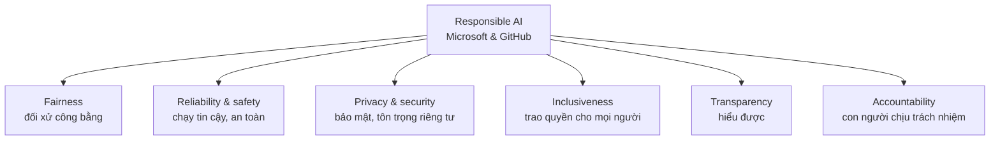

# Note 01 — Responsible AI với GitHub Copilot

> **TL;DR:** **Responsible AI** (*AI có trách nhiệm* — cách tiếp cận để **phát triển, đánh giá và triển khai** hệ thống AI sao cho **an toàn, đáng tin cậy và có đạo đức**) đặt con người và mục tiêu của họ vào trung tâm mọi quyết định thiết kế. Microsoft & GitHub gói nó thành **6 nguyên tắc**: **Fairness** (công bằng) · **Reliability and safety** (tin cậy & an toàn) · **Privacy and security** (riêng tư & bảo mật) · **Inclusiveness** (bao trùm) · **Transparency** (minh bạch) · **Accountability** (trách nhiệm giải trình). Ba trụ để giảm rủi ro AI: **governance framework** (khung quản trị), **transparency in AI processes** (minh bạch quy trình), **human oversight** (con người giám sát). Đề GH-300 hỏi domain này ~7% — ít câu nhưng dễ ăn điểm vì chỉ cần nhớ đúng tên và ý của 6 nguyên tắc.

## 1. Vì sao phải giảm thiểu rủi ro AI

AI mở ra cơ hội đổi mới và tăng hiệu quả, nhưng kèm rủi ro thật:

| Rủi ro | Biểu hiện cụ thể |
|---|---|
| **Khó diễn giải quyết định** | Mô hình ra quyết định mà con người không hiểu vì sao → thiếu *transparency* (minh bạch) và *accountability* (trách nhiệm) |
| **Hệ quả ngoài ý muốn, gây hại** | *biased decision-making* (ra quyết định thiên lệch), *privacy violations* (vi phạm quyền riêng tư) |

**Ba biện pháp giảm thiểu** mà giáo trình nêu — nhớ đúng bộ ba này vì hay bị hỏi:

1. **Robust governance frameworks** — khung quản trị chặt chẽ (ai được dùng, dùng vào việc gì, kiểm soát ra sao).
2. **Transparency in AI processes** — minh bạch quy trình AI (giải thích được hệ thống làm gì).
3. **Human oversight** — con người giám sát, không giao trọn quyền cho AI.

> Áp vào Copilot: bạn **không bao giờ merge thẳng** code Copilot sinh ra — con người vẫn review, test, chịu trách nhiệm cuối cùng.

## 2. Responsible AI là gì

> *"Responsible AI is an approach to developing, assessing, and deploying artificial intelligent systems in a safe, trustworthy, and ethical way."*

Điểm mấu chốt trong định nghĩa: hệ thống AI là **sản phẩm của rất nhiều quyết định do con người đưa ra** — từ mục đích hệ thống (*system purpose*) cho đến cách người dùng tương tác với nó. Responsible AI giúp **định hướng trước** (proactively guide) những quyết định đó về phía kết quả có lợi và công bằng, bằng cách giữ **con người và mục tiêu của họ ở trung tâm** thiết kế, tôn trọng các giá trị bền vững như **fairness, reliability, transparency**.

```
★ Insight ─────────────────────────────────────
• Responsible AI KHÔNG phải là một tính năng bật/tắt trong sản phẩm, mà là
  "approach" — cách làm xuyên suốt 3 giai đoạn: developing (phát triển),
  assessing (đánh giá), deploying (triển khai). Câu hỏi đề thi hay đánh vào
  chỗ này: đáp án đúng thường là phương án nói về QUY TRÌNH, không phải
  phương án nói về một chức năng cụ thể của Copilot.
• Cụm từ khoá để nhận ra định nghĩa đúng: "safe, trustworthy, and ethical".
─────────────────────────────────────────────────
```

## 3. Sáu nguyên tắc Responsible AI



Bảng tra nhanh — **một câu định nghĩa cho mỗi nguyên tắc** (đúng nguyên văn giáo trình):

| # | Nguyên tắc | Câu định nghĩa gốc | Nghĩa tiếng Việt |
|---|---|---|---|
| 1 | **Fairness** | AI systems should treat all people fairly | Đối xử công bằng với mọi người |
| 2 | **Reliability and safety** | AI systems should perform reliably and safely | Hoạt động tin cậy và an toàn |
| 3 | **Privacy and security** | AI systems should be secure and respect privacy | Bảo mật và tôn trọng quyền riêng tư |
| 4 | **Inclusiveness** | AI systems should empower everyone and engage people | Trao quyền cho mọi người, thu hút sự tham gia |
| 5 | **Transparency** | AI systems should be understandable | Con người hiểu được hệ thống |
| 6 | **Accountability** | People should be accountable for AI systems | Con người phải chịu trách nhiệm về hệ thống AI |

### 3.1. Fairness — công bằng

AI phải đối xử với mọi người như nhau, **tránh tác động khác biệt lên các nhóm có hoàn cảnh tương tự** (*differential impacts on similarly situated groups*). Ví dụ giáo trình đưa: trong **điều trị y tế, xét duyệt khoản vay, tuyển dụng**, AI phải đưa khuyến nghị nhất quán cho những người có triệu chứng / tình hình tài chính / trình độ tương đương.

**5 kỹ thuật phát hiện và giảm thiên lệch** (*detect bias and mitigate unfair impacts*):

1. **Reviewing training data** — rà soát dữ liệu huấn luyện.
2. **Testing models with balanced demographic samples** — test với mẫu nhân khẩu học cân bằng.
3. **Using adversarial debiasing** — *khử thiên lệch đối kháng*: huấn luyện thêm một mô hình "đối thủ" chuyên đoán thuộc tính nhạy cảm (giới tính, sắc tộc) từ đầu ra; mô hình chính bị ép sinh ra kết quả mà đối thủ **không** đoán được → tín hiệu thiên lệch bị triệt tiêu.
4. **Monitoring model performance across user segments** — theo dõi hiệu năng theo từng nhóm người dùng.
5. **Implementing controls to override unfair model scores** — có cơ chế cho con người ghi đè điểm số bất công.

Huấn luyện trên dữ liệu **đa dạng và cân bằng** là cách nền tảng nhất để giảm bias.

### 3.2. Reliability and safety — tin cậy & an toàn

Hệ thống phải **hoạt động đúng thiết kế**, **phản ứng an toàn với điều kiện bất ngờ** (*unexpected conditions*) và **chống lại thao túng có hại** (*resist harmful manipulation* — ví dụ prompt injection, xem [[11-Copilot-Cloud-Agent]]).

Phân biệt hai khái niệm dễ nhầm:

| Khái niệm | Định nghĩa | Trọng tâm |
|---|---|---|
| **Safety** (an toàn) | Giảm thiểu **tổn hại ngoài ý muốn** — physical, emotional, financial harm cho cá nhân và xã hội | Hậu quả gây ra |
| **Reliability** (tin cậy) | Hoạt động **nhất quán như dự định**, không có biến thiên/lỗi ngoài mong muốn | Tính ổn định của hành vi |

Hệ thống an toàn & tin cậy thì **robust** (bền), **accurate** (chính xác) và **behave predictably** (hành xử dự đoán được) trong điều kiện bình thường. Phạm vi điều kiện mà hệ thống xử lý được phản ánh **tầm nhìn xa của developer** lúc thiết kế và kiểm thử.

### 3.3. Privacy and security — riêng tư & bảo mật

Bốn nhóm thực hành dữ liệu Microsoft & GitHub cam kết:

| Thực hành | Nội dung |
|---|---|
| **Xin phép trước khi thu thập** | Giải thích rõ AI dùng dữ liệu thế nào, xin *consent* (sự đồng ý); **không thu thập lén**; cho người dùng chọn có chia sẻ dữ liệu cá nhân hay không, thông báo qua prompt và policy rõ ràng |
| **Chỉ thu thập dữ liệu cần thiết** | Tránh gom thông tin thừa; **xoá dữ liệu nhạy cảm** khi AI đã vận hành; định kỳ rà soát input để chắc chỉ thu cái thiết yếu |
| **Ẩn danh hoá dữ liệu cá nhân** | **Pseudonymization** (*giả danh hoá* — thay thông tin cá nhân bằng định danh ngẫu nhiên) và **aggregation** (*gộp nhóm* — tổng hợp dữ liệu thành số liệu tóm tắt, xoá chi tiết từng cá nhân) |
| **Mã hoá dữ liệu nhạy cảm** | Mã hoá **cả khi truyền và khi lưu** (*in transit* và *at rest*), dùng thuật toán mạnh và bảo vệ khoá |

**Ba cách bảo vệ khoá mã hoá** giáo trình liệt kê:

- **Hardware Security Modules (HSMs)** — thiết bị phần cứng lưu khoá trong môi trường **tamper-proof** (chống can thiệp vật lý).
- **Secure vaults** như **Microsoft Azure** — kho khoá có kiểm soát truy cập.
- **Envelope encryption** (*mã hoá phong bì*) — dùng **hai khoá**: một khoá dữ liệu mã hoá nội dung, một khoá gốc mã hoá lại khoá dữ liệu đó.

Ngoài ra tổ chức phải: kiểm soát **ai được truy cập khoá và mô hình**, **xoay khoá định kỳ** (*rotate keys*), **sao lưu khoá an toàn**, giới hạn quyền nhân viên với mô hình/dữ liệu nhạy cảm, **phân loại theo mức nhạy cảm**, và **audit bảo mật định kỳ**.

### 3.4. Inclusiveness — bao trùm

AI phải **công bằng, dễ tiếp cận và trao quyền cho tất cả** — đặc biệt các nhóm **historically underrepresented** (*ít được đại diện trong lịch sử*).

Chuẩn Responsible AI của Microsoft về inclusiveness yêu cầu 5 điều:

1. Hoạt động tốt với **người dùng và nhóm đa dạng**, không làm ai bất lợi.
2. **Accessible** — ai cũng dùng được, bất kể khả năng thể chất hay tinh thần.
3. **Có mặt trên toàn cầu**, kể cả các nước/khu vực đang phát triển — không loại trừ vùng địa lý nào.
4. Người từ **nhiều nền tảng và cộng đồng khác nhau** được góp ý vào quá trình phát triển.
5. Mọi người dùng **hưởng lợi ngang nhau** từ năng lực hệ thống.

Ví dụ AI bao trùm: nhận diện khuôn mặt hoạt động **trên mọi tông da, độ tuổi, giới tính**; giao diện hỗ trợ **screen reader** cho người khiếm thị; dịch ngôn ngữ hỗ trợ **phương ngữ vùng nhỏ**; đội ngũ chủ động tìm góc nhìn đa dạng khi thiết kế.

Ba yêu cầu để đạt **full global inclusion**:

- Cung cấp **phương thức tương tác thay thế**: điều khiển bằng giọng nói, phụ đề, screen reader.
- Hỗ trợ **chuyển ngữ và bối cảnh văn hoá địa phương**.
- **Chạy được offline**, với kết nối và tài nguyên tính toán hạn chế.

### 3.5. Transparency — minh bạch

Hệ thống phải **understandable** (hiểu được) và **interpretable** (diễn giải được). Người tạo AI cần 4 việc:

1. **Giải thích rõ hệ thống hoạt động thế nào** thông qua *clear validation framework* (khung kiểm định rõ ràng).
2. **Biện giải các lựa chọn thiết kế** đằng sau hệ thống.
3. **Trung thực về năng lực và giới hạn** của hệ thống.
4. **Cho phép auditability** — có logging, reporting, auditing.

Transparency là điều kiện để **xây niềm tin, bảo đảm accountability, thúc đẩy fairness, tăng safety và hỗ trợ inclusiveness** — tức nó là nguyên tắc "đòn bẩy" cho các nguyên tắc khác. Cách triển khai: **tài liệu hoá dữ liệu và mô hình**, tạo **giao diện giải thích**, dùng **công cụ debug AI**, dựng **dashboard kiểm thử**, bật **logging & auditing**.

### 3.6. Accountability — trách nhiệm giải trình

Người tạo AI **phải chịu trách nhiệm về cách hệ thống của mình vận hành**: liên tục **giám sát hiệu năng** và **giảm thiểu rủi ro**. Giáo trình nói thẳng bối cảnh: các vụ *algorithmic harm* (tổn hại do thuật toán), bias và lạm dụng ngày càng nhiều; giới phê bình cho rằng **không có accountability thì người tạo AI nắm quá nhiều quyền lực** trên những hệ thống mờ đục tác động tới đời sống con người.

Trong **Responsible AI Standard** của Microsoft, accountability là **nguyên tắc nền tảng** (*foundational principle*): hệ thống AI phải **accountable to people**, và công ty triển khai AI phải chịu trách nhiệm về vận hành của nó.

```
★ Insight ─────────────────────────────────────
• Transparency và Accountability hay bị hoán đổi trong câu hỏi trắc nghiệm.
  Mẹo phân biệt: Transparency trả lời "HỆ THỐNG có giải thích được không?"
  (thuộc tính của hệ thống); Accountability trả lời "AI chịu trách nhiệm khi
  nó sai?" (thuộc tính của con người/tổ chức). Từ khoá của Transparency là
  logging/auditability/explain; của Accountability là monitor/responsible/
  Responsible AI Standard.
• Fairness và Inclusiveness cũng dễ nhầm: Fairness lo ĐỐI XỬ NHƯ NHAU với
  các nhóm tương đương (chống bias trong kết quả); Inclusiveness lo AI ĐẾN
  ĐƯỢC với mọi người (accessibility, ngôn ngữ, offline, vùng địa lý).
─────────────────────────────────────────────────
```

## 4. Áp 6 nguyên tắc vào thực tế dùng Copilot

| Nguyên tắc | Việc bạn phải làm khi dùng Copilot |
|---|---|
| Fairness | Rà soát code sinh ra có gài giả định thiên lệch không (ví dụ logic phân loại người dùng) |
| Reliability & safety | **Luôn test** code Copilot sinh; không tin tưởng mù quáng gợi ý |
| Privacy & security | Bật **content exclusions** cho file nhạy cảm; không dán secret vào prompt → [[14-Quan-tri-va-Tuy-bien]] |
| Inclusiveness | Yêu cầu Copilot sinh code có a11y (alt text, ARIA), hỗ trợ i18n |
| Transparency | Dùng `/explain` để hiểu code trước khi nhận; ghi rõ phần nào do AI sinh |
| Accountability | **Bạn** là người review và merge — trách nhiệm cuối cùng thuộc về developer, không phải AI |

## Q&A phỏng vấn

**Q1. Responsible AI là gì? Đọc đúng định nghĩa.**
→ Cách tiếp cận để **phát triển, đánh giá và triển khai** hệ thống AI theo hướng **an toàn, đáng tin cậy và có đạo đức**, giữ con người và mục tiêu của họ ở trung tâm quyết định thiết kế.

**Q2. Kể đủ 6 nguyên tắc Responsible AI của Microsoft và GitHub.**
→ Fairness · Reliability and safety · Privacy and security · Inclusiveness · Transparency · Accountability. *(Mẹo nhớ: **F-R-P-I-T-A**.)*

**Q3. Ba biện pháp giảm thiểu rủi ro AI mà giáo trình nêu?**
→ **Robust governance frameworks**, **transparency in AI processes**, **human oversight**.

**Q4. Phân biệt safety và reliability.**
→ *Safety* = giảm **tổn hại ngoài ý muốn** (thể chất, tinh thần, tài chính). *Reliability* = **hoạt động nhất quán như thiết kế**, không biến thiên hay lỗi ngoài mong muốn.

**Q5. Pseudonymization khác aggregation thế nào?**
→ *Pseudonymization* thay thông tin cá nhân bằng **định danh ngẫu nhiên** (vẫn còn từng bản ghi). *Aggregation* **gộp dữ liệu thành số liệu tóm tắt**, xoá hẳn chi tiết cá nhân.

**Q6. Ba cách bảo vệ khoá mã hoá?**
→ **HSM** (phần cứng chống can thiệp), **secure vault** (ví dụ Microsoft Azure), **envelope encryption** (hai khoá lồng nhau).

**Q7. Team dùng Copilot sinh code cho module xét duyệt khoản vay. Nguyên tắc nào phải kiểm kỹ nhất và làm gì?**
→ **Fairness**. Rà soát dữ liệu/logic, test với mẫu nhân khẩu học cân bằng, giám sát hiệu năng theo từng nhóm người dùng, và có cơ chế cho con người **ghi đè điểm số bất công**.

**Q8. Nguyên tắc nào nói "AI systems should be understandable"?**
→ **Transparency**. (Chú ý phân biệt với Accountability = "People should be accountable for AI systems".)

## Tự kiểm tra

1. Đọc lại 6 nguyên tắc, mỗi cái một câu định nghĩa gốc bằng tiếng Anh. *(F-R-P-I-T-A)*
2. Nêu 5 kỹ thuật phát hiện/giảm bias trong Fairness. *(review training data · balanced demographic samples · adversarial debiasing · monitor across user segments · controls to override unfair scores)*
3. Inclusiveness yêu cầu gì để đạt "full global inclusion"? *(phương thức tương tác thay thế · hỗ trợ ngôn ngữ và văn hoá địa phương · chạy được offline / kết nối hạn chế)*
4. Vì sao nói Transparency là nguyên tắc "đòn bẩy"? *(vì nó là điều kiện để có trust, accountability, fairness, safety, inclusiveness)*
5. Trong Responsible AI Standard của Microsoft, accountability được xếp ở vị trí nào? *(nguyên tắc nền tảng — foundational principle)*

## Liên quan
- [[00-MOC-GH300|⬅ MOC GH-300]]
- Kế tiếp: [[02-Copilot-la-gi-va-cac-goi]]
- [[14-Quan-tri-va-Tuy-bien]] — content exclusions & public code filter là hiện thân kỹ thuật của Privacy/Fairness
- [[11-Copilot-Cloud-Agent]] — prompt injection & human oversight khi agent tự chạy
- [[../../05-Cloud/02-Azure/AI-103/04-Toi-uu-Model-va-Responsible-GenAI|AI-103/04 — Responsible GenAI phía Azure]] — cùng 6 nguyên tắc, thêm quy trình Map→Measure→Mitigate→Manage
