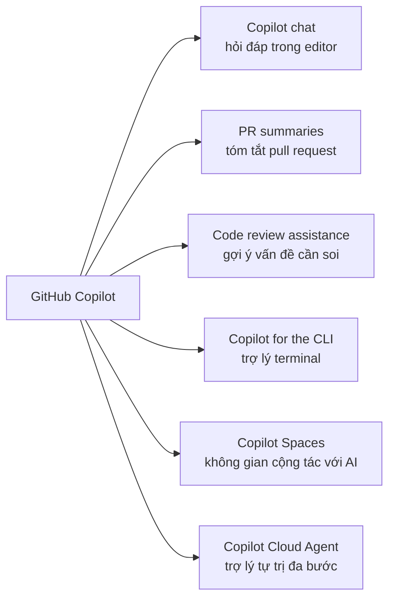
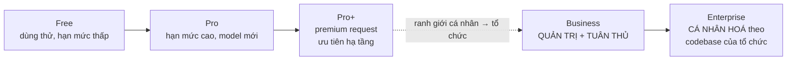

# Note 02 — GitHub Copilot là gì & 5 gói dịch vụ

> **TL;DR:** GitHub Copilot là **AI-powered developer assistant** (*trợ lý lập trình chạy bằng AI*) — còn gọi là **AI pair programmer** (*bạn lập trình cặp bằng AI*) — dùng **ngữ cảnh code và comment của bạn** để sinh code, giải thích logic, refactor, sửa bug và viết test, ngay trong môi trường phát triển. Nền tảng: mô hình **generative pretrained language model** do OpenAI tạo, chạy bằng **OpenAI Codex**. Có extension cho **VS Code, Visual Studio, Vim/Neovim, JetBrains**; riêng **GitHub.com không cần extension**. Sáu tính năng lớn: **Copilot chat · PR summaries · code review assistance · Copilot for the CLI · Copilot Spaces · Copilot Cloud Agent**. Năm gói: **Free · Pro · Pro+ · Business · Enterprise** — mốc phân chia quan trọng nhất là **Business = quản trị tập trung + IP indemnity + public code filter**, còn **Enterprise = cá nhân hoá theo codebase riêng của tổ chức**.

## 1. Copilot là gì

| Khía cạnh | Nội dung |
|---|---|
| **Định nghĩa** | AI-powered developer assistant giúp làm việc nhanh hơn và tự tin hơn **xuyên suốt software development lifecycle** (vòng đời phát triển phần mềm) |
| **Đầu vào (ngữ cảnh)** | **Context của code và comment** của bạn |
| **Làm được gì** | Sinh code · giải thích logic có sẵn · refactor implementation · sửa bug · viết test |
| **Mô hình** | *Generative pretrained language model* do **OpenAI** tạo, chạy bằng **OpenAI Codex** |
| **Vì sao Codex mạnh về code** | Codex hiểu rộng cách con người dùng code và **giỏi sinh code hơn GPT-3**, một phần vì được huấn luyện trên tập dữ liệu có **tỉ trọng public source code lớn hơn** |
| **Môi trường hỗ trợ** | **VS Code · Visual Studio · Vim/Neovim · JetBrains suite** (dạng extension) và **GitHub.com** (không cần extension) |

### Ba con số nghiên cứu (hay bị hỏi nguyên văn)

| Con số | Ý nghĩa |
|---|---|
| **46%** | tỉ lệ code mới hiện được viết bởi AI |
| **55%** | năng suất lập trình viên tổng thể **nhanh hơn** |
| **74%** | lập trình viên cảm thấy **tập trung hơn vào công việc thoả mãn** (*more focused on satisfying work*) |

Ý nghĩa sâu hơn: khi Copilot giúp code nhanh hơn, developer **dồn sức vào bài toán lớn hơn**, **ở trong dòng chảy (flow) lâu hơn** và **thấy công việc trọn vẹn hơn** — đây là lập luận trung tâm của cả module, không chỉ là "gõ code nhanh hơn".

## 2. Sáu tính năng lớn



| Tính năng | Làm gì | Chi tiết ở note |
|---|---|---|
| **Copilot chat** | Trải nghiệm chat tương tác **ngay trong editor**: hỏi về code, giải thích logic/lỗi, sinh test hoặc tài liệu, khám phá cách hiện thực tính năng mới. Chat **hiểu ngữ cảnh code** và trả lời gắn với dự án của bạn | [[07-Copilot-trong-IDE]] |
| **Copilot pull request summaries** | Khi mở PR, Copilot **tự sinh mô tả tóm tắt các thay đổi** → reviewer hiểu ý đồ nhanh, giảm công viết mô tả PR | [[13-Code-Review-va-Pull-Request]] |
| **Copilot code review assistance** | Gợi ý **vấn đề tiềm ẩn cần soi**, mô tả thay đổi, chỉ ra **edge case**, đề xuất cải tiến cho reviewer → rút ngắn chu kỳ review | [[13-Code-Review-va-Pull-Request]] |
| **Copilot for the CLI** | Terminal là nơi developer ở nhiều thứ nhì sau editor, nhưng cú pháp lệnh khó nhớ. CLI cho phép: **hỏi gợi ý lệnh & snippet**, **sinh shell script**, **hiểu output hoặc lỗi**, **tạo và cải tiến project từ CLI** | [[09-Copilot-CLI-va-GitHub-Copilot-App]] |
| **Copilot Spaces** | Nơi riêng để **cộng tác với AI trên một dự án**: khám phá cấu trúc dự án, hỏi câu hỏi hoạch định ở tầng cao, tinh chỉnh yêu cầu, lặp trên thiết kế. Space giữ **kiến thức về repo và workflow** của bạn | [[06-Copilot-Spaces]] |
| **Copilot Cloud Agent** | Trợ lý AI **tự trị** (*autonomous*): thực hiện **tác vụ code nhiều bước** theo chỉ dẫn — sinh nhiều file liên quan, hiện thực cả bộ tính năng, dựng scaffolding từ một đặc tả | [[11-Copilot-Cloud-Agent]] |

```
★ Insight ─────────────────────────────────────
• Nhìn 6 tính năng theo trục "AI ở đâu trong vòng đời": chat + CLI đứng lúc
  VIẾT code; PR summaries + code review đứng lúc REVIEW; Spaces đứng TRƯỚC
  khi viết (hoạch định); Cloud Agent thay bạn CHẠY cả chuỗi. Câu hỏi thi dạng
  "tính năng nào phù hợp tình huống X" giải được bằng cách hỏi ngược:
  tình huống đó nằm ở đoạn nào của vòng đời?
• Copilot khởi đầu chỉ là autocomplete comment + code; giáo trình nhấn mạnh
  "AI-powered autocompletion was just the starting point" — nếu đề hỏi
  "Copilot là gì", đáp án đúng là trợ lý XUYÊN SUỐT vòng đời, không phải
  "công cụ tự động hoàn thành code".
─────────────────────────────────────────────────
```

## 3. Năm gói dịch vụ

> ⚠️ Giáo trình cảnh báo ngay: *"GitHub Copilot plan availability, trials, and usage limits can change over time"* — hạn mức có thể đổi, hãy tra tài liệu chính thức khi cần con số cụ thể. Đề thi vì vậy **hỏi về năng lực phân biệt giữa các gói**, không hỏi con số quota.

| Gói | Dành cho | Năng lực đặc trưng (chỉ có từ gói này trở lên) |
|---|---|---|
| **Free** | Cá nhân, miễn phí | Code completion trong editor hỗ trợ · **hạn mức completion & chat theo tháng có giới hạn** · truy cập các mô hình AI tiên tiến |
| **Pro** | Cá nhân muốn nhiều hơn Free | **Hạn mức cao hơn** · **ưu tiên truy cập mô hình mới nhất** · gợi ý & giải thích code nâng cao · tích hợp các IDE hỗ trợ (VS Code, Visual Studio, JetBrains, Neovim) · **sinh test tự động** và giải thích code |
| **Pro+** | Cá nhân dùng nặng | Toàn bộ Pro · **thêm hạn mức premium request** · **ưu tiên hạ tầng** (priority infrastructure access) khi tài nguyên khan hiếm |
| **Business** | Tổ chức cần quản trị & tuân thủ | **Quản lý tập trung + policy controls** · **security vulnerability filtering** · **code referencing** và **public code filtering** · **IP indemnity** (bồi thường sở hữu trí tuệ) + bảo mật/an toàn/riêng tư mức doanh nghiệp · chat trong IDE và mobile |
| **Enterprise** | Doanh nghiệp lớn | Toàn bộ Business · **gợi ý cá nhân hoá theo code nội bộ/riêng tư** · tích hợp **GitHub Enterprise Cloud** · **tìm kiếm & sinh tài liệu bằng AI trên toàn codebase** · hỗ trợ PR nâng cao (tag + summary bằng AI) · **tuỳ biến và fine-tune model Copilot cho cả tổ chức** · tích hợp sâu với GitHub cho chat và khám phá codebase |

### Hiểu đúng ranh giới giữa các gói



| Ranh giới | Điều gì đổi bản chất |
|---|---|
| Free → Pro → Pro+ | Chỉ **tăng hạn mức và mức ưu tiên**, không thêm tầng năng lực mới |
| Pro+ → **Business** | Chuyển từ *cá nhân* sang *tổ chức*: xuất hiện **policy control tập trung**, **public code filter**, **IP indemnity** — những thứ pháp chế/bảo mật đòi hỏi |
| Business → **Enterprise** | Chuyển từ *quản trị* sang **cá nhân hoá**: Copilot **index codebase của tổ chức** để hiểu sâu và gợi ý sát hơn, và mở khoá **fine-tune private model** cho code completion |

**Diễn giải Enterprise theo giáo trình:** Enterprise = mọi thứ của Business **cộng thêm một lớp cá nhân hoá cho tổ chức**. Nó đưa Copilot vào GitHub như một **giao diện chat** để developer trò chuyện về chính codebase của mình, và bổ sung **action button** rải khắp nền tảng.

```
★ Insight ─────────────────────────────────────
• Ba từ khoá phân biệt gói, thuộc là trả lời được hầu hết câu hỏi domain
  "plans and features" (31% đề thi):
    - "IP indemnity" / "public code filter" / "policy control"  → BUSINESS
    - "index codebase" / "fine-tune private model" / "personalized
      suggestions based on internal code"                       → ENTERPRISE
    - "premium request capacity" / "priority infrastructure"    → PRO+
• Bẫy hay gặp: câu hỏi mô tả một tổ chức cần "chặn gợi ý trùng public code"
  → đáp án là Business (không cần tới Enterprise). Ngược lại, "muốn Copilot
  gợi ý theo thư viện nội bộ của công ty" → bắt buộc Enterprise.
─────────────────────────────────────────────────
```

## Q&A phỏng vấn

**Q1. GitHub Copilot chạy trên mô hình nào, do ai tạo?**
→ *Generative pretrained language model* do **OpenAI** tạo, chạy bằng **OpenAI Codex**. Codex giỏi sinh code hơn GPT-3 vì tập huấn luyện có **tỉ trọng public source code lớn hơn**.

**Q2. Copilot hỗ trợ những môi trường nào? Cái nào không cần extension?**
→ VS Code, Visual Studio, Vim/Neovim, JetBrains IDEs (đều qua extension) và **GitHub.com — không cần extension**.

**Q3. Kể 6 tính năng lớn của Copilot.**
→ Copilot chat · pull request summaries · code review assistance · Copilot for the CLI · Copilot Spaces · Copilot Cloud Agent.

**Q4. Ba con số nghiên cứu về tác động của Copilot?**
→ **46%** code mới do AI viết · **55%** năng suất tổng thể nhanh hơn · **74%** developer thấy tập trung hơn vào công việc thoả mãn.

**Q5. Công ty muốn chặn Copilot gợi ý code trùng với public code và cần IP indemnity. Gói tối thiểu?**
→ **Business**. (Enterprise cũng có nhưng thừa — Enterprise dành cho nhu cầu cá nhân hoá theo codebase riêng.)

**Q6. Đội muốn Copilot gợi ý theo thư viện nội bộ và fine-tune model riêng. Gói nào?**
→ **Enterprise** — chỉ gói này index codebase tổ chức và cho fine-tune private model cho code completion.

**Q7. Pro+ khác Pro ở đâu?**
→ Pro+ = toàn bộ Pro + **thêm hạn mức premium request** + **ưu tiên hạ tầng** khi tài nguyên khan hiếm. Không thêm tầng năng lực quản trị nào.

**Q8. Copilot Cloud Agent khác Copilot chat thế nào (ở mức khái niệm)?**
→ Chat là **hỏi–đáp có ngữ cảnh** trong editor, bạn vẫn là người viết. Cloud Agent là **trợ lý tự trị**, tự thực hiện **tác vụ nhiều bước** (sinh nhiều file liên quan, hiện thực cả feature set, dựng scaffolding từ đặc tả) dưới sự chỉ đạo của bạn.

## Tự kiểm tra

1. Copilot lấy ngữ cảnh từ đâu? *(code và comment của bạn)*
2. Liệt kê 5 gói theo thứ tự tăng dần. *(Free → Pro → Pro+ → Business → Enterprise)*
3. Tính năng nào giúp reviewer hiểu ý đồ PR nhanh hơn? *(Copilot pull request summaries)*
4. Copilot for the CLI làm được 4 việc gì? *(gợi ý lệnh & snippet · sinh shell script · hiểu output/lỗi · tạo và cải tiến project từ CLI)*
5. Copilot Spaces giữ lại kiến thức gì? *(về repository và workflow của bạn)*
6. Vì sao giáo trình cảnh báo về hạn mức các gói? *(availability, trials và usage limits thay đổi theo thời gian — phải tra tài liệu chính thức)*

## Liên quan
- [[00-MOC-GH300|⬅ MOC GH-300]]
- Trước: [[01-Responsible-AI-voi-Copilot]] · Kế tiếp: [[03-Cai-dat-Cau-hinh-va-Cach-tuong-tac]]
- [[07-Copilot-trong-IDE]] · [[09-Copilot-CLI-va-GitHub-Copilot-App]] · [[11-Copilot-Cloud-Agent]]
- [[14-Quan-tri-va-Tuy-bien]] — public code filter và policy chỉ có từ gói Business
- [[../02-Git/00-MOC-Git|MOC: Git]] — nền tảng PR/GitHub mà Copilot cắm vào
