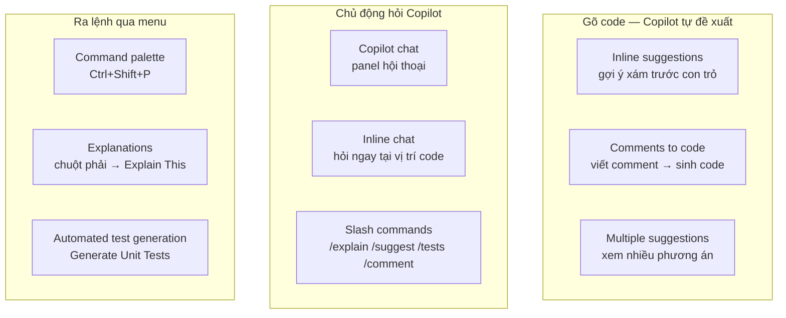
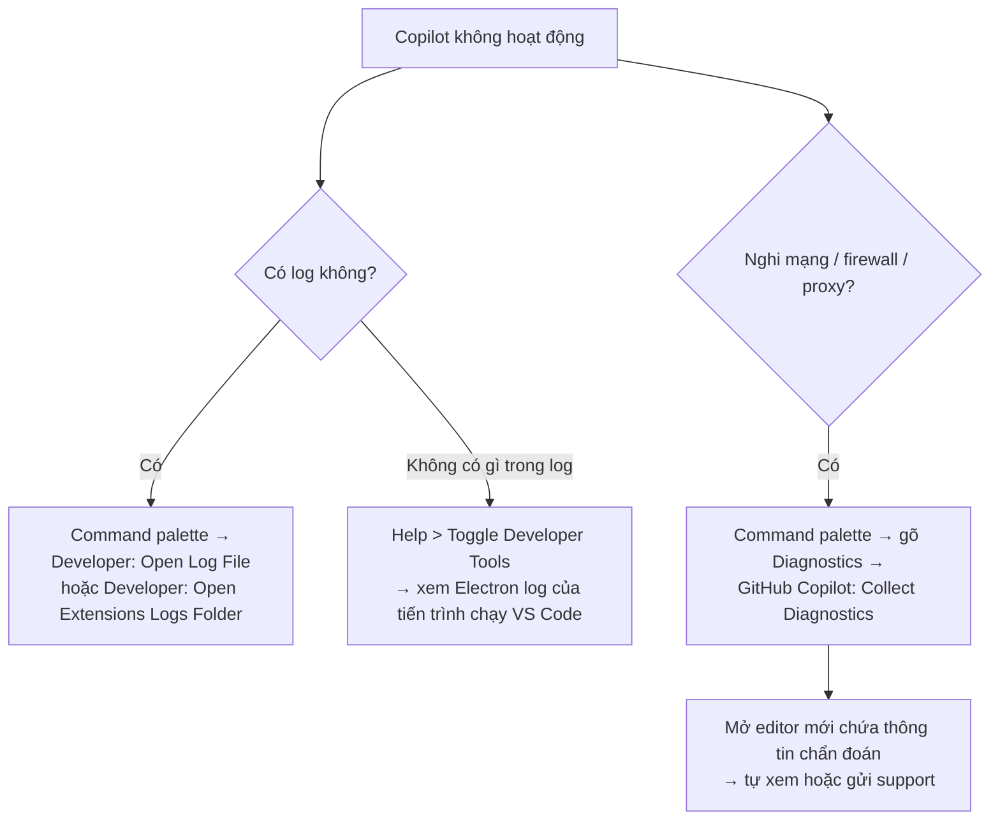

# Note 03 — Cài đặt, cấu hình, troubleshoot & 8 cách tương tác

> **TL;DR:** Có **8 cách kích hoạt Copilot** trong IDE: **inline suggestions** (gợi ý xám trước con trỏ, `Tab`/`→` để nhận, `Esc` để bỏ) · **command palette** (`Ctrl+Shift+P`) · **Copilot chat** · **inline chat** (`Ctrl+I`) · **slash commands** (`/explain`, `/suggest`, `/tests`, `/comment`) · **comments to code** · **multiple suggestions** (`Alt+]`) · **explanations** & **automated test generation**. Cài đặt: sign in GitHub → cài extension → bật/tắt qua **status icon** ở thanh dưới VS Code, chỉnh inline suggestion tại **Settings → Extensions → GitHub Copilot → Editor: Enable Auto Completions**. Troubleshoot: xem log bằng **`Developer: Open Log File`** / **`Developer: Open Extensions Logs Folder`**, xem Electron log qua **Help > Toggle Developer Tools**, và với lỗi mạng/firewall/proxy thì chạy **`GitHub Copilot: Collect Diagnostics`** trong command palette.

## 1. Tám cách tương tác với Copilot



### 1.1. Inline suggestions — gợi ý nội dòng

Dạng hỗ trợ **tức thời nhất**: bạn gõ tới đâu Copilot phân tích code + ngữ cảnh tới đó và **dự đoán đoạn tiếp theo**, hiển thị **kín đáo** dưới dạng **chữ xám (grayed-out text) phía trước con trỏ**.

| Thao tác | Phím |
|---|---|
| **Nhận** gợi ý | `Tab` **hoặc** `→` (mũi tên phải) |
| **Từ chối** gợi ý | Tiếp tục gõ, **hoặc** `Esc` |

Hợp nhất với: **tác vụ lặp lại** và **code khuôn mẫu (boilerplate)** cần nhanh.

```python
def calculate_average(numbers):
    # Bắt đầu gõ ở đây và xem Copilot đề xuất thân hàm
```

### 1.2. Command palette

Cửa vào nhanh tới các chức năng Copilot, làm việc phức tạp chỉ bằng vài phím:

1. Mở palette: `Ctrl+Shift+P` (Windows/Linux) hoặc `Cmd+Shift+P` (Mac).
2. Gõ `Copilot` để xem các lệnh khả dụng.
3. Chọn hành động như **Explain This** hoặc **Generate Unit Tests**.

### 1.3. Copilot chat

Tính năng tương tác cho phép **giao tiếp bằng ngôn ngữ tự nhiên**: hỏi câu hỏi hoặc xin snippet, Copilot trả lời dựa trên đầu vào của bạn.

1. Mở panel Copilot chat trong IDE.
2. Nhập câu hỏi/yêu cầu bằng ngôn ngữ tự nhiên rồi đánh giá phản hồi.

Ví dụ giáo trình: *"How do I implement a binary search in Python?"* → Copilot trả về hàm `binary_search` đầy đủ. Chat **lý tưởng cho việc khám phá khái niệm mới** hoặc gỡ rối cú pháp lạ.

### 1.4. Inline chat — hội thoại ngay trong code

Cho phép **trò chuyện theo ngữ cảnh cụ thể ngay trong editor**, xin sửa code hoặc giải thích mà **không phải chuyển ngữ cảnh** (*without switching contexts*).

1. Đặt con trỏ ở chỗ cần hỗ trợ.
2. `Ctrl+I` (Windows/Linux) hoặc `Cmd+I` (Mac) để mở inline chat.
3. Hỏi hoặc yêu cầu thay đổi **riêng cho vị trí code đó**.

### 1.5. Slash commands — lệnh gạch chéo

**Phím tắt dạng lệnh** giúp thực hiện hành động nhanh mà không phải lần mò menu. Bốn lệnh giáo trình nêu trong module này:

| Lệnh | Tác dụng |
|---|---|
| `/explain` | Giải thích đoạn code đang chọn |
| `/suggest` | Đưa gợi ý code dựa trên ngữ cảnh hiện tại |
| `/tests` | Sinh unit test cho hàm/lớp đang chọn |
| `/comment` | Chuyển comment thành code snippet |

Cách dùng: gõ lệnh trong editor rồi `Enter`. Ví dụ: chọn hàm → mở inline chat → gõ `/explain`.

> Danh sách slash command đầy đủ (kể cả `/setupTests`, `/fixTestFailure`) nằm ở [[07-Copilot-trong-IDE]] và [[16-Unit-Testing-voi-Copilot]].

### 1.6. Comments to code — comment thành code

Copilot dùng **natural language processing** (*xử lý ngôn ngữ tự nhiên*) để **biến comment thành code**: bạn mô tả chức năng mong muốn trong comment, nhấn `Enter`, Copilot sinh code theo mô tả.

```python
# Function to reverse a string
def reverse_string(s):
    return s[::-1]   # ← phần Copilot sinh ra
```

Hợp khi cần **phác code nhanh**, nhất là với tác vụ đơn giản, rõ ràng.

### 1.7. Multiple suggestions — nhiều phương án

Với snippet phức tạp, Copilot có thể đưa **nhiều lựa chọn thay thế**:

1. Khi có gợi ý, để ý **biểu tượng bóng đèn (light bulb)**.
2. Bấm biểu tượng đó, hoặc `Alt+]` (Windows/Linux) / `Option+]` (Mac) để **duyệt qua các phương án**.

Giúp **khám phá nhiều hướng viết code khác nhau** rồi chọn cái phù hợp nhất.

### 1.8. Explanations & Automated test generation

| Tính năng | Cách dùng | Dùng khi |
|---|---|---|
| **Explanations** | Chọn khối code → **chuột phải** → **Copilot: Explain This** → đọc giải thích | Hiểu code dự án lớn, học tập, **review code người khác viết** |
| **Automated test generation** | Chọn hàm/lớp → command palette → **Copilot: Generate Unit Tests** → xem lại các case đề xuất | Giữ **code integrity** và **bắt bug sớm** trong quá trình phát triển |

```python
def add(a, b):
    return a + b

# Copilot có thể sinh test như:
def test_add():
    assert add(2, 3) == 5
    assert add(-1, 1) == 0
    assert add(0, 0) == 0
```

> **Câu chốt của cả unit:** *"Copilot learns from context"* — giữ code **có cấu trúc tốt và comment đầy đủ** thì Copilot hỗ trợ chính xác và sát hơn; càng tương tác nhiều, nó càng hiểu phong cách code và sở thích của bạn.

```
★ Insight ─────────────────────────────────────
• Ba cách "hỏi Copilot" khác nhau ở PHẠM VI ngữ cảnh, không ở năng lực:
    - Copilot chat  → phạm vi rộng, hội thoại nhiều lượt, khám phá khái niệm
    - Inline chat   → phạm vi hẹp tại vị trí con trỏ, sửa đúng chỗ đó
    - Slash command → một hành động định sẵn trên đoạn code đang chọn
  Đề hay hỏi "muốn sửa đúng một hàm mà không rời file thì dùng gì?" → inline chat.
• Phím tắt là phần DỄ MẤT ĐIỂM nhất của note này vì phải nhớ chính xác:
  Tab/→ nhận · Esc bỏ · Ctrl+Shift+P palette · Ctrl+I inline chat · Alt+]
  duyệt phương án. Mẹo: I = Inline chat, ] = ngoặc "sang phương án kế".
─────────────────────────────────────────────────
```

## 2. Đăng ký & cài đặt

### 2.1. Sign up

Trước khi dùng, phải **đăng nhập bằng tài khoản GitHub có quyền truy cập Copilot**.

- Bấm **ảnh đại diện GitHub** → **Settings**.
- **Copilot** nằm ở menu trái, dưới mục **"Code, planning, and automation"**.

Sau khi đăng ký, cài **extension cho môi trường bạn dùng**. Copilot hỗ trợ: **GitHub.com (không cần extension)**, **VS Code**, **Visual Studio**, **JetBrains IDEs**, **Neovim** (extension dạng kín đáo — *unobtrusive*).

### 2.2. Cài extension trong VS Code

1. Vào trang extension **GitHub Copilot** trên **Visual Studio Marketplace** → **Install**.
2. Hộp thoại bật lên hỏi mở VS Code → **Open**.
3. Trong VS Code, tab **Extension: GitHub Copilot** → **Install**.
4. Nếu chưa từng uỷ quyền VS Code cho tài khoản GitHub → chọn **Sign in to GitHub**.

### 2.3. Bật / tắt Copilot

| Việc | Nơi thao tác |
|---|---|
| **Bật/tắt Copilot** | **Status icon** ở **thanh dưới (bottom pane)** cửa sổ VS Code → **Enable** hoặc **Disable** |
| Khi tắt, VS Code hỏi phạm vi | **Disable completions** (tắt toàn cục) hoặc **Disable completions for LANGUAGE** (chỉ ngôn ngữ của file đang mở) |
| **Bật/tắt inline suggestions** | **File → Preferences → Settings** → pane trái chọn **Extensions** → **GitHub Copilot** → tick/bỏ tick **Editor: Enable Auto Completions** |

Ở phần settings này bạn cũng **chỉ định bật/tắt inline suggestion theo từng ngôn ngữ**.

> Mẹo nhận biết trạng thái: khi Copilot **đang bật**, **màu nền của status icon trùng màu thanh trạng thái**.

## 3. Troubleshoot trong VS Code



| Tình huống | Cách xử lý |
|---|---|
| **Chẩn đoán lỗi kết nối** | Extension lưu log ở **vị trí log chuẩn của VS Code extension**. Mở command palette rồi gõ **`Developer: Open Log File`** hoặc **`Developer: Open Extensions Logs Folder`** |
| **Có lỗi nhưng log trống** (hiếm) | Xem log của **chính tiến trình chạy VS Code và extension** — tức **Electron logs**: **Help → Toggle Developer Tools** |
| **Network restrictions / firewall / proxy** | Mở command palette (`Shift+Command+P` trên Mac, `Ctrl+Shift+P` trên Windows/Linux) → gõ **`Diagnostics`** → chọn **`GitHub Copilot: Collect Diagnostics`**. Lệnh này mở một **editor mới chứa thông tin liên quan** để bạn tự soi hoặc gửi cho support |

```
★ Insight ─────────────────────────────────────
• Ba lệnh troubleshoot ứng với ba TẦNG khác nhau, đề thi hay đảo chỗ:
    - Developer: Open Log File / Open Extensions Logs Folder
        → tầng EXTENSION (log Copilot ghi ra)
    - Help > Toggle Developer Tools (Electron logs)
        → tầng TIẾN TRÌNH chạy VS Code, dùng khi log extension trống rỗng
    - GitHub Copilot: Collect Diagnostics
        → tầng MẠNG/KẾT NỐI, dùng khi nghi firewall/proxy
  Nhớ mốc: "log trống" → Developer Tools; "nghi mạng" → Collect Diagnostics.
• Việc tắt Copilot hỏi lại "toàn cục hay theo ngôn ngữ" là chi tiết nhỏ nhưng
  rất hay được hỏi — vì nó cho thấy Copilot cấu hình được ở mức PER-LANGUAGE,
  cùng logic với ô Editor: Enable Auto Completions.
─────────────────────────────────────────────────
```

## Q&A phỏng vấn

**Q1. Inline suggestion hiển thị thế nào, nhận và từ chối bằng gì?**
→ **Chữ xám (grayed-out) phía trước con trỏ**. Nhận bằng **`Tab`** hoặc **`→`**; từ chối bằng cách **tiếp tục gõ** hoặc **`Esc`**.

**Q2. Muốn xem các phương án code khác nhau cho cùng một chỗ, làm sao?**
→ **Multiple suggestions**: bấm **biểu tượng bóng đèn**, hoặc **`Alt+]`** (Windows/Linux) / **`Option+]`** (Mac) để duyệt qua các lựa chọn.

**Q3. Bạn muốn sửa một hàm cụ thể mà không rời khỏi file. Dùng gì?**
→ **Inline chat** — `Ctrl+I` / `Cmd+I` tại vị trí con trỏ, hỏi/yêu cầu thay đổi riêng cho đoạn code đó, **không phải chuyển ngữ cảnh**.

**Q4. Bốn slash command cơ bản trong module này?**
→ `/explain` (giải thích code chọn) · `/suggest` (gợi ý theo ngữ cảnh) · `/tests` (sinh unit test) · `/comment` (chuyển comment thành code).

**Q5. Bật/tắt inline suggestion ở đâu trong VS Code?**
→ **File → Preferences → Settings → Extensions → GitHub Copilot → Editor: Enable Auto Completions**. Có thể chỉ định theo **từng ngôn ngữ**.

**Q6. Copilot báo lỗi kết nối, nghi do proxy công ty. Lệnh nào cần chạy?**
→ **`GitHub Copilot: Collect Diagnostics`** từ command palette — mở editor mới chứa thông tin chẩn đoán để tự xem hoặc gửi support.

**Q7. Log extension trống mà vẫn lỗi thì xem ở đâu?**
→ **Electron logs** của tiến trình chạy VS Code: **Help → Toggle Developer Tools**.

**Q8. Trong GitHub Settings, mục Copilot nằm ở đâu?**
→ Menu bên trái, dưới nhóm **"Code, planning, and automation"**.

## Tự kiểm tra

1. Liệt kê 8 cách tương tác với Copilot trong IDE.
2. Ghi ra 5 phím tắt: nhận gợi ý · từ chối · command palette · inline chat · duyệt phương án. *(Tab hoặc → · Esc · Ctrl+Shift+P · Ctrl+I · Alt+])*
3. "Explain This" gọi bằng cách nào? *(chuột phải trên khối code đã chọn → Copilot: Explain This; hoặc qua command palette)*
4. Khi tắt Copilot, VS Code cho chọn phạm vi nào? *(toàn cục — Disable completions; hoặc theo ngôn ngữ file đang mở — Disable completions for LANGUAGE)*
5. Ba tầng troubleshoot và lệnh tương ứng? *(extension log → Developer: Open Log File / Open Extensions Logs Folder; tiến trình → Help > Toggle Developer Tools; mạng → GitHub Copilot: Collect Diagnostics)*
6. Vì sao giữ code có cấu trúc và comment tốt lại quan trọng? *(Copilot learns from context — ngữ cảnh sạch thì gợi ý chính xác và sát hơn)*

## Liên quan
- [[00-MOC-GH300|⬅ MOC GH-300]]
- Trước: [[02-Copilot-la-gi-va-cac-goi]] · Kế tiếp (cụm B): [[04-Prompt-Engineering-voi-Copilot]]
- [[07-Copilot-trong-IDE]] — bản đầy đủ về chat: scope reference, slash command, model selection
- [[16-Unit-Testing-voi-Copilot]] — `/setupTests`, `/tests`, `/fixTestFailure` ở mức nâng cao
- [[../02-Git/02-Install-Configure-Git|Git/02 — Install & Configure]] — cùng mạch "cài đặt môi trường dev"
