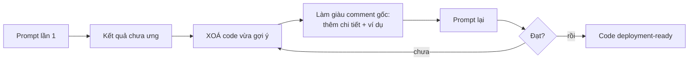

# Note 04 — Prompt engineering với GitHub Copilot

> **TL;DR:** **Prompt engineering** (*kỹ thuật soạn câu lệnh*) là **quá trình soạn chỉ dẫn rõ ràng để dẫn dắt hệ thống AI sinh ra code phù hợp ngữ cảnh dự án** — bảo đảm code đúng **cú pháp (syntactically)**, **chức năng (functionally)** và **ngữ cảnh (contextually)**. Nguyên tắc gốc là **4 Ss: Single · Specific · Short · Surround**. Từ đó ra 4 best practice: *provide enough clarity · provide enough context with details · provide examples for learning · assert and iterate*. Copilot học từ ví dụ bạn đưa theo 3 mức: **zero-shot** (không ví dụ) → **one-shot** (một ví dụ) → **few-shot** (nhiều ví dụ). Với hội thoại dài, dùng **chain prompting** kèm tóm tắt/reset để tiết kiệm — lịch sử chat đầy đủ tốn **2–3 PRU mỗi lượt**, tóm tắt lại giữ gần **1 PRU/request**. Cuối cùng, **role prompting** ("Act as a…") ép Copilot đứng ở vai chuyên gia (bảo mật / tối ưu hiệu năng / kiểm thử) để ra code sát đích ngay từ lần đầu.

## 1. Prompt engineering là gì

> *"Prompt engineering is the process of crafting clear instructions to guide AI systems, like GitHub Copilot, to generate context-appropriate code tailored to your project's specific needs."*

Mục tiêu: bảo đảm code **syntactically, functionally, and contextually correct** — đúng cú pháp, đúng chức năng, đúng ngữ cảnh. Chất lượng code Copilot trả về và **tốc độ bạn lặp tới lời giải hoàn hảo** phụ thuộc vào việc prompt của bạn **rõ ràng và có chiến lược** đến đâu.

Nền tảng để Copilot làm được điều này: nó được huấn luyện trên dữ liệu gồm **cả ngôn ngữ tự nhiên và hàng tỉ dòng source code** từ nguồn công khai, trong đó có **code trong public GitHub repository**.

## 2. Bốn nguyên tắc gốc — "4 Ss"

| S | Nguyên tắc | Nội dung | Sai lầm tương ứng |
|---|---|---|---|
| **Single** | *Đơn nhất* | Luôn tập trung prompt vào **một tác vụ/câu hỏi được định nghĩa rõ** | Nhồi 3 yêu cầu vào một comment |
| **Specific** | *Cụ thể* | Chỉ dẫn phải **tường minh và chi tiết** → gợi ý sát và chính xác hơn | "Viết hàm xử lý dữ liệu" (mơ hồ) |
| **Short** | *Ngắn gọn* | Vẫn cụ thể nhưng **súc tích**, không làm Copilot quá tải hay rối tương tác | Viết cả trang mô tả |
| **Surround** | *Bao quanh* | Dùng **tên file mô tả rõ nghĩa** và **mở sẵn các file liên quan** → Copilot có ngữ cảnh giàu | Đặt tên `test1.py`, đóng hết tab khác |

> **Note gốc:** Copilot còn dùng **các tab đang mở song song** trong editor để lấy thêm ngữ cảnh về yêu cầu của code — đó chính là cơ chế đứng sau chữ **Surround**.

```
★ Insight ─────────────────────────────────────
• "Surround" là chữ S dễ quên nhất nhưng lại là chữ duy nhất KHÔNG nói về
  câu chữ trong prompt — nó nói về MÔI TRƯỜNG quanh prompt: tên file, các tab
  đang mở. Đề thi hay hỏi kiểu "làm gì để Copilot hiểu dự án hơn mà không
  sửa prompt?" → đáp án nằm ở Surround (đặt tên file có nghĩa, mở file liên quan).
• Single và Short nghe giống nhau nhưng khác trục: Single = MỘT chủ đề
  (chiều rộng); Short = ÍT chữ (độ dài). Một prompt có thể ngắn mà vẫn vi phạm
  Single ("viết hàm và test và docs" — 8 chữ, 3 việc).
─────────────────────────────────────────────────
```

## 3. Bốn best practice (dựng trên 4 Ss)

### 3.1. Provide enough clarity — đủ rõ ràng
Dựa trên **Single + Specific**: luôn hướng tới tính tường minh. Ví dụ chuẩn của giáo trình:

> *"Write a Python function to filter and return even numbers from a given list"*

Prompt này vừa **single-focused** (một việc: lọc số chẵn) vừa **specific** (rõ ngôn ngữ, rõ đầu vào, rõ đầu ra).

### 3.2. Provide enough context with details — đủ ngữ cảnh
Dựa trên **Surround**: càng nhiều thông tin ngữ cảnh, gợi ý càng khớp. Cách làm thực tế: **thêm comment ở đầu file** mô tả chi tiết điều bạn muốn.

Giáo trình lưu ý cách viết: dùng **các bước (steps)** để mô tả chi tiết **mà vẫn ngắn** — tức kết hợp được cả **Short** lẫn **Specific**.

```python
# Ứng dụng quản lý kho hàng
# 1. Đọc file CSV chứa cột: sku, name, quantity, unit_price
# 2. Bỏ qua dòng có quantity <= 0
# 3. Trả về dict {sku: tổng giá trị tồn} sắp xếp giảm dần theo giá trị
def build_inventory_report(csv_path: str) -> dict:
    # Copilot sinh thân hàm dựa trên 3 bước ở trên
```

### 3.3. Provide examples for learning — cho ví dụ để học
Ví dụ **làm rõ yêu cầu và kỳ vọng**, minh hoạ khái niệm trừu tượng, giúp Copilot **nắm pattern nhanh** → gợi ý đầu tiên đã chính xác hơn, **ít vòng chỉnh sửa hơn**.

Đặc biệt hiệu quả với: **boilerplate code**, **test template**, và các **hiện thực lặp đi lặp lại** tạo nền cho tính năng lớn.

### 3.4. Assert and iterate — khẳng định và lặp
Prompt đầu tiên **không phải lúc nào cũng ra code production-ready, và điều đó bình thường**. Thay vì mất thời gian sửa tay đầu ra, hãy coi nó là **khởi đầu của một cuộc đối thoại hiệu quả** với Copilot.

Quy trình đúng khi kết quả chưa ưng:



Điểm mấu chốt: **đừng làm lại từ đầu** (*don't start from scratch*) — **xoá code gợi ý, làm giàu comment ban đầu bằng chi tiết và ví dụ, rồi prompt lại**. Mỗi vòng lặp bồi thêm hiểu biết của Copilot về yêu cầu cụ thể của bạn, nên cách này thường **nhanh hơn cả phát triển truyền thống**.

## 4. Copilot học từ prompt của bạn: zero / one / few-shot

| Cách | Số ví dụ bạn đưa | Copilot dựa vào | Mạnh nhất khi |
|---|---|---|---|
| **Zero-shot learning** | **0** | Hoàn toàn **huấn luyện nền** của nó | Hiện thực nhanh **pattern phổ biến** và **chức năng chuẩn** |
| **One-shot learning** | **1** | Huấn luyện nền + **một mẫu của bạn** | Tạo **hiện thực nhất quán** khắp codebase, giữ **chuẩn code** trong khi tăng tốc phát triển |
| **Few-shot learning** | **Nhiều** | Nhiều mẫu → cân bằng giữa **tính khó đoán của zero-shot** và **độ chính xác của fine-tuning** | Sinh **hiện thực tinh vi**, xử lý **nhiều kịch bản và edge case**, giảm thời gian test/tinh chỉnh thủ công |

Ví dụ theo giáo trình:

- **Zero-shot** — chỉ viết comment "hàm đổi độ C sang độ F", Copilot sinh code production-ready dựa trên huấn luyện sẵn có.
- **One-shot** — đưa sẵn một hàm đổi nhiệt độ mẫu, rồi bảo Copilot viết hàm tương tự.
- **Few-shot** — đưa vài mẫu, rồi yêu cầu sinh code chào hỏi **tuỳ theo thời điểm trong ngày**.

```python
# FEW-SHOT: đưa 2 mẫu để Copilot bắt pattern
# greet(6)  -> "Good morning"
# greet(14) -> "Good afternoon"
# greet(21) -> ?
def greet(hour: int) -> str:
    ...
```

```
★ Insight ─────────────────────────────────────
• Few-shot được mô tả là "cân bằng giữa zero-shot unpredictability và
  precision of fine-tuning" — tức nó là lựa chọn giữa hai thái cực, KHÔNG
  phải lựa chọn tốt nhất trong mọi tình huống. Với pattern chuẩn (CRUD, đổi
  đơn vị) thì zero-shot đủ và nhanh hơn; nhồi ví dụ chỉ tốn context window.
• Chọn theo mục tiêu, không theo "càng nhiều càng tốt":
    - cần NHANH, việc phổ biến          → zero-shot
    - cần ĐỒNG NHẤT với code sẵn có     → one-shot
    - cần PHỦ nhiều kịch bản/edge case  → few-shot
─────────────────────────────────────────────────
```

## 5. Chain prompting & quản lý lịch sử chat

Khi làm tính năng phức tạp nhiều bước, bạn sẽ có hội thoại dài với Copilot Chat. Ngữ cảnh chi tiết giúp Copilot hiểu yêu cầu, **nhưng giữ lịch sử hội thoại dài trở nên kém hiệu quả và tốn kém về xử lý**.

Ví dụ chuỗi lượt của giáo trình:

| Lượt | Prompt |
|---|---|
| 1 | "Create a user authentication function" |
| 2 | "Add error handling for invalid credentials" |
| 3 | "Add unit tests for the authentication function" |
| 4 | "Add JSDoc comments to document the function" |
| 5 | "Optimize the function for better performance" |

Mỗi lượt xây trên ngữ cảnh trước, nhưng **lịch sử đầy đủ cứ dài mãi ra**.

> ⚠️ **Con số phải nhớ:** prompt dài kèm **toàn bộ lịch sử hội thoại có thể tiêu tốn 2–3 PRU mỗi lượt**. **Tóm tắt ngữ cảnh hoặc reset hội thoại** giữ mức gần **1 PRU mỗi request**.
> *(PRU = Premium Request Unit — đơn vị "yêu cầu cao cấp" dùng để tính hạn mức Copilot; xem [[13-Code-Review-va-Pull-Request]].)*

**Ba cách quản lý hiệu quả:**

1. **Tóm tắt ngữ cảnh khi hội thoại dài ra** — ví dụ: *"Based on our previous discussion about user authentication, now add rate limiting to prevent brute force attacks"*.
2. **Reset và cấp ngữ cảnh tập trung cho tính năng mới** — bắt đầu lại với thông tin cốt yếu thay vì kéo theo cả cuộc hội thoại.
3. **Tham chiếu ngắn gọn tới việc đã làm** thay vì lặp lại toàn bộ đoạn hiện thực.

## 6. Role prompting — đóng vai chuyên gia

**Role prompting** = chỉ thị Copilot **hành xử như một loại chuyên gia cụ thể**, cải thiện rõ chất lượng và độ liên quan của code trong các lĩnh vực chuyên sâu, giúp **ra giải pháp đúng đích ngay lần đầu**.

| Vai | Prompt mẫu (nguyên văn) | Kết quả thường thấy |
|---|---|---|
| **Security expert** | *"Act as a cybersecurity expert. Create a password validation function that checks for common vulnerabilities and follows OWASP guidelines."* | **Input sanitization** (làm sạch đầu vào) · chống các tấn công phổ biến · pattern kiểm định chuẩn ngành · thực hành bảo mật tốt |
| **Performance optimization expert** | *"Act as a performance optimization expert. Refactor this sorting algorithm to handle large datasets efficiently."* | Thuật toán & cấu trúc dữ liệu tối ưu · hiện thực tiết kiệm bộ nhớ · cân nhắc **scalability** · gợi ý **performance monitoring** |
| **Testing specialist** | *"Act as a testing specialist. Create comprehensive unit tests for this payment processing module, including edge cases and error scenarios."* | **Độ phủ test kỹ** · xử lý **edge case** · **mock implementation** · **error condition testing** (kiểm thử điều kiện lỗi) |

Lợi ích tổng: đưa **chuyên môn lĩnh vực vào ngay bản hiện thực đầu tiên**, **giảm số vòng sửa**.

```
★ Insight ─────────────────────────────────────
• Role prompting và few-shot giải cùng một bài toán bằng hai con đường ngược
  nhau: few-shot dạy Copilot bằng VÍ DỤ CỤ THỂ (bottom-up), role prompting
  dạy bằng KHUNG TƯ DUY chuyên gia (top-down). Với domain có chuẩn ngành sẵn
  (OWASP, WCAG) thì role prompting hiệu quả hơn vì bạn không phải tự viết ví dụ.
• Cả 3 vai trong giáo trình đều theo đúng công thức: "Act as a <chuyên gia>."
  + <động từ hành động> + <đối tượng> + <ràng buộc/chuẩn>. Nhớ công thức này
  là tự đặt được vai mới (accessibility expert, database architect…).
─────────────────────────────────────────────────
```

## Q&A phỏng vấn

**Q1. Định nghĩa prompt engineering và ba tiêu chí "đúng" của code sinh ra.**
→ Quá trình **soạn chỉ dẫn rõ ràng** để dẫn dắt AI sinh code phù hợp nhu cầu cụ thể của dự án; bảo đảm code đúng **cú pháp (syntactically)**, **chức năng (functionally)** và **ngữ cảnh (contextually)**.

**Q2. 4 Ss là gì?**
→ **Single** (một tác vụ rõ ràng) · **Specific** (tường minh, chi tiết) · **Short** (súc tích) · **Surround** (tên file mô tả + mở sẵn file liên quan).

**Q3. Copilot còn lấy ngữ cảnh từ đâu ngoài file đang mở?**
→ **Các tab đang mở song song** trong editor.

**Q4. Kết quả đầu tiên không ưng thì làm gì theo "assert and iterate"?**
→ **Không làm lại từ đầu**: **xoá code gợi ý**, **làm giàu comment ban đầu bằng chi tiết và ví dụ**, rồi **prompt lại**.

**Q5. Phân biệt zero-shot, one-shot, few-shot và tình huống dùng.**
→ Zero-shot = 0 ví dụ, dùng cho pattern phổ biến/chức năng chuẩn. One-shot = 1 ví dụ, dùng để giữ **tính nhất quán** với chuẩn code sẵn có. Few-shot = nhiều ví dụ, dùng khi cần phủ **nhiều kịch bản và edge case**.

**Q6. Hội thoại dài tốn bao nhiêu PRU và cách giảm?**
→ Lịch sử đầy đủ tốn **2–3 PRU/lượt**; **tóm tắt ngữ cảnh** hoặc **reset hội thoại** đưa về gần **1 PRU/request**. Ngoài ra dùng **tham chiếu ngắn gọn** thay vì lặp lại code.

**Q7. Role prompting là gì? Cho một ví dụ đầy đủ.**
→ Chỉ thị Copilot đóng vai chuyên gia lĩnh vực. Ví dụ: *"Act as a cybersecurity expert. Create a password validation function that checks for common vulnerabilities and follows OWASP guidelines."* → sinh code có input sanitization, chống tấn công phổ biến, theo chuẩn ngành.

**Q8. Bạn cần Copilot sinh hàm theo đúng convention đặt tên và cấu trúc của repo hiện tại. Kỹ thuật nào?**
→ **One-shot learning** — đưa một hàm mẫu trong repo rồi yêu cầu viết hàm tương tự (kết hợp **Surround**: mở sẵn file liên quan).

## Tự kiểm tra

1. Viết ra 4 Ss và một câu giải thích mỗi chữ.
2. Bốn best practice tên tiếng Anh là gì? *(provide enough clarity · provide enough context with details · provide examples for learning · assert and iterate)*
3. Few-shot "cân bằng" giữa hai thứ gì? *(zero-shot unpredictability ↔ precision of fine-tuning)*
4. Con số PRU cần nhớ trong chain prompting? *(2–3 PRU/lượt với lịch sử đầy đủ; ~1 PRU/request khi tóm tắt hoặc reset)*
5. Ba vai chuyên gia giáo trình nêu và kết quả đặc trưng của từng vai?
6. Câu prompt mẫu cho "clarity" trong giáo trình là gì? *("Write a Python function to filter and return even numbers from a given list")*

## Liên quan
- [[00-MOC-GH300|⬅ MOC GH-300]]
- Trước: [[03-Cai-dat-Cau-hinh-va-Cach-tuong-tac]] · Kế tiếp: [[05-Copilot-xu-ly-Prompt-va-Du-lieu]]
- [[06-Copilot-Spaces]] — cách "đóng khung" ngữ cảnh ở mức dự án thay vì mức prompt
- [[13-Code-Review-va-Pull-Request]] — PRU là gì và tiêu ở đâu
- [[../../05-Cloud/02-Azure/AI-103/04-Toi-uu-Model-va-Responsible-GenAI|AI-103/04]] — thang prompt engineering → RAG → fine-tuning ở góc Azure
