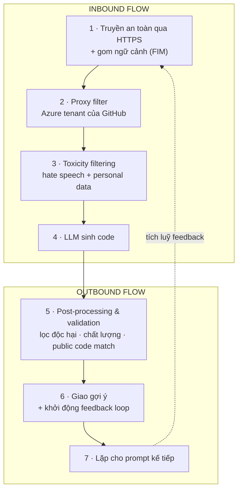
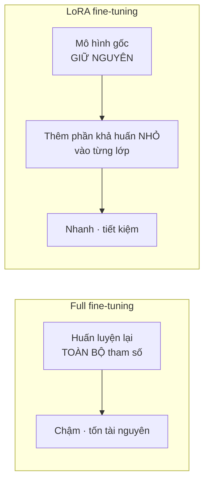

# Note 05 — Copilot xử lý prompt & dữ liệu thế nào

> **TL;DR:** Prompt của bạn đi qua **7 bước**, chia thành **inbound flow** (bước 1-4) và **outbound flow** (bước 5-7): (1) **truyền an toàn qua HTTPS + gom ngữ cảnh** (code trước/sau con trỏ, tên & loại file, tab kề, cấu trúc dự án, ngôn ngữ/framework, kỹ thuật **FIM**) → (2) **proxy filter** đặt trong **Azure tenant do GitHub sở hữu** → (3) **toxicity filtering** (chặn hate speech + dữ liệu cá nhân) → (4) **LLM sinh code** → (5) **post-processing & validation** (lọc độc hại lần nữa, kiểm chất lượng XSS/SQL injection, tuỳ chọn **chặn gợi ý >~150 ký tự trùng public code**) → (6) **giao gợi ý + khởi động feedback loop** → (7) **lặp lại**. Về dữ liệu: **code completion trong editor KHÔNG giữ prompt** (huỷ ngay sau khi trả gợi ý); **Copilot Chat ngoài editor giữ 28 ngày**. Context window: Copilot thường **~200-500 dòng code / vài nghìn token**, riêng **Copilot Chat 4k token**. Nền tảng là **LLM**, được **fine-tune**, và GitHub dùng **LoRA** — thêm phần khả huấn nhỏ vào từng lớp thay vì huấn luyện lại toàn bộ.

## 1. Pipeline 7 bước xử lý prompt



### Bước 1 — Secure prompt transmission and context gathering

Prompt được **truyền an toàn qua HTTPS**, bảo đảm comment ngôn ngữ tự nhiên của bạn tới server Copilot **an toàn và bảo mật**. Prompt có thể là **Copilot chat** hoặc **comment ngôn ngữ tự nhiên** viết trong code.

**Song song đó**, Copilot gom 6 loại chi tiết ngữ cảnh:

| # | Ngữ cảnh thu thập | Giúp gì |
|---|---|---|
| 1 | **Code trước và sau vị trí con trỏ** | Hiểu ngữ cảnh trực tiếp của prompt |
| 2 | **Tên file và loại file** đang sửa | Điều chỉnh gợi ý theo đúng loại file |
| 3 | **Thông tin về các tab đang mở kề bên** | Code sinh ra khớp với các đoạn code khác cùng dự án |
| 4 | **Cấu trúc dự án và đường dẫn file** | Hiểu tổ chức code |
| 5 | **Ngôn ngữ lập trình và framework** | Sinh code đúng hệ sinh thái |
| 6 | **Tiền xử lý bằng kỹ thuật FIM** | Xem xét **cả code phía trước lẫn phía sau** |

> **FIM = Fill-in-the-Middle** (*điền vào giữa*) — thay vì chỉ nhìn code phía trên con trỏ để đoán tiếp, Copilot nhìn **cả hai phía**, mở rộng hiểu biết của mô hình về ngữ cảnh → gợi ý chính xác và liên quan hơn.

Kết quả bước này: **biến yêu cầu ở tầng cao của người dùng thành một tác vụ lập trình cụ thể**.

### Bước 2 — Proxy filter

Sau khi gom ngữ cảnh và dựng xong prompt, nó được chuyển an toàn tới một **proxy server đặt trong Microsoft Azure tenant do GitHub sở hữu**. Proxy **lọc lưu lượng**, chặn các nỗ lực **hack prompt** hoặc **thao túng hệ thống để lộ chi tiết cách mô hình sinh code**.

### Bước 3 — Toxicity filtering

Trước khi trích xuất ý định và sinh code, Copilot chạy cơ chế **lọc nội dung** để bảo đảm code và phản hồi **không chứa hoặc cổ vũ**:

| Loại | Nội dung bị chặn |
|---|---|
| **Hate speech and inappropriate content** | Ngôn từ thù ghét, xúc phạm, nội dung không phù hợp có thể gây hại |
| **Personal data** | Dữ liệu cá nhân như **tên, địa chỉ, số định danh** — bảo vệ quyền riêng tư và an toàn dữ liệu |

### Bước 4 — Code generation with LLM

Prompt đã được lọc và phân tích được chuyển tới **LLM models** để sinh gợi ý code, dựa trên hiểu biết của Copilot về prompt **và ngữ cảnh xung quanh**.

### Bước 5 — Post-processing and response validation

Đây là bước đầu của **outbound flow** và là bước nhiều chi tiết thi nhất:

1. **Toxicity filter chạy lần hai** — loại bỏ nội dung độc hại/xúc phạm trong phần **do mô hình sinh ra**.
2. **Proxy server áp lớp kiểm tra cuối** về chất lượng code, bảo mật và chuẩn đạo đức:

| Kiểm tra | Nội dung |
|---|---|
| **Code quality** | Soi các bug/lỗ hổng phổ biến như **cross-site scripting (XSS)** và **SQL injection** |
| **Matching public code** *(tuỳ chọn)* | Admin có thể **bật bộ lọc** ngăn Copilot trả về gợi ý **dài hơn ~150 ký tự** nếu chúng **giống sát code công khai đã tồn tại trên GitHub** — tránh việc trùng khớp ngẫu nhiên bị đề xuất như nội dung nguyên bản |

3. Nếu **bất kỳ phần nào của phản hồi trượt kiểm tra**, nó bị **cắt bớt (truncated)** hoặc **loại bỏ (discarded)**.

### Bước 6 — Suggestion delivery and feedback loop initiation

**Chỉ những phản hồi vượt qua toàn bộ bộ lọc mới được giao tới người dùng.** Copilot sau đó khởi động **feedback loop** dựa trên hành động của bạn để:

- **Mở rộng kiến thức từ những gợi ý được chấp nhận.**
- **Học và cải thiện từ những lần bạn sửa hoặc từ chối gợi ý.**

### Bước 7 — Repeat for subsequent prompts

Quá trình lặp lại với mỗi prompt mới. Theo thời gian, Copilot áp dụng **dữ liệu feedback và tương tác tích luỹ**, kể cả chi tiết ngữ cảnh, để hiểu ý định người dùng tốt hơn và tinh chỉnh năng lực sinh code.

```
★ Insight ─────────────────────────────────────
• Toxicity filter chạy HAI LẦN (bước 3 trên đầu vào, bước 5 trên đầu ra) —
  đây là chi tiết cực dễ mất điểm. Bước 3 chặn bạn NHẬP nội dung xấu / dữ
  liệu cá nhân; bước 5 chặn mô hình TRẢ VỀ nội dung xấu.
• Proxy filter (bước 2) và post-processing (bước 5) cùng do proxy server đảm
  nhiệm nhưng khác mục tiêu: bước 2 chống TẤN CÔNG (hack prompt, moi bí mật
  mô hình); bước 5 chống LỖI CHẤT LƯỢNG (XSS, SQLi, trùng public code).
• Ranh giới inbound/outbound nằm giữa bước 4 và 5 — LLM là điểm quay đầu.
─────────────────────────────────────────────────
```

## 2. Copilot xử lý dữ liệu của bạn thế nào

### 2.1. Code suggestions (trong editor)

| Điểm | Nội dung |
|---|---|
| **Có giữ prompt không?** | **KHÔNG.** Copilot trong code editor **không giữ lại prompt** (code hay ngữ cảnh khác dùng để tạo gợi ý) để huấn luyện foundational model |
| **Xử lý sau khi trả gợi ý** | **Huỷ prompt ngay** khi gợi ý được trả về |
| **Người dùng Individual** | Có thể **opt-out** khỏi việc chia sẻ prompt với GitHub — nếu không opt-out, prompt sẽ được dùng để **fine-tune foundational model** của GitHub |

### 2.2. Copilot Chat

Chat là **nền tảng tương tác** cho phép hội thoại với trợ lý AI. Ba bước **khác biệt so với code completion**:

| Bước | Nội dung |
|---|---|
| **Formatting** | Copilot **định dạng kỹ phản hồi** cho hợp giao diện chat: **highlight code snippet** để dễ đọc, có thể kèm **tuỳ chọn chèn thẳng vào code**. Hiển thị trong cửa sổ Copilot Chat của IDE để bạn xem và tương tác |
| **User engagement** | Bạn có thể **hỏi tiếp, xin làm rõ, cấp thêm đầu vào**. Giao diện chat **duy trì lịch sử hội thoại** để hiểu ngữ cảnh ở các lượt sau |
| **Data retention** | Với Copilot Chat **dùng NGOÀI code editor**, GitHub **thường giữ prompt, gợi ý và ngữ cảnh hỗ trợ trong 28 ngày**. Chính sách với Chat **bên trong code editor có thể khác** |

> Quy tắc 28 ngày này áp dụng tương tự cho **CLI, Mobile và GitHub Copilot Chat trên GitHub.com**.

```
★ Insight ─────────────────────────────────────
• Cặp đối lập phải thuộc lòng cho domain "how Copilot handles data" (15% đề):
    - Code completion trong editor → KHÔNG giữ prompt, huỷ ngay
    - Copilot Chat ngoài editor    → GIỮ 28 ngày (kèm CLI, Mobile, GitHub.com)
  Bẫy hay gặp là đảo hai vế, hoặc đổi 28 ngày thành 30 ngày.
• Chi tiết "Individual subscribers can opt-out" cho thấy dữ liệu KHÔNG mặc
  định được bảo vệ khỏi fine-tuning ở gói cá nhân — đây là một lý do thực tế
  để tổ chức dùng Business/Enterprise.
─────────────────────────────────────────────────
```

## 3. Bốn loại prompt Copilot Chat hỗ trợ

| Loại | Mô tả | Ví dụ gốc |
|---|---|---|
| **Direct Questions** | Hỏi cụ thể về khái niệm lập trình, thư viện, hoặc gỡ rối | *"How do I implement a quick sort algorithm in Python?"* · *"Why is my React component not rendering?"* |
| **Code-Related Requests** | Yêu cầu sinh, sửa, hoặc giải thích code | *"Write a function to calculate factorial"* · *"Fix this error in my code"* · *"Explain this code snippet"* |
| **Open-Ended Queries** | Khám phá khái niệm hoặc xin hướng dẫn chung | *"What are the best practices for writing clean code?"* · *"How can I improve the performance of my Python application?"* |
| **Contextual Prompts** | Cung cấp snippet hoặc mô tả kịch bản cụ thể để xin hỗ trợ sát | *"Here's a part of my code, can you suggest improvements?"* · *"I'm building a web application, can you help me with the authentication flow?"* |

## 4. Giới hạn context window

**Context window** (*cửa sổ ngữ cảnh*) = **lượng code và text xung quanh mà mô hình xử lý được cùng lúc** để sinh gợi ý.

| Thành phần | Context window |
|---|---|
| **GitHub Copilot** (nói chung) | Thường **~200-500 dòng code** hoặc **tới vài nghìn token** — thay đổi tuỳ hiện thực và phiên bản |
| **Copilot Chat** | **4k token** — phạm vi rộng hơn so với Copilot tiêu chuẩn |

**Cách sống chung với giới hạn:** **chia bài toán phức tạp thành truy vấn nhỏ, tập trung hơn**, hoặc **cung cấp đúng snippet liên quan** → tăng đáng kể khả năng trả lời chính xác của mô hình.

## 5. LLM đằng sau Copilot

**LLM (Large Language Models)** = mô hình AI được thiết kế và huấn luyện để **hiểu, sinh và thao tác ngôn ngữ của con người**, xử lý được dải rộng tác vụ liên quan tới văn bản nhờ lượng dữ liệu text khổng lồ.

**Bốn khía cạnh cốt lõi của LLM:**

| Khía cạnh | Nội dung |
|---|---|
| **Volume of training data** | Tiếp xúc lượng text khổng lồ từ nguồn đa dạng → hiểu rộng về ngôn ngữ, ngữ cảnh và các sắc thái giao tiếp |
| **Contextual understanding** | Sinh văn bản **mạch lạc và đúng ngữ cảnh** — hoàn thành câu, đoạn, thậm chí cả tài liệu |
| **Machine learning and AI integration** | Là **mạng nơ-ron** với **hàng triệu tới hàng tỉ tham số**, được tinh chỉnh trong quá trình huấn luyện |
| **Versatility** | Không giới hạn ở một loại text/ngôn ngữ; **tuỳ biến và fine-tune được** cho tác vụ chuyên biệt, áp dụng đa lĩnh vực và đa ngôn ngữ |

**Vai trò trong Copilot:** LLM cung cấp gợi ý code **nhận biết ngữ cảnh** — nó xét **không chỉ file hiện tại mà cả các file và tab khác đang mở trong IDE** để sinh completion chính xác và liên quan.

### 5.1. Fine-tuning

**Fine-tuning** = **tinh chỉnh mô hình đã tiền huấn luyện cho tác vụ/lĩnh vực cụ thể**, bằng cách huấn luyện trên **tập dữ liệu nhỏ hơn, chuyên biệt cho tác vụ** (*target dataset*), trong khi **tận dụng kiến thức và tham số có được từ tập tiền huấn luyện lớn** (*source model*).

### 5.2. LoRA fine-tuning — cách GitHub làm

**Vấn đề của full fine-tuning:** huấn luyện **toàn bộ các phần** của mạng nơ-ron → **chậm và ngốn tài nguyên nặng**.

**LoRA (Low-Rank Adaptation)** — *thích ứng hạng thấp* — là giải pháp thay thế:



| Điểm | Nội dung |
|---|---|
| **Cách hoạt động** | **Thêm các phần khả huấn nhỏ (smaller trainable parts) vào mỗi lớp** của mô hình tiền huấn luyện, **thay vì thay đổi mọi thứ** |
| **Mô hình gốc** | **Giữ nguyên không đổi** → tiết kiệm thời gian và tài nguyên |
| **So với phương pháp khác** | **Vượt trội hơn** các cách thích ứng khác như **adapters** và **prefix-tuning** |
| **Tinh thần** | *"Working smarter, not harder"* — kết quả tốt với ít bộ phận chuyển động hơn |

```
★ Insight ─────────────────────────────────────
• LoRA là chỗ dễ nhớ nhầm nhất trong module: điểm mấu chốt KHÔNG phải "huấn
  luyện ít dữ liệu hơn" mà là "huấn luyện ít THAM SỐ hơn" — mô hình gốc đóng
  băng, chỉ các khối nhỏ thêm vào từng lớp được cập nhật. Nếu đáp án nói về
  giảm dataset thì đó là fine-tuning nói chung, không phải LoRA.
• Hai tên bị so sánh trực tiếp với LoRA trong nguồn là "adapters" và
  "prefix-tuning" — nếu đề liệt kê chúng, LoRA là phương án được đánh giá cao hơn.
─────────────────────────────────────────────────
```

## Q&A phỏng vấn

**Q1. Kể 7 bước xử lý prompt của Copilot, chỉ rõ đâu là inbound đâu là outbound.**
→ Inbound: (1) truyền an toàn HTTPS + gom ngữ cảnh, (2) proxy filter, (3) toxicity filtering, (4) sinh code bằng LLM. Outbound: (5) post-processing & validation, (6) giao gợi ý + khởi động feedback loop, (7) lặp cho prompt kế tiếp.

**Q2. FIM là gì và giải quyết vấn đề nào?**
→ **Fill-in-the-Middle** — tiền xử lý xét **cả code phía trước lẫn phía sau con trỏ**, mở rộng ngữ cảnh mô hình nhìn thấy để gợi ý chính xác hơn (thay vì chỉ nhìn phần trên).

**Q3. Proxy server của Copilot đặt ở đâu và chặn cái gì?**
→ Trong **Microsoft Azure tenant do GitHub sở hữu**; chặn các nỗ lực **hack prompt** hoặc **thao túng hệ thống để lộ cách mô hình sinh code**.

**Q4. Bộ lọc public code hoạt động ra sao?**
→ Tuỳ chọn do **admin bật**: ngăn Copilot trả về gợi ý **dài hơn ~150 ký tự** nếu **giống sát public code đã có trên GitHub**. Phần trượt kiểm tra bị **cắt bớt hoặc loại bỏ**.

**Q5. Copilot có lưu prompt của code completion không? Chat thì sao?**
→ Code completion trong editor: **KHÔNG giữ**, huỷ ngay sau khi trả gợi ý. Chat **ngoài editor**: GitHub thường **giữ 28 ngày** (prompt + gợi ý + ngữ cảnh hỗ trợ); tương tự cho **CLI, Mobile, GitHub.com**.

**Q6. Context window của Copilot và của Copilot Chat?**
→ Copilot nói chung **~200-500 dòng code / tới vài nghìn token**; **Copilot Chat: 4k token**.

**Q7. LoRA khác full fine-tuning thế nào?**
→ Full fine-tuning huấn luyện **toàn bộ tham số** → chậm, tốn tài nguyên. **LoRA thêm phần khả huấn nhỏ vào từng lớp**, **giữ nguyên mô hình gốc** → nhanh, tiết kiệm; vượt trội hơn **adapters** và **prefix-tuning**.

**Q8. Toxicity filter chạy mấy lần và ở đâu?**
→ **Hai lần**: bước 3 lọc **đầu vào** (hate speech, personal data), bước 5 lọc **đầu ra do mô hình sinh**.

## Tự kiểm tra

1. Vẽ lại pipeline 7 bước, đánh dấu ranh giới inbound/outbound. *(giữa bước 4 và 5)*
2. Liệt kê 6 loại ngữ cảnh Copilot gom ở bước 1.
3. Hai loại nội dung bị toxicity filter chặn? *(hate speech/nội dung không phù hợp · personal data)*
4. Hai loại lỗ hổng được nêu tên trong kiểm tra chất lượng code? *(XSS · SQL injection)*
5. Bốn loại prompt mà Copilot Chat hỗ trợ? *(direct questions · code-related requests · open-ended queries · contextual prompts)*
6. Bốn khía cạnh cốt lõi của LLM? *(volume of training data · contextual understanding · ML & AI integration · versatility)*
7. Con số nào đi với 28, 150, 4k, 200-500? *(28 ngày giữ dữ liệu chat ngoài editor · ~150 ký tự ngưỡng lọc public code · 4k token context window của Chat · 200-500 dòng context window Copilot nói chung)*

## Liên quan
- [[00-MOC-GH300|⬅ MOC GH-300]]
- Trước: [[04-Prompt-Engineering-voi-Copilot]] · Kế tiếp: [[06-Copilot-Spaces]]
- [[14-Quan-tri-va-Tuy-bien]] — bật/tắt bộ lọc public code ở mức org và cá nhân
- [[01-Responsible-AI-voi-Copilot]] — toxicity filter và lọc personal data là hiện thân của nguyên tắc Privacy & security
- [[../../04-AI/01-AI-Fundamentals-RAG/00-MOC-AI-Fundamentals-RAG|AI/01 — nền tảng LLM]] — LLM, token, context window ở góc lý thuyết
