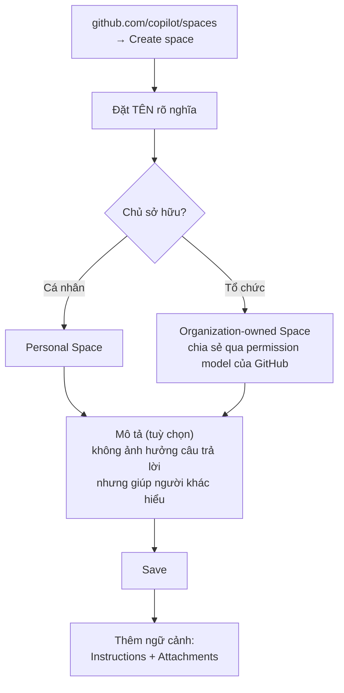

# Note 06 — GitHub Copilot Spaces

> **TL;DR:** Một **Copilot Space** là **một phiên chat Copilot chuyên dụng, được neo (grounded) vào một bộ ngữ cảnh do bạn tuyển chọn** — file, issue, pull request và **instructions dạng văn bản tự do**. Khác Copilot Chat thông thường (rộng nhưng kém chính xác), Space **đánh đổi độ rộng lấy chiều sâu**: thu hẹp ngữ cảnh → câu trả lời **nhất quán, tái lập được, có căn cứ**. Space nhận **2 loại ngữ cảnh**: **Instructions** và **Attachments** (4 cách thêm: file/folder · link issue & PR · upload từ máy · dán text). Space **luôn tham chiếu bản mới nhất trên nhánh mặc định** của repo nên không bị lỗi thời. Về bảo mật: **Space không cấp quyền mới** — nó chỉ hiển thị nội dung mà người xem **vốn đã có quyền xem**. Nguyên tắc quản trị xuyên suốt: **"one job per Space"**.

## 1. Space là gì và khác gì Copilot Chat

> *"It's a dedicated Copilot chat grounded in a curated set of context you choose."*

Giáo trình mô tả: **bản thân Space giống như một LLM** mà bạn **nạp** cho nó file GitHub, issue, pull request và **chỉ dẫn văn bản tự do** để cấp ngữ cảnh cho chủ đề cụ thể của bạn.

| | **Copilot Chat thông thường** | **Copilot Space** |
|---|---|---|
| Phạm vi ngữ cảnh | Rộng — toàn repo hoặc chung chung | **Hẹp, do bạn tuyển chọn** |
| Ưu thế | **Breadth** — khám phá rộng (*wider discovery*) | **Depth** — sâu, **predictable, grounded** |
| Nhược | Có thể **kém chính xác** (*less precise*) | Không tự tìm nội dung ngoài phạm vi đã đính kèm |
| Dùng khi | Hỏi mở, chưa biết cần gì | Cần câu trả lời **nhất quán, tái lập được** trên **một chủ đề hẹp** |

**Khi nào nên tạo Space:** khi bạn muốn câu trả lời **consistent, reproducible** trên chủ đề đóng khung chặt — ví dụ **một service cụ thể**, **một runbook/playbook**, hoặc **một dataset đã biết**.

```
★ Insight ─────────────────────────────────────
• Câu chốt để phân biệt trong đề thi: "Spaces trade breadth for depth."
  Nếu tình huống nói "cần câu trả lời NHẤT QUÁN, LẶP LẠI ĐƯỢC cho một chủ đề
  hẹp" → Space. Nếu nói "cần KHÁM PHÁ, chưa rõ vấn đề ở đâu" → chat thường.
• Space là công cụ prompt engineering ở tầng DỰ ÁN, còn 4 Ss ở note 04 là ở
  tầng CÂU LỆNH. Chữ "Surround" (mở file liên quan) chính là phiên bản thủ
  công của cái mà Space làm một cách có tổ chức và chia sẻ được.
─────────────────────────────────────────────────
```

## 2. Thiết lập ngữ cảnh cho Space

Hiệu quả của Space **phụ thuộc vào ngữ cảnh bạn cấp**. Bạn có thể đính kèm **file cụ thể** (script, cấu hình, tài liệu), **issue hoặc PR liên quan**, và **instructions riêng**.

> ⚠️ **Thứ tự ngữ cảnh có ảnh hưởng** (*context order matters*): **đặt file/chỉ dẫn quan trọng nhất lên đầu** thì câu trả lời chính xác và liên quan hơn.

### 2.1. Attaching files (uploads)

- Trong phần thiết lập Space, dùng nút **"Attach files"** hoặc **"Add context"** để chọn một hoặc nhiều file từ **GitHub repository** của bạn.
- Đính được **source code, markdown docs, file cấu hình** hoặc tài sản khác. Các file này **được tham chiếu từ nhánh mặc định (default branch)** → **Space luôn cập nhật theo repo**.
- Nếu **workspace setting cho phép**, bạn còn **upload trực tiếp từ máy** (ảnh, dataset…) làm ngữ cảnh **không thuộc repo**.

### 2.2. Adding instructions

Dùng mục **"Instructions"** để đưa chỉ dẫn cụ thể, gồm 3 nhóm:

| Nhóm | Ví dụ gốc |
|---|---|
| **Goals** (mục tiêu) | *"Summarize the onboarding process"* |
| **Style preferences** (phong cách) | *"Write in a formal tone"* |
| **Canonical examples** (ví dụ chuẩn) | *"Sample output should look like…"* |

Nguyên tắc: giữ instructions **ngắn, tập trung, hành động được** (*brief, focused, and actionable*). Nếu Space phục vụ một **workflow hoặc hướng dẫn xử lý sự cố**, hãy đưa vào **các bước tuần tự** hoặc **prompt mẫu**. **Cập nhật instructions bất cứ lúc nào** để tinh chỉnh trọng tâm.

## 3. Tạo Space đầu tiên



**Các bước theo giáo trình:**

1. Vào `https://github.com/copilot/spaces` → **Create space**.
2. **Đặt tên** cho space.
3. Chọn **space thuộc về bạn hay thuộc về một tổ chức bạn tham gia**. **Organization-owned Spaces chia sẻ được qua permission model có sẵn của GitHub.**
4. Tuỳ chọn thêm **description** — **không ảnh hưởng câu trả lời** Copilot đưa ra, nhưng giúp người khác hiểu ngữ cảnh của space.
5. Bấm **Save**.

> **Note:** đổi **tên và mô tả** bất cứ lúc nào bằng nút **Edit** ở góc trên bên phải.

### 3.1. Hai loại ngữ cảnh thêm vào Space

| Loại | Nội dung |
|---|---|
| **Instructions** | Văn bản tự do mô tả Copilot nên **tập trung vào gì** trong space này: **lĩnh vực chuyên môn**, **loại tác vụ nên hỗ trợ**, và **điều nên tránh** |
| **Attachments** | Ngữ cảnh dùng để trả lời sát hơn. **Spaces luôn tham chiếu phiên bản code mới nhất trên nhánh `main` của repository** |

### 3.2. Bốn cách thêm attachment

Bấm **Add** bên phải mục "Attachments", rồi chọn:

| Cách | Nội dung thêm được |
|---|---|
| **Attach files and folders** | File và folder **từ GitHub repository** — code, tài liệu, nội dung liên quan |
| **Link pull requests and issues** | **Dán URL** của GitHub issue và pull request |
| **Upload a file** | Upload **trực tiếp từ máy**: ảnh, file text, **rich document**, **spreadsheet** |
| **Add text content** | **Gõ hoặc dán văn bản tự do**: transcript, ghi chú, hay bất kỳ thông tin liên quan nào |

## 4. Chia sẻ, khả năng tìm thấy & quản trị

### 4.1. Visibility and sharing

Space thành công thì **dễ tìm, an toàn khi chia sẻ, và có chủ rõ ràng**. Khi tạo, **đặt visibility theo mức độ bạn muốn người khác dùng**: giữ **thuộc sở hữu cá nhân**, hoặc **cho tổ chức nhìn thấy** (tuỳ môi trường).

- **Chia sẻ bằng link**, và nếu có, tận dụng **duyệt/catalog ở mức tổ chức** để dễ tìm.
- Dùng **tiêu đề rõ ràng, hướng mục đích** và **mô tả ngắn** nêu **phạm vi ("one job per Space")**, **đối tượng dùng**, và **đầu ra mong đợi** — để đồng đội biết ngay khi nào nên dùng.

### 4.2. Security and access — điểm thi quan trọng

> **Bảo mật đi theo permission sẵn có của GitHub. Một Space KHÔNG cấp quyền truy cập mới; nó chỉ hiển thị nội dung mà người xem vốn đã được phép xem.**

Nếu Space liên kết tới **private repository, issue, PR**, thì **chỉ người có quyền repo phù hợp mới thấy nội dung đó phản ánh trong câu trả lời**. Nhờ vậy chia sẻ rộng trong tổ chức mà vẫn bảo vệ thông tin nhạy cảm.

**Best practice:** **đừng dán dữ liệu nhạy cảm vào free-text note**; hãy **link tới file được version-control** nơi review và permission bình thường được áp dụng.

### 4.3. Versioning and freshness

Space **giữ tươi mới nhờ tham chiếu nguồn GitHub sống**:

- File đã link **phản ánh nhánh mặc định của repository**.
- Issue và PR đính kèm **tiến hoá theo thay đổi của chúng**.
- → **Giảm nhu cầu copy nội dung sang tài liệu riêng.**

Nếu cần **hướng dẫn theo nhánh cụ thể** hoặc **ảnh chụp lịch sử**: thu hẹp tham chiếu vào đúng các file liên quan, thêm ví dụ ngắn ở free text, hoặc (nếu môi trường hỗ trợ) **đính một file text ghi lại chính xác nội dung** bạn muốn Space dùng. **Giữ phạm vi nhỏ** để cập nhật vẫn dự đoán được.

### 4.4. Governance — quản trị nhẹ nhưng có chủ đích

| Việc | Chi tiết |
|---|---|
| **Gán owner** | Một người **duy trì Space** |
| **Note "How to use this Space"** | Đặt **ở đầu instructions** |
| **1–3 canonical examples** | Định nghĩa thế nào là **output "tốt"** |
| **Naming convention** | Ví dụ: **"ServiceName—Onboarding Helper"** |
| **Review cadence** | Ví dụ **mỗi lần release** — tỉa nguồn cũ, chỉnh instructions cho khớp thực tế |
| **Tách khi phình to** | Space vượt quá **một job** thì **chia nhỏ** để giữ discoverability cao và chất lượng câu trả lời ổn định |

### 4.5. Checklist tạo/cập nhật Space (5 nhóm)

| Nhóm | Các mục kiểm |
|---|---|
| **Naming and Purpose** | Tiêu đề rõ, hướng mục đích, giữ "one job per Space" · mô tả 1–2 câu nêu phạm vi/đối tượng/đầu ra · note "How to use this Space" ở đầu instructions |
| **Ownership and Visibility** | Đặt đúng owner (cá nhân/tổ chức) · chọn visibility phù hợp (private, org-visible…) · **kiểm tra quyền với một người KHÔNG phải owner** (Space kế thừa quyền repo/issue/PR) · chia sẻ URL và thêm collaborator |
| **Security and Privacy** | Không dán dữ liệu nhạy cảm vào free-text · bảo đảm nguồn đính kèm hợp với visibility đã chọn · giới hạn nội dung upload · **gỡ tài liệu lỗi thời hoặc mật** |
| **Discoverability and Docs** | Naming convention nhất quán (tiền tố team/service) · **thêm tag/keyword vào description** · công bố hoặc đưa Space vào directory/kênh của tổ chức |
| **Review Cadence and Governance** | Gán maintainer · đặt nhịp review (hằng tháng hoặc theo release) · mỗi lần review: **kiểm link, test 2–3 prompt tiêu biểu, cập nhật ví dụ, tỉa nguồn nhiễu, xác nhận visibility** · theo dõi feedback |

## 5. Do's and Don'ts khi làm việc trong Space

| ✅ Do | ❌ Don't |
|---|---|
| Giữ câu hỏi **bám sát các nguồn đã đính kèm** để câu trả lời có căn cứ | **Không @-mention người hoặc Copilot extension khác trong Space** — mention **không thông báo cho ai**, và **extension không gọi được** từ chat của Space |
| Coi Space là **môi trường tập trung cho một tác vụ/lĩnh vực duy nhất**, **tái dùng thuật ngữ riêng của nó** để củng cố tính nhất quán | **Đừng kỳ vọng Space kéo được nội dung chưa đính kèm** — trừ khi môi trường hỗ trợ repository search bạn đã chủ động gắn, Copilot **không tự khám phá tài liệu bên ngoài** |
| Dùng **prompting pattern cho ra kết quả chạy được, kiểm chứng được**: xác nhận ý định trước, rồi tinh chỉnh bằng **ràng buộc cụ thể** (định dạng, khoảng thời gian, đường dẫn file, mục cần xét); **xin code/query/lệnh thực thi được**, và **xin trích dẫn ngược về nguồn** để truy vết | **Đừng để Space phình quá một job hoặc vượt giới hạn context của mô hình** — gặp cảnh báo kích thước hay câu trả lời tệ đi thì **giảm nguồn hoặc tách nhỏ** |
| **Lặp khi câu trả lời trôi lệch**: siết instructions, thêm **1–3 ví dụ chất lượng cao** minh hoạ output "tốt", tỉa nguồn nhiễu | **Đừng dán dữ liệu nhạy cảm vào free-text note** — ưu tiên link file trong repo (hoặc dùng upload nếu hỗ trợ) để review/permission chuẩn được áp dụng |
| **Giữ ngữ cảnh tươi và sắp xếp tốt**: link file version-controlled để Space phản ánh nhánh mặc định; **đặt nguồn/ví dụ quan trọng nhất lên đầu** vì thứ tự ảnh hưởng câu trả lời | |

```
★ Insight ─────────────────────────────────────
• Ba "không" của Space rất hay bị hỏi vì chúng là GIỚI HẠN, không phải tính năng:
    1. Không @-mention người / extension (mention vô tác dụng trong Space)
    2. Không tự tìm nội dung ngoài phạm vi đã đính kèm
    3. Không cấp quyền mới — chỉ soi lại quyền GitHub sẵn có
  Điểm 3 là câu trả lời cho mọi tình huống "chia sẻ Space có làm lộ private
  repo không?" → KHÔNG, người không có quyền repo sẽ không thấy nội dung đó.
• "One job per Space" là kim chỉ nam xuyên suốt cả mục governance lẫn mục
  Do's/Don'ts — nó vừa là lý do đặt tên rõ, vừa là lý do tách Space khi phình.
─────────────────────────────────────────────────
```

## 6. Giá trị nghiệp vụ (theo phần Summary)

Spaces giúp tổ chức **đạt kết quả nhanh và chính xác hơn nhờ hỗ trợ AI có neo ngữ cảnh**: tuyển chọn nguồn tập trung → **giảm mơ hồ**, **tăng tính dự đoán và chất lượng** câu trả lời → **giảm làm lại (rework)**, **tăng tốc ra quyết định**, **đầu ra bám chuẩn tổ chức**. Đồng thời Spaces **tăng cộng tác và quản trị** nhờ tận dụng **permission model sẵn có của GitHub** — chia sẻ tri thức an toàn mà vẫn tuân thủ. Tổng thể: **nhân rộng chuyên môn, giảm tải nhận thức (cognitive load), tăng năng suất**.

## Q&A phỏng vấn

**Q1. Copilot Space là gì, khác Copilot Chat thường ở đâu?**
→ Một **phiên chat Copilot chuyên dụng neo vào bộ ngữ cảnh do bạn tuyển chọn** (file, issue, PR, instructions). Chat thường **rộng nhưng kém chính xác**; Space **đánh đổi độ rộng lấy chiều sâu** → câu trả lời **nhất quán, tái lập được, có căn cứ**.

**Q2. Hai loại ngữ cảnh thêm được vào Space?**
→ **Instructions** (văn bản tự do: chuyên môn, loại tác vụ, điều cần tránh) và **Attachments**.

**Q3. Bốn cách thêm attachment?**
→ Attach files and folders (từ repo) · Link pull requests and issues (dán URL) · Upload a file (từ máy: ảnh, text, rich document, spreadsheet) · Add text content (gõ/dán văn bản tự do).

**Q4. Chia sẻ Space cho cả tổ chức có làm lộ private repo không?**
→ **Không.** Space **không cấp quyền mới**, chỉ hiển thị nội dung người xem **vốn đã có quyền**. Người thiếu quyền repo sẽ không thấy nội dung đó trong câu trả lời.

**Q5. Space giữ nội dung tươi mới bằng cách nào?**
→ Tham chiếu **nguồn GitHub sống**: file link phản ánh **nhánh mặc định**, issue/PR tiến hoá theo thay đổi của chúng → không phải copy nội dung sang tài liệu riêng.

**Q6. Vì sao thứ tự ngữ cảnh trong Space lại quan trọng?**
→ **Selection and ordering of context can influence responses** — nên **đặt nguồn quan trọng nhất lên đầu**.

**Q7. Hai điều KHÔNG làm được trong Space chat?**
→ **@-mention người** (không ai được thông báo) và **gọi Copilot extension khác** (không invoke được từ Space chat).

**Q8. Space bắt đầu trả lời lan man, nhiều chủ đề. Xử lý?**
→ Space đã **phình quá "one job"** — **tách thành các Space nhỏ hơn**, đồng thời **siết instructions**, thêm **1–3 canonical example**, và **tỉa nguồn nhiễu**.

## Tự kiểm tra

1. Space tạo ở URL nào? *(github.com/copilot/spaces)*
2. Description của Space có ảnh hưởng câu trả lời không? *(Không — chỉ giúp người khác hiểu ngữ cảnh)*
3. Nguyên tắc quản trị xuyên suốt là gì? *("one job per Space")*
4. Ba nhóm nội dung nên đưa vào Instructions? *(goals · style preferences · canonical examples)*
5. Khi review Space định kỳ cần làm 5 việc gì? *(kiểm link · test 2–3 prompt tiêu biểu · cập nhật ví dụ · tỉa nguồn nhiễu · xác nhận visibility)*
6. Space tham chiếu code ở nhánh nào? *(nhánh mặc định / `main` của repository)*

## Liên quan
- [[00-MOC-GH300|⬅ MOC GH-300]]
- Trước: [[05-Copilot-xu-ly-Prompt-va-Du-lieu]] · Kế tiếp (cụm C): [[07-Copilot-trong-IDE]]
- [[04-Prompt-Engineering-voi-Copilot]] — "Surround" ở tầng prompt vs Space ở tầng dự án
- [[13-Code-Review-va-Pull-Request]] — custom instructions theo path, một dạng "instructions" khác
- [[../02-Git/05-Branch-Merge-PR|Git/05 — Branch, Merge, PR]] — nhánh mặc định và PR mà Space tham chiếu
