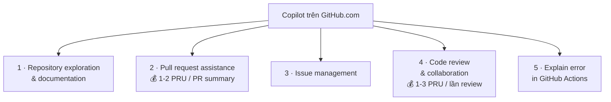

# Note 08 — Copilot trên GitHub.com

> **TL;DR:** Copilot **vượt ra khỏi máy bạn** và có mặt ngay trên giao diện web GitHub, dưới dạng **nút chat hoặc gợi ý inline**. Bốn nơi truy cập được: **repository pages · issues & pull requests · discussions · code review**. Năm nhóm **agent task** chạy được **ở chế độ nền** trong khi bạn làm việc khác: **repository exploration & documentation · pull request assistance · issue management · code review & collaboration · Copilot explain error in GitHub Actions**. Hai mốc chi phí phải nhớ: **sinh PR summary thường tốn 1-2 PRU**, **mỗi lần code review tốn 1-3 PRU** — tuỳ độ phức tạp và phạm vi.

## 1. Truy cập Copilot trên GitHub.com

Copilot được tích hợp **xuyên suốt giao diện web GitHub**, xuất hiện dưới dạng **nút chat** hoặc **gợi ý inline** tuỳ ngữ cảnh:

| Nơi | Copilot làm gì ở đó |
|---|---|
| **Repository pages** | Giải thích **code, tài liệu và cấu trúc dự án** |
| **Issues and pull requests** | **Sinh tóm tắt**, đề xuất giải pháp, soạn phản hồi |
| **Discussions** | Giúp **hình thành câu trả lời** và cung cấp góc nhìn kỹ thuật |
| **Code review** | **Phân tích thay đổi** và đề xuất cải thiện |

## 2. Năm nhóm agent task trên GitHub.com

![[github-com-agent-tasks.png]]

*Ảnh: Microsoft Learn — các agent task Copilot thực hiện được trên GitHub.com.*
Điểm mấu chốt của cả unit này nằm ở một câu: **"These tasks can run in the background for you while you focus on other work"** — khác hẳn Copilot trong IDE (đồng bộ, bạn chờ câu trả lời), agent task trên GitHub.com **chạy nền**, bạn giao việc rồi quay lại xem kết quả.



### 2.1. Repository exploration and documentation

| Việc | Nội dung |
|---|---|
| **Code explanation** | Nhờ Copilot **giải thích đoạn code phức tạp, hàm, hoặc cả file** |
| **Project overview** | Nhận **tóm tắt do AI sinh** về **mục đích repo, kiến trúc, và các thành phần chính** |
| **Documentation generation** | **Tạo hoặc cải thiện** README, **API documentation**, và code comment |

Prompt mẫu: *"Explain the main functionality of this repository and its key components"*

### 2.2. Pull request assistance

Copilot **tăng tốc rõ rệt workflow PR** bằng cách tự động hoá nhiều việc tốn thời gian:

| Việc | Nội dung |
|---|---|
| **PR summaries** | Sinh **tóm tắt đầy đủ các thay đổi** trong PR → reviewer nắm nhanh **phạm vi và tác động** |
| **Review suggestions** | Nhận **khuyến nghị cải thiện code và vấn đề tiềm ẩn TRƯỚC khi review chính thức** → giảm số vòng review |
| **Merge conflict resolution** | Nhận **hướng dẫn giải quyết xung đột** giữa các nhánh → merge trôi hơn |
| **Documentation updates** | **Tự đề xuất cập nhật** README, changelog và tài liệu khác **dựa trên thay đổi code** |

> 💰 **Note gốc — con số phải nhớ:** sinh PR summary và các tính năng PR nâng cao **tiêu PRU (Premium Request Units)**. **Sinh một PR summary thường tốn 1-2 PRU**, tuỳ độ phức tạp và kích thước thay đổi. Theo dõi mức dùng để không vượt hạn mức tháng.

Prompt mẫu: *"Summarize the changes in this pull request and highlight any potential concerns"*

Kết quả: Copilot sinh trong vài giây thứ mà **viết tay thường mất vài phút**.

### 2.3. Issue management

| Việc | Nội dung |
|---|---|
| **Issue analysis** | **Bẻ vấn đề phức tạp thành các tác vụ hành động được** |
| **Solution brainstorming** | Sinh **các hướng tiếp cận tiềm năng** để xử lý issue |
| **Reproduction steps** | Giúp tạo **các bước tái hiện bug** rõ ràng |

Prompt mẫu: *"Analyze this issue and suggest potential solutions with implementation approaches"*

### 2.4. Code review and collaboration

| Việc | Nội dung |
|---|---|
| **Review comments** | Sinh **comment review chu đáo** kèm đề xuất cụ thể |
| **Security analysis** | Nhận diện **lỗ hổng bảo mật tiềm ẩn** hoặc vi phạm best practice |
| **Performance optimization** | Đề xuất cải thiện **hiệu quả và hiệu năng** code |

> 💰 **Note gốc:** tính năng code review **tiêu PRU** như một phần năng lực nâng cao của Copilot. **Mỗi request code review thường tốn 1-3 PRU**, tuỳ **phạm vi và độ phức tạp** của phân tích.

Prompt mẫu: *"Review this code change and provide feedback on security and performance considerations"*

> Chi tiết đầy đủ về code review (Copilot as reviewer, custom instructions, Rulesets) nằm ở [[13-Code-Review-va-Pull-Request]].

### 2.5. Copilot Explain error in GitHub Actions

Copilot giúp **giải thích và xử lý lỗi trong workflow GitHub Actions**: phân tích **các lần chạy workflow thất bại** và cho biết **sai ở đâu, sửa thế nào**.

![[actions-explain-error.png]]

*Ảnh: Microsoft Learn — Copilot giải thích lỗi của một workflow GitHub Actions thất bại.*
Điều đáng chú ý là Copilot không chỉ đọc dòng lỗi cuối cùng — nó **đọc log file** để truy về **nguyên nhân gốc**, và hiểu được **quan hệ giữa các step** trong workflow (step nào phụ thuộc step nào), nên gợi ý sửa đúng chỗ hỏng chứ không phải chỗ báo lỗi.

**Bốn năng lực khi giải thích lỗi Actions:**

| Năng lực | Nội dung |
|---|---|
| **Error analysis** | **Soi log file** và xác định **nguyên nhân gốc (root cause)** của thất bại |
| **Solution suggestions** | Đưa **khuyến nghị cụ thể** để xử lý vấn đề workflow |
| **Best practices** | Hướng dẫn cải thiện **độ tin cậy và hiệu năng** workflow |
| **Context awareness** | Hiểu **quan hệ giữa các step và dependency** khác nhau của workflow |

```
★ Insight ─────────────────────────────────────
• Điểm phân biệt cốt lõi giữa Copilot trên IDE và trên GitHub.com KHÔNG phải
  là "tính năng nào có ở đâu" mà là TÍNH ĐỒNG BỘ: IDE = bạn hỏi, bạn chờ;
  GitHub.com = agent task chạy NỀN trong khi bạn làm việc khác. Câu hỏi tình
  huống dạng "muốn giao việc rồi làm chuyện khác" luôn trỏ về GitHub.com
  (hoặc Cloud Agent ở note 11), không phải IDE.
• Hai mốc PRU của unit này rất dễ đảo: PR summary = 1-2 PRU, code review =
  1-3 PRU. Mẹo nhớ: review "khó hơn" nên khoảng rộng hơn (tới 3).
• "Explain error in Actions" là điểm nối trực tiếp với kiến thức CI/CD đã học
  ở [[../02-Git/13-GitHub-Actions]] — Copilot đọc chính cái log của job mà
  bạn từng phải tự mò.
─────────────────────────────────────────────────
```

## Q&A phỏng vấn

**Q1. Copilot xuất hiện trên GitHub.com dưới dạng gì và ở những khu vực nào?**
→ Dưới dạng **nút chat hoặc gợi ý inline**; có mặt ở **repository pages · issues và pull requests · discussions · code review**.

**Q2. Điều gì làm agent task trên GitHub.com khác biệt?**
→ Chúng **chạy ở chế độ nền (in the background)** trong khi bạn tập trung việc khác.

**Q3. Kể 5 nhóm agent task trên GitHub.com.**
→ Repository exploration & documentation · pull request assistance · issue management · code review & collaboration · Copilot explain error in GitHub Actions.

**Q4. Bốn việc trong nhóm pull request assistance?**
→ **PR summaries** · **review suggestions** (trước review chính thức) · **merge conflict resolution** · **documentation updates** (README, changelog theo thay đổi code).

**Q5. Sinh PR summary và chạy code review tốn bao nhiêu PRU?**
→ PR summary: **1-2 PRU** tuỳ độ phức tạp và kích thước thay đổi. Code review: **1-3 PRU** tuỳ phạm vi và độ phức tạp phân tích.

**Q6. Copilot làm gì với một workflow GitHub Actions bị fail?**
→ **Error analysis** (soi log, tìm root cause) · **solution suggestions** · **best practices** để tăng độ tin cậy/hiệu năng workflow · **context awareness** (hiểu quan hệ giữa các step và dependency).

**Q7. Ba việc Copilot làm được với issue?**
→ **Issue analysis** (bẻ thành tác vụ hành động được) · **solution brainstorming** · **reproduction steps** (viết các bước tái hiện bug).

## Tự kiểm tra

1. Bốn khu vực trên GitHub.com có Copilot? *(repository pages · issues & PRs · discussions · code review)*
2. Ba việc trong "repository exploration and documentation"? *(code explanation · project overview · documentation generation)*
3. Prompt mẫu để tóm tắt PR trong giáo trình? *("Summarize the changes in this pull request and highlight any potential concerns")*
4. Ba việc trong "code review and collaboration"? *(review comments · security analysis · performance optimization)*
5. Bốn năng lực khi giải thích lỗi Actions? *(error analysis · solution suggestions · best practices · context awareness)*
6. Hai con số PRU cần nhớ ở note này? *(PR summary 1-2 PRU · code review 1-3 PRU)*

## Liên quan
- [[00-MOC-GH300|⬅ MOC GH-300]]
- Trước: [[07-Copilot-trong-IDE]] · Kế tiếp: [[09-Copilot-CLI-va-GitHub-Copilot-App]]
- [[13-Code-Review-va-Pull-Request]] — Copilot as reviewer, PRU, Rulesets tự động hoá review
- [[11-Copilot-Cloud-Agent]] — giao hẳn issue cho Copilot tự làm và mở PR
- [[../02-Git/13-GitHub-Actions|Git/13 — GitHub Actions]] — chính là workflow mà Copilot đọc log để giải thích lỗi
- [[../02-Git/05-Branch-Merge-PR|Git/05 — Branch, Merge, PR]] — nền tảng PR và merge conflict
