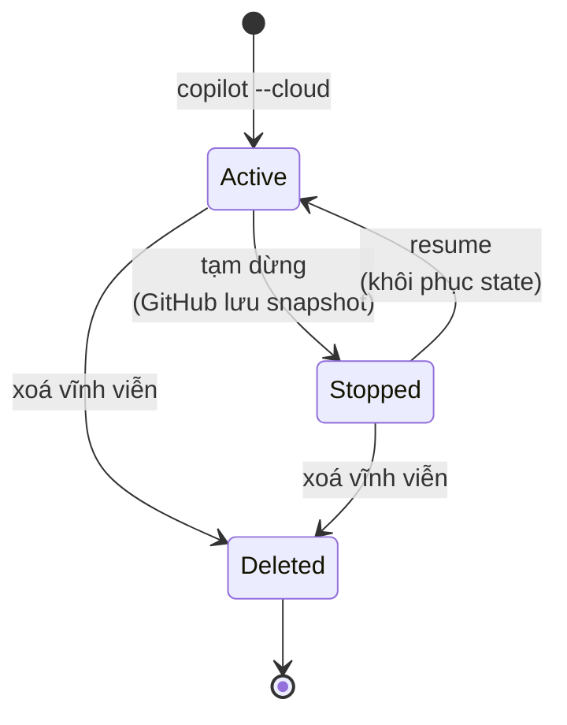
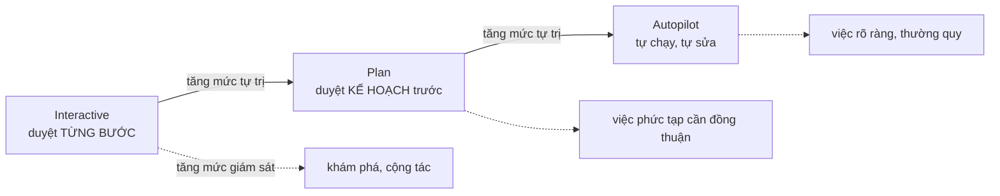

# Note 09 — Copilot CLI & GitHub Copilot app

> **TL;DR:** **Copilot CLI** đưa Copilot vào terminal: **giải thích lệnh, đề xuất lệnh từ ngôn ngữ tự nhiên, làm việc an toàn với file**. Nó **dùng xác thực GitHub nhưng chạy độc lập với GitHub CLI**. Chạy `copilot` vào **interactive mode**, `copilot -i "..."` cho **one-shot**. Điều khiển phiên **chỉ bằng slash command** — không thay thế được bằng ngôn ngữ tự nhiên. **Sandbox** có 2 loại: **local** (`/sandbox enable`, hạn chế filesystem/network/OS trên máy bạn) và **cloud** (`copilot --cloud`, môi trường Linux cô lập hoàn toàn do GitHub host, xây trên **Azure Container Apps Sandboxes**; phiên có **3 trạng thái Active / Stopped / Deleted**; admin phải bật **Cloud Sandbox access policy**). **GitHub Copilot app** là ứng dụng desktop native (macOS/Windows/Linux) để **điều phối (orchestration)** cả vòng issue → code → PR → merge; mỗi **agent session (workspace) cô lập bằng Git worktree**; **3 session mode: Interactive · Plan · Autopilot**; app **xây trên runtime của Copilot CLI** nên dùng lại được `/chronicle`.

## 1. Copilot CLI

### 1.1. Bản chất

| Điểm | Nội dung |
|---|---|
| **Làm được gì** | **Giải thích lệnh** · **đề xuất lệnh shell từ ngôn ngữ tự nhiên** · giúp làm việc **an toàn và tương tác** với file và project |
| **Xác thực** | Dùng **GitHub authentication** |
| **Quan hệ với GitHub CLI (`gh`)** | **Chạy độc lập với GitHub CLI**, nhưng **dùng credential sẵn có** của bạn |
| **Giá trị** | Giảm việc mò mẫm (*reduces guesswork*), tăng tốc workflow hằng ngày — cho cả người mới lẫn dev kỳ cựu |

### 1.2. Cài đặt & khởi chạy

```bash
# macOS và Linux qua Homebrew
brew install copilot-cli

# hoặc script cài chính thức
curl -fsSL https://gh.io/copilot-install | bash

# chạy chế độ tương tác
copilot

# one-shot, không vào interactive mode
copilot -i "explain brew install git"
copilot -i "suggest find large files and delete them"
```

![[cli-trust-folder.png]]

*Ảnh: Microsoft Learn — lần chạy đầu, Copilot CLI hỏi bạn có tin tưởng các file trong thư mục hiện tại không.*
Đây là **rào chắn bảo mật quan trọng nhất của CLI**: trong phiên làm việc, Copilot **có thể đọc, sửa hoặc THỰC THI file** trong thư mục này — nên chỉ đồng ý ở những nơi bạn thực sự tin. Cơ chế "trusted directories" này về sau được cấu hình lại bằng flag và file config (mục 1.4).

Trong phiên tương tác, bạn có thể **dùng `@` để chọn một file cụ thể làm ngữ cảnh**, và:

- Dùng **slash command (`/command`)** để **điều khiển phiên và cấu hình** Copilot CLI.
- Gõ **prompt ngôn ngữ tự nhiên** để **giải thích, đề xuất, hoặc chỉnh sửa** lệnh.

### 1.3. Slash command của CLI

| Lệnh | Tác dụng |
|---|---|
| `/help` | Hiện các lệnh và tuỳ chọn khả dụng |
| `/explain <command>` | Nhờ Copilot **giải thích một lệnh shell bất kỳ** |
| `/suggest <task>` | Nhờ Copilot **đề xuất lệnh shell** cho một tác vụ |
| `/revise` | **Sửa lại gợi ý vừa rồi** theo chỉ dẫn của bạn |
| `/feedback` | Gửi phản hồi về một câu trả lời/gợi ý |
| `/exit` | Thoát interactive mode |
| `/model <model>` | **Chọn mô hình AI** |
| `/theme [auto\|dark\|light]` | Đổi theme terminal |
| `/skills` | **Quản lý skills** để mở rộng năng lực |
| `/mcp` | **Quản lý cấu hình MCP server** |
| `/list-dirs` | Xem **các thư mục được phép** thao tác file |
| `/reset-allowed-tools` | **Reset danh sách tool được phép** |
| `/sandbox enable` | **Bật local sandboxing** trong phiên |

> ⚠️ **Điểm thi:** *"Slash commands cannot be replaced with natural language prompts. They are the only way to control session settings and configuration."* — **prompt tiếng Anh tự nhiên KHÔNG thay được slash command** khi cần điều khiển phiên/cấu hình.

### 1.4. Năm workflow ví dụ

| # | Việc | Cách làm |
|---|---|---|
| 1 | **Giải thích lệnh** | `> Explain what \`git reset --hard HEAD\` does` |
| 2 | **Đề xuất lệnh** | `> Find and delete all .log files in my home folder` → Copilot sinh gợi ý và **hỏi bạn có muốn thực thi không** |
| 3 | **Sửa gợi ý** | Prompt tiếp theo: `> Include only files modified in the last 7 days` |
| 4 | **Gửi feedback** | `> /feedback` → chọn loại phản hồi → được dẫn tới form phù hợp |
| 5 | **Thoát** | `> /exit` |

![[cli-suggest-command.png]]

*Ảnh: Microsoft Learn — Copilot CLI đề xuất lệnh shell từ mô tả bằng ngôn ngữ tự nhiên.*
Chú ý mô hình tương tác: Copilot **không tự chạy lệnh** — nó trình bày lệnh đề xuất rồi **hỏi xác nhận** trước khi thực thi. Đúng tinh thần *"Always review commands before execution"* trong phần Tips, và là lý do bước 3 (`/revise`) tồn tại: bạn tinh chỉnh gợi ý **trước** khi cho chạy.

### 1.5. Cấu hình ngoài interactive mode

Cấu hình Copilot CLI ở chế độ **non-interactive** được quản lý qua **permission prompt, command-line flag, và file cấu hình cục bộ**. Chúng kiểm soát Copilot **truy cập được gì và làm được gì thay bạn**:

| Loại cấu hình | Kiểm soát |
|---|---|
| **Trusted directories** | Nơi Copilot được **đọc, sửa và chạy file** |
| **Tool permissions** | Cho/cấm Copilot **chạy lệnh shell hoặc sửa file** — dùng flag **`--allow-tool`** / **`--deny-tool`** |
| **Path permissions** | **Thư mục nào** Copilot truy cập được |
| **URL permissions** | **Domain ngoài nào** Copilot kết nối được |

## 2. Sandboxed execution environments

**Sandboxing** **cô lập lệnh, thao tác file và hoạt động khác** khỏi môi trường phát triển chính của bạn. Hai lựa chọn:

### 2.1. Local sandboxing

Cho Copilot **chạy lệnh trong môi trường hạn chế ngay trên máy bạn**. Khi bật, quyền của Copilot với **filesystem, kết nối mạng và năng lực hệ điều hành bị giới hạn**.

Bật trong phiên tương tác:

```shell
/sandbox enable
```

Sau khi bật, lệnh do Copilot thực thi **chạy trong sandbox** thay vì trực tiếp trên host.

| Lợi ích | Mô tả |
|---|---|
| **Improved security** | Hạn chế truy cập **tài nguyên hệ thống nhạy cảm** |
| **Safer experimentation** | Thử workflow do agent điều khiển với **rủi ro thấp hơn** |
| **Local execution** | Dùng **tài nguyên máy bạn**, không cần hạ tầng cloud |
| **Greater control** | Thêm lớp bảo vệ khi dùng **autonomous agent** |

### 2.2. Cloud sandboxing

Cho phiên Copilot CLI chạy trong **môi trường Linux cô lập hoàn toàn do GitHub host**. Khác local sandbox, phiên cloud **thực thi hoàn toàn trong hạ tầng của GitHub**, **tách biệt với máy bạn và với các phiên sandbox khác**.

> **Nền tảng kỹ thuật:** cloud sandboxing **xây trên Azure Container Apps Sandboxes**, với GitHub lo **authentication, governance, policy enforcement và billing integration**.

```shell
copilot --cloud
```

Sau khi khởi động, Copilot **chạy lệnh, sửa file, chạy test và làm việc phát triển bên trong môi trường cloud** thay vì trên thiết bị của bạn.

| Lợi ích | Mô tả |
|---|---|
| **Strong isolation** | Workload chạy tách khỏi máy bạn |
| **Device flexibility** | **Tiếp tục phiên từ thiết bị khác** |
| **Resource offloading** | Dùng **tài nguyên cloud** thay CPU/RAM máy bạn |
| **Parallel execution** | **Chạy nhiều tác vụ agent cùng lúc** |

**Tiếp tục phiên qua nhiều thiết bị:** vì phiên chạy trên hạ tầng GitHub, công việc **không gắn với một máy cụ thể** — bắt đầu ở máy này, tiếp tục ở máy khác, **không phải chuyển file tay hay dựng lại môi trường**.

### 2.3. Vòng đời phiên cloud sandbox — 3 trạng thái



| Trạng thái | Mô tả |
|---|---|
| **Active** | Phiên **đang chạy** và tương tác được |
| **Stopped** | Phiên **tạm dừng**, nhưng **state được giữ lại** để dùng sau |
| **Deleted** | Phiên và **toàn bộ state đã lưu bị xoá vĩnh viễn** |

Khi phiên bị stop, GitHub **lưu snapshot môi trường** gồm **file, biến môi trường và công việc đang dở**. Resume sẽ **khôi phục state đã lưu** để bạn tiếp tục đúng chỗ.

### 2.4. Xác thực & chính sách

Cloud sandbox **dùng cùng mô hình xác thực với Copilot CLI**. Nếu bạn xác thực được vào Copilot CLI và có quyền dùng Copilot thì **không cần cấu hình cloud provider nào thêm**. Bạn **KHÔNG cần**: quản lý API key · cấu hình hạ tầng cloud · cấp phát VM · bảo trì container.

> ⚠️ **Note gốc:** **admin của tổ chức/enterprise phải bật chính sách "Cloud Sandbox access"** trước khi thành viên dùng được môi trường cloud sandbox.

### 2.5. Bảng so sánh local vs cloud

| Tiêu chí | **Local Sandbox** | **Cloud Sandbox** |
|---|---|---|
| **Execution location** | Máy cục bộ | Môi trường do GitHub host |
| **Resource usage** | Tài nguyên máy bạn | Tài nguyên cloud |
| **Isolation level** | Môi trường cục bộ bị hạn chế | **Môi trường cloud cô lập hoàn toàn** |
| **Device independence** | **Không** | **Có** |
| **Parallel workloads** | Bị giới hạn bởi phần cứng máy | **Dễ mở rộng** |

**Sáu tình huống nên dùng sandbox:** làm việc với **repo lạ** · **test lệnh do agent sinh** · chạy **workflow tự trị** · thực hiện **thao tác có thể phá hoại** · làm việc **trên nhiều thiết bị** · **offload tác vụ nặng về tính toán**.

### 2.6. Sáu mẹo dùng Copilot CLI hiệu quả

1. Dùng **interactive mode (`copilot`)** cho việc **khám phá**.
2. Dùng **one-shot (`copilot -i`)** cho **câu trả lời nhanh**.
3. **Ngôn ngữ tự nhiên là đủ** — không phải lúc nào cũng cần slash command.
4. **Luôn xem lại lệnh trước khi thực thi.**
5. **Kết hợp Copilot CLI với GitHub CLI (`gh`)** để quản lý repository và issue.
6. **Dùng slash command khi cần hành động có cấu trúc** hoặc gửi feedback.

```
★ Insight ─────────────────────────────────────
• Mẹo 3 và cảnh báo ở mục 1.3 nghe mâu thuẫn nhưng không phải: ngôn ngữ tự
  nhiên đủ cho VIỆC (giải thích, đề xuất, sửa lệnh); slash command là BẮT BUỘC
  cho ĐIỀU KHIỂN PHIÊN và CẤU HÌNH (/model, /theme, /mcp, /sandbox…). Đề thi
  hay hỏi ngược: "cách duy nhất để đổi cấu hình phiên?" → slash command.
• Local vs cloud sandbox khác nhau ở đúng một trục quyết định: bạn có cần
  ĐỘC LẬP THIẾT BỊ và CHẠY SONG SONG không? Nếu có → cloud. Local chỉ giải
  bài toán an toàn, không giải bài toán quy mô.
─────────────────────────────────────────────────
```

## 3. GitHub Copilot app

### 3.1. App là gì

**Ứng dụng desktop native cho macOS, Windows và Linux**, cho developer **một nơi duy nhất quản lý công việc từ đầu tới cuối** — từ chọn xây gì tới ship code. Nó gom lại:

- **Agent-based development**
- **Code changes và diff review**
- **Pull request workflows** (checks, feedback, merge)

Tất cả **trong một ứng dụng nối thẳng tới GitHub**.

### 3.2. Vấn đề nó giải

| Hiện trạng | Ma sát sinh ra | App xử lý bằng cách |
|---|---|---|
| **Terminal** cho agent/script · **IDE** để sửa code · **Browser** cho PR và review | **Context switching** · **thiết lập thủ công các luồng việc song song** · **tốn công theo dõi tiến độ PR** | **Gom workflow vào một trải nghiệm** · **tự tạo workspace cô lập cho tác vụ song song** · **giữ code, ngữ cảnh và vòng đời PR gắn chặt với nhau** |

**Bốn lợi ích tóm gọn:** giảm context switching · **chạy tác vụ song song có cô lập** · **quản lý vòng đời PR tích hợp sẵn** · **đường từ ý tưởng tới code đã merge ngắn hơn**.

Trong app, developer làm trọn chuỗi mà không rời ứng dụng: **bắt đầu từ issue/task → sinh và lặp code → review thay đổi → quản lý PR → hoàn tất merge**.

### 3.3. Agent sessions (workspaces)

Cốt lõi của trải nghiệm là **agent session**, còn gọi là **workspace**:

| Đặc tính | Nội dung |
|---|---|
| **Gắn với** | **Một branch hoặc một pull request** |
| **Cách cô lập** | **Git worktrees** |
| **Song song** | **Nhiều phiên chạy cùng lúc mà không giẫm chân nhau** |

→ Cho phép developer **điều phối nhiều luồng công việc đồng thời**.

> **Git worktree** = tính năng của Git cho phép **check out nhiều nhánh ra nhiều thư mục làm việc khác nhau từ cùng một repository** — đó là lý do các agent session không xung đột file với nhau.

### 3.4. Xây trên Copilot CLI

App **chạy bằng runtime của Copilot CLI**, nghĩa là:

- **Thiết lập CLI sẵn có được kế thừa.**
- Developer **dùng lại tool, skill và cấu hình** của mình.
- **Workflow nâng cao vẫn tương thích.**

### 3.5. So sánh 4 surface của Copilot

| Surface | Hợp nhất cho | Vai trò then chốt |
|---|---|---|
| **GitHub Copilot app** | Quản lý **agent workflow từ đầu tới cuối** | **Điều phối** công việc từ **issue → code → PR → merge** |
| **Copilot in VS Code (IDE)** | **Sửa và debug code** | Phát triển tay, **sát với code** |
| **Copilot CLI** | Workflow **hướng terminal** | **Tự động hoá, scripting, kiểm soát ở mức môi trường** |
| **Copilot on GitHub.com** | **Cộng tác và hoạch định** | **Issue, tạo PR, phối hợp bất đồng bộ** |

### 3.6. Ba session mode

Developer chọn **mức tự trị trao cho agent**, tuỳ độ phức tạp tác vụ và mức giám sát cần thiết:

| Mode | Mô tả | Hợp nhất cho |
|---|---|---|
| **Interactive** | Agent **đề xuất thay đổi và cộng tác từng bước**, **chờ đầu vào và phê duyệt** của bạn trước khi đi tiếp | **Phát triển cộng tác** và **tác vụ khám phá** |
| **Plan** | Agent **lập và trình bày kế hoạch hiện thực chi tiết TRƯỚC KHI thay đổi**. Bạn **review và điều chỉnh kế hoạch** trước khi thực thi | **Tác vụ phức tạp** cần review, đồng thuận, hoặc giám sát thêm |
| **Autopilot** | Agent **làm việc tự trị**: hiện thực thay đổi, **chạy test, lặp sửa lỗi** và hoàn tất tác vụ với **can thiệp tối thiểu** | **Việc hiện thực đã định nghĩa rõ** và **tác vụ phát triển thường quy** |



### 3.7. Session history với `/chronicle`

Vì app xây trên Copilot CLI, nó **hỗ trợ năng lực session history của CLI** như **`/chronicle`** — cho phép rút insight từ **công việc đã làm ở cả GitHub Copilot app lẫn các phiên Copilot CLI**.

| Cách dùng | Tác dụng |
|---|---|
| **`/chronicle standup`** | **Sinh tóm tắt công việc gần đây** làm xong qua các phiên |
| **`/chronicle`** | **Xem lại hoạt động trước đó** và lịch sử phiên |

**Bốn lợi ích:** theo dõi công việc **qua nhiều phiên** · **tạo cập nhật standup nhanh** · giữ **tính liên tục giữa các dự án** · **tăng khả năng nhìn thấy hoạt động của agent**. Đặc biệt giá trị khi **quản lý nhiều luồng việc do agent chạy cùng lúc**.

### 3.8. Voice dictation

App hỗ trợ **đọc chính tả bằng giọng nói** — nói prompt thay vì gõ. Giọng nói được **chuyển thành text và chèn thẳng vào ô prompt** để bạn **xem lại, sửa, rồi gửi**. Hữu ích khi **bắt ý tưởng nhanh**, **mô tả yêu cầu hiện thực**, hoặc **làm việc rảnh tay**.

> **Quan trọng:** *"Speech is transcribed using a local model installed on your device"* — **chuyển giọng nói thành text bằng mô hình CỤC BỘ cài trên máy bạn**, không gửi lên cloud.

**Năm bước cấu hình:** mở **Settings** trong app → chọn tab **Voice Dictation** → **chọn phím tắt** → **cấp quyền microphone** ở hệ điều hành → **tải mô hình transcription cục bộ**.
**Cách dùng:** bấm phím tắt để **bắt đầu ghi** → nói prompt → **bấm lại để dừng**.

### 3.9. Bốn use case thực tế

| Use case | Nội dung |
|---|---|
| **Chạy tác vụ phát triển song song** | Mở nhiều agent session cho các feature khác nhau, **mỗi việc cô lập trong workspace riêng**, chuyển qua lại **không mất ngữ cảnh** — lý tưởng cho team làm nhiều issue cùng lúc |
| **Quản lý vòng đời PR** | Review diff · **theo dõi checks và trạng thái CI** · phản hồi feedback. Với **Agent Merge**, app còn giúp **xử lý review comment**, **sửa check đang fail**, đẩy PR tới hoàn tất → giảm công sức "**last mile**" để ship code |
| **Giảm chuyển đổi công cụ** | Ở lại một app để sinh code, theo dõi tiến độ, quản lý PR thay vì nhảy giữa terminal/IDE/browser |
| **Tạo workflow lặp lại được** | **Biến prompt thành workflow tái dùng** · **lên lịch tác vụ định kỳ** · **tuỳ biến phiên bằng tool và skill** → nhân rộng phát triển dựa trên agent cho cả team |

> **Câu chốt của module:** app tập trung vào **orchestration, không chỉ code generation**; nó **bổ trợ (chứ không thay thế)** IDE, CLI và GitHub.com; giúp team chuyển từ **dùng AI rời rạc** sang **cách tiếp cận agentic có cấu trúc, mở rộng được**.

```
★ Insight ─────────────────────────────────────
• Ba session mode ánh xạ chính xác vào trục "tự trị ↔ giám sát": Interactive
  duyệt TỪNG BƯỚC, Plan duyệt MỘT LẦN (kế hoạch) rồi thả, Autopilot KHÔNG duyệt.
  Câu hỏi tình huống "tác vụ phức tạp cần cả team đồng thuận trước khi động
  vào code" → Plan, không phải Interactive (Interactive là cộng tác lúc làm,
  Plan là thống nhất trước khi làm).
• Chi tiết "Git worktrees" trả lời câu hỏi kỹ thuật ẩn: vì sao nhiều agent
  session sửa cùng một repo mà không xung đột? Vì mỗi session có thư mục làm
  việc riêng trỏ về cùng một .git — đây là kiến thức Git thuần, không phải
  tính năng AI.
• Voice dictation dùng mô hình CỤC BỘ — chi tiết privacy hay bị hỏi bẫy thành
  "gửi audio lên GitHub để transcribe" (SAI).
─────────────────────────────────────────────────
```

## Q&A phỏng vấn

**Q1. Copilot CLI có phải một phần của GitHub CLI không?**
→ **Không.** Nó **chạy độc lập với GitHub CLI**, dù **dùng credential GitHub sẵn có** của bạn.

**Q2. Chạy one-shot prompt trong CLI thế nào?**
→ `copilot -i "explain brew install git"` — không cần vào interactive mode.

**Q3. Có thể thay slash command bằng câu tiếng Anh tự nhiên không?**
→ **Không.** Slash command là **cách duy nhất** để **điều khiển session setting và cấu hình**. Ngôn ngữ tự nhiên chỉ dùng cho việc giải thích/đề xuất/sửa lệnh.

**Q4. Cloud sandbox xây trên nền công nghệ gì, và ai phải bật nó?**
→ Xây trên **Azure Container Apps Sandboxes**; GitHub lo authentication, governance, policy enforcement và billing. **Admin tổ chức/enterprise phải bật chính sách "Cloud Sandbox access"** trước.

**Q5. Ba trạng thái phiên cloud sandbox và điều gì xảy ra khi stop?**
→ **Active / Stopped / Deleted**. Khi stop, GitHub **lưu snapshot môi trường** (file, biến môi trường, việc đang dở); resume sẽ **khôi phục state**.

**Q6. Local sandbox khác cloud sandbox ở hai điểm quan trọng nhất?**
→ **Device independence** (local: không · cloud: có) và **parallel workloads** (local: giới hạn phần cứng · cloud: dễ mở rộng).

**Q7. Agent session trong Copilot app được cô lập bằng cơ chế gì?**
→ **Git worktrees** — mỗi session gắn với **một branch hoặc pull request**, chạy song song không giẫm chân nhau.

**Q8. Ba session mode và chọn cái nào cho tác vụ phức tạp cần review trước?**
→ **Interactive** (duyệt từng bước) · **Plan** (trình kế hoạch trước khi thay đổi) · **Autopilot** (tự trị, tự chạy test và sửa). Tác vụ phức tạp cần review/đồng thuận → **Plan**.

**Q9. `/chronicle` dùng để làm gì?**
→ Khai thác **session history** qua cả Copilot app lẫn Copilot CLI: `/chronicle standup` **tóm tắt công việc gần đây**, `/chronicle` **xem lại hoạt động và lịch sử phiên**.

**Q10. Voice dictation của Copilot app xử lý giọng nói ở đâu?**
→ **Trên máy bạn** — dùng **mô hình transcription cục bộ** đã tải về, không gửi lên cloud.

## Tự kiểm tra

1. Hai cách cài Copilot CLI? *(`brew install copilot-cli` · script `curl -fsSL https://gh.io/copilot-install | bash`)*
2. Bốn loại cấu hình non-interactive của CLI? *(trusted directories · tool permissions với `--allow-tool`/`--deny-tool` · path permissions · URL permissions)*
3. Lệnh bật local sandbox và lệnh mở cloud sandbox? *(`/sandbox enable` · `copilot --cloud`)*
4. Sáu tình huống nên dùng sandbox?
5. Bốn thứ Copilot app gom lại trong một ứng dụng? *(agent-based development · code changes & diff review · PR workflows · nối thẳng GitHub)*
6. Bảng 4 surface: cái nào "best for" collaboration and planning? *(Copilot on GitHub.com)*
7. Agent Merge giúp gì? *(xử lý review comment, sửa check đang fail, đẩy PR tới hoàn tất — giảm công "last mile")*

## Liên quan
- [[00-MOC-GH300|⬅ MOC GH-300]]
- Trước: [[08-Copilot-tren-GitHub-com]] · Kế tiếp (cụm D): [[10-Agent-Mode-trong-IDE]]
- [[11-Copilot-Cloud-Agent]] — agent tự trị chạy trên hạ tầng GitHub, họ hàng với cloud sandbox
- [[12-GitHub-MCP-Server]] — `/mcp` trong CLI chính là chỗ cấu hình MCP server
- [[../02-Git/00-MOC-Git|MOC: Git]] — worktree, branch, PR là nền của agent session
