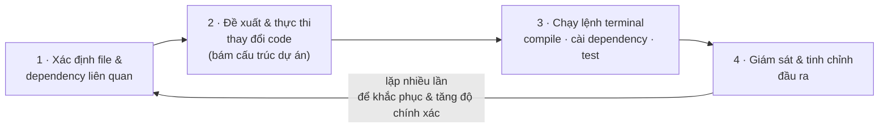

# Note 10 — Agent mode trong IDE

> **TL;DR:** **Agent Mode** không phải autocomplete nâng cấp — nó là **autonomous peer programmer** (*bạn lập trình ngang hàng tự trị*): **hiểu cả workspace**, **xử lý tác vụ động**, và **tự lặp trên đầu ra của chính mình** để cải thiện lời giải. Bốn mức tương tác với Copilot theo thứ tự tăng dần độ tự động: **Inline Suggestions → Copilot Chat → Copilot Edits → Agent Mode**. Vòng làm việc của agent gồm 4 việc: **xác định file & dependency liên quan → đề xuất và thực thi thay đổi → chạy lệnh terminal (compile, cài dependency, chạy test) → giám sát và tinh chỉnh, lặp nhiều lần**. Bảy năng lực lớn: autonomous operation · xử lý tác vụ đa bước · **multi-step orchestration (draft → review → accept)** · automated foundation building · advanced reasoning · context awareness · **iterative improvement / self-healing**. Chi phí: **mỗi handoff ~1 PRU**, chuỗi draft–review 2 bước thường **2–3 PRU**, **premium reasoning ~4+ PRU** (so với ~2 của model chuẩn). Giới hạn: **yếu với domain logic chuyên biệt, business rule tinh tế, hoặc khi thiếu ngữ cảnh quan trọng**.

## 1. Agent Mode là gì

> *"Unlike traditional coding assistants that provide simple autocomplete-style suggestions, Agent Mode functions as an autonomous peer programmer."*

Ba điều làm nó khác trợ lý truyền thống:

| | Trợ lý truyền thống | **Agent Mode** |
|---|---|---|
| Phạm vi hiểu | Ngữ cảnh **file hiện tại** | **Toàn bộ workspace** |
| Cách xử lý | Gợi ý **tĩnh** | **Xử lý tác vụ động** theo chu kỳ lặp |
| Với đầu ra của mình | Không quan tâm | **Tự lặp trên đầu ra để cải thiện lời giải** |

**Làm được gì:** tạo ứng dụng từ đầu · **refactor xuyên nhiều file** · viết và **chạy** test · **migrate code cũ sang framework hiện đại** · sinh tài liệu · tích hợp thư viện mới · trả lời câu hỏi phức tạp về codebase.

### 1.1. Cách hoạt động — chu kỳ 4 bước

Khả năng mạnh nhất: **phân tích cả codebase và xác định file cùng dependency liên quan TRƯỚC KHI sửa** — thay vì chỉ dựa vào ngữ cảnh trực tiếp của một file. Nhờ đó nó làm được việc cần **góc nhìn toàn dự án** như refactor xuyên file hay nâng cả ứng dụng lên framework mới.



### 1.2. Bốn mức tương tác với Copilot

| Mức | Bản chất | Phạm vi thay đổi |
|---|---|---|
| **Inline Suggestions** | Như autocomplete truyền thống nhưng nâng cao — **completion thời gian thực khi gõ** | Tại con trỏ |
| **Copilot Chat** | Panel chat riêng để hỏi về code; khác chat AI chung ở chỗ **trả lời theo ngữ cảnh file và dependency của dự án** | Hội thoại, bạn tự áp dụng |
| **Copilot Edits** | Áp **thay đổi xuyên nhiều file** theo mục tiêu cụ thể — hợp với **cập nhật quy mô lớn** | Nhiều file, bạn ra lệnh |
| **Agent Mode** | **Điều phối tác vụ phát triển một cách động**; **tự tinh chỉnh đầu ra và lặp nhiều lần** để tăng độ chính xác | Toàn dự án, agent tự quyết các bước |

```
★ Insight ─────────────────────────────────────
• Bốn mức này là một THANG TỰ ĐỘNG HOÁ, và ranh giới quan trọng nhất nằm giữa
  Copilot Edits và Agent Mode: Edits vẫn do BẠN quyết định thay đổi những file
  nào; Agent Mode tự quyết cả "file nào, lệnh gì, lặp mấy vòng". Câu hỏi tình
  huống "muốn sửa đồng loạt nhiều file theo một mục tiêu rõ ràng" → Copilot
  Edits, chưa cần Agent Mode.
• Tên gọi dễ nhầm: ở note 11 bạn sẽ thấy giáo trình gọi "Agent mode (Copilot
  Edits)" khi đối chiếu với Cloud Agent — tức trong ngữ cảnh so sánh cloud vs
  local, hai cái này được gộp làm một nhóm "chỉnh sửa tự trị TẠI MÁY".
─────────────────────────────────────────────────
```

## 2. Bảy năng lực của Agent Mode

### 2.1. Autonomous operation

Agent **tự phân tích yêu cầu, tự xác định file liên quan, tự quyết lệnh terminal cần chạy, và hiện thực giải pháp trọn vẹn — không cần chỉ dẫn từng bước**.

> **Ví dụ — Tạo một REST API endpoint mới.** Agent tự: tạo API route (`routes/api.js`) → cập nhật ứng dụng chính (`app.js`) → cài dependency cần thiết (`npm install express`) → sinh test case (`tests/api.test.js`).

Dù rất tự trị, agent vẫn cho bạn **minh bạch hoàn toàn và quyền kiểm soát từng thay đổi được đề xuất**.

### 2.2. Xử lý tác vụ phức tạp, nhiều bước

Agent giỏi **bẻ tác vụ phức tạp thành chuỗi hành động có cấu trúc, tuần tự**.

> **Ví dụ — Tích hợp một database mới vào ứng dụng có sẵn.** Agent tự: cập nhật dependency (`npm install mongoose`) → sinh logic kết nối DB (`database.js`) → sửa cấu hình môi trường (`.env`) → tạo định nghĩa data model (`models/userModel.js`) → viết test tự động kèm theo (`tests/userModel.test.js`).

### 2.3. Multi-step orchestration — workflow draft → review → accept

Thay vì cần bạn can thiệp ở mỗi bước, agent **draft, review và tinh chỉnh code trong một workflow liền mạch**.

> **Kịch bản: thêm user authentication vào ứng dụng.**

| Phase | Agent làm gì |
|---|---|
| **Draft** | Phân tích yêu cầu và sinh: **authentication middleware** (`middleware/auth.js`) · **user login routes** (`routes/auth.js`) · **password hashing utilities** (`utils/password.js`) · **form đăng nhập frontend cơ bản** (`views/login.html`) |
| **Review** | **Tự đánh giá bản draft của chính mình**: nhận diện **lỗ hổng bảo mật tiềm ẩn trong xử lý mật khẩu** · đề xuất cải thiện **pattern xử lý lỗi** · khuyến nghị **validation thêm cho edge case** · đề xuất **unit test cho các hàm xác thực trọng yếu** |
| **Accept** | Bạn review bản đã tinh chỉnh, **sẵn sàng mở PR**: tính năng hoàn chỉnh **kèm best practice bảo mật** · xử lý lỗi và validation đầy đủ · code **sẵn sàng merge**, theo convention dự án · **tài liệu và test có từ đầu** |

Cách làm này **loại bỏ các vòng qua lại review truyền thống**, giúp giao tính năng production-ready nhanh hơn.

> 💰 **Note gốc:** **mỗi handoff trong Agent Mode tốn ~1 PRU**. Một chuỗi **draft–review 2 bước thường tốn 2–3 PRU**.

### 2.4. Automated foundation building

Agent toả sáng ở **các việc setup lặp đi lặp lại**, để dev tập trung vào **logic nghiệp vụ cốt lõi** thay vì boilerplate.

> **Kịch bản: dựng một microservice mới.**

| Agent tự sinh | Dev tập trung vào |
|---|---|
| **Cấu trúc dự án** với thư mục chuẩn (`src/`, `tests/`, `config/`) | **Hiện thực logic nghiệp vụ và domain model** cụ thể |
| **Cấu hình package** (`package.json`, `Dockerfile`, `.gitignore`) | **Tuỳ biến nền móng đã sinh** cho yêu cầu riêng |
| **Thiết lập framework test** (`jest.config.js`, file test mẫu) | **Thêm tích hợp chuyên biệt và workflow tuỳ chỉnh** |
| **Cấu hình CI/CD pipeline** (`.github/workflows/test.yml`) | |
| **Template cấu hình môi trường** (`.env.example`, `config/default.js`) | |
| **Monitoring & logging cơ bản** (`utils/logger.js`, health check endpoint) | |

### 2.5. Advanced reasoning capabilities

Với kịch bản phức tạp cần phân tích sâu, agent dùng được **premium reasoning**:

| Năng lực | Nội dung |
|---|---|
| **Architectural decision analysis** | Đánh giá **đánh đổi giữa các hướng hiện thực** khác nhau |
| **Cross-system impact assessment** | Hiểu **thay đổi ảnh hưởng tới nhiều component** ra sao |
| **Performance optimization strategies** | Xác định **nút thắt cổ chai** và đề xuất cải thiện |
| **Security vulnerability analysis** | Phát hiện và đề xuất sửa **lỗ hổng bảo mật tiềm ẩn** |

> 💰 **Note gốc:** **premium reasoning** (dùng model tiên tiến hơn) cho ngữ cảnh giàu và phân tích sâu hơn, nhưng **thường làm PRU tiêu tốn gấp đôi**: **một request có thể tốn ~4+ PRU** so với **~2 PRU** với model chuẩn.

### 2.6. Intelligent tools & context awareness

Agent dùng **ngữ cảnh từ file, dependency và hành động trước đó** của dự án.

> **Ví dụ — deploy một ứng dụng React.** Agent: **nhận ra loại dự án qua `package.json`** → **chạy build script phù hợp** (`npm run build`) → **chuẩn bị deployment script bám theo workflow sẵn có**.

**Cấp ngữ cảnh rõ và đầy đủ thì kết quả chính xác hơn.**

### 2.7. Iterative improvement & self-healing

Sức mạnh cốt lõi: **giải quyết vấn đề theo kiểu lặp**. Khi có lỗi, agent **tự phát hiện, tự sửa và tự kiểm chứng lại** — giảm mạnh công debug tay.

> **Ví dụ self-healing:** unit test sinh ra ban đầu **fail do lỗi cú pháp**. Agent tự: **phát hiện nguyên nhân thất bại** → **áp dụng giải pháp sửa** → **chạy lại test tới khi pass**.

## 3. Kiểm soát của người dùng & giới hạn

### 3.1. User control and oversight

Dù tự trị, agent **giữ dev hoàn toàn ở thế kiểm soát**: **mọi hành động đề xuất đều review được, điều chỉnh được, hoặc hoàn tác được bất cứ lúc nào**.

> **Ví dụ:** agent đề xuất thay đổi lớn cho logic xác thực. Dev có thể **review tóm tắt thay đổi trong một pull request** · **yêu cầu chỉnh sửa cụ thể** · **hoàn tác hoặc điều chỉnh dễ dàng**.

### 3.2. Limitations and practical considerations

Agent Mode **có giới hạn**. Nó **gặp khó với**:

- **Logic nghiệp vụ chuyên biệt (specialized domain logic)**
- **Business rule tinh tế (nuanced business rules)**
- **Khi thiếu ngữ cảnh dự án quan trọng (critical project context is missing)**

> **Ví dụ giới hạn:** **logic nghiệp vụ tuỳ chỉnh nhưng được tài liệu hoá kém**. Hậu quả: **lời giải kém chính xác hoặc không đầy đủ**, **cần review và can thiệp thủ công nhiều hơn**.

Hiểu giới hạn giúp **đặt kỳ vọng thực tế** và **cấp ngữ cảnh rõ hơn** để tối đa kết quả.

```
★ Insight ─────────────────────────────────────
• Ba giới hạn của Agent Mode đều quy về MỘT nguyên nhân gốc: THIẾU NGỮ CẢNH
  ĐƯỢC VIẾT RA. Domain logic chuyên biệt và business rule tinh tế chỉ "khó"
  vì chúng nằm trong đầu người, không nằm trong repo. Đó là lý do vì sao giải
  pháp ở mọi note khác đều giống nhau: viết custom instructions, tài liệu hoá,
  đính kèm ngữ cảnh (Space, #file, copilot-instructions.md).
• Ba mốc PRU của agent gộp lại thành một thang dễ nhớ:
    1 handoff ≈ 1 PRU · draft–review 2 bước ≈ 2–3 PRU · premium reasoning ≈ 4+ PRU
  Chúng cộng dồn với mốc ở note 04 (lịch sử chat 2–3 PRU/lượt) và note 08
  (PR summary 1–2, code review 1–3) — một ngày làm việc agentic tiêu PRU rất nhanh.
─────────────────────────────────────────────────
```

## Q&A phỏng vấn

**Q1. Agent Mode khác trợ lý code truyền thống ở ba điểm nào?**
→ Hiểu **toàn bộ workspace** (không chỉ file hiện tại) · **xử lý tác vụ động** theo chu kỳ lặp (không gợi ý tĩnh) · **tự lặp trên đầu ra của chính nó** để cải thiện lời giải.

**Q2. Kể 4 mức tương tác với Copilot theo thứ tự tăng dần độ tự động.**
→ **Inline Suggestions → Copilot Chat → Copilot Edits → Agent Mode**.

**Q3. Bạn cần áp một thay đổi nhất quán lên 12 file theo một mục tiêu rõ ràng. Dùng gì?**
→ **Copilot Edits** — thiết kế đúng cho **thay đổi xuyên nhiều file theo mục tiêu cụ thể**. Agent Mode là mức cao hơn, dùng khi cần agent **tự quyết cả các bước**.

**Q4. Chu kỳ làm việc 4 bước của Agent Mode?**
→ Xác định file & dependency liên quan → đề xuất và thực thi thay đổi bám cấu trúc dự án → chạy lệnh terminal (compile, cài dependency, test) → giám sát và tinh chỉnh đầu ra, lặp nhiều lần.

**Q5. Workflow draft–review–accept diễn ra thế nào?**
→ **Draft**: agent sinh bộ file cho tính năng. **Review**: **agent tự đánh giá draft của mình** — tìm lỗ hổng bảo mật, cải thiện xử lý lỗi, thêm validation edge case, đề xuất unit test. **Accept**: bạn nhận bản đã tinh chỉnh, **PR-ready**.

**Q6. Self-healing là gì? Cho ví dụ.**
→ Agent **tự phát hiện, sửa và kiểm chứng lại** khi có lỗi. Ví dụ: test sinh ra fail vì lỗi cú pháp → agent phát hiện nguyên nhân → sửa → **chạy lại test tới khi pass**.

**Q7. Ba mốc PRU của Agent Mode?**
→ **~1 PRU mỗi handoff** · **2–3 PRU** cho chuỗi draft–review 2 bước · **~4+ PRU** cho một request dùng **premium reasoning** (so với ~2 PRU model chuẩn).

**Q8. Agent Mode yếu ở đâu và khắc phục thế nào?**
→ Yếu với **domain logic chuyên biệt**, **business rule tinh tế**, và **khi thiếu ngữ cảnh dự án quan trọng** (ví dụ business logic tuỳ chỉnh tài liệu hoá kém). Khắc phục: **cấp ngữ cảnh rõ hơn** — tài liệu hoá, custom instructions.

## Tự kiểm tra

1. Cụm từ giáo trình dùng để định nghĩa Agent Mode? *("autonomous peer programmer")*
2. Sáu việc Agent Mode làm được (ngoài sinh code)? *(tạo app từ đầu · refactor xuyên file · viết & chạy test · migrate legacy sang framework mới · sinh tài liệu · tích hợp thư viện mới · trả lời câu hỏi phức tạp về codebase)*
3. Trong ví dụ "tạo REST API endpoint", agent tạo và sửa những file nào? *(routes/api.js · app.js · npm install express · tests/api.test.js)*
4. Phase Review của workflow orchestration làm 4 việc gì?
5. Trong ví dụ deploy React, agent nhận biết loại dự án qua đâu? *(`package.json`)*
6. Ba giới hạn của Agent Mode?

## Liên quan
- [[00-MOC-GH300|⬅ MOC GH-300]]
- Trước: [[09-Copilot-CLI-va-GitHub-Copilot-App]] · Kế tiếp: [[11-Copilot-Cloud-Agent]]
- [[07-Copilot-trong-IDE]] — Inline suggestion và Chat, hai mức thấp hơn trên cùng thang
- [[12-GitHub-MCP-Server]] — MCP mở rộng agent mode ra ngoài môi trường code
- [[16-Unit-Testing-voi-Copilot]] — Plan mode & Agent mode áp cho workflow kiểm thử
- [[../../05-Cloud/02-Azure/AI-103/09-Agent-Framework-va-Multi-Agent|AI-103/09]] — agent tự trị và orchestration ở góc Azure
