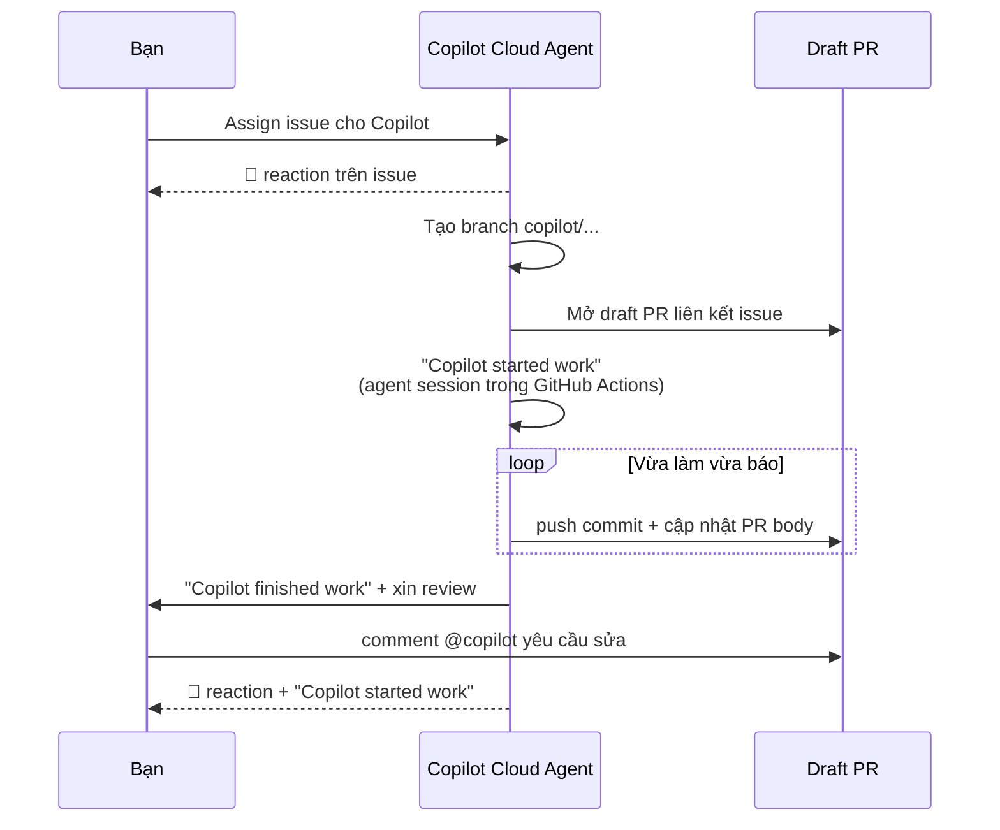

# Note 11 — GitHub Copilot Cloud Agent

> **TL;DR:** **Cloud Agent** là **trợ lý phát triển tự trị và bất đồng bộ chạy BÊN TRONG GitHub** — như một **đồng đội chạy nền**. Bạn giao một tác vụ **có phạm vi rõ ràng** (sửa bug, tính năng nhỏ, cập nhật tài liệu) → nó **tạo branch `copilot/`, khám phá codebase, lập kế hoạch hiện thực, viết code**, rồi **mở draft PR và xin bạn review**. Có ở **Pro, Pro+, Business, Enterprise**. Tốn **2 loại tài nguyên: GitHub Actions minutes** (môi trường build/test tạm thời) và **PRU** (từ 4/6/2025: **một premium request cho mỗi model request**). Bảo mật: chạy trong **sandbox GitHub Actions có firewall, quyền đọc repo**, **chỉ push được lên nhánh `copilot/`**, **chỉ nghe user có write permission**, **người yêu cầu PR không được tự duyệt**, **commit coauthored**, và **lọc ký tự ẩn chống prompt injection**. Giới hạn quan trọng: **mở đúng 1 PR mỗi task**, **không ký commit**, **chỉ chạy trên Ubuntu x64 GitHub-hosted runner**, **KHÔNG tôn trọng content exclusions**, **không thay được model**. Tuỳ biến bằng **`.github/workflows/copilot-setup-steps.yml`** và mở rộng bằng **MCP** (mặc định có **GitHub MCP Server** + **Playwright MCP Server**).

## 1. Cloud Agent là gì

> *"An autonomous development assistant that runs inside GitHub itself… the agent acts like a background teammate."*

| Khía cạnh | Nội dung |
|---|---|
| **Bạn đưa gì** | Một **tác vụ có phạm vi rõ ràng** (*clearly scoped task*): sửa bug, tính năng tăng dần, cập nhật tài liệu |
| **Nó làm gì** | **Tạo branch** → **khám phá codebase** → **sinh implementation plan** → **viết code** |
| **Ai quyết định** | **Bạn** quyết định **có mở PR không và khi nào** |
| **Gói hỗ trợ** | **Copilot Pro · Pro+ · Business · Enterprise** *(không có Free)* |
| **Repository** | Mọi repo GitHub-hosted, **TRỪ** repo thuộc **managed user account** hoặc nơi agent bị **tắt tường minh** |

### 1.1. Năm loại việc giao được

| Việc | |
|---|---|
| **Sửa bug và regression** | **Hiện thực tính năng mới tăng dần** |
| **Tăng test coverage / sinh test còn thiếu** | **Cập nhật hoặc tạo tài liệu** |
| **Xử lý technical debt** và các mục backlog "nice-to-have" | |

### 1.2. Hai cách giao việc

| Cách | Nơi thực hiện |
|---|---|
| **Assign một issue cho Copilot** | **GitHub.com · GitHub Mobile · API/CLI** |
| **Nhờ Copilot thay đổi code** | **Agents panel trên GitHub · Copilot Chat · IDE của bạn hoặc công cụ agentic khác có hỗ trợ MCP · Raycast trên macOS** |

Khi xong, agent **xin bạn review**. Bạn **mention `@copilot` trong comment của pull request** để yêu cầu nó lặp lại công việc.

### 1.3. Khác gì trợ lý IDE truyền thống

| | Trợ lý IDE truyền thống | **Cloud Agent** |
|---|---|---|
| Các bước thủ công | **Bạn** tạo branch, push commit, viết mô tả PR, lặp | **Agent tự động hoá** tạo branch, commit message, viết code |
| Tính hiển thị | Diễn ra trong **phiên riêng tư**, đồng đội không thấy | **Mọi việc là commit trên GitHub**, thấy được qua **session log và PR history** |
| Cách bạn điều khiển | Phiên **đồng bộ, cục bộ** | **Qua comment review trên PR** |

→ Tạo ra **minh bạch và cơ hội cộng tác** — đồng đội thấy từng bước và nhảy vào khi cần.

### 1.4. Cloud Agent vs "Agent Mode" trong IDE — điểm thi

| | **Cloud agent** | **Agent mode (Copilot Edits)** |
|---|---|---|
| Chạy ở đâu | **Môi trường do GitHub Actions cung cấp**, tự trị | **Ngay trong phiên IDE của bạn** |
| Làm gì | Hoàn thành tác vụ phát triển bạn giao qua **issue hoặc Copilot Chat** | **Chỉnh sửa cục bộ tự trị** |

### 1.5. Bật agent

| Loại repo | Ai cấu hình |
|---|---|
| **Repo thuộc tổ chức** | **Admin của organization hoặc enterprise** quản lý khả dụng |
| **Repo cá nhân** | Cấu hình trong **account settings** của bạn |

### 1.6. Chi phí: Actions minutes + PRU

Cloud Agent dùng **hai tài nguyên chính**:

| Tài nguyên | Dùng cho |
|---|---|
| **GitHub Actions minutes** | **Môi trường build/test tạm thời (ephemeral)** nơi agent làm việc |
| **Copilot Premium Requests (PRU)** | Cấp năng lượng cho **suy luận model nâng cao** |

> 💰 **Note gốc:** **từ ngày 4 tháng 6 năm 2025**, agent dùng **một premium request cho MỖI model request nó thực hiện**. Trong hạn mức Actions và premium request hằng tháng, bạn chạy tác vụ **không mất phí thêm**.
> **Tip gốc:** dùng PRU **ở nơi nó tạo giá trị** — sửa nhiều file, sinh test, diff rộng cần suy luận sâu. Sửa nhẹ thì cần ít bước tốn PRU hơn.

## 2. Bảo mật, rủi ro & giới hạn

### 2.1. Sáu lớp bảo vệ dựng sẵn

| Lớp | Nội dung |
|---|---|
| **Subject to governance** | Cài đặt organization/enterprise **quản lý khả dụng**; **mọi chính sách bảo mật của bạn vẫn áp lên agent** |
| **Restricted environment** | Agent chạy trong **sandbox trên GitHub Actions**, **internet có firewall**, **quyền chỉ-đọc với repository** |
| **Branch limits** | **Chỉ tạo và push được lên branch bắt đầu bằng `copilot/`**; **mọi branch protection và required check vẫn áp dụng** |
| **Permission-aware** | **Chỉ phản hồi user có quyền write**. Comment của người khác **bị bỏ qua** |
| **Outside-collaborator rules** | **Draft PR từ agent cần được user có quyền write phê duyệt trước khi Actions chạy**. **Người yêu cầu PR KHÔNG được tự duyệt** |
| **Compliance and attribution** | **Mọi commit đều coauthored với developer đã giao task hoặc yêu cầu PR** → quy trách nhiệm rõ ràng; quy tắc "required approvals" sẵn có **vẫn nguyên vẹn** |

### 2.2. Ba rủi ro & cách giảm thiểu

| Rủi ro | Biện pháp giảm thiểu |
|---|---|
| **Agent pushes code** | Chỉ user có **write access** kích hoạt được · push **giới hạn ở nhánh `copilot/`** (không phải main/master) · credential của agent **chỉ cho phép simple push** (không `git push` trực tiếp) · **workflow Actions không chạy tới khi user có quyền write bấm "Approve and run workflows"** · **người yêu cầu không được duyệt PR của agent** |
| **Access to sensitive information** | **Internet của agent bị firewall hạn chế mặc định**; bạn **tuỳ biến hoặc tắt firewall** theo chính sách |
| **Prompt injection** | **Ký tự ẩn (như HTML comment) bị lọc** trước khi đưa đầu vào của user cho agent → giảm khả năng chỉ dẫn độc hại giấu trong comment hoặc issue |

> Dù có các kiểm soát này, **vẫn phải review kỹ đầu ra** như với code của bất kỳ thành viên nào.

### 2.3. Giới hạn đã biết

**Giới hạn workflow:**

| Giới hạn |
|---|
| **Chỉ thay đổi được trong CÙNG repository** với issue/PR được giao |
| **Phạm vi ngữ cảnh mặc định giới hạn ở repo được giao** — mở rộng được **qua MCP** |
| **Mở đúng MỘT pull request mỗi task** |
| **Không sửa được PR có sẵn mà nó không tạo ra** — nếu cần góp ý thì **thêm nó làm reviewer** (dùng GitHub Copilot code review) |

**Giới hạn tương thích:**

| Giới hạn |
|---|
| **Không ký commit (doesn't sign commits)** — nếu bạn bắt buộc signed commit thì **phải viết lại lịch sử commit trước khi merge** |
| **Cần GitHub-hosted Ubuntu x64 runner** — **self-hosted runner KHÔNG được hỗ trợ** |
| **Không dùng được cho repo cá nhân thuộc managed user account** (không có runner) |
| ⚠️ **KHÔNG tôn trọng content exclusions** — **agent thấy và sửa được cả file đã bị loại trừ** |
| ⚠️ **Chính sách "Suggestions matching public code" KHÔNG được agent thực thi** — có thể **không cung cấp reference** |
| **Chỉ làm việc với repository do GitHub host** |
| **Bạn KHÔNG đổi được model AI của agent** — GitHub chọn |

```
★ Insight ─────────────────────────────────────
• Hai giới hạn có đánh dấu ⚠️ ở trên là điểm thi NGUY HIỂM nhất của cả module,
  vì chúng đi ngược trực giác: bạn đã bật content exclusions và public code
  filter (note 14) nhưng Cloud Agent KHÔNG tuân theo cả hai. Hệ quả thực tế:
  nếu repo có file nhạy cảm dựa vào content exclusion để che, giao việc cho
  Cloud Agent là phá vỡ giả định bảo mật đó.
• Quy tắc "người yêu cầu PR không được tự duyệt" xuất hiện tới BA lần trong
  nguồn (security model, risk mitigation, approvals) — dấu hiệu rõ đây là ý
  then chốt: nó bảo toàn nguyên tắc "required reviews" và bảo đảm luôn có
  MỘT CON NGƯỜI THỨ HAI nhìn vào code của agent trước khi merge.
─────────────────────────────────────────────────
```

## 3. Giao việc, theo dõi & xử lý sự cố

### 3.1. Vòng đời một task



Agent nhận được **tiêu đề issue, mô tả và các comment ĐANG CÓ tại thời điểm assign**.
⚠️ **Comment thêm vào issue SAU đó agent KHÔNG thấy** — muốn bổ sung thông tin thì **comment trực tiếp trên pull request của agent**.

### 3.2. Assign issue trên giao diện

Trên GitHub.com: vào tab **Issues** của repo → mở issue → **sidebar phải, mục Assignees → chọn Copilot** (y như assign cho một user).
Ngoài ra assign được từ: **danh sách issue trên trang Issues** · **GitHub Projects** · **GitHub Mobile** · **GitHub CLI (`gh issue edit`)**.

### 3.3. Assign qua GraphQL API

Quy trình 4 bước:

1. **Kiểm tra agent có sẵn không** — query `suggestedActors` của repo, xác nhận **`copilot-swe-agent`** xuất hiện trong danh sách:

```graphql
query {
  repository(owner: "octo-org", name: "octo-repo") {
    suggestedActors(capabilities: [CAN_BE_ASSIGNED], first: 100) {
      nodes { login __typename ... on Bot { id } ... on User { id } }
    }
  }
}
```

2. **Lấy repository ID:**

```graphql
query {
  repository(owner: "octo-org", name: "octo-repo") { id }
}
```

3. **Tạo và assign issue mới** — mutation `createIssue`, truyền repository ID và **bot ID của Copilot**:

```graphql
mutation {
  createIssue(
    input: {
      repositoryId: "REPOSITORY_ID",
      title: "Implement comprehensive unit tests",
      body: "DETAILS",
      assigneeIds: ["BOT_ID"]
    }
  ) {
    issue { id title assignees(first: 10) { nodes { login } } }
  }
}
```

4. **Assign issue đã có** — lấy issue ID rồi dùng mutation **`replaceActorsForAssignable`**:

```graphql
mutation {
  replaceActorsForAssignable(
    input: { assignableId: "ISSUE_ID", actorIds: ["BOT_ID"] }
  ) {
    assignable {
      ... on Issue { id title assignees(first: 10) { nodes { login } } }
    }
  }
}
```

> Cách này hữu ích để **tích hợp Copilot vào workflow tự động**.

### 3.4. Năm tín hiệu theo dõi tiến độ

| # | Tín hiệu | Nội dung |
|---|---|---|
| 1 | **Immediate confirmation** | Ngay sau khi assign, Copilot thêm **reaction 👀** vào issue |
| 2 | **Draft pull request creation** | **Trong vài giây**, Copilot mở **draft PR liên kết issue gốc**; timeline của issue hiện event mới |
| 3 | **Active agent session** | Event **"Copilot started work"** xuất hiện trong PR timeline; agent **cập nhật PR body bằng status message đều đặn** và **push commit lên nhánh riêng** |
| 4 | **Live session logs** | **Mọi phiên — cũ và mới — xem được từ trang Agents.** Bấm **View session** trên PR để mở **log viewer thời gian thực**. Cần dừng thì bấm **Stop session** |
| 5 | **Completion and review** | Agent session **tự kết thúc**; event **"Copilot finished work"** xuất hiện; Copilot **xin review** và gửi thông báo |

![[cloud-agent-session.png]]

*Ảnh: Microsoft Learn — phiên agent đang chạy hiển thị trong timeline của pull request.*
Điểm khác biệt lớn nhất so với agent trong IDE nằm ở đây: **mọi bước đều là sự kiện công khai trên GitHub** ("Copilot started work", commit đẩy lên nhánh `copilot/`, status message cập nhật trong PR body). Đồng đội của bạn nhìn thấy toàn bộ tiến trình mà không cần bạn kể lại — đó chính là "traceability" mà mục 1.3 nói tới.

### 3.5. Lặp cùng Copilot

Bạn hướng dẫn Copilot **giống như hướng dẫn một cộng tác viên là người**: qua **comment và review**.

- **Mention `@copilot` trong comment của PR** để yêu cầu thay đổi.
- **Chỉ comment từ user có quyền write được xử lý.**
- Copilot **đăng reaction 👀** để xác nhận đã nhận, rồi thêm **"Copilot started work"** vào PR timeline khi tiếp tục.

### 3.6. Phê duyệt & workflow

| Quy tắc |
|---|
| PR do Copilot tạo **luôn ở trạng thái draft** |
| **Cần con người phê duyệt trước khi merge** |
| **Workflow GitHub Actions do agent kích hoạt KHÔNG tự chạy** — bấm **"Approve and run workflows"** trong merge box |
| **Developer đã nhờ Copilot tạo PR KHÔNG được duyệt PR đó** → bảo toàn quy tắc "required reviews" và bảo đảm có review độc lập trước merge |

### 3.7. Sổ tay xử lý sự cố

| Triệu chứng | Cách xử lý |
|---|---|
| **Copilot không có trong danh sách "Assignees"** | Kiểm tra **gói hợp lệ (Pro, Pro+, Business, Enterprise)** · xác nhận agent **không bị tắt ở mức org/repo** · kiểm tra tại **`github.com/settings/copilot/features`** |
| **Repo cá nhân của Enterprise Managed User (EMU)** | **Agent không khả dụng** — dùng **repo thuộc tổ chức** (cần GitHub-hosted runner) |
| **"Cannot create a pull request" từ Chat** | Bảo đảm agent khả dụng. **Trong IDE phải mention `@github` trong prompt** (trên GitHub.com thì không cần) |
| **Đã assign issue nhưng không có gì xảy ra** | **Refresh**; tìm **reaction 👀**, rồi tới **draft PR** |
| **Có PR nhưng không tiến triển** | Kiểm tra PR timeline có **"Copilot started work"** không; mở **View session logs** |
| **Agent không phản hồi comment trên PR** | Xác nhận bạn **có quyền write** và đã **mention `@copilot` trên PR của agent** |
| **Có vẻ bị treo** | Có thể tự phục hồi; **phiên timeout sau MỘT GIỜ**. Thử **unassign/reassign issue** hoặc **đăng lại comment** |
| **Actions không chạy** | Bấm **"Approve and run workflows"** trong merge box |
| **Push không qua CI** | Cấp hướng dẫn rõ ở mức repo qua **`.github/copilot-instructions.md`** để agent **tự kiểm chứng bằng test/linter** |
| **Cảnh báo firewall** | Internet bị hạn chế mặc định; cảnh báo **liệt kê địa chỉ và lệnh bị chặn**. Điều chỉnh theo tài liệu tuỳ biến firewall |
| **Ảnh không được nhận** | **Kích thước ảnh tối đa 3,00 MiB** — ảnh lớn hơn **bị loại bỏ** |

## 4. Tuỳ biến, mở rộng & kiểm chứng

### 4.1. Preseed môi trường bằng `copilot-setup-steps.yml`

Tạo **`.github/workflows/copilot-setup-steps.yml`** trên **nhánh mặc định** của repo. Workflow **phải định nghĩa đúng MỘT job tên `copilot-setup-steps`**, chứa các bước cài dependency/dựng tool.

```yaml
name: "Copilot Setup Steps"

on:
  workflow_dispatch:
  push:
    paths:
      - .github/workflows/copilot-setup-steps.yml
  pull_request:
    paths:
      - .github/workflows/copilot-setup-steps.yml

jobs:
  copilot-setup-steps:
    runs-on: ubuntu-latest
    permissions:
      contents: read
    steps:
      - name: Checkout code
        uses: actions/checkout@v5
      - name: Set up Node.js
        uses: actions/setup-node@v4
        with:
          node-version: "20"
          cache: "npm"
      - name: Install JavaScript dependencies
        run: npm ci
```

**Các key cấu hình được phép** cho job `copilot-setup-steps`: **`steps`, `permissions`, `runs-on`, `container`, `services`, `snapshot`, `timeout-minutes` (≤ 59)**.
Mọi `fetch-depth` của `actions/checkout` **bị ghi đè** để cho phép rollback an toàn. Setup workflow **chạy độc lập được** (để bạn kiểm chứng) và **tự chạy trước khi agent bắt đầu**.

| Tuỳ biến thêm | Cách làm |
|---|---|
| **Runner lớn hơn** | Thêm larger runner trước, rồi đặt `runs-on` thành label/group (ví dụ **`ubuntu-4-core`**). **Chỉ Ubuntu x64**, không hỗ trợ self-hosted |
| **Git LFS** | Bật trong setup step: `uses: actions/checkout@v5` với `lfs: true` |
| **Firewall** | Truy cập internet **hạn chế mặc định để giảm rủi ro exfiltration**; **tuỳ biến hoặc tắt** theo chính sách tổ chức |

### 4.2. Mở rộng bằng MCP

**MCP** là **chuẩn mở kết nối LLM với tool và dữ liệu**. Agent dùng được tool từ **MCP server cục bộ hoặc từ xa**.

> ⚠️ **Note gốc:** Cloud Agent **chỉ hỗ trợ MCP tools** — **KHÔNG hỗ trợ resources hoặc prompts**. **Remote MCP server yêu cầu OAuth thì KHÔNG được hỗ trợ.**

**Hai MCP server mặc định:**

| Server | Năng lực |
|---|---|
| **GitHub MCP Server** | Truy cập **issue, PR và dữ liệu GitHub** bằng **token chỉ-đọc mặc định giới hạn ở repo hiện tại** (tuỳ biến được token) |
| **Playwright MCP Server** | **Đọc, tương tác và chụp màn hình trang web** truy cập được **bên trong môi trường agent** (`localhost` / `127.0.0.1`) |

**Cấu hình repo:** admin **khai báo MCP server bằng cấu hình JSON trong repo**. Sau khi cấu hình, agent **tự chủ dùng các tool khả dụng — KHÔNG có prompt phê duyệt cho từng lần dùng**.

**Ba best practice với MCP:** **rà soát MCP server bên thứ ba** về hiệu năng và chất lượng đầu ra · **ưu tiên read tool**, nếu có write tool thì **chỉ cho phép cái thực sự cần** · **kiểm chứng kỹ cấu hình MCP trước khi lưu**.

### 4.3. Kiểm thử & kiểm chứng đầu ra

**Bạn vẫn chịu trách nhiệm về chất lượng và bảo mật:**

| Việc |
|---|
| **Chạy CI (test, linter, scanning) trên MỌI PR của agent** — các check này **không chạy tới khi bạn bấm "Approve and run workflows"** |
| **Tự kiểm tra thủ công vùng tác động lớn hoặc nhạy cảm** |
| **Nhờ agent sinh test** (ví dụ: *"Add Jest unit tests for all functions in src/utils/ following repo style"*) — **sinh test đa file tiêu PRU** |
| **Áp rulesets** để PR của agent **phải qua test + scanning + linting trước khi merge** |
| **Gắn nhãn PR của agent** (ví dụ `agent-refactor`, `agent-tests`) để theo dõi, phân loại và revert khi cần |
| **Lặp lại chỉ dẫn trong `.github/copilot-instructions.md`** khi thấy agent mắc lỗi lặp lại |
| **Revert nhanh** khi cần và yêu cầu agent thay đổi mới |

**Dùng PRU có chủ đích:** dồn PRU cho **kiểm chứng sâu** — mở rộng test coverage, audit xuyên nhiều thư mục, quét vùng rủi ro. Check nhẹ tốn ít PRU, nên **áp dụng có chủ đích để tối đa giá trị**.

## 5. Dùng có trách nhiệm

### 5.1. Agent chạy end-to-end thế nào — 4 giai đoạn

| Giai đoạn | Nội dung |
|---|---|
| **Prompt processing** | Tác vụ (từ **issue, comment PR, hoặc tin nhắn Copilot Chat**) được **kết hợp với thông tin ngữ cảnh liên quan** thành prompt. Đầu vào có thể là **ngôn ngữ tự nhiên, code snippet, hoặc ẢNH** |
| **Language model analysis** | Prompt đi qua LLM, **phân tích để agent suy luận về tác vụ và dùng tool cần thiết** |
| **Response generation** | LLM sinh phản hồi — dạng **gợi ý ngôn ngữ tự nhiên và gợi ý code** |
| **Output formatting** | Sau lần chạy đầu, agent **cập nhật mô tả PR bằng những thay đổi đã làm**; có thể **kèm thông tin về tài nguyên nó không truy cập được** và gợi ý cách xử lý |

Bạn phản hồi bằng comment trong PR hoặc mention **`@copilot`** → agent **gửi lại phản hồi đó cho LLM để phân tích tiếp**, rồi trả lời comment kèm thay đổi mới.

> **Ghi chú quan trọng:** *"You are responsible for reviewing and validating responses generated by Copilot"*. GitHub cũng thực hiện **red teaming** (kiểm thử đối kháng) để hiểu và cải thiện độ an toàn của agent. Agent được đánh giá trên nhiều ngôn ngữ lập trình, với **tiếng Anh là ngôn ngữ chính được hỗ trợ**.

### 5.2. Năm use case

**Codebase maintenance** (sửa bảo mật, nâng dependency, refactor có mục tiêu) · **Documentation** · **Feature development** (tính năng tăng dần) · **Improving test coverage** · **Prototyping new projects** (dựng ý tưởng mới từ đầu).

### 5.3. Cách tăng hiệu quả

**Tác vụ phải well-scoped**, cung cấp:

1. **Mô tả rõ vấn đề cần giải hoặc công việc cần làm.**
2. **Acceptance criteria đầy đủ** về thế nào là lời giải tốt (ví dụ: có cần unit test không?).
3. **Gợi ý/chỉ dẫn về những file nào cần thay đổi.**

**Bổ sung ngữ cảnh:** agent dùng **prompt, comment và code của repo** làm ngữ cảnh → cải thiện kết quả bằng **custom Copilot instructions** để agent hiểu **cách build, test và validate** thay đổi của nó. Ngoài ra tuỳ biến **môi trường phát triển**, **firewall**, và **mở rộng bằng MCP**.

**Ba nguyên tắc dùng có trách nhiệm:**

- **Dùng agent như một công cụ, không phải người thay thế** — luôn review và test trước khi merge.
- **Giữ thực hành viết code an toàn và code review** — code đúng cú pháp **chưa chắc an toàn**: tránh hard-code secret, ngừa lỗ hổng injection, kiểm thử nghiêm ngặt, quét IP và lỗ hổng.
- **Gửi feedback** (thumbs-down dưới phản hồi hoặc diễn đàn cộng đồng) và **cập nhật liên tục** vì agent còn đang tiến hoá.

### 5.4. Ba nhóm biện pháp bảo mật (tổng hợp lại)

| Nhóm | Biện pháp |
|---|---|
| **Chống leo thang đặc quyền** | Chỉ phản hồi user có **write access** · workflow Actions do PR của agent kích hoạt **cần user write phê duyệt** · **lọc ký tự ẩn** chống prompt injection |
| **Giới hạn quyền của Copilot** | **Chỉ truy cập repo được scope** (không sang repo khác) · **push chỉ vào nhánh `copilot/`** · **KHÔNG truy cập được Actions secrets/variables của org/repo lúc runtime** — **chỉ secret/variable thêm vào environment tên `copilot` mới được truyền cho agent** |
| **Chống rò rỉ dữ liệu** | **Firewall bật mặc định** để ngăn exfiltration code hoặc dữ liệu nhạy cảm, dù vô tình hay cố ý |

### 5.5. Sáu giới hạn về chất lượng

| Giới hạn | Nội dung |
|---|---|
| **Limited scope & quality** | LLM có thể không xử lý được **cấu trúc code nhất định hoặc ngôn ngữ ít phổ biến**; chất lượng thay đổi theo độ phủ ngôn ngữ |
| **Potential biases** | Dữ liệu huấn luyện và ngữ cảnh truy xuất **có thể chứa thiên lệch**; agent có thể **nghiêng về ngôn ngữ hoặc phong cách nhất định** |
| **Security risks** | Code sinh ra dựa trên ngữ cảnh repo và **có thể lộ thông tin nhạy cảm nếu không được review** |
| **Inaccurate code** | Code **trông đúng nhưng có thể sai ngữ nghĩa/cú pháp** hoặc lệch ý định |
| **Public code** | Agent **có thể tạo ra đoạn trùng hoặc gần trùng public code KỂ CẢ khi đã đặt "Block"**; **có thể không cung cấp reference** |
| **Legal/regulatory** | Bảo đảm tuân thủ nghĩa vụ pháp lý; tránh các mục đích bị cấm theo điều khoản dịch vụ |

```
★ Insight ─────────────────────────────────────
• Chi tiết "chỉ secret/variable thêm vào environment tên `copilot` mới được
  truyền cho agent" là mẹo cấu hình then chốt và cũng là câu trả lời cho tình
  huống "agent không chạy được test vì thiếu API key": bạn KHÔNG thêm secret
  vào repo như bình thường, mà phải tạo environment tên `copilot`.
• Toàn bộ mô hình bảo mật của Cloud Agent dựng trên đúng một ý tưởng: BIẾN
  AGENT THÀNH OUTSIDE COLLABORATOR. Nó có quyền đọc, push vào nhánh riêng có
  tiền tố, PR luôn là draft, và cần một người khác duyệt. Nếu nhớ ý tưởng
  gốc này, bạn suy ra được gần hết các quy tắc chi tiết mà không cần học thuộc.
─────────────────────────────────────────────────
```

## Q&A phỏng vấn

**Q1. Cloud Agent chạy ở đâu và làm gì khi nhận task?**
→ Chạy **bên trong GitHub**, trong **sandbox do GitHub Actions cung cấp**. Nó **tạo branch `copilot/`**, **khám phá codebase**, **sinh implementation plan**, **viết code**, rồi **mở draft PR** — bạn quyết định có mở PR và merge không.

**Q2. Gói nào có Cloud Agent?**
→ **Pro, Pro+, Business, Enterprise**. **Không có ở Free.**

**Q3. Cloud Agent khác Agent mode trong IDE thế nào?**
→ Cloud agent chạy **tự trị trong môi trường GitHub Actions**, nhận việc qua **issue hoặc Copilot Chat**. **Agent mode (Copilot Edits)** thực hiện **chỉnh sửa cục bộ tự trị ngay trong phiên IDE**.

**Q4. Hai loại tài nguyên Cloud Agent tiêu thụ, và quy tắc PRU từ 4/6/2025?**
→ **GitHub Actions minutes** (môi trường build/test tạm) và **PRU**. Từ **4/6/2025**: **một premium request cho mỗi model request** agent thực hiện.

**Q5. Agent chỉ push được lên nhánh nào? Vì sao quan trọng?**
→ Chỉ nhánh bắt đầu bằng **`copilot/`** — **không phải main/master**. Mọi **branch protection và required check vẫn áp dụng**.

**Q6. Vì sao người yêu cầu PR không được tự duyệt PR của agent?**
→ Để **bảo toàn quy tắc "required reviews"** của repo và bảo đảm có **review độc lập** trước merge.

**Q7. GitHub chống prompt injection cho Cloud Agent bằng cách nào?**
→ **Lọc ký tự ẩn** (như HTML comment) khỏi đầu vào của user trước khi đưa cho agent → giảm khả năng có chỉ dẫn độc hại giấu trong comment/issue.

**Q8. Cloud Agent có tôn trọng content exclusions và public code filter không?**
→ **KHÔNG cả hai.** Agent **thấy và sửa được file đã bị loại trừ**, và **chính sách "Suggestions matching public code" không được agent thực thi** (có thể không cung cấp reference).

**Q9. Bạn cần agent có sẵn Node 20 và dependency trước khi làm việc. Làm sao?**
→ Tạo **`.github/workflows/copilot-setup-steps.yml`** trên nhánh mặc định, với **đúng một job tên `copilot-setup-steps`** cài Node và chạy `npm ci`. Workflow này **tự chạy trước khi agent bắt đầu**.

**Q10. Hai MCP server mặc định của Cloud Agent?**
→ **GitHub MCP Server** (issue, PR, dữ liệu GitHub — token chỉ-đọc scope repo hiện tại) và **Playwright MCP Server** (đọc/tương tác/chụp màn hình web trong môi trường agent).

**Q11. Cloud Agent hỗ trợ phần nào của chuẩn MCP?**
→ **Chỉ tools** — **không hỗ trợ resources hay prompts**; **remote MCP server yêu cầu OAuth không được hỗ trợ**.

**Q12. Agent có vẻ treo. Xử lý?**
→ Có thể tự phục hồi; **phiên timeout sau 1 giờ**. Thử **unassign/reassign issue** hoặc **đăng lại comment**.

## Tự kiểm tra

1. Agent thêm reaction gì khi nhận issue? *(👀)*
2. Comment thêm vào issue sau khi assign, agent có thấy không? *(KHÔNG — phải comment trên PR của agent)*
3. Tên bot dùng khi kiểm tra qua GraphQL? *(`copilot-swe-agent`)*
4. Hai mutation GraphQL để assign? *(`createIssue` cho issue mới · `replaceActorsForAssignable` cho issue có sẵn)*
5. Bảy key cấu hình được phép trong job `copilot-setup-steps`? *(steps · permissions · runs-on · container · services · snapshot · timeout-minutes ≤ 59)*
6. Kích thước ảnh tối đa agent nhận? *(3,00 MiB)*
7. Secret của agent phải đặt ở đâu? *(environment tên `copilot` — agent không truy cập được Actions secrets/variables của org/repo)*
8. Agent mở mấy PR cho một task? *(đúng 1)*

## Liên quan
- [[00-MOC-GH300|⬅ MOC GH-300]]
- Trước: [[10-Agent-Mode-trong-IDE]] · Kế tiếp: [[12-GitHub-MCP-Server]]
- [[14-Quan-tri-va-Tuy-bien]] — content exclusions và public code filter mà Cloud Agent **không** tuân theo
- [[13-Code-Review-va-Pull-Request]] — Rulesets bắt PR của agent phải qua test/scan/lint
- [[01-Responsible-AI-voi-Copilot]] — human oversight: vì sao luôn cần một người thứ hai duyệt
- [[../02-Git/13-GitHub-Actions|Git/13 — GitHub Actions]] — runner, job, workflow là nền của môi trường agent
