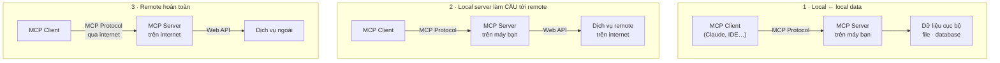

# Note 12 — GitHub MCP Server

> **TL;DR:** **MCP (Model Context Protocol)** — chuẩn do **Anthropic** giới thiệu — được ví như **"chuẩn USB-C cho công cụ AI"**: một cách **nhất quán và an toàn** để mô hình AI kết nối tới tool và nguồn dữ liệu. **GitHub MCP Server** là **server mã nguồn mở, được host sẵn, bảo mật và co giãn**, nối Copilot và các công cụ AI khác thẳng vào repository của bạn; hiện có **hơn 30 tool**. Điểm bán hàng chính: **không cần Docker, không cần file cấu hình thủ công**, **đăng nhập OAuth một cú bấm**, dùng được **trên web, desktop và mobile**, hỗ trợ **enterprise identity provider như Entra và Auth0**, **tự co giãn**. MCP client kết nối tới server theo **3 kiểu**: **local ↔ local data** · **local server làm cầu tới dịch vụ remote** · **remote hoàn toàn qua internet**. Cấu hình trong VS Code: `MCP: add server` → **HTTP** → URL **`https://api.githubcopilot.com/mcp/`** → **OAuth**; hoặc dùng **PAT** (scope `repo` + `read:packages`); hoặc **local qua Docker** (`ghcr.io/github/github-mcp-server`, **PAT bắt buộc, không hỗ trợ OAuth**). Kết hợp MCP với **agent mode** cho phép Copilot chạy **"agentic loop"**: tự tìm thông tin → phân tích → quyết bước tiếp theo, **không phải bắt đầu lại từ đầu**.

## 1. MCP là gì

> *"MCP (Model Context Protocol) is like a USB-C standard for your AI tools, providing a consistent and secure way for AI models to connect to the tools and data sources they need."*

Chuẩn này **do Anthropic giới thiệu**. Ba thứ MCP đem lại:

| Điểm | Nội dung |
|---|---|
| **Access** | Truy cập **thư viện tool đang lớn dần** mà mô hình AI dùng được ngay |
| **Flexibility** | **Làm việc với nhiều nhà cung cấp AI khác nhau** mà workflow vẫn nhất quán |
| **Integration** | **Tích hợp vào môi trường và quy trình phát triển sẵn có** |

### 1.1. Ba kiểu MCP client kết nối tới server — điểm thi

Cách chọn tuỳ vào **tài nguyên nằm cục bộ hay từ xa**:



| Kiểu | Cơ chế | **Dùng khi** |
|---|---|---|
| **Local communication with local data** | Client nói chuyện **trực tiếp với MCP server chạy trên máy bạn** qua MCP Protocol; server đó nối tới **nguồn dữ liệu cục bộ** (file, database, tài nguyên trên máy) | **Phát triển cục bộ**, hoặc khi cần **truy cập nhanh dữ liệu mà vẫn giữ riêng tư trên máy** |
| **Local server as a bridge to remote services** | Client vẫn nối tới **MCP server cục bộ**, nhưng server này **bắc cầu tới dịch vụ remote** bằng cách **gọi Web API** của nó | Khi tool cục bộ cần **lấy/cập nhật thông tin từ dịch vụ remote** nhưng **hưởng lợi từ việc có server cục bộ ở giữa** — ví dụ để **caching, kiểm tra bảo mật, hoặc tiền xử lý dữ liệu** |
| **Remote communication over the internet** | Client nối tới **MCP server nằm hoàn toàn trên internet**; server remote đó giao tiếp với dịch vụ ngoài qua Web API | Khi tài nguyên hoặc tính toán **không thể diễn ra cục bộ** — **cloud compute, nền tảng SaaS, tích hợp bên thứ ba chỉ tồn tại online** |

```
★ Insight ─────────────────────────────────────
• Kiểu 2 là kiểu dễ bị bỏ qua nhất khi ôn, nhưng chính nó là câu trả lời cho
  tình huống "cần gọi API bên ngoài NHƯNG muốn caching / kiểm tra bảo mật /
  tiền xử lý trước". Đừng nhầm với kiểu 3: kiểu 3 KHÔNG có gì chạy trên máy
  bạn, còn kiểu 2 vẫn có một server cục bộ đóng vai trò lớp trung gian.
• Trục phân biệt gọn nhất: SERVER ở đâu (local/remote) × DỮ LIỆU ở đâu
  (local/remote). Kiểu 1 = local/local · kiểu 2 = local/remote · kiểu 3 =
  remote/remote. Không có kiểu "remote server + local data" — điều đó hợp lý
  vì server ngoài internet không với tới file trên máy bạn được.
─────────────────────────────────────────────────
```

## 2. Vì sao dùng GitHub MCP Server

**Vấn đề với MCP server cục bộ thông thường:** cần **Docker**, **quản lý token**, và **cấu hình thủ công** → làm chậm setup và **chặn tích hợp với client web như GitHub.com**.

**Kết nối tới server do GitHub host thì nhanh và dễ**, không cần Docker hay file cấu hình.

**Năm lợi ích của GitHub MCP Server:**

| Lợi ích | Nội dung |
|---|---|
| **Bỏ nhu cầu Docker / file cấu hình thủ công** | Setup gần như tức thì |
| **Đăng nhập OAuth một cú bấm** | Xác thực nhanh |
| **Làm việc mượt trên web, desktop và mobile** | Không bó buộc môi trường |
| **Hỗ trợ enterprise identity provider** | **Entra** và **Auth0** cho xác thực an toàn |
| **Tự co giãn (scales automatically)** | Theo nhu cầu sử dụng |

### 2.1. GitHub MCP Server làm được gì

Là **server mã nguồn mở** nối **GitHub Copilot và các công cụ AI khác thẳng vào repository** của bạn:

- **Phân tích và tóm tắt code** để hiểu dự án hơn.
- **Tạo và quản lý issue và pull request.**
- **Tự động hoá triage repository và theo dõi công việc.**

> **Con số:** hiện có **hơn 30 tool**, cho phép **thêm issue, sửa file, tạo branch** dễ dàng và **xếp hạng PR/issue để xác định ưu tiên**.

### 2.2. Điều kiện cần

| Bắt buộc | Tuỳ chọn |
|---|---|
| **Tài khoản GitHub** | **Personal Access Token (PAT)** cho setup nâng cao và kiểm soát quyền |
| **Visual Studio Code** hoặc editor khác hỗ trợ MCP | **Docker** nếu muốn thử setup server cục bộ để kiểm soát chi tiết |

> ⚠️ **Điểm thi:** nếu bạn thuộc **organization/enterprise dùng Copilot Business hoặc Copilot Enterprise**, **chính sách "MCP servers in Copilot" phải được BẬT** thì mới dùng MCP với Copilot được.

## 3. Cấu hình trong VS Code

### 3.1. Cách 1 — OAuth (khuyến nghị)

| Bước | Thao tác |
|---|---|
| 1 | Mở **Command Palette**: `Ctrl+Shift+P` (Windows/Linux) hoặc `Cmd+Shift+P` (Mac) |
| 2 | Gõ **`MCP: add server`** rồi Enter |
| 3 | Chọn **HTTP (HTTP or Server-Sent Events)** |
| 4 | Nhập Server URL: **`https://api.githubcopilot.com/mcp/`** rồi Enter |
| 5 | Khi hỏi **Server ID**: Enter để dùng mặc định, hoặc gõ ID tuỳ ý |
| 6 | Chọn nơi lưu cấu hình: **user settings** (dùng cho mọi project) hoặc **workspace settings** (chỉ project hiện tại) |
| 7 | Hiện prompt uỷ quyền GitHub bằng **OAuth** → chọn **Allow** và đăng nhập nếu cần |

### 3.2. Cách 2 — Personal Access Token (kiểm soát nâng cao)

1. Tạo **PAT** với scope **`repo`** và **`read:packages`**.
2. Làm các bước như trên nhưng **huỷ OAuth khi được hỏi**.
3. Thêm vào file cấu hình:

```json
"headers": {
  "Authorization": "Bearer ${input:github_token}"
}
```

4. Thêm input prompt để nhập token an toàn:

```json
"inputs": [
  {
    "id": "github_token",
    "type": "promptString",
    "description": "GitHub Personal Access Token",
    "password": true
  }
]
```

5. **Restart MCP server** trong VS Code và nhập PAT khi được hỏi.

### 3.3. Cách 3 — Local MCP Server qua Docker (tuỳ chọn)

> **Bối cảnh:** nếu enterprise của bạn dùng **GitHub Enterprise Server với hạn chế PAT**, bạn **chỉ truy cập được các API scope mà chính sách tổ chức cho phép**. **Nếu mọi endpoint bị hạn chế thì MCP Server sẽ không khả dụng** — hỏi admin nếu không chắc.

> ⚠️ **Điểm thi:** setup local **BẮT BUỘC Docker + PAT**. **OAuth KHÔNG được hỗ trợ ở kiểu này.**

```json
{
  "inputs": [
    {
      "type": "promptString",
      "id": "github_token",
      "description": "GitHub Personal Access Token",
      "password": true
    }
  ],
  "servers": {
    "github": {
      "command": "docker",
      "args": [
        "run", "-i", "--rm",
        "-e", "GITHUB_PERSONAL_ACCESS_TOKEN",
        "ghcr.io/github/github-mcp-server"
      ],
      "env": {
        "GITHUB_PERSONAL_ACCESS_TOKEN": "${input:github_token}"
      }
    }
  }
}
```

Sau đó **restart MCP server** và nhập PAT.

### 3.4. Troubleshooting — 5 kiểm tra

| # | Kiểm tra |
|---|---|
| 1 | Xác nhận bạn **đã đăng nhập tài khoản GitHub trong VS Code** |
| 2 | Nếu dùng PAT: bảo đảm **đúng scope** và **nhập đúng** |
| 3 | **Rà lại cấu hình** xem có lỗi chính tả hay thiếu trường không |
| 4 | Nếu dùng Docker: bảo đảm **đã cài và đang chạy** |
| 5 | Thử **restart VS Code hoặc MCP Server** để xử lý lỗi kết nối tạm thời |

## 4. Dùng MCP Server với Copilot Chat

### 4.1. Bốn bước

1. Mở **Copilot Chat** trong VS Code và **chuyển sang Agent mode** để **kích hoạt các tool của MCP Server**.
2. Bấm **Select tools** để xem toàn bộ chức năng MCP Server khả dụng.
3. Thử **tạo issue mới, tóm tắt repository, hoặc lấy insight** bằng **prompt ngôn ngữ tự nhiên**.
4. Làm theo các prompt trong Copilot Chat để hoàn tất tác vụ.

> ⚠️ **Điểm thi:** phải ở **Agent mode** thì tool MCP mới được kích hoạt — Chat thường không dùng được chúng.

### 4.2. Agentic capabilities là gì

Agent mode cho Copilot khả năng:

| Khả năng | Nội dung |
|---|---|
| **Work independently** | Thực hiện **workflow nhiều bước mà không cần chỉ dẫn liên tục** |
| **Make decisions** | **Chọn tool hoặc cách tiếp cận** dựa trên ngữ cảnh nó có |
| **Adapt and improve** | **Phản hồi lại feedback**, điều chỉnh cách làm, và **lặp trên kết quả** |

→ Copilot xử lý tác vụ theo cách **tự trị hơn, gần như một đồng đội hiểu bức tranh lớn** thay vì chỉ làm theo từng chỉ thị lẻ.

### 4.3. MCP làm agent mode mạnh lên thế nào

Tự thân agent mode đã mạnh. Thêm MCP server thì Copilot **với ra ngoài môi trường code trước mắt**:

| Năng lực thêm | Nội dung |
|---|---|
| **Truy cập trực tiếp** | **Dữ liệu ngoài, API, hoặc công cụ doanh nghiệp** |
| **Giữ ngữ cảnh xuyên nền tảng** | **Không phải chuyển ứng dụng** |
| **Hoàn thành "agentic loop"** | **Tự tìm thông tin → phân tích kết quả → quyết định bước tiếp theo có căn cứ**, tất cả **mà không phải bắt đầu lại từ đầu** |

Nghĩa là Copilot **không chỉ phản ứng với một prompt** — nó **làm việc theo chu kỳ: khám phá, thích nghi, tinh chỉnh** cho tới khi ra kết quả bạn muốn.

### 4.4. Ba lợi ích khi kết hợp MCP + Agent Mode

| Lợi ích | Nội dung |
|---|---|
| **Extended context** | Copilot **rút thông tin từ nhiều hệ thống**, không chỉ code editor |
| **Reduced manual effort** | Việc thường quy như **mở issue, quản lý workflow, chạy check** được tự động hoá |
| **Seamless integration** | Thực hiện tác vụ **trải qua nhiều tool và nền tảng**, **không cần connector tuỳ chỉnh** hay chuyển đổi liên tục |

### 4.5. Năm best practice

| Best practice | Nội dung |
|---|---|
| **Be clear about goals** | Định nghĩa **bạn muốn Copilot đạt gì** và **đầu ra cuối trông ra sao** |
| **Provide context** | Chia sẻ **bối cảnh dự án/workflow**: link, tham chiếu, các bước trước đó |
| **Set boundaries** | Muốn Copilot **dừng ở khâu lập kế hoạch (chưa thay đổi gì)** thì **nói rõ**; cũng có thể **giới hạn MCP tool nào được bật** |
| **Ask for confirmation** | Trước thay đổi lớn, **bắt Copilot tóm tắt kế hoạch** để bạn duyệt hoặc tinh chỉnh |
| **Use prompt files or instructions** | Tạo **prompt file tuỳ chỉnh** hướng dẫn Copilot cư xử ra sao với từng MCP server → **hành vi nhất quán và bám workflow** |

```
★ Insight ─────────────────────────────────────
• Ba cách cấu hình có ba đánh đổi rõ ràng, đề rất hay hỏi dạng "tổ chức X có
  ràng buộc Y thì dùng cách nào":
    - OAuth  → nhanh nhất, không Docker, hợp mặc định
    - PAT    → khi cần KIỂM SOÁT QUYỀN chi tiết (scope repo + read:packages)
    - Docker → khi cần chạy CỤC BỘ hoàn toàn; bắt buộc PAT, KHÔNG có OAuth
  Bẫy phổ biến: hỏi "setup Docker dùng OAuth thế nào?" — câu trả lời là KHÔNG
  hỗ trợ.
• Best practice "Set boundaries" ánh xạ trực tiếp sang session mode Plan của
  Copilot app (note 09): cả hai đều là cách bắt agent DỪNG Ở KẾ HOẠCH trước
  khi động vào code. Cùng một nguyên lý human oversight, hai lớp giao diện.
─────────────────────────────────────────────────
```

## 5. Cùng chuẩn MCP, ba góc nhìn trong vault

| Góc nhìn | Nơi | Vai trò của bạn |
|---|---|---|
| **Client** — cấu hình VS Code nối tới MCP server để Copilot dùng tool | Note này | Người **tiêu thụ** tool |
| **Agent runtime** — Cloud Agent dùng MCP tool để mở rộng phạm vi ra ngoài repo | [[11-Copilot-Cloud-Agent]] | Người **cấu hình** MCP cho agent (chỉ tools, không OAuth remote) |
| **Server/tool builder** — dựng MCP server, khai `MCPTool` với `server_label`, `require_approval` | [[../../05-Cloud/02-Azure/AI-103/06-Custom-Tools-va-MCP-Tools\|AI-103/06]] | Người **cung cấp** tool cho agent Azure Foundry |

Cùng một giao thức, nhìn từ hai đầu — nắm cả hai thì hiểu vì sao MCP được gọi là "USB-C của AI".

## Q&A phỏng vấn

**Q1. MCP là gì, do ai giới thiệu, và ví von thế nào?**
→ **Model Context Protocol**, do **Anthropic** giới thiệu; ví như **"chuẩn USB-C cho công cụ AI"** — cách **nhất quán và an toàn** để mô hình AI kết nối tới tool và nguồn dữ liệu cần thiết.

**Q2. Ba kiểu MCP client kết nối tới server?**
→ **Local ↔ local data** (dev cục bộ, dữ liệu riêng tư) · **local server làm cầu tới dịch vụ remote** (cần caching / kiểm tra bảo mật / tiền xử lý) · **remote hoàn toàn qua internet** (cloud compute, SaaS, tích hợp bên thứ ba).

**Q3. Năm lợi ích của GitHub MCP Server?**
→ Bỏ Docker/file cấu hình thủ công · **OAuth một cú bấm** · dùng được **web, desktop, mobile** · hỗ trợ **Entra và Auth0** · **tự co giãn**.

**Q4. GitHub MCP Server có bao nhiêu tool và làm được gì?**
→ **Hơn 30 tool**: phân tích/tóm tắt code · tạo và quản lý issue và PR · tự động triage repo và theo dõi công việc · thêm issue, sửa file, tạo branch · xếp hạng PR/issue theo ưu tiên.

**Q5. URL của GitHub MCP Server khi cấu hình HTTP trong VS Code?**
→ **`https://api.githubcopilot.com/mcp/`** (qua `MCP: add server` → **HTTP (HTTP or Server-Sent Events)**).

**Q6. PAT cần scope gì? Setup Docker có dùng OAuth được không?**
→ PAT cần **`repo`** và **`read:packages`**. **Setup local qua Docker KHÔNG hỗ trợ OAuth** — bắt buộc PAT.

**Q7. Phải làm gì trong Copilot Chat để tool MCP hoạt động?**
→ **Chuyển sang Agent mode**, rồi bấm **Select tools** để xem chức năng khả dụng.

**Q8. Tổ chức dùng Copilot Business, MCP không hoạt động. Kiểm tra gì đầu tiên?**
→ Chính sách **"MCP servers in Copilot"** đã được **bật** ở mức organization/enterprise chưa.

**Q9. "Agentic loop" là gì?**
→ Chu kỳ Copilot **tự tìm thông tin → phân tích kết quả → quyết bước tiếp theo có căn cứ**, lặp lại **mà không phải khởi động lại quy trình từ đầu**.

**Q10. Muốn Copilot chỉ lập kế hoạch, chưa được sửa code. Làm sao?**
→ Best practice **"Set boundaries"**: **nói rõ trong prompt** rằng dừng ở khâu lập kế hoạch, và **giới hạn MCP tool nào được bật**.

## Tự kiểm tra

1. Ba thứ MCP đem lại? *(access tới thư viện tool · flexibility với nhiều nhà cung cấp AI · integration vào môi trường sẵn có)*
2. Kiểu kết nối nào dùng khi cần caching/kiểm tra bảo mật trước khi gọi API ngoài? *(kiểu 2 — local server làm cầu tới remote)*
3. Bảy bước cấu hình OAuth trong VS Code?
4. Image Docker của GitHub MCP Server? *(`ghcr.io/github/github-mcp-server`)*
5. Ba khả năng "agentic" của Copilot? *(work independently · make decisions · adapt and improve)*
6. Năm best practice khi dùng MCP + agent mode?
7. Năm bước troubleshooting MCP Server trong VS Code?

## Liên quan
- [[00-MOC-GH300|⬅ MOC GH-300]]
- Trước: [[11-Copilot-Cloud-Agent]] · Kế tiếp (cụm E): [[13-Code-Review-va-Pull-Request]]
- [[10-Agent-Mode-trong-IDE]] — agent mode là điều kiện để tool MCP hoạt động
- [[09-Copilot-CLI-va-GitHub-Copilot-App]] — `/mcp` trong Copilot CLI cũng quản MCP server
- [[../../05-Cloud/02-Azure/AI-103/06-Custom-Tools-va-MCP-Tools|AI-103/06 — MCP phía Azure Foundry]] — cùng chuẩn, nhìn từ đầu server: `MCPTool`, `require_approval`, 3 loại MCP server
- [[../../05-Cloud/02-Azure/AB-100/14-Extensibility-Custom-Model-M365-Copilot-MCP|AB-100/14 — MCP trong Copilot Studio]] — góc thứ ba: MCP như **hợp đồng ngữ cảnh** cấp doanh nghiệp cho Dynamics 365 F&O, quản trị ở tầng tenant
