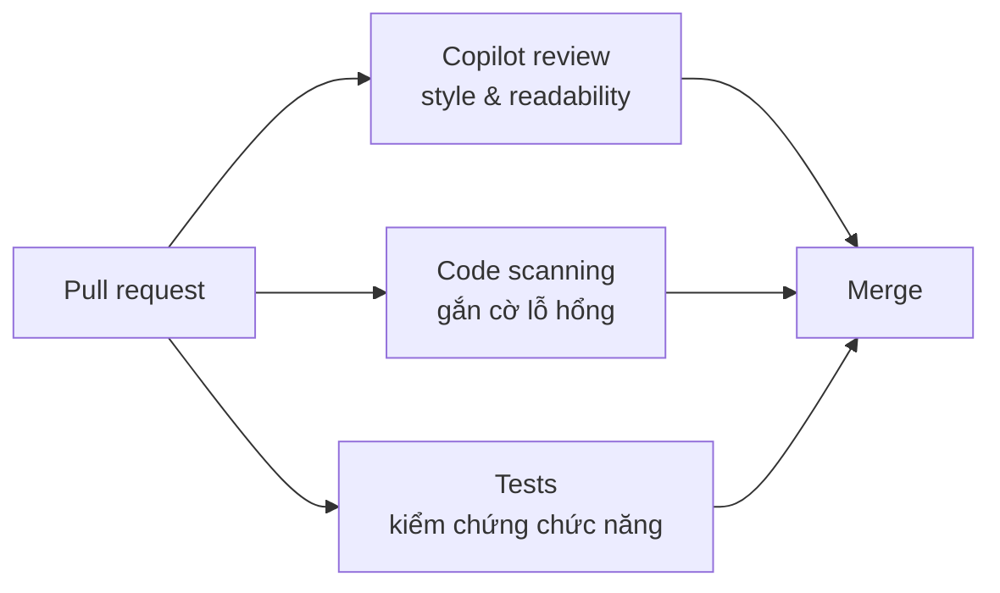

# Note 13 — Code review & pull request với Copilot

> **TL;DR:** Copilot **không thay reviewer người** mà **làm việc bên cạnh họ**: bắt lỗi, đề xuất cải thiện, soạn tóm tắt, thậm chí **tự vá lỗ hổng**. Năm tính năng chính: **PR Summaries · Security Fixes** (tích hợp **GitHub Code Scanning**) · **Line-by-Line Explanations · Drafting Comments · Reviews in Your IDE**. Trên GitHub.com chỉ cần **thêm Copilot vào menu Reviewers** — review **xong dưới 30 giây**, và ⚠️ **luôn là "comment review", KHÔNG approve/reject, KHÔNG tính vào required approvals** → không bao giờ chặn merge. Tuỳ biến bằng **`.github/copilot-instructions.md`** (toàn repo) và **`.github/instructions/*.instructions.md`** với frontmatter **`applyTo`** dùng glob (theo đường dẫn). Tự động hoá 3 mức: **cá nhân** (chỉ Pro/Pro+, bật *Automatic Copilot code review* trong Your Copilot) · **repo** (branch ruleset → *Require a pull request before merging* → **Request pull request review from Copilot**) · **tổ chức** (ruleset áp nhiều repo theo pattern như `*service`). **PRU** là nhiên liệu cho mọi năng lực nâng cao — theo dõi mức dùng, đặt cảnh báo ở **75%, 90%, 100%**.

## 1. Copilot thêm gì vào quy trình review

**Vấn đề gốc:** review là nút thắt cổ chai — chu kỳ dài, feedback không nhất quán, khó đưa gợi ý hành động được, nhất là khi phải làm việc **xuyên nhiều ngôn ngữ và framework**. Lỗi nhỏ lọt lưới, PR mất **nhiều ngày** để merge.

**Copilot giải bằng cách đóng vai reviewer cộng tác** — **không thay người** mà **làm cùng người**.

### 1.1. Năm tính năng chính

| Tính năng | Nội dung |
|---|---|
| **PR Summaries** | Tự soạn mô tả PR gồm **tóm tắt thay đổi rõ ràng** và **danh sách file bị ảnh hưởng** → reviewer bắt đầu bằng ngữ cảnh, không phải đoán |
| **Security Fixes** | Copilot code review **tích hợp với GitHub Code Scanning** → gắn cờ lỗ hổng **xuyên nhiều ngôn ngữ**, rồi **đề xuất patch inline bám theo security guideline của repo** |
| **Line-by-Line Explanations** | Reviewer bôi đen code và **nhờ Copilot giải thích chức năng** → hiểu nhanh code lạ |
| **Drafting Comments** | Sinh **comment review dựa trên best practice hoặc guideline của team** → feedback rõ ràng, hành động được |
| **Reviews in Your IDE** | Ngoài GitHub.com, Copilot **review code ngay trong IDE** → bắt và sửa vấn đề **TRƯỚC KHI mở PR**, giảm rework |

> **Ví dụ Security Fix (nguyên văn):** với JavaScript, Copilot phát hiện **input chưa được sanitize truyền vào `eval()`** và comment:
> *"eval() with user input can lead to code injection. Replace it with a safe parser like JSON.parse()."*

### 1.2. PRU mở khoá năng lực nâng cao thế nào

**PRU (Premium Request Units)** là **nhiên liệu** cho các năng lực mạnh nhất của Copilot. Mỗi lần bạn yêu cầu một **tác vụ mức premium** — **review cả một pull request**, **chạy ở agent mode**, hoặc **sinh gợi ý phức tạp nhiều bước** — nó **tiêu một PRU**. Đổi lại, Copilot có thêm **sức xử lý và độ sâu ngữ cảnh** để cho **suy luận phong phú hơn, kiểm tra best practice mạnh hơn, đầu ra đáng tin hơn**.

> **Cụ thể:** gán Copilot làm reviewer của PR **tốn một PRU mỗi lần nó đăng comment**. Kết hợp với **`.github/copilot-instructions.md`**, review có PRU **bám đúng luật của team** — dù luật đó về **readability, security hay style**.

**So sánh trước/sau (ví dụ gốc):**

| Không có Copilot | **Copilot + PRU** |
|---|---|
| Comment mơ hồ: *"Fix security issue here"* | *"The use of `exec()` introduces a code injection vulnerability. Consider replacing it with `subprocess.run()` for safer command execution. Here's a suggested patch:"* — **kèm code fix inline** |

### 1.3. Năm cách Copilot review giúp bạn

| Cách | Nội dung |
|---|---|
| **Code review suggestions** | Trong view **"Files changed"** của PR, **bôi đen dòng/khối code** và nhờ Copilot **đề xuất cải thiện hoặc gắn cờ vấn đề**. Ví dụ với file Ruby lặp logic: *"Suggest a cleaner Ruby refactor for this repeated code."* Bạn **dán khuyến nghị (hoặc phần của nó) vào comment review kèm giải thích của mình** → **không lấn sang việc code hộ tác giả** |
| **Review xuyên nhiều ngôn ngữ** | Copilot **tự gắn cờ chỗ không theo best practice hoặc guideline team**, sinh cải thiện **theo convention của ngôn ngữ đó** → bạn feedback mạnh và chính xác **kể cả ngoài chuyên môn chính của mình** |
| **Formatting data for pull requests** | Copilot **gắn cờ bảng định dạng xấu trong mô tả PR** và đề xuất **bản sạch bám style guideline của công ty** (lấy từ `.github/copilot-instructions.md`). Reviewer **chấp nhận bằng một cú bấm**. Đây là Copilot đóng vai **automatic reviewer, KHÔNG phải coding agent** |
| **Writing effective PR summaries** | Từ **PR description editor**, dùng **icon Copilot** để **sinh draft summary hoặc outline**. Dù bạn có sửa lại, việc có sẵn khung tốt vẫn tiết kiệm thời gian |
| **Explaining and reviewing code** | Nhờ Copilot **giải thích thay đổi** khi bạn không quen code; và **tự chạy review sơ bộ cho PR của chính mình** trước khi nhờ đồng đội → bắt lỗi nhỏ, kiểm best practice, tự tin hơn về chất lượng |

## 2. Dùng Copilot làm reviewer trên GitHub.com

![[pr-add-copilot-reviewer.png]]

*Ảnh: Microsoft Learn — thêm Copilot vào menu Reviewers của một pull request.*
Điều đáng chú ý là Copilot xuất hiện **trong đúng menu Reviewers như một đồng đội**, không phải một nút riêng — đó là dụng ý thiết kế: comment của nó **hành xử y như comment người** (react được, resolve được, reply được), nhưng **không mang quyền approve**.

### 2.1. Năm bước

| Bước | Thao tác |
|---|---|
| 1 | **Mở hoặc tạo pull request** |
| 2 | **Thêm Copilot làm reviewer**: menu **Reviewers** → chọn **Copilot** (như gán cho đồng đội) |
| 3 | **Chờ review xong** — thường **dưới 30 giây** |
| 4 | **Đọc comment của Copilot** — gợi ý để lại **dưới dạng comment trên đúng dòng code** |
| 5 | **Áp dụng thay đổi đề xuất** — **commit fix trực tiếp từ giao diện PR** |

Với comment review của người, bạn cũng dùng Copilot để sinh giải pháp nhanh. Ví dụ prompt gốc:

> *"Suggest a fix for this review comment: Replace exec() with a safer function."*

→ Copilot đề xuất patch dùng `subprocess.run()`. Developer **test cục bộ, commit, và bảo đảm test pass**.

### 2.2. Giới hạn vai trò — điểm thi quan trọng

> ⚠️ **Vai trò của Copilot trong review là ADVISORY (tư vấn).**
> - **KHÔNG approve và KHÔNG reject pull request.**
> - **Comment của nó KHÔNG tính vào required approvals.**
> - Nó sinh **"comment review"** → **không bao giờ chặn merge**, chỉ **thêm ngữ cảnh giá trị cho reviewer người**.

Dùng nó để **bắt lỗi sớm, sinh gợi ý hành động được, tăng tốc kiểm tra thường quy**; nhưng **dựa vào reviewer người** cho **quyết định kiến trúc, đánh đổi tinh tế, và ký duyệt cuối cùng**.

Comment của Copilot **trông và hành xử như comment của đồng đội**: bạn **react, resolve hoặc comment lại** được. Nó có thể gắn cờ **thiếu type hint**, đề xuất **đổi định dạng**, hoặc chỉ ra **bug tiềm ẩn**.

```
★ Insight ─────────────────────────────────────
• Ba mệnh đề "không approve / không reject / không tính vào required approvals"
  cùng nói một điều: Copilot code review là MỘT LỚP BỔ SUNG, không phải một
  cổng kiểm soát. Vì thế nó KHÔNG mâu thuẫn với branch protection — bạn bật
  auto review cho mọi PR mà vẫn giữ nguyên yêu cầu "cần N người duyệt".
• Đối chiếu với note 11: Cloud Agent TẠO PR (draft) và cần người duyệt;
  Copilot code review DUYỆT PR nhưng không có quyền duyệt. Hai vai trò ngược
  nhau, cùng một nguyên tắc: quyền quyết định cuối luôn thuộc về con người.
─────────────────────────────────────────────────
```

## 3. Bắt lỗi sớm & tuỳ biến review

### 3.1. Chạy review cục bộ trong IDE

Trong **VS Code hoặc JetBrains IDEs**, bạn **yêu cầu Copilot review thay đổi TRƯỚC KHI commit** → xử lý sớm **vi phạm style, khoảng trống bảo mật, vấn đề best practice** → tiết kiệm vòng lặp review.

Để dẫn dắt review, tạo **`.github/copilot-instructions.md`** với luật kiểu:

```markdown
Focus on security and avoid unsafe string interpolation.
Ensure functions have docstrings explaining parameters and return types.
```

Copilot **tự áp các luật này** để phân tích diff lớn hơn và đưa insight giàu ngữ cảnh, bám style của repo.

> **Use case gốc:** một developer thêm code lặp trong một TypeScript service. Copilot **gắn cờ và đề xuất tách ra helper function**. Thay vì chờ đồng nghiệp chỉ ra, developer **sửa trước khi push** → giảm nhiễu review về sau.

### 3.2. Custom instructions theo đường dẫn (path-specific)

Dùng để dẫn dắt **Copilot code review HOẶC Copilot Cloud Agent** cho **file/folder cụ thể**. Bốn bước:

| Bước | Thao tác |
|---|---|
| 1 | **Tạo thư mục** `.github/instructions` ở gốc repo (nếu chưa có) |
| 2 | **Thêm file** kết thúc bằng **`.instructions.md`** (ví dụ `security.instructions.md`) — tên file mô tả mục đích |
| 3 | **Khai đường dẫn áp dụng**: đầu file thêm **frontmatter với từ khoá `applyTo`**, dùng **cú pháp glob** |
| 4 | **Viết hướng dẫn** bằng Markdown ngôn ngữ tự nhiên bên dưới frontmatter |

**Ba ví dụ `applyTo` (nguyên văn):**

| Mục tiêu | Cú pháp |
|---|---|
| Chỉ file Ruby model | `applyTo: "app/models/**/*.rb"` |
| File TypeScript | `applyTo: "**/*.ts,**/*.tsx"` |
| **Toàn bộ file trong repo** | `applyTo: "**"` |

Copilot **tuân theo các chỉ dẫn này mỗi khi review hoặc sinh code cho đường dẫn khớp**.

### 3.3. Dùng PRU cho phân tích sâu trong IDE

Khi chạy review **trong IDE**, bạn **không bị giới hạn ở các check nhẹ như trên GitHub.com**. Cấp PRU cho review cục bộ → Copilot **dùng model tiên tiến hơn** để: **phân tích diff lớn hơn** · **áp custom instructions của repo** · **đưa gợi ý chất lượng cao hơn** — tất cả **trước khi code tới pull request**.

## 4. Tự động hoá review với Rulesets

**Review thủ công không co giãn được** trong team chuyển động nhanh. GitHub cho cấu hình **rulesets** để **Copilot tự động được gán vào mọi PR nhắm tới nhánh được bảo vệ** — bảo đảm **mọi thay đổi đều được review, kể cả khi reviewer người bị chậm**.

**Ghép Copilot review với status check** tạo thành một pipeline:



> 💰 Vì **mỗi lần Copilot review tiêu PRU**, tổ chức nên **lập ngân sách PRU khớp với khối lượng review** và **thực hiện review tự động vào thời điểm phù hợp** trong quy trình. **Theo dõi mức dùng giúp cân bằng chi phí và độ phủ.**

### 4.1. Ba mức tự động hoá

| Mức | Ai bật | Cách bật |
|---|---|---|
| **Cá nhân** ⚠️ **chỉ Copilot Pro hoặc Pro+** | Bạn | Góc trên phải bất kỳ trang GitHub → ảnh đại diện → **Your Copilot** → tìm **Automatic Copilot code review** → dropdown chọn **Enabled**. Từ đó **Copilot luôn được thêm vào mọi PR của bạn** |
| **Repository** | **Repository admin** | **Settings** → sidebar trái mở **Code and automation** → **Rules → Rulesets** → **New ruleset** → **New branch ruleset** → đặt tên, **Enforcement status = Active**, chọn nhánh mục tiêu (ví dụ nhánh mặc định) → mục **Branch rules** tick **Require a pull request before merging** → trong tuỳ chọn mở rộng chọn **Request pull request review from Copilot** → **Create** |
| **Tổ chức** | **Organization owner** | Ảnh đại diện → **Your organizations** → chọn tổ chức → **Settings** → sidebar **Repository → Rulesets** → **New ruleset → New branch ruleset** → đặt tên, **Enforcement status = Active** → **thêm repo mục tiêu bằng pattern inclusion/exclusion** (ví dụ **`*service`** khớp mọi repo service) → định nghĩa nhánh mục tiêu → bật **Require a pull request before merging**, tick **Request pull request review from Copilot** → **Create** |

![[ruleset-new-branch.png]]

*Ảnh: Microsoft Learn — tạo New branch ruleset trong Settings của repository.*
Lưu ý đường đi trong menu: **Settings → Code and automation → Rules → Rulesets** — đây là chi tiết hay bị hỏi. Ruleset là cơ chế **branch protection thế hệ mới** của GitHub, nên tuỳ chọn "Request pull request review from Copilot" **nằm lồng bên trong** rule "Require a pull request before merging", chứ không phải một mục độc lập.

> **Tuỳ chọn thêm ở mức repo:** bật **"Require conversation resolution before merging"** để **buộc developer đọc feedback của Copilot**.

Kết quả: **cả sửa nhỏ lẫn cập nhật dependency đều được review nhất quán**, giảm rủi ro regression không ai để ý.

## 5. Đo lường & tối ưu PRU

### 5.1. Hiểu PRU

> Hãy nghĩ PRU như **"token mở khoá số nâng cao (extra gear) của Copilot"**.

| Loại tác vụ | Tiêu PRU? |
|---|---|
| **Thường quy, nhẹ** — ví dụ gợi ý refactor nhỏ cho **một dòng** | **Thường KHÔNG** |
| **Mức premium** — review **1.500 dòng thay đổi xuyên nhiều file**, áp `.github/copilot-instructions.md`, kiểm bảo mật và style | **CÓ** |

**Có PRU:** Copilot **quét trọn diff, diễn giải review guideline của bạn, trả về fix hành động được trong vài giây**.
**Không PRU:** chỉ có **gợi ý nhẹ mặc định**.

> **Kịch bản ví dụ:** developer push một refactor lớn chạm hàng chục file. Copilot (được gán reviewer) **dùng PRU để áp guideline bảo mật và style của repo lên toàn bộ thay đổi**, gắn cờ vài **unsafe string interpolation**, và **soạn comment Markdown giải thích vấn đề**. Reviewer người nhờ đó **tập trung vào tác động kiến trúc** thay vì mất hàng giờ kiểm tay.

### 5.2. Vì sao PRU quan trọng với team

| Lợi ích | Nội dung |
|---|---|
| **Get deeper analysis** | Phát hiện **lỗ hổng tinh vi, logic trùng lặp, vi phạm style** trên diff lớn **trước khi lên production** |
| **Enforce consistency** | Áp **cùng bộ kiểm tra bảo mật/readability/style lên MỌI PR tự động** |
| **Handle bursts of activity** | Trong **giai đoạn gấp trước release**, review có PRU **giữ chất lượng ổn định** trong khi người lo quyết định thiết kế phức tạp |

> **Kịch bản ví dụ:** team giữ kiến trúc microservices bằng **Go, Python và TypeScript**. Trước release, Copilot dùng PRU review từng service theo **best practice riêng của ngôn ngữ** — gắn cờ một lệnh **`eval()` rủi ro trong JavaScript** và khuyến nghị parser an toàn hơn, đồng thời **bắt một error check bị thiếu trong Go handler**.

### 5.3. Đo tác động — ba chỉ số

| Chỉ số | Nội dung |
|---|---|
| **PR lead time** | PR đi từ **mở tới merge** nhanh thế nào sau khi thêm Copilot review |
| **Quality indicators** | **Giảm số vấn đề bảo mật/style sau merge** do công cụ khác gắn cờ |
| **Developer experience** | Phản hồi: Copilot có làm review **nhanh hơn hoặc rõ hơn** không |

> **Số liệu ví dụ:** trước khi dùng PRU, PR lớn mất **trung bình 3 ngày** để merge và hay phải sửa style sau release. Sau khi bật review có PRU, **cùng loại PR merge trong 1 ngày** với **ít commit theo sau hơn hẳn**.

### 5.4. Bốn cách tối ưu PRU

| Cách | Nội dung |
|---|---|
| **Plan ahead** | **Đặt cảnh báo khi chạm 75%, 90% và 100%** mức dùng PRU hằng tháng |
| **Use PRUs strategically** | **Dành review premium cho thay đổi lớn hoặc rủi ro cao**; dùng gợi ý Copilot tiêu chuẩn cho sửa đơn giản |
| **Refine your prompts** | **Yêu cầu sạch và cụ thể** → giảm retry thừa và PRU lãng phí |
| **Scale up if needed** | Team liên tục cạn PRU thì **cân nhắc gói Copilot bậc cao hơn** |

> **Kịch bản ví dụ:** team nhận ra nhiều PRU bị tiêu cho **thay đổi tài liệu vụn vặt**. Họ đổi workflow để **dùng request không tốn PRU cho sửa nhỏ** và **dành review có PRU cho code ảnh hưởng production** → **mức dùng PRU hằng tháng giảm 30% mà không mất chất lượng**.

### 5.5. Bốn best practice tổng kết

1. **Chạy Copilot review vào thời điểm phù hợp trong quy trình — trong IDE, trước khi push.**
2. **Dùng `.github/copilot-instructions.md`** để feedback của Copilot khớp chuẩn của team.
3. **Coi comment của Copilot là chất xúc tác, KHÔNG phải mệnh lệnh** — vẫn dùng **CI/CD pipeline, scan và best practice khác** song song.
4. **Luôn kiểm chứng và test các fix trước khi merge.**

```
★ Insight ─────────────────────────────────────
• Hai loại "instructions" rất dễ nhầm và đề hay hỏi phân biệt:
    .github/copilot-instructions.md        → MỘT file, áp cho TOÀN repo
    .github/instructions/*.instructions.md → NHIỀU file, mỗi file có frontmatter
                                             applyTo (glob) để áp theo ĐƯỜNG DẪN
  File thứ hai dùng được cho cả code review LẪN Cloud Agent — nên nó là cách
  chuẩn để đặt luật riêng cho thư mục nhạy cảm (ví dụ security.instructions.md
  với applyTo: "app/models/**/*.rb").
• Cách nhớ ngưỡng PRU: nhẹ = MỘT DÒNG (không tốn), premium = CẢ DIFF (tốn).
  Con số minh hoạ trong nguồn là "1.500 dòng xuyên nhiều file".
─────────────────────────────────────────────────
```

## Q&A phỏng vấn

**Q1. Copilot có approve hay reject pull request không?**
→ **KHÔNG.** Vai trò **advisory**: nó sinh **comment review**, **không tính vào required approvals**, và **không bao giờ chặn merge**.

**Q2. Năm tính năng chính của Copilot trong code review?**
→ PR summaries · **Security fixes** (tích hợp GitHub Code Scanning) · line-by-line explanations · drafting comments · **reviews in your IDE**.

**Q3. Review của Copilot trên GitHub.com mất bao lâu?**
→ **Thường dưới 30 giây.**

**Q4. Hai cơ chế custom instructions và khác nhau ra sao?**
→ **`.github/copilot-instructions.md`** — một file, áp **toàn repo**. **`.github/instructions/<tên>.instructions.md`** — nhiều file, mỗi file có **frontmatter `applyTo`** dùng glob để áp **theo đường dẫn**; dùng được cho **cả code review lẫn Cloud Agent**.

**Q5. Viết `applyTo` cho: chỉ file Ruby model / file TypeScript / toàn repo.**
→ `applyTo: "app/models/**/*.rb"` · `applyTo: "**/*.ts,**/*.tsx"` · `applyTo: "**"`.

**Q6. Bật auto review cho một repo, các bước chính?**
→ **Settings → Code and automation → Rules → Rulesets → New ruleset → New branch ruleset** → đặt tên, **Enforcement status = Active**, chọn nhánh mục tiêu → **Require a pull request before merging** → **Request pull request review from Copilot** → **Create**.

**Q7. Auto review ở mức cá nhân yêu cầu gói nào?**
→ **Chỉ Copilot Pro hoặc Pro+**. Bật tại **Your Copilot → Automatic Copilot code review → Enabled**.

**Q8. Tổ chức muốn áp auto review cho mọi repo có tên kết thúc bằng "service". Làm sao?**
→ Tạo **organization ruleset** (Your organizations → Settings → **Repository → Rulesets** → New branch ruleset), **thêm repo mục tiêu bằng pattern `*service`**, bật **Require a pull request before merging** + **Request pull request review from Copilot**.

**Q9. Tác vụ nào tốn PRU, tác vụ nào không?**
→ **Không tốn**: việc nhẹ, thường quy — ví dụ gợi ý refactor **một dòng**. **Tốn**: mức premium — review **cả diff lớn (ví dụ 1.500 dòng xuyên nhiều file)**, áp custom instructions, chạy **agent mode**, sinh **gợi ý phức tạp nhiều bước**.

**Q10. Bốn cách tối ưu PRU?**
→ **Plan ahead** (cảnh báo ở 75%/90%/100%) · **dùng chiến lược** (dành cho thay đổi lớn/rủi ro cao) · **tinh chỉnh prompt** (giảm retry) · **nâng gói** nếu liên tục cạn.

**Q11. Muốn buộc dev phải đọc feedback của Copilot trước khi merge?**
→ Bật thêm **"Require conversation resolution before merging"** trong ruleset.

## Tự kiểm tra

1. Copilot đóng vai gì khi sửa bảng định dạng xấu trong mô tả PR? *(automatic reviewer — KHÔNG phải coding agent)*
2. Ba thành phần của pipeline khi ghép Copilot review với status check? *(Copilot review style/readability · code scanning gắn cờ lỗ hổng · tests kiểm chứng chức năng)*
3. Prompt gốc để nhờ Copilot sửa theo comment review? *("Suggest a fix for this review comment: Replace exec() with a safer function.")*
4. Ba chỉ số đo tác động của review có PRU? *(PR lead time · quality indicators · developer experience)*
5. Số liệu ví dụ về cải thiện lead time? *(3 ngày → 1 ngày, ít commit theo sau hơn)*
6. Bốn best practice tổng kết của module?

## Liên quan
- [[00-MOC-GH300|⬅ MOC GH-300]]
- Trước: [[12-GitHub-MCP-Server]] · Kế tiếp: [[14-Quan-tri-va-Tuy-bien]]
- [[08-Copilot-tren-GitHub-com]] — PR assistance và mốc PRU 1-2 / 1-3
- [[11-Copilot-Cloud-Agent]] — PR do agent tạo; ruleset bắt chúng qua test/scan/lint
- [[../02-Git/05-Branch-Merge-PR|Git/05 — Branch, Merge, PR]] — nền tảng PR và branch protection
- [[../02-Git/13-GitHub-Actions|Git/13 — GitHub Actions]] — status check trong pipeline review
