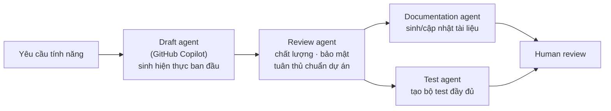
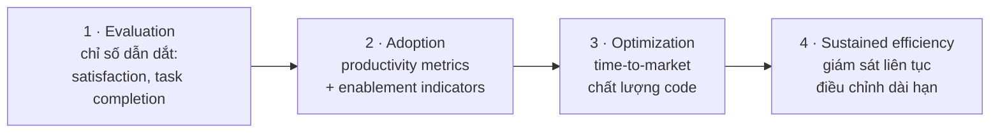

# Note 15 — Developer use cases & đo lường tác động

> **TL;DR:** Domain **Developer use cases for AI — 14% đề GH-300**. Bốn nhóm use case tăng năng suất: **học ngôn ngữ/framework mới · giảm context switching · viết tài liệu · tự động hoá việc nhàm chán**. Copilot chạm **cả 5 giai đoạn SDLC**: requirement analysis → design & development → testing & QA → deployment → maintenance & support. **Orchestrated AI workflow** dùng nhiều agent chuyên biệt: **draft agent · review agent · documentation agent · test agent** (mỗi handoff **~1 PRU**, luồng 2 agent **2–3 PRU**, premium reasoning **~4+ PRU**). Bốn nhóm giới hạn phải thuộc: **code quality & correctness · language/framework specificity · dependency on training data · complex problem solving**. Đo tác động bằng **hai công cụ**: **REST API usage metrics** (`GET /enterprises/{enterprise}/copilot/usage`, `/enterprises/{enterprise}/team/{team_slug}/copilot/usage`, `/orgs/{org}/copilot/usage` — trả **200 OK** kèm mảng JSON theo ngày) và **GitHub Copilot Developer Survey** (**short-form mỗi 2 tuần**, **long-form không quá 4 tuần/lần**). Khung đo 4 giai đoạn: **Evaluation → Adoption → Optimization → Sustained efficiency**.

## 1. Bốn nhóm use case tăng năng suất

| Nhóm | Ba cơ chế cụ thể |
|---|---|
| **Accelerate learning new programming languages and frameworks** | **Code suggestions** (snippet minh hoạ cách dùng hàm/thư viện lạ) · **language support** (chuyển ngôn ngữ mượt) · **documentation integration** (gợi ý inline về cách dùng API và tham số → **bớt phải tra tài liệu ngoài**) |
| **Minimizing context switching** | **In-editor assistance** (bớt phải tìm giải pháp trên mạng) · **quick references** (gợi ý đúng method call và tham số) · **code completion** (tự hoàn thành pattern lặp → **giữ mạch suy nghĩ**) |
| **Enhanced documentation writing** | **Inline comments** · **function descriptions** (kèm giải thích tham số và giá trị trả về) · **README generation** · **documentation consistency** (giữ style tài liệu nhất quán cả dự án) |
| **Automating the boring stuff** | **Boilerplate code generation** (ví dụ dựng REST API, tạo cấu trúc class) · **sample data creation** · **writing unit tests** · **code translation and refactoring** (kể cả **chuyển đổi giữa các ngôn ngữ lập trình**) |

> **Ví dụ gốc cho nhóm 1:** làm dự án **Golang** trong ngôn ngữ bạn chưa quen — Copilot sinh code, rồi bạn dùng **"Explain this"** trong context menu để hiểu code đó làm gì.

### 1.1. Bốn kịch bản boilerplate nâng cao

| Kịch bản | Nội dung |
|---|---|
| **Database schema and ORM setup** | Sinh trọn **database model, migration file, cấu hình ORM** từ mô tả entity đơn giản |
| **API endpoint scaffolding** | Tạo trọn **REST API endpoint** kèm **xử lý lỗi, validation, comment tài liệu** |
| **Configuration management** | Sinh file cấu hình cho **các môi trường khác nhau** (development, staging, production) |
| **Test infrastructure** | Dựng trọn **framework kiểm thử** gồm **mock data, fixture, helper function** |

> 💰 **Note gốc:** **sinh đa file phức tạp tốn nhiều PRU hơn — ~3–5 PRU cho scaffolding trọn dự án**. **Boilerplate đơn giản thường 1–2 PRU.**

### 1.2. Story-driven development automation

Copilot biến **user story và yêu cầu tính năng thành hiện thực production-ready**:

| Năng lực | Nội dung |
|---|---|
| **Feature scaffolding** | Chuyển mô tả tính năng ở tầng cao thành **cấu trúc code trọn vẹn có separation of concerns**: database model, API endpoint, frontend component |
| **Business logic implementation** | Sinh chức năng cốt lõi từ **business rule mô tả bằng lời**, tự xử lý pattern quen thuộc: validation, biến đổi dữ liệu, logic workflow |
| **Integration patterns** | Tạo pattern chuẩn hoá để nối các phần hệ sinh thái: **authentication, logging, tích hợp dịch vụ ngoài** |
| **End-to-end automation** | **Từ MỘT user story**, sinh trọn stack tính năng: backend logic, thay đổi database, API documentation, frontend cơ bản |
| **Quality built-in** | Tự đưa vào **xử lý lỗi, input validation, logging và cân nhắc bảo mật cơ bản** ngay từ bản hiện thực đầu tiên |

### 1.3. Tăng tốc workflow pull request

**PR-ready code generation:** hiện thực đầy đủ (kèm xử lý lỗi, logging, phủ edge case) · **pattern code nhất quán** với convention và kiến trúc dự án · **tích hợp tài liệu** (comment inline, doc hàm, cập nhật README) · **test coverage** (unit test, integration test, ví dụ dùng).

**Intelligent code review assistance:** **pre-submission quality checks** (soi vấn đề trước khi tạo PR) · **review comment drafting** · **rapid iteration** (sinh **nhiều phương án hiện thực** khi reviewer yêu cầu đổi) · **documentation refinement** · **conflict resolution** (hiểu ý định **cả hai nhánh** rồi đề xuất cách tích hợp tối ưu).

> 💰 **Note gốc:** nhờ Copilot **nhiều bản refactor draft trong một PR có thể tốn 2–3 PRU MỖI draft**.

### 1.4. Collaborative development workflows

**Code standardization** (giữ style và pattern nhất quán giữa các thành viên) · **knowledge sharing** (sinh code theo best practice của team → **dev junior học từ pattern của senior**) · **context preservation** (tiếp quản việc của người khác, hiểu code cũ và tiếp tục **theo đúng phong cách**) · **merge conflict resolution**.

## 2. Orchestrated AI workflows

**Multi-agent development patterns** — mỗi agent lo một mảng, **mang trọng tâm chuyên biệt cho lĩnh vực của nó**:



| Agent | Nhiệm vụ |
|---|---|
| **Draft agent** | Copilot **sinh hiện thực code ban đầu** từ yêu cầu tính năng — gồm **chức năng cốt lõi có xử lý lỗi**, **unit test cơ bản phủ kịch bản chính**, **tài liệu inline**, và **điểm tích hợp với code có sẵn** |
| **Review agent** | AI thứ hai **rà bản draft** về **chất lượng code, vấn đề bảo mật, tuân thủ chuẩn dự án**; thêm **gợi ý tối ưu hiệu năng** và **architectural pattern compliance review** |
| **Documentation agent** | **Tự sinh hoặc cập nhật tài liệu** theo thay đổi code |
| **Test agent** | **Tạo bộ test đầy đủ** cho chức năng mới |

> 💰 **Note gốc (xuất hiện 2 lần trong module):** **mỗi handoff tốn ~1 PRU**; luồng **draft–review 2 agent thường tốn 2–3 PRU**. **Premium run** thêm ngữ cảnh và suy luận nhưng **thường làm PRU tăng gấp đôi — ~4+ mỗi request**.

**Advanced reasoning capabilities** (premium): **enhanced context understanding** (phân tích codebase lớn hơn, quan hệ phức tạp hơn) · **advanced architectural suggestions** · **complex refactoring assistance** (biến đổi code tinh vi mà **giữ nguyên chức năng**) · **multi-file coordination**.

**Comprehensive feature delivery workflow — 5 pha:** **Analysis** (phân tích user story + yêu cầu kỹ thuật → implementation plan) → **Implementation** (sinh trọn code tính năng) → **Quality assurance** (bộ test + quality check) → **Documentation** (tài liệu người dùng, API docs, maintenance guide) → **Deployment** (deployment script + cấu hình monitoring).

## 3. Copilot khớp sở thích developer

| Nhóm | Nội dung |
|---|---|
| **Code generation and completion** | **Multiple suggestions** khi tình huống mơ hồ · **language-specific idioms** → code idiomatic hơn |
| **Writing unit tests and documentation** | **Test case generation** (kể cả **edge case dev hay bỏ sót**) · **documentation stubs** cho hàm/lớp/module · **comment expansion** (mở rộng comment ngắn thành giải thích chi tiết) |
| **Code refactoring** | **Pattern recognition** · **modern syntax suggestions** (ví dụ tính năng mới của **JavaScript ECMAScript**) · **consistency maintenance** |
| **Debugging assistance** *(Copilot **không phải** debugger đầy đủ)* | **Error explanation** bằng ngôn ngữ thường · **log statement generation** · **test case suggestions** cho bug khó tái hiện |
| **Data science support** | **Statistical functions** · **data visualization** (**Matplotlib, Seaborn, Plotly**) · **data preprocessing** (xử lý giá trị thiếu, encode biến phân loại, scale biến số) · **model evaluation** |

**Ba sở thích về workflow tinh gọn:** **integrated development experience** (IDE-native, contextual awareness, **minimal configuration** — "it just works") · **autonomous task completion** (end-to-end feature generation, **smart defaults**, **progressive enhancement** — bắt đầu từ code đã sinh rồi tinh chỉnh thay vì làm lại từ đầu) · **quality-first automation** (built-in best practices, consistency maintenance, comprehensive coverage).

## 4. Copilot trong 5 giai đoạn SDLC

![[sdlc-with-copilot.png]]

*Ảnh: Microsoft Learn — vòng đời phát triển phần mềm (SDLC) mà Copilot tác động vào. Ảnh của Akinrefon Shedrack Tobiloba, từ "Understanding the Software Development Life Cycle (SDLC)".*
Điều đáng chú ý là Copilot **không thay thế bất kỳ giai đoạn nào** — nó **hỗ trợ trong từng giai đoạn**, và mức đóng góp **rất chênh lệch**: mạnh nhất ở **Design & development** ("this is where GitHub Copilot truly shines"), yếu nhất ở **Requirement analysis** và **Deployment** (nguồn nói rõ nó **không trực tiếp** thu thập yêu cầu, cũng **không trực tiếp** tham gia quy trình deploy).

| Giai đoạn | Copilot làm gì |
|---|---|
| **Requirement analysis** *(không trực tiếp gather requirement)* | **Rapid prototyping** (sinh snippet từ mô tả tầng cao → proof-of-concept nhanh) · **user story implementation** (biến user story thành định nghĩa hàm/lớp ban đầu) · **API design** (đề xuất cấu trúc API từ chức năng được mô tả) |
| **Design & development** ⭐ *nơi Copilot toả sáng nhất* | **Boilerplate code generation** · **design pattern implementation** (đề xuất pattern hợp bối cảnh) · **code optimization** · **cross-language translation** |
| **Testing & quality assurance** | **Unit test creation** · **test data generation** · **edge case identification** · **assertion suggestions** |
| **Deployment** *(không trực tiếp tham gia deploy)* | **Configuration file generation** cho các môi trường · **deployment script assistance** · **documentation updates** |
| **Maintenance & support** | **Bug fix suggestions** (từ thông báo lỗi + code xung quanh) · **code refactoring** · **documentation updates** · **legacy code understanding** (giải thích code cũ/lạ và đưa bản tương đương hiện đại) |

**Automated testing workflows** (mở rộng của giai đoạn Testing): **test suite architecture** (unit + integration + end-to-end) · **test automation pipelines** (file cấu hình test + tích hợp CI/CD **tự chạy bộ test phù hợp theo thay đổi code**) · **quality gates** · **performance testing** (benchmark và kịch bản load test).

```
★ Insight ─────────────────────────────────────
• Bảng SDLC là "bản đồ trả lời" cho mọi câu hỏi tình huống dạng "ở giai đoạn X
  Copilot giúp gì". Hai giai đoạn có cụm từ phòng thủ trong nguồn — Requirement
  analysis ("doesn't directly gather requirements") và Deployment ("not directly
  involved in deployment processes") — chính là hai chỗ đề hay gài: đáp án SAI
  thường nói Copilot "tự thu thập yêu cầu" hoặc "tự deploy".
• Bốn agent trong orchestrated workflow (draft/review/documentation/test) là
  cùng ý tưởng với draft→review→accept ở note 10, nhưng ở QUY MÔ NHIỀU AGENT.
  Nhớ chung một mốc PRU: mỗi lần "chuyền tay" (handoff) ≈ 1 PRU.
─────────────────────────────────────────────────
```

## 5. Bốn nhóm giới hạn của Copilot

| Nhóm | Chi tiết |
|---|---|
| **Code quality and correctness** | **Potential for errors** (code có bug hoặc chưa đáp ứng đủ yêu cầu) · **security concerns** (code sinh ra **không phải lúc nào cũng theo best practice bảo mật**) · **context misinterpretation** (hiểu sai ngữ cảnh rộng → gợi ý không phù hợp) |
| **Language and framework specificity** | **Varying performance** giữa các ngôn ngữ/framework · **niche technologies** (công nghệ ít phổ biến hoặc quá mới → gợi ý kém chính xác) |
| **Dependency on training data** | **Bias in suggestions** (phản ánh pattern trong dữ liệu huấn luyện, có thể **thiên lệch hoặc lỗi thời**) · **copyright concerns** (còn tranh luận về hàm ý bản quyền của code sinh từ mô hình đã huấn luyện) |
| **Complex problem solving** | **Limitation in high-level design** (giỏi tác vụ mức code nhưng **có thể không nắm được quyết định kiến trúc phức tạp**) · **creativity constraints** (**không thay được sáng tạo của con người** khi giải bài toán mới lạ) |

## 6. Đo lường tác động

### 6.1. REST API usage metrics

GitHub cung cấp **REST API truy cập usage metrics** cho **enterprise member, team và organization member**. Metrics cho biết **mức dùng hằng ngày**: **completions, tương tác chat, và mức tham gia của người dùng**, **bóc tách theo editor và ngôn ngữ**.

| Phạm vi | Endpoint |
|---|---|
| **Enterprise** | `GET /enterprises/{enterprise}/copilot/usage` |
| **Enterprise team** | `GET /enterprises/{enterprise}/team/{team_slug}/copilot/usage` |
| **Organization** | `GET /orgs/{org}/copilot/usage` |

```bash
curl -L \
  -H "Accept: application/vnd.github+json" \
  -H "Authorization: Bearer <YOUR-TOKEN>" \
  https://api.github.com/orgs/ORG/copilot/usage
```

**Phản hồi:** **Status Code `200 OK`**, body là **mảng JSON metrics theo ngày**, gồm **suggestions, acceptances, active users** và **bóc tách theo editor và ngôn ngữ**.

### 6.2. Khung đo lường 4 giai đoạn



| Giai đoạn | Trọng tâm & chỉ số |
|---|---|
| **Evaluation** | Giai đoạn đầu áp dụng — tập trung **leading indicators**: **developer satisfaction** và **task completion rate**. Dùng API lấy **Average Daily Active Users**, **Total Acceptance Rate**, **Lines of Code Accepted** |
| **Adoption** | Copilot đã vào workflow — tiếp tục theo dõi **productivity metrics** và **enablement indicators**; API cho thấy **mức tương tác** và **chỗ cần đào tạo thêm** |
| **Optimization** | Đã áp dụng đầy đủ — dùng API để **tinh chỉnh tác động lên mục tiêu tổ chức rộng hơn**: **giảm time-to-market**, **nâng chất lượng code toàn team** |
| **Sustained efficiency** | **Liên tục đánh giá** khi tổ chức tiến hoá — API cho phép **giám sát và điều chỉnh liên tục** để giữ lợi ích năng suất dài hạn |

### 6.3. GitHub Copilot Developer Survey

Công cụ thu thập insight từ team: Copilot **được dùng ra sao, lợi ích gì, developer gặp khó khăn gì**. Có **hai định dạng** phục vụ các giai đoạn khác nhau.

**1. Nhịp độ và thời điểm** — quan trọng để tránh **survey fatigue** mà vẫn thu được dữ liệu có nghĩa:

| Định dạng | Nhịp |
|---|---|
| **Short-form** | Có thể chạy **mỗi hai tuần** nếu cần feedback thường xuyên, nhất là khi kết hợp kênh khác (thảo luận online hoặc trực tiếp) |
| **Long-form** | Khuyến nghị **không quá một lần mỗi bốn tuần**, đặc biệt **cuối giai đoạn evaluation và adoption**, để thu feedback toàn diện |

**2. Cấu trúc survey:**

| Định dạng | Trọng tâm | Câu hỏi mẫu (nguyên văn) |
|---|---|---|
| **Short-form** | **Feedback tức thời**: mức hài lòng tổng thể, khó khăn cụ thể, **thời gian tiết kiệm hay lãng phí** | *"How would you feel if you could no longer use GitHub Copilot?"* · *"When using GitHub Copilot, I enjoy coding more / write better quality code / complete tasks faster."* · *"What challenges have you encountered in using GitHub Copilot since your last survey?"* |
| **Long-form** | **Phân tích sâu** tác động, cách dùng, lợi ích, và **ảnh hưởng tới động lực nhóm** | *"I use GitHub Copilot to code in a familiar language / explore a new language / write repetitive code."* · *"When using GitHub Copilot, my team provides better code reviews / merges code to production faster."* · *"What challenges have you encountered in using GitHub Copilot since your last survey?"* |

**3. Phân tích kết quả:** **privacy considerations** — bảo đảm phản hồi **được ẩn danh và không truy ngược về từng developer**, đáp ứng nghĩa vụ về quyền riêng tư. **Data tracking** — gom phản hồi vào **công cụ BI hoặc spreadsheet sẵn có**, theo dõi theo thời gian để **nhận diện xu hướng**.

**4. Continuous improvement:** dùng insight để **xử lý khó khăn đã nhận diện**, **phát huy lợi ích developer báo cáo**, và **điều chỉnh cách dùng để tối đa năng suất**.

> **Câu chốt:** kết hợp REST API và survey giúp bạn **vượt qua bằng chứng giai thoại (anecdotal evidence)** và có **insight cụ thể** — cách tiếp cận **dựa trên dữ liệu**.

```
★ Insight ─────────────────────────────────────
• Hai công cụ đo lường bổ khuyết cho nhau theo đúng trục ĐỊNH LƯỢNG ↔ ĐỊNH TÍNH:
  REST API cho biết Copilot ĐƯỢC DÙNG BAO NHIÊU (suggestions, acceptances,
  active users); survey cho biết nó CÓ GIÚP KHÔNG (satisfaction, chất lượng,
  tốc độ). Câu hỏi "làm sao biết Copilot có đáng tiền không" cần CẢ HAI —
  acceptance rate cao mà developer vẫn thấy chậm thì con số không nói lên gì.
• Ba nhịp cần nhớ, đừng lẫn: short-form MỖI 2 TUẦN · long-form KHÔNG QUÁ
  4 TUẦN/lần · và mốc thời điểm long-form là CUỐI giai đoạn evaluation và adoption.
─────────────────────────────────────────────────
```

## Q&A phỏng vấn

**Q1. Bốn nhóm use case tăng năng suất?**
→ **Học ngôn ngữ/framework mới** · **giảm context switching** · **viết tài liệu** · **tự động hoá việc nhàm chán**.

**Q2. Copilot giúp gì ở giai đoạn Requirement analysis? Có tự thu thập yêu cầu không?**
→ **KHÔNG tự thu thập yêu cầu.** Nó hỗ trợ **dịch yêu cầu thành cấu trúc code ban đầu**: **rapid prototyping**, **user story implementation**, **API design**.

**Q3. Giai đoạn SDLC nào Copilot mạnh nhất và vì sao?**
→ **Design & development** — *"this is where GitHub Copilot truly shines"*: boilerplate generation, design pattern implementation, code optimization, cross-language translation.

**Q4. Bốn agent trong orchestrated AI workflow?**
→ **Draft agent** (Copilot sinh hiện thực ban đầu) · **Review agent** (chất lượng, bảo mật, tuân thủ chuẩn) · **Documentation agent** · **Test agent**.

**Q5. Các mốc PRU trong module này?**
→ **Scaffolding trọn dự án ~3–5 PRU** · **boilerplate đơn giản 1–2 PRU** · **mỗi bản refactor draft trong PR 2–3 PRU** · **mỗi handoff ~1 PRU**, luồng 2 agent **2–3 PRU** · **premium reasoning ~4+ PRU**.

**Q6. Bốn nhóm giới hạn của Copilot?**
→ **Code quality and correctness** · **language and framework specificity** · **dependency on training data** · **complex problem solving**.

**Q7. Ba endpoint REST API usage metrics và mã trả về?**
→ `GET /enterprises/{enterprise}/copilot/usage` · `GET /enterprises/{enterprise}/team/{team_slug}/copilot/usage` · `GET /orgs/{org}/copilot/usage`. Trả **`200 OK`** + **mảng JSON metrics theo ngày** (suggestions, acceptances, active users, bóc tách theo editor và ngôn ngữ).

**Q8. Bốn giai đoạn của khung đo lường và chỉ số ở giai đoạn đầu?**
→ **Evaluation → Adoption → Optimization → Sustained efficiency**. Giai đoạn Evaluation dùng **leading indicators**: developer satisfaction, task completion rate; qua API lấy **Average Daily Active Users, Total Acceptance Rate, Lines of Code Accepted**.

**Q9. Nhịp chạy short-form và long-form survey?**
→ **Short-form: mỗi hai tuần** nếu cần feedback thường xuyên. **Long-form: không quá một lần mỗi bốn tuần**, đặc biệt **cuối giai đoạn evaluation và adoption**.

**Q10. Hai lưu ý khi phân tích kết quả survey?**
→ **Privacy** — phản hồi phải **ẩn danh, không truy ngược về cá nhân**. **Data tracking** — gom vào **BI tool/spreadsheet** và theo dõi theo thời gian để nhận diện xu hướng.

## Tự kiểm tra

1. Ba cơ chế trong nhóm "minimizing context switching"? *(in-editor assistance · quick references · code completion)*
2. Bốn kịch bản boilerplate nâng cao? *(database schema & ORM · API endpoint scaffolding · configuration management · test infrastructure)*
3. Copilot hỗ trợ data science ở 4 việc gì? *(statistical functions · data visualization Matplotlib/Seaborn/Plotly · data preprocessing · model evaluation)*
4. Năm pha của "comprehensive feature delivery workflow"? *(Analysis · Implementation · Quality assurance · Documentation · Deployment)*
5. Bốn việc Copilot làm ở giai đoạn Maintenance & support?
6. Copilot có phải debugger đầy đủ không, và giúp debug bằng 3 cách nào? *(Không; error explanation · log statement generation · test case suggestions)*
7. Cụm từ nguồn dùng để chỉ thứ mà dữ liệu giúp bạn vượt qua? *("anecdotal evidence")*

## Liên quan
- [[00-MOC-GH300|⬅ MOC GH-300]]
- Trước: [[14-Quan-tri-va-Tuy-bien]] · Kế tiếp: [[16-Unit-Testing-voi-Copilot]]
- [[10-Agent-Mode-trong-IDE]] — draft→review→accept là bản một-agent của orchestrated workflow
- [[13-Code-Review-va-Pull-Request]] — đo tác động của review có PRU (PR lead time, quality, DX)
- [[16-Unit-Testing-voi-Copilot]] — chi tiết giai đoạn Testing & QA
- [[../03-Agile-Scrum/00-MOC-Agile-Scrum|MOC: Agile-Scrum]] — user story và acceptance criteria mà Copilot nhận làm đầu vào
