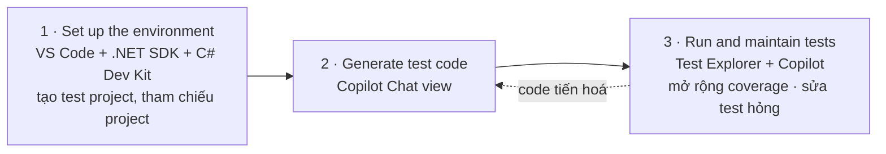
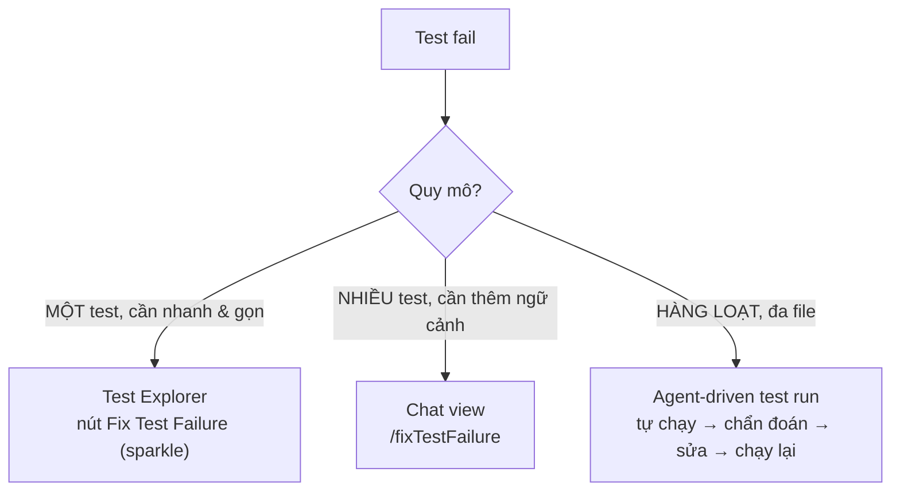

# Note 16 — Unit testing với GitHub Copilot

> **TL;DR:** Domain **Testing with GitHub Copilot — 9% đề GH-300**. Môi trường: **VS Code + .NET 8.0 SDK trở lên + C# Dev Kit**; C# Dev Kit hỗ trợ **3 framework: xUnit · NUnit · MSTest** và cung cấp **Test Explorer** (biểu tượng cốc thí nghiệm trên Activity bar). Quy trình 3 giai đoạn: **thiết lập môi trường → sinh test code → chạy và bảo trì test**. Chat view có **3 agent cục bộ**: **Ask** (chỉ đọc, phân tích/hỏi đáp, **không sửa file**) · **Plan** (lập **kế hoạch từng bước review được trước khi viết code**) · **Agent** (tự trị, **sửa file + chạy lệnh + lặp trên lỗi**). Ba lựa chọn cấu hình mỗi phiên: **Agent Target · Agent · Permission level** (Default Approvals / Bypass Approvals / **Autopilot**) — khởi điểm khuyến nghị là **Agent + Default Approvals**. Slash command: **`/setupTests`** (dựng framework) · **`/tests`** (sinh test cho file/vùng chọn) · **`/plan`** · **`/fixTestFailure`** (sửa test hỏng). **Ghost text** mở rộng coverage nhanh; **nút Fix Test Failure (biểu tượng sparkle)** trong Test Explorer sửa một test hỏng; **Agent tự giám sát, sửa và chạy lại** khi hỏng hàng loạt. Tuỳ biến bằng file **`*.instructions.md`** với **`applyTo: tests/**`**.

## 1. Môi trường kiểm thử trong VS Code

### 1.1. Ba thứ cần có

| Thành phần | Vai trò |
|---|---|
| **.NET 8.0 SDK trở lên** | Nền tảng build & chạy |
| **C# Dev Kit extension** | Cung cấp toàn bộ tính năng testing trong VS Code |
| **Một gói test framework** thêm vào project | xUnit / NUnit / MSTest |

> **Phân vai:** **VS Code + .NET SDK + C# Dev Kit** lo **môi trường host và chạy test**; **GitHub Copilot** lo **sinh và tinh chỉnh code test**.

### 1.2. Năm tính năng testing của C# Dev Kit

| Tính năng | Nội dung |
|---|---|
| **Test Explorer** | **Cây hiển thị mọi test case trong workspace** — mở bằng **biểu tượng cốc thí nghiệm (beaker) trên Activity bar** |
| **Run/Debug test cases** | **Nút play màu xanh** hiện trong editor cạnh mỗi test class và method; **chuột phải** để thấy thêm tuỳ chọn (**Run Test**, **Debug Test**) |
| **View test results** | Sau khi chạy, kết quả phản ánh qua **editor decoration** và **Test Explorer**; **bấm link trong stack trace** để nhảy tới vị trí mã nguồn |
| **Testing commands** | Trong Command Palette — ví dụ **`Test: Run All Tests`**, **`Test: Debug Failed Tests`**, **`Test: Show Output`**. Tìm bằng từ khoá **`Test:`** |
| **Testing settings** | Trong Settings editor, tìm **`Testing`** — cấu hình **test discovery**, **auto-run on save**, định dạng kết quả |

### 1.3. Ba framework & gói NuGet tương ứng

Tạo test project qua **Command Palette**: `Ctrl+Shift+P` (Windows/Linux) / `Cmd+Shift+P` (macOS), hoặc **View → Command Palette**, hoặc **Solution Explorer → chuột phải solution folder → New Project** (mở palette với lệnh **`.NET: New Project...`** đã chọn sẵn).

| Framework | Chọn template | `<PackageReference />` được thêm |
|---|---|---|
| **xUnit** | **xUnit Test Project** | `Microsoft.NET.Test.Sdk` · **`xUnit`** · **`xunit.runner.visualstudio`** · `coverlet.collector` |
| **NUnit** | **NUnit3 Test Project** | `Microsoft.NET.Test.Sdk` · **`NUnit`** · **`NUnit3TestAdapter`** |
| **MSTest** | **MSTest Test Project** | `Microsoft.NET.Test.Sdk` · **`MSTest.TestAdapter`** · **`MSTest.TestFramework`** · `coverlet.collector` |

Sau đó thêm tham chiếu từ test project tới project cần test:

```bash
dotnet add [đường dẫn csproj của test project] reference [đường dẫn csproj của project được test]
```

```
★ Insight ─────────────────────────────────────
• Chi tiết dễ mất điểm: NUnit là framework DUY NHẤT trong ba cái KHÔNG kèm
  `coverlet.collector` (xUnit và MSTest đều có). Và tên template là "NUnit3
  Test Project" — có số 3, khác hai cái kia.
• Mỗi framework có đúng một "adapter/runner" riêng, đó là gói đặc trưng để
  nhận diện: xunit.runner.visualstudio · NUnit3TestAdapter · MSTest.TestAdapter.
─────────────────────────────────────────────────
```

### 1.4. Quy trình 3 giai đoạn



## 2. Sinh unit test bằng Chat view

### 2.1. Mở Chat view & ba lựa chọn cấu hình

Mở bằng **`Ctrl+Alt+I`** (Windows/Linux) hoặc **`Cmd+Alt+I`** (macOS), hoặc **icon GitHub Copilot trên title bar → Toggle Chat**. Chat view mở ở **Secondary Side Bar** với **ba lựa chọn ảnh hưởng tới mọi prompt**:

| Lựa chọn | Nội dung |
|---|---|
| **Agent Target** | **Agent chạy ở đâu.** Chọn **Local** để chạy tương tác trong editor với **toàn quyền truy cập workspace, tool và model** |
| **Agent** | **Vai trò AI nhận trong phiên.** Ba agent cục bộ dựng sẵn: **Ask · Plan · Agent** |
| **Permission level** | **Mức tự trị khi gọi tool và lệnh terminal**: **Default Approvals · Bypass Approvals · Autopilot** |

> ✅ **Khởi điểm khuyến nghị cho sinh unit test: Agent + Default Approvals.** Agent mode **sửa được file, chạy lệnh terminal và chạy lại test**, nên từ prompt kiểu *"generate tests for this method"* nó cho ra file test hoạt động được mà bạn chỉ cần review. **Default Approvals giữ bạn trong vòng lặp** bằng cách **hỏi xác nhận mỗi lần gọi tool**.

### 2.2. So sánh ba agent — bảng phải thuộc

| Agent | **Hợp nhất cho** | **Dùng điển hình trong unit testing** |
|---|---|---|
| **Ask** | **Phân tích chỉ-đọc và hỏi đáp** về code | **Khám phá edge case, lựa chọn framework, hoặc xem test mẫu TRƯỚC KHI viết bất kỳ code nào** |
| **Plan** | **Kế hoạch hiện thực từng bước, có cấu trúc** | **Thiết kế chiến lược test đa file mà bạn review được trước khi hiện thực** |
| **Agent** | **Workflow code tự trị, đa file** | **Sinh test thẳng vào test project, chạy chúng, và lặp trên các lỗi** |

Đổi agent bất cứ lúc nào bằng **agent picker** trong Chat view.

> 💰 **Important (nguyên văn):** khi dùng Chat view với **Agent**, Copilot **có thể thực hiện NHIỀU premium request để hoàn thành MỘT tác vụ**. Premium request bị tiêu **cả bởi prompt bạn gõ lẫn các hành động tiếp theo agent tự làm thay bạn**. Tổng lượng tiêu **phụ thuộc độ phức tạp tác vụ, số bước, và model bạn chọn**.

### 2.3. Dùng Ask mode để phân tích trước (tuỳ chọn)

**Ask mode trả lời trong chat mà KHÔNG sửa file và KHÔNG gọi tool** → hợp khi muốn **lập phương án trước khi cho Agent thay đổi gì**. Bốn tình huống dùng Ask:

- **So sánh các test case ứng viên** cho một method phức tạp trước khi chốt cấu trúc.
- **Nhận diện edge case và boundary condition** đáng phủ.
- **Xin khuyến nghị về test framework hoặc assertion style.**
- **Xem một test mẫu trong chat mà không ghi ra đĩa.**

Cách làm: Chat view → chọn **Ask** trong agent picker → **đính kèm file/vùng chọn làm ngữ cảnh** (ví dụ **`#selection`** hoặc kéo file vào) → hỏi câu phân tích, ví dụ:

> *"What edge cases should I cover when testing the CalculateDiscount method? List the scenarios and explain why each one matters."*

→ Đọc câu trả lời, **rồi chuyển agent picker sang Agent để sinh test thật**.

### 2.4. `/setupTests` — dựng framework

Nếu project **chưa có test framework**, Copilot **khuyến nghị một cái và hướng dẫn cấu hình**. Lệnh **`/setupTests` hoạt động ở mọi agent**, nhưng **Agent mode còn cài được package và tạo test project cho bạn**.

1. Chat view → chọn **Agent**.
2. Gõ **`/setupTests`**.
3. **Xác nhận các tool invocation và lệnh terminal** Agent đề xuất để **cài package, scaffold test project, và khuyến nghị extension testing của VS Code**.

> Hữu ích nhất khi **bắt đầu test project mới** hoặc **onboard một project chưa có test**.

### 2.5. `/tests` — sinh test

**Sinh unit test cho code đang active trong editor.** Ở **Agent mode**, test sinh ra **được ghi thẳng vào file test phù hợp**. Copilot **tự phát hiện test framework và coding style hiện có** và sinh test khớp.

| Mục tiêu | Các bước |
|---|---|
| **Cả file** | Mở file code → Chat view, xác nhận **Agent** đã chọn → gõ `/tests` kèm hướng dẫn, ví dụ: *"/tests Generate unit tests for the methods in this file. Include success, failure, and edge cases."* → xác nhận tool invocation → review thay đổi → **Keep** hoặc **Undo** |
| **Một method / khối code** | Mở file → **bôi đen method hoặc khối** → gõ `/tests` kèm hướng dẫn tham chiếu vùng chọn, ví dụ: *"/tests Generate unit tests for the selected method. Validate both success and failure, and include edge cases."* → review, keep hoặc discard |

> Agent **thêm test vào file test có sẵn** nếu có, hoặc **tạo file test mới ở vị trí phù hợp**. **Diff hiện trong editor** để bạn kiểm từng thay đổi.

### 2.6. Prompt ngôn ngữ tự nhiên (không cần slash command)

Ba ví dụ nguyên văn:

- *"Generate xUnit tests for the methods in this file and add them to the Calculator.Tests project."*
- *"Write unit tests for the CalculateDiscount method, including edge cases for negative values and zero. **Run the tests after writing them.**"*
- *"Create integration tests for the data access layer in this module."*

> **Mẹo quan trọng:** vì Agent **chạy được lệnh**, bạn **đưa luôn bước kiểm chứng vào cùng prompt**. Yêu cầu Agent **chạy test sau khi viết** giúp nó **tự bắt và sửa các lỗi hiển nhiên trước khi trả việc lại cho bạn**.

### 2.7. Bốn cách đính kèm ngữ cảnh

| Cách | Nội dung |
|---|---|
| **Add Context button** | Mở **Quick Pick** để thêm **file, folder, symbol, hoặc vùng chọn hiện tại** |
| **Drag and drop** | **Kéo file từ Explorer**, hoặc **kéo một editor tab** vào Chat view |
| **`#` mentions** | Gõ `#` + tên file/folder/symbol. **`#selection`** đính vùng chọn hiện tại; **`#codebase`** cho Copilot **tìm ngữ cảnh liên quan khắp workspace**; **`#editor`** cho nội dung đang hiển thị |
| **External files** | Mở **file markdown** (contributor guideline, test convention…) rồi đính qua **Add Context** — Agent dùng nội dung đó để **định hình test sinh ra** |

> **Ví dụ chọn đúng cách:** nếu **một method đang hiển thị** trong editor → *"Write a unit test for the method in **`#editor`**"*. Nếu **nhiều method** đang hiển thị hoặc method vượt quá vùng nhìn thấy → **bôi đen code trước** rồi *"**`#selection`** write unit tests for the selected code"*.

### 2.8. Review và tinh chỉnh

| Bước | Nội dung |
|---|---|
| **Review the diff** | Mỗi file Agent sửa **mở trong editor với phần chỉnh sửa được highlight** — đi qua diff trước khi chấp nhận |
| **Keep or Undo** | **Keep** chấp nhận, **Undo** hoàn tác; **revert được từng hunk riêng lẻ** từ editor |
| **Build and run** | Sau khi keep, **build test project và chạy test** từ Test Explorer hoặc terminal để chắc mọi thứ compile và pass |
| **Iterate** | Dùng **follow-up prompt trong cùng phiên chat** để tinh chỉnh test cụ thể, thêm case, hoặc đổi tên method |

### 2.9. Custom instructions cho test

| Tuỳ biến được | Ví dụ |
|---|---|
| **Chỉ định framework ưa dùng** | xUnit thay vì NUnit |
| **Quy ước đặt tên** cho test class và test method | |
| **Sở thích cấu trúc code** | mẫu **Arrange-Act-Assert** |
| **Yêu cầu pattern test cụ thể** | **parameterized test cho giá trị biên** |

Lưu trong file **`*.instructions.md`** trong workspace, dùng trường metadata **`applyTo`** để **chỉ áp cho file test** — ví dụ **`applyTo: tests/**`** giới hạn vào thư mục `tests/`. **Đưa file này vào source control** để cả team có cùng ngữ cảnh test.

> ⚠️ **Important (nguyên văn):** *"Generated test cases might not cover every scenario. **Manual review and code review are still required** to ensure the quality of your tests."*

## 3. Lập kế hoạch & tự động hoá bằng Plan và Agent

### 3.1. Dùng Plan agent thiết kế chiến lược test

**Plan agent tạo kế hoạch hiện thực chi tiết TRƯỚC KHI viết bất kỳ code nào.** Nó **nghiên cứu tác vụ, hỏi câu làm rõ, và đề xuất kế hoạch từng bước** để bạn **review, tinh chỉnh, rồi bàn giao cho Agent**.

| Bước | Nội dung |
|---|---|
| 1 | Mở file/các file chứa code cần test |
| 2 | Chat view → chọn **Plan** trong agent picker, **hoặc gõ `/plan`** kèm mô tả tác vụ |
| 3 | Nhập prompt mô tả test muốn tạo. Ví dụ gốc: *"I need unit tests for the methods in the Calculator class. Use xUnit. Include tests for success, failure, and boundary conditions. Place the new tests in the Calculator.Tests project."* |
| 4 | **Trả lời câu hỏi làm rõ** — Plan agent có thể hỏi về **framework ưa dùng, quy ước đặt tên, hoặc cách xử lý dependency** trước khi soạn kế hoạch |
| 5 | **Review kế hoạch** — thường gồm **tóm tắt tầng cao**, **bóc tách các bước**, **các bước kiểm chứng để chạy test**, và **các quyết định đã ghi lại**. Lặp với Plan agent tới khi kế hoạch đúng ý |
| 6 | **Bàn giao để hiện thực** — chọn tuỳ chọn bắt đầu implementation. Hiện thực **trong cùng phiên chat**, hoặc **khởi động background/cloud session** để làm tự trị. Cũng **mở kế hoạch trong editor** để xem thêm |

> **Plan agent đặc biệt hữu ích khi** tác vụ test **trải nhiều file**, **cần test class hoặc fixture mới**, hoặc **phải khớp convention của team mà chưa được ghi trong instructions**.

### 3.2. Dùng Agent tự động hoá workflow test

Agent **tự động hoá tác vụ đa bước khắp workspace**: **scaffold test project, tạo file test, chạy test, sinh test report, hoặc sửa vấn đề phát sinh khi chạy test**.

| Bước | Nội dung |
|---|---|
| 1 | Mở file chứa code cần test |
| 2 | Chat view → chọn **Agent** |
| 3 | **Để Agent tự xác định ngữ cảnh** — Copilot **tự nhận diện file liên quan**; bạn có thể thêm bằng **Add Context** hoặc kéo file vào |
| 4 | *(Tuỳ chọn)* bấm **icon Tools** để **chọn tool Agent được phép dùng** — hữu ích cho test: **tool sửa file**, **tool terminal để chạy `dotnet test`**, và **test tool do extension cung cấp** |
| 5 | Nhập prompt định nghĩa tác vụ. Ví dụ gốc: *"Ensure that a suitable unit test project is prepared for the selected code file. Create a test file in the unit test project that includes unit tests for all methods in the selected file. Unit tests should be written in C# and use the xUnit framework. **Run the tests to ensure expected results.**"* |
| 6 | **Giám sát Agent** — **xác nhận hoặc từ chối** tool invocation và lệnh terminal; **ngắt Agent** nếu cần đổi ngữ cảnh, đổi tool, hoặc chỉnh phạm vi |
| 7 | **Review file Agent tạo/sửa**, rồi **keep hoặc discard**; dùng **follow-up prompt** để tinh chỉnh |

### 3.3. Chọn Plan, Agent, hay cả hai

| Tình huống | Chọn |
|---|---|
| Việc test có **mơ hồ**, **nhiều file**, hoặc **convention team cần xác nhận** | **Plan trước** — kế hoạch trở thành **"hợp đồng" bạn review được trước khi viết code** |
| Tác vụ **đã định nghĩa rõ**, muốn Copilot scaffold/sinh/chạy test **không cần bước lập kế hoạch trung gian** | **Agent trực tiếp** |
| Muốn **kế hoạch review được CỘNG hiện thực tự trị** | **Plan rồi bàn giao cho Agent** — kết hợp này cho **kiểm soát phạm vi tốt nhất** mà vẫn tự động hoá công việc |

## 4. Ghost text & sửa test hỏng

### 4.1. Ghost text mở rộng coverage

**Ghost text** = **inline code completion hiện khi bạn gõ trong editor**. Khi file test **đã có vài test case**, Copilot **dùng pattern sẵn có để gợi ý test case tương tự cho kịch bản khác** — **cách nhanh nhất để mở rộng coverage** khi test ban đầu đã có.

| Bước | Nội dung |
|---|---|
| 1 | Mở file test **có ít nhất một hoặc hai test case hoàn chỉnh** |
| 2 | Đặt con trỏ **cuối test case cuối cùng**, nhấn **Enter** xuống dòng mới |
| 3 | Bắt đầu gõ **tên test method mới** hoặc **viết comment mô tả**, ví dụ: `// Test that ProcessOrder throws when the order total is negative.` |
| 4 | Copilot hiện **ghost text** hoàn thiện test method dựa trên **code xung quanh, các import, và pattern test sẵn có** |
| 5 | **`Tab`** để chấp nhận, **`Esc`** để bỏ qua |
| 6 | Tinh chỉnh; gõ tiếp để mở rộng, hoặc **nhấn Enter để kích hoạt gợi ý ghost text kế tiếp** |

**Ghost text hiệu quả nhất khi:** file test **đã thể hiện pattern bạn muốn Copilot theo** (ví dụ cấu trúc **Arrange-Act-Assert** hoặc attribute của parameterized test) · **method cần test được tham chiếu trong file** qua **`using` directive hoặc namespace đã import** · **comment nêu rõ kịch bản bạn muốn test**.

> **Tip gốc:** dùng ghost text để **thêm nhanh edge case vào test class đã có**. Việc lớn hơn — như **tạo hẳn một test class mới** — thì **quay lại Chat view và dùng Ask, Plan, hoặc Agent**.

### 4.2. Ba cách sửa test hỏng



**Cách 1 — nút Fix Test Failure trong Test Explorer:**

1. Chạy test từ Test Explorer hoặc nút play xanh.
2. Trong Test Explorer, **rê chuột lên test đang fail**.
3. Bấm **Fix Test Failure (biểu tượng sparkle)**.
4. Copilot **mở phiên chat, đính kèm test hỏng và output của nó làm ngữ cảnh**, và đề xuất cách sửa.
5. **Review** — gợi ý có thể **sửa code ứng dụng, code test, hoặc cả hai**, tuỳ nguyên nhân.
6. **Keep** hoặc **Undo**, rồi **chạy lại test để xác nhận**.

**Cách 2 — `/fixTestFailure` trong Chat view:** hữu ích khi muốn **đính thêm ngữ cảnh** hoặc **xử lý nhiều test hỏng cùng lúc**. Mở Chat view → gõ **`/fixTestFailure`** → *(tuỳ chọn)* đính thêm ngữ cảnh như **file nguồn liên quan hoặc output terminal gần đây** → làm theo gợi ý rồi chạy lại test.

**Cách 3 — để Agent tự giám sát và sửa:** khi dùng Agent chạy test, nó **theo dõi output, nhận diện lỗi, và TỰ ĐỘNG thử sửa rồi chạy lại**. Hữu ích khi **scaffold test project mới** hoặc **thay đổi lớn ảnh hưởng nhiều test**. Prompt mẫu:

> *"Run the xUnit tests in the Calculator.Tests project. If any tests fail, propose and apply fixes, then rerun the tests until they pass."*

### 4.3. Chọn đúng công cụ

| Công cụ | Hợp nhất khi |
|---|---|
| **Ghost text** | **Thêm test case vào file test đã có pattern rõ** |
| **Fix Test Failure trong Test Explorer** | **MỘT test fail**, muốn sửa **nhanh và tập trung** |
| **`/fixTestFailure` trong Chat view** | Muốn **đính thêm ngữ cảnh** hoặc **xử lý nhiều lỗi cùng lúc** |
| **Agent-driven test run** | Muốn Copilot **chạy test, chẩn đoán lỗi, và áp fix xuyên nhiều file trong một phiên** |

```
★ Insight ─────────────────────────────────────
• Ba agent Ask/Plan/Agent chính là ba MỨC CAM KẾT chứ không phải ba mức năng lực:
    Ask   → không đụng vào gì (đọc + trả lời)
    Plan  → chỉ tạo ra một KẾ HOẠCH (vẫn chưa đụng code)
    Agent → sửa file, chạy lệnh, lặp
  Đây là cùng một mô hình với 3 session mode Interactive/Plan/Autopilot của
  Copilot app ở note 09 — nhớ một cái là suy ra cái kia.
• Ba cách sửa test hỏng phân biệt theo QUY MÔ, không theo năng lực:
  một test → nút sparkle · nhiều test hoặc cần thêm ngữ cảnh → /fixTestFailure
  · hàng loạt đa file → để Agent tự chạy vòng lặp. Đề hay hỏi dạng "một test
  duy nhất fail, cách nhanh nhất là gì?" → nút Fix Test Failure trong Test Explorer.
• Chi tiết đắt: yêu cầu Agent "run the tests after writing them" NGAY TRONG
  prompt sinh test — biến một prompt thành cả vòng generate→verify→fix.
─────────────────────────────────────────────────
```

## Q&A phỏng vấn

**Q1. Ba thứ cần có để tạo và chạy C# unit test trong VS Code?**
→ **.NET 8.0 SDK trở lên** · **C# Dev Kit extension** · **một gói test framework** thêm vào project.

**Q2. C# Dev Kit hỗ trợ những test framework nào?**
→ **xUnit · NUnit · MSTest**.

**Q3. Mở Test Explorer bằng cách nào?**
→ Bấm **biểu tượng cốc thí nghiệm (beaker) trên Activity bar**.

**Q4. Ba lựa chọn cấu hình trong Chat view và khởi điểm khuyến nghị?**
→ **Agent Target** (Local) · **Agent** (Ask/Plan/Agent) · **Permission level** (Default Approvals / Bypass Approvals / Autopilot). Khởi điểm khuyến nghị: **Agent + Default Approvals**.

**Q5. Phân biệt Ask, Plan và Agent.**
→ **Ask** = phân tích **chỉ-đọc**, không sửa file, không gọi tool. **Plan** = tạo **kế hoạch từng bước review được** trước khi viết code. **Agent** = **workflow tự trị đa file**: sinh test thẳng vào project, chạy chúng, lặp trên lỗi.

**Q6. `/setupTests` khác `/tests` thế nào?**
→ **`/setupTests`**: khuyến nghị và **dựng test framework** (cài package, scaffold test project) — dùng khi project **chưa có test**. **`/tests`**: **sinh unit test cho code đang active** trong editor.

**Q7. Bốn cách đính kèm ngữ cảnh cho prompt?**
→ **Add Context button** · **drag and drop** · **`#` mentions** (`#selection`, `#codebase`, `#editor`) · **external files** (file markdown chứa convention, đính qua Add Context).

**Q8. Một method đang hiển thị trong editor vs nhiều method — dùng gì?**
→ Một method hiển thị → **`#editor`**. Nhiều method hoặc method vượt vùng nhìn thấy → **bôi đen trước** rồi dùng **`#selection`**.

**Q9. Lưu custom instructions cho test ở đâu và giới hạn phạm vi thế nào?**
→ File **`*.instructions.md`** trong workspace, dùng metadata **`applyTo`** — ví dụ **`applyTo: tests/**`**. Đưa file vào **source control** để cả team dùng chung.

**Q10. Một test duy nhất fail, cách nhanh nhất?**
→ **Test Explorer → rê chuột lên test fail → nút Fix Test Failure (sparkle)**. Copilot mở chat, **tự đính test hỏng và output làm ngữ cảnh**, đề xuất fix (có thể sửa **code ứng dụng, code test, hoặc cả hai**).

**Q11. Ghost text hoạt động tốt nhất khi nào?**
→ Khi file test **đã thể hiện pattern muốn theo** (Arrange-Act-Assert, attribute parameterized test) · **method cần test được tham chiếu qua `using`/namespace đã import** · **comment nêu rõ kịch bản**.

**Q12. Khi nào chọn Plan thay vì Agent trực tiếp?**
→ Khi việc test có **mơ hồ, trải nhiều file, hoặc cần khớp convention team chưa ghi trong instructions** — kế hoạch trở thành **"hợp đồng" review được trước khi viết code**.

## Tự kiểm tra

1. Gói NuGet đặc trưng của từng framework? *(xunit.runner.visualstudio · NUnit3TestAdapter · MSTest.TestAdapter)*
2. Framework nào KHÔNG kèm `coverlet.collector`? *(NUnit)*
3. Lệnh thêm tham chiếu từ test project tới project được test? *(`dotnet add [test.csproj] reference [project.csproj]`)*
4. Ba testing command nêu tên trong nguồn? *(`Test: Run All Tests` · `Test: Debug Failed Tests` · `Test: Show Output`)*
5. Phím mở Chat view? *(`Ctrl+Alt+I` / `Cmd+Alt+I`)*
6. Sáu bước dùng ghost text mở rộng test?
7. Ba cách sửa test hỏng và tình huống của từng cách?
8. Câu cảnh báo quan trọng về test do Copilot sinh? *(có thể không phủ hết kịch bản — vẫn cần manual review và code review)*

## Liên quan
- [[00-MOC-GH300|⬅ MOC GH-300]]
- Trước: [[15-Developer-Use-Cases-va-Do-luong]] · Kế tiếp (cụm F): [[17-Thuc-hanh-Copilot-theo-Ngon-ngu]]
- [[10-Agent-Mode-trong-IDE]] — agent mode và vòng lặp self-healing áp cho test
- [[09-Copilot-CLI-va-GitHub-Copilot-App]] — 3 session mode Interactive/Plan/Autopilot, cùng mô hình với Ask/Plan/Agent
- [[07-Copilot-trong-IDE]] — `/tests` ở mức cơ bản, `#`/`@`/`/`
- [[13-Code-Review-va-Pull-Request]] — `applyTo` trong `.github/instructions/*.instructions.md`
