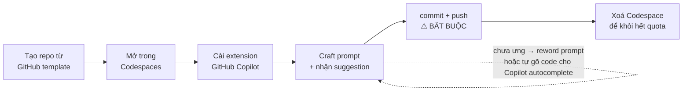
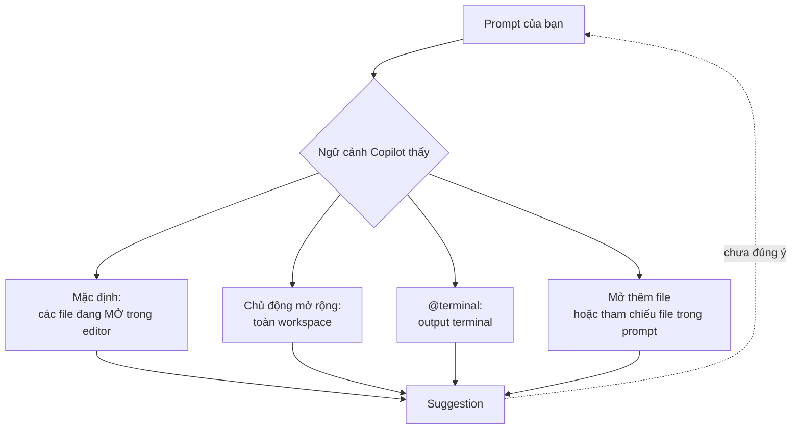

# Note 17 — Thực hành Copilot theo ngôn ngữ

> **TL;DR:** Gộp **3 module lab** của giáo trình (advanced features · JavaScript · Python) — cùng một môi trường **GitHub Codespaces** (môi trường lập trình dựng sẵn chạy trên đám mây, mở bằng VS Code trong trình duyệt). Ba khái niệm cốt lõi cần thuộc: **ghost text** (chữ xám Copilot gợi ý, **`Tab` để nhận**, **`Ctrl+Enter` để duyệt qua nhiều phương án**) · **implicit prompt** (*prompt ngầm* — slash command đã chứa sẵn một prompt được soạn trước, gõ `/fix` là đủ, không cần viết câu dài) · **selective context** (*ngữ cảnh chọn lọc* — chủ động chỉ định Copilot nhìn vào đâu: cả workspace, output terminal qua `@terminal`, hay file đang mở). Copilot **nhận diện prompt** theo **2 cách**: viết dưới dạng **comment trong file code** (`.py`, `.js`) hoặc **gõ text trong file markdown** rồi chờ vài giây. Bài học prompt xuyên suốt cả hai lab: **bắt đầu đơn giản → làm chi tiết dần**; `// Create an API endpoint` là mơ hồ, `// Create an API endpoint using the FastAPI framework that accepts a JSON payload in a POST request` mới đủ rõ. Mặc định Copilot lấy **các file đang mở trong editor** làm ngữ cảnh bổ sung. Kết thúc lab **bắt buộc commit + push rồi xoá Codespace** — không commit là **mất sạch việc**.

## 1. Vì sao gộp 3 module vào một note

Ba module lab của giáo trình dùng **chung một khung**: mở repo mẫu trong Codespaces → cài extension Copilot → craft prompt → nhận suggestion → dọn tài nguyên. Chỉ khác **ngôn ngữ minh hoạ** và **độ sâu tính năng**.

| Module gốc | Ngôn ngữ | Điểm riêng cần nhớ |
|---|---|---|
| **Using advanced GitHub Copilot features** (P1-M5) | Python | Toàn bộ **tính năng nâng cao**: chat pane, inline chat, slash command, agent, **implicit prompt**, **selective context** |
| **Using GitHub Copilot with JavaScript** (P2-M4) | JavaScript | Ví dụ **Express**, prompt `React framework`; kịch bản *customize scroll behavior* + **live suggestions** |
| **Using GitHub Copilot with Python** (P2-M5) | Python | Ví dụ **FastAPI**; kịch bản *customize a Python API* |

> **Bài thi không hỏi thao tác lab**, nhưng **hỏi khái niệm sinh ra từ lab** — nhất là *implicit prompt*, *selective context*, phím tắt, và **hai cách Copilot nhận diện prompt**. Vì vậy note giữ lại **các bước thực hành** nhưng gắn mỗi bước với khái niệm thi.

## 2. Môi trường chung: GitHub Codespaces

**GitHub Codespaces** là *môi trường phát triển được host trên đám mây*, chạy được bằng Visual Studio Code. Bạn **tuỳ biến trải nghiệm cho bất kỳ project nào trên GitHub**: cài sẵn **dependency, thư viện, và cả extension + settings của VS Code**.

### 2.1. Yêu cầu đầu vào (cả 3 module đều liệt kê)

| Điều kiện | Chi tiết |
|---|---|
| **Hiểu cơ bản ngôn ngữ + text editor** | Python (M5, P2-M5) hoặc JavaScript (P2-M4) |
| **Hiểu cơ bản Git & GitHub** | Chạy được `git add`, `git push` |
| **Tài khoản GitHub có subscription Copilot** | Personal, hoặc do organization/enterprise quản lý. **Mục đích học tập: gói Copilot Free (có usage limit) là đủ** |

> Chi tiết quota gói Free xem [[02-Copilot-la-gi-va-cac-goi]] và [[07-Copilot-trong-IDE]].

### 2.2. Vòng đời một buổi lab



## 3. Nền tảng chung: prompt, ghost text, chấp nhận suggestion

### 3.1. Prompt là gì trong ngữ cảnh này

**Prompt** (*câu lệnh đầu vào*) là **tập hợp chỉ dẫn hoặc hướng dẫn giúp sinh code**. Nó có thể là **một comment trong code**, hoặc **input trong Copilot Chat**. Nguồn nhấn mạnh: **chất lượng đầu ra của Copilot phụ thuộc vào việc bạn soạn prompt tốt đến đâu**.

### 3.2. Hai cách Copilot nhận diện prompt

| Cách | Điều kiện |
|---|---|
| **Comment trong file code** | File có đuôi như `.py`, `.js` — viết prompt dưới dạng comment |
| **Text trong file markdown** | Gõ text rồi **chờ vài giây** để Copilot phản hồi |

### 3.3. Ghost text và cách nhận

**Ghost text** là **suggestion hiện dưới dạng chữ xám** (nếu bạn dùng nền/chữ màu đen).

| Thao tác | Phím |
|---|---|
| **Chấp nhận** suggestion | **`Tab`** |
| **Duyệt qua nhiều phương án** | **`Ctrl+Enter`** (Windows) / **`Cmd+Enter`** (Mac) — chọn cái phù hợp nhất |
| **Bỏ qua** | Cứ gõ tiếp, ghost text tự biến mất |

> **Suggestion không cần prompt.** Mặc định Copilot lấy **các file bạn đang mở** làm ngữ cảnh. Nhưng bạn **có thể** đưa prompt qua **comment**, **cửa sổ chat**, hoặc **inline chat**.

### 3.4. Ví dụ prompt → response (2 ngôn ngữ, cùng một bài học)

**JavaScript — Express:**

```javascript
// Create a web API using express and JavaScript with routes for products and customers
```

Copilot sinh ra đại loại:

```javascript
const express = require("express");

app = express();
app.path("/products", () => "products");
app.listen(3000, () => "app runs");
```

**Python — FastAPI:**

```python
# Create a web API using FastAPI with a route to products.
```

Copilot sinh ra:

```python
from fastapi import FastAPI
app = FastAPI()

@app.get("/products")
def read_products():
    return []
```

> **Bạn luôn có quyền accept hoặc reject.** Suggestion là **đề xuất**, không phải kết quả cuối.

## 4. Bốn cách tương tác nâng cao (P1-M5)

| Cách | Kích hoạt | Khi nào dùng |
|---|---|---|
| **Ghost text** (inline suggestion) | Tự động khi gõ | Hoàn thiện dòng/hàm đang viết |
| **Chat pane** (khung chat riêng) | Biểu tượng chat ở **thanh sidebar bên trái** | Hỏi về code đang làm **hoặc câu hỏi phần mềm nói chung** |
| **Inline chat** (chat ngay trong code) | **`Ctrl+I`** (Windows) / **`Command+I`** (Mac) | **Không phải đổi ngữ cảnh sang pane khác** — tương tác diễn ra **sát code** |
| **Slash command** | Gõ **`/`** trong chat pane hoặc inline chat → hiện **drop-down toàn bộ lệnh khả dụng** | Việc lập trình phổ biến, muốn câu trả lời tốt mà **không phải viết prompt dài** |

### 4.1. Bảng slash command nguồn liệt kê

| Lệnh | Tác dụng (nguyên văn nguồn) |
|---|---|
| **`/fix`** | Sửa code (ví dụ chi tiết ở §5) |
| **`/doc`** | *Adds comments to the specified or selected code* — thêm comment cho code chỉ định/đang chọn |
| **`/explain`** | *Gets explanations about the code* — giải thích code |
| **`/generate`** | *Generates code to answer the specified question* — sinh code trả lời câu hỏi |
| **`/help`** | *Gets help on how to use Copilot chat* — trợ giúp cách dùng Copilot chat |
| **`/optimize`** | *Analyzes and improves the runtime of the selected code* — phân tích & cải thiện **runtime** của code đang chọn |
| **`/tests`** | *Creates unit tests for the selected code* — sinh unit test cho code đang chọn |

> ⚠ **Bẫy chính tả trong nguồn:** phần dẫn nhập viết *"the `/docs` command is intended for writing documentation"*, còn bảng liệt kê lại là **`/doc`**. Trong VS Code hiện tại lệnh là **`/doc`**; nhóm `/docs` xuất hiện ở surface khác. Đề thi hỏi *"lệnh nào sinh tài liệu/comment"* → đáp án là **`/doc`**.

> Danh sách slash command **đầy đủ hơn theo từng surface** (IDE, CLI, Copilot app) xem [[07-Copilot-trong-IDE]] và [[09-Copilot-CLI-va-GitHub-Copilot-App]].

### 4.2. Agents

**Agents** là tính năng của Visual Studio Code cho phép bạn **hỏi Copilot trong một ngữ cảnh cụ thể**. Ví dụ **`@terminal`** giúp bạn trò chuyện với Copilot để **thao tác với terminal**.

```text
@terminal How do I fix the error message I'm seeing?
```

> Phân biệt **`@` (agent/môi trường)** vs **`#` (tài nguyên)** vs **`/` (hành động)** — xem [[07-Copilot-trong-IDE]].

## 5. Implicit prompt — prompt ngầm

**Ý tưởng:** thay vì viết prompt dài, dùng tính năng **đã chứa sẵn một prompt được soạn trước** (*precrafted prompt*) để có câu trả lời tốt.

**Kịch bản nguồn** — file Python có bug:

```python
with open("file.txt", "r") as file:
    # Read the file and print the content
    contents = file.read
```

**Các bước:**

1. **Bôi đen (select) đoạn code** có lỗi.
2. Nhấn **`Ctrl+I`** (Windows) / **`Command+I`** (Mac) mở **inline chat**.
3. Gõ **`/fix`** — *chỉ vậy thôi*.
4. Copilot trả lời đại ý: *"To fix the code, I would add parentheses after `file.read` to call the read method and fix the typo in the method name."*

> **Điểm thi:** `/fix` **tự mang theo prompt "hãy tìm và sửa lỗi trong đoạn code được chọn"**. Bạn không gõ prompt đó — nó **ngầm định**. Đó chính là *implicit prompt*.

![[chat-selection-fix.png]]

*Ảnh: Microsoft Learn — prompt chỉ gồm đúng hai chip: `#selection` `/fix`.*
⭐ **Ảnh gói trọn cả §5 lẫn §6 trong một khung hình.** Ô chat **không có một chữ tiếng Anh nào** — chỉ **`#selection`** (*selective context*: chỉ dùng vùng đang bôi đen, thấy rõ ở dòng 33-35 được highlight bên phải) + **`/fix`** (*implicit prompt*: ý định soạn sẵn). Vậy mà Copilot vẫn trả lời rất cụ thể: nhận ra đoạn chọn là **một `case` trong `switch` gán query param vào URI**, chỉ ra **case đang là chuỗi rỗng `''`** — *"which might not be the intended behavior"* — và đề xuất thay bằng **`case 'power':`**. **Hai chip thay được cả một đoạn mô tả dài.** Đó là toàn bộ lý do hai khái niệm này tồn tại.

**Slash command dùng được ở cả inline chat lẫn chat interface.** Kết hợp slash command + inline chat cho phép bạn **chọn cách làm việc hợp với mình và hợp với code đang viết**.

## 6. Selective context — ngữ cảnh chọn lọc

**Ý tưởng:** Copilot có thể **tuỳ biến để gợi ý dựa trên ngữ cảnh bạn chỉ định** — ví dụ **toàn bộ workspace** hoặc **output của terminal**. Nhờ đó Copilot **gợi ý chính xác cho project mà bạn không phải mở hàng loạt file**.

### 6.1. Kịch bản Dockerfile (nguyên văn nguồn)

Cần đóng gói project bằng **Dockerfile** — *một file đặc biệt cần có các instruction cụ thể để đóng gói project*.

**Bước 1 — prompt đầu tiên, đơn giản:**

```text
I need to create a Dockerfile for this project, can you generate one that will help me package it?
```

→ Copilot trả về **các bước tạo Dockerfile cho project của bạn**, kèm **giải thích từng bước làm gì**.

**Bước 2 — chưa ưng thì làm chi tiết hơn (reword):**

```text
Help me create a Dockerfile to package this project but make sure you are using a Virtual Environment for Python.
```

### 6.2. Ngữ cảnh theo *nơi bạn đang làm việc*

Copilot còn gợi ý **theo vị trí bạn đang thao tác**: dùng agent **`@terminal`** để nhờ giúp về **lỗi hoặc câu lệnh**, cho phép Copilot **gợi ý dựa trên output của terminal**.

> **Note của nguồn:** *By default GitHub Copilot uses open files in your text editor as additional context.* — Mặc định Copilot dùng **các file đang mở** làm ngữ cảnh bổ sung. Muốn Copilot nhìn file khác thì **mở file đó ra**, hoặc **tham chiếu nó trong prompt khi dùng Copilot Chat**.



`★ Insight ─────────────────────────────────────`
**Implicit prompt và selective context là hai nửa đối xứng của cùng một bài toán.** Một prompt tốt = **ý định rõ** + **ngữ cảnh đúng**. `/fix` giải quyết nửa *ý định* (prompt soạn sẵn, bạn khỏi mô tả). `@terminal` / mở file / workspace giải quyết nửa *ngữ cảnh* (chỉ cho Copilot nhìn đúng chỗ). Đề thi hay ghép hai khái niệm này vào một câu — nhớ trục phân biệt: **ý định vs dữ liệu đầu vào**.
`─────────────────────────────────────────────────`

## 7. Luồng thực hành JavaScript (P2-M4)

**Kịch bản:** *Improving a project* — dùng prompt để **tuỳ biến hành vi cuộn (scroll behavior)** và nhận **live suggestions** sau khi gõ code khởi đầu.

**Mục tiêu module:**
1. **Cấu hình repo GitHub trong Codespaces** và cài extension GitHub Copilot.
2. **Soạn prompt** để sinh suggestion từ Copilot.
3. **Áp dụng Copilot** để cải thiện project.

**Các bước thực hành:**

1. Tạo repo **từ GitHub template** → mở trong **Codespaces**.
2. Cài **extension GitHub Copilot** trong Codespace.
3. Viết prompt dạng **comment JavaScript** — *đơn giản trước*:
   ```text
   create an HTML form with a text field and button
   ```
4. **Chi tiết hoá dần** để có suggestion sát hơn:
   ```text
   Add an event listen to the button to send a POST request to /generate endpoint and display response in a div with id "result"
   ```
5. **Duyệt các phương án** bằng **`Ctrl+Enter`** / **`Cmd+Enter`**, chọn output tốt nhất. Hoặc dùng **Copilot Chat** để nhập prompt và tương tác với kết quả.
6. **Bí thì**: *reword the prompt*, hoặc **tự viết code khởi đầu để Copilot autocomplete tiếp*.
7. **commit + push** → **xoá Codespace**.

**Cặp prompt kinh điển của module JS:**

| Prompt | Đánh giá |
|---|---|
| `// Create an API endpoint` | ❌ *ambiguous and vague* — Copilot có thể dùng **framework bạn không biết**, hoặc **endpoint đòi dữ liệu bạn không nhận ra** |
| `// Create an API endpoint using the React framework that accepts a JSON payload in a POST request` | ✅ *specific, clear* — Copilot hiểu được **mục tiêu và phạm vi** của task |

## 8. Luồng thực hành Python (P2-M5)

**Kịch bản:** *Improving a project* — dùng prompt để **tuỳ biến một Python API**, cộng với **live suggestions** sau khi gõ code khởi đầu.

**Mục tiêu module:** cấu hình repo trong Codespaces + cài extension → **craft prompt** → **áp dụng Copilot cải thiện project Python**.

**Cặp prompt kinh điển của module Python** (đối xứng hoàn toàn với bản JS):

| Prompt | Đánh giá |
|---|---|
| `# Create an API endpoint` | ❌ mơ hồ |
| `# Create an API endpoint using the FastAPI framework that accepts a JSON payload in a POST request` | ✅ rõ mục tiêu + phạm vi |

**Best practices (nguồn nêu giống hệt ở cả hai module):**

1. **Giữ prompt đơn giản trước, rồi thêm thành phần chi tiết dần.**
2. **Cycle giữa các suggestion** bằng **`Ctrl+Enter`** / **`Cmd+Enter`** rồi chọn cái tốt nhất.
3. **Không ưng thì reword prompt, hoặc bắt đầu viết code cho Copilot autocomplete.**

**Note của nguồn (bản Python đầy đủ hơn bản JS một ý):** Copilot dùng file đang mở làm ngữ cảnh bổ sung; cần Copilot dựa trên file khác thì **mở file đó ra** *hoặc* **tham chiếu chúng trong prompt khi dùng Copilot Chat**.

## 9. Đối chiếu ba module lab

| Tiêu chí | Advanced features (P1-M5) | JavaScript (P2-M4) | Python (P2-M5) |
|---|---|---|---|
| **Ngôn ngữ minh hoạ** | Python | JavaScript | Python |
| **Framework ví dụ** | — (Dockerfile) | **Express**, prompt nhắc **React** | **FastAPI** |
| **Trọng tâm** | **Tính năng nâng cao** | **Prompt engineering** | **Prompt engineering** |
| **Khái niệm riêng** | implicit prompt · selective context · agent `@terminal` · 7 slash command | live suggestions, scroll behavior | tuỳ biến Python API |
| **Nhắc OpenAI Codex?** | Không | **Có** | **Có** |
| **Kết bài** | Xoá Codespaces | Xoá Codespaces | Xoá Codespaces |

## 10. Dọn tài nguyên Codespaces (bắt buộc ở cả 3 module)

**Lý do:** *tránh tiêu hết thời lượng GitHub Codespaces hằng tháng*.

**Các bước:**

1. Vào **Codespaces trên GitHub** (`https://github.com/codespaces`).
2. Tìm **instance Codespace** của bạn trong danh sách, chọn **menu ba chấm (`...`)** để hiện các tuỳ chọn.
3. Chọn **Delete** để xoá instance.

> ⚠ **Note của nguồn, nhắc lại ở cả ba module:** *If you don't commit your changes to your repository, you'll lose all your work.* — **Không commit + push trước khi xoá là mất sạch việc.**

`★ Insight ─────────────────────────────────────`
**Ba module lab lặp lại gần như nguyên văn — và sự lặp lại đó chính là tín hiệu ra đề.** Cặp prompt `Create an API endpoint` (mơ hồ) vs `Create an API endpoint using the {framework} framework that accepts a JSON payload in a POST request` (rõ) xuất hiện **hai lần**, chỉ đổi React ↔ FastAPI. Ba best practice cũng y hệt. Khi giáo trình nói cùng một điều ở nhiều module, đó là **kiến thức lõi**, không phải nội dung độn — trong khi thao tác Codespaces cụ thể thì không.

**Một chi tiết đắt: `Ctrl+Enter` bị nhắc ở lab nhưng dễ lẫn với `Ctrl+I`.** `Ctrl+Enter` = **duyệt nhiều suggestion** (mở multiple suggestions pane); `Ctrl+I` = **mở inline chat**. Hai phím, hai việc hoàn toàn khác — đề thi rất hay hoán đổi.
`─────────────────────────────────────────────────`

## Q&A phỏng vấn

**Q1. *Implicit prompt* là gì? Cho ví dụ.**
→ Tính năng **đã chứa sẵn một prompt soạn trước** (*precrafted prompt*), giúp có câu trả lời tốt mà không phải viết prompt dài. Ví dụ: bôi đen đoạn code lỗi → `Ctrl+I` → gõ **`/fix`**; bản thân `/fix` đã mang ý định "tìm và sửa lỗi trong code được chọn".

**Q2. *Selective context* là gì? Ba cách áp dụng?**
→ **Chủ động chỉ định ngữ cảnh** Copilot dựa vào để gợi ý. Ba cách: (1) **toàn bộ workspace**; (2) **`@terminal`** để dùng **output terminal**; (3) **mở thêm file** hoặc **tham chiếu file trong prompt khi dùng Copilot Chat**.

**Q3. Mặc định Copilot lấy ngữ cảnh từ đâu?**
→ **Các file đang mở trong text editor**. Note này được nguồn nhắc lại ở **cả ba module**.

**Q4. Hai cách Copilot nhận diện một đoạn text là prompt?**
→ (1) Viết dưới dạng **comment trong file code** có đuôi như `.py`/`.js`; (2) Gõ **text trong file markdown** rồi **chờ vài giây**.

**Q5. Phân biệt `Tab`, `Ctrl+Enter`, `Ctrl+I`.**
→ **`Tab`** = **chấp nhận** ghost text · **`Ctrl+Enter`** (`Cmd+Enter`) = **duyệt qua nhiều suggestion** rồi chọn · **`Ctrl+I`** (`Command+I`) = **mở inline chat**.

**Q6. Kể 7 slash command nguồn liệt kê trong module advanced features.**
→ **`/fix` · `/doc` · `/explain` · `/generate` · `/help` · `/optimize` · `/tests`**.

**Q7. Vì sao `// Create an API endpoint` là prompt tệ?**
→ *Ambiguous and vague* — Copilot có thể dùng **framework bạn không biết**, hoặc sinh **endpoint đòi dữ liệu bạn không nhận ra**. Prompt tốt phải nêu **framework, kiểu payload, method** để Copilot hiểu **goal và scope**.

**Q8. Ba best practice dùng Copilot mà cả hai module ngôn ngữ đều nêu?**
→ (1) **Prompt đơn giản trước, chi tiết dần**; (2) **Cycle qua các suggestion bằng `Ctrl+Enter`** rồi chọn cái tốt nhất; (3) **Bí thì reword prompt hoặc tự viết code khởi đầu để Copilot autocomplete**.

**Q9. GitHub Codespaces là gì và tuỳ biến được những gì?**
→ **Môi trường phát triển host trên đám mây**, chạy bằng VS Code. Tuỳ biến được: **dependency, thư viện cài sẵn, extension và settings của VS Code**.

**Q10. Thứ tự bắt buộc khi kết thúc buổi lab?**
→ **commit → push → mới xoá Codespace**. Không commit là **mất toàn bộ công việc**.

**Q11. Agent `@terminal` khác slash command `/fix` ở chỗ nào?**
→ **`@terminal`** cấp **ngữ cảnh** (output terminal) — thuộc *selective context*. **`/fix`** cấp **ý định** (prompt soạn sẵn) — thuộc *implicit prompt*.

**Q12. Module lab nào nhắc OpenAI Codex, module nào không?**
→ **Hai module JavaScript và Python có nhắc** (*"It uses OpenAI Codex, a new AI system developed by OpenAI"*); **module advanced features (P1-M5) không nhắc**.

## Tự kiểm tra

1. Ba khái niệm cốt lõi note này? *(ghost text · implicit prompt · selective context)*
2. Phím nhận suggestion và phím duyệt nhiều suggestion? *(`Tab` · `Ctrl+Enter`)*
3. Phím mở inline chat? *(`Ctrl+I` / `Command+I`)*
4. Nêu đủ **7 slash command** nguồn liệt kê.
5. Viết lại **cặp prompt Dockerfile** (đơn giản → chi tiết) trong module advanced features.
6. Ví dụ bug Python được `/fix` xử lý là gì? *(`contents = file.read` — thiếu `()` để gọi method)*
7. Framework ví dụ của bản JS và bản Python? *(Express/React · FastAPI)*
8. Ba bước xoá Codespace và điều **bắt buộc làm trước**?
9. Copilot lấy ngữ cảnh mặc định từ đâu, và làm sao mở rộng?
10. Gói Copilot nào đủ để làm lab? *(Copilot Free, có usage limit)*

## Liên quan
- [[00-MOC-GH300|⬅ MOC GH-300]]
- Trước: [[16-Unit-Testing-voi-Copilot]] · Kế tiếp: [[18-GH-300-Cheatsheet-va-QA]]
- [[04-Prompt-Engineering-voi-Copilot]] — 4 Ss và zero/one/few-shot, tầng lý thuyết của các cặp prompt ở đây
- [[07-Copilot-trong-IDE]] — `#`/`@`/`/` đầy đủ, multiple suggestions pane
- [[03-Cai-dat-Cau-hinh-va-Cach-tuong-tac]] — 8 cách kích hoạt Copilot, phím tắt gốc
- [[16-Unit-Testing-voi-Copilot]] — `/tests` ở mức chuyên sâu
- [[../02-Git/00-MOC-Git|MOC: Git]] — `git add` / `git push` là điều kiện tiên quyết của cả 3 lab
