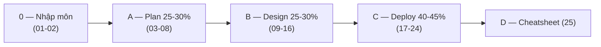

# MOC: AB-100 — Microsoft Certified: Agentic AI Business Solutions Architect

> 📚 Chứng chỉ **expert-level** của Microsoft cho vai trò **solution architect** thiết kế giải pháp nghiệp vụ *agentic-first* (lấy agent làm trung tâm) trên hệ sinh thái Microsoft: **Copilot Studio · Dynamics 365 · Power Platform · Microsoft 365 Copilot · Microsoft Foundry**.
> Nguồn: `_source/Microsoft/AB-100/` — **11 docx = 11 module Microsoft Learn** (~468.000 ký tự, ~84 unit).
> *Ghi chú tên:* nguồn viết **"Azure Foundry"**; tên chính thức hiện tại là **Microsoft Foundry** (xem cảnh báo ở [[02-Ban-do-cong-nghe-AI-Microsoft]] §1).
> *Ảnh minh hoạ:* folder `_img/` chứa ảnh chọn lọc từ Microsoft Learn (© Microsoft, dùng cho mục đích học tập, nguồn ghi dưới từng ảnh); sơ đồ khái niệm còn lại vẽ lại bằng Mermaid bám sát bản gốc.
>
> **Trạng thái:** 🚧 Đang viết — **12/25 note** (xong Đợt 1 nhập môn + Đợt 2-3 cụm Plan + Đợt 4 nửa đầu cụm Design).

> ⚠️ **Ghi chú về ảnh nguồn (rà 27/07/2026):** nguồn có **25 ảnh (23 ảnh duy nhất)** nhưng **KHÁC hẳn bộ AI-103/GH-300 — không có ảnh chụp portal nào**. Toàn bộ là **hình minh hoạ do AI sinh**, nhiều hình **sai chính tả hoặc vô nghĩa** (ví dụ *"Retrreval API"*, *"Fetthes"*, *"SharePhont"*, *"Combigent, veritable answer"* trong sơ đồ grounding; bảng *"RBAC Design Matrix"* có ô màu không nhãn, hàng lệch cột). Vì vậy sơ đồ trong bộ note này **vẽ lại bằng Mermaid** thay vì nhúng ảnh. Ngoại lệ duy nhất tới nay: sơ đồ **6 pha CAF** ở [[04-CAF-cho-AI-va-Vong-doi-Agent]] — mạch lạc và mang thông tin mà phần chữ không nói (3 pha đầu tuyến tính, 3 pha sau lặp vòng, Responsible AI là dải nền xuyên suốt).

## 🎯 Khung đề thi (Skills measured, cập nhật 22/07/2026)

> 🔎 **Ngoài nguồn** — bảng này lấy từ [study guide chính thức của Microsoft Learn](https://learn.microsoft.com/en-us/credentials/certifications/resources/study-guides/ab-100), không có trong 11 docx. Điểm đắt giá: **11 docx ánh xạ 1:1 với 10 mục kỹ năng** dưới đây, nên bộ note chia theo trọng số đề chứ không theo thứ tự file.

| Functional group | Trọng số | Mục kỹ năng | Note |
|---|---|---|---|
| **Plan** AI-powered business solutions | **25–30%** | Analyze requirements · Design overall AI strategy · Evaluate costs & benefits | 03-08 |
| **Design** AI-powered business solutions | **25–30%** | Design AI and agents · Design extensibility · Orchestrate configuration for prebuilt agents & apps | 09-16 |
| **Deploy** AI-powered business solutions | **40–45%** | Analyze/monitor/tune · Manage testing · Design ALM · Responsible AI, security, governance, risk & compliance | 17-24 |

⚠️ **Bẫy phân bổ thời gian ôn:** 4 module của cụm **Deploy** chỉ chiếm ~29% số ký tự giáo trình nhưng gánh **40–45% điểm**. Đừng ôn theo độ dày tài liệu.

Điểm đỗ: **700/1000**. Cert expert-level phải **gia hạn hằng năm** bằng bài đánh giá miễn phí trên Microsoft Learn.

## Cụm 0 — Nhập môn (module *Introduction to agentic AI business solutions*)

| # | Note | Module gốc | TT |
|---|------|-----------|----|
| 01 | [[01-Vai-tro-AI-Solution-Architect\|Vai trò AI Solution Architect & khung chuyển đổi AI]] | Intro U1 | ✅ |
| 02 | [[02-Ban-do-cong-nghe-AI-Microsoft\|Bản đồ công nghệ AI Microsoft & agent dựng sẵn (OOB)]] | Intro U2-U5 | ✅ |

## Cụm A — Plan AI-powered business solutions (25–30%)

| # | Note | Module gốc | TT |
|---|------|-----------|----|
| 03 | [[03-Phan-tich-yeu-cau-va-Du-lieu-Grounding\|Phân tích yêu cầu & dữ liệu grounding]] | Analyze requirements | ✅ |
| 04 | [[04-CAF-cho-AI-va-Vong-doi-Agent\|Cloud Adoption Framework cho AI & vòng đời agent]] | Strategy U1-U2 | ✅ |
| 05 | [[05-Chien-luoc-Multi-Agent-va-Chon-nen-tang\|Chiến lược multi-agent & chọn nền tảng]] | Strategy U3-U5, U8-U9 | ✅ |
| 06 | [[06-Nguon-tri-thuc-Prompt-Library-va-SLM\|Nguồn tri thức Copilot Studio, prompt library & SLM]] | Strategy U7, U10-U12 | ✅ |
| 07 | [[07-Solution-Rules-Vai-tro-va-AI-CoE\|Solution rules, vai trò nghiệp vụ & AI Center of Excellence]] | Strategy U6, U13-U17 | ✅ |
| 08 | [[08-ROI-TCO-va-Build-Buy-Extend\|ROI, TCO & build / buy / extend]] | Evaluate costs and benefits | ✅ |

## Cụm B — Design AI-powered business solutions (25–30%)

| # | Note | Module gốc | TT |
|---|------|-----------|----|
| 09 | [[09-Copilot-trong-Dynamics-365-CE-va-Service\|Copilot trong D365 CE & Service: Responsible AI, business terms & tuỳ biến]] | Agents U1-U3 | ✅ |
| 10 | [[10-Connectors-va-Contact-Center\|Custom connector cho D365 Sales & AI agent cho Contact Center]] | Agents U4-U5 | ✅ |
| 11 | [[11-Ba-loai-Agent-va-Foundry-Tools\|Ba loại agent trong Copilot Studio & đề xuất Foundry tools]] | Agents U6-U9 | ✅ |
| 12 | [[12-Copilot-Studio-Topics-Agent-Flows-Prompt-Actions\|Topics & fallback, NLU/CLU/generative, agent flows & prompt actions]] | Agents U11, U15-U17 | ✅ |
| 13 | Grounding, Power Apps, generative pages & Well-Architected | Agents U10, U12-U14, U18 | 🔜 |
| 14 | Extensibility: custom model, M365 Copilot agent, MCP | Extensibility U1-U4 | 🔜 |
| 15 | Computer Use, agent behaviors & tối ưu agent trong M365 | Extensibility U5-U7 | 🔜 |
| 16 | Orchestrate agent & app dựng sẵn | Orchestrate configuration | 🔜 |

## Cụm C — Deploy AI-powered business solutions (40–45%) ← trọng số cao nhất

| # | Note | Module gốc | TT |
|---|------|-----------|----|
| 17 | Khung giám sát đa tầng & công cụ | Monitor U1 | 🔜 |
| 18 | Metrics, telemetry & tuning | Monitor U2-U5 | 🔜 |
| 19 | Kiểm thử: quy trình, metrics & validation custom model | Testing U1-U2 | 🔜 |
| 20 | Kiểm thử: prompt, kịch bản E2E & sinh test case bằng Copilot | Testing U3-U5 | 🔜 |
| 21 | ALM cho dữ liệu & Copilot Studio | ALM U1-U2 | 🔜 |
| 22 | ALM cho Foundry, custom model & Dynamics 365 | ALM U3-U6 | 🔜 |
| 23 | Bảo mật agent, model security & access control | RAI-Sec U1, U3, U7-U8 | 🔜 |
| 24 | Governance, data residency & Responsible AI | RAI-Sec U2, U4-U6 | 🔜 |

## Cụm D — Ôn thi

| # | Note | Nguồn | TT |
|---|------|-------|----|
| 25 | AB-100 Cheatsheet + bảng cặp dễ nhầm + 39 câu Module assessment + Q&A | Tự tổng hợp | 🔜 |

---

## Lộ trình đọc

## Quan hệ với các bộ note đã có trong vault

AB-100 chồng lấn có chủ ý với 3 bộ note khác. Chỗ nào đã viết kỹ rồi thì AB-100 **cross-link thay vì lặp lý thuyết**, và chỉ viết phần **góc nhìn solution architect / business apps**:

| Chủ đề | Đã có ở | AB-100 thêm góc nhìn gì |
|---|---|---|
| **MCP** (Model Context Protocol) | [[../AI-103/06-Custom-Tools-va-MCP-Tools]] (server, Foundry) · [[../../../00-Foundations/07-GitHub-Copilot/12-GitHub-MCP-Server]] (client, GitHub) | Cấu hình MCP trong **Copilot Studio**, quản trị cấp tenant |
| **A2A** (Agent2Agent) | [[../AI-103/10-A2A-Protocol]] | Khi nào chọn A2A vs connector vs MCP trong kiến trúc nghiệp vụ |
| **Microsoft Foundry**, model catalog | [[../AI-103/01-Microsoft-Foundry-Tong-quan-Plan-Prepare]] · [[../AI-103/02-Model-Catalog-Chon-Deploy-Danh-gia]] | Chọn Foundry Tools theo **yêu cầu nghiệp vụ**, ALM cho Foundry Agents |
| **Responsible AI** | [[../AI-103/04-Toi-uu-Model-va-Responsible-GenAI]] · [[../../../00-Foundations/07-GitHub-Copilot/01-Responsible-AI-voi-Copilot]] | Rà **tuân thủ** ở cấp giải pháp, governance, data residency |
| **Multi-agent orchestration** | [[../../../04-AI/04-LangGraph-Agentic/00-MOC-LangGraph-Agentic]] (LangGraph) · [[../AI-103/09-Agent-Framework-va-Multi-Agent]] | Multi-agent bằng **Copilot Studio + M365 Copilot + Foundry**, khi nào KHÔNG multi-agent |
| **ALM / CI-CD** | [[../../../06-DevOps/00-MOC-DevOps]] | ALM riêng cho **agent, prompt, dữ liệu grounding, model** |

## Liên quan
- [[../00-MOC-Azure]] — MOC Azure tổng (AZ-900 + AI-Azure + AZ-204 + AI-103)
- [[../AI-103/00-MOC-AI-103|MOC: AI-103]] — bộ cert Foundry-era, nền tảng kỹ thuật cho AB-100
- [[../../../00-INDEX|🏠 Index tổng]]
