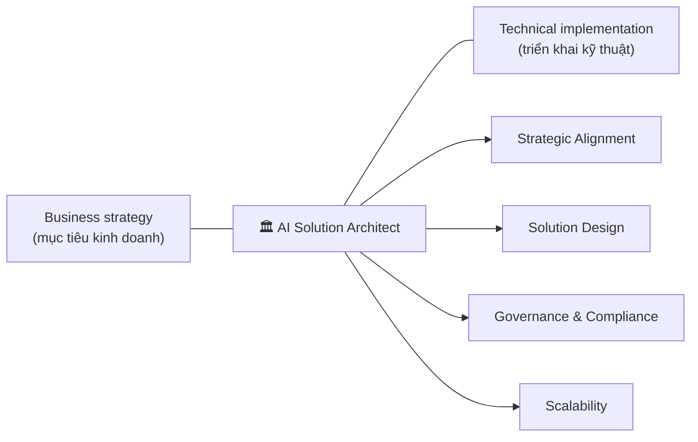
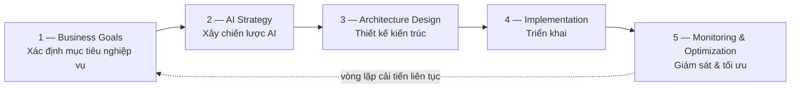

# Note 01 — Vai trò AI Solution Architect & khung chuyển đổi AI

> [!summary] TL;DR
> Câu chốt của cả module nhập môn: **AI transformation** (chuyển đổi bằng AI) **không phải một đợt nâng cấp công nghệ, mà là một thay đổi chiến lược** tác động lên **quy trình nghiệp vụ, con người và văn hoá tổ chức**. Vai trò của **architect** là **bắc cầu giữa chiến lược kinh doanh và triển khai kỹ thuật** — đây là đáp án đúng của câu 1 đề Module assessment, và là ý bị hỏi lại nhiều lần trong suốt giáo trình. Architect có **4 vai trò** (Strategic Alignment · Solution Design · Governance & Compliance · Scalability) và **5 nhóm trách nhiệm** (Vision & Roadmap · Data Architecture · Integration · Security & Ethics · Performance Monitoring). Chuyển đổi đi theo khung **5 giai đoạn**: *Business Goals → AI Strategy → Architecture Design → Implementation → Monitoring & Optimization*. Muốn nhân rộng ra toàn doanh nghiệp thì dựa vào **4 đòn bẩy**: Automation · Standardization · Continuous Learning · User training.

## 1. Vì sao AI transformation không phải chuyện công nghệ

Nguồn mở đầu bằng một khẳng định lặp đi lặp lại — cần thuộc vì đề hay hỏi ngược:

> *"AI transformation is more than a technology upgrade — it's a strategic shift that significantly impacts business processes, people, and organizational culture."*

**Ba thứ bị tác động** (nhớ bộ ba này, đề hay đưa phương án nhiễu chỉ nhắc mỗi "công nghệ"):

| Bị tác động | Nghĩa là gì trong thực tế |
|---|---|
| **Business processes** (quy trình nghiệp vụ) | Quy trình phải được vẽ lại quanh agent, không phải nhét agent vào quy trình cũ |
| **People** (con người) | Đổi vai trò, đổi kỹ năng — sinh ra nhu cầu đào tạo & quản lý thay đổi |
| **Organizational culture** (văn hoá tổ chức) | Mức độ tin tưởng vào output của AI, thói quen ra quyết định dựa trên dữ liệu |

Và AI phải mang lại **measurable business value** (giá trị nghiệp vụ **đo được**) trong khi vẫn giữ được **compliance** (tuân thủ), **scalability** (khả năng mở rộng) và **security** (bảo mật).

## 2. Bốn vai trò của architect

Architect **bridge the gap** — bắc cầu giữa **business strategy** (chiến lược kinh doanh) và **technical implementation** (triển khai kỹ thuật). Cụ thể gồm 4 mảng:

| Vai trò | Tiếng Việt | Làm gì |
|---|---|---|
| **Strategic Alignment** | Gióng hàng chiến lược | Bảo đảm sáng kiến AI phục vụ đúng mục tiêu tổ chức |
| **Solution Design** | Thiết kế giải pháp | Dựng kiến trúc **tích hợp AI vào hệ thống đang có** (chứ không xây song song) |
| **Governance and Compliance** | Quản trị & tuân thủ | Lập khung cho việc dùng AI có trách nhiệm |
| **Scalability** | Khả năng mở rộng | Thiết kế để lớn lên cùng nhu cầu nghiệp vụ |

`★ Insight ─────────────────────────────────────`
Đề AB-100 rất hay dựng phương án nhiễu bằng cách mô tả một vai trò **kỹ thuật thuần**: "developing machine learning models", "writing code for AI models", "building physical servers", "designing user interfaces". Tất cả đều **sai** — không phải vì các việc đó vô nghĩa, mà vì chúng nằm **một bên** của cây cầu. Quy tắc chọn đáp án: **phương án nào chỉ chạm một phía (business hoặc technical) thì loại; phương án nào nối hai phía thì chọn.**
`─────────────────────────────────────────────────`

## 3. Năm nhóm trách nhiệm của AI architect

Bảng gốc trong giáo trình (nhớ **cặp trách nhiệm ↔ mô tả**, đề hay tráo mô tả giữa các dòng):

| Trách nhiệm | Mô tả gốc | Diễn giải |
|---|---|---|
| **Vision & Roadmap** | Define AI adoption strategy aligned with priorities | Định nghĩa **tầm nhìn và lộ trình áp dụng AI** bám ưu tiên của tổ chức |
| **Data Architecture** | Ensure data readiness and governance | Bảo đảm dữ liệu **sẵn sàng** (readiness) và **được quản trị** — nền của mọi grounding sau này |
| **Integration** | Connect AI services with enterprise workflows | Nối dịch vụ AI vào **luồng công việc doanh nghiệp** |
| **Security & Ethics** | Implement responsible AI principles | Cài đặt các nguyên tắc **Responsible AI** |
| **Performance Monitoring** | Establish KPIs and monitor effectiveness | Lập **KPI** (chỉ số hiệu quả then chốt) và theo dõi hiệu quả |

> 💡 Câu 2 của Module assessment hỏi "trách nhiệm then chốt để giải pháp AI **hiệu quả và bám ưu tiên nghiệp vụ**" → đáp án là **Defining the AI adoption vision and roadmap**. Phương án nhiễu "Conducting end-user training **only**" sai vì chữ **only** — đào tạo là cần nhưng không thay được lộ trình.

## 4. Khung chuyển đổi AI — 5 giai đoạn

Ý nghĩa của thứ tự này: cách tiếp cận phải **systematic** (có hệ thống) và **outcome-driven** (dẫn dắt bởi kết quả). Nói cách khác — **bắt đầu từ mục tiêu nghiệp vụ, không bắt đầu từ công nghệ**. Đây là nguyên tắc xuyên suốt cả bộ AB-100 và sẽ quay lại ở [[04-CAF-cho-AI-va-Vong-doi-Agent]] dưới dạng **Cloud Adoption Framework**.

## 5. Năm best practice cho AI architect

| Best practice | Vì sao |
|---|---|
| **Start with business outcomes** — tập trung vào tác động **đo được** | Tránh làm AI vì AI; ROI đo được ngay từ đầu (→ [[08-ROI-TCO-va-Build-Buy-Extend]]) |
| **Adopt modular design** — thiết kế **mô-đun** cho linh hoạt & mở rộng | Đáp án đúng của câu 3 Module assessment |
| **Prioritize Responsible AI** (fairness, transparency, accountability) | Tuân thủ + niềm tin |
| **Collaborate across teams** — data scientist, developer, business leader | Kiến trúc AI không phải việc của một người |
| **Use Azure AI services** cho tốc độ & độ tin cậy | Dựa nền tảng có sẵn thay vì tự dựng |

> ⚠️ Câu 3 Module assessment có phương án nhiễu **"Focus solely on technology upgrades"** và **"Avoid collaboration with business leaders"** — cả hai đều là **phản đề trực tiếp** của best practice trong bảng. Dạng câu này rất dễ ăn điểm nếu thuộc bảng.

## 6. Bốn đòn bẩy để nhân rộng AI ra toàn doanh nghiệp

| Đòn bẩy | Nội dung gốc | Nghĩa |
|---|---|---|
| **Automation** | Streamline deployment and monitoring | Tự động hoá **triển khai và giám sát** — không phải tự động hoá nghiệp vụ |
| **Standardization** | Use common frameworks and tools | Dùng **chung** framework/công cụ để mọi team làm giống nhau |
| **Continuous Learning** | Enable models to evolve with new data | Để **model** tiến hoá theo dữ liệu mới |
| **User training** | Enable a culture of continuous user learning | Nuôi **văn hoá học liên tục cho người dùng** |

`★ Insight ─────────────────────────────────────`
Hai dòng cuối rất dễ nhầm nhau vì đều có chữ "learning". Cách phân biệt chắc chắn: **Continuous Learning là chuyện của MODEL** (học từ dữ liệu mới), **User training là chuyện của NGƯỜI** (văn hoá học liên tục). Cặp này còn quay lại ở cụm Deploy — tuning model dựa trên telemetry ([[18-Metrics-Telemetry-va-Tuning]]) so với đào tạo & adoption ([[07-Solution-Rules-Vai-tro-va-AI-CoE]]).
`─────────────────────────────────────────────────`

## 7. Sáu nguyên tắc Responsible AI (dùng xuyên suốt bộ note)

Giáo trình nhắc lại bộ 6 nguyên tắc này ở **cả 4 unit** của module nhập môn — dấu hiệu rõ ràng là kiến thức bắt buộc:

**Fairness · Reliability and Safety · Privacy and Security · Inclusiveness · Transparency · Accountability**

| Nguyên tắc | Tiếng Việt | Ý chính |
|---|---|---|
| **Fairness** | Công bằng | Không phân biệt đối xử giữa các nhóm người dùng |
| **Reliability and Safety** | Tin cậy & an toàn | Hoạt động ổn định, an toàn cả khi gặp tình huống bất thường |
| **Privacy and Security** | Riêng tư & bảo mật | Bảo vệ dữ liệu người dùng |
| **Inclusiveness** | Bao trùm | Ai cũng dùng được, kể cả người khuyết tật |
| **Transparency** | Minh bạch | Hiểu được hệ thống làm gì và vì sao |
| **Accountability** | Trách nhiệm giải trình | Có người chịu trách nhiệm cho kết quả của hệ thống |

> Chi tiết cách **áp dụng** 6 nguyên tắc vào thiết kế agent nằm ở [[24-Governance-Data-Residency-va-Responsible-AI]]. Bản Azure-centric đã viết ở [[../AI-103/04-Toi-uu-Model-va-Responsible-GenAI]], bản GitHub Copilot ở [[../../../00-Foundations/07-GitHub-Copilot/01-Responsible-AI-voi-Copilot]] — **cùng một bộ 6 nguyên tắc**, không cần học lại.

## Q&A phỏng vấn

> [!question] "Vai trò chính của architect trong AI transformation là gì?"
> **Bắc cầu giữa chiến lược kinh doanh và triển khai kỹ thuật.** Không phải viết model, không phải dựng hạ tầng — mà bảo đảm sáng kiến AI bám mục tiêu tổ chức, thiết kế kiến trúc tích hợp được vào hệ thống hiện có, lập khung quản trị cho việc dùng AI có trách nhiệm, và thiết kế để mở rộng được.

> [!question] "Doanh nghiệp muốn 'làm AI' nhưng chưa biết bắt đầu từ đâu. Anh khuyên gì?"
> Bắt đầu từ **business outcome đo được**, không bắt đầu từ công nghệ. Đi theo khung 5 giai đoạn: xác định mục tiêu nghiệp vụ → dựng chiến lược AI → thiết kế kiến trúc → triển khai → giám sát và tối ưu. Song song đó phải chuẩn bị **data readiness và governance** ngay từ giai đoạn 1, vì mọi thứ về sau (grounding, agent, RAG) đều đứng trên dữ liệu.

> [!question] "Làm sao biết dự án AI có thành công không?"
> Phải có **KPI** được định nghĩa từ trước — đó là trách nhiệm **Performance Monitoring** của architect. Nếu không đặt KPI ở giai đoạn thiết kế thì đến lúc vận hành sẽ không có gì để đối chiếu. Cách xây chỉ số cụ thể ở [[18-Metrics-Telemetry-va-Tuning]] và tiêu chí ROI ở [[08-ROI-TCO-va-Build-Buy-Extend]].

> [!question] "Vì sao nói AI transformation là thay đổi chiến lược chứ không phải nâng cấp công nghệ?"
> Vì nó tác động đồng thời lên **ba thứ**: quy trình nghiệp vụ, con người, và văn hoá tổ chức. Một bản nâng cấp công nghệ thuần chỉ đổi công cụ — người dùng vẫn làm việc như cũ. Còn agentic AI thay đổi **ai làm việc gì**, nên nếu không xử lý phần con người và văn hoá thì giải pháp có tốt đến mấy cũng không được dùng.

## Tự kiểm tra

1. Kể **4 vai trò** của architect trong AI transformation. Vai trò nào chịu trách nhiệm cho việc "solution grows with business needs"?
2. Trong bảng 5 trách nhiệm, trách nhiệm nào gắn với **"data readiness and governance"**? Trách nhiệm nào gắn với **KPI**?
3. Viết lại **khung 5 giai đoạn** chuyển đổi AI theo đúng thứ tự.
4. Phân biệt **Continuous Learning** và **User training** trong 4 đòn bẩy nhân rộng.
5. Kể đủ **6 nguyên tắc Responsible AI** theo đúng tên gốc tiếng Anh.
6. Một câu hỏi trắc nghiệm đưa phương án "Developing machine learning models" cho vai trò architect — vì sao sai?

## Liên quan
- [[00-MOC-AB100]] — MOC bộ AB-100
- [[02-Ban-do-cong-nghe-AI-Microsoft]] — công nghệ AI của Microsoft & agent dựng sẵn
- [[04-CAF-cho-AI-va-Vong-doi-Agent]] — khung 5 giai đoạn ở trên được chuẩn hoá thành Cloud Adoption Framework
- [[07-Solution-Rules-Vai-tro-va-AI-CoE]] — các vai trò nghiệp vụ khác quanh architect + AI Center of Excellence
- [[../AI-103/04-Toi-uu-Model-va-Responsible-GenAI]] — 6 nguyên tắc Responsible AI, bản kỹ thuật Azure
