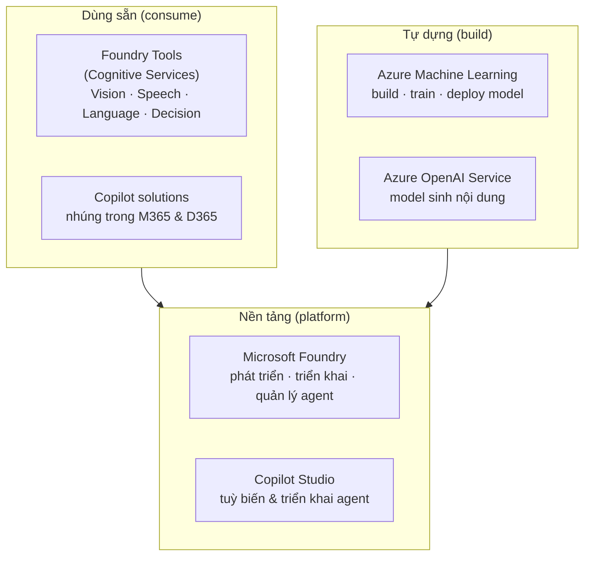
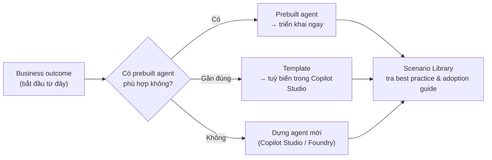

# Note 02 — Bản đồ công nghệ AI Microsoft & agent dựng sẵn (OOB)

> [!summary] TL;DR
> Bốn unit còn lại của module nhập môn vẽ **bản đồ công nghệ**: **Azure AI services** (API dựng sẵn cho Vision/Speech/Language/Decision) · **Azure Machine Learning** (dựng-huấn luyện-triển khai model ML) · **Azure OpenAI Service** (model sinh nội dung) · **Microsoft Foundry** (nền tảng phát triển, triển khai, quản lý ứng dụng & agent AI) · **Copilot solutions** (AI nhúng sẵn trong Microsoft 365 và Dynamics 365) · **Copilot Studio** (tuỳ biến & triển khai agent). Phần đắt giá nhất là khái niệm **OOB — out-of-the-box** (dựng sẵn, dùng ngay): gồm **prebuilt agent** (agent làm sẵn), **template** (khuôn mẫu) và **scenario library** (thư viện kịch bản áp dụng), mang lại **3 lợi ích**: *Faster Deployment · Scalability · Compliance*. Quy tắc nghề nghiệp lặp lại ở mọi unit: **bắt đầu từ business outcome rồi mới chọn công cụ**, và **ưu tiên prebuilt agent để triển khai nhanh** trước khi nghĩ đến build từ đầu.

## 1. ⚠️ Bẫy tên gọi — nguồn dùng tên CŨ

Đây là điều phải xử lý **trước tiên**, vì nguồn AB-100 viết tên đã lỗi thời còn đề thi và portal thật thì dùng tên mới:

| Nguồn AB-100 viết | Tên **chính thức hiện tại** | Ghi chú |
|---|---|---|
| **Cognitive Services** | **Foundry Tools** | Chuỗi đổi tên: Azure Cognitive Services → Azure AI Services → **Foundry Tools** |
| **Azure Foundry** | **Microsoft Foundry** | Chuỗi đổi tên: Azure AI Studio → Azure AI Foundry → **Microsoft Foundry** |
| *(không nhắc)* | **Foundry Models** | Tên catalog model hiện tại |

> 🔎 **Ngoài nguồn** — bảng đổi tên ở trên đối chiếu với [[../AI-103/01-Microsoft-Foundry-Tong-quan-Plan-Prepare]] (bộ AI-103 viết từ giáo trình Foundry-era mới hơn). Đề AB-100 dùng thuật ngữ hiện hành, nên **khi thấy "Cognitive Services" trong đáp án thì đó thường là phương án nhiễu mang tên cũ**. Ngược lại, khi ôn từ file docx này thì hiểu "Cognitive Services" = "Foundry Tools".

`★ Insight ─────────────────────────────────────`
Đây không phải lỗi của người soạn giáo trình mà là hệ quả của việc Microsoft đổi tên ba lần trong ~2 năm. Với người ôn thi, giá trị nằm ở chỗ: **tên gọi là dạng câu hỏi rẻ tiền nhất trong đề** — thuộc chuỗi đổi tên thì được điểm không mất công suy luận. Bộ AI-103 trong vault đã ghi nhận đúng bẫy này khi một ảnh chụp portal lộ ra "Foundry Toolkit is the new name for AI Toolkit" trong lúc phần chữ của giáo trình vẫn viết tên cũ.
`─────────────────────────────────────────────────`

## 2. Bốn nhóm công nghệ AI của Microsoft

Bảng *Key components* xuất hiện **hai lần** trong giáo trình (unit 2 và unit 3) — dấu hiệu kiến thức bắt buộc:

| Component | Purpose (nguyên văn) | Diễn giải |
|---|---|---|
| **Cognitive Services** *(= Foundry Tools)* | Vision, Speech, Language, Decision APIs | **API dựng sẵn** cho 4 nhóm năng lực; không cần huấn luyện model |
| **Azure Machine Learning** | Build, train, deploy ML models | Nền tảng **tự dựng model** — dùng khi API dựng sẵn không đủ |
| **Azure OpenAI Service** | Generative AI for text and creativity | Truy cập model **sinh nội dung** (text, sáng tạo) |
| **Copilot Solutions** | Embedded AI for productivity | AI **nhúng sẵn** trong sản phẩm Microsoft, không phải thứ ta tự dựng |

Ngoài bảng, giáo trình còn kể thêm:
- **Azure Foundry** *(= Microsoft Foundry)* — *"a platform designed to develop, deploy, and management of AI applications and agents"* → nền tảng để **phát triển · triển khai · quản lý** ứng dụng và agent AI.
- **Copilot Studio** — cùng với Microsoft 365 và Foundry tạo thành bộ ba mang **"native AI throughout an organization"** (AI xuyên suốt tổ chức).

`★ Insight ─────────────────────────────────────`
Sơ đồ trên là cách tôi gom lại — giáo trình chỉ liệt kê phẳng. Trục **"dùng sẵn ↔ tự dựng ↔ nền tảng"** chính là trục ra quyết định của cả bộ AB-100: nó quay lại nguyên vẹn ở ma trận **build / buy / extend** ([[08-ROI-TCO-va-Build-Buy-Extend]]) và ở câu hỏi *"khi nào cần custom model?"* ([[05-Chien-luoc-Multi-Agent-va-Chon-nen-tang]]). Học bản đồ theo trục này thì về sau không phải học lại.
`─────────────────────────────────────────────────`

## 3. Công cụ & SDK

| Công cụ | Dùng để |
|---|---|
| **Azure Machine Learning Studio** | Giao diện **trực quan** để phát triển & triển khai model |
| **SDKs and APIs** | Có ở **nhiều ngôn ngữ**, để nhúng AI vào ứng dụng |
| **CLI and REST APIs** | **Tự động hoá** và tích hợp vào luồng công việc doanh nghiệp |

> 💡 Ba dòng này ánh xạ đúng ba tình huống: **prototyping bằng tay** (Studio) → **nhúng vào app** (SDK) → **tự động hoá / CI-CD** (CLI + REST). Đây cũng là cách [[../AI-103/01-Microsoft-Foundry-Tong-quan-Plan-Prepare]] phân biệt Foundry portal vs Foundry SDK.

## 4. Copilot solutions — AI nhúng sẵn

Copilot là **AI nhúng trong Microsoft 365 và Dynamics 365**, làm ba việc:

1. **Tự động hoá tác vụ lặp lại** (automates repetitive tasks)
2. **Sinh nội dung và thông tin chi tiết** (generates content and insights)
3. **Cải thiện cộng tác giữa các nhóm** (enhances collaboration across teams)

Giá trị nghiệp vụ: **streamline workflows** (làm mượt luồng việc) và **improve efficiency** (tăng hiệu quả).

Ba best practice để tạo giá trị nghiệp vụ:
- **Start with measurable business outcomes** — bắt đầu từ kết quả nghiệp vụ **đo được**.
- **Implement with AI responsibly in mind** — 6 nguyên tắc Responsible AI (xem [[01-Vai-tro-AI-Solution-Architect]] §7).
- **Use cloud scalability for enterprise-wide adoption** — dựa vào khả năng mở rộng của cloud để áp dụng toàn doanh nghiệp.

## 5. OOB — out-of-the-box AI agent resources

**OOB (out-of-the-box)** = "dựng sẵn, mở hộp ra là dùng được". Đây là khái niệm trung tâm của unit 4-5, và là **điểm khởi đầu mặc định** khi thiết kế giải pháp agentic: *"help organizations quickly implement AI capabilities **without starting from scratch**"* — giúp tổ chức triển khai nhanh mà **không phải làm lại từ đầu**.

### 5.1 Ba loại tài nguyên OOB

| Tài nguyên | Purpose (nguyên văn) | Nghĩa |
|---|---|---|
| **Prebuilt Agents** | Automate common business workflows | Agent **làm sẵn** cho luồng nghiệp vụ phổ biến |
| **Copilot Studio** | Customize and deploy AI agents | Nơi **tuỳ biến và triển khai** agent |
| **Azure AI Services** *(= Foundry Tools)* | Vision, Speech, Language, Decision capabilities | Năng lực AI nền |
| **Scenario Library** | Best practices and adoption guides | **Thư viện kịch bản** — hướng dẫn áp dụng & best practice |

Bên cạnh đó có **Templates** (khuôn mẫu): *"ready-to-use templates for creating custom agents"* — khuôn mẫu sẵn sàng dùng để **tạo agent tuỳ biến**. Lưu ý sắc thái: template không phải agent hoàn chỉnh, nó là **điểm bắt đầu để tuỳ biến**.

### 5.2 Prebuilt agent nằm ở đâu, làm gì

- **Ở đâu:** qua **Microsoft Copilot Studio**, tích hợp sẵn vào **Dynamics 365** và **Microsoft 365**.
- **Cho kịch bản nào:** ba nhóm được nhắc lặp lại — **customer service automation** (tự động hoá dịch vụ khách hàng) · **sales automation / workflow optimization** (tối ưu luồng việc) · **data-driven decision-making** (ra quyết định dựa trên dữ liệu).

> Danh mục cụ thể từng agent dựng sẵn theo sản phẩm (D365 Customer Service, M365 Copilot for Sales / for Service, Power Platform AI hub…) nằm ở [[16-Orchestrate-Prebuilt-Agents-va-Apps]].

### 5.3 Ba lợi ích của OOB agent

| Lợi ích | Nguyên văn | Nghĩa |
|---|---|---|
| **Faster Deployment** | Reduce development time with ready-to-use agents | Giảm **thời gian phát triển** |
| **Scalability** | Built to integrate with Microsoft 365 and Dynamics 365 | Được **thiết kế sẵn để tích hợp** với M365 và D365 |
| **Compliance** | Align with Microsoft's Responsible AI standards | Bám sẵn **chuẩn Responsible AI** của Microsoft |

`★ Insight ─────────────────────────────────────`
Lợi ích thứ ba là cái hay bị bỏ qua nhưng lại quan trọng nhất với vai trò architect: dùng OOB agent nghĩa là **thừa hưởng luôn phần tuân thủ** mà Microsoft đã làm sẵn. Tự dựng agent từ đầu thì phần Responsible AI, content filter, audit trail… **ta phải tự chịu trách nhiệm** — đó chính là chi phí ẩn mà cụm Deploy (40-45% đề) đào sâu ở [[23-Bao-mat-Agent-Model-va-Access-Control]] và [[24-Governance-Data-Residency-va-Responsible-AI]]. Nói cách khác: câu *"build hay buy?"* không chỉ là câu hỏi tiền bạc, nó là câu hỏi **ai gánh nghĩa vụ tuân thủ**.
`─────────────────────────────────────────────────`

### 5.4 Bốn best practice khi dùng OOB agent

Bộ này lặp **nguyên văn ở cả unit 4 và unit 5** — gần như chắc chắn được hỏi:

1. **Start with business outcomes before selecting tools** — xác định kết quả nghiệp vụ **trước khi** chọn công cụ.
2. **Use prebuilt agents for quick deployment** — ưu tiên agent dựng sẵn để triển khai nhanh.
3. **Ensure responsible AI principles** — bảo đảm 6 nguyên tắc Responsible AI.
4. **Use Azure AI for scalability and compliance** — dùng Azure AI cho khả năng mở rộng & tuân thủ.

## Q&A phỏng vấn

> [!question] "Khách hàng muốn một agent chăm sóc khách hàng. Anh bắt đầu từ đâu?"
> Không bắt đầu từ việc chọn Copilot Studio hay Foundry. Bắt đầu từ **business outcome đo được** — giảm bao nhiêu phần trăm thời gian xử lý ticket, tăng bao nhiêu điểm hài lòng. Sau đó mới rà xem có **prebuilt agent** nào phủ được kịch bản này không; nếu gần đúng thì lấy **template** rồi tuỳ biến trong Copilot Studio; chỉ khi cả hai đều không phù hợp mới dựng từ đầu. Song song đó tra **Scenario Library** để lấy adoption guide thay vì tự nghĩ ra quy trình triển khai.

> [!question] "Phân biệt Azure Machine Learning và Azure OpenAI Service."
> **Azure Machine Learning** là nền tảng để **tự dựng model** — build, train, deploy — dùng khi bài toán cần model riêng của tổ chức. **Azure OpenAI Service** là nơi **truy cập model sinh nội dung có sẵn** cho tác vụ ngôn ngữ tự nhiên và sáng tạo. Một bên là xưởng sản xuất model, một bên là cửa hàng model dựng sẵn.

> [!question] "OOB agent có nhược điểm gì không?"
> Có. Nó nhanh và thừa hưởng sẵn phần tuân thủ, nhưng **bị giới hạn ở các kịch bản phổ biến**. Khi nghiệp vụ có luồng riêng, dữ liệu chuyên ngành, hoặc yêu cầu tuân thủ đặc thù thì phải mở rộng bằng template hoặc dựng agent tuỳ biến. Đây đúng là trục ra quyết định **build / buy / extend** mà đề hỏi rất kỹ.

> [!question] "Tại sao trong tài liệu chỗ thì gọi Cognitive Services, chỗ thì Foundry Tools?"
> Vì Microsoft đã đổi tên hai lần: **Azure Cognitive Services → Azure AI Services → Foundry Tools**. Tương tự **Azure AI Studio → Azure AI Foundry → Microsoft Foundry**. Tài liệu soạn ở thời điểm khác nhau nên còn lẫn tên cũ; nội dung thì không đổi.

## Tự kiểm tra

1. Kể **4 component** trong bảng *Key components* cùng purpose của mỗi cái.
2. **Cognitive Services** ngày nay tên là gì? Chuỗi đổi tên đầy đủ?
3. **OOB** viết tắt của gì? Kể **3 loại tài nguyên OOB** và **3 lợi ích**.
4. Phân biệt **prebuilt agent** và **template**.
5. **Scenario Library** chứa gì?
6. Ba nhóm kịch bản nghiệp vụ mà prebuilt agent nhắm tới?
7. Best practice số 1 khi dùng OOB agent là gì — và vì sao nó đứng trước việc chọn công cụ?

## Liên quan
- [[00-MOC-AB100]] — MOC bộ AB-100
- [[01-Vai-tro-AI-Solution-Architect]] — vai trò architect & 6 nguyên tắc Responsible AI
- [[05-Chien-luoc-Multi-Agent-va-Chon-nen-tang]] — chọn giữa M365 Copilot ↔ Copilot Studio ↔ Foundry
- [[08-ROI-TCO-va-Build-Buy-Extend]] — ma trận build / buy / extend
- [[16-Orchestrate-Prebuilt-Agents-va-Apps]] — danh mục agent dựng sẵn theo sản phẩm
- [[../AI-103/01-Microsoft-Foundry-Tong-quan-Plan-Prepare]] — Microsoft Foundry & Foundry Tools, bản kỹ thuật
