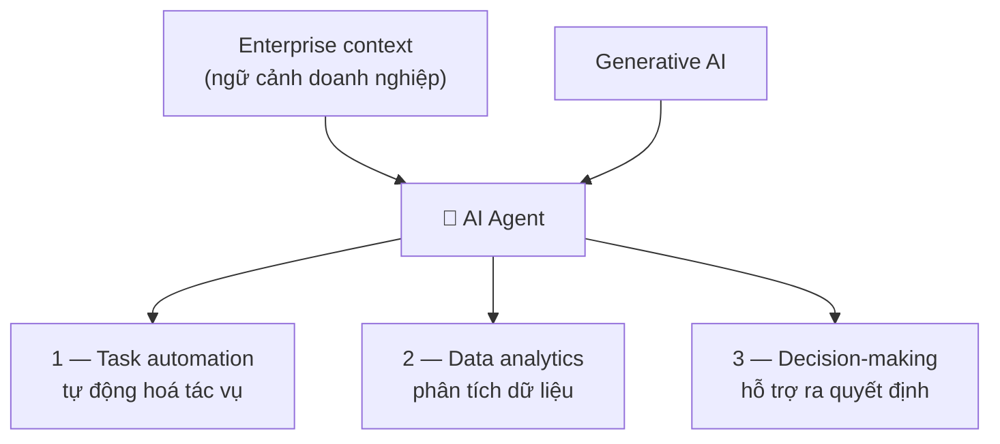
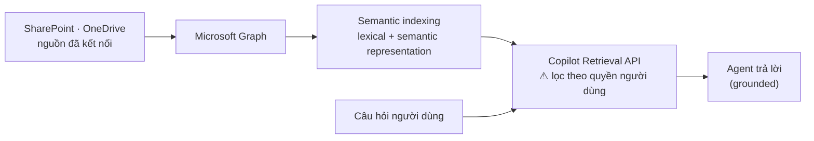
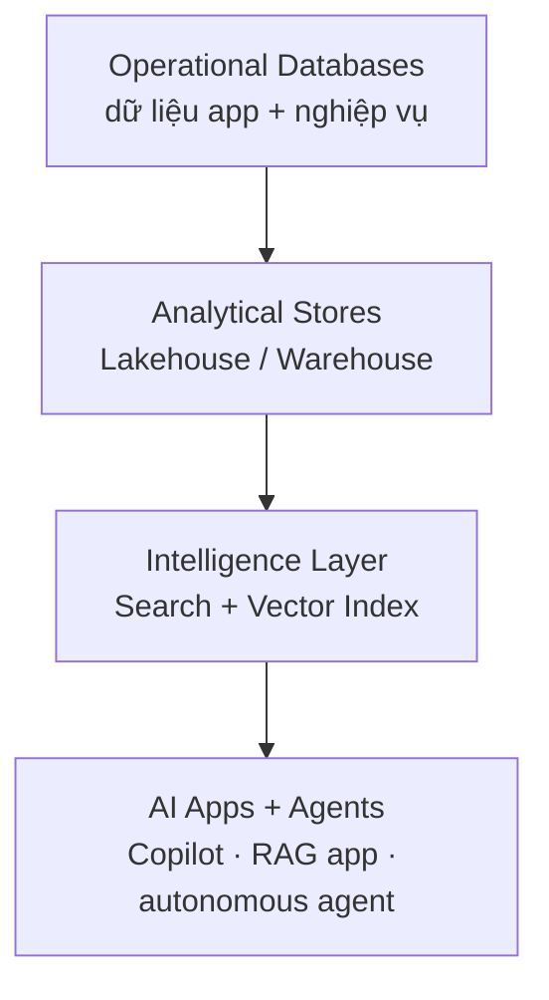

# Note 03 — Phân tích yêu cầu & dữ liệu grounding

> [!summary] TL;DR
> Mục kỹ năng đầu tiên của cụm **Plan (25–30%)**. Ba việc phải làm: **(1) đánh giá xem agent thêm giá trị ở đâu** — ba mảng *task automation · data analytics · decision-making*; **(2) rà chất lượng dữ liệu grounding theo đúng 5 chiều** — **Accuracy · Relevance · Timeliness · Cleanliness · Availability** (thuộc lòng, đề hỏi trực tiếp); **(3) tổ chức dữ liệu nghiệp vụ** để nhiều hệ AI cùng dùng lại được.
> **Grounding** (neo dữ liệu) = bắt agent trả lời **dựa trên dữ liệu tổ chức đã được tin cậy và phân quyền**, thay vì bịa từ kiến thức trong model. Hai công nghệ đỡ phía dưới: **semantic indexing** (đánh chỉ mục ngữ nghĩa — ánh xạ nội dung doanh nghiệp trong Microsoft Graph thành biểu diễn từ vựng + ngữ nghĩa) và **Copilot Retrieval API** (lấy đoạn văn liên quan từ SharePoint/OneDrive, **tôn trọng quyền của từng người dùng**).
> Nguyên tắc bao trùm: *"dùng agent để giảm việc lặp lại, **không phải để thay tư duy phản biện**"*.

## 1. Agent thêm giá trị ở đâu — ba mảng

Câu định nghĩa gốc cần thuộc: agent **"automate routine tasks, deliver data-driven insights, and support decision-making by integrating enterprise context with generative AI capabilities"** — điểm mấu chốt là **kết hợp ngữ cảnh doanh nghiệp VỚI năng lực GenAI**. Thiếu vế ngữ cảnh doanh nghiệp thì chỉ còn là một chatbot.

### 1.1 Task automation — tự động hoá tác vụ

Bốn năng lực chính:
- **Soạn thảo** tài liệu, email, phản hồi **dựa trên ngữ cảnh**.
- **Tóm tắt** khối lượng lớn dữ liệu — email, cuộc họp, chat.
- **Tự động hoá luồng việc** qua Microsoft 365, Copilot Studio, Microsoft Foundry, Power Platform.
- **Kích hoạt quy trình nhiều bước** (phê duyệt, thông báo, sinh nội dung).

Tác dụng: **giảm cognitive load** (tải nhận thức) để người ta tập trung vào việc chiến lược thay vì việc lặp.

Bảng ví dụ gốc — nhớ **cặp lĩnh vực ↔ công cụ**, đề hay tráo công cụ:

| Task Area | Agent giúp gì | Công cụ |
|---|---|---|
| **Communication** | Soạn email, tóm tắt luồng Teams, tạo bản tóm tắt cuộc họp | Microsoft 365 Copilot |
| **Documentation** | Sinh bản nháp báo cáo đầu tiên, viết lại / tối ưu nội dung | Word, OneNote, Loop, Microsoft 365 Copilot |
| **Process Automation** | Kích hoạt workflow và tác vụ nhiều bước | **Copilot Studio, Power Automate** |
| **Knowledge Retrieval** | Trả lời câu hỏi bằng dữ liệu doanh nghiệp | **Copilot Search, Graph grounding** |

### 1.2 Data analytics — phân tích dữ liệu

Agent **biến câu hỏi bằng ngôn ngữ tự nhiên thành câu trả lời có giá trị**. Bốn năng lực:
- Tóm tắt tập dữ liệu phức tạp thành **actionable insight** (hiểu biết hành động được).
- Phát hiện **xu hướng, giá trị bất thường (outlier), mẫu hình**.
- **Sinh biểu đồ theo yêu cầu**.
- **Diễn giải dashboard** và gợi ý bước tiếp theo.

> 💡 Giá trị nghiệp vụ của mảng này: nhân viên **hiểu được dữ liệu mà không cần kỹ năng phân tích nâng cao** — tức là mở rộng số người dùng được dữ liệu, chứ không phải làm nhà phân tích chạy nhanh hơn.

### 1.3 Decision-making — hỗ trợ ra quyết định

Bốn loại đầu vào mà AI cung cấp cho quyết định:
- **Khuyến nghị kịch bản** dựa trên dữ liệu lịch sử.
- **Nhận diện rủi ro** qua nhận dạng mẫu hình.
- **Tóm tắt bối cảnh nghiệp vụ** từ tài liệu, cuộc họp, tập dữ liệu.
- **Khuyến nghị có hậu thuẫn bởi tri thức doanh nghiệp**.

Kết quả: lãnh đạo **khám phá phương án thay thế, đánh giá tác động, và ra quyết định nhanh hơn với sự tự tin cao hơn**.

`★ Insight ─────────────────────────────────────`
Để ý cách dùng từ của giáo trình ở mảng 3: **"support"**, **"enable leaders to explore"**, **"recommendations"** — luôn là *hỗ trợ*, không bao giờ là *thay thế*. Đây không phải văn phong lịch sự mà là **ranh giới thiết kế**: agent đưa đầu vào cho quyết định, con người vẫn giữ quyền quyết. Đề AB-100 khai thác đúng chỗ này — mọi phương án chứa từ *"replacing all…"*, *"fully autonomous"*, *"eliminating the need for…"* đều là **nhiễu**. Câu 1 Module assessment của module này chính là dạng đó: đáp án đúng là *"Drafting content and summarizing information using generative AI"*, ba phương án sai đều hứa hẹn **thay thế hoàn toàn** con người hoặc **bỏ luôn** ngữ cảnh nghiệp vụ.
`─────────────────────────────────────────────────`

### 1.4 Năm best practice khi dùng AI agent

1. **Bắt đầu từ business outcome** muốn cải thiện.
2. **Dùng tự động hoá để giảm việc lặp lại, KHÔNG phải để thay tư duy phản biện** (*"not replace critical thinking"*).
3. Giữ **6 nguyên tắc Responsible AI**.
4. **Giám sát hiệu năng và tinh chỉnh** prompt, workflow, và **dữ liệu đầu vào**.
5. **Đào tạo đội ngũ** để dùng Copilot hiệu quả.

## 2. Grounding — neo agent vào dữ liệu tin cậy

### 2.1 Grounding là gì và vì sao cần

**Grounding** bảo đảm agent **trả lời bằng dữ liệu tổ chức đã được tin cậy, mang tính chuyên ngành** → tăng độ chính xác, giảm thông tin sai. Hệ thống AI phải được nối tới dữ liệu **đã duyệt và có kiểm soát truy cập** để đầu ra vừa đáng tin vừa **tôn trọng ranh giới bảo mật của tổ chức**.

Hai công nghệ đỡ phía dưới:

| Công nghệ | Làm gì |
|---|---|
| **Semantic indexing** (đánh chỉ mục ngữ nghĩa) | Copilot & Copilot Studio ánh xạ nội dung doanh nghiệp **xuyên Microsoft Graph** thành **biểu diễn từ vựng (lexical) và ngữ nghĩa (semantic)** phong phú → truy hồi chính xác theo ngữ cảnh hơn |
| **Copilot Retrieval API** | Lấy **đoạn văn bản liên quan** từ **SharePoint, OneDrive** và các nguồn đã kết nối, **tôn trọng quyền của người dùng** |

> ⚠️ Câu 3 Module assessment hỏi thẳng vai trò của semantic indexing → **"Mapping enterprise content for precise data retrieval"**. Các phương án nhiễu (tuỳ biến giao diện, quản lý danh sách email, tự động hoá giao dịch tài chính) không liên quan gì tới truy hồi.

### 2.2 Năm chiều chất lượng dữ liệu grounding ⭐

Đây là **bảng phải thuộc** của cả module — đề hỏi trực tiếp bằng cách mô tả một tình huống rồi bắt chọn đúng tên chiều:

| Chiều | Định nghĩa | Tác động lên agent |
|---|---|---|
| **Accuracy** (chính xác) | Dữ liệu **đúng và đã được kiểm chứng** | Giảm thông tin sai lệch |
| **Relevance** (liên quan) | Dữ liệu **khớp với tác vụ / ý định** | Bảo đảm câu trả lời đúng kịch bản đang xét |
| **Timeliness** (kịp thời) | Dữ liệu **mới, còn hiệu lực** | Giữ đầu ra bám chính sách/thông tin mới nhất |
| **Cleanliness** (sạch) | Dữ liệu **có cấu trúc, không nhiễu** | Tăng **độ chính xác truy hồi** (retrieval precision) |
| **Availability** (khả dụng) | Dữ liệu **truy cập & đánh chỉ mục được** | Bảo đảm agent grounding được **theo đúng quyền** |

Chi tiết từng chiều — phần này chứa các dấu hiệu nhận biết mà đề hay dùng làm mô tả tình huống:

| Chiều | Dấu hiệu / thành phần cụ thể |
|---|---|
| **Accuracy** | Được **SME** (Subject Matter Expert — chuyên gia lĩnh vực) kiểm chứng · khớp nguồn có thẩm quyền · không còn lỗi hay giả định lỗi thời |
| **Relevance** | Nếu dữ liệu không liên quan, **semantic search có thể lấy về nội dung "giống về mặt khái niệm nhưng sai ngữ cảnh"** |
| **Timeliness** | Ngày sửa đổi · cập nhật theo mùa vụ / theo yêu cầu tuân thủ · **lịch làm mới dữ liệu**. Semantic index của M365 **tự cập nhật liên tục** khi nội dung đổi |
| **Cleanliness** | Cấu trúc rõ · **không trùng lặp** · metadata thừa tối thiểu · định dạng ổn định, bố cục đoán được. Dữ liệu sạch **cải thiện chất lượng embedding** |
| **Availability** | Lưu ở SharePoint/OneDrive hoặc hệ thống đã kết nối · **được đánh chỉ mục đúng trong Microsoft Graph** · kiểm soát truy cập rõ ràng |

**Data Pollution** (ô nhiễm dữ liệu) — thuật ngữ riêng của giáo trình, gắn với chiều *Cleanliness*: sự **suy giảm chất lượng dữ liệu làm ảnh hưởng xấu tới hiệu năng và độ tin cậy của hệ thống AI**.

`★ Insight ─────────────────────────────────────`
Hai chiều dễ nhầm nhất là **Relevance** và **Accuracy**. Mẹo phân biệt bằng câu hỏi: *"Dữ liệu này có ĐÚNG không?"* → **Accuracy**. *"Dữ liệu này có đúng CHỖ không?"* → **Relevance**. Một tài liệu chính sách nghỉ phép năm 2019 hoàn toàn **accurate** (nó đúng là chính sách năm 2019) nhưng **không timely**; một tài liệu chính sách nghỉ phép của công ty con ở nước khác thì accurate và timely nhưng **không relevant** với câu hỏi của nhân viên trụ sở chính. Câu 2 Module assessment hỏi chiều nào bảo đảm agent lấy được thông tin **"matches the intended business scenario"** → **Relevance**.
Chiều **Availability** cũng có sắc thái riêng dễ mất điểm: nó **không** nói về việc dữ liệu có tồn tại hay không, mà về việc **người dùng cụ thể đó có quyền đọc hay không** — *"Agents can only ground responses from data the user has access to"*. Đây là móc nối thẳng sang bảo mật ở [[23-Bao-mat-Agent-Model-va-Access-Control]].
`─────────────────────────────────────────────────`

### 2.3 Năm best practice khi rà dữ liệu grounding

1. **Đánh giá chất lượng nội dung TRƯỚC khi upload** — gỡ thông tin lỗi thời hoặc mâu thuẫn.
2. **Lưu nội dung có thẩm quyền vào SharePoint/OneDrive** để nó lọt vào semantic index.
3. **Định dạng nhất quán** để tăng độ sạch và độ chính xác truy hồi.
4. **Rà quyền định kỳ** để agent chỉ grounding từ nguồn hợp lệ.
5. **Phối hợp với SME** để kiểm chứng độ chính xác và độ phù hợp ngữ cảnh.

## 3. Tổ chức dữ liệu nghiệp vụ cho hệ AI

### 3.1 Vì sao

Mọi hệ AI — **Copilot, autonomous agent, hay ứng dụng AI tự dựng** — đều cần dữ liệu **chất lượng cao, có cấu trúc, truy cập được**. Dữ liệu tổ chức kém dẫn tới **grounding yếu, thông tin sai, vấn đề chất lượng dữ liệu, và ra quyết định không đáng tin**.

Dữ liệu được cấu trúc đúng thì dùng lại được cho **5 nhóm tiêu thụ**:
Copilot for Microsoft 365 · agent dựng trong Copilot Studio · ứng dụng AI tự dựng bằng Azure AI · **pipeline RAG** · giải pháp phân tích & tự động hoá.

> 🔤 **RAG** (Retrieval Augmented Generation — sinh nội dung có tăng cường truy hồi): kiến trúc **tách nguyên mẫu khỏi hệ thống đáng tin cậy**. Một **RAG pipeline** là hệ thống thực hiện toàn bộ các bước để RAG chạy được trong môi trường sản xuất: *ingestion (nạp) · streaming · cleaning (làm sạch) · chunking (cắt đoạn) · embedding (nhúng vector) · indexing (đánh chỉ mục) · retrieval (truy hồi) · prompt assembly (ghép prompt) · orchestration (điều phối) · monitoring (giám sát)*. Ba lợi ích: **cho LLM truy cập dữ liệu thời gian thực · giữ riêng tư dữ liệu · giảm thông tin sai của LLM**.
>
> ⚠️ Nguồn có **lỗi đánh máy viết tắt RAG thành "REG"** ở đoạn này — không phải thuật ngữ mới.
> 📖 Chi tiết kỹ thuật từng bước của pipeline RAG đã viết sâu ở [[../../../04-AI/01-AI-Fundamentals-RAG/00-MOC-AI-Fundamentals-RAG]]; ở AB-100 chỉ cần góc nhìn architect: **RAG là một trong 5 nhóm tiêu thụ dữ liệu**, nên dữ liệu phải được tổ chức để phục vụ cả 5 chứ không riêng nó.

### 3.2 Azure Data Estate cho AI — 4 tầng

**Data estate** (điền sản dữ liệu) = toàn bộ hệ sinh thái dữ liệu tích hợp của tổ chức. Bảng gốc:

| Tầng | Mục đích |
|---|---|
| **Operational Databases** | Lưu dữ liệu ứng dụng + nghiệp vụ **có cấu trúc** |
| **Analytical Stores** (Lakehouse / Warehouse) | Chuẩn bị dữ liệu **đã curate** cho AI/ML |
| **Intelligence Layer** (Search + Vector Index) | Cho phép **grounding, retrieval, semantic search** |
| **AI Apps + Agents** | Copilot, ứng dụng RAG tự dựng, autonomous agent |

Bốn khái niệm nền của nền tảng Azure:
- **Unified data estate** — hợp nhất dữ liệu từ app, log, CRM, ERP, vận hành, tài liệu.
- **Modern data services** — Azure Cosmos DB, Azure SQL, Azure PostgreSQL, **Fabric Lakehouse**.
- **Intelligence layers** — Azure AI Search, **semantic ranking**, embeddings, **vector search**.
- **Interoperability** — API, event hub, data streaming để **nhiều hệ AI cùng dùng một nguồn dữ liệu**.

### 3.3 Kiến trúc dữ liệu cho agent theo Cloud Adoption Framework — 5 thành phần

| Thành phần | Nội dung |
|---|---|
| **Centralized knowledge sources** | SharePoint, OneDrive, **Dataverse**, Azure Storage |
| **Semantic indexing** | Chuyển nội dung doanh nghiệp thành biểu diễn ngữ nghĩa để grounding |
| **Data governance layer** | Truy cập theo vai trò (RBAC), **sensitivity label** (nhãn độ nhạy), **Microsoft Purview** |
| **APIs and connectors** | Bảo đảm agent chạm được cả dữ liệu **có cấu trúc lẫn phi cấu trúc** |
| **RAG-ready architecture** | Vector store, embedding model, retrieval pipeline |

> Khung CAF đầy đủ (6 pha Strategy → Manage, ánh xạ với vòng đời agent) nằm ở [[04-CAF-cho-AI-va-Vong-doi-Agent]].

### 3.4 Làm database "AI-ready"

| Công nghệ | Năng lực AI dựng sẵn |
|---|---|
| **Azure SQL** | Hỗ trợ **dữ liệu vector**, semantic search, lưu **JSON** |
| **Cosmos DB** | **Độ trễ thấp** cho app AI, **vector search gốc** |
| **PostgreSQL on Azure** | Hỗ trợ **extension ML** và embeddings |
| **Fabric** | Nền tảng phân tích **hợp nhất** cho workload AI |

Bốn use case: lưu embedding cho app RAG · quản lý nội dung có + không cấu trúc · hỗ trợ **quyết định thời gian thực** của agent · xử lý **giao dịch khối lượng lớn** mà autonomous agent cần.

### 3.5 Sáu best practice tổ chức dữ liệu

| # | Best practice | Chi tiết |
|---|---|---|
| 1 | **Centralize** — tập trung hoá | Dùng Azure, **Dataverse**, hoặc Fabric để tránh **data silo** (ốc đảo dữ liệu rời rạc) |
| 2 | **Normalize & structure** | Chuẩn hoá **schema, cách đặt tên, metadata, taxonomy** |
| 3 | **Use semantic indexing** | M365 Copilot **bắt buộc** có semantic indexing mới grounding đúng |
| 4 | **Provide multiple access paths** | Mở dữ liệu qua **API · search index · RAG pipeline · Graph connector · SQL endpoint** |
| 5 | **Implement governance early** | **Purview** cho: access policy · sensitivity label · **lineage** (dấu vết nguồn gốc) · data quality rule |
| 6 | **Keep data authoritative & updated** | Timeliness là thiết yếu |

`★ Insight ─────────────────────────────────────`
Best practice số 4 — **"multiple access paths"** — là điểm phân biệt tư duy architect với tư duy developer. Developer hỏi *"agent của tôi đọc dữ liệu này kiểu gì?"*; architect hỏi *"làm sao để **mọi** hệ AI trong tổ chức, kể cả hệ chưa tồn tại, đều đọc được nguồn dữ liệu này?"*. Đó cũng là lý do tên unit là *"Organize business solution data **for AI systems**"* (số nhiều) chứ không phải "for your agent". Câu 4 Module assessment hỏi vì sao phải tập trung hoá và cấu trúc dữ liệu **trước khi** triển khai agent → *"To ensure AI systems can access high-quality, reliable data"*.
Best practice số 5 — **governance sớm** — cũng đáng chú ý: đề có phương án nhiễu *"To eliminate the need for data governance"*, đúng ngược lại. Tổ chức dữ liệu tốt **làm governance khả thi**, không phải làm nó thừa.
`─────────────────────────────────────────────────`

## Q&A phỏng vấn

> [!question] "Grounding là gì và vì sao nó quan trọng?"
> Grounding là việc neo câu trả lời của agent vào **dữ liệu tổ chức đã được tin cậy và phân quyền**, thay vì để model tự trả lời từ kiến thức huấn luyện. Quan trọng vì hai lý do: **độ chính xác** (giảm thông tin bịa) và **bảo mật** (đầu ra tôn trọng ranh giới quyền truy cập của tổ chức). Trong hệ Microsoft, grounding chạy trên **semantic index** của Microsoft Graph và **Copilot Retrieval API** — API này lọc theo quyền, nên hai người hỏi cùng một câu có thể nhận hai câu trả lời khác nhau, và **đó là đúng thiết kế**.

> [!question] "Agent trả lời sai. Anh rà theo trình tự nào?"
> Rà theo **5 chiều chất lượng grounding**, vì mỗi chiều hỏng cho một kiểu sai khác nhau: dữ liệu **sai sự thật** → Accuracy; lấy về nội dung **giống nhưng lệch ngữ cảnh** → Relevance; trả lời theo **chính sách cũ** → Timeliness; truy hồi **lấy nhầm bản trùng lặp / nhiễu** → Cleanliness; trả lời **"không tìm thấy"** dù tài liệu tồn tại → Availability (thường là vấn đề quyền hoặc chưa được index vào Graph). Xác định được chiều nào hỏng thì biết ngay phải sửa ở đâu.

> [!question] "Vì sao dữ liệu sạch lại làm agent trả lời tốt hơn — cơ chế là gì?"
> Vì dữ liệu sạch **cải thiện chất lượng embedding**. Nội dung có cấu trúc rõ, không trùng lặp, định dạng ổn định sẽ cho vector nhúng phản ánh đúng ngữ nghĩa hơn, nên bước truy hồi lấy về đúng đoạn cần. Ngược lại là **data pollution** — chất lượng dữ liệu suy giảm kéo theo hiệu năng và độ tin cậy của cả hệ AI.

> [!question] "Khách hàng bảo dữ liệu của họ nằm rải rác ở nhiều nơi nhưng vẫn muốn làm agent. Anh nói gì?"
> Nói thẳng là **grounding sẽ yếu và kết quả sẽ không đáng tin**. Việc phải làm trước là tập trung hoá vào Azure/Dataverse/Fabric, chuẩn hoá schema và metadata, bật semantic indexing, và **cài governance ngay từ đầu bằng Purview** thay vì để sau. Đây không phải yêu cầu kỹ thuật mà là **yêu cầu nghiệp vụ** — và nên mở nhiều đường truy cập (API, search index, RAG pipeline, Graph connector, SQL endpoint) để khoản đầu tư này phục vụ được cả những hệ AI sau này.

## Tự kiểm tra

1. Kể **5 chiều chất lượng dữ liệu grounding** và định nghĩa từng chiều.
2. Phân biệt **Accuracy** ↔ **Relevance** ↔ **Timeliness** bằng một ví dụ tài liệu chính sách.
3. **Semantic indexing** làm gì? **Copilot Retrieval API** khác nó ở chỗ nào?
4. Chiều **Availability** phụ thuộc vào 3 yếu tố nào?
5. **Data Pollution** là gì, gắn với chiều nào?
6. Kể **4 tầng** của Azure Data Estate cho AI theo đúng thứ tự.
7. **5 thành phần** kiến trúc dữ liệu cho agent theo Cloud Adoption Framework?
8. Kể **5 access path** để mở dữ liệu cho hệ AI.
9. Trong bảng ví dụ task automation, **Process Automation** dùng công cụ gì? **Knowledge Retrieval** dùng gì?
10. Vì sao mọi phương án trắc nghiệm chứa "replacing all manual processes with fully autonomous systems" đều sai?

## Liên quan
- [[00-MOC-AB100]] — MOC bộ AB-100
- [[02-Ban-do-cong-nghe-AI-Microsoft]] — bản đồ công nghệ & agent dựng sẵn
- [[04-CAF-cho-AI-va-Vong-doi-Agent]] — Cloud Adoption Framework đầy đủ
- [[13-Grounding-Power-Apps-va-Well-Architected]] — thiết kế luồng xử lý dữ liệu grounding ở mức giải pháp
- [[23-Bao-mat-Agent-Model-va-Access-Control]] — access control trên dữ liệu grounding
- [[24-Governance-Data-Residency-va-Responsible-AI]] — Purview, sensitivity label, data residency
- [[../../../04-AI/01-AI-Fundamentals-RAG/00-MOC-AI-Fundamentals-RAG]] — RAG pipeline, bản kỹ thuật chi tiết
