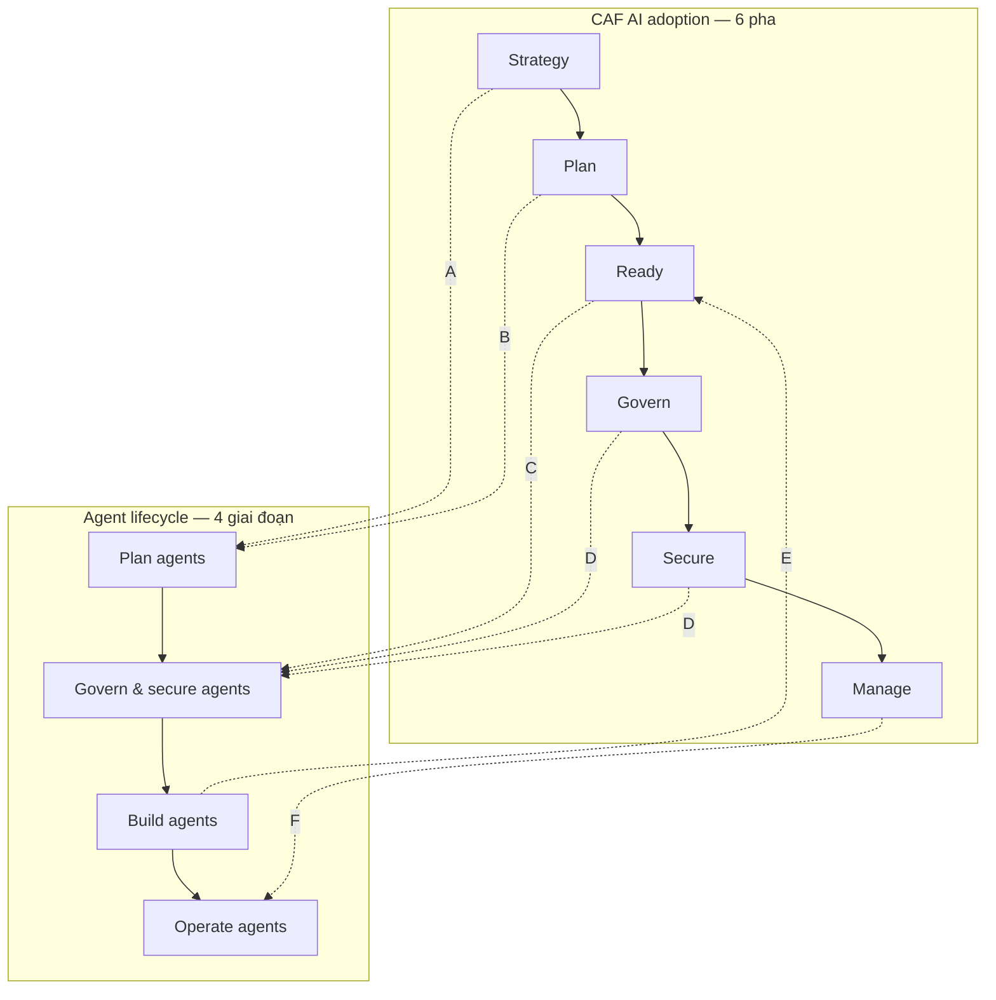
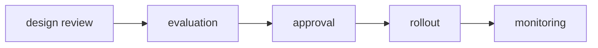

# Note 04 — Cloud Adoption Framework cho AI & vòng đời agent

> [!summary] TL;DR
> Nội dung cốt lõi: **hợp nhất hai khung** — **CAF** (Cloud Adoption Framework — khung áp dụng cloud của Microsoft) với **6 pha AI adoption**: *Strategy · Plan · Ready · Govern · Secure · Manage*; và **Agent lifecycle** (vòng đời agent) với **4 giai đoạn**: *Plan agents · Govern & secure agents · Build agents · Operate agents*.
> **Vì sao phải hợp nhất:** CAF cho **bộ khung xuyên suốt** (end-to-end backbone) và **guardrail** (lan can bảo vệ) nền tảng + vận hành; Agent Adoption guidance chồng thêm **operating model riêng cho agent**. Gộp lại thì **giảm rủi ro, chặn "agent sprawl" (agent mọc tràn lan không kiểm soát), và tăng tốc thu hoạch giá trị**.
> Hai khái niệm hạ tầng phải thuộc định nghĩa: **Azure enterprise landing zone** (môi trường cloud nhiều tài khoản, cấu hình sẵn, an toàn, mở rộng được — nền để triển khai workload) và **Azure data estate** (hệ sinh thái tích hợp toàn bộ tài sản dữ liệu, trải on-premises + cloud + hybrid).

## 1. Vì sao phải hợp nhất hai khung

| Khung | Vai trò | Đóng góp gì |
|---|---|---|
| **CAF AI adoption** *(rail trái)* | Bộ khung áp dụng **xuyên suốt** cho giải pháp AI trên Azure | Định nghĩa **foundations** (nền tảng) và **operational guardrails** (lan can vận hành) |
| **Agent lifecycle** *(rail phải)* | **Operating model** dành riêng cho agent | Định nghĩa cách các nhóm **lập kế hoạch · quản trị · xây · vận hành** agent trên toàn doanh nghiệp |

Ba lợi ích của việc gộp:
1. **Giảm rủi ro** (mitigates risks)
2. **Chặn agent sprawl** — hiện tượng agent được dựng khắp nơi, không ai nắm được có bao nhiêu cái, chạy bằng dữ liệu gì, ai sở hữu
3. **Tăng tốc value realization** — thu hoạch giá trị nhanh hơn

CAF còn **tích hợp với Well-Architected Framework và Azure Architecture Center** — nghĩa là ba tài liệu này bổ trợ nhau chứ không cạnh tranh.

`★ Insight ─────────────────────────────────────`
**"Agent sprawl"** là thuật ngữ đáng nhớ nhất của unit này, và là lý do tồn tại của cả cụm Deploy sau đó. Nó là phiên bản agentic của "VM sprawl" thời cloud đời đầu: khi việc dựng một agent dễ tới mức một người dùng nghiệp vụ tự làm được trong Copilot Studio buổi chiều, thì sau sáu tháng tổ chức có hàng trăm agent không ai biết. Hệ quả không phải là tốn tiền — mà là **không thể trả lời được câu hỏi kiểm toán**: agent nào đang đọc dữ liệu nhân sự? Cái nào còn dùng model đã bị deprecate? Đó là vì sao **governance phải được cài ở pha Ready, trước khi build**, chứ không phải dọn dẹp về sau.
`─────────────────────────────────────────────────`

## 2. Ánh xạ 6 pha CAF ↔ 4 giai đoạn vòng đời agent ⭐

Bảng ánh xạ đầy đủ — **cột "Outputs" là thứ đề hay hỏi** ("sản phẩm bàn giao của pha nào là…?"):

| Mã | CAF ⇄ Agent lifecycle | Mục tiêu | Outputs (sản phẩm bàn giao) |
|---|---|---|---|
| **A** | **AI strategy** ⇄ Plan agents | Ghi lại business outcome, xếp ưu tiên use case, chọn công nghệ AI Microsoft; quyết định **có nên dùng agent không** và nếu có thì **nền tảng nào (SaaS vs custom)** | **AI Strategy brief** + **Agent Technology Plan** (cây quyết định, chọn nền tảng, guardrail) |
| **B** | **AI plan** ⇄ Plan agents *(tiếp)* | Biến chiến lược thành **kế hoạch áp dụng hành động được**; chọn **starter project**; lấp lỗ hổng kỹ năng & nguồn lực | **AI adoption plan**, **PoC report**, **agent readiness assessment** |
| **C** | **AI ready** ⇄ Govern & secure agents *(nền)* | Lập **landing zone**, tổ chức tài nguyên, kết nối, **ranh giới quản trị AI**; đặt vai trò, chuẩn, quy trình phát triển agent | **AI landing zone**, policy assignment, **network segmentation**, **agent governance charter**, **data access model** |
| **D** | **Govern AI + Secure AI** ⇄ Govern & secure agents *(thực thi)* | **Thực thi** chính sách, giám sát rủi ro tổ chức, bảo mật nền tảng AI | **AI/agent policy set**, **risk register** (sổ rủi ro), security control cho **dữ liệu, model, endpoint** |
| **E** | **Build agents** ⇄ AI ready→adopt | Chuẩn hoá quy trình dựng agent giữa các nhóm; chặn **architecture drift** (kiến trúc trôi dạt) và lỗ hổng bảo mật | **Standard agent template**, **evaluation gate**, **environment strategy**, **CI/CD kèm policy guardrail** |
| **F** | **Manage AI** ⇄ Operate agents | Vận hành hoá workload AI và **đội hình agent (agent fleet)**: giám sát, kiểm soát chi phí, quy trình phát hành, liên tục kinh doanh | **AI operations baseline** (observability, incident response, báo cáo chi phí/sử dụng) + **Agent Ops playbook** (SLO, **retraining rule**, **deprecation**) |

### 2.1 Hoạt động then chốt theo pha

| Pha | Key activities cần nhớ |
|---|---|
| **A — Strategy** | Xác định use case **tác động cao**; định nghĩa **success metric đo được** và **giả thuyết ROI**; lập **technology plan** (SaaS agent vs Foundry/Copilot Studio) kèm đánh đổi **TCO/công sức** ban đầu; phác thảo chiến lược dữ liệu & Responsible AI bám tuân thủ |
| **B — Plan** | Đánh giá & **bổ sung kỹ năng AI**; tiếp cận tài nguyên AI; xếp ưu tiên use case; chạy **PoC**; định nghĩa **agent readiness criteria** — *data availability · governance readiness · identity model · connectors* |
| **C — Ready** | Dựng môi trường AI, chọn **reference architecture** và **design area**; dùng **Azure landing zone** để mở rộng; định nghĩa agent governance (chính sách về **truy cập năng lực, ranh giới dữ liệu, phê duyệt, giám sát**); chuẩn bị kiến trúc dữ liệu để agent chạy trên **nguồn có thẩm quyền và được quản trị** |
| **D — Govern & Secure** | Áp **governance dựa trên policy** (Azure Policy, platform baseline); tài liệu hoá & thực thi chính sách AI; giám sát rủi ro tổ chức; cài control cho **hành vi agent, truy cập dữ liệu, tuân thủ** (rà prompt/tool, **audit trail**, **escalation**) |
| **E — Build** | Đưa ra **hướng dẫn quy trình phát triển** cho Copilot Studio và Foundry — pattern: **knowledge tools · action tools · triggers · evaluations**; chọn dịch vụ nền tảng AI (**PaaS**) và bám reference architecture để khớp landing zone |
| **F — Manage/Operate** | Định nghĩa **deployment authority** trong ranh giới quản trị; cài **monitoring/telemetry và SLO**; lập agent operations: **rollout pattern, behavior monitoring, performance tuning, lifecycle management** |

> 🔤 **SLO** (Service Level Objective — mục tiêu mức dịch vụ): ngưỡng cam kết nội bộ về chất lượng dịch vụ, ví dụ "95% câu trả lời dưới 3 giây". Khác **SLA** (cam kết hợp đồng với khách hàng).
> 🔤 **Deprecation**: quy trình khai tử agent/model cũ có kế hoạch — phần thường bị quên cho tới khi trở thành nợ kỹ thuật.

`★ Insight ─────────────────────────────────────`
Để ý một chi tiết dễ trượt: **pha E (Build agents) chỉ ánh xạ ngược về "AI ready→adopt"**, nghĩa là trong CAF **không có một pha tên "Build"**. Điều này phản ánh đúng quan điểm của Microsoft: việc *dựng* agent không phải một pha áp dụng cloud riêng mà là **hoạt động thực thi bên trong nền tảng đã sẵn sàng**. Hệ quả thực tế cho architect: **nếu tổ chức bắt đầu bằng việc build agent trước khi có landing zone và governance charter, họ đang chạy pha E mà chưa có C** — đó chính là cơ chế sinh ra agent sprawl.
`─────────────────────────────────────────────────`

## 3. Bốn giai đoạn triển khai — hai nhóm

Giáo trình chia 6 pha thành **hai nhóm có bản chất khác nhau**:

| Nhóm | Pha | Đặc điểm |
|---|---|---|
| **Implementation** (làm một lần rồi có nền) | **Strategy & Planning** · **Ready & Foundations** | Định nghĩa business outcome, xếp ưu tiên use case, chọn công nghệ; lập landing zone, tổ chức tài nguyên, ranh giới quản trị agent, chuẩn bị kiến trúc dữ liệu |
| **Ongoing processes** (chạy mãi) | **Govern & Secure** · **Build & Operate** | Thực thi chính sách, giám sát rủi ro, control bảo mật riêng cho agent; chuẩn hoá quy trình dựng agent, dùng reference architecture, vận hành **agent fleet** với monitoring, cost control, lifecycle management |

## 4. Hai khái niệm hạ tầng — thuộc định nghĩa

| Khái niệm | Định nghĩa gốc |
|---|---|
| **Azure enterprise landing zone** | Môi trường cloud **nhiều tài khoản (multi-account)**, **cấu hình sẵn (pre-configured)**, **an toàn** và **mở rộng được**, cung cấp thiết lập nền tảng để triển khai workload |
| **Azure data estate** | Hệ sinh thái **toàn diện và tích hợp** các tài sản dữ liệu của tổ chức, trải **on-premises, cloud và hybrid**, được quản lý — bảo mật — phân tích bằng công cụ Azure |

> Cấu trúc 4 tầng của data estate cho AI (Operational DB → Analytical Stores → Intelligence Layer → AI Apps) đã viết ở [[03-Phan-tich-yeu-cau-va-Du-lieu-Grounding]] §3.2.

## 5. RACI — ai chịu trách nhiệm việc gì

**RACI** = **R**esponsible (người làm) · **A**ccountable (người chịu trách nhiệm cuối cùng) · **C**onsulted (người được hỏi ý kiến) · *(I = Informed, bảng gốc không dùng)*.

| Hoạt động | Solution Architect | Platform Team | Security & Compliance | Data/Knowledge Owner |
|---|---|---|---|---|
| Chọn chiến lược & use case | **A/R** | C | C | C |
| Agent tech plan (SaaS vs custom) | **A/R** | C | C | C |
| Landing zone & policies | C | **A/R** | C/R *(controls)* | C |
| Agent governance & SDLC | R | A | **A/R** *(policy)* | C |
| Build agents (Foundry/Studio) | **A/R** | R *(platform services)* | C | C/R *(grounding data)* |
| Operate agents & telemetry | **A/R** | R | C | C |

`★ Insight ─────────────────────────────────────`
Bảng RACI này là câu trả lời gọn nhất cho câu hỏi *"rốt cuộc solution architect làm gì?"* — **A/R ở 4/6 hoạt động**, và chỉ nhường quyền ở đúng hai chỗ: **landing zone & policies** (thuộc Platform Team) và **agent governance & SDLC** (thuộc Security & Compliance về mặt policy). Nói cách khác, architect **sở hữu chiến lược, thiết kế và vận hành**, nhưng **không sở hữu hạ tầng nền và không tự viết chính sách bảo mật**. Đây đúng là ranh giới mà đề hay kiểm tra bằng câu hỏi dạng "ai nên phê duyệt X?".
`─────────────────────────────────────────────────`

## 6. Bốn nhóm checklist hành động được

| Nhóm | Checklist |
|---|---|
| **Strategy & planning** | Kiểm kê use case kèm **kết quả định lượng** và success metric · quyết định nền tảng agent (SaaS vs custom) kèm **độ phù hợp chi phí/công sức** · đánh giá kỹ năng và kế hoạch **upskilling** (architect, data, security) |
| **Ready & foundations** | Landing zone với **management group tách workload nội bộ ↔ bên ngoài**, áp baseline policy · nền dữ liệu cho agent (nguồn có thẩm quyền, access model, **lineage**) |
| **Govern & secure** | Tài liệu hoá chính sách AI & agent; định nghĩa **phê duyệt, kiểm soát thay đổi, tiêu chí đánh giá** · cài bảo mật nền tảng cho **model, dữ liệu, key, endpoint**; duy trì **AI asset inventory đầy đủ** |
| **Build & operate** | Quy trình build agent chuẩn hoá + template + CI/CD; dùng reference architecture cho **PaaS AI** · **telemetry vận hành và SLO** cho cả workload lẫn agent; **runbook** chi phí và sự cố |

## 7. Bốn tạo tác trực quan nên có trong tài liệu kiến trúc

Giáo trình khuyến nghị bốn hình vẽ đi kèm — đáng nhớ vì mỗi cái tương ứng một mối quan tâm khác nhau:

| Tạo tác | Thể hiện điều gì |
|---|---|
| **Unified process map** | Ánh xạ CAF ⇄ agent lifecycle (chính là sơ đồ §2) |
| **Architecture block diagram** | Landing zone (management group, subscription **platform vs app**), Foundry resource, **Copilot Studio environment**, data estate với ranh giới quản trị |
| **Agent governance swimlane** | Vai trò (**Agent Owner · Platform · Security**) với các cổng: **design review → evaluation → approval → rollout → monitoring** |
| **Data readiness funnel** | *Nguồn có thẩm quyền → indexing/grounding → access control → lineage & chỉ số chất lượng* cho agent |

> Năm cổng của **agent governance swimlane** ở trên chính là bộ khung được triển khai chi tiết ở cụm Deploy: *evaluation* → [[19-Testing-Quy-trinh-Metrics-va-Validation]], *rollout* → [[21-ALM-cho-Du-lieu-va-Copilot-Studio]], *monitoring* → [[17-Khung-Giam-sat-va-Cong-cu]].

## Q&A phỏng vấn

> [!question] "Kể 6 pha AI adoption của Cloud Adoption Framework."
> **Strategy · Plan · Ready · Govern · Secure · Manage.** Ánh xạ sang vòng đời agent 4 giai đoạn: *Plan agents* (ứng với Strategy + Plan) · *Govern & secure agents* (ứng với Ready + Govern + Secure) · *Build agents* (thực thi bên trong nền tảng đã sẵn sàng) · *Operate agents* (ứng với Manage).

> [!question] "Agent sprawl là gì và anh chặn nó bằng cách nào?"
> Là tình trạng agent được dựng tràn lan khắp tổ chức mà không ai nắm được số lượng, quyền sở hữu, dữ liệu đang truy cập hay model đang dùng. Chặn bằng cách **cài governance ở pha Ready — trước khi build**: agent governance charter (vai trò, chuẩn, quy trình phát triển), chính sách về truy cập năng lực và ranh giới dữ liệu, quy trình phê duyệt, và **duy trì AI asset inventory đầy đủ**. Cộng thêm template agent chuẩn và CI/CD có policy guardrail để chặn architecture drift.

> [!question] "Sản phẩm bàn giao của pha AI Strategy là gì?"
> **AI Strategy brief** và **Agent Technology Plan** — bản sau gồm cây quyết định, lựa chọn nền tảng và guardrail. Ở pha kế tiếp (AI plan) mới có **AI adoption plan, PoC report, agent readiness assessment**.

> [!question] "Agent readiness criteria gồm những gì?"
> Bốn tiêu chí: **data availability** (dữ liệu có sẵn chưa), **governance readiness** (khung quản trị đã sẵn sàng chưa), **identity model** (mô hình định danh cho agent), và **connectors** (đã có kết nối tới hệ thống cần thiết chưa). Thiếu bất kỳ cái nào thì chưa nên chuyển từ PoC sang production.

> [!question] "Trong bảng RACI, ai Accountable cho landing zone?"
> **Platform Team** — không phải solution architect. Architect chỉ là *Consulted*. Ngược lại, architect là **A/R** cho chiến lược, agent tech plan, build agents và operate agents. Security & Compliance là **A/R** về mặt policy cho agent governance & SDLC.

## Tự kiểm tra

1. Kể **6 pha CAF** và **4 giai đoạn vòng đời agent**, rồi ánh xạ chúng với nhau.
2. Ba lợi ích của việc hợp nhất CAF với Agent Adoption guidance?
3. **Agent sprawl** là gì?
4. Pha nào sinh ra **agent governance charter**? Pha nào sinh ra **risk register**?
5. Định nghĩa **Azure enterprise landing zone** và **Azure data estate**.
6. Bốn **agent readiness criteria**?
7. Trong RACI, hoạt động nào solution architect **không** giữ vai trò A?
8. Năm cổng trong **agent governance swimlane** theo đúng thứ tự?
9. Phân biệt nhóm **Implementation** và **Ongoing processes** — pha nào thuộc nhóm nào?
10. **Agent Ops playbook** chứa những gì?

## Liên quan
- [[00-MOC-AB100]] — MOC bộ AB-100
- [[01-Vai-tro-AI-Solution-Architect]] — khung 5 giai đoạn chuyển đổi AI (bản rút gọn của CAF)
- [[03-Phan-tich-yeu-cau-va-Du-lieu-Grounding]] — kiến trúc dữ liệu cho agent, 4 tầng data estate
- [[05-Chien-luoc-Multi-Agent-va-Chon-nen-tang]] — quyết định SaaS vs low-code vs custom
- [[17-Khung-Giam-sat-va-Cong-cu]] — pha Operate: monitoring & telemetry
- [[21-ALM-cho-Du-lieu-va-Copilot-Studio]] — environment strategy & CI/CD với policy guardrail
- [[../../../06-DevOps/00-MOC-DevOps]] — nền CI/CD chung
