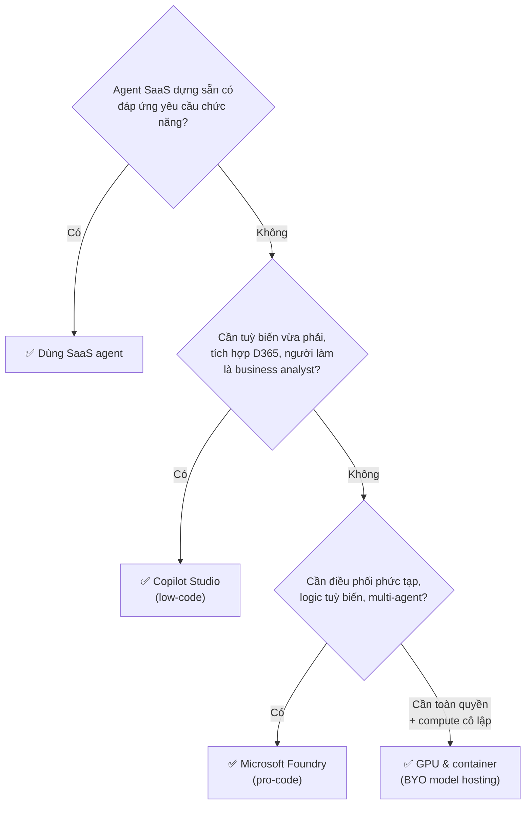

# Note 05 — Chiến lược multi-agent & chọn nền tảng

> [!summary] TL;DR
> Note "ra quyết định" trung tâm của cụm Plan. Bốn quyết định lớn, mỗi cái có một **nguyên tắc mặc định**:
> 1. **Loại agent?** — 3 bậc **SaaS (prebuilt) → Low-code (Copilot Studio) → Pro-code (Foundry / GPU & container)**. Nguyên tắc **SaaS agent first**: hỏi *"agent SaaS có đáp ứng yêu cầu chức năng không?"*; có thì dùng luôn, không thì mới leo bậc.
> 2. **Một agent hay nhiều agent?** — mặc định **single-agent**, chỉ lên multi-agent khi có **bằng chứng** (vượt ranh giới bảo mật/tuân thủ · nhiều team sở hữu tri thức & chu kỳ phát hành riêng · lộ trình rõ ràng mở rộng ra 3-5+ chức năng · nghiệp vụ đòi chuỗi hành động phụ thuộc nhau qua ≥2 luồng công việc).
> 3. **Mở rộng M365 Copilot hay dựng agent riêng?** — mặc định **extend Copilot** nếu tương tác chính diễn ra trong Word/Excel/Teams/Outlook và cần thừa hưởng guardrail Responsible AI dựng sẵn.
> 4. **Có cần custom model không?** — mặc định **KHÔNG**; chỉ dựng khi cân đủ **5 Fit**: *Business Fit + Model Fit + Data Fit + Cost Fit + Operational Fit*.
> Năm mẫu điều phối của **Microsoft Agent Framework**: **Sequential · Concurrent · Group chat · Handoff · Magentic**.

## 1. Ba nguyên tắc cốt lõi khi thiết kế chiến lược agent

| Nguyên tắc | Nội dung |
|---|---|
| **Align design with business outcomes** | Luôn bắt đầu từ mục tiêu nghiệp vụ **đo được**. Trước khi chọn nền tảng phải định nghĩa: **vấn đề vận hành đang giải**, **tác động đo được** (hiệu suất, chất lượng quyết định, giảm chi phí, rút ngắn thời gian phản hồi), **kỳ vọng & ràng buộc của bên liên quan** |
| **Choose the right agent type** | Ba bậc SaaS / low-code / pro-code — cách tiếp cận **phân bậc** để khớp yêu cầu chức năng với công nghệ tương ứng |
| **Prioritize responsible AI and governance** | Lập luận của agent phải chạy **trong ranh giới đã định**. Architect ghi lại và thực thi 4 quyết định thiết kế: **data access control · guardrail cho hành động và gọi tool · tiêu chí giám sát · ranh giới riêng tư** |

> 💡 Ghi chú đắt giá của giáo trình: **năng lực Responsible AI dựng sẵn trong Copilot Studio và Dynamics 365 copilot làm giảm nhu cầu tự viết safeguard**. Đây là lập luận kinh tế quan trọng — chọn nền tảng cao hơn trên thang không chỉ tốn công dựng, mà còn tốn công **tự làm lại phần an toàn**.

## 2. Ba bậc agent & nguyên tắc "SaaS agent first" ⭐

| Bậc | Là gì | Đặc trưng |
|---|---|---|
| **SaaS (prebuilt) agents** | Agent dựng sẵn | **Giá trị tức thì**, tuỳ biến tối thiểu |
| **Low-code agents** | Qua **Copilot Studio** | Tuỳ biến **vừa phải**, triển khai nhanh |
| **Pro-code agents** | Qua **Foundry** hoặc tự host model | **Linh hoạt tối đa** để điều phối logic nghiệp vụ phức tạp |

### 2.1 Chọn nền tảng custom agent — mạnh ở đâu

| Nền tảng | Tốt nhất cho | Cung cấp |
|---|---|---|
| **Copilot Studio** *(low-code / SaaS)* | Triển khai nhanh · **tích hợp trực tiếp với app Dynamics 365** · tuỳ biến do **business analyst** dẫn dắt · **retrieval agent & task agent** | **Connector dựng sẵn** · tích hợp **Azure AI Search** · **tính năng Responsible AI dựng sẵn** |
| **Microsoft Foundry** *(pro-code / PaaS)* | **Điều phối phức tạp & luồng multi-agent** · logic tuỳ biến, hành vi sinh nội dung nâng cao · tích hợp hệ thống doanh nghiệp ở quy mô lớn | Mô hình agent **khai báo (declarative) hoặc code-first** · **môi trường thực thi được host sẵn** · **model catalog gồm OpenAI, Anthropic, Meta, Mistral** · hỗ trợ **Activity Protocol** và tương tác agent-to-agent |
| **GPUs & containers** *(pro-code / PaaS hoặc IaaS)* | Cần **toàn quyền kiểm soát việc thực thi model** · agent phải chạy trên **compute riêng, cô lập** · môi trường tuân thủ nghiêm ngặt đòi **BYO model hosting** | Toàn quyền trên **toàn bộ ngăn xếp công nghệ** |

### 2.2 Bảng so sánh kiến trúc agent ⭐

Bảng gốc — chú ý cột **Agent types**, đây là chỗ đề hay bắt lỗi:

| Solution | Approach | Agent types | Best for |
|---|---|---|---|
| **SaaS agents** | Ready-to-use (SaaS) | **Retrieval, Task** | **Personal productivity** — cần tuỳ biến tối thiểu để tạo giá trị ngay |
| **Microsoft Foundry** | Pro-code và low/no-code (PaaS) | **Retrieval, Task, Autonomous** | **Strategic transformation** — hỗ trợ tích hợp sâu và logic tuỳ biến |
| **Microsoft Copilot Studio** | Low/no-code (SaaS) | **Retrieval, Task, Autonomous** | **Process transformation** — phát triển nhanh, ít code, có bảo mật kiểu SaaS |
| **GPUs and containers** | Pro-code (PaaS hoặc IaaS) | **Retrieval, Task, Autonomous** | Workload **nhạy cảm tuân thủ hoặc tuỳ biến rất cao** (cấu hình model riêng, private networking, cô lập nghiêm ngặt) với toàn quyền trên cả stack |

`★ Insight ─────────────────────────────────────`
Bảng này chứa một khác biệt then chốt dễ trượt: **chỉ SaaS agent là KHÔNG hỗ trợ Autonomous** — nó chỉ làm được *Retrieval* và *Task*. Ba giải pháp còn lại đều đủ ba loại. Suy ra một quy tắc chọn đáp án nhanh: **nếu đề bài yêu cầu agent tự chạy theo trigger mà không cần người khởi động, thì SaaS agent bị loại ngay**, dù nó là lựa chọn mặc định trong mọi tình huống khác.
Cũng để ý cột *Best for* mô tả **quy mô tham vọng** tăng dần: *personal productivity* (cá nhân) → *process transformation* (quy trình) → *strategic transformation* (chiến lược). Đề hay cho tình huống mô tả phạm vi tác động rồi bắt chọn nền tảng — đọc phạm vi là ra đáp án.
Ba loại agent này được đào sâu ở [[11-Ba-loai-Agent-va-Foundry-Tools]].
`─────────────────────────────────────────────────`

### 2.3 Ba cân nhắc kiến trúc khi thiết kế

| Cân nhắc | Nội dung |
|---|---|
| **Single-agent vs multi-agent** | **Bắt đầu bằng một agent**, trừ khi use case: vượt **ranh giới bảo mật/tuân thủ** · đòi điều phối **qua nhiều team** · đòi **chuyên môn hoá theo mô-đun**. Chỉ mở rộng sang multi-agent **sau khi đã kiểm chứng các yếu tố thúc đẩy độ phức tạp** |
| **Tích hợp agent với dữ liệu doanh nghiệp** | Chất lượng, độ liên quan và khả năng truy cập của dữ liệu **quyết định độ tin cậy của agent**. Architect phải định nghĩa: **nguồn dữ liệu grounding · kỳ vọng chất lượng & độ tươi · index và schema cho truy hồi · mô hình truy cập least-privilege** |
| **Khớp triển khai với thực tế vận hành** | Chọn mô hình hosting & bảo mật dựa trên: **mức cô lập mạng cần thiết · độ trễ và tính sẵn sàng kỳ vọng · tích hợp với quản lý và giám sát của Azure · liên tục vận hành và quy trình quản lý thay đổi**. Thiết lập chuẩn của Foundry hỗ trợ **private networking** cho workload nhạy cảm |

## 3. Multi-agent — khi nào dùng, khi nào KHÔNG ⭐

**Nguyên tắc:** *"Start simple, scale when the evidence requires it."*

| | Single-agent | Multi-agent |
|---|---|---|
| **Ưu** | Gom logic một chỗ · **giảm chi phí phối hợp** · **đơn giản hoá quản trị** | **Tách bạch mối quan tâm** (separation of concerns) · khớp ranh giới team · mở rộng qua nhiều domain |
| **Nhược** | Khó mở rộng khi domain phình to | **Thêm điều phối** · **độ trễ ở mỗi lần bàn giao (handoff)** · **bề mặt bảo mật lớn hơn** |
| **Hợp khi** | Domain **có biên rõ**, **time-to-value quan trọng**, cần **tối thiểu hoá chi phí vận hành** | Xem 4 điều kiện dưới |

**Chọn multi-agent trước khi có ít nhất MỘT trong bốn điều kiện:**
1. Phải **vượt ranh giới bảo mật hoặc tuân thủ** (ví dụ phân loại dữ liệu nghiêm ngặt, **separation of duties** — phân tách nhiệm vụ).
2. **Nhiều team sở hữu tri thức, dữ liệu, hoặc chu kỳ phát hành khác nhau** → hưởng lợi từ agent tách rời.
3. Lộ trình **rõ ràng đòi mở rộng ra 3-5+ chức năng** trong tương lai — tính mô-đun tránh phải refactor sau này.
4. Yêu cầu nghiệp vụ đòi **một chuỗi hành động có nhiều phụ thuộc, trải qua ≥2 luồng công việc**.

`★ Insight ─────────────────────────────────────`
Câu quan trọng nhất của cả unit nằm ở dòng phản biện: *"Many 'multi-agent' needs can be met with **persona switching, improved retrieval, policy controls, or a larger context window**."* — nghĩa là **phần lớn nhu cầu tưởng là multi-agent thực ra chỉ cần đổi persona, cải thiện truy hồi, siết policy, hoặc mở rộng cửa sổ ngữ cảnh**. Đây là dạng câu hỏi tình huống rất hay gặp: đề mô tả một nhu cầu nghe có vẻ cần nhiều agent, nhưng đáp án đúng là *"kiểm chứng bằng single-agent trước"*. Bốn điều kiện ở trên là **bằng chứng khách quan**, không phải cảm giác về độ phức tạp.
`─────────────────────────────────────────────────`

### 3.1 Vai trò nền tảng trong giải pháp multi-agent

| Nền tảng | Vai trò trong hệ multi-agent |
|---|---|
| **Microsoft 365 Copilot** *(SaaS)* | **Domain agent nhúng trong trải nghiệm M365** — tóm tắt, soạn thảo, lên lịch. Dùng để kích hoạt **giá trị tức thì** ở chỗ năng lực đã vừa với tác vụ, chấp nhận **tuỳ biến hạn chế** |
| **Copilot Studio** *(low-code SaaS)* | Dựng nhanh **task agent và retrieval agent** với connector dựng sẵn và guardrail; lý tưởng cho **quy trình do nghiệp vụ dẫn dắt**, tuỳ biến vừa phải, lặp nhanh |
| **Microsoft Foundry** *(pro-code)* | Dựng **connected agent** và luồng multi-agent tinh vi, kiểm soát sâu hơn về **điều phối, tool, runtime**; tốt nhất cho kịch bản **chiến lược, tích hợp cao** |

**Hướng dẫn thiết kế:** bắt đầu bằng SaaS agent ở chỗ nó đáp ứng yêu cầu chức năng → đưa Copilot Studio vào cho workflow may đo → **leo lên Foundry** cho điều phối phức tạp, tool tuỳ biến, và agent code-first.

### 3.2 Năm mẫu điều phối của Microsoft Agent Framework ⭐

> Nguyên tắc trước tiên: khi agent cộng tác, phải dùng **điều phối tường minh (explicit orchestration)** thay vì nối chuỗi tuỳ tiện.

| Mẫu | Cơ chế | Dùng khi |
|---|---|---|
| **Sequential** | **Pipeline tất định** cho tác vụ theo giai đoạn: *plan → enrich → verify → act* | Các bước có thứ tự cố định, phụ thuộc nhau |
| **Concurrent** | Nhiều agent **song song** xử lý các tác vụ con độc lập; **gộp và đối chiếu** kết quả | Tác vụ con độc lập, muốn giảm thời gian |
| **Group chat** | **Cuộc hội thoại có điều tiết** — các agent đưa đề xuất, một **agent điều phối (moderator) phân xử** | Cần nhiều góc nhìn rồi chọn ra phương án |
| **Handoff** | **Chuyển ngữ cảnh và quyền điều khiển** sang agent chuyên biệt (**hoặc sang người**) khi chạm ngưỡng hoặc luật kích hoạt leo thang | Escalation, chuyển tuyến, human-in-the-loop |
| **Magentic** | **Chuyên môn hoá động** — một "nam châm" **kéo đúng agent chuyên gia vào lúc chạy** | Không biết trước cần chuyên gia nào |

> ⚠️ **Reliability tip của giáo trình:** coi điều phối là **workflow có trạng thái, phân nhánh và xử lý lỗi**. Tránh **"prompt-to-prompt daisy chain"** — chuỗi prompt nối đuôi nhau, **dễ vỡ và không quan sát được**.
>
> 📖 Năm mẫu này đã viết chi tiết ở [[../AI-103/09-Agent-Framework-va-Multi-Agent]] (góc kỹ thuật Foundry). Ở AB-100 chỉ cần biết **chọn mẫu nào cho vai trò nào** — xem bảng §3.4.

### 3.3 Năm bước thiết kế connected agents trong Foundry

1. **Định nghĩa main agent** — sứ mệnh, guardrail, success metric — và bộ tool của nó (nguồn truy hồi, hành động, **evaluator**).
2. **Xác định connected agent theo vai trò** — ví dụ **Planner, Researcher, Reviewer, Actuator** — mỗi cái có **bộ chỉ dẫn tối thiểu**, **quyền giới hạn phạm vi**, và **đầu vào/ra định nghĩa rõ**.
3. **Mô hình hoá cộng tác** — chọn mẫu điều phối, định nghĩa **interface contract**, thiết kế **state handoff** (ID, bằng chứng, trích dẫn).
4. **Làm nguyên mẫu nhanh** — dựng mẫu connected agents, chạy kiểm thử kịch bản, đo **độ trễ, chi phí, độ chính xác, độ khớp**.
5. **Lặp lại** — **cắt bớt agent thừa**, gộp vai trò khi bằng chứng cho thấy một agent là đủ, và siết chặt **evaluation gate**.

### 3.4 Ánh xạ vai trò ↔ nền tảng ↔ mẫu điều phối

| Vai trò | Nền tảng phù hợp nhất | Vì sao | Mẫu điều phối điển hình |
|---|---|---|---|
| **Domain assistant** (năng suất) | **Microsoft 365 Copilot** | Giá trị tức thì ngay trong dòng công việc | **Handoff / group chat** |
| **Business workflow agent** | **Copilot Studio** | Lặp nhanh, có connector và guardrail | **Sequential / handoff** |
| **Integration/orchestration agent** | **Foundry** | Tool pro-code, luồng phức tạp, evaluation tuỳ biến | **Concurrent / sequential / Magentic** |

### 3.5 Sáu điểm kiểm tra khi review thiết kế multi-agent

Đưa vào **design review** như một checklist:

1. Mỗi agent có **một trách nhiệm rõ ràng duy nhất** và **bộ tool tối thiểu** không?
2. **Phạm vi bảo mật và ranh giới dữ liệu** có được thực thi **cho từng agent** không?
3. Hệ thống có **suy giảm êm (degrade gracefully)** khi một agent hỏng không?
4. Có **móc quan sát (observability hook)** — span, event, metric — **ở mọi lần handoff** không?
5. Main agent có dùng **ngôn ngữ tự nhiên để định tuyến tác vụ**, loại bỏ được logic hardcode không?
6. Agent được cấu hình bằng **giao diện no-code trong Foundry portal** hay **lập trình qua Python SDK**?

### 3.6 Bảo mật, quản trị và khả năng vận hành

| Mối quan tâm | Nội dung |
|---|---|
| **Least-privilege per agent** | Giới hạn hẹp credential, connector, hành động theo đúng phạm vi của agent. **Việc tách multi-agent tự nó đã giảm bán kính thiệt hại (blast radius)** |
| **Context hygiene** | Giữ **payload handoff tối thiểu** — truyền **ID thay vì nội dung thô** — để quản chi phí và giảm phơi nhiễm |
| **Observability** | Đo **độ trễ handoff, tỉ lệ lỗi tool, chất lượng quyết định**; log message và artifact để **kiểm toán** |
| **Roll back & human-in-the-loop** | **Đặt cổng phê duyệt cho hành động rủi ro cao**; thiết kế đường **"break-glass"** (phá kính khẩn cấp) |

## 4. Use case cho prebuilt Microsoft 365 Copilot agent

### 4.1 Prebuilt agent hiệu quả nhất khi nào

Prebuilt agent là **trợ lý thông minh sẵn sàng dùng** giúp nhân viên hoàn tất tác vụ, truy hồi thông tin, tăng tốc luồng việc trong các app Microsoft 365. Chúng **không cần phát triển tuỳ biến** nhưng **vẫn tuỳ chỉnh được qua tri thức tổ chức và hành vi đã cấu hình**.

Năm dấu hiệu use case phù hợp:
- Quy trình nghiệp vụ **phụ thuộc vào thông tin hay được truy cập**
- Tác vụ **lặp lại, tần suất cao**
- **Tìm kiếm hoặc soạn thảo thủ công tốn thời gian**
- **Chuẩn hoá câu trả lời làm tăng chất lượng**
- Nhân viên làm việc **xuyên các app M365** (Teams, Outlook, Word…)

### 4.2 Bốn tiêu chí sàng lọc use case

| Tiêu chí | Đo cái gì |
|---|---|
| **Task repetitiveness** | Tác vụ xảy ra **bao nhiêu lần / người / tuần** |
| **Knowledge intensity** | **Khối lượng dữ liệu** cần để trả lời hoặc hoàn tất tác vụ |
| **Pain points** | Chậm trễ, lỗi, nút thắt cổ chai, hoặc luồng việc nặng về nạp dữ liệu |
| **ROI KPIs impacted** | **Giờ tiết kiệm được · giảm số lượng ticket · rút ngắn thời gian chu kỳ** |

> **Microsoft Scenario Library** hỗ trợ nhận diện lĩnh vực chức năng — **IT, HR, Finance, Sales, Operations** — và ánh xạ năng lực Copilot vào quy trình.

### 4.3 Năm nhóm use case phổ biến

| Nhóm | Nội dung |
|---|---|
| **Knowledge answering & search** | Nhân viên khó tìm thông tin chính sách/HR/quy trình nằm rải rác → agent trả lời **ngay và theo ngữ cảnh** |
| **Document summarization & reporting** | Tổng hợp khối lượng lớn thành bản tóm tắt tiêu hoá được — hợp cho lập kế hoạch vận hành, cập nhật cho bên liên quan, báo cáo hằng ngày |
| **Travel & guidance agents** | Ví dụ **Safe Travels agent** — hỗ trợ du lịch có cấu trúc, minh hoạ cách prebuilt agent đưa hướng dẫn nhất quán qua **chỉ dẫn và template định sẵn** |
| **Research and analysis agents** | Nghiên cứu chủ đề **trong ranh giới đã định** để gom thêm nguồn; phân tích tập dữ liệu lớn để cho thêm insight và KPI |
| **Productivity workflows** | Đơn giản hoá giao tiếp lặp lại, chuẩn bị họp, việc theo dõi sau họp |

### 4.4 Ánh xạ bước quy trình ↔ năng lực agent

| Process Step | Agent Capability | Dấu hiệu phù hợp |
|---|---|---|
| Tìm tài liệu | **Retrieval** | Nội dung phân tán / điều hướng thủ công chậm |
| Soạn email hoặc báo cáo | **Summarization & Generation** | Tải viết lách cao, định dạng đã chuẩn hoá |
| Trả lời câu hỏi chính sách | **Knowledge QA** | Chính sách được lưu trong Microsoft 365 |
| Thu thập insight hằng ngày | **Synthesis** | Nhiều nguồn thông tin / cập nhật vận hành |

**Bốn điều kiện khả thi** cần xác nhận trước khi chốt prebuilt agent:
- Dữ liệu cần thiết **đã tồn tại trong Microsoft 365**
- Mô hình tương tác **hợp với dạng hội thoại**
- **KHÔNG cần điều phối multi-agent nâng cao**
- Kỳ vọng độ chính xác đầu ra **khớp với câu trả lời kiểu retrieval-first**

### 4.5 Ba blueprint use case mẫu

| Blueprint | Nhu cầu nghiệp vụ | Agent làm gì | Kết quả kỳ vọng |
|---|---|---|---|
| **HR policy assistant** | Nhân viên hay hỏi chính sách nhân sự | Truy hồi chính sách liên quan → tóm tắt → trả lời rõ ràng | Giảm tải cho HR, tự phục vụ nhanh, hướng dẫn nhất quán |
| **Operations daily summary assistant** | Quản lý tốn thời gian gom cập nhật từ dashboard, chat, email | Tóm tắt cập nhật hằng ngày → sinh insight hợp nhất cho việc lập kế hoạch | Cải thiện đồng bộ vận hành và tốc độ ra quyết định |
| **Travel guidance assistant** | Nhân viên cần hướng dẫn nhất quán về công tác | Cung cấp quy định đi lại, hướng dẫn sức khoẻ/an toàn, yêu cầu giấy tờ | Giảm bối rối, lập kế hoạch nhanh, ít câu hỏi cho bộ phận hỗ trợ |

## 5. Mở rộng M365 Copilot ↔ dựng agent riêng ⭐

### 5.1 Hai hướng tiếp cận

| | **Extend Microsoft 365 Copilot** | **Build custom agents** |
|---|---|---|
| **Chọn khi** | Năng lực lõi của Copilot **đã làm được phần lớn** việc cần · kịch bản khớp **luồng năng suất trong app M365** · chủ yếu cần Copilot **dùng tri thức tổ chức và tự động hoá tác vụ nhỏ** · muốn thừa hưởng **guardrail Responsible AI dựng sẵn** · logic/hành động/tích hợp **vẫn đơn giản** | Cần **workflow chuyên biệt Copilot không kham nổi** · cần **mẫu suy luận tuỳ biến, logic nhiều bước, hoặc điều phối** · tích hợp đòi **API hệ thống trực tiếp, ứng dụng ngoài, hoặc tự chủ vận hành** · cần **cộng tác multi-agent** hoặc hành vi chuyên ngành phức tạp · cần **thực thi bên ngoài môi trường M365** |
| **Gồm những gì** | Tạo **connector và plugin** · thêm **nguồn tri thức riêng của tổ chức** · tự động hoá tác vụ tài liệu & giao tiếp lặp lại · tăng cường hành vi Copilot trong app đang có | Kiểm soát sâu hơn: **prompt engineering và điều phối · định tuyến dữ liệu và grounding · tích hợp tool và chọn model · cộng tác multi-agent · hành vi vận hành và quản lý vòng đời** |

### 5.2 Năm tiêu chí đánh giá kiến trúc

| Tiêu chí | Extend Copilot khi | Build custom agent khi |
|---|---|---|
| **Scope & complexity** | Truy hồi hoặc tóm tắt đơn giản · bối cảnh **chỉ về năng suất** | **Workflow nhiều bước phức tạp** · **tự động hoá khối lượng lớn** |
| **Data requirements** | Dữ liệu **chủ yếu nằm trong M365** · cần dùng an toàn document graph, semantic index, tri thức tổ chức sẵn có | Dữ liệu phải xử lý **xuyên hệ thống ngoài M365** · cần **kiểm soát grounding nghiêm ngặt và vector search nâng cao** |
| **Action & tooling** | Hành động liên quan **lịch, email, quản lý file, workflow chuẩn** | Cần gọi **hệ thống nội bộ chuyên biệt** · hành động cần **logic nâng cao, phân nhánh, nhiều bước** · môi trường phải **chạy độc lập với tương tác người dùng** |
| **Governance & compliance** | Copilot cho sẵn **an toàn cấp doanh nghiệp + guardrail Responsible AI + tuân thủ và bảo mật dựng sẵn** | Custom agent **đòi tự định nghĩa governance và policy vận hành** + giám sát, đánh giá, kiểm soát hành vi model |
| **Skill & operational maturity** | Team cần cách **low-code** · **kích hoạt nhanh quan trọng hơn tuỳ biến** | Team có **chuyên môn mạnh** về Azure AI, điều phối agent, kiến trúc hệ thống |

### 5.3 Ma trận so sánh năng lực nền tảng ⭐

| Thuộc tính | Copilot Extension | Custom Agent |
|---|---|---|
| **Autonomy** | Thấp | **Cao** |
| **Custom Logic** | Hạn chế | **Rộng** |
| **Data Variety** | **Chỉ Microsoft 365** | **Bất kỳ dữ liệu doanh nghiệp nào** |
| **Actions** | Đơn giản | **Phức tạp + nhiều bước** |
| **Orchestration** | **Không có / ngầm định** | **Điều phối agent đầy đủ** |
| **Governance** | **Dựng sẵn** | **Phải tự làm** |

`★ Insight ─────────────────────────────────────`
Dòng cuối của ma trận — **Governance: Built-in ↔ Custom required** — là dòng đắt nhất và hay bị bỏ qua khi so sánh. Năm dòng trên đều đọc như "custom agent mạnh hơn", nhưng dòng thứ sáu **lật ngược chiều so sánh**: chọn custom agent nghĩa là **nhận thêm một khối công việc quản trị mà Copilot vốn cho không**. Đây chính là lý do nguyên tắc mặc định là *extend trước, build sau* — và cũng là lý do câu hỏi *"build hay extend?"* trong đề thường có phương án đúng là **extend**, trừ khi đề bài nêu rõ một trong các yếu tố ép buộc (chạy ngoài M365, tự chủ vận hành, multi-agent, API hệ thống trực tiếp).
`─────────────────────────────────────────────────`

**Custom agent toả sáng ở bốn nhóm kịch bản:** quản lý ca/vụ việc và luồng quyết định phức tạp · tự động hoá vận hành hiện trường (field operations) · giải pháp theo ngành dọc (industry vertical) · hệ sinh thái multi-agent có phối hợp và chuyên môn hoá vai trò.

## 6. Khi nào cần custom AI model

### 6.1 Năm "Fit" phải cân

> **Business Fit + Model Fit + Data Fit + Cost Fit + Operational Fit**

Quyết định dựng custom model là **quyết định chiến lược** ảnh hưởng lớn tới **chi phí, thời gian ra thị trường, khả năng bảo trì, bảo mật, và yêu cầu nhân sự**.

Bốn điều kiện chung — chỉ dựng custom model khi:
1. Bài toán **không giải chính xác được** bằng model pretrained hoặc fine-tuned sẵn có
2. **Đặc thù chuyên ngành, luồng nhạy cảm, hoặc quyết định tác động lớn** đòi tuỳ biến sâu hơn
3. Hành vi model phải **rất dự đoán được hoặc bị quản trị chặt**, và model dựng sẵn không đạt ngưỡng tuân thủ
4. **Mô hình hoá ROI xác nhận** lợi ích hiệu quả dài hạn **vượt** chi phí kỹ thuật ban đầu cao hơn

### 6.2 Khi model dựng sẵn / catalog là ĐỦ

**Phải xác nhận điều này trước** khi nghĩ tới custom model. Model catalog của Foundry hoặc Azure OpenAI là đủ khi:
- Use case **đa dụng** — tóm tắt, phân loại, viết lại, dịch, trích xuất
- **Độ chính xác vừa phải là chấp nhận được**
- Agent chủ yếu tương tác với **nguồn tri thức doanh nghiệp**, không phải tác vụ suy luận rất chuyên biệt
- Dữ liệu chuyên ngành **không phức tạp**, không đòi hiểu ngữ cảnh sâu
- **Time-to-value là ưu tiên**
- Team muốn triển khai **chi phí thấp, rủi ro thấp**

**Ví dụ:** soạn email khách hàng · Q&A chính sách · tóm tắt tài liệu · biên bản họp · tự động hoá hội thoại cơ bản · agent truy hồi tri thức.

### 6.3 Năm tình huống nên dựng custom model

| Tình huống | Dấu hiệu nhận biết |
|---|---|
| **1. Cần trí tuệ chuyên ngành** | Workflow **rất chuyên biệt** · **tuân thủ theo ngành** · **tri thức độc quyền chi phối hiệu năng tác vụ** · cấu trúc ngôn ngữ hoặc quy tắc nghiệp vụ **độc nhất** |
| **2. Độ chính xác sẵn có không đủ** — dù đã thử **prompt engineering, retrieval tuning, fine-tuning, dùng model catalog cao cấp** | **Precision/recall thấp dai dẳng** · **rủi ro thông tin sai cao** · **chi phí nghiệp vụ của câu trả lời sai cao** · cần đầu ra **tất định hoặc gần tất định** |
| **3. Quản trị/tuân thủ đòi toàn quyền** | Cần: **toàn quyền kiểm soát hành vi model · vòng đời đánh giá minh bạch · khả năng giải thích nghiêm ngặt · guardrail & kiểm duyệt tuỳ biến · đường suy luận dự đoán được · bảo đảm data residency hoặc chủ quyền dữ liệu** |
| **4. Quy mô lớn / ROI cao** | Mức sử dụng model **cực cao** · **cải thiện nhỏ trên chi phí mỗi truy vấn tạo ra khoản tiết kiệm lớn** · tối ưu tuỳ biến giảm đáng kể chi phí vận hành · cải thiện hiệu năng **chuyển thẳng thành tăng doanh thu hoặc hiệu quả** |
| **5. Hệ multi-agent cần suy luận tuỳ biến** | Nhiều agent có vai trò riêng cần: **hành vi suy luận chuyên biệt · lập kế hoạch nhiều bước · tác vụ chân trời dài (long-horizon) · điều phối workflow · cấu trúc bộ nhớ nội bộ tường minh** |

Với tình huống 3, custom model cho phép kiểm soát sâu toàn pipeline: **curation dữ liệu · quy trình huấn luyện · khung đánh giá · giảm thiểu thiên lệch & lạm dụng · mẫu triển khai model**.

### 6.4 Sáu điều kiện dữ liệu bắt buộc

Dựng custom model **đòi hỏi**:
1. **Khối lượng lớn dữ liệu chuyên ngành đã gán nhãn, chất lượng cao**
2. **Quy trình quản trị và làm sạch dữ liệu mạnh**
3. **Pipeline lặp lại được** cho huấn luyện, đánh giá, triển khai
4. **Taxonomy và hướng dẫn gán nhãn đã định nghĩa**
5. **Chiến lược huấn luyện lại và giám sát liên tục**
6. **Tiếp cận được data scientist và kỹ sư MLOps có kỹ năng**

> ⚠️ Câu chốt của giáo trình: *"If these requirements aren't yet met, **extending Microsoft 365 Copilot is often the better starting point**."* — chưa đủ 6 điều kiện này thì mở rộng M365 Copilot là điểm khởi đầu tốt hơn.

### 6.5 Bảng quyết định build vs extend ⭐

| Yếu tố quyết định | Extend Copilot / dùng model catalog | Build custom model |
|---|---|---|
| **Domain complexity** | Thấp–trung bình | **Cao / đặc thù ngành** |
| **Required accuracy** | Vừa phải | **Cao / trọng yếu** |
| **Data availability** | Hạn chế | **Tập dữ liệu lớn đã curate** |
| **Compliance** | Chuẩn | **Yêu cầu riêng, nghiêm ngặt** |
| **Reasoning depth** | Nông–trung bình | **Sâu / nhiều bước** |
| **Cost tolerance** | Thấp | **Trung bình–cao** |
| **Talent maturity** | Thấp | **Cao (kỹ thuật AI/ML)** |
| **Time to market** | **Nhanh** | Trung bình–chậm |

`★ Insight ─────────────────────────────────────`
Ba bảng quyết định trong note này (§2.2 kiến trúc agent, §5.3 năng lực nền tảng, §6.5 build vs extend model) trông giống nhau nhưng trả lời **ba câu hỏi khác nhau ở ba tầng khác nhau**: *"dùng nền tảng nào để dựng agent?"* → *"mở rộng Copilot hay dựng agent riêng?"* → *"dùng model có sẵn hay huấn luyện model riêng?"*. Đề rất hay trộn ba tầng này vào một tình huống. Mẹo tách: đọc xem **đề đang hỏi về AGENT hay về MODEL** — nếu nhắc tới precision/recall, dữ liệu gán nhãn, huấn luyện lại, MLOps thì là tầng model (§6); nếu nhắc tới workflow, connector, điều phối, autonomy thì là tầng agent (§2, §5).
`─────────────────────────────────────────────────`

## Q&A phỏng vấn

> [!question] "Nguyên tắc SaaS agent first là gì?"
> Bắt đầu bằng câu hỏi *"Agent SaaS dựng sẵn có đáp ứng yêu cầu chức năng không?"*. Có thì dùng luôn. Không thì mới xác định cần **low-code** (Copilot Studio) hay **pro-code** (Foundry, hoặc GPU/container nếu cần toàn quyền kiểm soát thực thi model). Đây là cách tiếp cận **cây quyết định** mà technology plan của Microsoft nhấn mạnh, và lý do là mỗi bậc leo lên thì **phần Responsible AI, guardrail, governance đều chuyển từ "được cho sẵn" sang "phải tự làm"**.

> [!question] "Khi nào anh chọn multi-agent?"
> Mặc định là **không**. Chỉ chọn khi có ít nhất một trong bốn bằng chứng: vượt ranh giới bảo mật/tuân thủ; nhiều team sở hữu tri thức, dữ liệu hoặc chu kỳ phát hành riêng; lộ trình rõ ràng cần mở rộng ra 3-5+ chức năng; hoặc nghiệp vụ đòi chuỗi hành động có nhiều phụ thuộc qua từ hai luồng công việc trở lên. Phần lớn nhu cầu tưởng là multi-agent thực ra giải được bằng **đổi persona, cải thiện truy hồi, siết policy, hoặc mở rộng cửa sổ ngữ cảnh**. Cái giá của multi-agent là **thêm điều phối, độ trễ ở mỗi handoff, và bề mặt bảo mật lớn hơn**.

> [!question] "Kể 5 mẫu điều phối của Microsoft Agent Framework."
> **Sequential** (pipeline tất định plan → enrich → verify → act), **Concurrent** (song song rồi gộp kết quả), **Group chat** (agent đề xuất, moderator phân xử), **Handoff** (chuyển ngữ cảnh và quyền cho chuyên gia hoặc cho người khi chạm ngưỡng), **Magentic** (chuyên môn hoá động, kéo đúng agent chuyên gia vào lúc chạy). Nguyên tắc chung: coi điều phối là **workflow có trạng thái, phân nhánh, xử lý lỗi**, không phải chuỗi prompt nối đuôi.

> [!question] "Khách hàng muốn agent nhưng team chỉ có business analyst, không có developer. Anh đề xuất gì?"
> **Copilot Studio** — low-code SaaS, tuỳ biến do business analyst dẫn dắt, có connector dựng sẵn, tích hợp Azure AI Search và **tính năng Responsible AI dựng sẵn**, tích hợp trực tiếp với app Dynamics 365. Nó làm được cả ba loại agent (retrieval, task, autonomous). Chỉ leo lên Foundry khi xuất hiện nhu cầu điều phối phức tạp, tool tuỳ biến, hoặc agent code-first — và lúc đó phải tính cả chi phí tự làm governance.

> [!question] "Khi nào thì thực sự cần huấn luyện custom model?"
> Phải cân đủ **5 Fit**: Business, Model, Data, Cost, Operational. Cụ thể là khi model dựng sẵn không giải chính xác được bài toán **dù đã thử prompt engineering, retrieval tuning và fine-tuning**; hoặc khi tuân thủ đòi toàn quyền kiểm soát hành vi model, khả năng giải thích nghiêm ngặt, và bảo đảm chủ quyền dữ liệu; hoặc khi quy mô sử dụng lớn tới mức cải thiện nhỏ trên chi phí mỗi truy vấn tạo tiết kiệm lớn. Và bắt buộc phải có sẵn **dữ liệu gán nhãn chất lượng cao khối lượng lớn, pipeline huấn luyện-đánh giá-triển khai lặp lại được, và đội data scientist + MLOps**. Chưa đủ thì mở rộng M365 Copilot là điểm khởi đầu tốt hơn.

> [!question] "Sự khác biệt lớn nhất giữa Copilot Extension và Custom Agent là gì?"
> Về năng lực thì custom agent hơn ở autonomy, custom logic, độ đa dạng dữ liệu, độ phức tạp hành động và điều phối. Nhưng khác biệt **quyết định** nằm ở dòng **Governance**: Copilot Extension có governance **dựng sẵn**, custom agent thì **phải tự định nghĩa toàn bộ** — policy vận hành, giám sát, đánh giá, kiểm soát hành vi model. Đó là khoản chi phí ẩn khiến nguyên tắc mặc định là extend trước.

## Tự kiểm tra

1. Ba bậc agent theo Microsoft? Nguyên tắc **SaaS agent first** phát biểu thế nào?
2. Trong bảng so sánh kiến trúc agent, giải pháp nào **KHÔNG** hỗ trợ agent loại **Autonomous**?
3. Bốn điều kiện để chọn **multi-agent trước**?
4. Nếu nhu cầu nghe có vẻ cần multi-agent, bốn cách thay thế bằng single-agent là gì?
5. Kể **5 mẫu điều phối** và cho biết mẫu nào dùng **moderator agent**, mẫu nào **chuyên môn hoá động**.
6. Năm bước thiết kế **connected agents** trong Foundry? Bốn vai trò ví dụ?
7. Sáu điểm kiểm tra khi review thiết kế multi-agent?
8. **Context hygiene** khuyên truyền gì trong payload handoff?
9. Bốn tiêu chí sàng lọc use case cho prebuilt M365 Copilot agent?
10. Trong ma trận Copilot Extension ↔ Custom Agent, dòng nào **lật ngược** chiều so sánh và vì sao?
11. Năm **Fit** phải cân khi quyết định custom model?
12. Sáu điều kiện dữ liệu bắt buộc để dựng custom model?
13. Với **Time to market**, cột nào của bảng §6.5 nhanh hơn?

## Liên quan
- [[00-MOC-AB100]] — MOC bộ AB-100
- [[04-CAF-cho-AI-va-Vong-doi-Agent]] — pha Strategy sinh ra Agent Technology Plan chứa cây quyết định này
- [[03-Phan-tich-yeu-cau-va-Du-lieu-Grounding]] — chất lượng dữ liệu quyết định độ tin cậy của agent
- [[11-Ba-loai-Agent-va-Foundry-Tools]] — chi tiết retrieval / task / autonomous agent
- [[14-Extensibility-Custom-Model-M365-Copilot-MCP]] — dựng custom model trong Foundry, chi tiết kỹ thuật
- [[16-Orchestrate-Prebuilt-Agents-va-Apps]] — danh mục agent dựng sẵn theo sản phẩm
- [[../AI-103/09-Agent-Framework-va-Multi-Agent]] — 5 mẫu điều phối, bản kỹ thuật Foundry
- [[../../../04-AI/04-LangGraph-Agentic/04-Multi-Agent-Collaboration]] — đối chiếu multi-agent kiểu LangGraph
