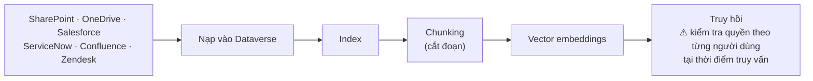

# Note 06 — Nguồn tri thức Copilot Studio, prompt library & SLM

> [!summary] TL;DR
> Ba chủ đề "nguyên liệu đầu vào" cho agent:
> **(1) Nguồn tri thức trong Copilot Studio** — **generative answers** cho phép agent trả lời **không cần soạn topic**. Hai chế độ điều phối: **generative orchestration** (tìm chủ động, tối đa **25 nguồn tri thức**, lọc bằng độ liên quan GPT) ↔ **classic orchestration** (khớp **trigger phrase**, tri thức chỉ là **fallback**). Ba con số giới hạn phải thuộc: **500 knowledge object/agent · 5 nguồn phi cấu trúc xuất hiện đồng thời khi truy hồi · 25 nguồn trong generative orchestration**.
> **(2) Prompt engineering & prompt library** — 4 trụ cột **Clarity · Context · Constraints · Output format**; 4 mẫu chuẩn (*Instruction+Context+Output · Few-shot · Role prompting · Multi-step*); **prompt library** = bộ sưu tập prompt **được curate và quản trị**, mỗi prompt kèm **7 trường metadata quản trị**; thang trưởng thành **5 mức** từ Basic tới Enterprise.
> **(3) SLM (Small Language Model)** — model sinh nội dung **nhẹ**, tối ưu cho **tốc độ, hiệu quả, đặc thù chuyên ngành**. ⚠️ Giáo trình cảnh báo thẳng: **quan niệm "SLM luôn an toàn hơn LLM và luôn giảm thông tin sai" là SAI**.

---

## PHẦN 1 — Nguồn tri thức cho agent trong Copilot Studio

### 1.1 Generative answers — kích hoạt sức mạnh GenAI

**Generative answers** cho phép agent **hiển thị thông tin động mà không cần topic được soạn sẵn**, giảm đáng kể thời gian phát triển. Agent làm được 4 việc:
- **Diễn giải truy vấn ngôn ngữ tự nhiên**
- **Truy hồi đa nguồn** (multi-source retrieval)
- **Tổng hợp câu trả lời** từ dữ liệu doanh nghiệp
- Đưa phản hồi mạch lạc, **neo vào tài sản tri thức chính thức lẫn phi chính thức**

### 1.2 Generative orchestration ↔ Classic orchestration ⭐

**Generative orchestration** quyết định agent được **tìm rộng và sâu tới đâu** trên các nguồn tri thức. Ở chế độ này Copilot Studio:
- Tự tạo **system topic "Conversational boosting"** chứa một **generative answers node**
- Tìm được **tối đa 25 nguồn tri thức**, lọc bằng **độ liên quan dựa trên GPT**
- **Tuỳ chọn** đưa vào **general knowledge** (tri thức chung), cho phép agent trả lời **truy vấn ngoài phạm vi** khi thích hợp

Bảng so sánh gốc — **bảng quan trọng nhất của mục này**:

| Hành vi | **Generative orchestration** | **Classic orchestration** |
|---|---|---|
| **Topics** | Chọn topic dựa trên **mô tả mục đích** của topic | Chọn topic dựa trên **khớp truy vấn với trigger phrase** |
| **Child & connected agents** | Chọn dựa trên **mô tả** của chúng | **Không áp dụng** |
| **Tools** | Agent **tự chọn gọi tool** dựa trên **tên và mô tả** | Tool **chỉ gọi tường minh từ bên trong topic** |
| **Knowledge** | Agent **chủ động tìm tri thức** để trả lời | Tri thức dùng làm **fallback** khi không topic nào khớp (hoặc gọi tường minh trong topic) |
| **Kết hợp nhiều topic/tool/nguồn** | Agent **kết hợp được** topic + tool + knowledge | Agent cố chọn **MỘT topic duy nhất**, rồi fallback sang knowledge nếu có cấu hình |
| **Hỏi thêm người dùng** | Agent **tự sinh câu hỏi** để lấy thông tin còn thiếu cho input của topic và tool | Phải dùng **question node** trong topic để tự viết câu hỏi |
| **Trả lời người dùng** | Agent **tự sinh phản hồi** từ thông tin nó đã dùng | Phải dùng **message node** trong topic để tự viết phản hồi (hoặc gọi tool từ topic) |

`★ Insight ─────────────────────────────────────`
Bảng này là **bộ khung phân biệt hai thế hệ Copilot Studio**, và mọi dòng đều theo cùng một trục: **classic = người soạn quyết định trước · generative = model quyết định lúc chạy**. Nhớ được trục này thì suy ra được cả 7 dòng mà không cần học thuộc từng dòng. Ba dấu hiệu nhận biết nhanh trong đề: chữ **"trigger phrase"** → classic; chữ **"description"** (mô tả) → generative; **"Not applicable"** ở dòng child/connected agent → **classic KHÔNG làm được multi-agent**, đây là lý do kỹ thuật khiến multi-agent trong Copilot Studio bắt buộc phải bật generative orchestration.
`─────────────────────────────────────────────────`

### 1.3 Ba cấp áp dụng nguồn tri thức

Nguồn tri thức có thể gắn ở:
1. **Cấp agent** — global knowledge
2. **Cấp topic** — riêng cho một luồng hội thoại
3. **Tại generative answers node** — truy hồi chính hoặc dự phòng

### 1.4 Sáu loại nguồn tri thức được hỗ trợ

| Loại nguồn | Nội dung | Hợp cho |
|---|---|---|
| **Public website** | Agent tìm trên **website công khai đã chỉ định** | FAQ, thông tin sản phẩm đối ngoại, tài liệu chính sách công khai |
| **Uploaded documents** | Tài liệu lưu trong **Dataverse** (PDF, Word, PowerPoint…) được index để **truy hồi ngữ nghĩa** | Tổ chức phụ thuộc nhiều vào tài liệu nội bộ |
| **SharePoint** | URL SharePoint được index cho tìm kiếm doanh nghiệp; agent **chỉ lấy nội dung người dùng có quyền** | Tri thức nội bộ trên SharePoint |
| **Dataverse** | **Bảng có cấu trúc và dữ liệu quan hệ** | Trả lời truy vấn **rất cụ thể** neo vào dữ liệu được quản trị |
| **Enterprise connectors** | Dữ liệu index qua **Microsoft Search connector** | Nội dung từ **OneDrive, SharePoint, Salesforce, ServiceNow**… |
| **Azure OpenAI-connected data** | **Generative answers do Azure OpenAI cấp nguồn**, kết hợp **vector nhúng của bạn** với suy luận của model | Độ chính xác cao hơn, hiểu ngữ cảnh sâu hơn |

> 🔒 **Xác thực được thực thi TỰ ĐỘNG:** agent **chỉ hiển thị được nội dung người dùng hiện tại có quyền truy cập**. Đây là hiện thực hoá chiều **Availability** ở [[03-Phan-tich-yeu-cau-va-Du-lieu-Grounding]] §2.2.

### 1.5 Dữ liệu phi cấu trúc — đường đi và giới hạn ⭐

File tải từ **SharePoint, OneDrive, Salesforce, ServiceNow, Confluence, Zendesk** đi qua pipeline:

Bốn thứ pipeline này mang lại: **tìm kiếm ngữ nghĩa chất lượng cao · grounding phong phú cho generative answers · độ chính xác truy hồi mạnh với tài liệu lớn và knowledge base · kiểm tra quyền nghiêm ngặt theo từng người dùng tại thời điểm truy vấn**.

**Ràng buộc kiến trúc — ba con số phải thuộc:**

| Giới hạn | Giá trị |
|---|---|
| Knowledge object tối đa **mỗi agent** | **500** |
| Nguồn **phi cấu trúc** tối đa xuất hiện **đồng thời khi truy hồi** | **5** |
| Nguồn tri thức tối đa mà **generative orchestration** tìm được | **25** |

Đồng bộ nền chạy tự động để bảo đảm **độ tươi của nội dung**.

### 1.6 Azure OpenAI vs Azure AI Search làm nguồn tri thức

| | **Azure OpenAI "on your data"** | **Azure AI Search** |
|---|---|---|
| **Cơ chế** | Kết nối classic nhúng bên trong **generative answer node**; tạo kết nối trực tiếp tới **Azure OpenAI resource** | Tích hợp như **nguồn thông tin dựa trên index** |
| **Năng lực** | Tổng hợp câu trả lời bằng **embedding doanh nghiệp + suy luận model**; **ưu tiên nguồn cấp node hơn nguồn cấp agent**; cấu hình nâng cao (chọn model, tham số prompt) | Truy hồi **vector index doanh nghiệp** · **semantic ranking** cho kết quả độ chính xác cao · nhiều cách xác thực (**key · certificate · Entra ID**) · **ánh xạ trích dẫn theo metadata** qua trường của index |
| **Tốt nhất cho** | **Suy luận phức tạp** · hiểu hội thoại chuyên ngành · **sinh câu trả lời dài** dựa trên embedding đã index | **Khối lượng nội dung lớn** cần: index mở rộng được · độ liên quan tìm kiếm cấp doanh nghiệp · **vector search** khớp embedding |

### 1.7 Chọn kiến trúc tri thức theo bốn trục

| Trục quyết định | Tình huống → Lựa chọn |
|---|---|
| **Data complexity** | Có cấu trúc → **Dataverse** · Bán cấu trúc → **Azure AI Search** · Phi cấu trúc → **SharePoint/OneDrive/Salesforce KB qua Dataverse** |
| **Retrieval precision** | Độ chính xác cao → **Azure AI Search + semantic ranking** · Phủ rộng nhiều lĩnh vực → **generative orchestration với nhiều nguồn** |
| **Governance & security** | Tài liệu nhạy cảm → **dữ liệu phi cấu trúc với kế thừa quyền nghiêm ngặt** · Tìm xuyên lĩnh vực → **generative orchestration có lọc** |
| **Performance & latency** | Thông lượng cao → **Dataverse + Azure AI Search** · Q&A độ phức tạp thấp → **public site hoặc nhúng topic classic** |

---

## PHẦN 2 — Prompt engineering

### 2.1 Định nghĩa và giá trị nghiệp vụ

**Prompt engineering** là việc **thiết kế có chủ đích các chỉ dẫn** để dẫn dắt model sinh ra đầu ra đáng tin cậy. Lý do nó quan trọng: **hệ thống AI không hiểu ý định** — chúng phụ thuộc **hoàn toàn** vào độ rõ ràng, cấu trúc và ngữ cảnh trong prompt.

Bốn giá trị trong môi trường doanh nghiệp: **độ chính xác nội dung & giảm thông tin sai · tính nhất quán giữa các nhóm và luồng việc · quản trị qua chỉ dẫn được kiểm soát và mẫu đã duyệt · tăng năng suất nhờ template tái dùng**.

### 2.2 Năm hướng dẫn cốt lõi

| Hướng dẫn | Nội dung | Ví dụ gốc |
|---|---|---|
| **Clarity & specificity** | Mô tả tác vụ bằng thuật ngữ **trực tiếp, không mơ hồ**; **thay động từ mở bằng mô tả hành động được**; xác định **thuật ngữ chuyên ngành** để chính xác | ❌ *"Summarize the project."* → ✅ *"Summarize the project kickoff meeting notes into **three bullet points** focused on **risks, owners, and deadlines**."* |
| **Context & background** | Cung cấp **mục đích nghiệp vụ · đối tượng đích · nguồn dữ liệu hoặc tài liệu tham chiếu · ràng buộc hoặc loại trừ** | *"Act as a solutions architect reviewing security requirements for a financial services customer. Provide recommendations aligned to **zero-trust principles**."* |
| **Format & output control** | Định nghĩa cấu trúc đầu ra: **bảng · danh sách gạch đầu dòng · JSON · quy trình từng bước · tóm tắt cho lãnh đạo** | Đầu ra có cấu trúc **giảm thời gian biên tập** và tăng tính nhất quán |
| **Constraints & guardrails** | Giữ AI trong ranh giới chấp nhận được: **tông giọng & yêu cầu tuân thủ · giới hạn lĩnh vực · ranh giới sử dụng dữ liệu · luật "Do not include…"** | Giảm rủi ro và ép khớp chuẩn quản trị |
| **Iterative refinement loop** | **Prompt → Review → Refine → Reprompt**. Duy trì **version control** cho prompt và đánh giá phản hồi theo **KPI nghiệp vụ**: độ chính xác, độ đầy đủ, mức tuân thủ | |

### 2.3 Năm kỹ thuật & mẫu nâng cao

| Kỹ thuật | Cơ chế | Cải thiện gì |
|---|---|---|
| **Role prompting** | Gán vai cho model — *"Act as a cloud solutions architect…"*, *"Act as a compliance officer reviewing data residency obligations…"* | Cho model **khung tham chiếu** → phản hồi chính xác hơn |
| **Instruction + Context + Output** | **Instruction**: model phải làm gì · **Context**: dữ liệu, ràng buộc, tri thức, điều kiện nghiệp vụ liên quan · **Output**: định dạng, tông, độ dài, cấu trúc | Cấu trúc **nền tảng** trong thiết kế prompt của Copilot Studio |
| **Few-shot prompting** | Đưa **ví dụ** minh hoạ phong cách, định dạng, hoặc lối suy luận mong muốn | Giúp model **khái quát hoá mẫu** và **giảm phương sai** |
| **Chain-of-thought** | Yêu cầu model **trình bày các bước hoặc lập luận** | Tăng độ đúng cho: tác vụ **phân tích · gỡ lỗi · biện minh quyết định kiến trúc** |
| **Multi-step prompt flows** | Phân rã tác vụ lớn: **Extract → Analyze → Recommend → Summarize** | Tăng chất lượng và **giảm lan truyền lỗi** (error propagation) |

### 2.4 Sáu lỗi thường gặp cần tránh

**Prompt quá dài · chỉ dẫn mâu thuẫn nhau · thiếu ngữ cảnh · lạm dụng chain-of-thought · prompt vô tình rò rỉ dữ liệu nhạy cảm · prompt gây ra thông tin sai.**

`★ Insight ─────────────────────────────────────`
Hai lỗi trong danh sách này đáng chú ý vì chúng **phản bác chính lời khuyên ở mục trước**: *"overuse of chain-of-thought"* — chain-of-thought được liệt là kỹ thuật tốt ở §2.3 nhưng **lạm dụng lại là lỗi**, vì nó tốn token, tăng độ trễ, và với tác vụ đơn giản thì không cải thiện gì. Và *"prompts that accidentally leak sensitive data"* — nhắc rằng prompt **cũng là một bề mặt rò rỉ dữ liệu**, không chỉ đầu ra. Đây là lý do prompt library cần trường **risk classification** ở §3.2.
`─────────────────────────────────────────────────`

### 2.5 Hai biểu đồ tham chiếu

**Chart A — Khung thiết kế prompt (6 thành phần):**

| Thành phần | Mô tả |
|---|---|
| **Intent** | Người dùng muốn AI làm gì |
| **Context** | Dữ liệu nền, giả định, ràng buộc |
| **Instruction** | Hướng dẫn trực tiếp, hướng tác vụ |
| **Examples** | Minh hoạ đầu ra kỳ vọng |
| **Output Format** | Bảng, gạch đầu dòng, tóm tắt, JSON |
| **Constraints** | Tuân thủ, tông giọng, nội dung cấm |

**Chart B — Thang trưởng thành prompt (5 mức):** ⭐

| Mức | Mô tả |
|---|---|
| **Level 1 — Basic** | Câu hỏi đơn giản, **không có cấu trúc** |
| **Level 2 — Guided** | **Ý định rõ + ràng buộc cơ bản** |
| **Level 3 — Structured** | **Mẫu đầy đủ** (instruction + context + output) |
| **Level 4 — Optimized** | **Few-shot example + quy tắc định dạng** |
| **Level 5 — Enterprise** | **Template tái dùng + version control + thư viện được quản trị** |

> 💡 Thang này là câu trả lời gọn cho câu hỏi *"tổ chức đang ở đâu?"*. Chú ý **Level 5 mới là chỗ prompt library xuất hiện** — nó là **kết quả của sự trưởng thành**, không phải điểm khởi đầu.

---

## PHẦN 3 — Prompt library

### 3.1 Prompt library là gì và mang lại gì

**Prompt library** = bộ sưu tập prompt **được curate (chọn lọc) và quản trị**, **tái sử dụng được**, hỗ trợ đầu ra AI **nhất quán, chất lượng cao** trên toàn tổ chức.

Năm giá trị: **Consistency** (nhất quán giữa các nhóm và luồng việc) · **Governance** (qua mẫu đã duyệt và guardrail) · **Efficiency** (giảm thời gian tạo prompt) · **Quality** (prompt đã kiểm thử và xác thực) · **Scalability** (khi việc áp dụng AI mở rộng).

> Prompt library trở thành **tài sản chiến lược** trong **AI Center of Excellence** và chương trình AI doanh nghiệp → xem [[07-Solution-Rules-Vai-tro-va-AI-CoE]].

### 3.2 Năm thành phần của một prompt library tốt

| Thành phần | Nội dung |
|---|---|
| **Prompt templates** | Template tái dùng cho: **summaries · classifications · transformations · recommendations · troubleshooting · decision support** |
| **Domain-specific prompts** | May đo cho: **HR · Finance · IT · Security · Sales · Operations** |
| **Governance metadata** ⭐ | Mỗi prompt phải có **7 trường**: **Purpose · Owner · Version · Last updated date · Applicable systems** (Copilot Studio, Azure Copilot…) **· Risk classification · Required grounding sources** |
| **Quality standards** | Prompt phải đạt tiêu chí: **Accuracy · Safety · Compliance · Repeatability · Output consistency** |
| **Storage & access** | Có thể đặt ở: **SharePoint · GitHub Enterprise · Azure DevOps repos · Copilot Studio prompt guides** |

### 3.3 Bốn nhóm quy tắc quản trị prompt library

| Quy tắc | Nội dung |
|---|---|
| **Version control** | Prompt tiến hoá — **theo dõi thay đổi và giữ lịch sử** |
| **Review & approval workflow** | Prompt phải được rà bởi **3 nhóm**: **domain expert · Responsible AI reviewer · security/compliance team** |
| **Testing & validation** | Kiểm thử trên **nhiều đầu vào · trường hợp biên (edge case) · các phiên bản model khác nhau** |
| **Lifecycle management** | **Khai tử khi lỗi thời · cập nhật khi quy tắc nghiệp vụ đổi · giám sát performance drift** (trôi hiệu năng) |

### 3.4 Sáu tiêu chí chấm điểm prompt

Thang chấm tái dùng được: **Accuracy · Completeness · Safety/compliance alignment · Format adherence · Reasoning quality · Variance across multiple runs** (phương sai giữa nhiều lần chạy).

`★ Insight ─────────────────────────────────────`
Tiêu chí cuối — **variance across multiple runs** — là tiêu chí duy nhất **đòi chạy nhiều lần cùng một prompt**, và là tiêu chí phân biệt prompt cấp doanh nghiệp với prompt cá nhân. Một prompt cho câu trả lời hay ở lần thử đầu nhưng khác nhau mỗi lần chạy thì **không dùng được trong quy trình nghiệp vụ**, vì đầu ra không lặp lại được (đúng tiêu chí **Repeatability** ở §3.2). Đây cũng là móc nối sang việc kiểm thử ở [[19-Testing-Quy-trinh-Metrics-va-Validation]] và [[20-Testing-Prompt-E2E-va-Sinh-Test-Case]].
`─────────────────────────────────────────────────`

---

## PHẦN 4 — Small Language Model (SLM)

### 4.1 SLM là gì

**SLM (Small Language Model)** = model sinh nội dung **nhẹ**, tối ưu cho **tốc độ, hiệu quả và đặc thù chuyên ngành**. Hỗ trợ hệ AI cần: **độ trễ thấp · suy luận tối ưu chi phí · triển khai edge/nhúng · suy luận rất chuyên biệt**.

Tiến bộ gần đây như **Phi-3** cho hiệu năng trước đây chỉ thấy ở model lớn, đồng thời **kiểm soát chặt hơn** và **pipeline triển khai hiệu quả hơn**.

Bốn lợi ích của SLM tuỳ biến: **tăng độ chính xác trên tác vụ chuyên ngành · nhúng suy luận chuyên biệt một cách an toàn trong môi trường doanh nghiệp · giảm chi phí so với fine-tune model lớn · cho phép vận hành offline hoặc gần biên vì lý do tuân thủ hoặc hiệu năng**.

> ⚠️ **Cảnh báo nguyên văn của giáo trình:** SLM có lợi thế về **chi phí, độ trễ và khả năng kiểm soát**. *"But it's a common misconception that they're always safer than LLMs and always reduce incorrect information."* — **Quan niệm SLM luôn an toàn hơn LLM và luôn giảm thông tin sai là SAI.** Architect phải xác định khi nào SLM hợp lý hơn model lớn, và cân nhắc **rủi ro lạm dụng SLM trong tổ chức**.

### 4.2 Ba cách tuỳ biến SLM

| Cách | Làm gì |
|---|---|
| **Domain tuning** | Thêm tri thức chuyên ngành qua **corpus có cấu trúc** hoặc tài liệu doanh nghiệp đã curate |
| **Behavior tuning** | Kiểm soát **phong cách, độ sâu suy luận, hành vi an toàn, ràng buộc vận hành** |
| **Task optimization** | Chuyên biệt hoá cho **retrieval, classification, summarization, planning, hoặc mẫu dùng tool** |

### 4.3 Năm nhóm use case cho SLM tuỳ biến

| Nhóm | Khi nào | Ví dụ |
|---|---|---|
| **Domain-specific knowledge workflows** | Nghiệp vụ đòi đầu ra **chính xác, đúng ngữ cảnh**, rút từ **tri thức nội bộ độc quyền** | Phân tích tuân thủ quy định · đánh giá rủi ro hợp đồng · suy luận y tế/pháp lý/tài chính · playbook gỡ lỗi sản xuất |
| **Operationally constrained environments** | Khi **độ trễ, chi phí, hoặc dấu chân tính toán** quan trọng | Thiết bị **mobile, IoT, edge** · môi trường suy luận khối lượng lớn · hệ phân tích/quyết định thời gian thực · kết nối chập chờn hoặc bị hạn chế |
| **Enterprise security & safety** | Tổ chức đòi **toàn quyền kiểm soát dữ liệu huấn luyện · pipeline đánh giá minh bạch · ranh giới rủi ro được kiểm soát · loại bỏ phụ thuộc model bên ngoài** | SLM cho phép **nhúng guardrail an toàn thẳng vào model** |
| **Enhanced productivity** | Workflow hưởng lợi từ SLM tinh chỉnh theo **văn phong nội bộ hoặc cấu trúc chuyên ngành** | Soạn báo cáo vận hành · viết bài knowledge base · template giao tiếp theo phong cách công ty · tóm tắt theo **taxonomy doanh nghiệp** |
| **Reasoning-heavy / multi-step** | SLM làm **orchestrator hoặc planner** khi: cần **chain-of-thought chi phí thấp** · kiến trúc multi-agent dựa vào **suy luận phân tán** · định tuyến workflow cần logic chuyên ngành | SLM có suy luận đã tinh chỉnh **vượt model đa dụng lớn hơn** trong môi trường chuyên biệt |

### 4.4 Anti-pattern và rủi ro ⭐

**Bốn anti-pattern** (mẫu phản diện — cách làm nghe hợp lý nhưng sai):
1. **Dựng SLM tuỳ biến trong khi RAG trên một model đa dụng là đã đủ**
2. **Đánh giá thấp công sức curate dữ liệu và đánh giá**
3. **Coi SLM là viên đạn bạc chống thông tin sai**
4. **Dùng SLM cho tác vụ suy luận rộng, sáng tạo** — vốn hợp với LLM hơn

**Ba rủi ro:** **overfitting vào dữ liệu hẹp** · **khái quát hoá kém với trường hợp biên** · **lỗ hổng quản trị nếu vội vàng khi tinh chỉnh an toàn**.

### 4.5 Ma trận chọn model: SLM tuỳ biến ↔ LLM đa dụng ⭐

| Yếu tố quyết định | Dùng **SLM tuỳ biến** | Dùng **LLM đa dụng** |
|---|---|---|
| **Domain specificity** | **Cao** | Thấp |
| **Latency sensitivity** | **Cao** | Trung bình/thấp |
| **Cost constraints** | **Nhạy cảm cao** | Vừa phải |
| **Data sovereignty required** | **Có** | Có thể |
| **Task complexity** | Trung bình–cao, **chuyên biệt** | Cao, **đa dụng** |
| **Deployment environment** | **Edge / IoT / on-prem** | **Cloud** |
| **Regulatory restrictions** | **Cao** | Vừa phải |

### 4.6 Cân nhắc kiến trúc & thang điểm đánh giá

| Nhóm | Yêu cầu |
|---|---|
| **Data requirements** | Tập dữ liệu **curate chất lượng cao** · thuật ngữ chuyên ngành và **ví dụ có cấu trúc** · corpus văn bản **sạch và đã gán nhãn** |
| **Safety & governance** | Định nghĩa **ranh giới an toàn và yêu cầu kiểm duyệt** · đánh giá model đối chiếu **đầu ra có hại hoặc không tuân thủ** |
| **Deployment & integration** | Tích hợp với **điều phối dựa trên Copilot** · tương thích với **agent tool và connector doanh nghiệp** · **kiểm thử hiệu năng dưới tải người dùng thực tế** |

**SLM Success Scorecard — 5 chỉ số:**
**Task accuracy / success rate · Latency targets · Cost per 1,000 requests · Safety incident rates · Drift hoặc degradation theo thời gian.**

## Q&A phỏng vấn

> [!question] "Phân biệt generative orchestration và classic orchestration trong Copilot Studio."
> Trục phân biệt: **classic là người soạn quyết định trước, generative là model quyết định lúc chạy**. Classic chọn topic bằng **trigger phrase**, tool chỉ gọi được tường minh từ trong topic, tri thức chỉ là **fallback**, và agent cố chọn **một topic duy nhất**; phải tự viết question node và message node. Generative chọn topic/agent/tool bằng **mô tả**, chủ động tìm tri thức, **kết hợp được nhiều topic + tool + knowledge**, tự sinh câu hỏi và câu trả lời, tìm được tối đa **25 nguồn tri thức** lọc bằng độ liên quan GPT. Quan trọng: **classic KHÔNG hỗ trợ child/connected agent** — nên multi-agent bắt buộc phải bật generative.

> [!question] "Ba con số giới hạn về knowledge trong Copilot Studio?"
> **500** knowledge object mỗi agent · **5** nguồn phi cấu trúc xuất hiện đồng thời khi truy hồi · **25** nguồn tri thức mà generative orchestration tìm được.

> [!question] "Khi nào chọn Azure AI Search thay vì Azure OpenAI 'on your data'?"
> **Azure AI Search** khi khối lượng nội dung lớn và cần index mở rộng được, độ liên quan tìm kiếm cấp doanh nghiệp, **vector search** và **semantic ranking** cho độ chính xác cao — cộng thêm nó hỗ trợ nhiều cách xác thực (key, certificate, **Entra ID**) và ánh xạ trích dẫn theo metadata. **Azure OpenAI "on your data"** khi cần **suy luận phức tạp**, hiểu hội thoại chuyên ngành, và **sinh câu trả lời dài**. Lưu ý cấu hình: Azure OpenAI **ưu tiên nguồn cấp node hơn nguồn cấp agent**.

> [!question] "Một prompt library gồm những gì?"
> Năm thành phần: **prompt template** tái dùng, **prompt theo lĩnh vực** (HR/Finance/IT/Security/Sales/Operations), **governance metadata** cho từng prompt (purpose, owner, version, last updated, applicable systems, **risk classification**, **required grounding sources**), **quality standard** (accuracy, safety, compliance, repeatability, output consistency), và **nơi lưu trữ** (SharePoint, GitHub Enterprise, Azure DevOps, Copilot Studio prompt guides). Quản trị bằng **version control, quy trình review 3 bên, kiểm thử trên nhiều đầu vào và nhiều phiên bản model, và quản lý vòng đời** kể cả khai tử prompt lỗi thời.

> [!question] "SLM có an toàn hơn LLM không?"
> **Không nhất thiết** — giáo trình nói rõ đây là **quan niệm sai phổ biến**. SLM có lợi thế thật về **chi phí, độ trễ và khả năng kiểm soát**, nhưng không tự động an toàn hơn hay ít bịa hơn. Rủi ro riêng của SLM là **overfitting vào dữ liệu hẹp**, **khái quát hoá kém với trường hợp biên**, và **lỗ hổng quản trị nếu vội tinh chỉnh an toàn**. Anti-pattern hay gặp nhất là dựng SLM tuỳ biến trong khi **RAG trên một model đa dụng đã đủ**.

> [!question] "Khi nào SLM thắng LLM?"
> Khi **đặc thù chuyên ngành cao**, **nhạy cảm độ trễ**, **ràng buộc chi phí gắt**, **đòi chủ quyền dữ liệu**, triển khai ở **edge/IoT/on-prem**, và **hạn chế pháp lý cao**. Ngược lại LLM đa dụng thắng khi tác vụ **rộng và sáng tạo**, triển khai trên **cloud**, đặc thù chuyên ngành thấp.

## Tự kiểm tra

1. **Generative answers** cho phép agent làm gì mà không cần topic soạn sẵn?
2. Trong bảng so sánh 2 chế độ điều phối: dòng nào ghi **"Not applicable"** cho classic, và hệ quả kiến trúc là gì?
3. Ba con số giới hạn knowledge của Copilot Studio?
4. Kể **6 loại nguồn tri thức** được hỗ trợ.
5. Dữ liệu phi cấu trúc đi qua các bước nào trước khi truy hồi được?
6. Ba cấp có thể gắn nguồn tri thức?
7. Bốn trụ cột prompt hiệu quả theo hướng dẫn Microsoft?
8. Kể **4 mẫu prompt chuẩn** và **5 kỹ thuật nâng cao**.
9. **7 trường governance metadata** của mỗi prompt trong library?
10. **5 mức** của thang trưởng thành prompt — mức nào prompt library xuất hiện?
11. Sáu tiêu chí chấm điểm prompt — tiêu chí nào đòi chạy nhiều lần?
12. Ba cách tuỳ biến SLM? Bốn anti-pattern của SLM?
13. Trong ma trận chọn model, **Deployment environment** ứng với SLM là gì, với LLM là gì?
14. Năm chỉ số trong **SLM Success Scorecard**?

## Liên quan
- [[00-MOC-AB100]] — MOC bộ AB-100
- [[03-Phan-tich-yeu-cau-va-Du-lieu-Grounding]] — 5 chiều chất lượng dữ liệu grounding
- [[05-Chien-luoc-Multi-Agent-va-Chon-nen-tang]] — khi nào cần custom model (SLM là một dạng)
- [[07-Solution-Rules-Vai-tro-va-AI-CoE]] — prompt library là tài sản của AI CoE
- [[12-Copilot-Studio-Topics-Agent-Flows-Prompt-Actions]] — topic, fallback, prompt action chi tiết
- [[19-Testing-Quy-trinh-Metrics-va-Validation]] — kiểm thử prompt và validation model
- [[../AI-103/02-Model-Catalog-Chon-Deploy-Danh-gia]] — chọn & đánh giá model, bản kỹ thuật
- [[../../../04-AI/02-RAG-Optimization/00-MOC-RAG-Optimization]] — tối ưu truy hồi, bản kỹ thuật
