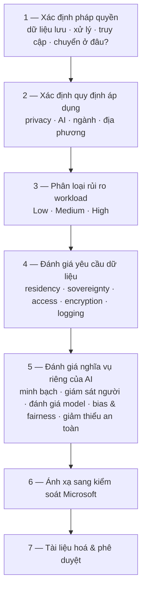
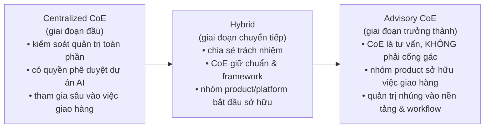

# Note 07 — Solution rules, vai trò nghiệp vụ & AI Center of Excellence

> [!summary] TL;DR
> Phần "tổ chức & tuân thủ" của cụm Plan, gồm 5 chủ đề:
> **(1) Solution rules & constraints** — mỗi nền tảng áp ràng buộc khác nhau; nguyên tắc: **định nghĩa MỘT bộ luật rồi áp khác nhau theo nền tảng**. Khái niệm chốt: **behavior envelope** (phong bì hành vi) — viết rõ agent *được* và *không được* làm gì: *"Agent may summarize" · "Agent may not decide" · "Agent may not execute financial transactions"*.
> **(2) Bảy vai trò nghiệp vụ** cho workload AI, mỗi vai trò kèm **hậu quả khi thiếu** — đây là dạng câu hỏi đặc trưng của đề.
> **(3) Tuân thủ quy định theo vùng** — 4 nhóm quy định (data privacy · AI-specific · industry · local) và **khung 7 bước** đánh giá.
> **(4) AI Center of Excellence** — mục đích, thành phần, và **đường tiến hoá Centralized → Hybrid → Advisory**. Anti-pattern quan trọng nhất: **CoE làm cổng gác (gatekeeper) thay vì bên hỗ trợ (enabler)**.
> **(5) Giải pháp AI xuyên nhiều app Dynamics 365** + **đào tạo prompt cho người dùng**.

---

## PHẦN 1 — Solution rules & constraints cho thành phần AI

### 1.1 Ràng buộc theo nền tảng

| Nền tảng | Key constraints | Solution rules |
|---|---|---|
| **Copilot Studio** *(low-code, task & retrieval agent)* | Hành vi định hình qua **chỉ dẫn có cấu trúc và quyền của tool** · **độ phức tạp thực thi hạn chế** so với Foundry · **môi trường được quản trị dành cho người dùng nghiệp vụ** · **bộ lọc an toàn dựng sẵn** chặn đầu ra không an toàn · agent chạy trong **ranh giới SaaS an toàn của Microsoft** | Dùng cho kịch bản **giới hạn trong workflow, hướng tác vụ, hoặc truy hồi thông tin** · áp **connector scoping nghiêm ngặt** để kiểm soát phơi nhiễm dữ liệu · định nghĩa **ranh giới tác vụ ngăn agent ra quyết định tác động lớn** · bảo đảm chỉ dẫn prompt **phản ánh chính sách tổ chức** |
| **Microsoft Foundry** *(pro-code, phức tạp cao)* | **Đòi quản trị tường minh cho tool, model, và memory** · hỗ trợ hosted agent, declarative agent, kiến trúc hướng tool · **tăng trách nhiệm** về chọn model, giảm thiểu rủi ro, đánh giá · **chi phí vận hành lớn hơn** (giám sát, failover, mở rộng) | Dùng cho **suy luận phức tạp, điều phối multi-agent, tích hợp tool tuỳ biến** · định nghĩa **ranh giới hành động nghiêm ngặt cho tool sửa đổi hệ thống hoặc kích hoạt workflow** · áp **pipeline đánh giá** để kiểm toán an toàn, tính đúng đắn, và **drift** · dùng **tách vai** để mỗi agent có quyền giới hạn phạm vi |
| **Foundry Tools** *(model catalog, tool API, framework điều phối, tiện ích đánh giá, SDK)* | Developer phải **tự quản lý vòng đời memory, ngữ cảnh, và độ nhạy dữ liệu** · agent **gọi được tool ngoài** → **phân quyền trở nên trọng yếu** · độ phức tạp điều phối tăng theo thiết kế multi-agent | **Least-privilege cho từng tool** · dùng công cụ đánh giá để **kiểm thử ca lỗi và hành vi không mong muốn** · định nghĩa **luật escalation rõ ràng** cho lúc agent phải nhường lại cho người · **tài liệu hoá mọi tích hợp tool** kèm cân nhắc bảo mật và kiểm toán |

### 1.2 Ràng buộc dữ liệu & ranh giới quản trị

| Nhóm | Luật |
|---|---|
| **Data access** | **Chỉ cấp cho agent đúng dữ liệu nó cần** · **che (mask) trường nhạy cảm** khi cần truy hồi nhưng không cần dữ liệu đầy đủ · **giới hạn nguồn grounding vào tập dữ liệu đã curate, có thẩm quyền** · với tác vụ sinh nội dung, **ràng buộc agent được tạo ra nội dung gì** |
| **Data movement & storage** | **Ngăn lưu trữ tin nhắn lâu dài trừ khi tuân thủ đòi hỏi** · định nghĩa **memory policy: ephemeral (tạm) ↔ persistent (lâu dài)** · **hạn chế truy cập dữ liệu xuyên lĩnh vực** (HR, Finance, Legal) |
| **Compliance & regulatory** | **Tác vụ rủi ro cao** (phê duyệt tài chính, soạn thảo pháp lý, quyết định y tế) **bắt buộc có người rà** · bật **kiểm toán bắt buộc cho việc gọi tool** |

### 1.3 Behavior envelope & kiểm soát Responsible AI ⭐

**Behavior envelope** (phong bì hành vi) = định nghĩa rõ agent **được phép** và **không được phép** làm gì. Ba ví dụ nguyên văn:

```
✅ "Agent may summarize"            — agent ĐƯỢC tóm tắt
❌ "Agent may not decide"           — agent KHÔNG được ra quyết định
❌ "Agent may not execute financial transactions"  — agent KHÔNG được thực hiện giao dịch tài chính
```

Kèm theo: đưa vào **hành vi bị cấm** khớp chính sách bảo mật/riêng tư/an toàn, và dùng **chỉ dẫn có cấu trúc để ngăn agent ứng biến không an toàn** (*unsafe improvisation*).

**Ba kiểm soát RAI bắt buộc:**
1. **Bắt buộc dùng pipeline đánh giá thiên lệch và an toàn**
2. Áp **chỉ dẫn nghiêm ngặt về trích dẫn nguồn, trình bày sự thật, và tránh thông tin sai**
3. Đòi **điểm kiểm tra human-in-the-loop cho hành động tác động lớn**

`★ Insight ─────────────────────────────────────`
**Behavior envelope là khái niệm đắt giá nhất của unit này** và rất dễ ghi điểm khi phỏng vấn, vì nó biến một yêu cầu mơ hồ ("agent phải an toàn") thành **một danh sách câu khẳng định kiểm chứng được**. Chú ý cấu trúc của ba ví dụ: chúng leo thang theo **mức độ hệ quả** — *tóm tắt* (không hệ quả) → *quyết định* (hệ quả nghiệp vụ) → *giao dịch tài chính* (hệ quả không đảo ngược được). Đây chính là trục để tự viết behavior envelope cho một agent mới: xếp mọi hành động theo mức **khó đảo ngược**, rồi kẻ vạch.
`─────────────────────────────────────────────────`

### 1.4 Ràng buộc môi trường, triển khai & mạng

| Nhóm | Nội dung |
|---|---|
| **Environment rules** | **Copilot Studio**: chạy trong **ranh giới tenant Microsoft 365**, **cô lập theo từng environment** · **Foundry**: đòi **môi trường triển khai được kiến trúc hoá** (VNet, private endpoint, ràng buộc region) · **Microsoft 365 Copilot**: chạy trong ranh giới tenant M365, **trong tenant của công ty**. Bắt buộc **tách dev / test / production** với cấu hình riêng |
| **Networking** | Với Foundry: dùng **private networking** cho workload bảo mật · **hạn chế gọi tool ngoài vào danh sách domain cho phép** · đòi **cô lập API** cho tích hợp hệ thống nhạy cảm |
| **Operational** | Lập **SLO cho độ tin cậy, độ trễ, thông lượng** · đòi **giám sát sức khoẻ agent và kế hoạch ứng phó sự cố** · bắt buộc **thủ tục rollback và failsafe** |

### 1.5 Khung luật hợp nhất — một bộ luật, hai cách áp ⭐

> Nguyên tắc: architect **định nghĩa MỘT bộ luật, rồi áp khác nhau trên từng nền tảng**.

| Rule Category | Copilot Studio | Foundry |
|---|---|---|
| **Data Access** | **Connector scoping nghiêm ngặt** | **Toàn quyền; phải tự định nghĩa ranh giới tường minh** |
| **Actions** | Tự động hoá tác vụ **nhẹ** | **Tích hợp tool sâu và điều phối** |
| **Governance** | **Nền tảng tự thực thi** (platform-enforced) | **Architect dẫn dắt, tuỳ biến được** |
| **Risk Level** | **Thấp–trung bình** | **Trung bình–cao** |
| **Evaluation** | **An toàn dựng sẵn** | **Đòi pipeline đánh giá** |

---

## PHẦN 2 — Bảy vai trò nghiệp vụ cho workload AI ⭐

Mỗi vai trò kèm **hậu quả khi thiếu** — đề rất hay hỏi kiểu *"tổ chức đang gặp vấn đề X, họ thiếu vai trò nào?"*:

| Vai trò | Mục đích | Trách nhiệm chính | ⚠️ Thiếu vai trò này thì |
|---|---|---|---|
| **Executive sponsor / business leader** | Cho **định hướng chiến lược**, **bảo đảm nguồn vốn**, gỡ rào cản tổ chức | Gióng hàng sáng kiến AI với chiến lược & KPI · cổ vũ thay đổi văn hoá và vận hành · **phê duyệt khung quản trị và khẩu vị rủi ro** | **Adoption đình trệ, thiếu vốn, thiếu hiện diện trong tổ chức** |
| **AI Center of Excellence (AI CoE) lead** | **Điều phối chiến lược AI**, bảo đảm quản trị, dàn xếp đồng thuận tổ chức | Thúc đẩy cộng tác giữa nghiệp vụ–dữ liệu–kỹ thuật–tuân thủ · **xếp ưu tiên use case theo giá trị nghiệp vụ** · phát triển chuẩn về độ trưởng thành và workflow AI | **Thiếu giám sát công nghệ, không tuân theo chiến lược kiến trúc thống nhất, đổ vỡ một hoặc nhiều trụ cột Responsible AI** (ví dụ minh bạch) |
| **Product owner for AI workloads** | **Sở hữu kết quả nghiệp vụ** của giải pháp AI | Định nghĩa **problem statement và acceptance criteria** · quản lý lộ trình, ngân sách, kỳ vọng bên liên quan · dẫn dắt vòng đời giải pháp từ ý tưởng tới triển khai | **Chiến lược lộn xộn, thiếu tầm nhìn** → công nghệ và giải pháp **rời rạc, thiếu định hướng** → adoption thấp và **nợ kỹ thuật tăng** |
| **Business domain specialist** | Cung cấp **chuyên môn lĩnh vực** cần cho grounding, đánh giá, và xác thực hiệu năng | **Xác thực độ chính xác đầu ra AI trong bối cảnh nghiệp vụ** · cung cấp **dữ liệu gán nhãn** và hiểu biết chuyên môn · nhận diện điểm đau vận hành hợp để tăng cường bằng AI | Workload AI **không chạy tin cậy và không đúng đặc tả** → **rủi ro thông tin sai** |
| **Data owner / data steward** | Bảo đảm **chất lượng, khả năng truy cập, và quản trị dữ liệu** nuôi workload AI | **Phê duyệt truy cập dữ liệu** và biện pháp bảo vệ · giám sát **kiểm kê, phân loại, và lineage** dữ liệu · bảo đảm tuân thủ chính sách dữ liệu | **Chất lượng dữ liệu kém** hoặc **rủi ro tuân thủ dữ liệu** |
| **Responsible AI / compliance officer** | Cài **quản lý rủi ro, pháp lý, và guardrail Responsible AI** | Định nghĩa **hướng dẫn đạo đức và khung quản trị** · **đánh giá và giảm thiểu kịch bản rủi ro của model** · giám sát **công bằng, minh bạch, và vận hành an toàn** | **Vấn đề đạo đức và thiên lệch** dẫn tới **kết quả ngoài ý muốn**. Vai trò **trọng yếu** để bảo đảm tuân thủ nguyên tắc Responsible AI của Microsoft |
| **Change management & skilling lead** | Thúc đẩy adoption bằng cách **chuẩn bị nhân viên cho workflow có AI** | Định nghĩa **kế hoạch nâng kỹ năng ánh xạ theo persona nhân sự** · phát triển **adoption playbook** và tài liệu onboarding · bảo đảm sẵn sàng tổ chức và tích hợp vận hành | **Thiếu adoption của người dùng** hoặc thiếu đổi mới tiếp → **sáng kiến thất bại** |

### 2.1 Năm persona kỹ thuật (theo Azure Well-Architected Framework)

| Persona | Làm gì |
|---|---|
| **AI Engineer** | **Xây, kiểm thử, và đánh giá** workload AI |
| **Data Scientist** | **Phát triển và thử nghiệm** model và feature pipeline |
| **Data Engineer** | **Chuẩn bị và điều phối** tài sản dữ liệu cho AI tiêu thụ |
| **Application Developer** | **Tích hợp** năng lực AI vào ứng dụng và dịch vụ |
| **MLOps / AIOps Engineer** | Quản lý **triển khai, tự động hoá, giám sát, và tối ưu hiệu năng** |

> Năm persona này bảo đảm workload AI **an toàn, hiệu năng cao, tối ưu chi phí, và bám best practice kiến trúc**.

### 2.2 Bản đồ vai trò theo 5 nhóm

| Role Category | Đóng góp chính | Hoạt động điển hình |
|---|---|---|
| **Strategy** | Định hướng & nguồn vốn | Phê duyệt lộ trình, định nghĩa KPI |
| **Governance** | Guardrail & tuân thủ | Đánh giá rủi ro, chính sách RAI |
| **Domain** | Bối cảnh nghiệp vụ | Gán nhãn dữ liệu, xác thực |
| **Technical** | Xây & tích hợp AI | Thiết kế model, kỹ thuật dữ liệu |
| **Operations** | Duy trì & tối ưu | Giám sát, huấn luyện lại, tinh chỉnh hiệu năng |

> 💡 Danh sách 7 vai trò **không phải là toàn diện** — tuỳ tổ chức mà chuyên biệt hoá thêm hoặc gộp lại. Giáo trình khuyến nghị làm **3 hoạt động**: **role-mapping workshop · gap analysis · RACI building**. Vai trò có thể phát sinh thêm: *use case owner · process owner · knowledge manager · AI adoption champion · business analyst for AI workloads · regression testing engineer · quality assurance lead*.

---

## PHẦN 3 — Tuân thủ quy định theo vùng

### 3.1 Bốn nhóm quy định phải rà ⭐

| Nhóm | Ví dụ | Cân nhắc chính |
|---|---|---|
| **Data protection & privacy** | **CCPA/CPRA** (California) · **Colorado Privacy Act** · **Brazil LGPD** · **India DPDP Act** | **Data minimization** (tối thiểu hoá dữ liệu) · **consent và cơ sở pháp lý** · **quyền của chủ thể dữ liệu** · **lưu trữ & xoá dữ liệu** · **chuyển dữ liệu xuyên biên giới** |
| **AI-specific regulations** | **EU AI Act** · **Canada AIDA** · **Singapore Model AI Governance Framework** · **U.S. Executive Orders** và luật AI cấp bang | **Phân loại rủi ro** · yêu cầu **minh bạch** · **giám sát của con người** · **đánh giá và tài liệu hoá model** · **an toàn và chống lạm dụng** |
| **Industry-specific** | **HIPAA** (y tế) · **FINRA, SEC, PCI DSS** (dịch vụ tài chính) · **FERPA** (giáo dục) · **NIST frameworks** (khu vực công) | **Data residency** · **khả năng kiểm toán** · **logging và truy vết** · **kiểm soát truy cập** |
| **Local jurisdiction** | Quy định cấp thành phố / bang / tỉnh | **Hạn chế dữ liệu sinh trắc học** · **luật về ra quyết định tự động** · **giới hạn giám sát nhân viên** · **yêu cầu minh bạch AI** |

### 3.2 Khung 7 bước đánh giá tuân thủ ⭐



**Ba mức phân loại rủi ro workload** (bước 3) — thuộc lòng:

| Mức | Loại workload |
|---|---|
| **Low risk** | **Năng suất nội bộ** |
| **Medium risk** | **Hướng ra khách hàng** (customer-facing) |
| **High risk** | **Quyết định tự động, ngành được quản lý chặt** |

**Kiểm soát Microsoft để ánh xạ vào** (bước 6): **Azure regional data boundaries · Microsoft Purview · Responsible AI dashboards · Azure AI Content Safety · Azure Policy for AI governance**.

### 3.3 Trách nhiệm của AI CoE về tuân thủ

CoE phải: **lập khung quản trị · định nghĩa chuẩn AI doanh nghiệp · tài liệu hoá guardrail tuân thủ · tạo quy trình đánh giá rủi ro** · **đánh giá tác động pháp lý của workload AI** (phân loại rủi ro, nhận diện quy định áp dụng, xác định nhu cầu data residency, xác thực yêu cầu đánh giá model) · **cho phép cộng tác liên chức năng** (Legal, Compliance, Security, Data governance, nhóm nghiệp vụ) · **cung cấp template và công cụ** (regulatory checklist, **data protection impact assessment**, template tài liệu model, quy trình đánh giá Responsible AI).

---

## PHẦN 4 — Microsoft AI Center of Excellence

### 4.1 Mục đích

AI CoE tồn tại để: **nâng độ trưởng thành AI của tổ chức · lập mô hình quản trị và guardrail Responsible AI · chuẩn hoá thực hành phát triển và vận hành AI · bảo đảm đồng thuận giữa đơn vị nghiệp vụ và nhóm kỹ thuật · giảm trùng lặp công sức và ngăn AI không được quản trị · cung cấp một trung tâm chuyên gia nội bộ** dẫn dắt và tăng tốc workload AI.

### 4.2 Ba thành phần lõi

1. **Executive sponsorship and leadership** — cấp vốn & định hướng chiến lược, truyền đạt tầm nhìn AI, gỡ rào cản và bảo đảm đồng thuận liên chức năng.
2. **Dedicated AI CoE leadership role** — **một người chịu trách nhiệm duy nhất** dẫn dắt: thực thi chiến lược AI, thực thi quản trị, đồng thuận tổ chức, giao tiếp bên liên quan, giám sát chương trình & danh mục. Vai trò này **thường nằm trong tổ chức cloud, data, hoặc chuyển đổi số**.
3. **Multidisciplinary expert team** — pha trộn chuyên môn kỹ thuật và nghiệp vụ:

| Skill Area | Vai trò đại diện |
|---|---|
| **AI Strategy** | AI Strategist, Transformation Lead |
| **Data** | Data Engineer, Data Architect |
| **Machine Learning** | ML Engineer, Data Scientist |
| **AI Governance** | Responsible AI Specialist, Compliance Lead |
| **Security** | AI Security Engineer |
| **Operations** | MLOps Engineer, AI Platform Engineer |
| **Business** | Đại diện **SME cho từng lĩnh vực** |

### 4.3 Vị trí tổ chức của CoE

| Đặt ở đâu | Ghi chú |
|---|---|
| Bên trong **Cloud Center of Excellence (CCoE)** | |
| Trong nhóm **Data hoặc Enterprise Architecture** | |
| Là **chức năng chuyển đổi AI độc lập** | ⚠️ **Chỉ khuyến nghị khi KHÔNG có nhóm hỗ trợ nào sẵn có** |

Cấu trúc tối ưu bảo đảm **ít chồng chéo, cộng tác cao, trách nhiệm rõ ràng**.

### 4.4 Đường tiến hoá Centralized → Advisory ⭐



### 4.5 Bảy nhóm trách nhiệm của CoE

| Nhóm | Nội dung |
|---|---|
| **AI strategy development** | Gióng lộ trình AI với mục tiêu nghiệp vụ · định nghĩa **mô hình xếp ưu tiên use case** · tạo nguyên tắc Responsible AI và quản trị |
| **Skills development & enablement** | **Đánh giá lỗ hổng kỹ năng** · dựng lộ trình học và kế hoạch chứng chỉ AI · **phát triển thư viện prompt và agent engineering nội bộ** |
| **AI governance & standards** | Tài liệu hoá & công bố chuẩn AI doanh nghiệp · định nghĩa guardrail, công cụ, baseline bảo mật · lập mô hình **khả năng kiểm toán, minh bạch, tuân thủ** · quản lý an toàn nội dung và thực hành AI có đạo đức |
| **Project intake & prioritization** | Đánh giá giá trị nghiệp vụ và tính khả thi kỹ thuật · xếp ưu tiên theo **rủi ro, cơ hội, mức sẵn sàng** · quản lý danh mục dự án AI |
| **Delivery support** | Cung cấp **mẫu kiến trúc, template, best practice** · chạy dự án thí điểm và PoC · dẫn dắt các nhóm áp dụng dịch vụ AI, Copilot, agent của Microsoft |
| **Operationalizing & managing** | Giám sát **hiệu năng model và data drift** · quản lý vận hành vòng đời · duy trì **repo code dùng chung, pipeline và template tái dùng** |
| **Maturity model assessment** | Solution architect **dẫn dắt tổ chức đánh giá độ trưởng thành** để đề xuất **đường tiến hoá CoE** — gặp người dùng ở chỗ họ đang đứng hôm nay và chỉ ra chỗ họ có thể tới |

### 4.6 Sáu anti-pattern & chế độ thất bại ⭐

| Anti-pattern | Hệ quả |
|---|---|
| **Overcentralization** (tập trung hoá quá mức) | → **Nút thắt cổ chai** (bottleneck) |
| **Undergovernance** (quản trị dưới mức) | → **Shadow AI** (AI ngầm, không ai biết) |
| **Không có executive sponsor** | → **Adoption đình trệ** |
| **Không có data governance** | → **Rủi ro tuân thủ** |
| **CoE làm gatekeeper thay vì enabler** | → CoE trở thành vật cản thay vì bệ phóng |
| **Thiếu change management** | → **Adoption thấp** |

`★ Insight ─────────────────────────────────────`
Hai anti-pattern đầu là **một cặp đối nghịch**, và đó là điều làm chúng đáng nhớ: **quá chặt sinh bottleneck, quá lỏng sinh shadow AI**. Không có đáp án "an toàn" là siết chặt hết mức — đúng như đường tiến hoá ở §4.4 chỉ ra, tổ chức trưởng thành **giảm dần quyền kiểm soát của CoE** và **chuyển quản trị vào nền tảng và workflow** thay vì vào con người ở cổng gác. Nói cách khác: **mục tiêu cuối của governance tốt là làm cho cổng gác trở nên không cần thiết**, vì luật đã được nhúng vào công cụ. Đây cũng là móc nối trực tiếp tới policy guardrail trong CI/CD ở [[21-ALM-cho-Du-lieu-va-Copilot-Studio]].
`─────────────────────────────────────────────────`

---

## PHẦN 5 — Giải pháp AI xuyên nhiều app Dynamics 365

### 5.1 Ba yêu cầu kiến trúc đa app

| Yêu cầu | Nội dung |
|---|---|
| **Shared business context** | Kịch bản xuyên ứng dụng cần **cái nhìn hợp nhất** về khách hàng, sản phẩm, hoặc trạng thái vận hành. Thành phần AI phải diễn giải tín hiệu từ nhiều workload và trình bày **biểu diễn nhất quán, chính xác** — bất kể tương tác bắt đầu ở đâu |
| **Process continuity** | Luồng **Sales → Customer Service → Finance → Field Service** có thể **tuần tự hoặc song song**. Agent phải **giữ ngữ cảnh** để người dùng *"tiếp tục từ chỗ đang dở"* bất kể ở bề mặt ứng dụng nào |
| **Data interoperability** | **Bảng Dataverse hài hoà · schema thực thể nhất quán · ranh giới tích hợp sạch · luồng dữ liệu hướng sự kiện**. Model AI phải grounding **chỉ trên nguồn có thẩm quyền, được quản trị** để tránh drift trong kịch bản đa app |

### 5.2 Multi-session app pattern

**Multi-session** cho phép tác vụ phức tạp diễn ra **qua khoảng thời gian dài**, hỗ trợ workflow nhiều bước. Hệ AI cần **ngữ cảnh bền theo thời gian** cho: **phân loại & định tuyến case · tiến triển cơ hội bán hàng · hành động theo dõi cần người rà · escalation dựa trên lịch sử, ghi chú, tương tác**.

**Bốn cân nhắc:** dùng **session metadata** để duy trì liên tục · **lưu insight AI vào thực thể có cấu trúc** · **tránh nhúng nội dung dễ biến động hoặc ngắn hạn vào prompt** · giữ tác vụ người dùng **có tính mô-đun** để dễ tăng cường tự động hoá.

### 5.3 Mẫu multi-agent trong Dynamics 365

| Cách | Tốt nhất cho | Ví dụ |
|---|---|---|
| **Single-agent** | Workflow **đơn giản, tuyến tính** · **một lĩnh vực nghiệp vụ** · tác vụ cần điều phối tối thiểu | Một agent hỗ trợ **phân loại case (case triage)** |
| **Multi-agent** | Quy trình **phức tạp, xuyên lĩnh vực** · điều phối qua **nhiều app Dynamics** · phối hợp tự trị nhiều bước | **Planner agent** (điều phối luồng nghiệp vụ) → **Worker agent** (truy hồi thông tin chuyên lĩnh vực) → **Reviewer agent** (xác thực khuyến nghị theo quy tắc nghiệp vụ) |

### 5.4 Kiến trúc hướng ý định (intent-driven)

Cho phép AI **xác định mục tiêu của người dùng và định tuyến yêu cầu** đúng app.

**Bốn nguyên tắc lõi:** **Intent parsing** (yêu cầu thuộc Sales, Service, hay workload khác?) · **Context routing** (ánh xạ ý định tới đúng app và thực thể) · **Adaptive actions** (dùng quy tắc nghiệp vụ điều chỉnh bước tiếp theo động) · **Event-based triggers** (dùng **sự kiện Dataverse**, **giảm thiểu tích hợp điểm-điểm**).

**Ba lợi ích:** giảm logic workflow tuỳ biến rải rác khắp các app · cho phép **mẫu AI tái dùng, tập trung hoá** · mở rộng dễ sang quy trình nghiệp vụ mới.

---

## PHẦN 6 — Đào tạo prompt cho người dùng

AI adoption thành công **khi người dùng hiểu cách làm việc với AI**. Microsoft Learn nhấn mạnh: adoption đòi **skilling, accessibility và governance — không chỉ triển khai công nghệ**.

Năm điều người dùng cần biết: **hỏi câu hỏi hiệu quả · cấu trúc prompt · xác thực đầu ra AI · dùng AI có trách nhiệm · AI khớp vào luồng việc của họ thế nào**.

**Năm mục tiêu đào tạo:** xây **sự tự tin** · **cải thiện chất lượng prompt** · **giảm lỗi và lạm dụng** · tăng năng suất & adoption · bảo đảm sử dụng có trách nhiệm và đạo đức.

**Bốn persona người dùng và trọng tâm đào tạo:**

| Persona | Trọng tâm đào tạo |
|---|---|
| **Everyday business users** | Prompt cơ bản · dùng AI để tóm tắt, soạn thảo, phân tích · **hiểu giới hạn và cách dùng có trách nhiệm** |
| **Power users / AI champions** | Prompt nâng cao · workflow nhiều bước · **tạo template prompt tái dùng** · **kèm cặp đồng nghiệp** |
| **Managers & decision makers** | **Rà soát insight do AI sinh** · hiểu ranh giới quản trị · **giám sát việc sử dụng và kết quả** |
| **Accessibility-focused users** | Dùng công cụ AI để hỗ trợ nhu cầu trợ năng · **prompt bằng giọng nói** |

## Q&A phỏng vấn

> [!question] "Behavior envelope là gì? Cho ví dụ."
> Là bản định nghĩa tường minh những gì agent **được** và **không được** làm, viết dưới dạng câu khẳng định kiểm chứng được: *"Agent may summarize"*, *"Agent may not decide"*, *"Agent may not execute financial transactions"*. Kèm theo danh sách hành vi bị cấm khớp chính sách bảo mật/riêng tư/an toàn, và dùng chỉ dẫn có cấu trúc để **ngăn agent ứng biến không an toàn**. Cách tự dựng: xếp mọi hành động của agent theo **mức độ khó đảo ngược**, rồi kẻ vạch cho phép.

> [!question] "Cùng một bộ luật thì áp lên Copilot Studio và Foundry khác nhau thế nào?"
> **Data access**: Copilot Studio siết bằng **connector scoping**, Foundry cho toàn quyền nên **phải tự định nghĩa ranh giới tường minh**. **Governance**: Copilot Studio **nền tảng tự thực thi**, Foundry **architect dẫn dắt và tuỳ biến**. **Evaluation**: Copilot Studio có **an toàn dựng sẵn**, Foundry **đòi pipeline đánh giá riêng**. **Risk level** theo đó là thấp–trung bình ↔ trung bình–cao. Nguyên tắc: định nghĩa **một** bộ luật rồi áp khác nhau, không viết hai bộ luật.

> [!question] "Tổ chức có nhiều agent nhưng không ai biết chúng dùng model gì, ai sở hữu. Họ thiếu vai trò nào?"
> Chủ yếu là **AI CoE lead** — hậu quả được ghi rõ là *"thiếu giám sát công nghệ, không tuân theo chiến lược kiến trúc thống nhất"*. Nếu kèm theo dữ liệu bẩn hoặc rủi ro tuân thủ thì thiếu cả **data owner/data steward**. Và triệu chứng ở tầng tổ chức chính là anti-pattern **undergovernance → shadow AI**.

> [!question] "Kể 4 nhóm quy định mà architect phải rà và khung đánh giá."
> Bốn nhóm: **data protection & privacy** (CCPA/CPRA, Colorado Privacy Act, LGPD, DPDP), **AI-specific** (EU AI Act, Canada AIDA, Singapore Model AI Governance Framework, sắc lệnh Mỹ), **industry-specific** (HIPAA, FINRA/SEC/PCI DSS, FERPA, NIST), **local jurisdiction** (sinh trắc học, ra quyết định tự động, giám sát nhân viên, minh bạch AI). Khung **7 bước**: xác định pháp quyền → xác định quy định áp dụng → **phân loại rủi ro workload (low/medium/high)** → đánh giá yêu cầu dữ liệu → đánh giá nghĩa vụ riêng của AI → **ánh xạ sang kiểm soát Microsoft** → tài liệu hoá và phê duyệt.

> [!question] "AI CoE nên tập trung hay phân tán?"
> Phụ thuộc **độ trưởng thành**, và có một đường tiến hoá: **Centralized** (kiểm soát quản trị toàn phần, có quyền phê duyệt dự án) → **Hybrid** (CoE giữ chuẩn, nhóm product/platform bắt đầu sở hữu) → **Advisory** (CoE là tư vấn chứ **không phải cổng gác**, nhóm product sở hữu việc giao hàng, quản trị **nhúng vào nền tảng và workflow**). Anti-pattern hai đầu: **overcentralization → bottleneck** và **undergovernance → shadow AI**.

> [!question] "Thiết kế giải pháp AI trải nhiều app Dynamics 365 cần lưu ý gì?"
> Ba yêu cầu: **shared business context** (cái nhìn hợp nhất bất kể tương tác bắt đầu ở đâu), **process continuity** (giữ ngữ cảnh để người dùng tiếp tục từ chỗ đang dở), **data interoperability** (bảng Dataverse hài hoà, schema nhất quán, luồng hướng sự kiện). Kiến trúc nên **hướng ý định**: parse intent → route context → adaptive action → **trigger dựa trên sự kiện Dataverse thay vì tích hợp điểm-điểm**. Mẫu multi-agent điển hình: **Planner → Worker → Reviewer**.

## Tự kiểm tra

1. Định nghĩa **behavior envelope** và cho 3 ví dụ nguyên văn.
2. Trong khung luật hợp nhất, **Governance** ở Copilot Studio và Foundry khác nhau thế nào?
3. **Memory policy** có hai lựa chọn nào?
4. Kể **7 vai trò nghiệp vụ** và hậu quả khi thiếu **AI CoE lead**, **business domain specialist**, **change management lead**.
5. Năm **persona kỹ thuật** theo Azure Well-Architected Framework?
6. Bốn nhóm quy định pháp lý + 2 ví dụ mỗi nhóm?
7. **Ba mức phân loại rủi ro workload AI** ứng với loại workload nào?
8. Năm **kiểm soát Microsoft** để ánh xạ yêu cầu pháp lý vào?
9. Ba giai đoạn tiến hoá của AI CoE? Ở giai đoạn cuối, quản trị nằm ở đâu?
10. Sáu **anti-pattern** của AI CoE — cặp nào đối nghịch nhau?
11. Ba yêu cầu kiến trúc khi làm AI xuyên nhiều app D365?
12. Ba vai trò trong mẫu multi-agent của Dynamics 365?
13. Bốn nguyên tắc của kiến trúc **intent-driven**?
14. Bốn persona người dùng khi đào tạo prompt — persona nào học **tạo template tái dùng và kèm cặp đồng nghiệp**?

## Liên quan
- [[00-MOC-AB100]] — MOC bộ AB-100
- [[04-CAF-cho-AI-va-Vong-doi-Agent]] — RACI và pha Govern & Secure
- [[06-Nguon-tri-thuc-Prompt-Library-va-SLM]] — prompt library là tài sản của CoE
- [[16-Orchestrate-Prebuilt-Agents-va-Apps]] — cấu hình cụ thể AI trong từng app D365
- [[21-ALM-cho-Du-lieu-va-Copilot-Studio]] — nhúng quản trị vào CI/CD thay vì cổng gác con người
- [[24-Governance-Data-Residency-va-Responsible-AI]] — data residency & tuân thủ, bản chi tiết cụm Deploy
- [[../AI-103/04-Toi-uu-Model-va-Responsible-GenAI]] — Content Safety, guardrail kỹ thuật
