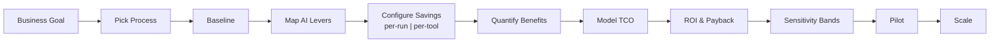

# Note 08 — ROI, TCO & build / buy / extend

> [!summary] TL;DR
> Mục kỹ năng thứ ba của cụm Plan. **TCO và ROI đứng cạnh nhau trong mọi business case AI nhưng trả lời hai câu hỏi khác nhau** — tách bạch chúng thì bản đánh giá sắc bén và dễ bảo vệ trước lãnh đạo hơn.
> **ROI phải đạt 4 tiêu chuẩn:** *Measurable · Repeatable · Aligned to business outcomes · **Grounded in real usage analytics*** (neo vào phân tích sử dụng thực tế, không phải ước đoán).
> **Năm nhóm ROI:** Productivity Gains · Cost Savings · Revenue Impact · Risk Reduction · Strategic & Innovation Value.
> **Năm nhóm chi phí TCO** (phiên bản đầy đủ nhất, dùng cho cả bảng build/buy/extend): **Infrastructure · Development & Integration · Data Quality & Preparation · Expertise & Staffing · Operations & Licensing**.
> **Ba con đường:** **Build** (khác biệt cạnh tranh, kiểm soát toàn phần) · **Buy** (time-to-value, độ trưởng thành AI thấp) · **Extend** (cân bằng — nhanh hơn Build, tuỳ biến hơn Buy).
> **Model router** của Microsoft Foundry: **một endpoint hợp nhất** tự chọn model phù hợp nhất theo **task type · năng lực model · ràng buộc chi phí · yêu cầu độ trễ · luật tuỳ biến**.

## 1. Vì sao dự án AI thất bại về mặt tài chính

Bốn nguyên nhân gốc mà giáo trình nêu:
1. **Đánh giá quá cao mức tăng năng suất**
2. **Đánh giá quá thấp chi phí vận hành và bảo trì**
3. **Thiếu khung đo lường rõ ràng**
4. **Không diễn đạt được giá trị nghiệp vụ cho lãnh đạo**

→ Đối lại, ROI của AI phải: **Measurable · Repeatable · Aligned to business outcomes · Grounded in real usage analytics**.

`★ Insight ─────────────────────────────────────`
Tiêu chuẩn thứ tư — **"grounded in real usage analytics"** — là cái phân biệt bản ROI của architect với slide marketing. Nó nghĩa là con số phải rút từ **telemetry thật của agent** (Copilot Studio ROI analytics, Savings Calculator) chứ không phải ước lượng trên giấy. Toàn bộ mục §4 dưới đây tồn tại để thoả tiêu chuẩn này, và nó nối thẳng sang cụm Deploy: nếu không cài **giám sát và telemetry** ([[17-Khung-Giam-sat-va-Cong-cu]]) thì **không có dữ liệu để chứng minh ROI** — nghĩa là bài toán tài chính hỏng vì lý do kỹ thuật.
`─────────────────────────────────────────────────`

## 2. Năm nhóm ROI ⭐

ROI trải trên cả chiều **định lượng lẫn định tính**:

| Nhóm ROI | Ví dụ | Copilot Studio ROI analytics đo được |
|---|---|---|
| **Productivity Gains** | Thời gian tiết kiệm mỗi tác vụ · giảm nhập liệu thủ công · giải quyết case nhanh hơn · tóm tắt/phân loại tự động | **Time saved per session · task automation rate · user adoption metrics** |
| **Cost Savings** | Giảm giờ công · giảm chi phí vận hành · giảm số lượng ticket hỗ trợ · giảm khối lượng rà soát thủ công / tuân thủ | **Cost savings per automated task · cost savings per user · aggregate savings over time** |
| **Revenue Impact** | Tăng tỉ lệ chuyển đổi bán hàng · sàng lọc lead nhanh hơn · **giữ chân khách hàng tốt hơn** · khuyến nghị **upsell/cross-sell** | |
| **Risk Reduction** | Ít vi phạm tuân thủ hơn · giảm tỉ lệ lỗi · **tăng tính nhất quán dữ liệu** · giảm rủi ro vận hành | |
| **Strategic and Innovation Value** | **Mô hình kinh doanh mới** · trải nghiệm khách hàng tốt hơn · **khác biệt hoá cạnh tranh** | |

> ⚠️ Câu 1 Module assessment hỏi đâu là **chỉ số ROI tài chính** → đáp án **"Money saved per successful agent run"**. Các phương án nhiễu — *customer satisfaction score*, *minutes saved per workflow*, *employee sentiment rating* — đều là chỉ số thật nhưng **không phải chỉ số tài chính** (cái thứ hai là chỉ số **thời gian**, hai cái còn lại là **định tính**).

## 3. TCO — chi phí toàn vòng đời

### 3.1 Phân rã theo giai đoạn vòng đời (unit 1)

| Nhóm chi phí | Gồm |
|---|---|
| **Development Costs** | **Chuẩn bị dữ liệu · prompt engineering · thiết kế và kiểm thử agent · tích hợp với hệ thống nghiệp vụ** |
| **Deployment Costs** | **Cấp phát hạ tầng · licensing · thiết lập bảo mật và tuân thủ · chi phí sử dụng API** |
| **Operational Costs** | **Giám sát và đánh giá · huấn luyện lại model · bảo trì prompt library · hỗ trợ và gỡ lỗi · chương trình đào tạo và adoption người dùng** |
| **Change Management Costs** | **Nâng kỹ năng và hỗ trợ · truyền thông và triển khai · thiết kế lại quy trình nghiệp vụ** |
| **Decommissioning Costs** | **Khai tử model lỗi thời · di trú sang kiến trúc mới** |

### 3.2 Năm cost driver (unit 2 & 3) ⭐ — bản dùng cho bảng build/buy/extend

| Cost driver | Gồm |
|---|---|
| **Infrastructure** | **Compute (CPU/GPU) cho suy luận · storage · network/egress · resiliency/HA** |
| **Development and integration** | Thiết kế agent · điều phối · **connector/API** · xác thực · tuân thủ · kiểm thử |
| **Data quality and preparation** | **Làm sạch/gán nhãn · grounding/indexing · lịch làm mới · giám sát drift** |
| **Expertise and staffing** | **Architect · kỹ sư AI/ML · MLOps · SME · quản lý thay đổi/đào tạo** |
| **Operations and licensing** | **Giám sát/telemetry · đánh giá/tinh chỉnh lại · ứng phó sự cố · phí tiêu thụ hoặc thuê bao** |

> ⚠️ Câu 4 Module assessment hỏi nhóm TCO nào bao gồm chi phí **làm sạch dữ liệu, gán nhãn, và giám sát data drift** → **Data Quality and Preparation Costs**. Đây là nhóm dễ bị bỏ quên nhất trong dự toán, và là lý do nó được hỏi.

`★ Insight ─────────────────────────────────────`
Giáo trình đưa **hai cách phân rã TCO khác nhau** — theo **giai đoạn vòng đời** (§3.1: development → deployment → operational → change management → decommissioning) và theo **loại nguồn lực** (§3.2: infrastructure, dev, data, expertise, operations). Đừng coi là mâu thuẫn: cách một dùng để **lập kế hoạch theo thời gian** (khi nào tiêu tiền), cách hai dùng để **so sánh phương án** (bảng build/buy/extend ở §6.2 dùng đúng 5 dòng này). Nếu đề hỏi có **5 cost driver** thì đó là bản §3.2; nếu nhắc **decommissioning** thì là bản §3.1.
`─────────────────────────────────────────────────`

## 4. Đo bằng dữ liệu thật — Copilot Studio ROI analytics & Savings Calculator

### 4.1 Bốn nhóm chỉ số của ROI analytics

| Nhóm | Chỉ số |
|---|---|
| **Usage Metrics** | Total sessions · active users · session duration |
| **Automation Metrics** | **Completion rate · abandonment rate · task success rate** |
| **Cost Savings Metrics** | Estimated time saved · estimated cost savings per task · reduction in manual workload |
| **Quality Metrics** | **Feedback scores · error rates · escalation frequency** |

### 4.2 Savings Calculator — per-run và per-tool

Agent có năng lực **Savings** để ước lượng rồi **theo dõi** thời gian hoặc tiền tiết kiệm được. Hai cách cấu hình:

| Cách | Khi nào dùng |
|---|---|
| **Savings per run** | Ước lượng nhanh khi **đường chạy dự đoán được** |
| **Savings per tool** | Ước lượng **chi tiết** khi agent dùng nhiều tool có tác động khác nhau |

> 💡 **Admin có thể tắt phần tiết kiệm quy ra tiền.** Nếu bị tắt, vẫn **theo dõi thời gian rồi tự quy đổi ra tiền trong ROI workbook**. Bảng Savings đặt trên trang **Analytics** của agent, chỉnh được để giữ mô hình luôn cập nhật.

**Bốn đầu vào cần có:** thời gian tiết kiệm mỗi lần chạy (phút) · **số lần chạy THÀNH CÔNG trong kỳ (chỉ tính run đã giải quyết được)** · **fully loaded labor rate** (đơn giá lao động đầy đủ, tiền/giờ) cho các vai trò bị ảnh hưởng · *(tuỳ chọn)* chênh lệch thời gian/chi phí theo từng tool.

**Ví dụ mô hình tiết kiệm (nguyên văn giáo trình):**

| Tham số | Giá trị |
|---|---|
| Số phút tiết kiệm mỗi lần chạy | **6** |
| Số lần chạy thành công / tháng | **20.000** |
| Labor rate ($/giờ) | **60** |
| **Tiết kiệm hằng tháng** | **$120.000** |

*(Kiểm chứng: 6/60 giờ × 20.000 × $60 = $120.000 ✓)*

## 5. Khung xây dựng bản phân tích ROI

### 5.1 Sáu bước ROI Evaluation Framework (unit 1)

| Bước | Nội dung |
|---|---|
| **1 — Define Business Outcomes** | Ví dụ: *giảm 20% thời gian xử lý cuộc gọi · tự động hoá 40% nhập liệu thủ công · cải thiện độ chính xác dự báo bán hàng* |
| **2 — Identify ROI Drivers** | Productivity · cost savings · revenue impact · risk reduction |
| **3 — Calculate TCO** | Gồm chi phí phát triển, triển khai, vận hành |
| **4 — Quantify Benefits** | Dùng **Copilot Studio analytics · time-and-motion study · KPI quy trình nghiệp vụ** |
| **5 — Compare Benefits vs TCO** | Tính **payback period · NPV (net present value — giá trị hiện tại ròng) · cost-benefit ratio · annualized ROI** |
| **6 — Validate with Stakeholders** | **Finance · Operations · Business owners · AI CoE** |

### 5.2 Bảy bước xây dựng ROI chi tiết (unit 2)

| Bước | Nội dung then chốt |
|---|---|
| **1. Khoanh phạm vi ROI** | **Đặt tên quy trình** (ví dụ *"Tier-1 HR case triage"*, *"Invoice exception handling"*, *"Customer email response"*) · định nghĩa ranh giới (bước A→B→C, các lần bàn giao, hệ thống chạm tới, và **cái gì sẽ KHÔNG đổi**) · **kỳ cơ sở** (tháng/quý điển hình ở trạng thái ổn định) · **chỉ số cơ sở**: khối lượng tác vụ, **AHT** (average handle time — thời gian xử lý trung bình), tỉ lệ làm lại/lỗi, tồn đọng, chỉ số thay thế cho mức hài lòng. ⚠️ **Lập baseline "không-AI" trước** — mọi lợi ích đều so ngược lại nó |
| **2. Ánh xạ giá trị AI vào đòn bẩy đo được** | **Ba nhóm**: **Time saved** (nén thời gian chu kỳ) · **Quality lift** (giảm lỗi, tăng first-contact resolution, ít escalation) · **Capacity/throughput** (nhiều việc hơn trên mỗi FTE mà không tăng đầu người) |
| **3. Định lượng bằng Savings Calculator** | per-run hoặc per-tool — xem §4.2 |
| **4. Quy thời gian thành lợi ích tài chính** | Công thức lõi bên dưới |
| **5. Mô hình hoá TCO** | 5 cost driver — xem §3.2 |
| **6. Dựng ROI, payback và dải nhạy cảm** | Công thức + sensitivity band bên dưới |
| **7. Đóng gói slide cho lãnh đạo** | Cấu trúc 6 phần bên dưới |

### 5.3 Công thức ⭐

```
Annual_Benefit ($) = (Minutes_Saved_per_Run / 60) × Runs_per_Year × Labor_Rate
                     + Error_Cost_Avoided
                     + Backlog / Working_Capital Effects (nếu đáng kể)

Net_Benefit      = Annual_Benefit − Annual_TCO
ROI %            = Net_Benefit / Annual_TCO × 100
Payback (tháng)  = Initial_OneTime_Cost / Net_Monthly_Benefit
```

### 5.4 Sensitivity band — dải lạc quan / kỳ vọng / thận trọng

Tạo ba kịch bản bằng cách thay đổi **4 biến**: **tỉ lệ adoption** (số lần chạy mỗi kỳ) · **số phút tiết kiệm mỗi lần chạy** (dùng dải đo thật từ Analytics) · **labor rate hoặc cơ cấu vai trò bị ảnh hưởng** · **hiệu ứng chất lượng/làm lại** (dùng chênh lệch tỉ lệ lỗi).

**Vì sao cần dải:** để bên liên quan **thấy được cả mặt lợi lẫn rủi ro**. Dùng nghiên cứu thực địa làm neo định hướng, nhưng **telemetry của chính mình mới là thứ cầm lái**.

### 5.5 Slide một trang cho lãnh đạo — 6 phần

**Problem and scope** (hôm nay lãng phí ở đâu) · **AI intervention** (agent tự động hoá/tăng cường cái gì) · **Measured impact** (số phút tiết kiệm, số run đã giải quyết, mức tăng chất lượng — **lấy từ Analytics**) · **Financials** (annual benefit, TCO, ROI %, payback) · **Confidence and risks** (dải nhạy cảm và giả định then chốt) · **Decision** (ví dụ: *"Thí điểm 8 tuần với tiêu chí thành công X; nhân rộng ra Y đơn vị nếu đạt"*).

### 5.6 Ví dụ hoàn chỉnh (nguyên văn giáo trình)

**Use case:** phân loại email khách hàng trong hộp thư dùng chung.

| Tham số | Giá trị |
|---|---|
| Số phút tiết kiệm mỗi email (soạn nháp + phân loại) | **1,8** |
| Khối lượng hằng tháng | **50.000** email |
| Tỉ lệ adoption (định tuyến sang agent) | **60%** |
| Labor rate | **$45/giờ** |
| **Tiết kiệm hằng năm** | (1,8/60) × (50.000 × 12 × 0,6) × 45 ≈ **$486.000** |
| **TCO năm 1** | **$300.000** (một lần + chi phí chạy) |
| **ROI** | **≈ 62%** |
| **Payback** | **≈ 7,4 tháng** |

> ⚠️ Câu 2 Module assessment hỏi **yếu tố nào bắt buộc có để bản phân tích ROI hoàn chỉnh** → **"Both measurable benefits and TCO"** — cả lợi ích đo được **lẫn** TCO. Chỉ có một vế thì không phải ROI.

### 5.7 Benefits waterfall

```
    Time Savings ($)
  + Error Avoidance ($)
  + Throughput/Capacity ($)
  ─────────────────────────
  = Gross Benefit
  − TCO (Infra + Dev/Int + Data + Expertise + Ops)
  ─────────────────────────
  = Net Benefit (ROI %)
```



## 6. Build ↔ Buy ↔ Extend ⭐

### 6.1 Ba con đường

| Con đường | Là gì | Tốt nhất khi | Rủi ro / lợi ích |
|---|---|---|---|
| **Build** | Tự tạo thành phần AI nội bộ | **Tuỳ biến sâu** · **kiểm soát dữ liệu, IP, và hành vi model** · quy trình nghiệp vụ độc nhất mà công cụ thương mại không hỗ trợ · tích hợp hệ thống độc quyền | ⚠️ **Chi phí ban đầu cao hơn · thời gian triển khai dài hơn · đòi đầu tư bảo trì liên tục** |
| **Buy** | Mua năng lực AI dựng sẵn | **Time-to-value là ưu tiên** · năng lực kỹ thuật nội bộ hạn chế · quy trình nghiệp vụ **đã chuẩn hoá** · cần **độ tin cậy, hỗ trợ, và cập nhật** | ⚠️ **Vendor lock-in · khả năng mở rộng hạn chế · thiếu tính năng cho quy trình chuyên biệt** |
| **Extend** | Tuỳ biến nền tảng sẵn có (Microsoft Copilot, Copilot Studio, Foundry) | **Kịch bản lai** cần cả tốc độ lẫn tuỳ biến · tận dụng hệ sinh thái đã trưởng thành trong khi may đo hành vi agent/Copilot · **đưa tri thức chuyên ngành vào qua plugin, skill, hoặc grounding data** | ✅ **Chi phí cân bằng · triển khai nhanh hơn Build · linh hoạt tuỳ biến hơn Buy** |

**Bốn business driver phải cân:** **tính độc nhất của quy trình nghiệp vụ** · **tầm quan trọng chiến lược** (khác biệt cạnh tranh ↔ workflow hàng hoá phổ thông) · **chân trời thời gian** (thắng lợi vận hành tức thì ↔ năng lực chiến lược dài hạn) · **nhu cầu tuân thủ và quản trị**.

### 6.2 Bảng TCO so sánh ba phương án ⭐

| Cost Domain | **Build** | **Buy** | **Extend** |
|---|---|---|---|
| **Infrastructure** | High | Low | Medium |
| **Development** | High | Low | Medium |
| **Data Preparation** | High | Low | **High** ⚠️ |
| **Expertise** | High | Low | Medium |
| **Operations** | High | **Medium** | Medium |

`★ Insight ─────────────────────────────────────`
Bảng này có **một ô phá vỡ quy luật** và đó chính là chỗ đề hay hỏi: **Data Preparation của Extend là High, ngang với Build**, trong khi bốn dòng còn lại của Extend đều là Medium. Lý do rất thực tế: mở rộng Copilot **không giúp gì cho việc chuẩn bị dữ liệu** — bạn vẫn phải làm sạch, gán nhãn, grounding, index, và giám sát drift trên chính dữ liệu của mình. Nói cách khác, **Extend tiết kiệm được công dựng phần mềm chứ không tiết kiệm được công dựng dữ liệu**. Đây là lời cảnh báo cho ai nghĩ "cứ extend Copilot là rẻ".
Ô thứ hai đáng chú ý: **Operations của Buy là Medium, không phải Low** — mua rồi vẫn phải trả phí license và vận hành giám sát.
`─────────────────────────────────────────────────`

### 6.3 Chín bước ra quyết định

1. **Định nghĩa yêu cầu và quy trình nghiệp vụ**
2. **Xác định tầm quan trọng chiến lược** (khác biệt hoá ↔ hàng hoá phổ thông)
3. **Đánh giá giải pháp nhà cung cấp** sẵn có và công sức triển khai
4. **Đánh giá tính khả thi của việc mở rộng** công cụ hiện có
5. **Đánh giá tính khả thi của việc tạo giải pháp hoàn toàn tuỳ biến**
6. **Ước tính TCO trên 5 cost domain**
7. **Dự báo ROI** (thời gian tiết kiệm, chi phí tránh được, giảm lỗi, tăng thông lượng)
8. **Chấm điểm từng phương án theo mô hình có trọng số**
9. **Chọn phương án có tỉ lệ giá trị/chi phí tối ưu**

> ⚠️ Câu 3 Module assessment hỏi kịch bản nào **mạnh nhất chỉ ra hướng Build** → **"Highly specialized decision engine that differentiates the organization competitively"**. Các phương án nhiễu (*standard HR onboarding workflow*, *document summarization for internal policies*, *simple customer email triage*) đều là **workflow hàng hoá phổ thông** — dấu hiệu của Buy hoặc Extend.

## 7. Model router — định tuyến request tới model phù hợp nhất

Ứng dụng AI hiện đại thường dùng nhiều model cùng lúc: **LLM đa dụng · SLM · model đã fine-tune · model chuyên tác vụ**. **Model Router** của Microsoft Foundry cung cấp **một endpoint hợp nhất** tự chọn model tốt nhất cho từng request.

| Năng lực | Nội dung |
|---|---|
| **Single unified endpoint** | **Một endpoint cho nhiều model** → đơn giản hoá tích hợp ứng dụng, **giảm độ phức tạp của code** |
| **Intelligent routing** | Định tuyến theo: **task type · năng lực model · ràng buộc chi phí · yêu cầu độ trễ · luật tuỳ biến** |
| **Centralized governance** | **Versioning · monitoring · usage analytics · kiểm soát an toàn và tuân thủ** |

**Bốn tiêu chí định tuyến cần nhớ:** *task type · cost · latency · domain specificity*.

`★ Insight ─────────────────────────────────────`
Model router là **cầu nối giữa note này và note 06**: nó biến quyết định *"SLM hay LLM?"* ([[06-Nguon-tri-thuc-Prompt-Library-va-SLM]] §4.5) từ một lựa chọn **tĩnh lúc thiết kế** thành một lựa chọn **động lúc chạy** — request đơn giản đi vào SLM rẻ và nhanh, request phức tạp đi vào LLM mạnh. Đó là lý do nó nằm trong module **Evaluate costs**: giá trị chính của nó là **tối ưu chi phí**, không phải tối ưu chất lượng. Và vì có **centralized governance** (versioning, monitoring, usage analytics), nó cũng là điểm duy nhất để đo và kiểm soát chi tiêu model cho toàn bộ ứng dụng.
`─────────────────────────────────────────────────`

## 8. 🔎 Ngoài nguồn — chi phí license Copilot Studio

> 🔎 **Ngoài nguồn** — giáo trình AB-100 nói về TCO ở mức khái niệm nhưng **không nêu mô hình tính phí cụ thể của Copilot Studio**, trong khi đây là phần "Operations and licensing" thực tế nhất khi lập dự toán. Bổ sung ngắn để bảng TCO ở §3.2 có nội dung cụ thể:
>
> Copilot Studio tính phí theo **message** (đơn vị tiêu thụ, mỗi hành động của agent tiêu tốn một số message nhất định — trả lời có generative answer tốn nhiều hơn trả lời từ topic soạn sẵn). Hai mô hình mua:
> - **Message pack trả trước** — mua trước một khối message cho tenant, dùng chung giữa các agent.
> - **Pay-as-you-go** qua Azure subscription — trả theo lượng tiêu thụ thực tế, không cam kết trước.
>
> Hệ quả cho bản ROI: **cùng một tác vụ, dùng generative orchestration tốn nhiều message hơn classic orchestration** — nên lựa chọn kiến trúc ở [[06-Nguon-tri-thuc-Prompt-Library-va-SLM]] §1.2 có tác động trực tiếp lên dòng "Operations and licensing" của TCO. Con số đơn giá thay đổi theo thời gian và theo vùng, nên **tra bảng giá hiện hành khi lập dự toán thật** thay vì nhớ số.

## Q&A phỏng vấn

> [!question] "Phân biệt TCO và ROI."
> Chúng **đứng cạnh nhau trong mọi business case AI nhưng trả lời hai câu hỏi khác nhau**: TCO hỏi *"cái này tốn bao nhiêu trên toàn vòng đời?"*, ROI hỏi *"khoản đầu tư này sinh lời bao nhiêu so với chi phí?"*. ROI cần **cả hai vế** — lợi ích đo được **và** TCO — nên không thể tính ROI mà bỏ qua TCO. Tách bạch rõ hai khái niệm làm bản đánh giá sắc bén và dễ bảo vệ trước lãnh đạo hơn.

> [!question] "Kể 5 cost driver của TCO cho giải pháp AI."
> **Infrastructure** (compute CPU/GPU cho suy luận, storage, network/egress, HA) · **Development and integration** (thiết kế agent, điều phối, connector/API, xác thực, tuân thủ, kiểm thử) · **Data quality and preparation** (làm sạch/gán nhãn, grounding/indexing, lịch làm mới, giám sát drift) · **Expertise and staffing** (architect, kỹ sư AI/ML, MLOps, SME, quản lý thay đổi) · **Operations and licensing** (giám sát/telemetry, đánh giá/tinh chỉnh lại, ứng phó sự cố, phí tiêu thụ hoặc thuê bao).

> [!question] "Khi nào chọn Build, Buy, Extend?"
> **Build** khi giải pháp AI **định nghĩa lợi thế cạnh tranh**, giải pháp dựng sẵn không đáp ứng yêu cầu pháp lý, độ nhạy dữ liệu đòi kiểm soát nội bộ toàn phần, và tổ chức **có năng lực kỹ thuật AI/ML mạnh**. **Buy** khi hiệu quả và triển khai nhanh quan trọng hơn tuỳ biến, năng lực thương mại lõi đã đủ, **độ trưởng thành AI của tổ chức thấp**. **Extend** khi muốn Copilot tiếp nhận logic nội bộ, tri thức chuyên ngành thêm được qua grounding data/connector/plugin, và **model nền chạy tốt nhưng cần thích ứng theo doanh nghiệp**. Lưu ý: trong bảng TCO, Extend có **Data Preparation ở mức High ngang Build** — extend tiết kiệm công dựng phần mềm chứ không tiết kiệm công dựng dữ liệu.

> [!question] "Anh chứng minh ROI của một agent như thế nào?"
> Bắt đầu bằng **baseline không-AI** cho **một quy trình duy nhất** đã đặt tên, với chỉ số cơ sở gồm khối lượng tác vụ, AHT, tỉ lệ lỗi, tồn đọng. Sau đó ánh xạ giá trị AI vào **ba đòn bẩy đo được** — thời gian tiết kiệm, tăng chất lượng, tăng thông lượng. Định lượng bằng **Savings Calculator** ở mức per-run hoặc per-tool, chỉ tính **số lần chạy thành công**, nhân với **fully loaded labor rate**. Rồi mô hình hoá TCO trên 5 cost driver, tính **Net Benefit, ROI %, Payback**, và bổ sung **dải nhạy cảm** lạc quan/kỳ vọng/thận trọng bằng cách thay đổi tỉ lệ adoption, số phút tiết kiệm, labor rate và hiệu ứng chất lượng. Cuối cùng đóng gói thành slide một trang có phần **Decision** rõ ràng kiểu "thí điểm 8 tuần với tiêu chí X, nhân rộng nếu đạt".

> [!question] "Model router giải quyết vấn đề gì?"
> Nó cho **một endpoint hợp nhất** thay cho việc ứng dụng phải tự chọn và gọi từng model — giảm độ phức tạp code — và **tự định tuyến theo task type, năng lực model, ràng buộc chi phí, yêu cầu độ trễ và luật tuỳ biến**. Giá trị chính là **tối ưu chi phí**: request đơn giản đi vào model rẻ, request phức tạp đi vào model mạnh. Kèm theo là **quản trị tập trung** — versioning, monitoring, usage analytics, kiểm soát an toàn và tuân thủ.

## Tự kiểm tra

1. Bốn nguyên nhân khiến dự án AI thất bại về mặt tài chính?
2. Bốn tiêu chuẩn ROI của AI theo hướng dẫn Microsoft?
3. Kể **5 nhóm ROI** và cho ví dụ mỗi nhóm.
4. Kể **5 cost driver TCO** (bản dùng cho bảng build/buy/extend) và **5 nhóm chi phí theo vòng đời** (bản có decommissioning).
5. Bốn nhóm chỉ số của **Copilot Studio ROI analytics**?
6. **Savings Calculator** có hai chế độ nào? Bốn đầu vào cần có? Vì sao chỉ tính **run thành công**?
7. Viết công thức **Annual_Benefit**, **ROI %**, **Payback**.
8. Bốn biến để tạo **sensitivity band**?
9. Sáu phần của slide một trang cho lãnh đạo?
10. Trong bảng TCO build/buy/extend, ô nào **phá vỡ quy luật** và vì sao?
11. Kịch bản nào **mạnh nhất** chỉ ra hướng Build?
12. Ba rủi ro của Buy?
13. Bốn tiêu chí định tuyến của **model router**?

## Liên quan
- [[00-MOC-AB100]] — MOC bộ AB-100
- [[05-Chien-luoc-Multi-Agent-va-Chon-nen-tang]] — build vs extend ở tầng agent và tầng model
- [[06-Nguon-tri-thuc-Prompt-Library-va-SLM]] — SLM vs LLM, generative vs classic orchestration (ảnh hưởng chi phí)
- [[04-CAF-cho-AI-va-Vong-doi-Agent]] — pha Strategy đòi giả thuyết ROI và đánh đổi TCO ban đầu
- [[17-Khung-Giam-sat-va-Cong-cu]] — telemetry là nguồn dữ liệu cho ROI "grounded in real usage analytics"
- [[18-Metrics-Telemetry-va-Tuning]] — chỉ số vận hành và chất lượng
- [[07-Solution-Rules-Vai-tro-va-AI-CoE]] — AI CoE là một trong 4 bên xác thực bản ROI
