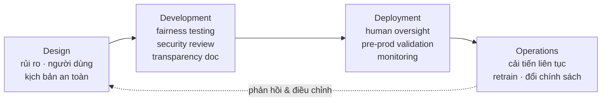
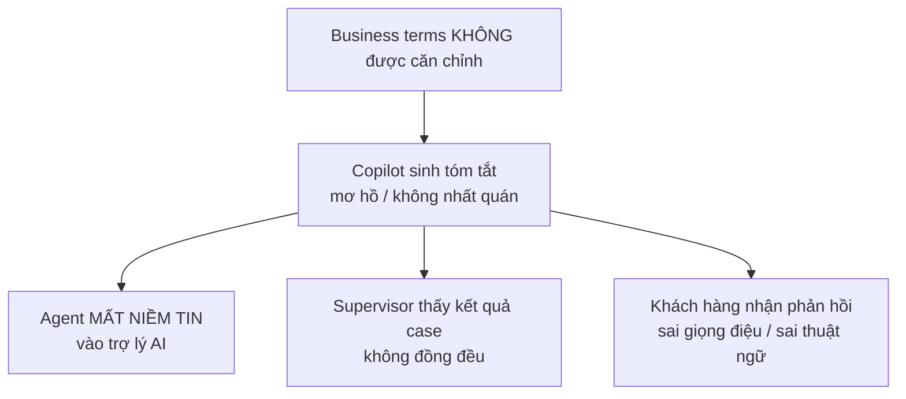
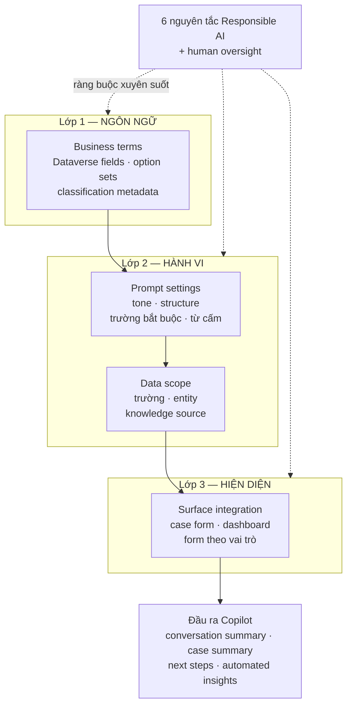

# Note 09 — Copilot trong Dynamics 365 CE & Service: Responsible AI, business terms & tuỳ biến

> [!summary] TL;DR
> Note mở màn cụm **Design (25–30%)**. Ba khối:
> 1. **Sáu nguyên tắc Responsible AI** của Microsoft — *Fairness · Reliability & Safety · Privacy & Security · Inclusiveness · Transparency · Accountability* — và cách rải chúng qua **4 giai đoạn vòng đời** (Design → Development → Deployment → Operations). Câu chốt phải nhớ: **"People — not machines — are responsible for AI outcomes"** (con người chứ không phải máy chịu trách nhiệm về kết quả AI) → đó là nguyên tắc **Accountability**.
> 2. **Business terms** (thuật ngữ nghiệp vụ) — bộ **từ vựng chuẩn hoá** mà tổ chức dùng để mô tả dữ liệu, quy trình và khái niệm, để mọi phòng ban *nói chung một ngôn ngữ*. Trong D365 Customer Service chúng nằm ở **Dataverse fields, option set và classification metadata**; Copilot **đọc thẳng các giá trị này** khi sinh tóm tắt. Business terms sai ⇒ Copilot tóm tắt mơ hồ ⇒ **agent mất niềm tin vào AI**.
> 3. **Bốn vùng tuỳ biến Copilot** trong app D365: **Business terms · Prompt & output · Data scope & field · Surface integration**. Nhớ theo trục: *nói bằng ngôn ngữ gì → nói theo giọng nào → được đọc dữ liệu nào → hiện ra ở đâu*.
>
> Thuật ngữ: **grounding** = "neo" câu trả lời của AI vào dữ liệu thật của tổ chức thay vì để model tự bịa. **Option set** = trường danh sách chọn (dropdown) trong Dataverse. **Dataverse** = kho dữ liệu nền của Power Platform / Dynamics 365.

---

## 1. Sáu nguyên tắc Responsible AI (U1)

Đây là unit đầu tiên của module *Design AI agents* — Microsoft đặt Responsible AI **trước** mọi nội dung thiết kế, hàm ý: **ràng buộc đạo đức là đầu vào của thiết kế, không phải bước rà soát cuối**.

| # | Nguyên tắc | Nội dung nguyên văn (dịch) | Từ khoá nhận diện trong đề |
|---|---|---|---|
| 1 | **Fairness** (Công bằng) | Hệ AI phải **đối xử công bằng với mọi người**; tránh **thiên lệch gây hại** (harmful bias) và bảo đảm kết quả **công bằng giữa các nhóm nhân khẩu** | *equitable outcomes*, *bias*, *demographics* |
| 2 | **Reliability & Safety** (Tin cậy & An toàn) | AI phải chạy tin cậy **cả trong điều kiện dự kiến lẫn ngoài dự kiến**; phải **giám sát liên tục, kiểm định định kỳ**, thiết kế để **ngăn tác hại** | *unexpected conditions*, *validated regularly*, *monitored continuously* |
| 3 | **Privacy & Security** (Riêng tư & Bảo mật) | Bảo vệ **dữ liệu cá nhân**; xử lý dữ liệu theo **giao thức bảo mật nghiêm ngặt** và đáp ứng yêu cầu tuân thủ | *personal data*, *compliance requirements* |
| 4 | **Inclusiveness** (Bao hàm) | AI phải **trao quyền cho mọi người**, không tạo rào cản; **khả năng tiếp cận** (accessibility) và **thiết kế bao hàm** phải được tích hợp vào mọi giải pháp | *avoid creating barriers*, *accessibility* |
| 5 | **Transparency** (Minh bạch) | Người dùng phải **hiểu hệ AI hoạt động ra sao**, **dựa trên dữ liệu nào**, và **quyết định do AI đưa ra được hình thành thế nào** | *how decisions are made*, *builds trust* |
| 6 | **Accountability** (Trách nhiệm giải trình) | **Con người — không phải máy móc — chịu trách nhiệm về kết quả AI.** Tổ chức phải có **guardrail, governance và giám sát của con người** | *people, not machines*, *human oversight* |

`★ Insight ─────────────────────────────────────`
Cặp dễ nhầm nhất trong đề là **Transparency ↔ Accountability**. Mẹo phân biệt bằng **hướng của mũi tên**: *Transparency* hướng **ra ngoài, tới người dùng** — họ *nhìn thấy* AI làm gì. *Accountability* hướng **vào trong, tới tổ chức** — ai *chịu trách nhiệm* khi AI làm sai. Một tình huống nói "người dùng không hiểu vì sao bị từ chối khoản vay" là **Transparency**; tình huống nói "không ai trong công ty đứng ra chịu trách nhiệm cho quyết định của model" là **Accountability**.

Cặp thứ hai: **Fairness ↔ Inclusiveness**. *Fairness* nói về **kết quả** (outcome) — model đối xử với nhóm A và nhóm B như nhau chưa. *Inclusiveness* nói về **khả năng tiếp cận** (access) — người khiếm thị có dùng được giao diện không. Một model cho vay chính xác 100% nhưng chỉ có giao diện tiếng Anh trên desktop là **fair nhưng không inclusive**.
`─────────────────────────────────────────────────`

### 1.1. Rải Responsible AI qua 4 giai đoạn vòng đời

Giáo trình chỉ rõ Responsible AI **không phải một cổng kiểm tra (gate) đặt ở cuối** mà là hoạt động chạy suốt vòng đời:

| Giai đoạn | Việc phải làm |
|---|---|
| **During Design** | Xác định **rủi ro**, **người dùng dự kiến**, và **các kịch bản an toàn** |
| **During Development** | **Fairness testing** (kiểm thử thiên lệch) · **security review** · **transparency documentation** (tài liệu hoá cách hệ hoạt động) |
| **During Deployment** | Bố trí **human oversight** (giám sát của con người) · **pre-production validation** (kiểm định trước khi lên production) · triển khai **monitoring** |
| **During Operations** | **Cải tiến liên tục** dựa trên cách dùng thực tế, nhu cầu **retrain** (huấn luyện lại) và thay đổi chính sách; giữ AI **luôn khớp với giá trị nghiệp vụ và chuẩn đạo đức** |

> 💡 **Nối với các note khác:** phần lý thuyết Responsible AI chuyên sâu (content filter, red teaming, prompt manipulation) nằm ở [[24-Governance-Data-Residency-va-Responsible-AI]] và [[../AI-103/04-Toi-uu-Model-va-Responsible-GenAI]]. Ở đây chỉ cần thuộc **6 tên nguyên tắc + 4 giai đoạn** vì đó là mức đề AB-100 hỏi trong cụm Design.

---

## 2. Business terms cho Copilot trong D365 Customer Service (U2)

### 2.1. Định nghĩa và vấn đề nó giải quyết

> **Business terms** trong Dynamics 365 Customer Experience = **bộ từ vựng chuẩn hoá** (standardized vocabulary) mà tổ chức dùng để mô tả **dữ liệu, quy trình và khái niệm**, nhằm bảo đảm mọi bộ phận — *sales, service, marketing, IT, leadership* — **nói chung một ngôn ngữ**. Chúng giữ tính nhất quán xuyên suốt **Dataverse, customer journey, analytics, tích hợp và governance**.

Chuỗi hậu quả khi business terms **không được căn chỉnh** — đây là chuỗi nhân quả đề hay hỏi:

**Vị trí lưu trữ (quan trọng — đề hay hỏi "business terms nằm ở đâu"):** trong D365 Customer Service, business terms chủ yếu nằm ở **Dataverse fields · option set · classification metadata**. **Copilot đọc trực tiếp các giá trị này** khi sinh tóm tắt và khuyến nghị.

Business terms giúp Copilot **4 việc**: dùng đúng ngôn ngữ trong tóm tắt · diễn giải thông tin dịch vụ **chính xác hơn** · tăng **rõ ràng và nhất quán** giữa các team · **căn chỉnh nội dung AI sinh ra** với quy tắc nghiệp vụ, thuật ngữ và yêu cầu tuân thủ.

### 2.2. Business terms gồm những gì — và Copilot dùng chúng ở đâu

Business terms cho phép Copilot phản ánh **"voice of your organization"** (tiếng nói của tổ chức):

| Loại business term | Ví dụ |
|---|---|
| **Product names** | Tên sản phẩm/dịch vụ nội bộ |
| **Service categories** | Phân loại dịch vụ |
| **Internal terminology** | **SLA tiers** (bậc cam kết dịch vụ), **service channels** (kênh phục vụ) |
| **Department / team names** | Tên phòng ban, đội |
| **Case classifications & outcome terms** | Phân loại vụ việc và thuật ngữ kết quả xử lý |

Copilot tham chiếu chúng khi sinh **4 loại đầu ra**: **conversation summaries** (tóm tắt hội thoại) · **case summaries** (tóm tắt vụ việc) · **automated insights hiển thị trên form tuỳ biến** · **recommendations and next steps** (khuyến nghị & bước tiếp theo).

### 2.3. Bảng chuẩn: loại business term ↔ mục đích trong Copilot

| Business Term Type | Mục đích trong Copilot |
|---|---|
| **Product / Service Names** | Cải thiện **khả năng hiểu vấn đề của khách hàng** |
| **Case Fields** (priority, category) | **Cấp liệu cho case summary** |
| **Organizational Terms** | Tăng **độ chính xác khi trợ giúp agent** |
| **Resolution Vocabulary** | Hỗ trợ **hướng dẫn bước tiếp theo** và **kết quả xử lý case** |
| **Customer Segments** | **Điều chỉnh insight theo hồ sơ khách hàng** |

### 2.4. Cấu hình business terms trong D365 Copilot

**Bước A — Bật tính năng Copilot.** Admin bật từ **Customer Service admin center > Copilot**. Bật xong sẽ kích hoạt **5 năng lực**:

- Conversation summaries
- Case summaries
- Draft email replies (soạn nháp email trả lời)
- Knowledge article suggestions (gợi ý bài viết tri thức)
- Real-time agent assistance (trợ giúp agent thời gian thực)

**Điều kiện tiên quyết (prerequisites) — 4 mục:** **licensing đúng** · **security role bắt buộc** · môi trường **Customer Service workspace** · **dữ liệu sẵn có để grounding**.

**Bước B — Quản lý các trường dùng cho tóm tắt.** Copilot phụ thuộc **đúng trường** để tóm tắt. Bạn có thể:
1. **Chọn** trường nào Copilot được tham chiếu khi sinh tóm tắt
2. **Loại trừ** trường không liên quan tới nghiệp vụ
3. Bảo đảm các trường **phản ánh đúng business term và phân loại**

> Ví dụ nguyên văn của giáo trình: nếu tổ chức dùng trường tuỳ biến tên **`Issue Type`**, bạn có thể **map trường này** để Copilot đưa nó vào case summary. Ngược lại, các **legacy field** (trường cũ) không còn phản ánh quy trình hiện tại thì **loại trừ đi**.

**Bốn hậu quả nếu business terms không được định nghĩa / map đúng** — Copilot sẽ:
- Hiểu **sai phân loại case**
- Dùng **thuật ngữ lỗi thời**
- Sinh tóm tắt **không khớp quy trình nội bộ**
- **Khuyến nghị sai bước tiếp theo**

### 2.5. Tuỳ biến conversation summary: Paragraph ↔ Structured ⭐

Đây là **bảng phân biệt đắt giá nhất** của unit này:

| Tiêu chí | **Paragraph Format** | **Structured Format** |
|---|---|---|
| **Hình thức** | Một **đoạn văn liền mạch, gắn kết** | Chia thành các **mục định sẵn**: *Customer Issue · Actions Taken · Pending Items · Next Steps · Resolution Status* |
| **Admin điều khiển được gì** | Ít — chủ yếu là giọng văn | **Chọn được trường và điểm dữ liệu nào** Copilot phải đưa vào |
| **Hợp với tổ chức nào** | Thích **tóm tắt kiểu tường thuật**, dùng **ghi chú tự do** (free-form notes) | Có **chuẩn tài liệu hoá nghiêm ngặt** hoặc thuộc **ngành chịu quản lý** (regulated industries) |
| **Điểm mạnh** | **Đọc nhanh** khi escalate (chuyển cấp), agent cần nắm tổng quan tức thì | **Nhất quán giữa các agent**, **giảm sai khác** trong cách ghi chép |
| **Yêu cầu về agent** | Agent phải **được đào tạo để đọc hiểu tóm tắt phi cấu trúc** | Không cần — cấu trúc tự dẫn dắt |

`★ Insight ─────────────────────────────────────`
Bảng này là một ví dụ hay của **"đánh đổi tốc độ đọc lấy tính nhất quán"**. Paragraph nhanh hơn cho *một người đang vội*; Structured tốt hơn cho *một tổ chức muốn so sánh được giữa các case*. Đề AB-100 rất hay ra dạng "ngân hàng/bảo hiểm cần chứng minh tuân thủ khi audit" → đáp án luôn là **Structured**, vì nó khoá được **trường bắt buộc** và **giảm variability** — hai thứ auditor cần.

Chi tiết dễ bị bỏ qua: chỉ **Structured** mới cho admin *"select which fields and data points Copilot should include"*. Nghĩa là chọn Paragraph là **từ bỏ quyền kiểm soát nội dung tóm tắt** — một quyết định kiến trúc, không chỉ là lựa chọn thẩm mỹ.
`─────────────────────────────────────────────────`

**Cấu hình business term mà Copilot nhấn mạnh — 4 việc:** map các trường chủ chốt (*Issue Type, Product Line, Service Tier*) · bảo đảm **option set dùng thuật ngữ rõ ràng, chuẩn hoá** · **ưu tiên các trường phản ánh cách tổ chức phân loại case** · **gỡ bỏ thuật ngữ lỗi thời hoặc không dùng** vì chúng gây nhiễu cho Copilot.

**Tuỳ biến cách diễn đạt bước tiếp theo & kết quả — 4 việc:** định nghĩa **cách diễn đạt ưu tiên cho next steps** · căn ngôn ngữ theo **SLA nội bộ hoặc yêu cầu tuân thủ** · bảo đảm tóm tắt phản ánh **giọng điệu và tính chuyên nghiệp** kỳ vọng trong giao tiếp khách hàng · củng cố **ngôn ngữ bàn giao nhất quán** giữa frontline agent và đội escalation.

### 2.6. Hiển thị đầu ra Copilot trên form tuỳ biến

Mục tiêu: đưa insight AI **đúng thời điểm trong luồng công việc**, để agent **không phải chuyển màn hình**.

| Nơi hiển thị | Làm gì | Phù hợp với ai |
|---|---|---|
| **Custom case forms** | Thêm **trường summary của Copilot** thẳng vào form case tuỳ biến; hiển thị conversation summary, case summary, hoặc recommended next steps **cạnh dữ liệu case chuẩn** | Tổ chức có layout case **tuỳ biến nặng** hoặc có **trường đặc thù ngành** |
| **Agent dashboards** | Đưa tóm tắt lên dashboard dùng cho **triage, quản lý hàng đợi (queue), giám sát của supervisor**; cho thấy nhanh tương tác gần đây, vấn đề nổi bật xuyên nhiều case, xu hướng **sentiment/chủ đề** | **Supervisor** cần đánh giá nhanh chất lượng case và **khối lượng việc của agent** |
| **Role-specific service forms** | Điều chỉnh đầu ra Copilot **theo vai trò**: Tier 1 agent · đội escalation · supervisor | Mỗi vai trò thấy **mức chi tiết phù hợp trách nhiệm**; hỗ trợ **bàn giao hiệu quả**, agent **không phải đọc lại transcript dài** |

### 2.7. Sáu best practice thiết kế business terms

1. Dùng **tên gọi nhất quán xuyên các phòng ban**
2. **Tránh viết tắt** trừ khi nội bộ ai cũng hiểu
3. **Căn thuật ngữ theo trường CRM** dùng trong phân loại case
4. **Rà soát và cập nhật định kỳ** để giữ độ chính xác
5. Bảo đảm business terms **phản ánh ngôn ngữ khách hàng thực sự dùng** trong hội thoại
6. **Xác lập quyền sở hữu (ownership)** cho việc duy trì business terms xuyên phòng ban

> ⭐ Best practice **1 và 5 kéo về hai hướng ngược nhau** — nội bộ muốn thuật ngữ chuẩn hoá, khách hàng lại nói ngôn ngữ đời thường. Đây chính là lý do phải có **synonym / alternate phrasing**: business term chuẩn dùng để *lưu trữ và phân loại*, còn ngôn ngữ khách hàng dùng để *nhận diện ý định*. Best practice 6 (ownership) là thứ giữ cho hai bên không trôi khỏi nhau theo thời gian — liên hệ vai trò **data owner / steward** ở [[07-Solution-Rules-Vai-tro-va-AI-CoE]].

---

## 3. Bốn vùng tuỳ biến Copilot trong app D365 (U3)

Copilot trong D365 Sales và Customer Service giúp: **sinh phản hồi và tóm tắt · trích insight từ hồ sơ khách hàng · gợi ý hành động tiếp theo · trợ giúp agent trong lúc phục vụ · tạo email và follow-up tuỳ biến**.

Tuỳ biến cho phép **điều chỉnh hành vi Copilot ở 4 vùng**:

| # | Vùng tuỳ biến | Điều chỉnh cái gì | Câu hỏi định hướng |
|---|---|---|---|
| 1 | **Business terms & domain language** | Tên sản phẩm/dịch vụ · **case category & resolution type** · **SLA tier / mức dịch vụ nội bộ** · vai trò & thuật ngữ tổ chức · **từ vựng theo vùng hoặc theo thương hiệu** | *Copilot nói bằng **ngôn ngữ** gì?* |
| 2 | **Prompt & output customization** | **Tone** (chuyên nghiệp, súc tích, đồng cảm) · **Structure** (gạch đầu dòng, summary + next steps) · **trường bắt buộc Copilot phải dùng** · **thuật ngữ nhạy cảm cần tránh** | *Copilot nói theo **giọng** nào?* |
| 3 | **Data scope & field configuration** | Trường case đưa vào tóm tắt · **thực thể CRM Copilot được tham chiếu** · nguồn **knowledge article** · trường contact & account · phần tử **interaction timeline** | *Copilot được **đọc** gì?* |
| 4 | **Surface integration** | Case form · conversation window · customer timeline · knowledge view · agent dashboard | *Copilot **hiện ra ở đâu**?* |

Prompt định hình cách Copilot sinh: **email drafts · case summaries · conversation summaries · customer recommendations · actionable next steps**.

### 3.1. Bảng chuẩn: vùng tuỳ biến ↔ tác động lên trải nghiệm khách hàng ⭐

| Customization Area | Mục đích | Tác động lên **customer experience** |
|---|---|---|
| **Business Terms** | Căn Copilot theo **ngôn ngữ nội bộ** | Tăng **độ chính xác và niềm tin** vào đầu ra |
| **Prompt Settings** | Điều khiển **tone, cấu trúc, định dạng** | Bảo đảm **nhất quán và đúng chuẩn thương hiệu** |
| **Data Scope** | Định nghĩa **Copilot được tham chiếu gì** | Sinh insight **liên quan, đúng ngữ cảnh** |
| **Surface Integration** | Quyết định **Copilot xuất hiện ở đâu** | Tăng **hiệu suất agent**, **giảm chuyển ngữ cảnh** (context switching) |

`★ Insight ─────────────────────────────────────`
Cột thứ ba của bảng này là thứ đề hay khai thác, vì nó **ánh xạ mỗi lựa chọn kỹ thuật sang một kết quả nghiệp vụ đo được** — đúng vai trò solution architect. Đọc theo cột: *Business Terms → trust* · *Prompt → brand consistency* · *Data Scope → relevance* · *Surface → efficiency*.

Chú ý **Data Scope là con dao hai lưỡi**: best practice bên dưới nói **"limit data scope"** (giới hạn phạm vi dữ liệu) *để tăng độ chính xác và giảm nhiễu* — trái với trực giác "cho AI càng nhiều dữ liệu càng tốt". Nguyên nhân: mỗi trường thừa vừa làm loãng ngữ cảnh, vừa mở rộng bề mặt rủi ro quyền riêng tư. Nguyên tắc này lặp lại y hệt ở **agent context** của Contact Center ([[10-Connectors-va-Contact-Center]]) và ở giới hạn **5 nguồn phi cấu trúc** của Copilot Studio ([[06-Nguon-tri-thuc-Prompt-Library-va-SLM]]) — **"ít mà sạch thắng nhiều mà nhiễu"** là một chủ đề xuyên suốt AB-100.
`─────────────────────────────────────────────────`

### 3.2. Sáu best practice tuỳ biến Copilot

| # | Best practice | Diễn giải |
|---|---|---|
| 1 | **Start with agent workflows** | Bắt đầu từ **luồng làm việc của agent** — tuỳ biến những tính năng làm giảm **ma sát trong kịch bản thực tế**, không tuỳ biến theo ý thích |
| 2 | **Keep business terms consistent** | Nhất quán **xuyên team và phòng ban** |
| 3 | **Review Copilot outputs regularly** | Rà **giọng điệu, độ chính xác, mức khớp chuẩn thương hiệu** |
| 4 | **Limit data scope** | Chỉ mở **các trường cần thiết** → **chính xác hơn, ít nhiễu hơn** |
| 5 | **Update prompts** | Cập nhật prompt **khi chiến lược customer experience thay đổi** |
| 6 | **Enable human oversight** | Agent **luôn phải kiểm chứng** nội dung do AI sinh |

> Best practice 6 chính là nguyên tắc **Accountability** ở §1 hạ xuống mức thao tác hằng ngày. Đề AB-100 rất hay nối hai tầng này: cho một tình huống vận hành rồi hỏi *"nguyên tắc Responsible AI nào đang được áp dụng?"*.

---

## 4. Tổng hợp: ba lớp căn chỉnh Copilot với tổ chức

> 💡 Sơ đồ này bắt chước có chủ ý cách **dải "Responsible AI principles" chạy ngang dưới cả 6 pha CAF** ở [[04-CAF-cho-AI-va-Vong-doi-Agent]] — cùng một thông điệp kiến trúc lặp lại ở cấp giải pháp: Responsible AI là **nền**, không phải **một bước**.

---

## Câu hỏi phỏng vấn

> [!question] Business terms được lưu ở đâu trong Dynamics 365 Customer Service, và vì sao vị trí đó lại quan trọng?
> Ở **Dataverse fields, option set và classification metadata**. Quan trọng vì **Copilot đọc trực tiếp các giá trị này** khi sinh tóm tắt và khuyến nghị — nghĩa là business term **không phải một tài liệu từ điển để tra cứu**, mà là **dữ liệu sống trong hệ thống**. Hệ quả thực tế: muốn sửa cách Copilot diễn đạt, bạn sửa **cấu hình dữ liệu** (option set, tên trường), chứ không phải sửa prompt.

> [!question] Khách hàng trong ngành bảo hiểm yêu cầu mọi tóm tắt case phải chứng minh được khi audit. Bạn chọn định dạng conversation summary nào và vì sao?
> **Structured Format.** Ba lý do: (1) nó chia tóm tắt thành **mục định sẵn** — *Customer Issue, Actions Taken, Pending Items, Next Steps, Resolution Status* — nên mỗi case đều có cùng bộ khung để đối chiếu; (2) chỉ Structured mới cho admin **chọn trường và điểm dữ liệu bắt buộc** phải có mặt, tức khoá được nội dung tối thiểu; (3) nó **giảm variability giữa các agent**, thứ mà auditor luôn soi. Paragraph format nhanh hơn khi escalate nhưng **từ bỏ quyền kiểm soát nội dung**, không hợp ngành chịu quản lý.

> [!question] Vì sao best practice lại khuyên **giới hạn** data scope, trong khi trực giác nói cho AI càng nhiều dữ liệu càng tốt?
> Vì mỗi trường thừa gây **hai loại thiệt hại**. Về chất lượng: dữ liệu không liên quan **làm loãng ngữ cảnh**, khiến model bám vào tín hiệu nhiễu → tóm tắt kém chính xác. Về rủi ro: mỗi trường mở thêm là một **bề mặt lộ dữ liệu cá nhân**, làm nặng nghĩa vụ privacy/compliance. Đây là cùng một nguyên tắc **least privilege** áp cho dữ liệu, và nó lặp lại ở agent context của Contact Center (*"only the needed attributes should be included"*).

> [!question] Copilot của khách hàng đang tóm tắt case bằng thuật ngữ đã bỏ từ 2 năm trước. Bạn chẩn đoán từ đâu?
> Từ **business term mapping**, không phải từ model. Giáo trình liệt kê đúng triệu chứng này trong "4 hậu quả khi business terms không được map đúng": **dùng thuật ngữ lỗi thời**. Việc cần làm: rà **legacy field** không còn phản ánh quy trình và **loại trừ** chúng khỏi phạm vi tóm tắt; rà **option set** xem có giá trị cũ còn tồn tại; rồi thiết lập **ownership** để có người chịu trách nhiệm rà soát định kỳ — chính là best practice 4 và 6.

> [!question] Phân biệt Transparency và Accountability trong 6 nguyên tắc Responsible AI.
> **Transparency** hướng **ra ngoài**: người dùng hiểu được hệ hoạt động thế nào, dựa trên dữ liệu nào, quyết định hình thành ra sao — mục tiêu là **xây dựng niềm tin**. **Accountability** hướng **vào trong**: *"People — not machines — are responsible for AI outcomes"*; tổ chức phải có **guardrail, governance và human oversight**. Nói ngắn: Transparency trả lời *"AI làm gì?"*, Accountability trả lời *"ai chịu trách nhiệm khi AI làm sai?"*.

---

## Tự kiểm tra

1. Kể đủ **6 nguyên tắc Responsible AI** của Microsoft. Nguyên tắc nào chứa câu *"people, not machines"*?
2. Bốn giai đoạn vòng đời áp Responsible AI, mỗi giai đoạn làm gì?
3. Định nghĩa **business terms** trong D365 Customer Experience — nó bảo đảm tính nhất quán xuyên những vùng nào?
4. Business terms được **lưu ở đâu** trong D365 Customer Service?
5. Ba hậu quả khi business terms không được căn chỉnh?
6. Năm loại business term và tác dụng tương ứng trong Copilot?
7. Bật Copilot ở đâu, kích hoạt **5 năng lực** nào, và **4 prerequisite** là gì?
8. Bốn hậu quả nếu business terms **không được map đúng**?
9. So sánh **Paragraph ↔ Structured** conversation summary: 5 mục cấu trúc của Structured là gì? Định dạng nào cho admin chọn trường?
10. Ba nơi hiển thị đầu ra Copilot và mỗi nơi phục vụ vai trò nào?
11. Sáu best practice thiết kế business terms — cặp nào **kéo ngược nhau** và giải quyết ra sao?
12. **Bốn vùng tuỳ biến** Copilot trong app D365, mỗi vùng trả lời câu hỏi nào?
13. Trong bảng "customization area ↔ impact", vùng nào cho tác động **giảm context switching**?
14. Vì sao best practice khuyên **limit data scope**?

## Liên quan
- [[00-MOC-AB100]] — MOC bộ AB-100
- [[10-Connectors-va-Contact-Center]] — tiếp nối: connector cho D365 Sales & agent cho Contact Center
- [[03-Phan-tich-yeu-cau-va-Du-lieu-Grounding]] — 5 chiều chất lượng dữ liệu grounding, nền của mọi tóm tắt Copilot
- [[07-Solution-Rules-Vai-tro-va-AI-CoE]] — vai trò **data owner / steward** sở hữu business terms
- [[24-Governance-Data-Residency-va-Responsible-AI]] — Responsible AI ở mức giải pháp và tuân thủ
- [[../AI-103/04-Toi-uu-Model-va-Responsible-GenAI]] — Responsible AI bản kỹ thuật (content filter, đánh giá)
- [[../../../00-Foundations/07-GitHub-Copilot/01-Responsible-AI-voi-Copilot]] — cùng 6 nguyên tắc, góc nhìn công cụ lập trình
