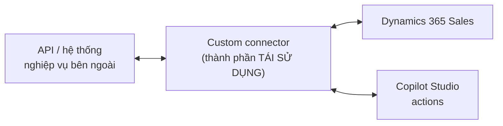
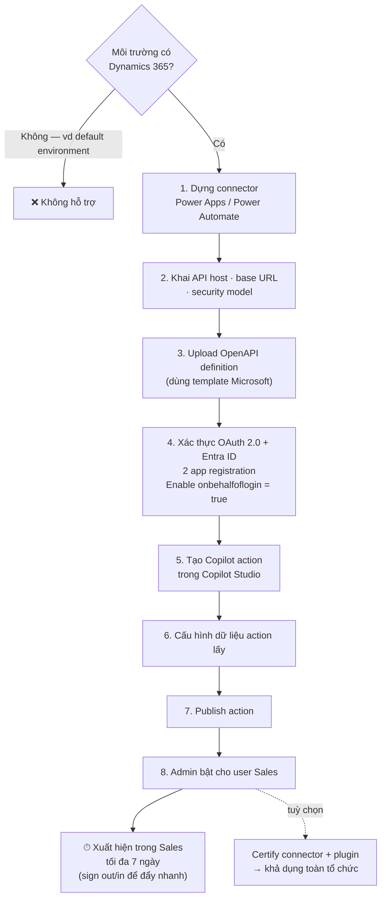
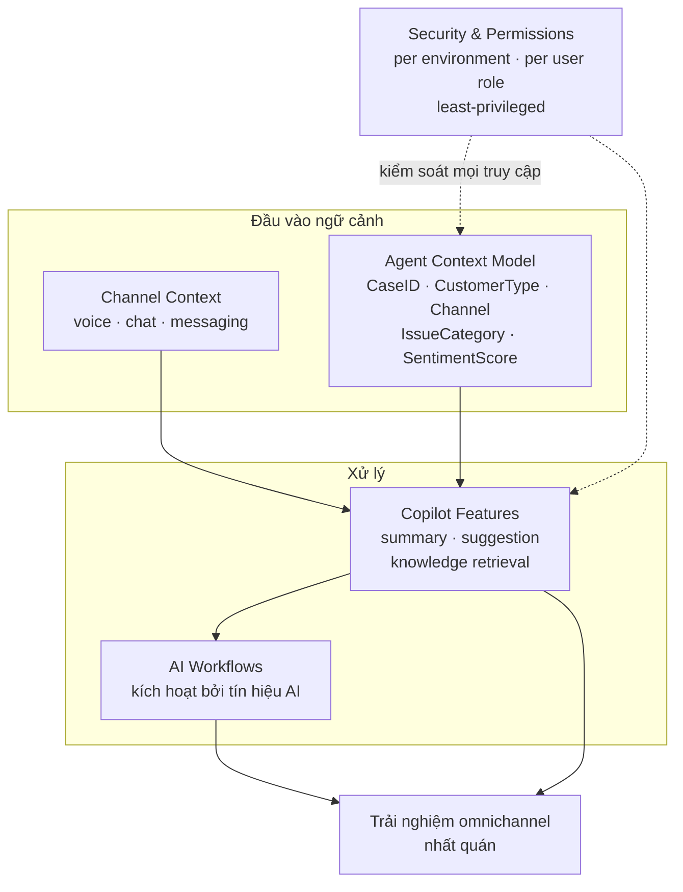

# Note 10 — Custom connector cho D365 Sales & AI agent cho Contact Center

> [!summary] TL;DR
> Hai chủ đề tích hợp:
> 1. **Custom connector** (bộ nối tuỳ biến) = **cây cầu** giữa *API/hệ thống ngoài* ↔ *Dynamics 365 Sales* ↔ *action của Copilot Studio*. Đường đi bắt buộc: **dựng connector từ Power Apps/Power Automate → xác thực OAuth 2.0 + Microsoft Entra ID (hai app registration) → tạo Copilot action → publish → nhờ admin bật cho người dùng Sales**. Ba con số/cờ phải nhớ: **`Enable onbehalfoflogin = true`** để bật OBO token, action mất **tối đa 7 ngày** mới xuất hiện trong Sales (đăng xuất/đăng nhập lại để đẩy nhanh), và connector **bắt buộc dựng trong môi trường đã bật Dynamics 365** — **default environment KHÔNG được hỗ trợ**.
> 2. **AI agent cho Dynamics 365 Contact Center** — nền tảng hợp nhất cho **voice, chat, messaging và kênh số**. Thiết kế xoay quanh ba khối: **channel context** (kênh nào) · **agent context** (dữ liệu cấu trúc để grounding) · **Copilot features** (tóm tắt, gợi ý, tra cứu tri thức). Nguyên tắc vàng của agent context: **chỉ phơi ra thuộc tính thật sự cần** — để tăng độ chính xác, giảm nhiễu và đạt chuẩn riêng tư.
>
> Thuật ngữ: **OAuth 2.0** = chuẩn uỷ quyền để một ứng dụng gọi API thay mặt người dùng mà không cần biết mật khẩu. **OBO (on-behalf-of) token** = token cho phép dịch vụ backend gọi tiếp API khác **nhân danh chính người dùng đang đăng nhập**, giữ nguyên danh tính thay vì dùng danh tính hệ thống. **App registration** = bản đăng ký ứng dụng trong Microsoft Entra ID, nơi khai báo danh tính và quyền của app. **OpenAPI definition** = tệp mô tả chuẩn hoá các endpoint của một REST API.

---

## Phần 1 — Custom connector cho Copilot trong Dynamics 365 Sales (U4)

### 1.1. Connector giải quyết vấn đề gì

Copilot trong D365 Sales **mạnh hơn hẳn khi được nối với nguồn dữ liệu bên ngoài**. Custom connector cho phép tổ chức **mở rộng luồng công việc Sales bằng chính API của mình**, mang lại insight phong phú hơn và tự động hoá sâu hơn.

> ⚠️ **Trạng thái tính năng:** giáo trình ghi rõ đây là **"production ready preview"** — bản xem trước nhưng đã sẵn sàng cho production. Chi tiết này đáng nhớ vì đề hay hỏi về **mức độ sẵn sàng** khi tư vấn khách hàng.

Tính năng cho phép developer và solution architect làm **4 việc**:
1. Dựng custom connector bằng **Power Apps** hoặc **Power Automate**
2. Dùng **Microsoft Entra ID (OAuth 2.0)** để xác thực an toàn
3. Tạo **Copilot action** tiêu thụ connector đó
4. **Publish** và **bật** các action này cho người dùng Sales

### 1.2. Connector là cây cầu ba nhịp

Điểm cần nhớ: connector trở thành **thành phần tái sử dụng được** (reusable component) để mở rộng trải nghiệm Sales bằng insight dựa trên dữ liệu — nghĩa là **dựng một lần, dùng cho nhiều action**.

### 1.3. Quy trình dựng — từng bước

**Yêu cầu môi trường (environment requirements) — điểm bẫy kinh điển:**

| Yêu cầu | Chi tiết |
|---|---|
| ✅ **Bắt buộc** | Connector phải được tạo trong **môi trường đã bật ứng dụng Dynamics 365** |
| ❌ **KHÔNG hỗ trợ** | Môi trường **không có Dynamics 365** — ví dụ **default environment** (môi trường mặc định của tenant) |

**Ba bước tạo connector:**
1. **Dựng connector** từ Power Apps hoặc Power Automate
2. Cung cấp **API host, base URL và security model**
3. **Tải lên OpenAPI definition** — Microsoft có cung cấp **template** sẵn

### 1.4. Xác thực & bảo mật ⭐

| Hạng mục | Quy định |
|---|---|
| **Giao thức** | **OAuth 2.0** |
| **Nhà cung cấp danh tính** | **Microsoft Entra ID** |
| **Backend nhận gì** | Backend service **nhận Entra ID token** |
| **Số app registration** | **HAI** — connector và backend phụ thuộc **hai app registration** để trao đổi token an toàn |
| **Bật OBO** | Để bật **xác thực tự động (OBO token)** cho plugin, đặt **`Enable onbehalfoflogin = true`** |

`★ Insight ─────────────────────────────────────`
Vì sao phải **hai** app registration chứ không phải một? Vì luồng OAuth ở đây có **hai ranh giới tin cậy** khác nhau: một cho **connector** (thứ mà Power Platform gọi) và một cho **backend API** (thứ nhận token). Tách đôi cho phép cấp quyền độc lập cho từng bên — connector chỉ được phép *xin token cho backend*, còn backend tự khai báo scope mà nó chấp nhận. Nếu gộp một, bạn mất khả năng thu hồi quyền của một bên mà không ảnh hưởng bên kia.

Cờ **`Enable onbehalfoflogin = true`** là chi tiết đắt giá nhất unit này, vì nó quyết định **danh tính nào chạm vào dữ liệu**. Bật OBO ⇒ backend gọi API tiếp theo **nhân danh chính người dùng cuối**, nên quyền của người dùng (RBAC, row-level security) **vẫn được áp dụng**. Không bật ⇒ dịch vụ chạy bằng danh tính riêng của nó, và người dùng có thể **nhìn thấy dữ liệu vượt quá quyền của họ** — một lỗi bảo mật thầm lặng mà cấu hình vẫn "chạy được". Nguyên tắc này lặp lại ở [[23-Bao-mat-Agent-Model-va-Access-Control]] dưới tên **least-privilege / identity per agent**.
`─────────────────────────────────────────────────`

### 1.5. Publish connector action trong Copilot Studio

Sau khi tạo connector, làm **4 bước**:
1. **Tạo Copilot action** dùng connector đó
2. **Cấu hình** action lấy dữ liệu gì
3. **Publish** action
4. **Yêu cầu admin bật** action cho người dùng Sales

> **Action quyết định Copilot được phép làm thao tác gì** với connector — ví dụ lấy insight từ nguồn ngoài.

> ⚠️ **Độ trễ hiển thị:** action có thể mất **tới 7 ngày** mới xuất hiện trong trải nghiệm Sales. Người dùng có thể **đăng xuất rồi đăng nhập lại để đẩy nhanh quá trình ingest**. → Đây là con số đề rất hay hỏi, và cũng là thứ **phải báo trước cho khách hàng** khi lập kế hoạch triển khai.

### 1.6. Governance, tuân thủ & chứng nhận

**Trách nhiệm của admin** — bảo đảm connector action tuân thủ chính sách tổ chức, với **hai rủi ro cụ thể**:

| Rủi ro | Nội dung |
|---|---|
| **Điều khoản bên thứ ba** | Nguồn dữ liệu ngoài có thể kèm **điều khoản và chính sách riêng tư của bên thứ ba** |
| **Lan toả dữ liệu** | Dữ liệu từ connector **trở nên truy cập được bên trong các trải nghiệm Microsoft 365** |

**Certification (tuỳ chọn):** để connector khả dụng **toàn tổ chức**, hãy **chứng nhận cả connector lẫn plugin**.

> ⭐ Rủi ro thứ hai là điểm đắt giá về mặt kiến trúc: nối một API ngoài vào Copilot **không chỉ là một tích hợp kỹ thuật** — nó **đưa dữ liệu bên ngoài vào trong vành đai Microsoft 365**, nơi dữ liệu đó có thể xuất hiện trong tóm tắt, email nháp, kết quả tìm kiếm. Vì vậy quyết định "có nối không" là **quyết định governance**, phải qua rà soát chứ không để maker tự quyết. Xem thêm DLP và sensitivity label ở [[24-Governance-Data-Residency-va-Responsible-AI]].

### 1.7. Bảng chuẩn: tổng quan thiết kế connector

| Area | Key Considerations |
|---|---|
| **Environment** | Phải có **Dynamics 365 Sales** |
| **Authentication** | **OAuth 2.0 + Microsoft Entra ID** |
| **Security** | **Hai app registration**; **OBO login** tuỳ chọn |
| **Connector Actions** | Tạo & quản lý trong **Copilot Studio** |
| **Admin Enablement** | **Bắt buộc** để hiển thị trong Sales |
| **Compliance** | Rà soát **việc dùng dữ liệu bên thứ ba** |
| **Certification** | **Tuỳ chọn**, để khả dụng rộng trong tenant |

### 1.8. Toàn cảnh luồng dựng connector

---

## Phần 2 — Thiết kế AI agent cho Dynamics 365 Contact Center (U5)

### 2.1. Contact Center là gì và AI agent đóng góp gì

**Dynamics 365 Contact Center** = nền tảng **hợp nhất, thông minh** để tương tác khách hàng xuyên **voice, chat, messaging và kênh số**.

AI agent tích hợp vào Contact Center giúp tổ chức **4 việc**: phản hồi **nhanh và chính xác** · **giảm tải cho agent người** · mang lại **trải nghiệm khách hàng nhất quán** · **hiển thị insight theo ngữ cảnh và hành động khuyến nghị**.

> Để thiết kế hiệu quả, phải hiểu **ba thứ phối hợp với nhau**: **channel context** (ngữ cảnh kênh) · **agent context** (ngữ cảnh agent) · **Copilot features**.

### 2.2. Bốn kênh và cơ hội tích hợp AI ⭐

| Channel | AI Integration Opportunity |
|---|---|
| **Voice** (thoại) | **Tóm tắt cuộc gọi thời gian thực**, **phiên âm cuộc gọi** (transcription), **trích xuất ý định** (intent extraction), **hành động tự động** |
| **Live Chat** | **Gợi ý câu trả lời**, trả lời theo ngữ cảnh, **tra cứu bài viết tri thức**, **kích hoạt escalation** |
| **Digital Messaging** (SMS, WhatsApp) | **Luồng hội thoại tự động**, **định tuyến** (routing), **phát hiện sắc thái cảm xúc** (sentiment detection) |
| **Omnichannel Widget** | **Trợ lý AI nhúng** cung cấp hướng dẫn luồng công việc và insight khách hàng |

`★ Insight ─────────────────────────────────────`
Bảng này không phải danh sách tính năng ngẫu nhiên — nó phản ánh **ràng buộc vật lý của từng kênh**, và đó là lý do đề hỏi được.

**Voice** là kênh *tuyến tính và phù du*: âm thanh trôi qua, không cuộn lại đọc được → AI phải làm **transcription + summarization**, tức *chuyển kênh thời gian sang kênh văn bản*. **Live Chat** *đồng bộ nhưng có văn bản sẵn* → AI dồn sức vào **giảm thời gian gõ** (suggested replies) và **tra cứu tri thức**. **Digital Messaging** *bất đồng bộ, câu ngắn, ngắt quãng* → không thể trông chờ hội thoại liền mạch, nên AI làm **định tuyến và phát hiện cảm xúc** để biết ca nào cần người can thiệp. **Omnichannel Widget** không phải kênh khách hàng mà là **bề mặt của nhân viên** → AI ở đây hướng dẫn *quy trình*, không đối thoại với khách.

Nắm được logic này thì không cần học thuộc bảng: gặp câu hỏi "kênh X nên dùng năng lực AI nào", cứ hỏi *"kênh này thiếu gì?"* rồi chọn năng lực bù vào chỗ thiếu.
`─────────────────────────────────────────────────`

**AI agent tham gia vào tương tác bằng 4 cách:** quan sát và hiểu **nội dung hội thoại** · truy cập **ngữ cảnh khách hàng và case** · dùng **luồng công việc cấu hình sẵn để tự động hoá hành động** · cấp **gợi ý do Copilot sinh cho agent người**.

### 2.3. Thiết kế agent context

> **Agent context** = tập **dữ liệu có cấu trúc** báo cho AI agent biết về bối cảnh cuộc tương tác.

**Sáu thành phần của agent context:**

| Thành phần | Nội dung |
|---|---|
| **Customer identity** | Danh tính khách hàng |
| **Case history** | Lịch sử vụ việc |
| **Current channel** | Kênh đang dùng |
| **Conversation transcript** | Bản ghi hội thoại |
| **Routing queues & priority** | Hàng đợi định tuyến và mức ưu tiên |
| **Skills & preferences** | Kỹ năng và tuỳ chọn |

**Ba bước cấu hình agent context:**

1. **Define entity types** — định nghĩa loại thực thể, ví dụ *Customer · Case · Product · Subscription*
2. **Map agent context fields** — ánh xạ trường, ví dụ **`CaseID` · `CustomerType` · `Channel` · `IssueCategory` · `SentimentScore`**
3. **Expose the right data to the agent** — **chỉ đưa vào những thuộc tính cần thiết** để **tăng độ chính xác, giảm nhiễu và đáp ứng chuẩn riêng tư**

> ⭐ Bước 3 là **cùng một nguyên tắc "limit data scope"** đã gặp ở [[09-Copilot-trong-Dynamics-365-CE-va-Service]] §3.2, lần này phát biểu với **ba lý do rõ ràng**: *accuracy · noise · privacy*. Nhớ bộ ba này — đề hay hỏi "vì sao chỉ phơi ra thuộc tính cần thiết".

### 2.4. Bật các tính năng Copilot

Copilot nâng hiệu năng agent bằng **5 năng lực**:

| Năng lực | Mô tả |
|---|---|
| **Conversation summaries** | Bản tóm lược **được cấu trúc tự động** |
| **Suggested actions** | **Khuyến nghị bước tiếp theo** |
| **Knowledge retrieval** | **Hiển thị bài viết tri thức liên quan** |
| **Customer insights** | **Tín hiệu rút ra từ lịch sử CRM** |
| **Automated drafting** | **Soạn nháp**: ghi chú case, tin nhắn follow-up, email |

> ⚠️ **Phạm vi bật:** Copilot phải được bật **theo từng môi trường (per environment) và theo từng vai trò người dùng (per user role)**, bảo đảm **quyền hạn đúng**. Đây là chi tiết cấu hình đề hay hỏi — **không phải bật một lần cho cả tenant**.

### 2.5. Bốn cân nhắc khi thiết kế AI agent cho Contact Center

| # | Cân nhắc | Nội dung |
|---|---|---|
| 1 | **Ensure omnichannel awareness** | Agent phải **hiểu khách đang ở kênh nào** và **điều chỉnh phong cách giao tiếp lẫn năng lực** cho phù hợp |
| 2 | **Align with workstreams** | Gắn hành vi agent vào đúng **workstream**: **voice workstream · messaging workstream · persistent chat workstream** |
| 3 | **Use guardrails** | Ràng buộc: **tránh hành động không được hỗ trợ** · **giữ ngôn ngữ an toàn** · **tuân thủ quy tắc escalation** |
| 4 | **Maintain data security** | **Chỉ phơi ra thuộc tính ngữ cảnh cần thiết** để giữ **privacy · compliance · least-privileged access** |

> **Workstream** = đơn vị cấu hình trong Omnichannel/Contact Center gom nhóm các cuộc hội thoại cùng loại (theo kênh) để áp chung quy tắc định tuyến, phân bổ và năng lực. Nhớ **ba workstream** được nêu tên: *voice, messaging, persistent chat*.

### 2.6. Bảng chuẩn: năm thành phần của một contact center agent tích hợp ⭐

| Component | Description |
|---|---|
| **Channel Context** | Voice, chat, messaging — **nhận diện hành vi đặc thù của từng nền tảng** |
| **Agent Context Model** | **Trường dữ liệu có cấu trúc dùng để grounding** |
| **Copilot Features** | Summary, suggestion, knowledge retrieval |
| **AI Workflows** | **Luồng tự động được kích hoạt bởi tín hiệu AI** |
| **Security & Permissions** | Bảo đảm **truy cập an toàn vào dữ liệu khách hàng** |

> 💡 Chú ý **Agent Context Model là thứ dùng để grounding** — nghĩa là chất lượng của nó quyết định trực tiếp độ tin cậy đầu ra, đúng như **5 chiều chất lượng dữ liệu grounding** ở [[03-Phan-tich-yeu-cau-va-Du-lieu-Grounding]] (*accuracy · relevance · timeliness · cleanliness · availability*). Một `SentimentScore` cũ 3 ngày vi phạm **timeliness** và sẽ khiến agent chọn sai giọng điệu.

---

## Câu hỏi phỏng vấn

> [!question] Maker của khách hàng dựng custom connector trong default environment rồi báo Copilot action không xuất hiện. Chẩn đoán?
> **Sai môi trường ngay từ đầu.** Giáo trình nêu thẳng: connector phải được tạo trong môi trường **đã bật ứng dụng Dynamics 365**; môi trường không có D365 — **default environment là ví dụ được nêu đích danh** — **không được hỗ trợ**. Phải dựng lại ở môi trường có D365 Sales. Nếu môi trường đã đúng mà action vẫn chưa thấy, mới xét hai nguyên nhân còn lại: **admin chưa bật action cho người dùng Sales**, hoặc đang trong **cửa sổ trễ tới 7 ngày** — trường hợp này cho người dùng **đăng xuất/đăng nhập lại** để đẩy nhanh ingest.

> [!question] Vì sao luồng xác thực của custom connector cần hai app registration, và `Enable onbehalfoflogin = true` thay đổi điều gì?
> **Hai app registration** vì có **hai ranh giới tin cậy**: connector (bên gọi) và backend service (bên nhận Entra ID token). Tách đôi cho phép cấp và **thu hồi quyền độc lập** cho từng bên. **`Enable onbehalfoflogin = true`** bật **OBO token**, tức xác thực tự động cho plugin: backend gọi tiếp API khác **nhân danh chính người dùng cuối** thay vì bằng danh tính hệ thống. Hệ quả bảo mật: quyền của người dùng **vẫn được áp dụng ở tầng dưới**; nếu không bật, người dùng có thể thấy dữ liệu **vượt quá quyền của họ** trong khi cấu hình trông vẫn "chạy".

> [!question] Nối một API bên thứ ba vào Copilot in Sales có rủi ro governance gì mà một tích hợp thông thường không có?
> Giáo trình nêu hai điểm. Thứ nhất, nguồn dữ liệu ngoài mang theo **điều khoản và chính sách riêng tư của bên thứ ba** — tổ chức bị ràng buộc bởi chúng. Thứ hai, và quan trọng hơn về kiến trúc: **dữ liệu từ connector trở nên truy cập được bên trong các trải nghiệm Microsoft 365**. Nghĩa là dữ liệu ngoài **vượt vành đai** và có thể tái xuất hiện trong tóm tắt, email nháp, kết quả tìm kiếm. Vì vậy đây là **quyết định governance** cần admin rà soát, không phải quyết định của maker. Muốn dùng toàn tổ chức thì **certify cả connector lẫn plugin**.

> [!question] Thiết kế AI agent cho kênh voice khác gì so với kênh digital messaging?
> Khác vì **bản chất kênh khác nhau**. **Voice** là kênh phù du, tuyến tính, không đọc lại được → năng lực AI trọng tâm là **transcription, tóm tắt cuộc gọi thời gian thực, trích xuất ý định**, tức chuyển kênh thời gian thành kênh văn bản dùng được. **Digital messaging (SMS, WhatsApp)** bất đồng bộ, câu ngắn, ngắt quãng → không trông chờ hội thoại liền mạch, nên AI làm **luồng hội thoại tự động, định tuyến và phát hiện sắc thái cảm xúc** để nhận biết ca cần người can thiệp. Về cấu hình, cả hai đều phải **gắn vào đúng workstream** (voice workstream ≠ messaging workstream) và agent phải **omnichannel-aware** để đổi phong cách giao tiếp theo kênh.

> [!question] Bạn dựa vào đâu để quyết định trường nào được đưa vào agent context?
> Nguyên tắc là **"expose the right data"** — chỉ đưa **thuộc tính thật sự cần**, với **ba lý do**: **tăng độ chính xác**, **giảm nhiễu**, **đáp ứng chuẩn riêng tư**. Quy trình ba bước: (1) định nghĩa **entity type** (*Customer, Case, Product, Subscription*); (2) **map trường** (*CaseID, CustomerType, Channel, IssueCategory, SentimentScore*); (3) lọc xuống mức tối thiểu. Đây cũng là cân nhắc thiết kế số 4 — **maintain data security** — nhằm giữ *privacy, compliance, least-privileged access*. Cùng một nguyên tắc "limit data scope" đã áp cho Copilot trong D365 apps.

---

## Tự kiểm tra

1. Custom connector cho Copilot in D365 Sales đang ở **trạng thái phát hành** nào?
2. Bốn việc mà tính năng này cho phép developer/architect làm?
3. Connector bắc cầu giữa **ba** thứ nào? Vì sao gọi nó là *reusable component*?
4. **Yêu cầu môi trường** để tạo connector — môi trường nào **không được hỗ trợ**?
5. Ba bước tạo connector? **Định dạng tệp** nào phải tải lên?
6. Giao thức xác thực, nhà cung cấp danh tính, **số app registration**, và **cờ nào** bật OBO token?
7. Bốn bước publish connector action? **Ai** phải bật cho người dùng Sales?
8. Action mất **bao lâu** mới hiện trong Sales? Cách đẩy nhanh?
9. Hai rủi ro tuân thủ khi dùng connector tới nguồn ngoài? **Certification** bắt buộc hay tuỳ chọn, và để làm gì?
10. Bốn kênh của D365 Contact Center và cơ hội tích hợp AI của từng kênh?
11. Bốn cách AI agent tham gia vào tương tác khách hàng?
12. Sáu thành phần của **agent context**? Ba bước cấu hình? Năm trường ví dụ được nêu tên?
13. Năm tính năng Copilot cho Contact Center? Copilot được bật theo **phạm vi** nào?
14. Bốn cân nhắc thiết kế — **ba workstream** được nêu tên là gì?
15. Năm thành phần của một contact center agent tích hợp — thành phần nào dùng để **grounding**?

## Liên quan
- [[00-MOC-AB100]] — MOC bộ AB-100
- [[09-Copilot-trong-Dynamics-365-CE-va-Service]] — nối tiếp phía trước: business terms & tuỳ biến Copilot
- [[11-Ba-loai-Agent-va-Foundry-Tools]] — nối tiếp phía sau: ba loại agent trong Copilot Studio
- [[03-Phan-tich-yeu-cau-va-Du-lieu-Grounding]] — 5 chiều chất lượng dữ liệu, áp cho agent context
- [[16-Orchestrate-Prebuilt-Agents-va-Apps]] — cấu hình M365 Copilot for Sales / for Service
- [[23-Bao-mat-Agent-Model-va-Access-Control]] — managed identity, least-privilege RBAC, chi tiết bảo mật
- [[24-Governance-Data-Residency-va-Responsible-AI]] — DLP, sensitivity label cho dữ liệu bên thứ ba
- [[../AI-103/06-Custom-Tools-va-MCP-Tools]] — cách tiếp cận mở rộng bằng tool/MCP trong Foundry
