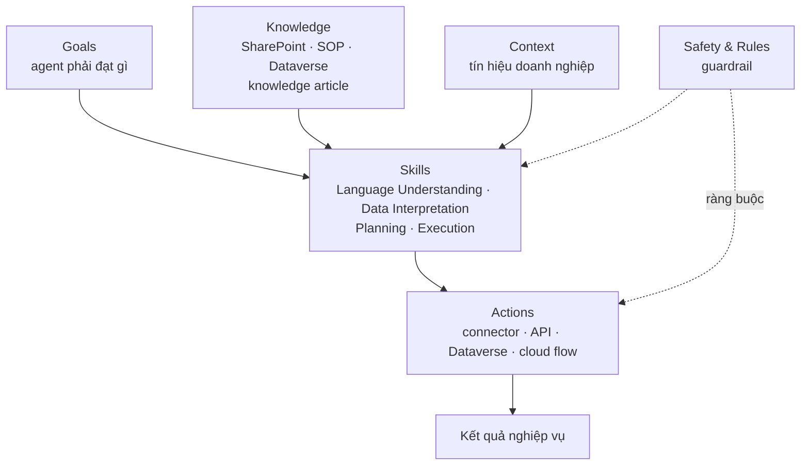
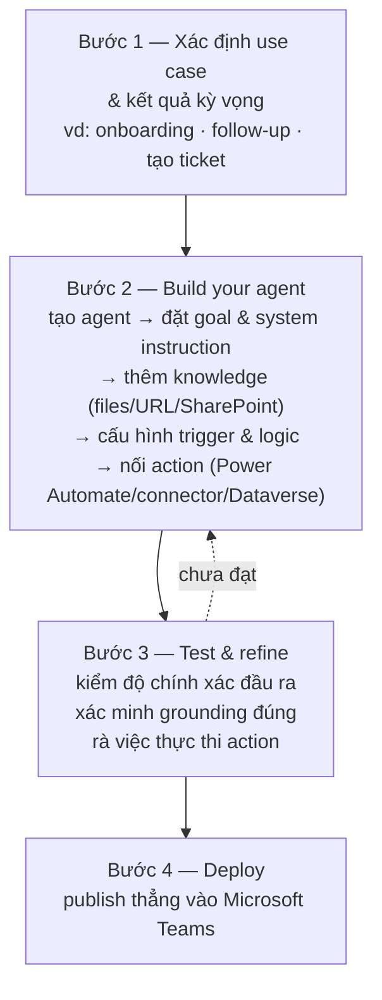
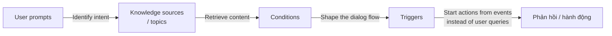
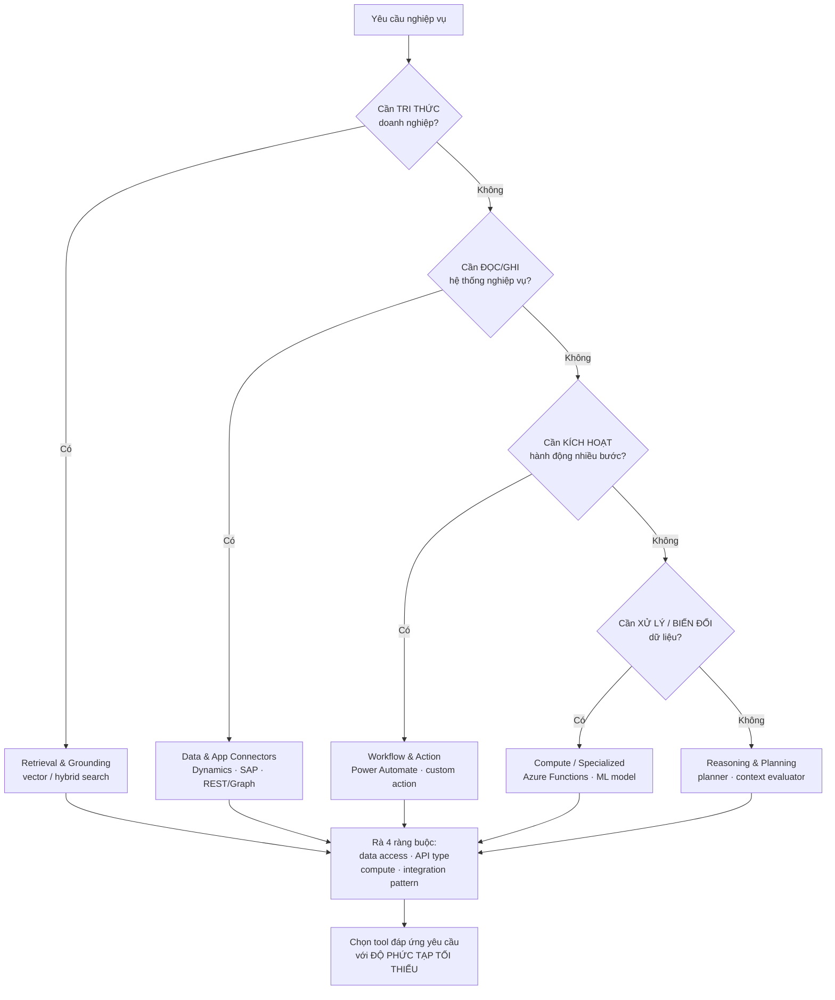

# Note 11 — Ba loại agent trong Copilot Studio & đề xuất Foundry tools

> [!summary] TL;DR
> Note **trung tâm của cụm Design**. Hai phần:
> 1. **Ba loại agent trong Copilot Studio** — phân biệt bằng **cái gì khởi động chúng**:
>    - **Task agent** — hoàn thành **hành động/tác vụ cụ thể** thay mặt người dùng. Kiến trúc **6 thành phần**: **Goals · Skills · Actions · Knowledge · Context · Safety & Rules**.
>    - **Autonomous agent** — thực hiện tác vụ **độc lập**, khởi động bằng **Trigger** chứ không chờ người hỏi. Kiến trúc **5 thành phần**: **Goals · Triggers · Instructions · Knowledge sources · Actions** — thay `Skills/Context/Safety` bằng `Triggers/Instructions`.
>    - **Prompt-and-response agent** — hội thoại, xoay quanh **NLU Boost (Generative Answers) · System topics · Condition nodes · Event triggers**.
> 2. **Năm nhóm Foundry tool** và cách khớp yêu cầu → công cụ: **Retrieval & grounding · Data & application connectors · Workflow & action · Reasoning/planning/execution · Specialized**.
>
> Câu chốt của phần Foundry tool: chọn công cụ **đáp ứng yêu cầu với ĐỘ PHỨC TẠP TỐI THIỂU** — cùng tinh thần "SaaS agent first" ở [[05-Chien-luoc-Multi-Agent-va-Chon-nen-tang]].
>
> Thuật ngữ: **NLU** (Natural Language Understanding) = khả năng máy hiểu ý định trong câu nói tự nhiên. **Grounding** = neo câu trả lời vào dữ liệu thật của tổ chức. **Vector search** = tìm kiếm theo *độ tương đồng ngữ nghĩa* thay vì khớp từ khoá. **Hybrid search** = kết hợp khớp từ khoá và tìm theo ngữ nghĩa.

---

## 1. Bảng phân biệt trung tâm: ba loại agent ⭐⭐

Đây là bảng **đắt giá nhất** của cả cụm Design. Đề AB-100 ra dạng "cho tình huống, chọn loại agent" rất nhiều.

| Tiêu chí | **Task agent** | **Autonomous agent** | **Prompt-and-response agent** |
|---|---|---|---|
| **Định nghĩa** | AI agent **chuyên biệt** hoàn thành **hành động/tác vụ cụ thể** *thay mặt người dùng* | Hệ AI thực hiện tác vụ **độc lập** dựa trên mục tiêu nghiệp vụ, tri thức ngữ cảnh và chỉ dẫn tích hợp | Kết hợp **NLU + logic theo topic + hành vi hướng sự kiện** để sinh câu trả lời chính xác và thực hiện hành động |
| **Cái gì khởi động** | **Người dùng** yêu cầu trong luồng công việc | **Trigger**: user input, thay đổi hệ thống, hoặc **lịch hẹn (scheduled prompt)** | **Prompt của người dùng** (hoặc event trigger cho phần tự động) |
| **Thành phần kiến trúc** | **6**: Goals · Skills · Actions · Knowledge · Context · **Safety & Rules** | **5**: Goals · **Triggers** · **Instructions** · Knowledge sources · Actions | NLU Boost · System topics · Condition nodes · Event triggers |
| **Nơi chạy / xuất bản** | Trong luồng công việc doanh nghiệp | Publish thẳng vào **Microsoft Teams** hoặc luồng công việc doanh nghiệp | Trong bề mặt hội thoại của agent |
| **Đặc trưng phải nhớ** | **Biến quy trình có cấu trúc thành hành động** — "làm giúp tôi việc X" | **Biến quy trình thủ công/lặp lại thành luồng tự động, thông minh** | **Kiến trúc mô-đun** đảm bảo *linh hoạt + kết quả dự đoán được* |
| **Best practice mở đầu** | *Start with **one high-value workflow*** | *Start with a **simple, high-value use case*** | Dựa vào **system topic** đã kiểm chứng để tập trung vào topic nâng cao |

`★ Insight ─────────────────────────────────────`
Ba danh sách thành phần **không phải ba cách gọi khác nhau của cùng một thứ** — chỗ chúng khác nhau chính là chỗ đề ra câu hỏi.

Task agent có **Skills · Context · Safety & Rules**; autonomous agent thay ba mục đó bằng **Triggers · Instructions**. Vì sao? Vì task agent **được người gọi**, nên nó cần *năng lực* (Skills) để hiểu yêu cầu mở và cần *guardrail* (Safety & Rules) để không vượt rào khi người dùng đòi quá đà. Autonomous agent **tự chạy**, nên thứ nó thiếu là **cái gì đánh thức nó** (Triggers) và **luật cư xử khi không có người kèm** (Instructions — ví dụ nguyên văn *"If the customer is VIP, escalate the ticket immediately"*).

Nói cách khác: **Safety & Rules của task agent là hàng rào; Instructions của autonomous agent là bản đồ.** Hàng rào ngăn bạn đi sai; bản đồ chỉ bạn đi đâu khi không ai dẫn đường. Nhớ điểm này thì không bao giờ nhầm hai danh sách.
`─────────────────────────────────────────────────`

---

## 2. Task agent (U6)

### 2.1. Task agent giúp gì

Task agent giúp đội ngũ tăng hiệu suất bằng **5 việc**: tự động hoá **luồng lặp lại hoặc nhiều bước** · **thực thi hành động** (tạo bản ghi, cập nhật dữ liệu, kích hoạt automation) · **dùng ngữ cảnh để ra quyết định** · **truy cập dữ liệu tổ chức an toàn** · **duy trì quy trình nhất quán xuyên các team**.

### 2.2. Kiến trúc mô-đun — 6 thành phần ⭐

| Component | Purpose |
|---|---|
| **Goals** | Định nghĩa **agent phải đạt được gì** |
| **Skills** | **Năng lực** dùng để đạt mục tiêu (trích xuất, suy luận, lập kế hoạch) |
| **Actions** | **Thao tác thực thi được** qua connector, API hoặc workflow |
| **Knowledge** | Thông tin **có cấu trúc / phi cấu trúc** agent được tham chiếu |
| **Context** | **Dữ liệu và tín hiệu doanh nghiệp** ảnh hưởng tới quyết định |
| **Safety & Rules** | **Guardrail** quyết định agent **được và không được** làm gì |

### 2.3. Quy trình thiết kế task agent — 6 bước

**Bước 1 — Định nghĩa mục đích.** Bắt đầu từ **mục tiêu nghiệp vụ rõ ràng**. Ví dụ nguồn nêu: *tự động hoá nhập đơn hàng · tóm tắt yêu cầu khách hàng · kích hoạt luồng onboarding · truy vấn tình trạng tồn kho · tạo và giao việc*. Dùng **câu phát biểu mục tiêu hướng kết quả** (outcome-based goal statement).

**Bước 2 — Định nghĩa goals.** Goal là **sứ mệnh cốt lõi** của agent. Ví dụ nguyên văn: *"Create a new sales record based on customer data." · "Submit a support ticket with priority levels." · "Generate a summary of a customer conversation."*

> Goal phải có **4 tính chất**: **Actionable** (hành động được) · **Observable** (quan sát được) · **Testable** (kiểm thử được) · **Relatable to business outcomes** (liên hệ được với kết quả nghiệp vụ).

**Bước 3 — Gán skills.** Skills là "năng lực" của agent, gồm **4 loại cốt lõi**:

| Skill | Làm gì |
|---|---|
| **Language Understanding** | Trích **ý định** (intent), **phân loại tin nhắn** |
| **Data Interpretation** | **Đọc, tóm tắt, biến đổi** dữ liệu |
| **Planning** | **Sắp chuỗi các bước** cần thiết để hoàn thành tác vụ |
| **Execution** | **Gọi action** để hoàn tất tác vụ |

**Bước 4 — Thêm actions.** Action được tạo qua **5 đường**: **Power Platform connectors · custom connectors · APIs · Dataverse operations · cloud flows**. Ví dụ: tạo case · cập nhật lead · gửi yêu cầu phê duyệt · lấy thông tin tài khoản khách hàng · tạo việc follow-up.

> ⚠️ **Mỗi action bắt buộc có 4 thứ**: **input parameters · output schema · authentication · error handling rules**. Bộ bốn này hay bị bỏ sót khi thiết kế, và là điểm đề hay hỏi — thiếu `error handling rules` thì agent **thất bại âm thầm**.

**Bước 5 — Nguồn tri thức.** Ví dụ: **SharePoint libraries · product manuals · standard operating procedures (SOP) · Dataverse data · knowledge articles**.

> Tri thức phải đạt **4 tiêu chuẩn**: **Accurate** (chính xác) · **Recent** (mới) · **Governed** (được quản trị) · **Indexed** (đã lập chỉ mục).

**Bước 6 — Định nghĩa safety rules.** Rule **ràng buộc hoặc định hướng** hành vi agent. Ba ví dụ nguyên văn rất đáng nhớ vì chúng minh hoạ **ba kiểu rule khác nhau**:

| Rule ví dụ | Kiểu rule |
|---|---|
| *"Never override a customer's credit limit."* | **Cấm tuyệt đối** — chặn một hành động |
| *"Always ask before submitting an order."* | **Bắt buộc xác nhận** — chèn con người vào vòng lặp |
| *"Escalate if the issue contains complaint keywords."* | **Định tuyến theo điều kiện** — chuyển giao khi gặp tín hiệu |

> ⭐ Ba kiểu này chính là hiện thân cụ thể của **behavior envelope** ("phong bì hành vi") đã gặp ở [[07-Solution-Rules-Vai-tro-va-AI-CoE]] — *agent may / may not / must ask*. Rule bảo đảm hành vi agent **dự đoán được và đáng tin cậy**.

### 2.4. Sáu best practice cho task agent

1. **Bắt đầu bằng MỘT luồng công việc giá trị cao**
2. **Giữ goal nhỏ và tập trung**
3. Cấp cho agent **dữ liệu sạch, có cấu trúc**
4. **Giới hạn quyền của action ở phạm vi thấp nhất cần thiết** (least privilege)
5. Triển khai **monitoring và logging**
6. **Kiểm thử bằng kịch bản thực tế và trường hợp biên** (edge case)

---

## 3. Autonomous agent (U7)

### 3.1. Autonomous agent làm được gì

> **Autonomous agent** = hệ thống AI thực hiện tác vụ **một cách độc lập**, dùng **mục tiêu nghiệp vụ, tri thức ngữ cảnh và chỉ dẫn được tích hợp**. Chúng **biến quy trình thủ công hoặc lặp lại thành luồng công việc tự động, thông minh**.

Trong Copilot Studio, autonomous agent làm **4 việc**:
- **Hiểu ý định** bằng **built-in reasoning** (khả năng suy luận dựng sẵn)
- **Truy cập tri thức tổ chức** để ra quyết định có căn cứ
- **Thực thi tác vụ** bằng connector, action và trigger
- **Vận hành bên trong Microsoft Teams** hoặc ứng dụng doanh nghiệp đã tích hợp

### 3.2. Năm thành phần cốt lõi ⭐

| Component | Description |
|---|---|
| **Goals** | Kết quả nghiệp vụ định nghĩa agent phải đạt gì — ví dụ *"Create an onboarding request"*, *"Summarize weekly reports"* |
| **Triggers** | **Sự kiện khiến agent khởi động**: user input, **thay đổi hệ thống**, hoặc **scheduled prompt** (lịch hẹn) |
| **Instructions** | **Quy tắc nghiệp vụ chi tiết** dẫn dắt hành vi — ví dụ *"If the customer is VIP, escalate the ticket immediately"* |
| **Knowledge sources** | Documents, **SharePoint libraries**, **Dataverse tables**, nội dung doanh nghiệp dùng để grounding |
| **Actions** | Thao tác thực thi: **gọi API, tạo bản ghi, gửi email, cập nhật trường CRM** |

*(Bảng chuẩn của giáo trình thêm hàng thứ 6 là **Publishing** — triển khai agent vào Teams hoặc luồng công việc.)*

### 3.3. Quy trình 4 bước dựng autonomous agent

Chi tiết **Bước 2** — trình dựng của Copilot Studio đi theo **5 thao tác**: tạo autonomous agent mới → đặt **goal và system instruction** → thêm **knowledge source** (files, URL, SharePoint site) → cấu hình **trigger và logic ra quyết định** → nối **action** qua Power Automate, connector hoặc Dataverse.

Chi tiết **Bước 3** — testing gồm **3 việc**: **validating output accuracy** · **verifying correct grounding** · **reviewing action execution**.

### 3.4. Sáu best practice cho autonomous agent

| # | Best practice | Ghi chú |
|---|---|---|
| 1 | Bắt đầu bằng **use case đơn giản, giá trị cao** | |
| 2 | Cấp cho agent **chỉ dẫn sạch, có cấu trúc** | |
| 3 | **Giới hạn SỐ LƯỢNG nguồn tri thức** để giữ độ chính xác | ⭐ trái trực giác |
| 4 | Dùng nguồn grounding **đã được phê duyệt, rà soát và cập nhật thường xuyên** | |
| 5 | **Kiểm thử logic nghiệp vụ nhiều lần** trước khi publish | |
| 6 | **Giám sát hiệu năng** và tinh chỉnh theo phản hồi người dùng | |

> ⭐ Best practice **3** là biến thể thứ ba của chủ đề **"ít mà sạch thắng nhiều mà nhiễu"** — sau *limit data scope* (note 09) và *expose only needed attributes* (note 10). Nó cũng khớp với giới hạn cứng của Copilot Studio: **tối đa 5 nguồn phi cấu trúc dùng đồng thời**, xem [[06-Nguon-tri-thuc-Prompt-Library-va-SLM]].

---

## 4. Prompt-and-response agent (U8)

### 4.1. Kiến trúc mô-đun

> **Prompt and response agent** trong Copilot Studio kết hợp **natural language understanding (NLU)**, **logic dựa trên topic** và **hành vi hướng sự kiện** để sinh câu trả lời chính xác và thực hiện hành động.

Agent xử lý theo **4 chặng**:

> Kiến trúc mô-đun này bảo đảm **flexibility (linh hoạt) + predictable results (kết quả dự đoán được)** — hai thứ thường đánh đổi lẫn nhau, và đó là lý do phải chia thành 4 cơ chế riêng.

### 4.2. Bốn cơ chế và khi nào dùng ⭐

| Mechanism | Use When |
|---|---|
| **Generative Answers (NLU Boost)** | Câu hỏi của người dùng **không được topic nào phủ**; cần trả lời **từ knowledge base** |
| **System Topics** | **Greeting, fallback, escalation, error, disambiguation** (nhiều topic cùng khớp) |
| **Condition Nodes** | **Rẽ nhánh hội thoại** dựa trên giá trị hoặc biến |
| **Event Triggers** | Agent phải **phản ứng với sự kiện** thay vì với câu hỏi của người dùng |

### 4.3. NLU Boost & Generative Answers

Node **Generative Answers (NLU Boost)** cho phép agent trả lời câu hỏi bằng nội dung từ nguồn tri thức **nội bộ hoặc bên ngoài**. Agent có thể truy xuất từ **5 nguồn**: **public websites · Dataverse documents · SharePoint · enterprise connectors · custom data flows**.

> ⚠️ Điểm mấu chốt: **nếu agent không khớp được topic nào, nó dùng generative answers làm FALLBACK** để trả lời dựa trên nội dung sẵn có.

**Tuỳ biến phản hồi:** agent có thể **lưu phản hồi sinh ra vào biến (variable)**, **hiển thị trên Adaptive Card**, và **áp định dạng tuỳ biến** trước khi gửi ra cho người dùng.

### 4.4. System topics

**System topic** = năng lực **dựng sẵn** cung cấp phản hồi làm sẵn cho các tình huống phổ biến — **6 tình huống được nêu tên**:

1. **Greeting** (chào hỏi)
2. **Escalation** (chuyển cấp)
3. **Fallback** (dự phòng khi không hiểu)
4. **End of conversation** (kết thúc hội thoại)
5. **Multiple topics matched — disambiguation** (nhiều topic cùng khớp, cần làm rõ)
6. **Error handling** (xử lý lỗi)

System topic cung cấp **khung sườn hội thoại cốt lõi** và **kích hoạt tự động** dựa trên tin nhắn người dùng hoặc sự kiện. Chúng bảo đảm **3 thứ**: **Consistency · Predictable behavior · Standardized user experiences** — nhờ đó designer **tập trung vào topic nâng cao** và dựa vào phần mặc định đã được kiểm chứng.

### 4.5. Condition node

Dùng condition để **định hình luồng hội thoại** dựa trên biến, giá trị và logic. Condition node cho phép rẽ nhánh bằng **5 cơ chế**: **so sánh · biến · toán tử** (equals, greater than, blank…) · **logic AND/OR** · **nhiều nhánh (if, elseif, else)**.

Condition giúp agent thích ứng theo: **loại khách hàng (VIP vs standard)** · **dữ liệu nhập từ form** · **ngữ cảnh hội thoại** · **tin nhắn trước đó của người dùng**.

> Condition còn **hỗ trợ công thức Power Fx** khi cần logic nâng cao.

### 4.6. Event trigger

Event trigger cho phép agent **hành động mà không chờ prompt của người dùng**. Ví dụ: **một tệp được tải lên · một tác vụ hoàn tất · một dòng Dataverse được thêm · một lịch lặp (scheduled recurrence)**.

Trigger gửi **payload** cho agent, gồm **3 thứ**: **Data · Instructions · Execution context**.

Trigger hỗ trợ luồng công việc **hoàn toàn tự động**: gửi tóm tắt · khởi động một topic · gọi action qua connector · cập nhật bản ghi.

> ⚠️ **Hai ràng buộc bắt buộc nhớ:** trigger phải được **cấp phép tường minh** (explicitly authorized) và **có thể ảnh hưởng tới mức tiêu thụ tính phí** (billing consumption). Đây là điểm nối giữa thiết kế kỹ thuật và TCO — xem [[08-ROI-TCO-va-Build-Buy-Extend]].

`★ Insight ─────────────────────────────────────`
Event trigger là **chỗ ranh giới giữa prompt-and-response agent và autonomous agent bị xoá nhoà** — và đề rất thích khai thác điểm này.

Cả hai đều dùng trigger; khác biệt nằm ở **trọng tâm thiết kế**. Prompt-and-response agent *chủ yếu* đối thoại, trigger chỉ là phần mở rộng để nó phản ứng với sự kiện. Autonomous agent *lấy trigger làm gốc* — nó có `Triggers` trong **5 thành phần cốt lõi**, còn prompt-and-response agent chỉ liệt kê event trigger là **một trong bốn cơ chế**.

Mẹo phân loại khi gặp tình huống trong đề: hỏi **"bỏ người dùng đi thì agent còn hoạt động không?"**. Còn ⇒ autonomous. Không còn ⇒ prompt-and-response. Và nhớ cảnh báo **billing consumption** — trigger chạy nền là thứ **âm thầm tiêu tiền**, nên nó luôn xuất hiện trong phần chi phí lẫn phần bảo mật.
`─────────────────────────────────────────────────`

---

## 5. Đề xuất Foundry tools theo yêu cầu (U9)

### 5.1. Nguyên tắc chọn tool

**Azure AI Foundry** cung cấp một **catalog các tool** mà agent dùng để: truy xuất dữ liệu · gọi API · grounding phản hồi · điều phối workflow · kích hoạt hành động xuyên ứng dụng.

> *Ghi chú tên gọi:* nguồn viết **"Azure AI Foundry"**; tên chính thức hiện tại là **Microsoft Foundry** — xem cảnh báo ở [[02-Ban-do-cong-nghe-AI-Microsoft]] §1.

Mục tiêu khi chọn tool — **5 tiêu chí**:

| # | Tiêu chí | Ý nghĩa |
|---|---|---|
| 1 | **Meet the requirement with minimal complexity** | Đáp ứng yêu cầu với **độ phức tạp tối thiểu** ⭐ |
| 2 | **Ensure security and compliance** | Bảo đảm bảo mật và tuân thủ |
| 3 | **Leverage existing enterprise systems** | **Tận dụng hệ thống doanh nghiệp sẵn có** |
| 4 | **Reduce integration overhead** | Giảm chi phí tích hợp |
| 5 | **Support accurate, grounded outputs** | Hỗ trợ đầu ra **chính xác và có căn cứ** |

### 5.2. Năm nhóm Foundry tool ⭐

| Nhóm | Dùng khi | Năng lực điển hình |
|---|---|---|
| **Retrieval and grounding tools** | Agent phải **truy cập tri thức doanh nghiệp** hoặc lấy tài liệu liên quan | **Vector search** · **hybrid search** (keyword + semantic) · **lập chỉ mục nguồn có/phi cấu trúc** · truy vấn knowledge base doanh nghiệp |
| **Data and application connectors** | Agent phải **tương tác với ứng dụng nghiệp vụ hoặc CSDL** | **CRM** · **ERP/hệ thống tài chính** · **line-of-business app** · **SQL / Cosmos DB** · **REST hoặc Graph API endpoint** |
| **Workflow and action tools** | Cần **kích hoạt hành động nghiệp vụ tự động** | Tạo bản ghi · cập nhật case · gửi thông báo · **kích hoạt Power Automate flow** · gọi custom API |
| **Reasoning, planning, and execution tools** | Agent phải **đánh giá điều kiện, chia nhỏ tác vụ, chọn hành động đúng, xử lý logic rẽ nhánh** | Planner, context evaluator, LLM-based decision tool |
| **Specialized tools** | Năng lực **chuyên biệt theo mục đích** | **Document summarization** · **classification** · **thực thi custom ML model** · **safe completion & validation tools** |

### 5.3. Ánh xạ yêu cầu → tool: 5 tình huống mẫu

Giáo trình đưa **5 cặp yêu cầu–giải pháp** kèm **lý do (Why)** — phần "Why" chính là thứ đề kiểm tra:

| Requirement type | Tool đề xuất | **Why** |
|---|---|---|
| **Truy xuất chính sách, hướng dẫn, tri thức** | Retrieval tool (**vector search**) · **hybrid search connector** · công cụ **nạp tài liệu SharePoint / OneDrive** | Grounding agent vào tri thức doanh nghiệp **trong khi vẫn tôn trọng các kiểm soát bảo mật** |
| **Tích hợp hệ thống nghiệp vụ (CRM, ERP, HR)** | **Native application connector** (Dynamics, SAP, ServiceNow, custom API) · **custom REST/Graph API connector** | Cho phép agent **đọc/ghi dữ liệu trong hệ thống đã được doanh nghiệp phê duyệt** |
| **Thực thi workflow nhiều bước** | **Power Automate flow connector** · workflow orchestration tool · custom action tool | Cho agent **kích hoạt hành động một cách đáng tin cậy và lặp lại được** |
| **Phân tích hoặc biến đổi dữ liệu** | **Azure Functions** (tác vụ tính toán nhẹ) · **ML model tool** (classification, extraction, scoring) · data transformation connector | Cho phép **xử lý có cấu trúc, có kiểm soát trước khi trả kết quả** |
| **Suy luận nâng cao / phân rã tác vụ** | **Planner / Reasoning tool** · **LLM-based decision tool** · **context evaluator** | Giúp agent **chọn bước tiếp theo đúng một cách an toàn** |

### 5.4. Bảng chuẩn: ánh xạ yêu cầu → nhóm tool

| Requirement Type | Recommended Tool Category | Examples |
|---|---|---|
| **Document retrieval** | Retrieval & Grounding | Vector search, semantic search |
| **App integration** | App & Data Connectors | REST APIs, Dynamics connector |
| **Workflow automation** | Workflow & Action | Power Automate, custom actions |
| **Data processing** | **Compute Tools** | **Azure Functions**, ML Tools |
| **Decision and planning** | Reasoning Tools | Planner, rule evaluators |

> ⚠️ **Bẫy nhỏ nhưng thật:** bảng tóm tắt gọi nhóm thứ tư là **"Compute Tools"** trong khi phần thân bài xếp năng lực xử lý dữ liệu vào **"Specialized tools"**. Khi gặp lựa chọn trong đề, bám vào **ví dụ cụ thể** (*Azure Functions, ML model*) thay vì tên nhóm — ví dụ ổn định hơn tên gọi.

### 5.5. Bốn ràng buộc phải đánh giá khi chọn tool

Learning objective của unit nêu đích danh **4 ràng buộc**:

| Ràng buộc | Câu hỏi cần trả lời |
|---|---|
| **Data access** | Agent cần đọc/ghi dữ liệu nào, và **quyền được kiểm soát ra sao**? |
| **API type** | REST? Graph? Native connector? Có sẵn connector chuẩn không? |
| **Compute needs** | Có cần tính toán ngoài không (Azure Functions, ML model)? |
| **Integration patterns** | Đồng bộ hay bất đồng bộ, đẩy hay kéo, một chiều hay hai chiều? |

> 💡 **Về A2A (Agent2Agent):** nguồn AB-100 hầu như không nói về A2A. Khi kiến trúc cần **agent gọi agent xuyên tổ chức/nền tảng**, đối chiếu ba lựa chọn: **connector** (agent ↔ hệ thống), **MCP** (agent ↔ tool/nguồn tri thức chuẩn hoá), **A2A** (agent ↔ agent). Chi tiết giao thức đã viết đủ ở [[../AI-103/10-A2A-Protocol]] và [[../AI-103/06-Custom-Tools-va-MCP-Tools]].

---

## Câu hỏi phỏng vấn

> [!question] Phân biệt task agent và autonomous agent bằng chính danh sách thành phần của chúng.
> Task agent có **6 thành phần**: *Goals, Skills, Actions, Knowledge, Context, Safety & Rules*. Autonomous agent có **5**: *Goals, Triggers, Instructions, Knowledge sources, Actions*. Chỗ khác nhau nói lên tất cả: task agent **được người gọi** nên cần **Skills** (năng lực xử lý yêu cầu mở) và **Safety & Rules** (hàng rào khi người dùng đòi quá đà); autonomous agent **tự chạy** nên cần **Triggers** (cái đánh thức nó) và **Instructions** (luật cư xử khi không có người kèm, ví dụ *"If the customer is VIP, escalate immediately"*). Ngắn gọn: **Safety & Rules là hàng rào, Instructions là bản đồ**.

> [!question] Khách hàng muốn agent tự tổng hợp báo cáo mỗi sáng thứ Hai và đăng vào Teams. Loại agent nào, và cần chuẩn bị gì?
> **Autonomous agent**, vì không có người dùng khởi phát — nó chạy bằng **scheduled prompt**, đúng một trong ba loại trigger được nêu (user input, thay đổi hệ thống, lịch hẹn). Chuẩn bị theo 4 bước: (1) xác định use case và kết quả kỳ vọng; (2) build — đặt **goal + system instruction**, thêm **knowledge source**, cấu hình **trigger theo lịch**, nối **action** qua Power Automate/Dataverse; (3) test ba mặt — **độ chính xác đầu ra, grounding đúng, việc thực thi action**; (4) **publish thẳng vào Microsoft Teams**. Hai điều phải cảnh báo khách hàng: trigger cần **cấp phép tường minh** và **ảnh hưởng tới mức tiêu thụ tính phí**.

> [!question] Vì sao best practice lại khuyên giới hạn SỐ LƯỢNG nguồn tri thức của autonomous agent?
> Vì **độ chính xác** — nguyên văn *"Limit the number of knowledge sources to maintain accuracy"*. Càng nhiều nguồn thì càng dễ có nội dung **mâu thuẫn, trùng lặp hoặc lỗi thời**, và agent không có cách phân xử nguồn nào đúng; kết quả là câu trả lời thiếu nhất quán. Đi kèm là best practice 4: nguồn phải **được phê duyệt, rà soát và cập nhật thường xuyên**. Đây là biến thể thứ ba của nguyên tắc xuyên suốt AB-100 — sau *limit data scope* (Copilot D365) và *expose only needed attributes* (agent context Contact Center) — và nó khớp với giới hạn cứng **5 nguồn phi cấu trúc đồng thời** của Copilot Studio.

> [!question] Điều gì xảy ra khi prompt-and-response agent không khớp được topic nào?
> Nó rơi vào **generative answers (NLU Boost) làm fallback** và trả lời dựa trên nội dung sẵn có trong các nguồn tri thức — có thể là public website, Dataverse document, SharePoint, enterprise connector hoặc custom data flow. Song song, **system topic Fallback** cung cấp khung xử lý chuẩn cho tình huống không hiểu. Lưu ý thiết kế: fallback **không được thay thế cho việc nhận diện ý định tốt** — phải bảo đảm topic phủ được các kịch bản phổ biến nhất (xem [[12-Copilot-Studio-Topics-Agent-Flows-Prompt-Actions]]).

> [!question] Khách hàng cần agent tra cứu chính sách nội bộ nằm trong SharePoint. Đề xuất Foundry tool nào và lý do?
> Nhóm **Retrieval and grounding tools**: **vector search** (tìm theo tương đồng ngữ nghĩa), **hybrid search connector** (kết hợp từ khoá + ngữ nghĩa), và **công cụ nạp tài liệu SharePoint/OneDrive**. Lý do nguyên văn của giáo trình: các tool này **grounding agent vào tri thức doanh nghiệp trong khi vẫn tôn trọng các kiểm soát bảo mật** — tức người dùng chỉ thấy được nội dung mà quyền của họ cho phép. Trước khi chốt, rà **4 ràng buộc**: data access, API type, compute needs, integration pattern; và bám nguyên tắc số một — **đáp ứng yêu cầu với độ phức tạp tối thiểu**.

---

## Tự kiểm tra

1. Lập bảng ba loại agent: **cái gì khởi động** từng loại?
2. **Sáu thành phần** của task agent? **Năm thành phần** của autonomous agent? Chỗ khác nhau nói lên điều gì?
3. Bốn tính chất bắt buộc của một **goal**?
4. **Bốn loại skill** cốt lõi của task agent?
5. Năm đường tạo **action**? **Bốn thứ** mỗi action bắt buộc phải có?
6. **Bốn tiêu chuẩn** của nguồn tri thức (task agent)?
7. Ba ví dụ **safety rule** — mỗi ví dụ minh hoạ kiểu rule nào?
8. Ba loại **trigger** khởi động autonomous agent?
9. Bốn bước dựng autonomous agent? Bước test kiểm **ba** thứ gì? Deploy vào đâu?
10. Best practice nào của autonomous agent **trái trực giác**, và vì sao đúng?
11. Bốn chặng xử lý của prompt-and-response agent?
12. Bốn cơ chế và **khi nào dùng** từng cái?
13. **Sáu system topic** được nêu tên? Chúng bảo đảm **ba** thứ gì?
14. Năm nguồn mà **NLU Boost** truy xuất được? Ba cách tuỳ biến phản hồi?
15. Condition node rẽ nhánh bằng **năm** cơ chế nào? Hỗ trợ công thức gì?
16. **Payload** của event trigger chứa ba thứ gì? Hai ràng buộc của trigger?
17. **Năm tiêu chí** chọn Foundry tool — tiêu chí số một là gì?
18. **Năm nhóm** Foundry tool và ví dụ của từng nhóm?
19. Với yêu cầu *"phân tích và biến đổi dữ liệu"*, tool nào và **vì sao**?
20. **Bốn ràng buộc** phải đánh giá khi đề xuất tool?

## Liên quan
- [[00-MOC-AB100]] — MOC bộ AB-100
- [[10-Connectors-va-Contact-Center]] — note trước: connector & Contact Center
- [[12-Copilot-Studio-Topics-Agent-Flows-Prompt-Actions]] — note sau: topic, fallback, agent flow, prompt action
- [[05-Chien-luoc-Multi-Agent-va-Chon-nen-tang]] — chọn bậc agent (SaaS / low-code / pro-code) và 5 mẫu điều phối
- [[06-Nguon-tri-thuc-Prompt-Library-va-SLM]] — giới hạn 500 knowledge object / 5 nguồn phi cấu trúc / 25 nguồn
- [[07-Solution-Rules-Vai-tro-va-AI-CoE]] — **behavior envelope**, bản khái quát của safety rules
- [[08-ROI-TCO-va-Build-Buy-Extend]] — trigger ảnh hưởng mức tiêu thụ tính phí
- [[../AI-103/06-Custom-Tools-va-MCP-Tools]] — tool & MCP trong Foundry, bản kỹ thuật
- [[../AI-103/10-A2A-Protocol]] — khi nào agent gọi agent thay vì gọi tool
