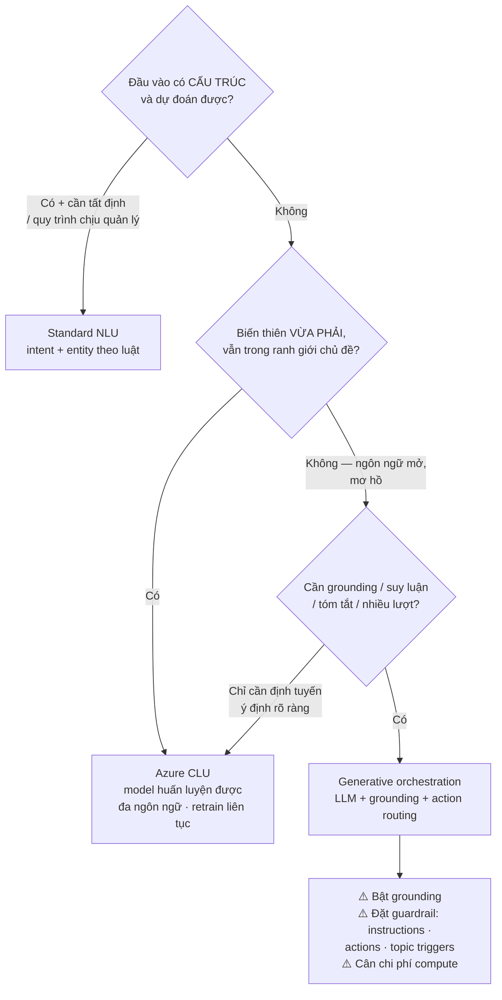
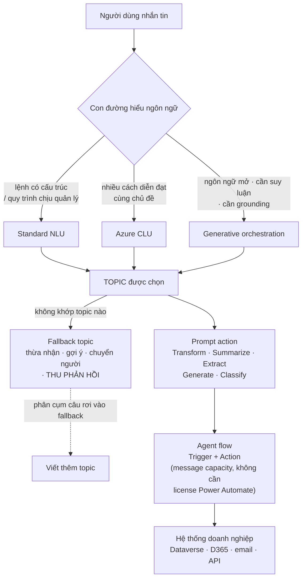

# Note 12 — Copilot Studio: topics & fallback, NLU/CLU/generative, agent flows & prompt actions

> [!summary] TL;DR
> Bốn khối kỹ thuật hạt nhân của Copilot Studio:
> 1. **Topics** = **khối xây dựng của logic hội thoại**. Mỗi topic = *một ý định người dùng + luồng phản hồi + action đi kèm*. Năm thành phần: **trigger phrases · message nodes · question nodes · conditions & branching · actions**. Năm loại topic: **Instructional · Action · Informational · System · Reusable**. **Fallback** xử lý khi không khớp được ý định — nhưng **fallback không được thay cho việc nhận diện ý định tốt**.
> 2. **Ba con đường hiểu ngôn ngữ**: **Standard NLU** (luật + mẫu, tất định, dùng cho quy trình chịu quản lý) → **Azure CLU** (model phân loại huấn luyện được, dùng khi cách diễn đạt đa dạng nhưng chủ đề vẫn trong ranh giới) → **Generative orchestration** (LLM, dùng khi ngôn ngữ mở/không đoán trước hoặc cần suy luận, tóm tắt, sinh nội dung). Nguyên tắc chọn: **bắt đầu từ NLU/CLU khi tác vụ có cấu trúc; chỉ dùng generative khi thật sự cần.**
> 3. **Agent flows** = tự động hoá **chạy native trong Copilot Studio**, gồm đúng hai khối **Trigger + Action**. Khác biệt lớn nhất so với Power Automate cloud flow: **không cần license Power Automate** — dùng **message capacity của Copilot Studio**.
> 4. **Prompt actions** = **khối chỉ dẫn tái sử dụng được** agent gọi khi cần. Dựng bằng **Prompt Coach template** với 5 mục: **Goal · Context · Instructions/Rules · Examples · Output Format**. Năm loại prompt: **Transform · Summarize · Extract · Generate · Classify**.
>
> Thuật ngữ: **NLU** = khả năng máy hiểu ý định trong câu tự nhiên. **CLU** (Conversational Language Understanding) = dịch vụ Azure huấn luyện model nhận diện intent/entity. **Intent** = ý định của người dùng. **Entity** = mẩu thông tin có cấu trúc trích ra từ câu nói (số máy, ngày, địa điểm). **Tất định (deterministic)** = cùng đầu vào luôn cho cùng đầu ra.

---

## 1. Topics — khối xây dựng của hội thoại (U11)

### 1.1. Topic là gì và được chọn thế nào

> **Topics** là **khối xây dựng của logic hội thoại** trong Copilot Studio. Mỗi topic định nghĩa **một ý định người dùng cụ thể**, **luồng phản hồi tương ứng** và **các action được kết nối**.

Khi người dùng gõ một tin nhắn, Copilot Studio đánh giá tin nhắn và chọn topic phù hợp nhất dựa trên **3 tín hiệu**:

1. **Trigger phrases** (cụm từ kích hoạt)
2. **Natural language matching** (khớp ngôn ngữ tự nhiên)
3. **Orchestration and generative understanding** (điều phối và hiểu bằng generative)

> Topic cho phép copilot **xử lý kịch bản có cấu trúc** đồng thời **kết hợp với phản hồi generative ở những chỗ phù hợp** — tức hai chế độ này **không loại trừ nhau**.

### 1.2. Năm thành phần của topic

| Thành phần | Vai trò | Ví dụ |
|---|---|---|
| **Trigger phrases** | **Báo hiệu bắt đầu** một topic | *"Track my order" · "Update my profile" · "I need support"* |
| **Message nodes** | **Truyền thông tin lại cho người dùng**, giọng súc tích, hội thoại | |
| **Question nodes** | **Thu thập phản hồi có cấu trúc** | Danh sách lựa chọn (choice list), text, ngày, số |
| **Conditions & branching** | **Định tuyến người dùng qua các nhánh khác nhau** | Theo **đầu vào của họ**, **quy tắc nghiệp vụ**, **ngữ cảnh & biến** |
| **Actions** | **Nối copilot tới ứng dụng, CSDL và workflow** | Cập nhật bản ghi Dataverse · kích hoạt Power Automate flow · lấy dữ liệu bên ngoài |

### 1.3. Năm nguyên tắc thiết kế topic mạnh

| # | Nguyên tắc | Nội dung |
|---|---|---|
| 1 | **Start with user intents** | Xác định **người dùng muốn đạt được gì** và **gom nhóm các tác vụ tương tự** |
| 2 | **Write clear trigger phrases** | Dùng **ngôn ngữ mà người dùng thật sự nói** |
| 3 | **Keep dialog flows short** | Hướng dẫn **mà không làm người dùng quá tải** |
| 4 | **Use variables and context** | **Lưu lựa chọn hoặc giá trị đã lấy** để duy trì mạch hội thoại (continuity) |
| 5 | **Reuse components** | Tạo **shared topic** cho xác thực, FAQ và logic lặp lại |

### 1.4. Năm loại topic ⭐

| Topic Type | Purpose | Example |
|---|---|---|
| **Instructional Topic** | **Dẫn người dùng qua một tác vụ** | *"Reset MFA method"* |
| **Action Topic** | **Chạy một bước tự động** | *"Create support ticket"* |
| **Informational Topic** | **Cung cấp thông tin có cấu trúc** | *"Business hours"* |
| **System Topic** | **Xử lý sự kiện cấp hệ thống** | Greeting, escalation, fallback |
| **Reusable Topic** | **Logic dùng chung xuyên nhiều topic** | Authentication |

`★ Insight ─────────────────────────────────────`
Năm loại topic này thực chất là **hai trục chồng lên nhau**, và nhận ra điều đó giúp không nhầm khi đề cho tình huống.

Trục thứ nhất — **agent làm gì cho người dùng**: *Informational* (nói cho biết) → *Instructional* (hướng dẫn tự làm) → *Action* (làm thay). Ba mức can thiệp tăng dần. Một câu hỏi kiểu "người dùng cần biết giờ mở cửa" là *Informational*; "người dùng cần được dẫn qua các bước đổi phương thức MFA" là *Instructional*; "người dùng muốn hệ thống tạo hộ ticket" là *Action*.

Trục thứ hai — **ai sở hữu topic**: *System* do nền tảng cung cấp sẵn (greeting, fallback…), *Reusable* do bạn tự dựng để dùng lại. Chúng không cạnh tranh với ba loại trên mà **cắt ngang** chúng — một reusable topic xác thực có thể được cả instructional lẫn action topic gọi tới.
`─────────────────────────────────────────────────`

### 1.5. Fallback topic — thiết kế cho lúc AI không hiểu

> Khi copilot **không khớp được tin nhắn với topic nào đã biết**, **fallback topic** bảo đảm trải nghiệm vẫn mượt.

**Fallback bảo vệ khỏi 3 tình huống:** **ý định không nhận diện được** · **cách diễn đạt bất ngờ** · **thiếu độ phủ topic**.

**Fallback tốt phải làm 4 việc:**

| # | Việc | Chi tiết |
|---|---|---|
| 1 | **Acknowledge misunderstanding** | Thừa nhận không hiểu — *"I'm not sure I understood that."* |
| 2 | **Offer alternative choices** | Đưa **gợi ý ý định khác** hoặc tuỳ chọn trợ giúp |
| 3 | **Redirect to a human agent** | **(tuỳ chọn)** — áp dụng trong kịch bản hỗ trợ hoặc escalation |
| 4 | **Capture user feedback** | **Thu phản hồi để cải thiện độ phủ topic** trong tương lai |

> ⚠️ **Avoid overuse:** fallback **không được thay thế cho việc nhận diện ý định tốt**. Phải bảo đảm topic đã phủ được **các kịch bản phổ biến nhất**.

`★ Insight ─────────────────────────────────────`
Việc thứ 4 — **capture user feedback** — biến fallback từ một *lưới an toàn thụ động* thành **cơ chế tự cải thiện**. Mỗi lần rơi vào fallback là một **tín hiệu chẩn đoán**: hoặc topic còn thiếu, hoặc trigger phrase viết chưa giống cách người dùng nói. Ghi lại các câu rơi vào fallback rồi phân cụm chúng chính là cách khoa học nhất để biết **topic nào phải viết tiếp**.

Ngược lại, **tỷ lệ fallback cao là chỉ báo sức khoẻ xấu của agent**, không phải bằng chứng fallback đang làm tốt việc của nó — đúng như cảnh báo *"avoid overuse"*. Điều này nối thẳng sang cụm Deploy: theo dõi tần suất fallback là một metric giám sát chất lượng, xem [[18-Metrics-Telemetry-va-Tuning]].
`─────────────────────────────────────────────────`

### 1.6. Sáu best practice thiết kế topic & fallback

1. **Ưu tiên rõ ràng và ngắn gọn** trong message node
2. Dùng **câu hỏi có cấu trúc** để **giảm mơ hồ**
3. Tận dụng **entity extraction** cho dữ liệu quan trọng như **tên, số, ngày tháng**
4. Giữ **giọng điệu nhất quán theo Microsoft Writing Style Guide**
5. Bảo đảm **đường fallback mang tính hỗ trợ, không cụt lủn** (not abrupt)
6. **Kiểm thử bằng cách diễn đạt đời thực** và/hoặc **ngôn ngữ khách hàng đã được ghi lại**

---

## 2. Chọn con đường hiểu ngôn ngữ: NLU ↔ CLU ↔ Generative (U15) ⭐⭐

Copilot Studio có **ba mẫu chính** để diễn giải đầu vào của người dùng. Đây là **quyết định kiến trúc**, không phải lựa chọn kỹ thuật thuần tuý.

### 2.1. Ba con đường

| | **Standard NLU** | **Azure CLU** | **Generative AI orchestration** |
|---|---|---|---|
| **Cơ chế** | Model **intent và entity** dựa trên **luật, mẫu và tập huấn luyện có cấu trúc** | Nâng cấp NLU bằng **model phân loại do AI dẫn dắt** — chính xác hơn, nhận diện intent và trích entity tốt hơn | **LLM** diễn giải prompt, duy trì mạch hội thoại, truy xuất tri thức và **gọi action động** |
| **Hợp nhất với** | Tác vụ **dự đoán được**, đòi **độ chính xác cao, ít biến thiên** | Ngôn ngữ **biến thiên nhưng vẫn trong ranh giới chủ đề rõ ràng** | Tác vụ **phức tạp, mở, hoặc dựa nhiều vào tri thức** |
| **Dùng khi** | • Cần **khớp intent nghiêm ngặt cho quy trình chịu quản lý** • Truy vấn/lệnh **nhất quán, có cấu trúc** • Muốn **phản hồi tất định**, hạn chế hành vi generative | • Muốn model **huấn luyện được, mở rộng được**, hiểu **nhiều cách diễn đạt** • Cần **nhận diện intent chất lượng cao trên nhiều câu nói** • Cần tích hợp **Azure AI services** cho **model đa ngôn ngữ** và **cập nhật model liên tục** | • Tin nhắn **phi cấu trúc hoặc không đoán trước** • Cần **tóm tắt, viết lại, sinh nội dung, suy luận, hội thoại nhiều lượt** • Agent phải **grounding vào dữ liệu doanh nghiệp** và theo **logic định tuyến hành động** |
| **Ví dụ kịch bản** | Bot tổng đài nhận **cụm từ cố định** (*"Reset password"*, *"Check balance"*); cần **định tuyến an toàn, nhất quán theo intent chính xác** | Bot dịch vụ hiện trường phải hiểu **hàng chục cách báo cùng một sự cố**; cần **trích entity có cấu trúc** (loại thiết bị, số model, vị trí); có **retrain và theo dõi độ chính xác liên tục** | Trợ lý bán hàng **tóm tắt hồ sơ CRM và soạn email**; bot dịch vụ **tra cứu bài viết tri thức, trả lời câu hỏi dài**; cần **hành vi LLM có điều kiện kích hoạt bởi topic boundary** |

### 2.2. Bảng quyết định chuẩn của giáo trình ⭐

| Requirement Type | Standard NLU | Azure CLU | Generative AI Orchestration |
|---|---|---|---|
| **Structured commands** | ✔ **Best choice** | ✔ Good | — |
| **Regulatory accuracy, predictable outcomes** | ✔ **Best** | ✔ Good | — |
| **Moderate linguistic variability** | — | ✔ **Best choice** | ✔ Possible |
| **Highly variable or ambiguous language** | — | ✔ Good | ✔ **Best choice** |
| **Requires enterprise grounding knowledge** | — | — | ✔ **Best** |
| **Needs reasoning, summarization, content creation** | — | — | ✔ **Best** |
| **Needs explicit intent routing** | ✔ Good | ✔ **Best** | ✔ Can augment |
| **Multi-step conversations** | — | ✔ Good | ✔ **Best** |

`★ Insight ─────────────────────────────────────`
Đọc bảng này theo **cột** thay vì theo hàng thì thấy ngay ba tính cách khác nhau.

**Standard NLU** thắng đúng hai hàng đầu — cả hai đều có từ khoá *structured* / *predictable*. Nó **không xuất hiện** ở bất kỳ hàng nào nói về biến thiên hay suy luận. Đó là một công cụ hẹp nhưng **tất định**, và tính tất định chính là giá trị của nó: trong quy trình chịu quản lý, *"luôn cho cùng một kết quả"* quan trọng hơn *"thông minh"*.

**Azure CLU** là cột **duy nhất không có ô trống ở nửa trên** — nó "Good" ở gần như mọi thứ và "Best" ở hai hàng giữa. CLU là **lựa chọn an toàn khi chưa chắc**, và nó thắng riêng hàng **explicit intent routing** — hơn cả generative. Chi tiết này dễ bị bỏ qua: nếu bài toán là *định tuyến ý định rõ ràng*, generative **không phải** đáp án tốt nhất, dù nó "mạnh hơn".

**Generative** thắng tuyệt đối ở ba hàng cuối — *grounding, reasoning/summarization, multi-step* — và **hoàn toàn vắng mặt** ở hai hàng đầu. Nghĩa là dùng generative cho lệnh có cấu trúc trong ngành chịu quản lý là **dùng sai công cụ**, không phải "hơi thừa".
`─────────────────────────────────────────────────`

### 2.3. Bốn best practice khi chọn

| # | Best practice | Vì sao |
|---|---|---|
| 1 | **Bắt đầu từ NLU hoặc CLU** khi tác vụ có cấu trúc; **chỉ dùng generative khi cần** | Tránh phức tạp và chi phí không cần thiết |
| 2 | **Luôn bật grounding** khi dùng generative orchestration cho câu trả lời doanh nghiệp | Không grounding thì LLM tự bịa |
| 3 | Dùng **guardrail** — *instructions, actions, topic triggers* — để giữ đầu ra LLM **an toàn và dự đoán được** | Ba guardrail được nêu đích danh |
| 4 | **Đánh giá chi phí và hiệu năng**: generative orchestration **mạnh hơn nhưng ngốn compute hơn** | Nối thẳng sang TCO |

> 💡 So sánh với **generative ↔ classic orchestration** ở [[06-Nguon-tri-thuc-Prompt-Library-va-SLM]]: bảng ở note 06 nhìn từ góc **điều phối agent** (agent tự chọn topic/action hay đi theo cây định sẵn), còn bảng ở đây nhìn từ góc **hiểu ngôn ngữ đầu vào**. Hai lát cắt khác nhau của cùng một quyết định, đề có thể hỏi theo cả hai góc.

---

## 3. Agent flows (U16)

### 3.1. Thiết kế agent trong Copilot Studio — 4 bề mặt tác nghiệp

Agent trong Copilot Studio được cấu hình qua các bước **Describe → Configure → Test → Publish**. Maker định nghĩa **mục đích, mục tiêu, chỉ dẫn và hành vi** của agent bằng **ngôn ngữ tự nhiên kết hợp thiết lập có cấu trúc**.

**Định nghĩa agent** bằng cách mô tả **4 thứ**: **Purpose · Behaviors · Tasks · Operational boundaries** (ranh giới vận hành). Copilot Studio **sinh ra một agent khởi đầu** kèm chỉ dẫn và cấu trúc, sau đó maker **tinh chỉnh qua cấu hình**.

**Nguồn tri thức được hỗ trợ (grounding sources) — 4 loại:** **SharePoint site & folder · nội dung Microsoft 365 · public website · linked knowledge base**.

**Năng lực có thể bật thêm — 3 loại:** **Code Interpreter (Python)** · **Image Generator** · **phản hồi bằng rich adaptive card**.

### 3.2. Agent flow là gì

> **Agent flows** tự động hoá tác vụ, tích hợp dịch vụ và mở rộng hành vi agent. Chúng **chạy native bên trong Copilot Studio** và **được tối ưu hoàn toàn cho việc thực thi của agent**.

Agent flow mang lại **4 lợi ích**:
1. **Consistent execution** (thực thi nhất quán)
2. **End-to-end process visibility** (nhìn xuyên suốt quy trình)
3. **Không yêu cầu license Power Automate** ⭐
4. **Hỗ trợ tự động hoá bằng ngôn ngữ tự nhiên**

### 3.3. Hai khối xây dựng: Trigger & Action

| Component | Description |
|---|---|
| **Trigger** | **Cách flow khởi động** — thủ công, **theo lịch**, **sự kiện hệ thống**, hoặc **từ một agent khác** |
| **Action** | **Thao tác flow thực hiện** — gửi email, cập nhật dữ liệu, lấy thông tin |

> ⭐ Chú ý trigger có thể đến **từ một agent khác** — đây là mầm mống của **multi-agent** ngay trong Copilot Studio, nối với 5 mẫu điều phối ở [[05-Chien-luoc-Multi-Agent-va-Chon-nen-tang]].

### 3.4. Hai cách dựng agent flow

| | **Method A — Natural language prompting** | **Method B — Visual designer** |
|---|---|---|
| **Cách làm** | Maker **mô tả điều mình muốn** | Tinh chỉnh flow trên **canvas trực quan dạng node** |
| **Ví dụ** | *"When a customer submits a form, send a confirmation email and update the CRM record."* | |
| **Kết quả** | **Copilot tự sinh workflow** | **Toàn quyền kiểm soát** logic và rẽ nhánh |
| **Hợp với** | **Dựng nguyên mẫu nhanh** (rapid prototyping) | Hoàn thiện chi tiết |

> Best practice của giáo trình chốt cách phối hợp hai phương pháp: **dùng natural language prompting để prototype nhanh, rồi tinh chỉnh bằng visual designer**.

### 3.5. Tích hợp với hệ thống doanh nghiệp

Agent flow nối agent Copilot Studio tới: **Microsoft Forms · Dynamics 365 · Dataverse · dịch vụ email · API và custom connector**.

Chúng cho phép: **workflow nhiều bước · phản hồi tự động · cập nhật CRM · thông báo và escalation**.

### 3.6. Bảng phân biệt: Agent Flow ↔ Power Automate Cloud Flow ⭐⭐

| Feature | **Agent Flow** | **Power Automate Cloud Flow** |
|---|---|---|
| **Licensing** | Dùng **message capacity của Copilot Studio** | **Yêu cầu license Power Automate** |
| **Trigger types** | **User messages**, theo lịch, sự kiện | **Connectors**, trigger, sự kiện hệ thống |
| **Best for** | **Tự động hoá hội thoại do AI dẫn dắt** | **Tự động hoá tích hợp cấp doanh nghiệp** |
| **Builder experience** | **Ngôn ngữ tự nhiên + canvas trực quan** | **Thiết kế workflow hướng connector** |

`★ Insight ─────────────────────────────────────`
Hàng **Licensing** là hàng có sức nặng nhất đối với vai trò solution architect, vì nó đổi **mô hình chi phí** chứ không chỉ đổi công cụ.

Agent flow tiêu **message capacity của Copilot Studio** — nghĩa là chi phí **co giãn theo lượng tương tác** và nằm chung một ngân sách với chính agent. Cloud flow đòi **license Power Automate** — chi phí **theo đầu người/đầu flow**, ngân sách riêng, thường do đội Power Platform quản. Với một kịch bản hội thoại lượng thấp, agent flow rẻ hơn hẳn vì không phải mua thêm license; với một tích hợp nền chạy hàng chục nghìn lượt mỗi ngày, đốt message capacity lại **đắt hơn** một license cố định.

Vì vậy câu hỏi đúng không phải *"cái nào tốt hơn"* mà là **"khối lượng chạy bao nhiêu, và ai trả tiền"**. Hàng *Best for* nói cùng ý bằng ngôn ngữ khác: **AI-driven conversational** (theo nhịp hội thoại, lượng vừa) ↔ **enterprise integration** (chạy nền, lượng lớn). Xem mô hình chi phí ở [[08-ROI-TCO-va-Build-Buy-Extend]].
`─────────────────────────────────────────────────`

### 3.7. Sáu best practice cho agent & agent flow

1. **Bắt đầu từ một kịch bản nghiệp vụ rõ ràng**
2. Giữ **chỉ dẫn agent súc tích** theo **Microsoft Writing Style Guide**
3. Dùng **natural language prompting để prototype nhanh**, tinh chỉnh bằng **visual designer**
4. **Kiểm thử agent và flow cùng nhau** (không tách rời)
5. **Theo dõi analytics** để bắt **lỗi flow và vấn đề trải nghiệm người dùng**
6. **Giữ flow mô-đun — mỗi flow một tác vụ/tự động hoá chính**

---

## 4. Prompt actions & Prompt Coach (U17)

### 4.1. Prompt action là gì

> **Prompt actions** cho phép định nghĩa agent nên **phản hồi, suy luận và hành động** thế nào dựa trên đầu vào của người dùng. Chúng hoạt động như **khối chỉ dẫn tái sử dụng được (reusable instruction blocks)** mà agent **gọi khi cần**.

Prompt action cho phép agent làm **6 việc**: sinh **phản hồi ngôn ngữ tự nhiên** · thực hiện **tác vụ suy luận** · **biến đổi hoặc tóm tắt nội dung** · **tuân theo chỉ dẫn và ràng buộc có cấu trúc** · **tương tác với đầu vào và biến của người dùng** · **cải thiện tính nhất quán xuyên mọi phản hồi**.

### 4.2. Prompt Coach template — cấu trúc 5 mục ⭐

**Prompt Coach template** (mẫu có sẵn trong Copilot Studio) giúp tác giả prompt **4 việc**: **chia prompt thành các mục có cấu trúc** · giữ **nhất quán và chất lượng** · **tăng tính dự đoán được và giảm thông tin sai** · **căn đầu ra theo chuẩn tổ chức** (tone, terminology, safety).

| Section | Purpose |
|---|---|
| **Goal** | **Agent phải đạt được gì** |
| **Context** | **Thông tin, dữ liệu hoặc kịch bản người dùng** liên quan |
| **Instructions / Rules** | **Tone, ràng buộc, nội dung được phép** |
| **Examples** *(tuỳ chọn)* | **Minh hoạ đầu ra đúng** |
| **Output Format** | **Cấu trúc chính xác** của phản hồi |

> 💡 So với **5 kỹ thuật prompt engineering** ở [[06-Nguon-tri-thuc-Prompt-Library-va-SLM]]: note 06 dạy *viết prompt tốt*, Prompt Coach ở đây là **template hoá quy trình đó thành tài sản tái sử dụng** trong Copilot Studio. Hai thứ bổ trợ nhau — Prompt Coach chính là cách hiện thực hoá **prompt library** ở tầng công cụ.

### 4.3. Ba nguyên tắc cho prompt action hiệu quả

| Nguyên tắc | Chi tiết |
|---|---|
| **Focus on task clarity** | Nêu **agent phải làm gì bằng ngôn ngữ trực tiếp** · **tránh mơ hồ** · dùng **động từ mệnh lệnh** (*"Summarize…", "Rewrite…", "Extract…"*) |
| **Use organizational tone and language** | Theo **Microsoft Writing Style**: **Clear · Concise · Action-oriented** · **chỉ đưa những gì người dùng cần** |
| **Control output** | Dùng **ràng buộc** để đầu ra dự đoán được: **giới hạn số từ** · **trường bắt buộc** (summary, next steps, risks) · **nội dung loại trừ** (không suy đoán, không dữ liệu chưa kiểm chứng) |

### 4.4. Nhúng prompt action vào đâu

Prompt action có thể thêm vào **4 nơi**:

| Nơi | Vai trò |
|---|---|
| **Topics** | Là **một phần của phản hồi hội thoại** |
| **Agent Flows** | **Bước suy luận trước khi hành động** ⭐ |
| **Fallback logic** | **Tăng độ rõ ràng và khả năng phục hồi** cho người dùng |
| **Business processes** | Ví dụ: *"Summarize case details before escalating"* |

Prompt action **hoạt động song song với 3 thứ**: **system instructions · knowledge sources · action blocks** (Dataverse, connector, API).

> ⭐ Việc đưa prompt action làm **bước suy luận trước hành động trong agent flow** là mẫu thiết kế đáng nhớ: thay vì để agent nhảy thẳng vào action, chèn một bước *"nghĩ trước, làm sau"*. Ví dụ nghiệp vụ ở hàng cuối bảng — *tóm tắt chi tiết case **trước khi** escalate* — minh hoạ đúng mẫu này.

### 4.5. Năm loại prompt action ⭐

| Prompt Type | Description | Example Scenario |
|---|---|---|
| **Transform** | **Viết lại nội dung** | Viết lại tin nhắn khách hàng theo giọng chuyên nghiệp |
| **Summarize** | **Tóm tắt ngắn gọn, rõ ràng** | Tóm tắt case, chat, ghi chú |
| **Extract** | **Rút entity hoặc trường dữ liệu** | Trích số đơn hàng và loại sự cố |
| **Generate** | **Sinh văn bản mới** | Soạn email trả lời khách hàng |
| **Classify** | **Phân loại đầu vào** | Nhận diện yêu cầu thuộc billing, onboarding hay support |

> 💡 Năm loại này nên nhớ theo **quan hệ với đầu vào**: *Transform* và *Summarize* **giữ nội dung, đổi hình thức** (viết lại / rút gọn). *Extract* và *Classify* **rút thông tin ra, không tạo mới** (lấy trường / gán nhãn). Chỉ *Generate* mới **tạo nội dung chưa có**. Hệ quả về rủi ro: **Generate là loại dễ sinh thông tin sai nhất**, nên là nơi cần ràng buộc *"không suy đoán, không dữ liệu chưa kiểm chứng"* gắt nhất.

### 4.6. Bảy best practice cho prompt action

1. **Giữ prompt mô-đun** — **không trộn nhiều tác vụ vào một prompt**
2. **Áp ràng buộc**: tone, độ dài đầu ra, cấu trúc, nội dung bị hạn chế
3. **Dùng ví dụ tiết chế nhưng hiệu quả** (sparingly but effectively)
4. **Kiểm thử prompt với nhiều cách diễn đạt đầu vào**
5. **Dùng Prompt Coach** để bảo đảm căn chỉnh, chất lượng và nhất quán
6. Dùng **ngôn ngữ có phòng vệ (guarded language)** để tránh nội dung chưa kiểm chứng
7. **Tài liệu hoá mọi prompt action** phục vụ **governance và audit** ⭐

> Best practice **7** là điểm nối sang cụm Deploy: prompt cũng là **tài sản cần ALM và audit trail**, xem [[21-ALM-cho-Du-lieu-va-Copilot-Studio]] và bộ **7 trường metadata governance** của prompt library ở [[06-Nguon-tri-thuc-Prompt-Library-va-SLM]].

---

## 5. Bốn khối ghép lại thành gì

---

## Câu hỏi phỏng vấn

> [!question] Ngân hàng cần bot xử lý các lệnh cố định như "Check balance", "Reset password", và bộ phận tuân thủ yêu cầu kết quả phải giống nhau mọi lần. Bạn chọn con đường hiểu ngôn ngữ nào?
> **Standard NLU.** Bảng quyết định cho nó ✔ *Best* ở đúng hai hàng khớp tình huống: **structured commands** và **regulatory accuracy, predictable outcomes**. Lý do sâu hơn là **tính tất định** — NLU dựa trên luật, mẫu và tập huấn luyện có cấu trúc, nên cùng đầu vào luôn cho cùng đầu ra; đó chính là thứ bộ phận tuân thủ cần. Generative orchestration **không có mặt** ở hai hàng đó — dùng nó ở đây là **sai công cụ**, vì đầu ra biến thiên và tốn compute mà không đem thêm giá trị nào cho một tập lệnh cố định.

> [!question] Khi nào Azure CLU thắng cả generative orchestration?
> Ở hàng **explicit intent routing** — CLU được đánh ✔ *Best*, generative chỉ *"Can augment"*. Lý do: CLU sinh ra để **phân loại ý định**, cho nhãn rõ ràng, huấn luyện và đo được độ chính xác, retrain được. Generative mạnh ở suy luận và sinh nội dung nhưng **định tuyến bằng LLM khó kiểm chứng và khó ổn định hơn**. Nói rộng ra, CLU là **lựa chọn an toàn khi chưa chắc**: nó là cột duy nhất "Good" hoặc "Best" ở gần như mọi hàng nửa trên bảng. Chọn CLU khi cần model **huấn luyện được, đa ngôn ngữ, cập nhật liên tục** cho ngôn ngữ biến thiên vừa phải.

> [!question] Agent flow và Power Automate cloud flow — chọn cái nào?
> Câu hỏi thật sự là **khối lượng chạy bao nhiêu và ai trả tiền**. **Agent flow** chạy native trong Copilot Studio, tiêu **message capacity của Copilot Studio** và **không cần license Power Automate**; hợp với **tự động hoá hội thoại do AI dẫn dắt**, dựng bằng ngôn ngữ tự nhiên rồi tinh chỉnh trên canvas. **Cloud flow** đòi **license Power Automate**, trigger hướng connector, hợp với **tích hợp cấp doanh nghiệp**. Với kịch bản hội thoại lượng vừa, agent flow rẻ hơn vì không phải mua license; với tích hợp nền chạy hàng chục nghìn lượt/ngày, đốt message capacity lại đắt hơn một license cố định.

> [!question] Tỷ lệ rơi vào fallback của agent đang là 30%. Đây là dấu hiệu tốt hay xấu, và bạn làm gì?
> **Xấu.** Giáo trình cảnh báo rõ *"avoid overuse"* — **fallback không được thay thế cho việc nhận diện ý định tốt**; topic phải phủ được các kịch bản phổ biến nhất. Cách xử lý dùng chính việc thứ tư của fallback tốt: **capture user feedback**. Ghi lại các câu rơi vào fallback, **phân cụm chúng** để tìm ý định chưa được phủ, rồi (1) viết topic mới cho cụm lớn, (2) bổ sung **trigger phrase** theo đúng cách người dùng thật sự nói, (3) cân nhắc chuyển sang **CLU** nếu vấn đề là *nhiều cách diễn đạt cùng một ý định*, hoặc bật **generative answers** nếu là *câu hỏi tri thức mở*. Trong lúc đó vẫn giữ fallback **hỗ trợ chứ không cụt lủn** và có đường **chuyển sang người thật**.

> [!question] Prompt Coach template gồm những mục nào, và vì sao lại tách thành từng mục?
> Năm mục: **Goal · Context · Instructions/Rules · Examples (tuỳ chọn) · Output Format**. Tách mục để đạt bốn thứ mà giáo trình nêu: **cấu trúc hoá prompt**, **giữ nhất quán và chất lượng**, **tăng tính dự đoán được và giảm thông tin sai**, **căn đầu ra theo chuẩn tổ chức** (tone, thuật ngữ, an toàn). Về mặt kỹ thuật, mỗi mục khoá một chiều rủi ro khác nhau: *Goal* chống lạc đề, *Context* chống thiếu dữ kiện, *Instructions* chống sai giọng và vượt rào, *Examples* chống hiểu sai định dạng, *Output Format* chống đầu ra không parse được. Và vì prompt action là **khối tái sử dụng**, chuẩn hoá cấu trúc cũng là điều kiện để **tài liệu hoá phục vụ governance và audit** — best practice số 7.

> [!question] Trong năm loại prompt action, loại nào rủi ro sinh thông tin sai cao nhất?
> **Generate.** Phân theo quan hệ với đầu vào: *Transform* và *Summarize* **giữ nội dung, đổi hình thức**; *Extract* và *Classify* **rút thông tin sẵn có ra**, không tạo mới; chỉ **Generate tạo nội dung chưa tồn tại trong đầu vào**, nên đó là nơi model có nhiều không gian nhất để bịa. Vì vậy Generate cần ràng buộc gắt nhất từ nguyên tắc *control output*: **trường bắt buộc**, **giới hạn độ dài**, và đặc biệt **nội dung loại trừ** — *không suy đoán, không dữ liệu chưa kiểm chứng* — cộng với **guarded language** theo best practice 6.

---

## Tự kiểm tra

1. Định nghĩa **topic**. Copilot Studio chọn topic dựa trên **ba tín hiệu** nào?
2. **Năm thành phần** của topic và vai trò từng cái?
3. **Năm nguyên tắc** thiết kế topic mạnh?
4. **Năm loại topic** kèm ví dụ? Hai trục phân loại ẩn sau năm loại này?
5. Fallback bảo vệ khỏi **ba** tình huống nào? Fallback tốt làm **bốn** việc gì — việc nào là *tuỳ chọn*?
6. Vì sao **tỷ lệ fallback cao là dấu hiệu xấu**?
7. **Sáu best practice** cho topic & fallback? Style guide nào được nêu tên?
8. So sánh **Standard NLU ↔ Azure CLU ↔ Generative orchestration**: cơ chế, khi nào dùng, ví dụ kịch bản.
9. Trong bảng quyết định, hàng nào **CLU thắng cả generative**? Hàng nào generative **hoàn toàn vắng mặt**?
10. **Bốn best practice** khi chọn con đường hiểu ngôn ngữ? Ba **guardrail** được nêu đích danh?
11. Bốn bước bề mặt tác nghiệp của Copilot Studio? Bốn thứ mô tả khi định nghĩa agent?
12. Bốn **grounding source** và ba **năng lực** bật thêm được?
13. **Bốn lợi ích** của agent flow? Hai khối xây dựng? Trigger có thể đến từ đâu — kể đủ **bốn** nguồn.
14. So sánh **Agent Flow ↔ Power Automate Cloud Flow** theo 4 tiêu chí. Hàng nào có sức nặng nhất với architect?
15. Hai cách dựng agent flow, và best practice phối hợp chúng?
16. **Năm mục** của Prompt Coach template? Mỗi mục khoá rủi ro gì?
17. **Ba nguyên tắc** cho prompt action hiệu quả? Ba loại ràng buộc trong *control output*?
18. Prompt action nhúng được vào **bốn** nơi nào? Hoạt động song song với **ba** thứ gì?
19. **Năm loại prompt action** kèm ví dụ? Loại nào rủi ro nhất và vì sao?
20. **Bảy best practice** cho prompt action — cái nào nối sang governance?

## Liên quan
- [[00-MOC-AB100]] — MOC bộ AB-100
- [[11-Ba-loai-Agent-va-Foundry-Tools]] — note trước: ba loại agent, NLU Boost, system topic, condition, event trigger
- [[13-Grounding-Power-Apps-va-Well-Architected]] — note sau: luồng dữ liệu grounding, Power Apps, Well-Architected
- [[06-Nguon-tri-thuc-Prompt-Library-va-SLM]] — generative ↔ classic orchestration, prompt library & 7 trường metadata
- [[05-Chien-luoc-Multi-Agent-va-Chon-nen-tang]] — agent flow kích hoạt từ agent khác → multi-agent
- [[08-ROI-TCO-va-Build-Buy-Extend]] — message capacity ↔ license, chi phí compute của generative
- [[18-Metrics-Telemetry-va-Tuning]] — theo dõi tỷ lệ fallback và lỗi flow
- [[21-ALM-cho-Du-lieu-va-Copilot-Studio]] — ALM và audit cho topic, flow, prompt action
