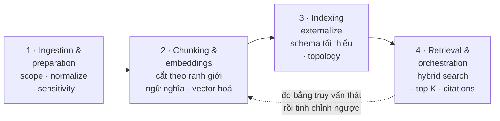
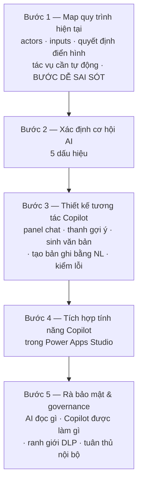
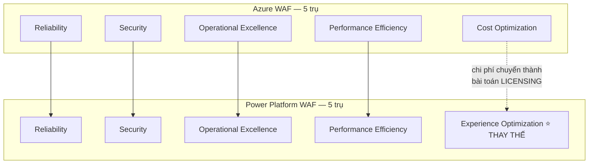

# Note 13 — Grounding pipeline, Power Apps, Well-Architected & success criteria

> [!summary] TL;DR
> Note khép lại module *Design AI agents*, gom **5 unit còn lại** thành bốn khối:
> 1. **Pipeline dữ liệu cho grounded AI** — bốn chặng **Ingestion & preparation → Chunking & embeddings → Indexing → Retrieval & orchestration**. Ba quyết định chốt: **hybrid search** (vector + keyword + semantic reranker) là mặc định · **externalize thành search index**, đừng truy vấn hệ thống sống mỗi lượt · **trích dẫn nguồn (provenance)** để phục vụ audit.
> 2. **Power Apps**: **generative pages** (mô tả bằng ngôn ngữ tự nhiên → Power Apps tự sinh layout, binding, form) + **agent feed** (lớp AI đưa insight và next-best action vào ngay trong app) + **code-first extension** khi cần logic phức tạp; và cách nhúng AI vào **canvas app** theo 5 bước.
> 3. **Power Platform Well-Architected Framework — 5 trụ**: **Reliability · Security · Operational Excellence · Performance Efficiency · Experience Optimization**. ⚠️ **Khác Azure WAF ở đúng một trụ**: Azure có **Cost Optimization**, Power Platform thay bằng **Experience Optimization**.
> 4. **Success criteria & adoption goals** — *success criteria* nói **kết quả gì**, *adoption goals* nói **tổ chức đón nhận và mở rộng ra sao**. Sáu nhóm tiêu chí thành công; bốn trụ của **AI Adoption Plan** theo CAF.
>
> Thuật ngữ: **RAG** (Retrieval-Augmented Generation) = kiến trúc lấy đoạn văn liên quan từ kho dữ liệu rồi nhét vào prompt để model trả lời có căn cứ. **Chunking** = cắt tài liệu thành đoạn nhỏ trước khi lập chỉ mục. **Embedding** = biểu diễn văn bản thành vector số để so sánh ngữ nghĩa. **Semantic reranker** = bước xếp lại thứ tự kết quả theo mức liên quan thực sự. **Top K** = số đoạn văn tốt nhất được lấy về. **SLO** (Service Level Objective) = mục tiêu mức dịch vụ, ở đây là mức tươi mới của chỉ mục. **PCF** (Power Apps Component Framework) = khung tự viết control giao diện cho Power Apps.

---

## 1. Pipeline dữ liệu cho grounded AI (U12) ⭐⭐

### 1.1. Vì sao grounding quan trọng

> **Grounding cung cấp dữ liệu đáng tin cậy, liên quan tới tác vụ cho model **tại thời điểm suy luận (inference time)**, để phản hồi **chính xác, cập nhật và kiểm toán được** (accurate, current, auditable).

Hướng dẫn của Microsoft coi grounding — thường qua **RAG** — là **yếu tố cốt lõi** khi xây giải pháp doanh nghiệp.

> ⭐ **Azure Well-Architected bổ sung một điểm dễ bỏ qua: thiết kế dữ liệu là việc LẶP (iterative).** Bạn tinh chỉnh prompt và ngữ cảnh, **kiểm thử bằng truy vấn thật**, rồi điều chỉnh tiền xử lý, embedding và chunking theo những gì học được. Không có cấu hình "đúng ngay lần đầu".

### 1.2. Bốn chặng của pipeline

#### Chặng 1 — Ingestion & preparation

| Việc | Nội dung |
|---|---|
| **Scope the corpus** | Bắt đầu từ **nguồn người dùng tin tưởng** và **thay đổi đúng nhịp mà kịch bản đòi hỏi**. **Loại nội dung không liên quan hoặc trùng lặp**, **chuẩn hoá định dạng** |
| **Normalize and enrich** | **Làm sạch văn bản**, áp **metadata nhất quán**, và khi hữu ích thì **làm giàu bằng tag hoặc cặp Q&A** để tăng chất lượng khớp lúc truy xuất |
| **Respect sensitivity and residency** | **Giữ nguyên nhãn phân loại dữ liệu** (data classification label) và **không lập chỉ mục dữ liệu cá nhân không cần thiết** |

#### Chặng 2 — Chunking & embeddings

| Việc | Nội dung |
|---|---|
| **Chunking** | Chọn **kích thước chunk vừa với context window của model** *và* **ranh giới ngữ nghĩa của tài liệu**. ⚠️ **Chunking kém làm TĂNG chi phí và GIẢM chất lượng câu trả lời** — thiệt hại kép |
| **Embeddings** | Lưu **biểu diễn vector** để bật semantic và hybrid search; **ưu tiên hybrid** (vector + keyword + semantic ranker) để tăng **recall** (độ bao phủ) và **relevance** (độ liên quan) |

#### Chặng 3 — Indexing strategy

| Việc | Nội dung |
|---|---|
| **Externalize to a search index** | ⚠️ **ĐỪNG truy vấn hệ thống sống ở mỗi lượt hội thoại.** Dựng chỉ mục **tối ưu cho câu hỏi của bạn** và **làm tươi theo lịch dựa trên SLO** |
| **Schema & capabilities** | Đánh dấu trường là **searchable, filterable, sortable, retrievable** **chỉ khi thật sự dùng** — mỗi khả năng thừa **làm tăng kích thước và chi phí** |
| **Topology** | Dùng **một chỉ mục cho đơn giản**; **tách nhiều chỉ mục khi khác đối tượng người dùng, khác ranh giới tuân thủ, hoặc khác mẫu truy vấn**. **Lên kế hoạch cho side-by-side rebuild** (dựng chỉ mục mới song song rồi mới chuyển) |

#### Chặng 4 — Retrieval & orchestration

| Việc | Nội dung |
|---|---|
| **Retrieval modes** | Kết hợp **vector query + keyword search + semantic reranking**; **hybrid search nhìn chung cho kết quả đáng tin cậy nhất** |
| **RAG orchestration** | Lấy **top K đoạn văn theo bộ lọc** (ví dụ: sản phẩm, khu vực, vai trò), rồi **dựng prompt có grounding kèm TRÍCH DẪN NGUỒN để truy vết được** |

`★ Insight ─────────────────────────────────────`
Ba câu "đừng" của chặng 2 và 3 đáng nhớ vì chúng đều nói về **chi phí ẩn**, thứ đề AB-100 hay khai thác ở vai trò architect.

**"Chunking kém làm tăng chi phí VÀ giảm chất lượng"** — hai thứ này thường đánh đổi nhau, ở đây thì không. Chunk quá to nhét nhiều token vô ích vào prompt (tốn tiền) mà vẫn loãng ý (kém chất lượng); chunk quá nhỏ cắt đứt mạch ý nên phải lấy nhiều chunk hơn (vẫn tốn tiền) mà vẫn thiếu ngữ cảnh. Không có hướng nào an toàn — phải cắt **theo ranh giới ngữ nghĩa**, không theo số ký tự.

**"Đừng truy vấn hệ thống sống mỗi lượt"** là quyết định kiến trúc lớn nhất của chặng 3. Truy vấn trực tiếp nghe có vẻ "luôn tươi mới", nhưng nó đánh đổi **độ trễ, tải lên hệ thống nghiệp vụ, và khả năng tối ưu cho câu hỏi**. Giải pháp là chỉ mục ngoài + **lịch làm tươi theo SLO** — tức bạn *cam kết* một mức cũ chấp nhận được thay vì đuổi theo real-time.

**"Chỉ bật cờ schema khi thật sự dùng"** là phiên bản chi phí của nguyên tắc *limit data scope* đã gặp ba lần trước đó. Lần này thiệt hại đo được bằng tiền: mỗi khả năng thừa làm phình dung lượng chỉ mục.
`─────────────────────────────────────────────────`

### 1.3. Ba lựa chọn nền tảng để grounding

| Nền tảng | Dùng khi | Chi tiết |
|---|---|---|
| **Azure Well-Architected + Azure AI Search** | Cần **xương sống truy xuất** ở cấp doanh nghiệp | Quản **ingestion, chunking, embedding, schema và độ tươi** bằng các mẫu bảo trì chỉ mục — ví dụ **side-by-side rebuild** |
| **Microsoft Foundry (RAG với dữ liệu của bạn)** | Xây **agent grounding trên dữ liệu riêng** bằng code | Dùng **Foundry portal và SDK**; làm dữ liệu trở nên tìm kiếm được |
| **Copilot Studio & AI Builder (grounded prompt trên Dataverse)** | Kịch bản **low-code** | **AI Builder grounded prompt** sinh phản hồi dựa trên **dữ liệu Dataverse**, và **prompt tái sử dụng được trong Power Apps, Power Automate và Copilot Studio**. ⚠️ **Có điều kiện về licensing và môi trường** |

> Nguồn còn nhắc **Microsoft Foundry IQ** và **Agent 365** trong phần tham chiếu, gắn với *enterprise grounding, governance và model routing*. Về **model router**, xem [[08-ROI-TCO-va-Build-Buy-Extend]].

### 1.4. Bảng chuẩn: quyết định thiết kế & đánh đổi ⭐

| Design area | Preferred options (typical) | Why it matters |
|---|---|---|
| **Retrieval mode** | **Hybrid** (vector + keyword + semantic rerank) | **Độ liên quan tốt nhất** xuyên cách diễn đạt, từ đồng nghĩa và thuật ngữ chính xác |
| **Chunking** | **Semantic chunk** kích thước vừa context của model | Cải thiện chất lượng câu trả lời và **giảm lãng phí token** |
| **Index topology** | **Một chỉ mục**, trừ khi khác đối tượng/tuân thủ | Đơn giản hoá schema và việc tinh chỉnh; **tách khi cần thiết** |
| **Freshness** | **Cập nhật theo SLO**; **side-by-side rebuild** | **Tránh câu trả lời cũ**; **kiểm thử chỉ mục trước khi chuyển đổi** |
| **Provenance** | **Trích dẫn tới nguồn** | **Xây niềm tin**; **phục vụ audit và rà soát** |

### 1.5. Ba nhóm cân nhắc vận hành

| Nhóm | Nội dung |
|---|---|
| **Cost and performance** | **Cờ khả năng của chỉ mục làm tăng dung lượng lưu trữ** → ưu tiên **schema tối thiểu khả dụng**, và **giới hạn top K + ngân sách token** |
| **Security and compliance** | **Giữ nguyên nhãn và kiểm soát truy cập từ nguồn tới chỉ mục**; thiết kế cho **"right to be forgotten"** (quyền được xoá dữ liệu) |
| **Evaluation** | **Lặp với truy vấn thật**; đo **chất lượng câu trả lời, độ đúng của trích dẫn, độ trễ và độ phủ** |

> ⭐ **"Right to be forgotten"** là yêu cầu kiến trúc thật sự khó: một khi văn bản đã được chunk, embed và đánh chỉ mục, việc xoá **một cá nhân** khỏi hệ đòi hỏi lần ngược từ chunk về tài liệu gốc. Đó là lý do chặng 1 dặn **đừng lập chỉ mục dữ liệu cá nhân không cần thiết** — cách rẻ nhất để xoá được là **đừng đưa vào từ đầu**.

---

## 2. Generative pages & agent feed trong Power Apps (U10)

### 2.1. Generative pages là gì

> **Generative pages** cho phép maker **mô tả yêu cầu bằng ngôn ngữ tự nhiên**, và Power Apps **tự động tạo layout trang, trải nghiệm dữ liệu và cấu trúc UI**. Việc này **tăng tốc phát triển bằng cách bỏ đi các bước dựng khung lặp đi lặp lại** (repetitive scaffolding).

**Năm bước hoạt động:**

1. Maker nhập prompt ngôn ngữ tự nhiên — ví dụ nguyên văn: *"Create a customer overview page showing recent orders, open cases, and a satisfaction score."*
2. **Power Apps phân tích dữ liệu Dataverse sẵn có**
3. **Generative engine tạo layout, binding và form**
4. Maker **tuỳ chọn điều chỉnh** trang bằng tính năng **code-first hoặc low-code**
5. Hệ thống **sinh nội dung khớp với bảo mật và governance cấp doanh nghiệp**

### 2.2. Vì sao vẫn cần code-first

Dù generative pages giảm thời gian thiết kế, **nhiều app doanh nghiệp vẫn cần tuỳ biến sâu hơn**. Developer code-first nâng cấp trang đã sinh bằng **5 thứ**: **JavaScript event handler · custom PCF control · Dataverse business logic · component & service tái sử dụng · security-aware data pipeline**.

| Need | Code-first benefit |
|---|---|
| **Complex business rules** | Hiện thực **logic không diễn đạt được chỉ bằng prompt** |
| **Highly customized UI** | Thêm **PCF component**, layout nâng cao |
| **Cross-system integration** | Dựng **connector, plugin, service call** |
| **Performance optimization** | **Tinh chỉnh mẫu tải, caching, batching** |
| **Compliance and governance** | **Nhúng rule, validation, safe compute pattern** |

### 2.3. Agent feed

> **Agent feed** đưa vào một **lớp do AI dẫn dắt**, cung cấp **insight và khuyến nghị thời gian thực ngay bên trong app**.

**Năm năng lực của agent feed:** **tóm tắt bản ghi hoặc quy trình** · **gợi ý hành động** (ví dụ *"follow-up with this customer"*) · **thông báo khi phát hiện bất thường** (anomaly) · **insight theo ngữ cảnh dựa trên dữ liệu của model-driven app** · **hướng dẫn từng bước và kích hoạt tự động hoá**.

**Cách hoạt động — 3 bước:** agent **theo dõi ngữ cảnh app, hành động của người dùng và bản ghi** → **hiển thị insight thẳng trong app** → **đưa ra next-best action khớp với mục tiêu nghiệp vụ**.

### 2.4. Khi nào dùng cái gì

| Scenario | Recommended Use |
|---|---|
| Cần **tạo nhanh màn hình dựa trên dữ liệu** | **Generative pages** |
| Cần **hướng dẫn động do agent dẫn dắt** | **Thêm agent feed** |
| App cần **gợi ý tự động** | **Agent feed triggers** |
| Developer phải **mở rộng hoặc ghi đè UI đã sinh** | **Code-first enhancements** |
| **Tự động hoá workflow khối lượng lớn** | **Kết hợp cả ba** (generative + agent + code-first) |

### 2.5. Bảng chuẩn: prompt-first ↔ code-first ↔ agent-driven ⭐

| Approach | Strengths | Best Use Cases |
|---|---|---|
| **Prompt First (Generative)** | **Tạo nhanh**, ngôn ngữ tự nhiên, layout có hướng dẫn | **Prototype nhanh**, bản nháp đầu, **app do citizen developer làm** |
| **Code-first** | **Toàn quyền kiểm soát**, mở rộng được, **logic phức tạp** | **App doanh nghiệp có workflow tuỳ biến** |
| **Agent Driven** | **Giàu insight, thích ứng, có AI trợ giúp** | **Hỗ trợ ra quyết định**, **operational intelligence** |

`★ Insight ─────────────────────────────────────`
Ba cách tiếp cận này **không phải ba mức chất lượng tăng dần** — dễ hiểu nhầm rằng code-first "xịn hơn" prompt-first. Chúng trả lời **ba câu hỏi khác nhau**: prompt-first tối ưu **tốc độ dựng**, code-first tối ưu **quyền kiểm soát**, agent-driven tối ưu **chất lượng quyết định của người dùng cuối**.

Bằng chứng nằm ở hàng cuối bảng §2.4: kịch bản khó nhất — *tự động hoá workflow khối lượng lớn* — không chọn một trong ba mà **kết hợp cả ba**. Đó là mẫu kiến trúc thực tế: dùng generative để dựng khung nhanh, code-first để siết phần logic và tuân thủ, agent feed để lớp thông minh chạy trên đó.

Cùng một tinh thần "bậc thang, chọn bậc thấp nhất đủ dùng" của **SaaS agent first** ở [[05-Chien-luoc-Multi-Agent-va-Chon-nen-tang]] — nhưng khác một điểm quan trọng: ở đây các bậc **cộng dồn được**, không loại trừ nhau.
`─────────────────────────────────────────────────`

---

## 3. Nhúng AI vào business process trong Power Apps canvas app (U13)

### 3.1. Copilot hỗ trợ gì

**Copilot trong Power Apps Studio** cho phép maker **cập nhật logic app và dữ liệu bằng cách mô tả thay đổi bằng ngôn ngữ tự nhiên** — giảm thời gian thiết kế và tăng chất lượng app nhờ **bớt cấu hình thủ công**.

Ví dụ: **thêm trường mới vào bảng Dataverse · cập nhật logic validation · sinh màn hình từ dữ liệu · sửa quan hệ hoặc business rule · tạo trải nghiệm app mới bằng đầu vào hội thoại**.

**Plans** (kế hoạch) giúp **cấu trúc hoá quy trình nghiệp vụ TRƯỚC khi dựng app**. Copilot diễn giải plan rồi **đề xuất cấu trúc app phù hợp nhất**: **screens · entities · workflows · data operations · app templates**.

**Năm loại thành phần AI có thể có trong app:** **tạo dữ liệu có AI hỗ trợ · sinh trường và màn hình bằng Copilot · workflow do AI dẫn dắt · trợ lý Copilot nhúng trong app · tìm kiếm hoặc bảng trợ giúp bằng ngôn ngữ tự nhiên**.

### 3.2. Năm bước thiết kế quy trình có AI ⭐

**Bước 1 — Map quy trình hiện tại.** Xác định **5 thứ**: **actors** (người dùng, đội) · **inputs** (form, tài liệu, dữ liệu) · **quyết định điển hình** · **tác vụ cần tự động hoá** · **bước dễ sai sót** (error-prone steps).

**Bước 2 — Xác định cơ hội AI.** AI có giá trị nhất khi **5 dấu hiệu** xuất hiện:
1. Người dùng **thực hiện cập nhật lặp đi lặp lại**
2. **Dữ liệu cần được diễn giải hoặc tóm tắt**
3. Người dùng **cần hướng dẫn hoặc khuyến nghị**
4. **Đầu vào bằng ngôn ngữ tự nhiên giúp tăng tốc luồng công việc**
5. **Tự động hoá thay thế được quy trình thủ công nhiều bước**

*Ví dụ:* "Draft customer summary" bằng văn bản AI sinh · tự động tạo bản ghi từ tệp tải lên · dẫn người dùng điền form bằng prompt Copilot.

**Bước 3 — Thiết kế cách Copilot tham gia — 5 hình thức:** **panel trợ lý dạng chat trong canvas app** · **thanh gợi ý nhúng** · **văn bản/tóm tắt tự sinh** · **tạo bản ghi mới bằng ngôn ngữ tự nhiên** · **khuyến nghị kiểm lỗi/validation**.

**Bước 4 — Tích hợp trong Power Apps Studio.** Copilot có thể: **sinh màn hình từ dữ liệu · đề xuất cập nhật schema khi quy trình đổi · dựng bảng dữ liệu từ yêu cầu ngôn ngữ tự nhiên · gợi ý query hoặc công thức · hỗ trợ lặp liên tục qua thay đổi hội thoại**.

**Bước 5 — Rà bảo mật & governance — 4 câu hỏi:** **AI được truy cập dữ liệu nào?** · **Copilot được phép thực hiện hành động gì?** · **ranh giới DLP (Data Loss Prevention) ở đâu?** · **có tuân thủ governance nội bộ không?**

### 3.3. Bảng chuẩn: đặt AI ở đâu trong quy trình ⭐

| Business Process Step | AI Component to Add | Purpose |
|---|---|---|
| **Data Capture** | Trường form do AI sinh | **Giảm thời gian dựng thủ công** |
| **Evaluation / Decision** | **Gợi ý của Copilot** | **Cải thiện chất lượng quyết định** |
| **Document/Record Creation** | Văn bản do AI sinh | **Nhanh hơn, đầu ra nhất quán** |
| **Navigation & Help** | **Trợ lý Copilot** | **Giảm công đào tạo** |
| **Data Updates** | **Sửa bằng ngôn ngữ tự nhiên** | Ít cấu hình thủ công |
| **Workflow Automation** | **Hành động do AI khởi phát** | **Ít lặp lại, ít lỗi hơn** |

> 💡 Bảng này là **bản đồ để trả lời câu hỏi dạng "đặt AI vào đâu trong quy trình X"**. Đọc theo cột *Purpose* sẽ thấy AI phục vụ **bốn loại lợi ích** khác nhau: giảm **thời gian dựng** (data capture), tăng **chất lượng** (decision, creation), giảm **chi phí đào tạo** (navigation), và giảm **lỗi vận hành** (automation). Khi tư vấn ROI, mỗi loại lợi ích quy về một nhóm khác nhau trong **5 nhóm ROI** ở [[08-ROI-TCO-va-Build-Buy-Extend]].

---

## 4. Power Platform Well-Architected Framework (U14) ⭐⭐

### 4.1. WAF là gì và bắt nguồn từ đâu

> **Power Platform Well-Architected Framework (WAF)** cung cấp **cách tiếp cận có cấu trúc** để thiết kế workload ứng dụng hiện đại, **đáp ứng yêu cầu nghiệp vụ hiện tại đồng thời thích ứng với thách thức tương lai**. Nó **bắt nguồn từ và căn chỉnh theo Azure Well-Architected Framework**, bảo đảm **chất lượng kiến trúc nhất quán giữa Azure và Power Platform**.

Framework giúp đội ngũ **5 việc**: dựng **workload tin cậy** · tăng **thế trận bảo mật** (security posture) · cải thiện **hiệu quả vận hành** · **tối ưu hiệu năng** · **mang lại trải nghiệm người dùng xuất sắc**.

### 4.2. Năm trụ cột

| # | Pillar | Nội dung | Ví dụ |
|---|---|---|---|
| 1 | **Reliability** | Dựng **dư thừa và khả năng chống chịu** vào workload để đạt **mục tiêu uptime và phục hồi** | **Connector dư thừa và đường failover** · **retry policy tin cậy trong Power Automate** · **kiến trúc Dataverse có khả năng chống chịu** |
| 2 | **Security** | Bảo vệ **tính bí mật, toàn vẹn của dữ liệu và danh tính** | **Truy cập least-privilege qua Microsoft Entra ID** · **DLP policy xuyên các môi trường** · **connector và API call an toàn** |
| 3 | **Operational excellence** | Tăng độ tin cậy qua **observability, monitoring và governance tự động** | **Power Platform Admin Center analytics** · **ALM với Azure DevOps hoặc GitHub** · **cảnh báo chủ động khi hiệu năng đổi** |
| 4 | **Performance efficiency** | Bảo đảm workload **điều chỉnh theo nhu cầu thay đổi** với kiến trúc **phản hồi nhanh và mở rộng được** | **Dùng Dataverse cho workload khối lượng lớn** · **đẩy tác vụ nặng sang Azure Functions** · **right-sizing flow và độ song song của action** |
| 5 | **Experience optimization** | Mang lại **trải nghiệm có ý nghĩa** giúp người dùng **đạt kết quả thành công** | **Nhất quán UX xuyên các Power App** · **workflow có Copilot hỗ trợ** · **tuân thủ khả năng tiếp cận (accessibility)** |

### 4.3. Bảng chuẩn: trụ cột ↔ trọng tâm ↔ ứng dụng

| Pillar | Key Focus | Example Intelligent Workload Applications |
|---|---|---|
| **Reliability** | Resiliency, uptime | Hệ tự động hoá chống chịu tốt, connector dư thừa |
| **Security** | Identity, access, data protection | Luồng dữ liệu khách hàng an toàn |
| **Operational Excellence** | Monitoring, ALM | Governance tự động và kiểm soát phiên bản |
| **Performance Efficiency** | Scale, optimization | Power App lượng dùng cao với bảng Dataverse mở rộng được |
| **Experience Optimization** | UX, accessibility, user outcomes | Hướng dẫn Copilot trong app, thiết kế app tinh gọn |

### 4.4. Ánh xạ Azure WAF → Power Platform WAF ⭐

Azure WAF tối ưu workload cloud quanh **Reliability · Security · Cost Optimization · Operational Excellence · Performance Efficiency**. Power Platform WAF **thích ứng các nguyên tắc này cho workload low-code và ứng dụng thông minh**:

| Azure WAF Pillar | Power Platform Application | Example |
|---|---|---|
| **Reliability** | **Flow retry và fallback path** | Pipeline onboarding khách hàng tự động |
| **Security** | **DLP, least privilege, connector an toàn** | Ứng dụng HR có kiểm soát truy cập |
| **Cost Optimization** | **Licensing hiệu quả, đẩy compute ra ngoài** | **Đánh giá mức dùng premium connector** |
| **Operational Excellence** | **ALM, monitoring** | Triển khai tự động có governance |
| **Performance Efficiency** | **App Dataverse mở rộng được** | App tối ưu cho khối lượng dữ liệu nặng |

`★ Insight ─────────────────────────────────────`
Đây là **điểm bẫy rõ ràng nhất của unit này**, và nó nằm ngay chỗ hai bảng không khớp nhau.

Danh sách **5 trụ của Power Platform WAF** có **Experience Optimization** nhưng **KHÔNG có Cost Optimization**. Danh sách **5 trụ của Azure WAF** thì ngược lại — có **Cost Optimization**, không có Experience Optimization. Bốn trụ còn lại trùng tên. Nghĩa là bảng ánh xạ §4.4 **vẫn liệt kê Cost Optimization** (vì nó liệt kê theo trụ *Azure*), trong khi bảng §4.3 **không có** — dễ đếm nhầm thành 6 trụ nếu đọc lướt.

Vì sao Microsoft đổi đúng trụ đó? Vì trong Power Platform, **chi phí phần lớn bị khoá bởi mô hình licensing** chứ không phải bởi lựa chọn hạ tầng của architect — bạn không right-size được VM, bạn chọn gói license. Đổi lại, low-code đưa **người dùng nghiệp vụ** thành đối tượng trực tiếp, nên **trải nghiệm và khả năng tiếp cận** trở thành yếu tố quyết định thành bại của workload. Chi phí không biến mất — nó xuất hiện lại ở hàng *Cost Optimization → licensing hiệu quả, đánh giá premium connector* trong bảng ánh xạ.
`─────────────────────────────────────────────────`

---

## 5. Success criteria & adoption goals (U18)

### 5.1. Hai khái niệm, đừng nhầm ⭐

> **Success criteria** hướng dẫn **AI solution phải mang lại KẾT QUẢ GÌ**.
> **Adoption goals** hướng dẫn **tổ chức sẽ ĐÓN NHẬN và MỞ RỘNG những kết quả đó RA SAO**.

Không có sự rõ ràng về "thành công trông như thế nào", tổ chức đối mặt **3 rủi ro**: **triển khai AI không đạt kết quả nghiệp vụ** · **không được người dùng đón nhận** · **phát sinh rủi ro vận hành**.

**Success criteria phải đạt 5 tính chất:** **Business aligned** · **Measurable** · **Outcome driven** · **Time bounded** · **Feasible với dữ liệu và hệ thống sẵn có**.

### 5.2. Sáu nhóm tiêu chí thành công ⭐

| Category | Description | Example Success Indicators |
|---|---|---|
| **Business Value** | Lợi ích tổ chức **định lượng được** | **Giảm 40% thời gian xử lý** |
| **Operational Efficiency** | Cải thiện **workflow và tự động hoá** | **Giảm 30% tác vụ thủ công** trong workflow |
| **User Experience** | Tăng **năng suất hoặc sự hài lòng** | **Hoàn thành tác vụ nhanh hơn 20%** |
| **Quality & Accuracy** | **Độ chính xác cao hơn** khi ra quyết định | **Độ chính xác khuyến nghị của AI ≥ 85%** |
| **Risk & Compliance** | Áp dụng thực hành **Responsible AI** | **100% đầu ra được audit** cho governance |
| **Scalability** | Khả năng **hỗ trợ tăng trưởng tương lai** | **AI xử lý 10.000 request/ngày** |

> ⚠️ **Sáu con số này là "exam bait" điển hình** — 40% · 30% · 20% · ≥85% · 100% · 10k/ngày. Nhớ **cặp nhóm ↔ con số**, đừng nhớ riêng lẻ.

### 5.3. Bốn vùng adoption

| Vùng | Thành phần |
|---|---|
| **Organizational readiness** | **Leadership alignment · AI literacy · chương trình change enablement · cập nhật vai trò và luồng công việc** |
| **Data readiness** | **Chất lượng dữ liệu · tính sẵn có của dữ liệu · governance và tuân thủ Responsible AI** |
| **Technical readiness** | **Hạ tầng cho AI workload · tích hợp với hệ thống nghiệp vụ · monitoring và quản lý vòng đời** |
| **User adoption** | **Chứng minh giá trị rõ ràng · đào tạo và onboarding · vòng phản hồi để cải tiến liên tục** |

### 5.4. Bốn trụ của AI Adoption Plan (theo CAF)

| # | Trụ | Nội dung |
|---|---|---|
| 1 | **Establish business outcomes** | Định nghĩa **mục tiêu "northstar"** gắn với mục tiêu chiến lược: **tăng sự hài lòng khách hàng · giảm chi phí vận hành · tăng doanh thu hoặc năng suất · tăng tốc ra quyết định** |
| 2 | **Identify measurable AI scenarios** | Chọn kịch bản **khả thi cao + tác động nghiệp vụ cao**. Ví dụ: **tự động tóm tắt yêu cầu khách hàng · dự báo thay đổi nhu cầu · sinh nội dung liên lạc riêng cho từng khách** |
| 3 | **Assess AI feasibility** | Đánh giá **chất lượng dữ liệu · yêu cầu bảo mật · mức sẵn sàng kỹ năng · mức phù hợp của model** (predictive, generative, classification…) |
| 4 | **Establish program governance** | Bảo đảm adoption **có kiểm soát, có đạo đức, an toàn và lặp lại được**. Gồm: **chuẩn Responsible AI · quản lý vòng đời · metrics và monitoring · hướng dẫn bảo vệ dữ liệu** |

> 💡 Trụ 2 dùng đúng ma trận **feasibility × impact** — chọn ô "cao/cao". Đây là công cụ sàng lọc use case đã gặp ở [[04-CAF-cho-AI-va-Vong-doi-Agent]] (pha *AI Strategy*) và [[05-Chien-luoc-Multi-Agent-va-Chon-nen-tang]] (sàng lọc use case cho prebuilt agent).

### 5.5. Bảng chuẩn: nối tiêu chí thành công ↔ mục tiêu adoption ⭐

| Success Criterion | Corresponding Adoption Goal | Example Action |
|---|---|---|
| **Faster productivity** | **Tăng user adoption** | **Buổi onboarding AI** |
| **Improved quality** | **Nâng chuẩn dữ liệu** | **Khung data governance** |
| **Reduced cost** | **Tự động hoá workflow** | **Dựng Power Platform + AI flow** |
| **Compliance** | **Tăng cường governance** | **Rà soát Responsible AI** |

`★ Insight ─────────────────────────────────────`
Bảng này chính là **cầu nối giữa hai khái niệm dễ nhầm** ở §5.1, và cách nó ghép cặp mới là điều đáng học.

Mỗi hàng đọc là: *"muốn đạt kết quả X thì phải thay đổi năng lực tổ chức Y"*. Đáng chú ý là **các cặp không hiển nhiên**. Muốn **chất lượng tốt hơn** thì mục tiêu adoption không phải "đào tạo model kỹ hơn" mà là **nâng chuẩn dữ liệu** — vì chất lượng đầu ra bị chặn trên bởi chất lượng grounding, đúng như 5 chiều dữ liệu ở [[03-Phan-tich-yeu-cau-va-Du-lieu-Grounding]]. Muốn **năng suất nhanh hơn** thì việc phải làm là **onboarding người dùng**, không phải tối ưu kỹ thuật — vì một agent giỏi mà không ai dùng thì năng suất bằng không.

Nói cách khác: **success criteria đo ở đầu ra, nhưng đòn bẩy để đạt nó gần như luôn nằm ở phía tổ chức và dữ liệu, không phải phía model.** Đây đúng là góc nhìn solution architect mà AB-100 kiểm tra.
`─────────────────────────────────────────────────`

---

## Câu hỏi phỏng vấn

> [!question] Vì sao không nên truy vấn thẳng hệ thống nghiệp vụ ở mỗi lượt hội thoại, mà phải externalize thành search index?
> Vì truy vấn trực tiếp đánh đổi ba thứ: **độ trễ** (hệ nghiệp vụ không tối ưu cho truy vấn ngữ nghĩa), **tải lên hệ thống production**, và **khả năng tối ưu chỉ mục cho chính các câu hỏi của bạn**. Giáo trình dặn dựng **chỉ mục tối ưu cho câu hỏi** rồi **làm tươi theo lịch dựa trên SLO** — nghĩa là *cam kết một mức cũ chấp nhận được* thay vì đuổi theo real-time. Khi cần cập nhật lớn, dùng **side-by-side rebuild**: dựng chỉ mục mới song song, kiểm thử, rồi mới chuyển đổi — tránh downtime và tránh đẩy chỉ mục hỏng ra production.

> [!question] Chunking kém gây hại thế nào, và chọn kích thước chunk dựa trên gì?
> Giáo trình nói **chunking kém vừa tăng chi phí vừa giảm chất lượng câu trả lời** — hiếm khi hai thứ này cùng xấu đi. Chunk quá to nhồi nhiều token vô ích vào prompt (tốn tiền) mà vẫn loãng ý; chunk quá nhỏ cắt đứt mạch ngữ nghĩa nên phải lấy nhiều chunk hơn (vẫn tốn tiền) mà vẫn thiếu ngữ cảnh. Tiêu chí chọn là **hai ràng buộc cùng lúc**: vừa **context window của model**, vừa **ranh giới ngữ nghĩa của tài liệu** — tức cắt theo ý, không theo số ký tự. Và vì thiết kế dữ liệu là **việc lặp**, phải kiểm thử bằng **truy vấn thật** rồi điều chỉnh chunking, embedding, tiền xử lý.

> [!question] Power Platform WAF có mấy trụ, và khác Azure WAF ở đâu?
> **Năm trụ**: Reliability, Security, Operational Excellence, Performance Efficiency, **Experience Optimization**. Azure WAF cũng năm trụ nhưng thay **Experience Optimization** bằng **Cost Optimization** — bốn trụ còn lại trùng tên. Lý do đổi: trong Power Platform, chi phí chủ yếu bị khoá bởi **mô hình licensing** chứ không phải lựa chọn hạ tầng của architect; đổi lại, low-code đưa **người dùng nghiệp vụ** thành đối tượng trực tiếp nên **trải nghiệm và accessibility** quyết định thành bại. Chi phí không biến mất — nó tái xuất trong bảng ánh xạ ở hàng *Cost Optimization → licensing hiệu quả, đánh giá mức dùng premium connector*.

> [!question] Khi nào dùng generative pages, khi nào code-first, khi nào agent feed?
> Chúng **không phải ba mức chất lượng** mà trả lời ba câu hỏi khác nhau: prompt-first tối ưu **tốc độ dựng** (prototype nhanh, citizen developer), code-first tối ưu **quyền kiểm soát** (business rule phức tạp, PCF control, tích hợp xuyên hệ thống, tối ưu hiệu năng, nhúng compliance), agent-driven tối ưu **chất lượng quyết định của người dùng cuối** (hỗ trợ ra quyết định, operational intelligence). Quan trọng: chúng **cộng dồn được**. Kịch bản khó nhất trong bảng — *tự động hoá workflow khối lượng lớn* — khuyến nghị **kết hợp cả ba**: generative dựng khung, code-first siết logic và tuân thủ, agent feed làm lớp thông minh chạy trên đó.

> [!question] Phân biệt success criteria và adoption goals, và cho một ví dụ ghép cặp không hiển nhiên.
> **Success criteria** nói **kết quả gì** — phải *business aligned, measurable, outcome driven, time bounded, feasible*. **Adoption goals** nói **tổ chức đón nhận và mở rộng ra sao** — trải trên bốn vùng: organizational, data, technical readiness và user adoption. Ví dụ ghép cặp đáng chú ý: tiêu chí **"improved quality"** không ghép với "huấn luyện model kỹ hơn" mà với mục tiêu adoption **"nâng chuẩn dữ liệu"**, hành động cụ thể là **dựng khung data governance** — vì chất lượng đầu ra bị **chặn trên bởi chất lượng grounding**. Tương tự, **"faster productivity"** ghép với **"tăng user adoption"** qua **buổi onboarding**, không phải qua tối ưu kỹ thuật: agent giỏi mà không ai dùng thì năng suất bằng không.

> [!question] Khách hàng lo về "right to be forgotten" trong hệ RAG. Bạn thiết kế thế nào?
> Đây là yêu cầu khó vì một khi văn bản đã **chunk → embed → index**, việc xoá dữ liệu của **một cá nhân** đòi hỏi lần ngược từ chunk về tài liệu gốc. Ba lớp phòng thủ: (1) **phòng ngừa từ chặng ingestion** — nguyên tắc *"đừng lập chỉ mục dữ liệu cá nhân bạn không cần"*; cách rẻ nhất để xoá được là không đưa vào; (2) **giữ nhãn phân loại và kiểm soát truy cập từ nguồn tới chỉ mục**, để dữ liệu nhạy cảm luôn truy vết được và luôn bị lọc theo quyền; (3) thiết kế **quy trình xoá** dựa trên **metadata liên kết chunk ↔ tài liệu nguồn**, kết hợp **side-by-side rebuild** khi cần dựng lại chỉ mục sạch. Đây là nhóm cân nhắc *security and compliance* trong phần vận hành.

---

## Tự kiểm tra

1. Grounding cung cấp gì, **tại thời điểm nào**, để phản hồi đạt **ba tính chất** nào?
2. Vì sao Azure Well-Architected nói thiết kế dữ liệu là việc **lặp**?
3. **Bốn chặng** của pipeline dữ liệu grounded AI?
4. Chặng ingestion làm **ba** việc gì? *"Respect sensitivity"* nghĩa cụ thể là gì?
5. **Chunking kém** gây **hai** thiệt hại nào? Chọn kích thước chunk theo **hai** ràng buộc nào?
6. Vì sao **hybrid search** được ưu tiên? Hybrid gồm **ba** thành phần nào?
7. Ba nguyên tắc của **indexing strategy**? Khi nào **tách nhiều chỉ mục**?
8. **Side-by-side rebuild** là gì và giải quyết vấn đề gì?
9. RAG orchestration: lấy gì, lọc theo gì, và **bắt buộc kèm gì** để truy vết?
10. **Ba nền tảng** grounding của Microsoft và mỗi cái hợp kịch bản nào?
11. Bảng đánh đổi: **5 design area** và lựa chọn ưu tiên của từng cái?
12. Ba nhóm **cân nhắc vận hành**? *"Right to be forgotten"* xử lý ra sao?
13. **Năm bước** hoạt động của generative pages? Prompt ví dụ của giáo trình?
14. **Năm** cách code-first mở rộng generative page? Bảng *need ↔ benefit* có **5 hàng** nào?
15. **Agent feed** là gì, có **5 năng lực** nào, hoạt động theo **3 bước** nào?
16. So sánh **prompt-first ↔ code-first ↔ agent-driven**: strengths và best use case. Kịch bản nào cần **cả ba**?
17. **Plans** trong Power Apps là gì, Copilot đề xuất **5 loại** cấu trúc app nào?
18. **Năm bước** thiết kế business process có AI trong canvas app? Bước 1 map **5** thứ gì?
19. **Năm dấu hiệu** cho thấy AI có giá trị? **Bốn câu hỏi** ở bước rà governance?
20. Bảng "đặt AI ở đâu": **6 bước quy trình** và AI component tương ứng?
21. **Năm trụ** của Power Platform WAF, mỗi trụ **một ví dụ**?
22. Power Platform WAF **khác Azure WAF ở trụ nào**, và vì sao đổi?
23. Phân biệt **success criteria ↔ adoption goals**. Success criteria phải đạt **5** tính chất nào?
24. **Sáu nhóm** tiêu chí thành công kèm **con số ví dụ** của từng nhóm?
25. **Bốn vùng** adoption? **Bốn trụ** của AI Adoption Plan theo CAF?
26. Bảng nối success criterion ↔ adoption goal: *"improved quality"* ghép với mục tiêu nào và **vì sao không phải** "huấn luyện model kỹ hơn"?

## Liên quan
- [[00-MOC-AB100]] — MOC bộ AB-100
- [[12-Copilot-Studio-Topics-Agent-Flows-Prompt-Actions]] — note trước: topic, NLU/CLU/generative, agent flow, prompt action
- [[14-Extensibility-Custom-Model-M365-Copilot-MCP]] — note sau: custom model Foundry, agent M365 Copilot, MCP
- [[03-Phan-tich-yeu-cau-va-Du-lieu-Grounding]] — 5 chiều chất lượng dữ liệu grounding, Azure Data Estate
- [[04-CAF-cho-AI-va-Vong-doi-Agent]] — CAF 6 pha, nơi AI Adoption Plan thuộc về
- [[06-Nguon-tri-thuc-Prompt-Library-va-SLM]] — nguồn tri thức Copilot Studio & giới hạn 500/5/25
- [[08-ROI-TCO-va-Build-Buy-Extend]] — 5 nhóm ROI, model router, chi phí licensing
- [[17-Khung-Giam-sat-va-Cong-cu]] — đo success criteria trong vận hành
- [[../AI-103/19-Knowledge-Mining-AI-Search]] — Azure AI Search, index & hybrid search, bản kỹ thuật chi tiết
- [[../AI-103/07-Foundry-IQ-Knowledge-Agents]] — Foundry IQ, knowledge agent & grounding trong Foundry
