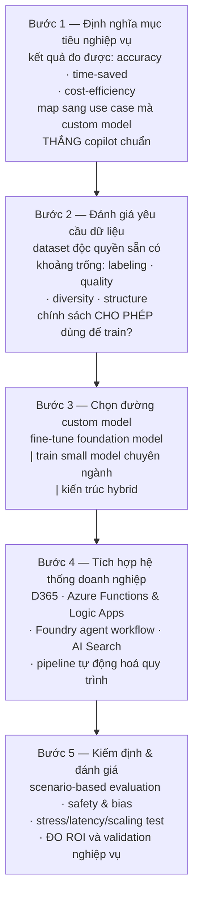
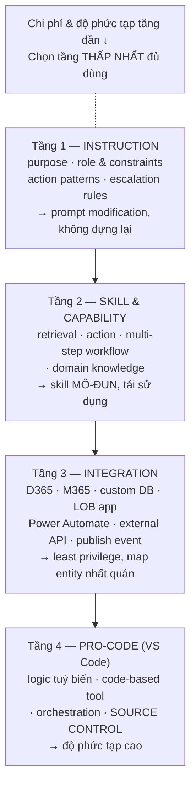

# Note 14 — Extensibility: custom model Foundry, agent M365 Copilot, Copilot Studio & MCP

> [!summary] TL;DR
> Bốn tầng mở rộng giải pháp AI, đi từ **model** lên tới **giao thức**:
> 1. **Custom model trong Microsoft Foundry** — **5 kịch bản** biện minh cho việc tự dựng model (ngôn ngữ chuyên ngành · quyết định tác động cao · chủ quyền dữ liệu · workflow độc đáo · tối ưu chi phí inference khối lượng lớn), quy trình thiết kế **5 bước**, và **ma trận quyết định Standard Copilot ↔ Custom model**.
> 2. **Agent trong Microsoft 365 Copilot** — khung thiết kế **A/B/C** (*Understand the core problem · Define agent behavior · Connect data and tools*), **4 mẫu cộng tác** (Sequential · Parallel · Feedback-loop · Orchestrated), và **Agent Builder** cho declarative agent.
> 3. **Extensibility trong Copilot Studio — 4 tầng**: **Instruction-level · Skill & capability · Integration · Pro-code (VS Code)**. Ba mẫu kiến trúc: **Modular · Multiagent collaboration · Domain-context**.
> 4. **MCP trong Copilot Studio** — MCP là **hợp đồng có cấu trúc** định nghĩa *agent được truy cập ngữ cảnh gì và diễn giải ra sao*. Trọng tâm của nguồn là **Dynamics 365 Finance & Operations**: MCP phơi ra **data entity, business process metadata, domain model, quy tắc bản địa hoá**.
>
> Thuật ngữ: **Fine-tuning** = huấn luyện thêm một model nền bằng dữ liệu chuyên ngành để đổi hành vi, không dựng lại từ đầu. **Drift** = hiện tượng model kém dần theo thời gian vì dữ liệu thực tế trôi khỏi dữ liệu huấn luyện. **Declarative agent** = agent khai báo bằng chỉ dẫn và cấu hình thay vì viết code. **MLOps/GenAIOps** = tự động hoá vòng đời model (kiểm định, phê duyệt, triển khai). **Zero-trust** = mô hình bảo mật không mặc định tin bất kỳ ai, luôn xác minh.

---

## 1. Custom model trong Microsoft Foundry (U2)

### 1.1. Năm kịch bản biện minh cho custom model ⭐

Solution architect quyết định **khi nào cần custom model** bằng cách đánh giá **độ phức tạp nghiệp vụ, yêu cầu dữ liệu, nhu cầu tuân thủ và mục tiêu hiệu năng**.

| # | Kịch bản | Nội dung |
|---|---|---|
| 1 | **Domain-specific language and reasoning** | Ngành như **luật, y tế, kỹ thuật, tài chính, sản xuất** cần model **hiểu thuật ngữ chuyên biệt và theo logic đặc thù ngành** |
| 2 | **High-impact decision processes** | Dùng khi **độ chính xác ảnh hưởng trực tiếp tới tuân thủ, kết quả tài chính, hoặc an toàn vận hành** |
| 3 | **Data sovereignty and governance mandates** | Custom model cho phép tổ chức **quyết định chính xác dữ liệu được xử lý, lưu trữ, đánh giá và giám sát ra sao** |
| 4 | **Unique workflows or personalization requirements** | **Copilot dựng sẵn có thể không hỗ trợ** mẫu tương tác tuỳ biến, **quy trình chạy dài**, hoặc **chuỗi công cụ độc quyền** |
| 5 | **Cost optimization for high-volume inference** | **Model nhỏ, chuyên biệt** có thể cho lợi thế **hiệu năng và chi phí** so với foundation model lớn |

> ⭐ Kịch bản 5 nghe ngược đời — tự dựng model để **tiết kiệm**? Đúng, và đây là logic **SLM** đã gặp ở [[06-Nguon-tri-thuc-Prompt-Library-va-SLM]]: chi phí một lần để huấn luyện model nhỏ được **khấu hao qua khối lượng inference lớn**. Ngưỡng hoà vốn phụ thuộc lưu lượng — đó là lý do điều kiện là **"high-volume"**, không phải mọi trường hợp.

### 1.2. Năm khối kiến trúc của Foundry

Microsoft Foundry là nền tảng **đầu-cuối** cho phát triển custom model, gồm công cụ cho **chuẩn bị dữ liệu, huấn luyện, đánh giá, triển khai, observability và governance**.

| Khối | Nội dung |
|---|---|
| **Model catalog** | Cung cấp **model nền** có thể **fine-tune hoặc tăng cường** bằng dữ liệu doanh nghiệp và tác vụ chuyên biệt |
| **Training and fine-tuning pipelines** | Điều phối **nạp dữ liệu, gán nhãn, đánh giá và cải tiến lặp ở quy mô lớn** |
| **Agent and tooling integration** | Custom model **nhúng được vào Foundry agent và orchestration** để hỗ trợ **suy luận nhiều bước và workflow tự động** |
| **Responsible AI controls** | **Content filtering · safety evaluation · transparency artifact · policy enforcement · auditability** |
| **Deployment topologies** | **Môi trường hosted an toàn** · **triển khai private networking** · **tích hợp với Azure Kubernetes Service và Foundry runtime** |

### 1.3. Quy trình thiết kế 5 bước

**Ba đường custom model ở Bước 3** — bảng phân biệt đáng nhớ:

| Đường | Làm gì | Hợp khi |
|---|---|---|
| **Fine-tuning foundation models** | **Điều chỉnh hành vi bằng dataset chuyên ngành mà KHÔNG huấn luyện lại toàn bộ** | Cần giọng/logic chuyên ngành trên nền năng lực rộng |
| **Training domain-built small models** | Dựng model nhỏ theo lĩnh vực | Tác vụ **nhẹ**, cần **tốc độ** và **tương thích edge** (chạy tại thiết bị biên) |
| **Hybrid architectures** | **Kết hợp custom model với copilot dựng sẵn** để **suy luận tăng cường** | Cần cả hai: nền tảng sẵn có + chuyên biệt hoá |

`★ Insight ─────────────────────────────────────`
Bước 2 chứa một câu dễ đọc lướt nhưng là **điểm chặn dự án thật sự**: *"Ensure governance policies allow data to be used in model training"* — **chính sách governance có CHO PHÉP dùng dữ liệu đó để huấn luyện không**.

Đây khác hẳn ba việc còn lại của bước 2. Đánh giá *labeling, quality, diversity, structure* là bài toán **kỹ thuật** — thiếu thì bù được bằng công sức. Nhưng "được phép dùng hay không" là bài toán **pháp lý và hợp đồng**, và câu trả lời "không" thì **không có cách kỹ thuật nào vượt qua**. Dữ liệu khách hàng thu thập theo một mục đích thường **không tự động được phép dùng để huấn luyện model**.

Vì vậy thứ tự đúng là **hỏi câu pháp lý TRƯỚC** khi bỏ công đánh giá chất lượng dataset — ngược lại thì bạn có thể làm sạch xong một kho dữ liệu rồi mới biết không được dùng. Điểm này nối thẳng với **data residency và compliance** ở [[24-Governance-Data-Residency-va-Responsible-AI]].
`─────────────────────────────────────────────────`

### 1.4. Vận hành hoá custom model — 4 thành phần

| Thành phần | Nội dung |
|---|---|
| **Model monitoring and observability** | Theo dõi **drift · suy giảm hiệu năng · vùng gây khó chịu cho người dùng · latency · đầu ra bất thường** |
| **Governance and compliance controls** | Bảo đảm **mọi lần triển khai** đáp ứng yêu cầu **privacy, security và quy định** |
| **Versioning and lifecycle management** | Giữ **dấu vết phiên bản model rõ ràng, pipeline cập nhật, và chiến lược rollback** |
| **Deployment automation (MLOps/GenAIOps)** | Tự động hoá **kiểm định, luồng phê duyệt và triển khai theo từng môi trường** |

### 1.5. Ma trận quyết định: Standard Copilot ↔ Custom model ⭐⭐

| Decision factor | **Standard Copilot** | **Custom model (Foundry)** |
|---|---|---|
| **Domain specificity needed** | Low | **High** |
| **Compliance restrictions** | Moderate | **High** |
| **Performance requirements** | Medium | **High** |
| **Data confidentiality** | Medium | **Full control** |
| **Workflow complexity** | Low/Medium | **High** |
| **Inference cost optimization** | Moderate | **High (small language models)** |

> ⚠️ Chú ý hàng cuối ghi rõ ngoặc **"(small language models)"** — nghĩa là **lợi thế chi phí của custom model đến từ SLM**, không phải từ việc fine-tune một model lớn. Fine-tune model lớn thì chi phí inference **không giảm**. Đây là chi tiết phân biệt tinh tế mà đề hay dùng để loại đáp án.

> 💡 Ma trận này bổ sung cho **5 Fit** (Business · Model · Data · Cost · Operational) ở [[05-Chien-luoc-Multi-Agent-va-Chon-nen-tang]]: 5 Fit là **danh sách kiểm tra trước khi quyết**, ma trận này là **bảng so sánh hai phương án**.

---

## 2. Thiết kế agent trong Microsoft 365 Copilot (U3)

### 2.1. Copilot agent là gì và chạy ở đâu

> **Copilot agent** = thành phần AI **mô-đun, do chỉ dẫn dẫn dắt** (instruction-driven), thiết kế để thực hiện **một tác vụ hoặc workflow nghiệp vụ cụ thể**. Agent **tuân theo chỉ dẫn có cấu trúc, tận dụng dữ liệu tổ chức, và dùng tool + connector để hành động**.

**Bốn nhóm việc agent thường hỗ trợ:** **task automation** (lên lịch, nghiên cứu, thực thi workflow) · **truy xuất thông tin từ Microsoft Graph** và hệ thống tích hợp · **thao tác nhiều bước** (phân loại, phân tích, định tuyến) · **workflow cộng tác** (soạn nháp, tóm tắt).

**Năm nơi agent hoạt động:** **Microsoft Teams · Microsoft Outlook · Microsoft Loop · SharePoint · ứng dụng line-of-business tuỳ biến qua extensibility point**.

> Architect **căn thiết kế agent theo quy trình nghiệp vụ ĐANG DIỄN RA sẵn** trong các ứng dụng này — không bắt người dùng đổi chỗ làm việc.

### 2.2. Khung thiết kế agent A / B / C ⭐

| Bước | Nội dung | Câu hỏi/việc cụ thể |
|---|---|---|
| **A. Understand the core problem** | Định nghĩa bài toán | **Agent chịu trách nhiệm tác vụ gì?** · **Hỗ trợ mục tiêu nghiệp vụ nào?** · **Phải ra những quyết định gì?** · **Phải tương tác với hệ thống nào?** |
| **B. Define agent behavior** | Định nghĩa hành vi | **Role** (ví dụ *"act as a customer service triage assistant"*) · **năng lực ĐƯỢC và KHÔNG được phép** · **guardrails** (tone, ranh giới nội dung, giới hạn tuân thủ) · **điều kiện escalate lên người** |
| **C. Connect data and tools** | Nối dữ liệu & công cụ | **Microsoft Graph data** · **nội dung tổ chức** (SharePoint, OneDrive, tin nhắn Teams, tệp) · **connector và action dựng sẵn** · **custom API khi cần** |

> ⚠️ Ở bước C, architect phải bảo đảm agent làm việc **trong ranh giới least-privilege và zero-trust**.

**Nguyên tắc phạm vi:** agent nên giải **MỘT nhu cầu giá trị cao**. Năm ví dụ nguồn nêu: **chuẩn bị lead & opportunity · phân loại case và soạn nháp phản hồi · Q&A về chính sách hoặc tri thức · tóm tắt xuyên ứng dụng để tăng năng suất · quyết định định tuyến workflow**.

### 2.3. Bốn mẫu agent cộng tác ⭐

> **Collaborative agents** hỗ trợ workflow nhiều bước xuyên các app Microsoft 365. Chúng **truyền ngữ cảnh, tái sử dụng chỉ dẫn có cấu trúc, và xây trên đầu ra của nhau**.

| Pattern | Cách hoạt động |
|---|---|
| **Sequential workflow** | **Agent A → Agent B → người rà soát** |
| **Parallel evaluation** | **Nhiều agent cùng chấm điểm/phân tích dữ liệu, rồi hợp kết quả** |
| **Feedback-loop iteration** | Một agent **tinh chỉnh nội dung** (nháp, insight, tóm tắt) **cho tới khi đạt chất lượng** |
| **Orchestrated interaction** | **Agent chính uỷ thác tác vụ con** dựa trên ý định hoặc điều kiện |

> Architect phải **định nghĩa rõ quy tắc bàn giao (handoff rules) và ranh giới trách nhiệm** để kết quả **dự đoán được**.

`★ Insight ─────────────────────────────────────`
Bốn mẫu này **ánh xạ gần một-một** với 5 mẫu điều phối của **Microsoft Agent Framework** ở [[05-Chien-luoc-Multi-Agent-va-Chon-nen-tang]] — nhưng **không trùng khít**, và chỗ lệch mới là điều đáng nhớ.

*Sequential* ↔ **Sequential**. *Parallel evaluation* ↔ **Concurrent**. *Orchestrated interaction* ↔ **Magentic** (có agent điều phối uỷ thác). Nhưng **Feedback-loop iteration** thì **không có tương ứng** trong 5 mẫu kia, còn **Handoff** và **Group chat** thì **không xuất hiện** ở đây.

Vì sao? Vì đây là hai lớp trừu tượng khác nhau. Agent Framework mô tả **cách nhiều agent nói chuyện với nhau** (bao gồm chuyển quyền và thảo luận nhóm). Danh sách M365 Copilot mô tả **hình dạng workflow nghiệp vụ** — nên nó có *feedback loop* (một agent tự lặp để đạt chất lượng), thứ không cần đến agent thứ hai. Gặp câu hỏi trong đề, đọc kỹ **ngữ cảnh nền tảng**: hỏi về Foundry/Agent Framework thì trả lời theo 5 mẫu; hỏi về agent trong M365 Copilot thì trả lời theo 4 mẫu này.
`─────────────────────────────────────────────────`

### 2.4. Agent Builder

> **Agent Builder** trong Microsoft 365 Copilot là **cách dễ nhất để dựng declarative agent tuỳ biến**.

**Năm năng lực:** **cấu hình từng bước** · **truy cập tool dựng sẵn** · **soạn chỉ dẫn kiểu declarative** · **workspace kiểm thử và validation** · **kiểm soát publish tới Microsoft 365**.

**Quy trình 6 bước của Agent Builder:**
1. **Định nghĩa mục đích** của agent
2. **Thêm chỉ dẫn, tác vụ và guardrail**
3. **Nối nguồn dữ liệu**
4. **Cấu hình action và quyền**
5. **Kiểm thử với prompt mẫu**
6. **Publish tới người dùng hoặc nhóm đích**

> Agent Builder **cưỡng chế sự rõ ràng về ý định** (enforces clarity of intent) và bảo đảm **an toàn cấp doanh nghiệp**.

### 2.5. Vận hành & thiết kế kịch bản

**Sáu trách nhiệm vận hành:** **giám sát chất lượng agent và phản hồi người dùng** · **cập nhật chỉ dẫn cho chính xác** · **thực thi kiểm soát truy cập và bảo vệ dữ liệu** · **rà log để tuân thủ** · **đánh phiên bản agent theo quy trình governance** · **nhận diện kịch bản mới từ nhu cầu người dùng**.

**Bốn câu hỏi khi thiết kế kịch bản:**
1. Kịch bản có cần **ngữ cảnh xuyên ứng dụng** (cross-app context) không?
2. Người dùng có **hưởng lợi từ việc tự động thực thi tác vụ** không?
3. Agent phục vụ **frontline worker hay knowledge worker**?
4. Có ràng buộc gì về **latency, an toàn hoặc độ tin cậy**?

---

## 3. Bốn tầng extensibility trong Copilot Studio (U4) ⭐⭐

Extensibility của Copilot Studio cho phép tổ chức **5 việc**: **thêm logic và hành vi tuỳ biến** · **tích hợp hệ thống doanh nghiệp qua connector, API hoặc action** · **sửa và đánh phiên bản chỉ dẫn agent bằng kỹ thuật prompt modification** · **mở rộng agent bằng tuỳ biến cấp phát triển qua Visual Studio Code** · **hỗ trợ governance, safety và kiểm soát vòng đời**.

### 3.1. Tầng 1 — Instruction-level extensibility

Định nghĩa **hành vi, giọng điệu, ranh giới và thẩm quyền suy luận** của agent. Architect tinh chỉnh **4 thứ**:

| Thành phần | Nội dung |
|---|---|
| **Purpose** | **Vì sao agent tồn tại** |
| **Role and constraints** | **Được phép và không được phép làm gì** |
| **Action patterns** | **Workflow ưu tiên và các điểm ra quyết định** |
| **Escalation rules** | **Khi nào chuyển tác vụ cho người hoặc hệ thống khác** |

> **Prompt modification** giúp **thêm quy tắc và hành vi tuỳ biến mà KHÔNG phải dựng lại toàn bộ agent** — đây là giá trị lớn nhất của tầng này.

### 3.2. Tầng 2 — Skill and capability extensibility

**Bốn mẫu mở rộng skill:** **thêm retrieval skill từ nguồn nội dung doanh nghiệp** · **thêm action-oriented skill qua Power Platform connector hoặc custom API** · **thêm workflow nhiều bước cho tác vụ có cấu trúc** · **thêm domain knowledge để tăng độ chính xác và giảm thông tin sai**.

> ⭐ Nguyên tắc: architect nên tạo **skill mô-đun, tái sử dụng được** để **tránh trùng lặp giữa các agent**.

### 3.3. Tầng 3 — Integration extensibility

Cho phép agent **4 việc**: **lấy dữ liệu từ Dynamics 365, Microsoft 365, CSDL tuỳ biến hoặc app line-of-business** · **thực thi action qua Power Automate flow** · **tương tác với API bên ngoài cho chức năng chuyên ngành** · **publish event hoặc command tới ứng dụng khác**.

**Ba cân nhắc khi thiết kế tích hợp:** **data governance và least-privilege access** · **chuẩn hoá command và tương tác** · **map thực thể nghiệp vụ nhất quán xuyên các hệ thống**.

### 3.4. Tầng 4 — Pro-code extensibility trong Visual Studio Code

**Bốn năng lực:** **tạo logic agent tuỳ biến và component tái sử dụng** · **viết tool và action bằng code** · **hiện thực biến đổi dữ liệu và logic orchestration tuỳ biến** · **tích hợp source control cho chất lượng, kiểm thử và quản lý vòng đời**.

> Mô hình này **lý tưởng cho tổ chức cần hành vi agent độ phức tạp cao, mẫu tích hợp sâu, hoặc orchestration tuỳ biến**.

### 3.5. Ba mẫu kiến trúc cho agent mở rộng được

| Pattern | Nội dung | Lợi ích / thành phần |
|---|---|---|
| **Pattern 1 — Modular agent architecture** | Agent cấu trúc bằng **component hoán đổi được**: instructions, skills, integrations, tools | **Cập nhật và đánh phiên bản nhanh hơn** · **tái sử dụng module xuyên nhiều agent** · **cô lập tốt hơn cho tuân thủ và thiết kế an toàn** |
| **Pattern 2 — Multiagent collaboration** | Trong môi trường phức tạp, **một agent KHÔNG nên làm mọi thứ**; tạo nhiều agent chuyên biệt cộng tác qua **giao thức đã định** | Ví dụ: **research agent** lấy dữ liệu · **workflow agent** thực thi tác vụ hệ thống · **communication agent** soạn và định dạng nội dung |
| **Pattern 3 — Domain-context pattern** | Agent **điều chỉnh suy luận theo hệ thống, môi trường hoặc lĩnh vực** đang làm việc | Định nghĩa **thuật ngữ đặc thù lĩnh vực · business rule & ràng buộc · chính sách và ranh giới truy cập · kết quả kỳ vọng cho từng vùng lĩnh vực** |

### 3.6. Framework "Architecting agent solutions"

Microsoft có bộ nội dung **Architecting agent solutions** nêu **nguyên tắc và mẫu** để dựng agent an toàn, tin cậy. Framework này:

- **Thể hiện vai trò dẫn dắt** bằng cách lập **chuẩn ngành cho kiến trúc agent**
- Cung cấp **hướng dẫn khuyến nghị** để phát triển agent cho Copilot, **giảm sự nhầm lẫn**
- Bảo đảm **chất lượng và niềm tin** bằng cách ưu tiên **reliability, traceability và responsible AI** cho giải pháp **an toàn, kiểm toán được**
- **Cho phép mở rộng quy mô** — developer dựng giải pháp theo best practice **mà không cần hỗ trợ kỹ thuật từ Microsoft**
- **Chuẩn hoá thuật ngữ và tiêu chí đánh giá** cho giải pháp Copilot và agent trong toàn tổ chức

**Framework phủ 3 chủ đề:** **Fit for purpose · Operability · Trust, traceability, and transparency**.

> ⚠️ **Framework này KHÔNG phủ** những gì đã có ở các chuẩn đã thiết lập: **Azure Well-Architected Framework, Power Platform Well-Architected, NIST**, hoặc các khung bảo mật được công nhận khác. → Chi tiết phân định phạm vi này đề có thể hỏi: *"khung nào phủ vấn đề X"*.

---

## 4. MCP trong Copilot Studio (U5)

### 4.1. MCP là gì trong ngữ cảnh này

> **MCP (Model Context Protocol)** đóng vai **hợp đồng có cấu trúc** (structured contract) định nghĩa **agent được truy cập ngữ cảnh gì** và **ngữ cảnh đó phải được diễn giải ra sao**.

Trong kịch bản **Dynamics 365 Finance & Operations (F&O)**, MCP **phơi ra**: **business entity, quan hệ, nhãn (label), cấu trúc metadata và đối tượng đặc thù lĩnh vực** mà agent suy luận trên đó.

**Năm lý do MCP quan trọng:**
1. Bảo đảm **ngữ nghĩa nghiệp vụ nhất quán** xuyên các AI agent
2. **Giảm thông tin sai** bằng cách grounding agent vào **ngữ cảnh F&O thật**
3. Cho phép **khả năng tương tác đa ứng dụng** và **logic doanh nghiệp dùng chung**
4. Cải thiện **khả năng giải thích (explainability) và governance**
5. **Tăng tốc extensibility** bằng cách **chuẩn hoá cách agent tiêu thụ ngữ cảnh hệ thống**

`★ Insight ─────────────────────────────────────`
Định nghĩa MCP ở đây khác cách thường được trình bày, và khác biệt đó có ý nghĩa kiến trúc.

Ở [[../AI-103/06-Custom-Tools-va-MCP-Tools]] và [[../../../00-Foundations/07-GitHub-Copilot/12-GitHub-MCP-Server]], MCP thường được mô tả như **giao thức để agent gọi TOOL** — nhấn mạnh phía *hành động*. Ở đây, AB-100 định nghĩa nó là **hợp đồng về NGỮ CẢNH**: không chỉ *"agent gọi được gì"* mà **"agent được thấy gì và phải hiểu thứ nó thấy như thế nào"**.

Sự khác biệt quan trọng với D365 F&O vì hệ ERP có **ngữ nghĩa nghiệp vụ dày đặc**: một trường `Status = 3` chẳng nói gì nếu thiếu **label, workflow metadata và approval chain** đi kèm. MCP mang theo cả lớp ngữ nghĩa đó, nên agent không chỉ đọc được dữ liệu mà **diễn giải đúng theo quy tắc nghiệp vụ**. Đó chính là lý do lý do số 1 là *"ngữ nghĩa nghiệp vụ nhất quán"* chứ không phải *"gọi được nhiều tool hơn"*.
`─────────────────────────────────────────────────`

### 4.2. Instruction-level extensibility cho agent dùng MCP

Agent phải được thiết kế với **chỉ dẫn mô-đun, phân lớp**. **Năm thành phần cốt lõi:**

| Thành phần | Vai trò |
|---|---|
| **Purpose statement** | Làm rõ **chức năng chính** |
| **Role definition** | Đặt **giọng điệu và góc nhìn** |
| **Behavior rules** | Định nghĩa **tuân thủ, an toàn và guardrail** |
| **Context consumption logic** | **Giải thích dữ liệu MCP được dùng như thế nào** ⭐ |
| **Action boundaries** | Định nghĩa **năng lực đã được phê duyệt** |

> ⭐ **`Context consumption logic` là thành phần chỉ xuất hiện khi có MCP** — bốn thành phần còn lại trùng với instruction-level extensibility thường (§3.1). Đây là điểm phân biệt: có MCP thì phải khai báo **cách diễn giải ngữ cảnh**, không chỉ khai báo hành vi.

### 4.3. MCP phơi ra những gì trong D365 F&O

| Loại thông tin | Ví dụ |
|---|---|
| **Data entities** | **Customers, vendors, products** |
| **Business process metadata** | **Workflow, status value, approval chain** |
| **Domain models** | **Financial dimension, ledger model** |
| **Localization rules and taxonomies** | Quy tắc bản địa hoá và phân loại |

Nhờ đó agent có thể **4 việc**: **hiểu thuật ngữ lĩnh vực nghiệp vụ** · **kéo ngữ cảnh có cấu trúc liên quan để suy luận** · **sinh phản hồi chính xác, khớp chính sách** · **tạo lời giải thích khớp với business rule**.

### 4.4. Ba mẫu tích hợp cho agent dùng MCP ⭐

| Pattern | Cách hoạt động | Lý tưởng cho |
|---|---|---|
| **A — Context-driven reasoning** | Agent **lấy ngữ cảnh MCP thời gian thực** để bảo đảm phản hồi **phản ánh business rule có thẩm quyền** | **Tác vụ nhạy cảm về tuân thủ** · **luồng tài chính** · **mua sắm và quản lý nhà cung cấp** |
| **B — Workflow-integrated agents** | Agent **tăng cường workflow** bằng MCP để **thúc đẩy phê duyệt, escalate ngoại lệ và tóm tắt trạng thái** | Quy trình có phê duyệt nhiều bước |
| **C — Multi-agent collaboration via MCP** | Dùng MCP để **chuẩn hoá dữ liệu mà mỗi agent tham chiếu**, cải thiện **cộng tác xuyên lĩnh vực** | Ví dụ: quy trình AI kết hợp **HR + Finance + Supply Chain** |

### 4.5. Governance & compliance cho agent dùng MCP

**Năm vùng trách nhiệm:**

1. **Truy cập dữ liệu được quản trị theo danh tính người dùng, dùng least privilege**
2. **Ranh giới ngữ cảnh MCP căn theo các kiểm soát tuân thủ**
3. **Ghi log quyết định của agent để kiểm toán được**
4. **Chỉ dẫn agent thực thi hành vi Responsible AI**
5. **Quyền sở hữu của Business và IT được thiết lập qua mô hình AI CoE**

> 💡 Điểm 5 nối thẳng về **AI Center of Excellence** ở [[07-Solution-Rules-Vai-tro-va-AI-CoE]] — MCP mở ra ngữ cảnh xuyên nhiều hệ thống, nên **phải có chủ sở hữu rõ ràng** cho việc quyết định *agent nào được thấy ngữ cảnh nào*. Đây là quyết định **liên phòng ban**, không phải quyết định kỹ thuật của một đội.

---

## Câu hỏi phỏng vấn

> [!question] Khi nào bạn khuyên khách hàng dựng custom model thay vì dùng Copilot chuẩn?
> Khi có **ít nhất một trong 5 kịch bản**: (1) cần **ngôn ngữ và logic chuyên ngành** — luật, y tế, kỹ thuật, tài chính, sản xuất; (2) **quyết định tác động cao** — độ chính xác ảnh hưởng tuân thủ, tài chính hoặc an toàn vận hành; (3) **chủ quyền dữ liệu** — cần quyết định chính xác dữ liệu được xử lý, lưu, đánh giá, giám sát ra sao; (4) **workflow độc đáo** — copilot dựng sẵn không hỗ trợ mẫu tương tác tuỳ biến, quy trình chạy dài, chuỗi công cụ độc quyền; (5) **tối ưu chi phí inference khối lượng lớn**. Dùng thêm **ma trận quyết định** để kiểm chéo: custom model thắng ở *domain specificity, compliance, performance, data confidentiality, workflow complexity* và *inference cost* — nhưng hàng cuối ghi rõ lợi thế chi phí đến từ **small language model**, không phải từ việc fine-tune model lớn.

> [!question] Trong 5 bước thiết kế custom model, bước nào hay chặn dự án nhất?
> **Bước 2 — đánh giá yêu cầu dữ liệu**, và cụ thể là câu *"chính sách governance có cho phép dùng dữ liệu này để huấn luyện không"*. Ba việc kia của bước 2 — rà **labeling, quality, diversity, structure** — là bài toán kỹ thuật, thiếu thì bù được bằng công sức. Nhưng "được phép hay không" là bài toán **pháp lý và hợp đồng**, và câu trả lời "không" thì không có cách kỹ thuật nào vượt qua: dữ liệu khách hàng thu thập cho một mục đích thường **không tự động được phép dùng để huấn luyện**. Vì vậy nên **hỏi câu pháp lý trước** khi đầu tư công làm sạch dataset.

> [!question] Bốn tầng extensibility của Copilot Studio là gì, và chọn tầng nào?
> **Tầng 1 — Instruction-level**: purpose, role & constraints, action patterns, escalation rules; sửa bằng **prompt modification** mà **không phải dựng lại agent**. **Tầng 2 — Skill & capability**: thêm retrieval skill, action skill qua connector/API, workflow nhiều bước, domain knowledge; nguyên tắc là **skill mô-đun, tái sử dụng để tránh trùng lặp**. **Tầng 3 — Integration**: lấy dữ liệu từ D365/M365/LOB, thực thi qua Power Automate, gọi API ngoài, publish event; phải lo **least privilege và map entity nhất quán**. **Tầng 4 — Pro-code trong VS Code**: logic tuỳ biến, tool bằng code, orchestration, **tích hợp source control**; dành cho độ phức tạp cao. Nguyên tắc chọn giống *SaaS agent first*: **dùng tầng thấp nhất đủ giải quyết bài toán**, vì chi phí và độ phức tạp tăng dần theo tầng.

> [!question] MCP trong Copilot Studio khác gì so với MCP mà bạn biết ở Foundry hay GitHub?
> Khác ở **trọng tâm**. Ở Foundry/GitHub, MCP thường được nhìn như **giao thức để agent gọi tool** — nhấn mạnh phía *hành động*. Ở đây AB-100 định nghĩa MCP là **hợp đồng có cấu trúc về NGỮ CẢNH**: nó xác định agent **được thấy gì** và **phải diễn giải thứ đó thế nào**. Điều này quan trọng với **Dynamics 365 F&O** vì hệ ERP có ngữ nghĩa dày đặc — một trường `Status = 3` vô nghĩa nếu thiếu **label, workflow metadata, approval chain**. MCP mang cả lớp ngữ nghĩa đó nên agent **diễn giải đúng theo quy tắc nghiệp vụ**, chứ không chỉ đọc được dữ liệu. Về thiết kế, hệ quả là instruction của agent phải có thêm thành phần **`Context consumption logic`** — thứ không tồn tại khi không dùng MCP.

> [!question] Bốn mẫu cộng tác của agent M365 Copilot có trùng với 5 mẫu điều phối của Agent Framework không?
> **Trùng một phần, và chỗ lệch mới đáng nhớ.** *Sequential* ↔ **Sequential**; *Parallel evaluation* ↔ **Concurrent**; *Orchestrated interaction* ↔ **Magentic**. Nhưng **Feedback-loop iteration** không có tương ứng trong 5 mẫu kia, còn **Handoff** và **Group chat** không xuất hiện ở danh sách M365. Lý do là hai lớp trừu tượng khác nhau: Agent Framework mô tả **cách nhiều agent nói chuyện với nhau**, còn danh sách M365 mô tả **hình dạng workflow nghiệp vụ** — nên nó có feedback loop, thứ một agent tự làm được, không cần agent thứ hai. Khi làm bài, đọc kỹ nền tảng được hỏi.

> [!question] Framework "Architecting agent solutions" phủ gì và cố ý KHÔNG phủ gì?
> Nó phủ **ba chủ đề**: **Fit for purpose · Operability · Trust, traceability, and transparency**. Nó **cố ý không phủ** những gì đã có ở các chuẩn đã thiết lập — **Azure Well-Architected, Power Platform Well-Architected, NIST** và các khung bảo mật được công nhận khác. Đây là quyết định thiết kế có chủ đích: tránh chồng chéo và mâu thuẫn hướng dẫn. Về mục đích, framework nhằm **chuẩn hoá thuật ngữ và tiêu chí đánh giá**, **giảm nhầm lẫn** khi phát triển agent, và **cho phép mở rộng quy mô** — developer làm đúng best practice mà không cần Microsoft hỗ trợ kỹ thuật từng ca.

---

## Tự kiểm tra

1. **Năm kịch bản** biện minh cho custom model? Kịch bản nào nghe *ngược đời* và vì sao vẫn đúng?
2. **Năm khối kiến trúc** của Microsoft Foundry? **Ba deployment topology**?
3. **Năm bước** thiết kế giải pháp có custom model? Bước nào chứa điểm chặn **pháp lý**?
4. **Ba đường** custom model ở Bước 3 và mỗi đường hợp khi nào?
5. Bước 5 kiểm định gồm **bốn** loại test nào?
6. **Bốn thành phần** vận hành hoá custom model? **Drift** là gì?
7. Ma trận **Standard Copilot ↔ Custom model**: 6 yếu tố quyết định và giá trị từng cột? Hàng nào có ghi chú trong ngoặc, ghi gì?
8. **Copilot agent** trong M365 là gì? Hỗ trợ **bốn** nhóm việc nào? Chạy ở **năm** nơi nào?
9. Khung thiết kế **A/B/C** — mỗi bước hỏi/định nghĩa gì?
10. Năm ví dụ **nhu cầu giá trị cao** mà một agent nên giải?
11. **Bốn mẫu** agent cộng tác? Mẫu nào **không có** tương ứng trong 5 mẫu Agent Framework?
12. **Agent Builder**: 5 năng lực và **6 bước** quy trình?
13. **Sáu trách nhiệm vận hành** agent M365? **Bốn câu hỏi** thiết kế kịch bản?
14. **Bốn tầng extensibility** của Copilot Studio, mỗi tầng làm gì? Nguyên tắc chọn tầng?
15. **Prompt modification** giải quyết vấn đề gì?
16. **Ba mẫu kiến trúc** agent mở rộng được? Ví dụ ba agent trong mẫu multiagent?
17. Framework *Architecting agent solutions* phủ **ba chủ đề** nào và **không phủ** những chuẩn nào?
18. **MCP** được định nghĩa thế nào ở đây? **Năm lý do** MCP quan trọng?
19. **Năm thành phần** chỉ dẫn cho agent dùng MCP — thành phần nào **chỉ có khi dùng MCP**?
20. MCP phơi ra **bốn loại** thông tin nào trong D365 F&O?
21. **Ba mẫu tích hợp** MCP và kịch bản lý tưởng của từng mẫu?
22. **Năm vùng trách nhiệm** governance cho agent dùng MCP?

## Liên quan
- [[00-MOC-AB100]] — MOC bộ AB-100
- [[13-Grounding-Power-Apps-va-Well-Architected]] — note trước: pipeline grounding, Power Apps, WAF
- [[15-Computer-Use-Agent-Behaviors-va-Toi-uu-M365]] — note sau: Computer Use, agent behaviors, tối ưu agent M365
- [[05-Chien-luoc-Multi-Agent-va-Chon-nen-tang]] — 5 Fit cho custom model, 5 mẫu điều phối, extend vs build
- [[06-Nguon-tri-thuc-Prompt-Library-va-SLM]] — SLM: 3 kiểu tuning, anti-pattern, ma trận chọn model
- [[07-Solution-Rules-Vai-tro-va-AI-CoE]] — AI CoE sở hữu ranh giới ngữ cảnh MCP
- [[22-ALM-cho-Foundry-Custom-Model-va-D365]] — ALM cho custom model & Foundry Agents
- [[../AI-103/06-Custom-Tools-va-MCP-Tools]] — MCP phía server & tool trong Foundry
- [[../AI-103/08-M365-va-Agent-Workflows]] — agent trong hệ M365, bản kỹ thuật
- [[../../../00-Foundations/07-GitHub-Copilot/12-GitHub-MCP-Server]] — MCP phía client, góc GitHub
