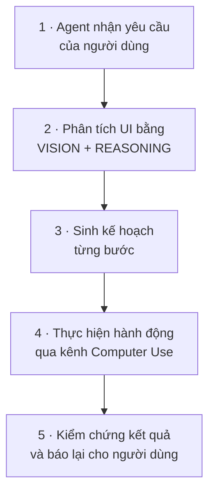
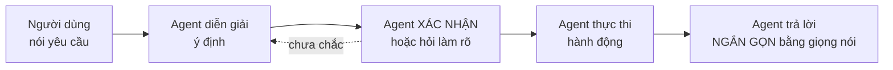
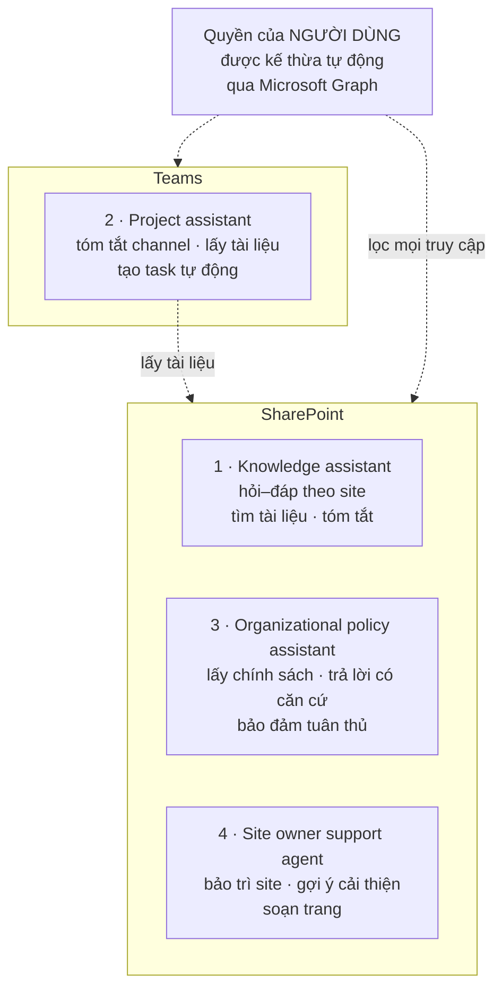

# Note 15 — Computer Use, agent behaviors & tối ưu agent trong Microsoft 365

> [!summary] TL;DR
> Ba khối khép lại module Extensibility:
> 1. **Computer Use** — agent **điều khiển chuột và bàn phím**, đọc chữ trên màn hình, thao tác UI thay người. Bốn tình huống dùng: **không có API/connector · tác vụ lặp lại hướng UI · phải đi qua nhiều app · cần suy luận kiểu người**. ⚠️ **Câu chốt về governance: chỉ dùng Computer Use KHI KHÔNG CÓ API** — đây là phương án cuối, không phải mặc định.
> 2. **Agent behaviors** — hành vi agent hình thành từ **4 thành phần**: **Instructions · Knowledge · Actions and tools · Policies and constraints**. Hai chế độ suy luận: **Standard reasoning** (nhanh, ít compute, khối lượng lớn) ↔ **Deep reasoning (preview)** (nhiều bước, quy tắc phức tạp, phân tích). **Voice mode / IVR** đòi thiết kế riêng: câu ngắn, có bước xác nhận, chịu được ngắt lời.
> 3. **Tối ưu agent Microsoft 365** — agent Copilot Studio chạy trong **Teams và SharePoint**, **tự động kế thừa quyền của người dùng** (không thấy được thứ người dùng không thấy). **Bốn mẫu giải pháp**: *SharePoint knowledge assistant · Teams project assistant · Organizational policy assistant · Site owner support agent*.
>
> Thuật ngữ: **IVR** (Interactive Voice Response) = hệ trả lời thoại tự động trên tổng đài. **UI automation** = tự động hoá bằng cách thao tác lên giao diện thay vì gọi API. **Grounding** = neo câu trả lời vào dữ liệu thật của tổ chức. **Microsoft Graph** = API hợp nhất truy cập dữ liệu Microsoft 365. **Preview** = tính năng đang xem trước, chưa GA.

---

## 1. Computer Use trong Copilot Studio (U6)

### 1.1. Computer Use làm được gì

> **Computer Use** cho phép agent **tương tác với ứng dụng và website thay mặt người dùng** — nhấn nút, điền form, điều hướng giao diện, và **trích xuất thông tin**. Nó cho phép tổ chức tự động hoá **những luồng công việc trước đây bắt buộc phải thao tác UI bằng tay**.

**Năm việc agent làm được:** **điều khiển chuột và bàn phím** · **điều hướng website và ứng dụng desktop** · **đọc chữ và phần tử UI trên màn hình** · **thực hiện tác vụ nhiều bước** · **tự động hoá luồng lặp lại hoặc có cấu trúc**.

**Năm năng lực cụ thể:** **click, type, scroll, navigate** · **trích xuất chữ từ màn hình** · **theo chuỗi UI nhiều bước** · **dùng suy luận để quyết định hành động tiếp theo** · **thực hiện tác vụ xuyên nhiều app**.

### 1.2. Quy trình 5 bước

> ⭐ Bước 2 dùng **vision** (thị giác máy) để *nhìn* giao diện — đó là lý do Computer Use hoạt động được trên **hệ thống không có API**: nó không cần biết cấu trúc bên trong, chỉ cần nhìn thấy màn hình như một người dùng.

### 1.3. Bốn tình huống phù hợp ⭐

| | Tình huống | Ví dụ |
|---|---|---|
| **A** | **Không tồn tại API hoặc connector** | **Hệ thống legacy** · **cổng thông tin của nhà cung cấp** (vendor portal) · **ứng dụng chỉ có bản desktop** |
| **B** | **Tác vụ lặp lại và hướng UI** | **Nhập liệu** · **nộp form** · **luồng copy/paste** |
| **C** | **Tác vụ phải đi qua nhiều app** | **Lấy dữ liệu từ website rồi nhập vào CRM** · **tải báo cáo từ portal** · **cập nhật bảng tính dựa trên dữ liệu UI** |
| **D** | **Cần suy luận kiểu người** | **Nhận diện đúng nút trên trang động** · **điều hướng menu thay đổi theo ngữ cảnh** |

### 1.4. Bốn nguyên tắc thiết kế agent Computer Use

| | Nguyên tắc | Nội dung |
|---|---|---|
| **A** | **Define the task clearly** | Tác vụ phải **specific · goal-oriented · structured**. Ví dụ nguyên văn: *"Log into the vendor portal, download the latest invoice, and save it to SharePoint."* |
| **B** | **Provide context and constraints** | Guardrail cần có: **app/site nào được truy cập** · **dữ liệu nào được tương tác** · **hành động nào bị cấm** · **giới hạn thời gian hoặc số lần thử lại** (time/retry limits) |
| **C** | **Break tasks into steps** | Dù agent biết suy luận, **thiết kế workflow rõ ràng vẫn tăng độ tin cậy**. Ví dụ 5 bước: mở website → đăng nhập → vào mục hoá đơn → tải tệp → tải lên SharePoint |
| **D** | **Design for variability** | **Phần tử UI có thể đổi.** Huấn luyện agent: **dùng chỉ dẫn mô tả** (*"Click the blue 'Submit' button"*) · **kiểm chứng kết quả sau mỗi bước** · **xử lý lỗi mượt mà** |

### 1.5. Cấu hình trong Copilot Studio

| | Bước | Nội dung |
|---|---|---|
| **A** | **Enable Computer Use** | **Bật trong agent settings** · **cấu hình quyền và danh sách ứng dụng được phép** |
| **B** | **Add Computer Use actions** | **Click · Type · Scroll · Extract text · Navigate pages** |
| **C** | **Use reasoning mode** | Computer Use dùng suy luận để **diễn giải layout UI**, **nhận diện phần tử liên quan**, **quyết định bước tiếp theo** |
| **D** | **Test interactions** | Dùng **test canvas của Copilot Studio** để **xem agent thao tác**, **kiểm chứng điều hướng UI**, **debug lỗi** |

### 1.6. Governance, an toàn và độ tin cậy ⭐⭐

| | Nhóm | Nội dung |
|---|---|---|
| **A** | **Security & access control** | **Giới hạn app agent được truy cập** · **tránh nhập dữ liệu nhạy cảm trừ khi cần thiết** · **áp nguyên tắc least-privilege** |
| **B** | **Responsible AI** | **Bảo đảm minh bạch để người dùng biết agent đang làm gì** · **không tự động hoá hành động gây hại hoặc rủi ro** · **ghi log mọi hành động để kiểm toán** |
| **C** | **Reliability** | **Thay đổi UI có thể làm hỏng automation** · **dựng monitoring và kế hoạch dự phòng** · ⚠️ **CHỈ dùng Computer Use khi API không khả dụng** |

`★ Insight ─────────────────────────────────────`
Câu cuối cùng của unit — *"Use Computer Use only when APIs are unavailable"* — đảo ngược cách nhiều người sẽ tiếp cận tính năng này, và nó là **câu trả lời cho phần lớn câu hỏi tình huống trong đề**.

Lý do nằm ngay ở dòng trên nó: **"UI changes can break automation."** API là **hợp đồng có phiên bản** — nhà cung cấp cam kết không phá vỡ nó, và khi họ đổi thì có thông báo. Giao diện thì **không hứa gì cả**: một bản cập nhật đổi màu nút hoặc dời menu là đủ làm hỏng agent, mà **không có lỗi biên dịch nào cảnh báo trước** — agent chỉ đơn giản click nhầm chỗ. Đó là lý do nguyên tắc D bảo dùng **chỉ dẫn mô tả** (*"nút Submit màu xanh"*) thay vì toạ độ, và **kiểm chứng sau mỗi bước**: cả hai đều là cách sống chung với một giao diện không ổn định.

Xếp cùng bốn tình huống ở §1.3 thì thấy logic nhất quán: tình huống A (*không có API*) là lý do chính đáng duy nhất mang tính kỹ thuật; B và C là lý do về **hiệu quả**; D là lý do về **năng lực**. Nhưng cả bốn đều phải đi qua bộ lọc cuối — *nếu có API thì dùng API*.
`─────────────────────────────────────────────────`

---

## 2. Thiết kế agent behaviors trong Copilot Studio (U7)

### 2.1. Bốn thành phần định hình hành vi ⭐

| Thành phần | Định nghĩa gì |
|---|---|
| **Instructions** | **Purpose, persona, goals, tone và guardrails** |
| **Knowledge** | **Quản nội dung agent được truy cập** và **cách thông tin được truy xuất** |
| **Actions and tools** | Cấp **năng lực thực thi tác vụ, lấy dữ liệu và gọi hệ thống phía sau** |
| **Policies and constraints** | Bảo đảm **tuân thủ, ranh giới riêng tư và nguyên tắc Responsible AI** |

> Architect phải bảo đảm bốn yếu tố này tạo thành **một khung hành vi NHẤT QUÁN**, nhằm **tránh thông tin sai · thực thi ranh giới chính sách · giữ đầu ra dự đoán được**.

**Năm nguyên tắc thiết kế hành vi:**
1. **Định nghĩa vai trò rõ ràng** cho agent
2. **Xác lập hành vi được phép và không được phép**
3. **Định nghĩa mẫu escalation**
4. **Áp quy tắc định dạng** cho phản hồi
5. Bao gồm **ràng buộc logic nghiệp vụ và kỳ vọng xử lý lỗi**

### 2.2. Standard reasoning ↔ Deep reasoning ⭐⭐

| | **Standard reasoning** | **Deep reasoning** *(preview)* |
|---|---|---|
| **Dùng cho** | **Phản hồi hội thoại** · **tóm tắt** · **tính toán đơn giản** · **hỗ trợ workflow cơ bản** | **Tác vụ nhiều bước** · **quy tắc nghiệp vụ phức tạp** · **quy trình phân tích** · **cây quyết định có cấu trúc** · **lập kịch bản** (scenario planning) · **đánh giá ràng buộc và đánh đổi** |
| **Đặc tính** | **Phản hồi nhanh, dùng ít compute** → hợp **use case khối lượng lớn** | **Suy nghĩ qua các bước có cấu trúc**, **kiểm chứng giả định**, cho **phản hồi chính xác hơn** |
| **Lĩnh vực điển hình** | Hội thoại chung | **Tài chính, tuân thủ, kỹ thuật, vận hành, phân tích** |
| **Trạng thái** | GA | ⚠️ **Preview** |

**Năm điều kiện bật deep reasoning** — giải pháp cần:
1. **Logic độ chính xác cao** (high-precision logic)
2. **Đánh giá nhiều giai đoạn** (multi-stage evaluation)
3. **Khuyến nghị dựa trên dữ liệu lịch sử**
4. **Tác vụ đòi hỏi ràng buộc và logic kiểm chứng**
5. **Phân rã bài toán nâng cao** (advanced problem decomposition)

> ⭐ Đây là **cùng một hình dạng đánh đổi** với bảng NLU ↔ CLU ↔ Generative ở [[12-Copilot-Studio-Topics-Agent-Flows-Prompt-Actions]]: **năng lực cao hơn đổi lấy compute nhiều hơn**, và nguyên tắc chọn vẫn là *bắt đầu từ mức thấp, leo lên khi có lý do*. Ghi nhớ cặp **"fast + low compute + high-volume"** ↔ **"structured steps + validate assumptions + high precision"**.

### 2.3. Thiết kế bộ chỉ dẫn cho suy luận tốt

**Năm tính chất của instruction layer:**

| Tính chất | Nội dung |
|---|---|
| **Task-specific** | **Agent phải hoàn thành gì** |
| **Role-aligned** | **Agent đang đóng vai ai** |
| **Context-aware** | Bao gồm **mục tiêu nghiệp vụ, chính sách, ràng buộc** |
| **Structured** | **Định nghĩa định dạng đầu ra bắt buộc** |
| **Guardrail-controlled** | **Ngăn hành vi không mong muốn hoặc không an toàn** |

**Cấu trúc chỉ dẫn khuyến nghị — 7 mục:**

| # | Mục | Nội dung |
|---|---|---|
| 1 | **Purpose** | **Vì sao agent tồn tại** |
| 2 | **Scope** | **Được và không được làm gì** |
| 3 | **Tone and style** | **Giao tiếp như thế nào** |
| 4 | **Data boundaries** | **Nguồn nào được phép** |
| 5 | **Quality expectations** | **Yêu cầu về độ chính xác, đầy đủ và định dạng** |
| 6 | **Error handling** | **Agent phản hồi ra sao khi KHÔNG CHẮC CHẮN** ⭐ |
| 7 | **Escalation conditions** | **Khi nào cần con người tham gia** |

> ⭐ Mục **6 — "how the agent should respond when unsure"** là mục hay bị bỏ sót nhất khi viết chỉ dẫn, và cũng là mục quyết định agent có **bịa thông tin** hay không. Không dặn gì thì model mặc định *cứ trả lời*; phải nói rõ *"nếu không chắc thì nói không biết và đề nghị chuyển tiếp"*.

> 💡 So sánh với **Prompt Coach 5 mục** (Goal · Context · Instructions/Rules · Examples · Output Format) ở [[12-Copilot-Studio-Topics-Agent-Flows-Prompt-Actions]]: Prompt Coach dùng cho **một prompt action đơn lẻ**, còn cấu trúc 7 mục ở đây dùng cho **chỉ dẫn cấp agent**. Cấp agent có thêm ba thứ mà một prompt lẻ không cần: **data boundaries, error handling, escalation** — đều là những thứ tồn tại xuyên nhiều lượt hội thoại.

### 2.4. Voice mode & IVR

**Sáu use case của voice mode:** **customer service IVR** · **hỗ trợ kỹ thuật viên hiện trường** (field technician) · **định tuyến sales và dịch vụ** · **phân loại y tế** (healthcare triage) · **cuộc gọi vận hành cơ sở vật chất** · **tự phục vụ HR hoặc IT**.

**Năm cân nhắc then chốt cho voice agent:**

| # | Cân nhắc | Vì sao |
|---|---|---|
| 1 | **Dùng câu ngắn, rõ** | Người nghe không cuộn lại được |
| 2 | **Tránh phản hồi dài nhiều câu** | Quá tải trí nhớ ngắn hạn |
| 3 | **Có bước xác nhận** | Nghe nhầm là chuyện thường |
| 4 | **Thiết kế cho việc ngắt lời và quay lui** (interruptions and backtracking) | Hội thoại thoại không tuyến tính |
| 5 | **Có bước kiểm tra độ tự tin trước khi thực thi hành động** | Sai một lần là thực thi sai thật |

**Luồng tương tác thoại — 5 bước:**

> Vì thoại phụ thuộc **tương tác thời gian thực**, architect phải thiết kế mô hình hành vi ưu tiên **responsiveness · xử lý fallback · thông báo lỗi thân thiện**.

`★ Insight ─────────────────────────────────────`
Bước 3 — **"Agent xác nhận hoặc hỏi làm rõ"** — là bước **không có trong luồng chat**, và đó là điểm khác biệt kiến trúc lớn nhất giữa voice và text.

Trong chat, người dùng **nhìn thấy** những gì mình gõ; nếu agent hiểu sai, họ đọc câu trả lời rồi sửa. Trong thoại, **cả hai đầu đều có thể sai mà không ai biết**: nhận dạng giọng nói có thể nghe nhầm, và người dùng không có bản ghi để đối chiếu. Vì vậy **xác nhận trở thành bắt buộc, không phải lịch sự** — đặc biệt trước khi thực thi hành động, đúng như cân nhắc số 5 (*confidence check before executing*).

Điều này cũng giải thích vì sao cân nhắc 1 và 2 nhấn mạnh câu ngắn: đó không phải yêu cầu về văn phong mà là **ràng buộc về bộ nhớ làm việc của người nghe**. Một câu trả lời năm dòng đọc trên màn hình là bình thường; đọc thành tiếng thì người nghe quên mất đầu câu trước khi đến cuối câu.
`─────────────────────────────────────────────────`

---

## 3. Tối ưu agent trong Microsoft 365 (U8)

### 3.1. Agent M365 chạy ở đâu và grounding thế nào

Agent Microsoft 365 dựng bằng Copilot Studio có thể:

| Nơi | Làm gì |
|---|---|
| **A. Bên trong Teams** | **Trả lời câu hỏi trong chat và channel** · **tự động hoá workflow kích hoạt bởi tin nhắn Teams** · **cung cấp câu trả lời theo ngữ cảnh bằng dữ liệu M365** |
| **B. Bên trong SharePoint** | **Lấy nội dung từ site, list và library** · **trả lời câu hỏi riêng của site** · **hỗ trợ site owner quản lý nội dung** · **trợ giúp theo ngữ cảnh dựa trên cấu trúc site** |
| **C. Dùng Microsoft 365 grounding** | Agent **tự động**: **tôn trọng quyền của người dùng** · **dùng Microsoft Graph để lấy file, list và page** · **cung cấp câu trả lời có căn cứ dựa trên nội dung doanh nghiệp** |

> ⭐ Ba việc ở mục C diễn ra **tự động**, bảo đảm **accuracy, security và compliance** — architect không phải tự dựng lớp phân quyền.

### 3.2. Thiết kế agent tích hợp SharePoint

| | Khía cạnh | Nội dung |
|---|---|---|
| **A** | **Dùng SharePoint làm knowledge source** | Agent truy cập được **6 loại nội dung**: **site pages · document libraries · lists · news posts · policies and procedures · wiki content** |
| **B** | **Hỗ trợ kịch bản cấp site** | Ví dụ nguyên văn: *"Find the latest HR policy on this site."* · *"Summarize the documents in the Project Alpha library."* · *"Help me create a new page template."* · *"What permissions does this site use?"* |
| **C** | **Tự động dùng site context** | Khi cài lên một SharePoint site, agent **biết nó đang ở site nào** · **dùng nội dung site đó làm nguồn grounding CHÍNH** · **điều chỉnh phản hồi theo cấu trúc site** |
| **D** | **Trợ giúp soạn thảo và quản lý** | Giúp site owner **soạn nội dung trang · gợi ý metadata · cải thiện accessibility · khuyến nghị cách tổ chức site** |

### 3.3. Thiết kế agent tích hợp Teams

| | Khía cạnh | Nội dung |
|---|---|---|
| **A** | **Conversational automation** | **Trả lời câu hỏi trong chat và channel** · **cung cấp tóm tắt, insight, khuyến nghị** · **kích hoạt workflow dựa trên tin nhắn người dùng** |
| **B** | **Multi-user collaboration** | **Tham gia hội thoại nhóm** · **cung cấp tri thức dùng chung** · **hỗ trợ đội dự án bằng câu trả lời theo ngữ cảnh** |
| **C** | **Task automation** | Ví dụ: *"Create a task for this message."* · *"Summarize the last 10 messages in this channel."* · *"Find the latest project document in SharePoint."* |

### 3.4. Bốn trục tối ưu thiết kế ⭐

| | Trục | Nội dung |
|---|---|---|
| **A** | **Grounding Strategy** | **Dùng SharePoint site làm nguồn tri thức chính** · **dùng Microsoft Graph để truy xuất xuyên tenant** · **bảo đảm nội dung có cấu trúc tốt và được gắn tag** |
| **B** | **Permissions & Security** | ⭐ **Agent KẾ THỪA quyền của người dùng**: **không truy cập được nội dung mà người dùng không truy cập được** · **tôn trọng ranh giới bảo mật của SharePoint và Teams** · **cần app registration và consent đúng cách** |
| **C** | **Prompt & Behavior Design** | Agent nên **trả lời súc tích, theo ngữ cảnh** · **hỏi làm rõ khi cần** · **dùng metadata của SharePoint để tăng độ chính xác** |
| **D** | **Governance & Lifecycle** | **Dùng version control cho cập nhật agent** · **giám sát usage và performance** · **rà nội dung grounding của SharePoint định kỳ** · **căn theo governance của AI CoE** |

`★ Insight ─────────────────────────────────────`
Trục B — **agent kế thừa quyền của người dùng** — là một trong những đặc tính bảo mật đáng giá nhất của agent M365, và nó thay đổi cách thiết kế.

Với nền tảng khác, bạn phải **tự dựng lớp lọc quyền**: agent chạy bằng một service identity, thấy toàn bộ dữ liệu, rồi bạn viết logic loại bỏ những gì người dùng không được xem. Cách đó dễ sai — quên một đường dẫn là lộ dữ liệu. Ở M365, **ranh giới bảo mật có sẵn của SharePoint/Teams được áp trước khi agent nhìn thấy dữ liệu**, nên lỗi phân quyền của agent về cơ bản không xảy ra.

Nhưng nó tạo ra một **hệ quả vận hành trái chiều mà đề có thể hỏi**: cùng một câu hỏi, hai người dùng khác nhau sẽ nhận **hai câu trả lời khác nhau** — và cả hai đều đúng. Nghĩa là (1) kiểm thử phải chạy **dưới nhiều persona quyền hạn khác nhau**, một lần test bằng tài khoản admin không chứng minh được gì; (2) khi người dùng báo "agent không tìm thấy tài liệu", chẩn đoán đầu tiên là **quyền**, không phải grounding. Đây cũng là lý do trục D dặn **rà nội dung grounding định kỳ** — quyền và nội dung đều trôi theo thời gian.
`─────────────────────────────────────────────────`

### 3.5. Bốn mẫu giải pháp cho agent Microsoft 365 ⭐⭐

| Pattern | Purpose |
|---|---|
| **1 — SharePoint knowledge assistant** | **Trả lời câu hỏi riêng của site** · **giúp người dùng tìm tài liệu** · **cung cấp tóm tắt và insight** |
| **2 — Teams project assistant** | **Hỗ trợ đội dự án** · **tóm tắt hoạt động của channel** · **lấy tài liệu từ SharePoint** · **tự động tạo task** |
| **3 — Organizational policy assistant** | **Lấy chính sách từ SharePoint** · **đưa câu trả lời có căn cứ** · **bảo đảm tuân thủ và chính xác** |
| **4 — Site owner support agent** | **Giúp bảo trì SharePoint site** · **gợi ý cải thiện** · **soạn trang và nội dung** |

> 💡 Chú ý mẫu **1 và 3 rất giống nhau** ở bề mặt — cả hai đều trả lời câu hỏi từ nội dung SharePoint. Khác biệt nằm ở **mức độ chịu trách nhiệm**: *knowledge assistant* tối ưu **tìm được và tóm tắt được**; *policy assistant* tối ưu **đúng và tuân thủ** — nên nó cần grounding chặt hơn, trích dẫn nguồn, và quy trình rà soát nội dung nghiêm hơn. Gặp tình huống nhắc tới *chính sách, tuân thủ, quy định*, chọn mẫu 3.

---

## Câu hỏi phỏng vấn

> [!question] Khách hàng muốn dùng Computer Use để tự động hoá việc nhập liệu vào hệ CRM của họ. Bạn hỏi gì trước tiên?
> **"Hệ CRM đó có API hoặc connector không?"** Vì nguyên tắc chốt của unit là *"Use Computer Use only when APIs are unavailable"*. Lý do kỹ thuật: **thay đổi UI có thể làm hỏng automation** — API là hợp đồng có phiên bản, nhà cung cấp cam kết không phá vỡ; giao diện thì không hứa gì, một bản cập nhật đổi màu nút là đủ làm agent click nhầm, mà **không có cảnh báo nào trước đó**. Nếu thật sự không có API — hệ legacy, vendor portal, app chỉ có bản desktop — thì Computer Use là lựa chọn đúng, nhưng phải kèm: **giới hạn app được truy cập, least privilege, log mọi hành động, monitoring và kế hoạch dự phòng**, cộng **chỉ dẫn mô tả** thay vì toạ độ và **kiểm chứng sau mỗi bước**.

> [!question] Khi nào bật deep reasoning thay vì standard reasoning?
> Khi giải pháp cần **một trong năm điều kiện**: **logic độ chính xác cao · đánh giá nhiều giai đoạn · khuyến nghị dựa trên dữ liệu lịch sử · tác vụ đòi ràng buộc và logic kiểm chứng · phân rã bài toán nâng cao**. Deep reasoning hợp với **tác vụ nhiều bước, quy tắc nghiệp vụ phức tạp, quy trình phân tích, cây quyết định có cấu trúc, lập kịch bản, đánh giá đánh đổi** — điển hình ở tài chính, tuân thủ, kỹ thuật, vận hành, phân tích. Ngược lại, **standard reasoning** cho **phản hồi nhanh, ít compute**, hợp use case **khối lượng lớn**: hội thoại, tóm tắt, tính toán đơn giản. Hai lưu ý khi tư vấn: deep reasoning đang ở **preview**, và đây là cùng một đánh đổi *năng lực ↔ compute* như khi chọn generative orchestration — **bắt đầu ở mức thấp, leo lên khi có lý do**.

> [!question] Thiết kế agent thoại khác agent chat ở điểm nào?
> Khác ở **một bước không tồn tại trong chat: bước xác nhận**. Luồng thoại là *người nói → agent diễn giải ý định → **agent xác nhận hoặc hỏi làm rõ** → thực thi → trả lời ngắn gọn*. Lý do: trong chat người dùng nhìn thấy thứ mình gõ và đọc được câu trả lời để tự sửa; trong thoại **cả hai đầu đều có thể sai mà không ai biết** — nhận dạng giọng nói nghe nhầm, người dùng không có bản ghi đối chiếu. Nên xác nhận là **bắt buộc**, đặc biệt trước khi thực thi hành động (*confidence check before executing*). Bốn cân nhắc còn lại: **câu ngắn rõ**, **tránh phản hồi dài nhiều câu** — đây là ràng buộc về **bộ nhớ làm việc của người nghe**, không phải văn phong — và **thiết kế cho việc ngắt lời, quay lui**. Kiến trúc phải ưu tiên **responsiveness, fallback, thông báo lỗi thân thiện**.

> [!question] Người dùng báo agent SharePoint "không tìm thấy tài liệu" dù tài liệu có tồn tại. Chẩn đoán đầu tiên?
> **Quyền của chính người dùng đó.** Agent M365 **kế thừa quyền người dùng** — *"they cannot access content the user cannot access"* — nên cùng một câu hỏi, hai người khác nhau nhận hai câu trả lời khác nhau và **cả hai đều đúng**. Kiểm tra người dùng có quyền trên site/library/tài liệu đó không, trước khi nghi ngờ grounding. Hệ quả kèm theo cho quy trình: **kiểm thử phải chạy dưới nhiều persona quyền hạn khác nhau** — test bằng tài khoản admin không chứng minh được gì. Nếu quyền đã đúng thì mới xét tiếp: nội dung có nằm trong **6 loại** agent đọc được không (site page, document library, list, news post, policy, wiki), nội dung có **cấu trúc tốt và gắn tag** không, và đã đến kỳ **rà nội dung grounding định kỳ** chưa.

> [!question] Bốn mẫu giải pháp agent M365 — phân biệt mẫu 1 và mẫu 3?
> Cả hai đều trả lời câu hỏi từ nội dung SharePoint, nhưng khác **mức độ chịu trách nhiệm**. **SharePoint knowledge assistant** (mẫu 1) tối ưu cho **tìm được và tóm tắt được**: trả lời câu hỏi riêng của site, giúp tìm tài liệu, cung cấp insight. **Organizational policy assistant** (mẫu 3) tối ưu cho **đúng và tuân thủ**: lấy chính sách từ SharePoint, đưa câu trả lời **có căn cứ**, **bảo đảm compliance và accuracy**. Hệ quả thiết kế: mẫu 3 cần grounding chặt hơn, trích dẫn nguồn, và quy trình rà soát nội dung nghiêm hơn. Gặp tình huống nhắc tới *chính sách, tuân thủ, quy định*, chọn mẫu 3. Hai mẫu còn lại dễ phân biệt hơn: **Teams project assistant** (tóm tắt channel, tạo task) và **Site owner support agent** (bảo trì site, soạn trang).

---

## Tự kiểm tra

1. **Computer Use** cho agent làm **năm** việc gì? **Năm năng lực** cụ thể?
2. **Năm bước** hoạt động của Computer Use? Bước nào dùng **vision** và vì sao điều đó quan trọng?
3. **Bốn tình huống** phù hợp với Computer Use, mỗi tình huống một ví dụ?
4. **Bốn nguyên tắc** thiết kế agent Computer Use? Nguyên tắc D dặn dùng loại chỉ dẫn nào?
5. Bốn bước cấu hình trong Copilot Studio? **Năm loại action**? Test ở đâu?
6. Ba nhóm cân nhắc governance? **Câu chốt** về khi nào được dùng Computer Use?
7. **Bốn thành phần** định hình hành vi agent? Chúng nhằm tránh **ba** điều gì?
8. **Năm nguyên tắc** thiết kế hành vi?
9. So sánh **Standard ↔ Deep reasoning**: dùng cho gì, đặc tính, lĩnh vực, trạng thái phát hành?
10. **Năm điều kiện** bật deep reasoning?
11. **Năm tính chất** của instruction layer? **Bảy mục** của cấu trúc chỉ dẫn khuyến nghị?
12. Mục nào trong 7 mục quyết định agent có **bịa thông tin** hay không?
13. **Sáu use case** voice mode? **Năm cân nhắc** cho voice agent?
14. **Năm bước** của luồng tương tác thoại — bước nào **không có** trong chat và vì sao?
15. Agent M365 hoạt động ở **hai** nơi nào? Ba việc **tự động** của M365 grounding?
16. Agent SharePoint truy cập được **sáu loại** nội dung nào? **Site context** hoạt động ra sao?
17. Ba khía cạnh của agent Teams, mỗi cái một ví dụ?
18. **Bốn trục** tối ưu thiết kế? Trục nào nói về việc agent **kế thừa quyền**?
19. Hệ quả **vận hành** của việc agent kế thừa quyền người dùng — với **kiểm thử** và với **chẩn đoán lỗi**?
20. **Bốn mẫu giải pháp** agent M365? Phân biệt mẫu **1 và 3**?

## Liên quan
- [[00-MOC-AB100]] — MOC bộ AB-100
- [[14-Extensibility-Custom-Model-M365-Copilot-MCP]] — note trước: custom model, agent M365 Copilot, 4 tầng extensibility, MCP
- [[16-Orchestrate-Prebuilt-Agents-va-Apps]] — note sau: điều phối agent và app dựng sẵn
- [[12-Copilot-Studio-Topics-Agent-Flows-Prompt-Actions]] — Prompt Coach, NLU/CLU/generative — cùng hình dạng đánh đổi với deep reasoning
- [[11-Ba-loai-Agent-va-Foundry-Tools]] — task/autonomous/prompt-and-response agent, safety rules
- [[07-Solution-Rules-Vai-tro-va-AI-CoE]] — AI CoE governance mà trục D nhắc tới
- [[23-Bao-mat-Agent-Model-va-Access-Control]] — least privilege, audit trail cho hành động agent
- [[../AI-103/13-Speech-GenAI-va-Voice-Live-API]] — voice bản kỹ thuật: speech-to-text, Voice Live API
- [[../AI-103/08-M365-va-Agent-Workflows]] — agent trong hệ M365, góc Foundry
