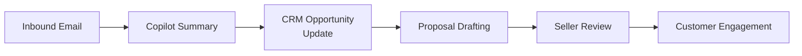
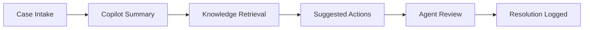
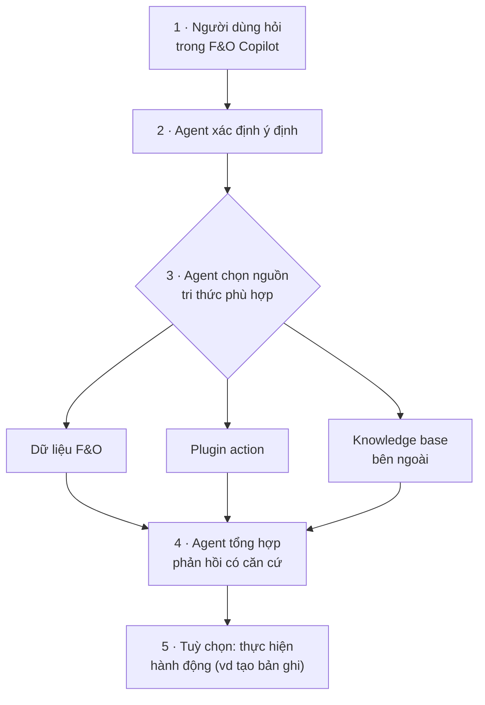

# Note 16 — Điều phối agent & app dựng sẵn

> [!summary] TL;DR
> Note **danh mục** khép lại cụm Design — phủ trọn module *Orchestrate configuration of prebuilt agents and apps* (7 unit). Sáu khối:
> 1. **D365 Customer Service** — **3 loại năng lực AI**: **Agent Hub · autonomous service agents · Copilot in Contact Center**; bốn **autonomous service agent** có tên riêng: *Customer Intent · Case Management · Customer Knowledge Management · Quality Evaluation*; và **3 mô hình trải nghiệm AI**: *Conversational Copilot (sidecar) · Embedded intelligent features · Automated AI behaviors*.
> 2. **Microsoft 365 agents** — nguyên tắc thiết kế chốt: **"Treat an agent like a PRODUCT, not a prompt"**; **readiness checklist 8 mục**; **khung thiết kế 5 bước**; **catalog 8 agent ready-to-pilot**; **RACI**; và **bộ KPI khởi điểm có con số**.
> 3. **Copilot for Sales / for Service** — điều kiện dữ liệu, luồng cấu hình, và hai vòng lặp: *Sales workflow* và *Case resolution loop*.
> 4. **Power Platform AI** — **4 thành phần**: **AI Hub · Copilot in Power Platform · AI Builder · Copilot Studio**, kèm **ma trận chọn tính năng**.
> 5. **F&O interoperability** — **Copilot client plugins** bắc cầu sang hệ thống khác; ánh xạ *câu hỏi nghiệp vụ → nguồn tri thức*.
> 6. **In-app help & orchestration cho Finance/Supply Chain** — **3 mô hình trải nghiệm**: **Sidecar · Embedded · Outside**; quy trình 5 bước thêm knowledge source; quyết định **bật hay chặn general knowledge**.
>
> Thuật ngữ: **Sidecar** = trải nghiệm Copilot dạng bảng chat chạy **bên cạnh** app. **Embedded** = AI **nhúng thẳng** vào trang/màn hình nghiệp vụ. **RACI** = ma trận phân vai *Responsible · Accountable · Consulted · Informed*. **RAID log** = sổ theo dõi *Risks, Assumptions, Issues, Dependencies* của dự án. **Rollout ring** = triển khai theo vòng, mở rộng dần nhóm người dùng. **X++** = ngôn ngữ lập trình của Dynamics 365 Finance & Operations.

---

## 1. Thiết kế giải pháp AI cho Dynamics 365 Customer Service (U2)

### 1.1. Ba loại năng lực AI ⭐

| Loại | Là gì |
|---|---|
| **Agent Hub** | **Trung tâm một cửa** giúp **admin và supervisor** áp dụng agent AI tự chủ một cách **an toàn**, **giám sát tác động**, và **ra quyết định có căn cứ, có trách nhiệm** |
| **Autonomous service agents** | Bốn agent tự chủ có tên riêng (bảng dưới) |
| **Copilot in Contact Center** | **Trợ giúp AI thời gian thực** cho service representative — **tự động hoá các tác vụ tốn thời gian** để xử lý case hiệu quả hơn và giải quyết vấn đề nhanh hơn |

**Bốn autonomous service agent** — nhớ **tên và việc**:

| Agent | Làm gì |
|---|---|
| **Customer Intent Agent** | **Tự chủ khám phá ý định** bằng cách **phân tích case quá khứ và hiện tại cùng hội thoại khách hàng** |
| **Case Management Agent** | **Tự động hoá vòng đời case** cho service representative — tự động hoá quy trình **create, update, resolve, close** |
| **Customer Knowledge Management Agent** | Quản lý tri thức khách hàng (insight cho quản trị tri thức) |
| **Quality Evaluation Agent** | Đánh giá chất lượng |

**Năng lực của Copilot in Contact Center:** **đặt câu hỏi · soạn email · tóm tắt case · tóm tắt hội thoại**. Các tính năng có thể **nhúng trong ứng dụng** hoặc **chạy độc lập (standalone)**.

> ⚠️ Câu cảnh báo của giáo trình: **"Not all capabilities are available in all capacities"** — không phải năng lực nào cũng có ở mọi mức dung lượng/gói. Khi tư vấn phải **kiểm chứng theo licensing cụ thể**, đừng hứa trước.

### 1.2. Ba mô hình trải nghiệm AI trong Customer Service ⭐⭐

| Mô hình | Cách hoạt động | Ví dụ |
|---|---|---|
| **Conversational Copilot (Sidecar Model)** | Trải nghiệm **dựa trên chat**: **hiểu câu hỏi của agent về case, khách hàng và chính sách** · **sinh tóm tắt, bước xử lý sự cố, hoặc phản hồi soạn sẵn** · **cung cấp insight theo ngữ cảnh từ bản ghi D365** | Agent hỏi *"case này đã thử gì rồi?"* |
| **Embedded Intelligent Features** | Xuất hiện **bên trong workspace**: **case form · customer timeline · knowledge article**. AI **phân tích ngữ cảnh trang** và **chủ động gợi ý hành động hoặc insight** | Gợi ý hiện ngay trên form |
| **Automated AI Behaviors** | Chạy **không cần người kích hoạt**: **định tuyến case do AI dẫn dắt** · **tự động gắn thẻ sắc thái cảm xúc** · **trigger escalation dự đoán** | Cho phép service manager **mở rộng trải nghiệm khách hàng nhất quán** |

`★ Insight ─────────────────────────────────────`
Ba mô hình này phân biệt bằng **ai khởi phát tương tác** — và đó là trục phân loại lặp đi lặp lại trong cả bộ AB-100.

**Sidecar**: *người dùng hỏi* → AI trả lời. **Embedded**: *ngữ cảnh trang* kích hoạt → AI chủ động gợi ý mà không ai hỏi. **Automated**: *sự kiện hệ thống* kích hoạt → AI hành động, có khi chẳng ai nhìn thấy.

Đây chính là trục **"bỏ người dùng đi thì agent còn hoạt động không?"** đã dùng để phân biệt prompt-and-response ↔ autonomous agent ở [[11-Ba-loai-Agent-va-Foundry-Tools]], và nó tái xuất gần như nguyên vẹn ở mô hình **Sidecar / Embedded / Outside** của Finance & Supply Chain trong §6.1 dưới đây.

Hệ quả thiết kế đi kèm: mức tự chủ càng cao thì **nhu cầu guardrail và log càng lớn**. Sidecar sai thì người dùng thấy ngay và bỏ qua; Automated sai thì **case bị định tuyến nhầm hàng loạt trước khi ai đó nhận ra**. Vì vậy *Automated AI behaviors* luôn đi kèm yêu cầu giám sát chặt hơn — xem [[17-Khung-Giam-sat-va-Cong-cu]].
`─────────────────────────────────────────────────`

### 1.3. Bốn cân nhắc thiết kế kiến trúc AI cho CX workload

| Cân nhắc | Nội dung |
|---|---|
| **Data quality** | **Trường CRM, lịch sử, tương tác, SLA và tri thức phải chính xác và đầy đủ** |
| **Security & privacy** | AI **tôn trọng mức truy cập dữ liệu**, **quyền riêng tư khách hàng**, và **xử lý dữ liệu nhạy cảm đúng chuẩn** |
| **Service consistency** | **Khuyến nghị của AI phải phản ánh chính sách, giọng điệu và workflow đã được phê duyệt** |
| **Extensibility** | Tích hợp **prompt, workflow, model và mẫu tự động hoá tuỳ biến** qua **Power Platform hoặc dịch vụ Azure** |

### 1.4. Ba mô hình điều phối (orchestration models) ⭐

| Mô hình | AI neo vào đâu | Làm gì |
|---|---|---|
| **Case-centric orchestration** | **Quanh CASE của khách hàng** | **Đọc mô tả, ghi chú, hội thoại** · **gợi ý hành động tiếp theo** · **sinh tóm tắt cách giải quyết** |
| **Interaction-centric automation** | **Quanh TƯƠNG TÁC** | Phân tích **tin nhắn khách hàng (email, chat)** · **liên kết bài viết tri thức** · **quy trình xử lý sự cố liên quan** |
| **Multi-system orchestration** | **Xuyên NHIỀU HỆ THỐNG** | **Customer Service + Field Service** · **Customer Service + Finance (billing/refunds)** · **Customer Service + Power Automate (escalation)** |

> Ở mô hình thứ ba, architect phải **căn agent AI theo quy trình liên phòng ban** — đây là chỗ AB-100 kiểm tra tư duy kiến trúc chứ không chỉ cấu hình.

**Năm cách mở rộng tính năng AI trong Customer Service:** **custom prompt và behavior** · **Power Automate flow** · **plugin và custom action** · **tích hợp Azure OpenAI** · **mở rộng truy xuất tri thức**.

> ⭐ **Best practice:** **mô-đun hoá hành vi AI** để đội dịch vụ **cập nhật logic mà không phải viết lại toàn bộ giải pháp** — cùng nguyên tắc modular đã thấy ở 4 tầng extensibility ([[14-Extensibility-Custom-Model-M365-Copilot-MCP]]).

---

## 2. Đề xuất Microsoft 365 agent cho kịch bản nghiệp vụ (U3)

### 2.1. Agent được thiết kế tốt khác prompt tuỳ hứng ở đâu

> **Microsoft 365 agents** = trợ lý AI **hướng tác vụ**, hoạt động bên trong hệ sinh thái M365 để **retrieve, reason và act** — **điều phối các bước xuyên nhiều app và dữ liệu** để đạt một kết quả.

Khác với prompt tuỳ hứng (ad-hoc prompt), agent thiết kế tốt có **4 thứ**:

| # | Thuộc tính | Nội dung |
|---|---|---|
| 1 | **A defined mission and scope** | **Mục tiêu, ranh giới và tiêu chí thành công** |
| 2 | **Grounding data and tools** | **Files, knowledge source, connector, app action** |
| 3 | **Operational guardrails** | **Identity, authorization, DLP, reviewability** (khả năng rà soát lại) |
| 4 | **Telemetered outcomes** | **Usage, quality, cost và tác động nghiệp vụ** — có đo đạc |

> ⭐⭐ **Nguyên tắc thiết kế được in đậm trong giáo trình:**
> **"Treat an agent like a PRODUCT, not a prompt — ship with a backlog, guardrails, and metrics."**
> *(Đối xử với agent như một SẢN PHẨM, không phải một prompt — phát hành kèm backlog, guardrail và số đo.)*

### 2.2. Readiness checklist 8 mục cho solution architect ⭐⭐

Dùng danh sách tiền kiểm này **trước khi đề xuất hoặc phê duyệt** một agent:

| # | Mục | Phải có gì |
|---|---|---|
| 1 | **Business value** | **Chủ sở hữu rõ ràng · người dùng đích · kết quả đo được · định nghĩa "xong" (definition of done)** |
| 2 | **Identity & access** | **Mô hình "runs-as" được tài liệu hoá** (chạy bằng danh tính người dùng, app hay service) · **xác nhận least-privilege** |
| 3 | **Data scope** | **Liệt kê đầy đủ corpus grounding · gắn nhãn nhạy cảm · kiểm chứng mẫu truy cập** |
| 4 | **Actions & tools** | **Xác định tool/connector cần thiết · định nghĩa đường thất bại (failure path) và điểm phê duyệt của con người** |
| 5 | **Security & compliance** | **DLP · eDiscovery/auditability · reviewability được thiết kế · có kế hoạch logging** |
| 6 | **Change control** | **Versioning · rollout ring · rollback · tiêu chí khai tử (sunset criteria)** |
| 7 | **Measurement** | **Telemetry cho adoption, quality, latency, cost và KPI nghiệp vụ** đã được cài đặt |
| 8 | **Support** | **Quyền sở hữu · incident runbook · rà soát đạo đức (ethics review) · kế hoạch truyền thông và adoption** |

`★ Insight ─────────────────────────────────────`
Checklist này là **hiện thân cụ thể của câu "agent là sản phẩm, không phải prompt"** — và cách nhanh nhất để thấy điều đó là đếm xem bao nhiêu mục **không liên quan gì tới AI**.

Mục 1 (định nghĩa "xong"), 6 (versioning, rollback, **tiêu chí khai tử**), 8 (runbook, kế hoạch truyền thông) là **quản trị sản phẩm phần mềm thuần tuý**. Chỉ mục 3 và 4 mới thật sự đặc thù AI. Nói cách khác, **phần khó của việc triển khai agent doanh nghiệp không nằm ở model** mà nằm ở những thứ mọi sản phẩm phần mềm đều cần — và các đội thường bỏ qua vì agent "chỉ là một prompt".

Mục đáng chú ý nhất là **6 — sunset criteria**: định nghĩa **khi nào agent này nên bị khai tử**. Rất ít đội nghĩ tới điều này lúc khởi động, và đó là gốc rễ của **agent sprawl** (agent mọc tràn lan) đã cảnh báo ở [[04-CAF-cho-AI-va-Vong-doi-Agent]]. Không có tiêu chí khai tử thì agent chỉ tích tụ, không bao giờ biến mất — mỗi cái vẫn tiêu license, vẫn giữ quyền truy cập dữ liệu, vẫn cần được rà soát bảo mật.
`─────────────────────────────────────────────────`

### 2.3. Khung thiết kế agent 5 bước

| # | Bước | Nội dung |
|---|---|---|
| 1 | **Frame the job to be done** | Mô tả **kết quả lặp lại mà nghiệp vụ cần**, **KHÔNG mô tả các bước thao tác công cụ** ⭐ |
| 2 | **Map inputs, knowledge, and actions** | Liệt kê **nguồn** (files, sites, email, meeting notes), **tool** (connector, flow), và **thao tác ghi bắt buộc** |
| 3 | **Define guardrails** | **Ai được gọi nó? Trên dữ liệu nào? Khi nào nó hỏi phê duyệt? Hành động được log và hoàn tác ra sao?** |
| 4 | **Prototype the critical path** | Bắt đầu bằng **một lát cắt "happy path" HẸP, đầu-cuối**; **kiểm thử trên hiện vật thật** và lặp trên mẫu prompt |
| 5 | **Operationalize** | Thêm **telemetry, kiểm tra chất lượng, kiểm soát chi phí**. Chuyển từ pilot sang production bằng **rollout ring và đào tạo** |

> ⭐ Bước 1 đáng nhớ vì nó chống lại lỗi phổ biến nhất: mô tả agent theo **công cụ nó dùng** (*"agent gọi API X rồi ghi vào bảng Y"*) thay vì theo **kết quả nghiệp vụ lặp lại** (*"mỗi tháng tạo được gói brief cho ban lãnh đạo"*). Mô tả sai cách khiến agent bị khoá vào một cách làm cụ thể và không đo được giá trị.

### 2.4. Agent Management Essentials — 6 thành phần

| Thành phần | Nội dung |
|---|---|
| **Prerequisites** | **Yêu cầu licensing, quyền admin và kiểm soát truy cập** |
| **Blueprint** | Cách **bật Microsoft 365 Copilot ở quy mô lớn** |
| **Checklist** | Cách **triển khai governance cho Copilot agent** thành công |
| **Visual Guide** | **Đường quản lý có hướng dẫn** và liên kết |
| **Admin Guide** | **Bắt đầu từ đâu** khi làm việc với M365 Copilot agent |
| **FAQ** | Câu hỏi thường gặp |

> ⚠️ Ngoài 6 thành phần trên, **mọi agent phải tính tới chi phí dài hạn và licensing**. Giáo trình nhấn: **xác định đầy đủ mọi chi phí liên quan là việc then chốt để đặt kỳ vọng đúng** cho agent. → nối [[08-ROI-TCO-va-Build-Buy-Extend]].

### 2.5. Catalog 8 agent M365 "ready to pilot" ⭐

> ⚠️ **Nguyên tắc dùng catalog:** *"Before considering any custom agents, out-of-the-box pilots should be assessed to determine whether they'll adequately meet the requirements."* — **đánh giá agent dựng sẵn TRƯỚC khi nghĩ tới agent tuỳ biến**. Đây lại là **SaaS agent first** ([[05-Chien-luoc-Multi-Agent-va-Chon-nen-tang]]).

Mỗi agent trong catalog được mô tả theo **cùng 4 trường: Entry Point · Inputs/Tools · Guardrails · KPIs** — bản thân cấu trúc này là mẫu để bạn đề xuất agent mới.

| # | Agent | Mục đích | Entry point | Guardrail nổi bật |
|---|---|---|---|---|
| 1 | **Executive Briefing Pack Generator** | Tự động ghép **gói brief sẵn sàng cho lãnh đạo** từ cập nhật tổ chức, metric chương trình, điểm nhấn chiến lược | Copilot in **Word** · Copilot Chat trong M365 App | **Bắt buộc người phê duyệt trước khi xuất bản** · chỉ dùng nội dung **đã gắn nhãn và phê duyệt** · **log mọi biến đổi** |
| 2 | **Portfolio Risk Insights Analyzer** | Tổng hợp insight từ **danh mục dự án** — rủi ro, blocker, phụ thuộc, áp lực nguồn lực | Copilot in **Excel** · M365 Chat | **Dùng dữ liệu ẩn danh và tổng hợp** · **không ghi ngược về hệ nguồn nếu chưa phê duyệt** · **gắn cờ dữ liệu thiếu để người rà** |
| 3 | **Content Localization Workpack Builder** | Chuẩn bị **gói bản địa hoá theo vùng** — khoá thuật ngữ, ghi chú văn hoá, tệp nguồn | Copilot in Word · **Power Automate** cho bàn giao | **Bắt buộc chuyên gia ngôn ngữ rà** · **không tự xuất bản** · nội dung nhạy cảm/pháp lý **bị chặn theo nhãn** |
| 4 | **Compliance-Aware Content Redactor** | **Tự phát hiện và che thông tin nhạy cảm** trước khi chia sẻ ra kho huấn luyện hoặc người rà bên ngoài | Word add-in agent · Copilot Chat extension trong **Teams** | **Không ghi ngược trừ khi người dùng xác nhận** · **bắt buộc audit trail cho mọi lần che** · **KHÔNG được ghi đè nhãn nhạy cảm đã áp** |
| 5 | **Alignment and Quality Checker** | Rà **module học tập** về mức khớp mục tiêu, ngôn ngữ bao hàm, nhất quán thuật ngữ, chuẩn rubric | Copilot in Word · M365 Chat | Đầu ra theo dõi qua **change tracking** · **không được xoá/viết lại văn bản tuân thủ bắt buộc** · **gắn cờ vấn đề lớn thay vì tự sửa** ⭐ |
| 6 | **Adoption Scenario and Lab Designer** | Sinh **bài tập theo vai trò, lab thực hành, kịch bản** cho đơn vị đang áp dụng M365 Copilot | **Microsoft Teams** · Copilot in Word & PowerPoint | **Telemetry phải ẩn danh và tổng hợp** · **không xuất bản trực tiếp khi chưa có giảng viên rà** · **người ký duyệt tính thực tế** |
| 7 | **Research Synthesis and Brief Creator** | Biên soạn **brief nghiên cứu trung lập, có cấu trúc** từ ghi chú nội bộ, nguồn tri thức đã duyệt, nội dung công khai được phép | Copilot Chat · Word research view | **BẮT BUỘC có mục tóm tắt nêu rõ ĐIỂM CHƯA CHẮC CHẮN** ⭐ · chủ đề gây tranh cãi **phải có người rà** · **không được kết luận khi thiếu dữ liệu hỗ trợ** |
| 8 | **Telemetry-to-Insights Report Generator** | Biến **telemetry adoption của Copilot** thành insight hằng tháng dạng slide | Copilot in **Excel** · Copilot in **PowerPoint** | **Chỉ dùng dataset ẩn danh** · **KHÔNG insight ở mức hành vi từng người dùng** · **hình ảnh phải được người duyệt trước khi phân phối** |

`★ Insight ─────────────────────────────────────`
Đọc cột **Guardrails** theo chiều dọc thì thấy **ba mẫu lặp đi lặp lại** — và đó chính là bộ công cụ để bạn tự viết guardrail cho agent mới.

**Mẫu 1 — chèn con người vào trước hành động không hoàn tác được.** Xuất bản, gửi ra ngoài, ghi ngược vào hệ nguồn: cả tám agent đều chặn ở đúng những điểm này. Chú ý agent 2 và 4 dùng cùng một công thức *"no write-back without approval / unless user confirms"*.

**Mẫu 2 — ẩn danh hoá khi dữ liệu nói về CON NGƯỜI.** Agent 2, 6, 8 đều bắt buộc *anonymized and aggregate*, và agent 8 nói thẳng ra điều ẩn sau cả ba: **"no user-level behavioral insights"**. Telemetry về cách nhân viên dùng Copilot là dữ liệu giám sát nhân sự nếu không tổng hợp — một rủi ro pháp lý, không chỉ đạo đức.

**Mẫu 3 — buộc agent thú nhận giới hạn của chính nó.** Agent 7 phải *"include a summary section that highlights uncertainty"* và **không được kết luận khi thiếu dữ liệu**; agent 5 phải **gắn cờ vấn đề thay vì tự sửa**; agent 2 phải **gắn cờ dữ liệu thiếu**. Đây là guardrail tinh vi nhất trong ba mẫu: thay vì hạn chế *agent làm gì*, nó bắt agent **làm cho sự không chắc chắn trở nên hữu hình** — cách phòng thủ trực tiếp nhất chống lại việc người dùng tin nhầm một câu trả lời trôi chảy nhưng không có căn cứ.
`─────────────────────────────────────────────────`

### 2.6. RACI mẫu cho agent M365 ⭐

> **RACI** = công cụ gán trách nhiệm cho tác vụ, cột mốc và quyết định. **R (Responsible)** người *làm*; **A (Accountable)** người *chịu trách nhiệm cuối cùng* — ⚠️ **chỉ được có ĐÚNG MỘT người A cho mỗi tác vụ**; **C (Consulted)** chuyên gia được hỏi ý kiến, **giao tiếp hai chiều**; **I (Informed)** người được cập nhật, thường **sau khi xong**, **giao tiếp một chiều**.

> Giáo trình dặn: **bảng RACI PHẢI có trong mọi đề xuất triển khai agent M365**, và bảng dưới là **baseline** để tạo các bảng khác.

| Capability | Architect | Product owner | Security/compliance | Support/ops |
|---|---|---|---|---|
| **Use case triage** | **R** | **A** | C | C |
| **Data scoping & labels** | C | **A** | **R** | C |
| **Tool/connector setup** | **R** | C | C | **A** |
| **Guardrails & reviews** | C | **A** | **R** | C |
| **Telemetry & cost** | **R** | **A** | C | C |
| **Change control** | C | **A** | **R** | **R** |

> ⭐ Đọc theo cột: **Product owner giữ chữ A ở 5/6 hàng** — chịu trách nhiệm cuối cùng gần như toàn bộ. Ngoại lệ duy nhất là **Tool/connector setup**, nơi **Support/ops** giữ A. Còn **Security/compliance giữ R ở đúng ba hàng nhạy cảm**: *data scoping & labels*, *guardrails & reviews*, *change control* — họ **làm**, không chỉ được hỏi ý kiến. Đây là chi tiết đề dễ hỏi: *"ai chịu trách nhiệm cuối cùng cho X?"*

### 2.7. Bộ KPI khởi điểm ⭐⭐

| Dimension | Metric | Target (pilot) |
|---|---|---|
| **Adoption** | **Weekly active users** của các agent đề xuất | **≥ 30%** của nhóm mục tiêu |
| **Quality** | **Tỷ lệ con người chấp nhận đầu ra ĐẦU TIÊN** | **≥ 70%** |
| **Speed** | **Thời gian tiết kiệm trung vị mỗi tác vụ** | **≥ 25%** |
| **Safety** | **Số vi phạm chính sách trên 1.000 lần chạy** | **≤ 1** |
| **Cost** | **Token/mức tiêu thụ trên mỗi kết quả THÀNH CÔNG** | **Baseline ± 10%** |

> ⚠️ **Năm con số này là exam bait rõ rệt** — 30% · 70% · 25% · ≤1/1.000 · ±10%. Chú ý cách phát biểu: Quality đo trên **đầu ra đầu tiên** (không cho sửa rồi mới tính), Cost đo trên **kết quả thành công** (không tính lần chạy hỏng). Hai cách chuẩn hoá đó ngăn việc "làm đẹp số liệu".

**Ba câu hỏi giảng viên** — dùng để thẩm định đề xuất agent:
1. *"Điểm human-in-the-loop nào giảm rủi ro nhiều nhất mà không chặn dòng công việc?"*
2. *"Nếu agent không làm gì khác, MỘT thắng lợi nào biện minh cho sự tồn tại của nó?"*
3. *"Dữ liệu nào bạn ĐÃ tin tưởng sẽ cải thiện chất lượng lần chạy đầu tiên nhiều nhất?"*

---

## 3. Điều phối & cấu hình Copilot for Sales và for Service (U4)

### 3.1. Bốn hành vi nền của Copilot trong Sales & Service

**Retrieve** ngữ cảnh khách hàng/case từ **email, bản ghi CRM, cuộc họp và tài liệu** · **Summarize** tương tác để tăng tốc luồng việc · **Generate** phản hồi, đề xuất, bước xử lý dựa trên **dữ liệu grounding** · **Execute** workflow nhiều bước bằng **action được điều phối qua Power Platform**.

> Giáo trình nhấn mạnh cách tiếp cận **architecture-first**: căn **nguồn dữ liệu, kiểm soát truy cập theo vai trò, khả năng mở rộng Power Platform và tích hợp hệ sinh thái D365** — để Copilot cho kết quả **tin cậy, an toàn và đo được**.

### 3.2. Copilot for Sales

**Bốn điều kiện dữ liệu & hệ thống phải kiểm chứng:**
1. **Nguồn dữ liệu CRM đã kết nối và đồng bộ** (Dynamics 365 Sales hoặc CRM bên thứ ba)
2. Trường **opportunity, account, contact và activity đầy đủ và chuẩn hoá**
3. Tài liệu bán hàng lưu ở **OneDrive hoặc SharePoint** có **gắn nhãn nhạy cảm đúng**
4. **Vai trò seller có kiểm soát hiển thị đúng** để ngăn lộ dữ liệu trái phép

**Luồng cấu hình 5 bước:**
1. **Bật Copilot for Sales** trong môi trường M365 và D365
2. **Nối CRM với app M365** bằng **connector đã được phê duyệt**
3. **Map trường opportunity, account, activity** để bảo đảm **grounding nhất quán**
4. **Định nghĩa quyền theo nguyên tắc least-privilege**
5. **Cấu hình nguồn nội dung** cho: **email summarization · opportunity review · proposal drafting · meeting preparation**

**Vòng tăng tốc luồng bán hàng:**

### 3.3. Copilot for Service

**Bốn nhóm dữ liệu để grounding:** **case form, bản ghi khách hàng, transcript tương tác** · **knowledge article và bước xử lý sự cố** · **mục tiêu SLA và đường escalation** · **ghi chú của agent và tương tác lịch sử**.

**Luồng cấu hình 5 bước:**
1. **Nối case management engine** (D365 Customer Service hoặc tương đương)
2. **Kiểm chứng kho knowledge article** về **cấu trúc, chất lượng và nhất quán nhãn**
3. **Bật Copilot action** cho **summarization, knowledge lookup và guided resolution**
4. **Tích hợp Power Automate flow** để tự động hoá **escalation, case routing hoặc approval**
5. **Thiết lập truy cập theo vai trò** để **chỉ agent được uỷ quyền mới thực hiện hành động nhạy cảm**

**Vòng giải quyết case:**

> 💡 So sánh hai vòng: cả hai đều có **một bước con người rà trước bước cuối** (*Seller Review* / *Agent Review*). Đây là mẫu **human-in-the-loop đặt ngay trước hành động hướng ra khách hàng** — cùng nguyên tắc với guardrail mẫu 1 ở §2.5.

### 3.4. AI Builder & mẫu tự động hoá

**Bốn use case của AI Builder ở đây:** **tự động phân loại loại case** · **trích thông tin có cấu trúc từ email hoặc tệp đính kèm** · **dự đoán chất lượng lead hoặc sắc thái khách hàng** · **hỗ trợ workflow suy luận nhiều bước xuyên hệ thống**.

**Ba mẫu connector/automation:** **connector CRM chuẩn** cho cập nhật opportunity/case · **tự động hoá xuyên hệ thống** cho approval, notification, escalation · **flow tiền và hậu xử lý** cho nội dung Copilot sinh ra.

### 3.5. Governance, guardrail và KPI

**Bốn yêu cầu bảo mật & tuân thủ:** **áp sensitivity label cho mọi tài liệu hướng tới khách hàng** · **dùng DLP policy ngăn rò rỉ dữ liệu ra ngoài tenant** · **giữ audit trail rõ ràng cho mọi hành động Copilot sinh ra** · **bảo đảm data residency và chính sách lưu trữ khớp tuân thủ doanh nghiệp**.

**Bốn guardrail vận hành:** **bắt buộc người rà trước khi gửi nội dung sinh ra ra bên ngoài** · **hạn chế hành động với nhóm dữ liệu rủi ro cao** · **versioning, rollback và quản lý vòng đời cho automation** · **giám sát telemetry về adoption, data drift và lạm dụng**.

**KPI theo ba nhóm:**

| Nhóm | Chỉ số |
|---|---|
| **Sales KPIs** | **Giảm thời gian chuẩn bị email và cuộc họp** · **tăng tốc từ lead sang opportunity qualification** · **nhất quán chất lượng đề xuất cao hơn** |
| **Service KPIs** | **Giảm thời gian xử lý case và chu kỳ giải quyết** · **tăng tỷ lệ giải quyết ngay lần đầu (first-contact resolution)** · **cải thiện độ chính xác và tốc độ truy xuất knowledge article** |
| **Operational KPIs** | **Tỷ lệ adoption theo vai trò seller/agent** · **độ chính xác phản hồi Copilot dựa trên dữ liệu grounding** · **giảm việc phải làm lại thủ công trên nội dung AI sinh** |

---

## 4. Đề xuất tính năng AI của Microsoft Power Platform (U5)

### 4.1. Bốn thành phần AI cốt lõi ⭐

| Thành phần | Là gì |
|---|---|
| **AI Hub** | **Trải nghiệm trung tâm** để **quản lý, khám phá và điều phối AI** trong Power Platform — **nối model, copilot và automation** |
| **Copilot in Power Platform** | **Tạo app, flow, bảng, control và logic bằng ngôn ngữ tự nhiên** |
| **AI Builder** | **Bộ model dựng sẵn và tuỳ biến** cho **classification, prediction, extraction, detection, translation và document understanding** |
| **Copilot Studio** | **Tạo agent hội thoại low-code**, mở rộng được sang M365 và hệ thống bên ngoài |

**Bốn mục đích của AI Hub:** **tập trung hoá tính năng AI xuyên Power Apps, Power Automate và Copilot Studio** · **quản lý model, connector và copilot trong môi trường được quản trị** · **thúc đẩy việc dùng AI nhất quán, an toàn, được giám sát ở quy mô lớn** · **cung cấp đường dẫn có hướng dẫn để dựng app và flow có AI**.

### 4.2. AI Builder — model dựng sẵn ↔ tuỳ biến

| | **Prebuilt Models** | **Custom Models** |
|---|---|---|
| **Dùng cho** | **Prototype nhanh** hoặc **tự động hoá khối lượng lớn** | Cấu hình bằng **dữ liệu riêng của tổ chức** |
| **Danh mục** | **Document processing · object detection · category classification · sentiment analysis · payment detection · business card reading · receipt and invoice extraction** | **Prediction** (churn, lead scoring) · **category classification** · **entity extraction** |

**Năm bước vòng đời model** architect phải lên kế hoạch: **thu thập và gán nhãn dữ liệu** · **chu kỳ huấn luyện và kiểm chứng** · **triển khai production** · **giám sát drift và độ chính xác** · **trigger huấn luyện lại và khai tử (retraining and retirement triggers)**.

> ⭐ **"Retirement trigger"** lại xuất hiện — giống **sunset criteria** ở checklist §2.2. AB-100 nhắc điều này ở nhiều chỗ: **mọi tài sản AI phải có kế hoạch chấm dứt**, không chỉ kế hoạch ra đời.

### 4.3. Copilot trong từng sản phẩm Power Platform

| Sản phẩm | Copilot làm gì |
|---|---|
| **Copilot in Power Apps** | **Sinh màn hình app từ ngôn ngữ tự nhiên** · **tạo bảng, trường và dữ liệu mẫu Dataverse** · **thêm logic bằng prompt hội thoại** · **hiện đại hoá UI tự động** |
| **Copilot in Power Automate** | **Sinh flow theo ý định nghiệp vụ** · **gợi ý trigger, action, connector** · **tóm tắt logic flow phục vụ governance và rà soát** ⭐ · **giải thích workflow phức tạp** |
| **Copilot in Power Pages** | **Dựng trang site bằng ngôn ngữ tự nhiên** · **sinh form, mô hình dữ liệu và automation** · **chỉnh sửa và tinh chỉnh nội dung theo kiểu hội thoại** |
| **Copilot Studio** | **Dựng copilot tuỳ biến có suy luận nhiều lượt** · **tích hợp nguồn dữ liệu, API, connector bên ngoài** · **mở rộng sang Teams, M365 hoặc website** · **áp chính sách bảo mật, DLP và audit cấp doanh nghiệp** |

> ⭐ Năng lực **"tóm tắt logic flow phục vụ governance và rà soát"** của Copilot in Power Automate là ứng dụng **ngược chiều** thú vị: AI thường được dùng để *tạo* automation, ở đây nó được dùng để *giải thích* automation cho người rà soát. Rất hữu ích khi audit một tenant có hàng trăm flow do nhiều người viết.

### 4.4. Bốn nhóm trách nhiệm của solution architect

| Nhóm | Việc phải làm |
|---|---|
| **Governance & Security** | **Triển khai chiến lược môi trường** · **áp sensitivity label và DLP rule** · **định nghĩa truy cập theo vai trò** · **kiểm chứng việc dùng connector** |
| **Data Strategy** | **Xác định nguồn và chất lượng dữ liệu** · **map thực thể nghiệp vụ sang Dataverse** · **bảo đảm dữ liệu huấn luyện tuân thủ** · **thiết lập mẫu làm mới và lưu trữ dữ liệu** |
| **Extensibility & Integration** | **Dùng Power Platform connector** · **tích hợp hệ thống nghiệp vụ (CRM, ERP, HRIS…)** · **thiết kế pipeline tự động hoá với Power Automate** · **nối insight của AI Builder xuyên app và flow** |
| **Monitoring & Optimization** | **Theo dõi hiệu năng model** · **giám sát adoption và success metric của Copilot** · **rà telemetry và mẫu sử dụng** · **cải tiến lặp** |

### 4.5. Ma trận chọn tính năng ⭐⭐

| Scenario Type | Copilot | AI Builder | AI Hub | Copilot Studio |
|---|---|---|---|---|
| **Text generation** | ✔ | — | ✔ | ✔ |
| **Prediction** | — | ✔ | ✔ | — |
| **Document extraction** | — | ✔ | ✔ | — |
| **Conversational agent** | — | — | — | **✔ (duy nhất)** |
| **Automation creation** | ✔ | — | ✔ | — |

`★ Insight ─────────────────────────────────────`
Đọc ma trận theo **cột** cho ba kết luận mà đọc theo hàng sẽ bỏ lỡ.

**AI Hub có ✔ ở MỌI hàng** — nó không phải một năng lực cạnh tranh với ba cái kia mà là **lớp quản trị và điều phối bao trùm** chúng. Nếu một câu hỏi trong đề nói về *quản lý, khám phá, giám sát AI ở quy mô tenant*, đáp án là AI Hub bất kể kịch bản nghiệp vụ là gì.

**Copilot Studio là lựa chọn DUY NHẤT cho conversational agent** — không có phương án thay thế trong Power Platform. Đây là hàng dễ ra đề nhất vì nó tuyệt đối.

**AI Builder và Copilot loại trừ nhau hoàn toàn** — không hàng nào cả hai cùng ✔. Lý do: AI Builder xử lý **dữ liệu có cấu trúc theo mô hình phân loại/dự đoán** (prediction, extraction), còn Copilot xử lý **ngôn ngữ và sinh tạo** (text generation, automation creation). Gặp từ khoá *dự đoán, trích xuất, phân loại* → AI Builder; gặp *sinh nội dung, tạo tự động hoá bằng mô tả* → Copilot.
`─────────────────────────────────────────────────`

---

## 5. Thiết kế trải nghiệm agent tương tác được cho Finance & Operations (U6)

### 5.1. Copilot client plugins

> D365 F&O hỗ trợ **Copilot client plugins**, cho phép architect **mở rộng agent F&O dựng sẵn** bằng **nguồn tri thức bổ sung, custom action và logic đặc thù lĩnh vực**.

**Agent F&O Copilot được thiết kế để 4 việc:** **trả lời câu hỏi bằng dữ liệu hệ thống** · **thực thi hành động qua plugin** · **truy xuất thông tin từ nguồn tri thức bên ngoài** · **cung cấp phản hồi có ngữ cảnh, có căn cứ**.

**Cách interoperability hoạt động — 5 bước:**

**Vì sao interoperability quan trọng — 4 lý do:** **nhiều quy trình nghiệp vụ trải qua nhiều hệ thống** · **chỉ dữ liệu F&O không trả lời được mọi câu hỏi** · **plugin cho phép agent "với tay" sang hệ thống khác** · **nguồn tri thức bên ngoài làm giàu suy luận và ngữ cảnh**.

### 5.2. Bốn nhóm nguồn tri thức bổ sung

| | Nhóm | Ví dụ |
|---|---|---|
| **A** | **External Knowledge Bases** | **SharePoint library · tài liệu chính sách · vendor portal · product catalog · SOP** |
| **B** | **Line-of-Business Systems** *(qua plugin hoặc API)* | **CRM · hệ thống HR · procurement portal · manufacturing execution system** |
| **C** | **Custom Datastores** | **Azure SQL · bảng Dataverse · Azure Cognitive Search index** |
| **D** | **Domain-Specific Content** | **Quy tắc tuân thủ · chính sách tài chính · quy tắc phân loại tồn kho · hướng dẫn định giá** |

### 5.3. Ánh xạ câu hỏi nghiệp vụ → nguồn tri thức ⭐

Ví dụ nguyên văn của giáo trình, rất đáng nhớ vì nó minh hoạ **ba loại nguồn trong cùng một chủ đề (vendor)**:

| Câu hỏi | Nguồn |
|---|---|
| *"What is the current vendor credit limit?"* | **Dữ liệu F&O** |
| *"What is the vendor's latest compliance certificate?"* | **SharePoint** |
| *"Can you update the vendor's payment terms?"* | **Plugin action** |

**Bốn việc plugin làm để bắc cầu khoảng trống hệ thống:** **lấy dữ liệu bên ngoài** · **kiểm chứng quy tắc nghiệp vụ** · **kích hoạt workflow** · **ghi ngược vào F&O**.

**Kết hợp nhiều nguồn trong MỘT phản hồi** — ví dụ nguyên văn:
> *"Your vendor is approved in F&O, and their latest compliance certificate (SharePoint) expires in 30 days."*

**Bốn năng lực của plugin:** **định nghĩa custom action** · **cung cấp phản hồi có cấu trúc** · **thực thi logic nghiệp vụ** · **hỗ trợ workflow nhiều bước**.

**Bốn câu hỏi thiết kế plugin:** **F&O đang thiếu dữ liệu/hành động gì?** · **phải truy cập hệ thống bên ngoài nào?** · **logic nghiệp vụ nào phải được thực thi?** · **cần ràng buộc hoặc kiểm chứng gì?**

**Bảo đảm grounding và độ chính xác — 3 việc:** **dùng nguồn có thẩm quyền** · **tránh đầu ra thiếu chính xác** · **kiểm chứng dữ liệu bên ngoài trước khi dùng**.

### 5.4. Governance cho agent F&O

| Nhóm | Nội dung |
|---|---|
| **Permissions** | **Plugin phải tôn trọng security role của F&O** · **nguồn tri thức bên ngoài phải thực thi kiểm soát truy cập** · **agent KHÔNG được lộ dữ liệu nhạy cảm** |
| **Responsible AI** | **Cung cấp giải thích minh bạch** · **tránh giả định không có cơ sở** · **log hành động của plugin** |
| **Monitoring & Maintenance** | **Theo dõi mức dùng plugin** · **cập nhật nguồn tri thức thường xuyên** · **rà phản hồi của agent về độ chính xác** |

---

## 6. In-app help & điều phối AI cho Finance / Supply Chain (U7-U8)

### 6.1. Ba mô hình trải nghiệm AI ⭐⭐

| Mô hình | Là gì | Năng lực / ví dụ | Cân nhắc kiến trúc |
|---|---|---|---|
| **Sidecar** | Copilot **xuất hiện bên cạnh** app Finance & Supply Chain, hỗ trợ **chat ngôn ngữ tự nhiên**; người dùng hỏi, xin insight, hoặc gọi action | **Generative help and guidance** (giải thích tính năng, quy trình, hành động) · **workflow summaries** (tóm tắt lịch sử journal, phê duyệt, trạng thái) · **chat với dữ liệu finance & operations** | **Tối ưu prompt bằng từ vựng lĩnh vực nghiệp vụ** · **áp truy cập theo vai trò** để người dùng chỉ lấy được dữ liệu đúng quyền · **điều phối truy vấn xuyên module bằng metadata thực thể chuẩn hoá** |
| **Embedded** | AI **nhúng thẳng vào trang workspace hoặc màn hình vận hành** → **trí tuệ theo ngữ cảnh, ngay trong app** | **Phân tích thay đổi purchase order** · **tóm tắt thu hồi công nợ khách hàng** · **insight lập kế hoạch nhu cầu** · **soạn thư liên lạc nhà cung cấp** | **Bảo đảm dùng data entity có thẩm quyền** · **kiểm chứng năng lực nhúng khớp business rule** · **cập nhật extension để xử lý thay đổi model do workflow AI đưa vào** |
| **Outside** *(External orchestration)* | **Agent bên ngoài** tương tác với dữ liệu F&SC **ngoài giao diện ứng dụng**, điều phối xuyên app và tác vụ | **Tự động hoá xuyên ứng dụng** · **copilot theo vai trò trong Teams** · **định tuyến workflow và thông báo tự động** | **Dùng Dataverse hoặc custom API để truy cập dữ liệu nhất quán, được quản trị** · **tuân thủ quy tắc data residency và privacy** · **kiểm chứng hành động kích hoạt từ bên ngoài khớp ràng buộc bảo mật và phê duyệt trong Dynamics** |

> ⭐ **Lợi ích của Embedded — 3 điểm:** **tăng hiệu suất ngay tại nơi công việc diễn ra** · **hiển thị hành động khuyến nghị bên trong luồng vận hành** · **giảm chi phí điều hướng và phân tích thủ công**.

### 6.2. Năng lực AI theo lĩnh vực

| Nhóm | Năng lực |
|---|---|
| **Finance-specific** | **Collections coordinator summaries** · **customer page summaries** · **statement posting summaries** · **opportunity and risk analysis** |
| **Supply Chain** | **AI-augmented demand planning** · **warehouse workload insights** · **supplier communication agent** · **change review for confirmed purchase orders** |
| **Cross-App** | **Generative help** · **enhanced feedback loops** · **natural language data assistance** |

### 6.3. Mở rộng Copilot cho Finance & Supply Chain

**Năm cơ chế mở rộng:** **custom script và extension qua developer framework** · **hành vi định nghĩa bằng prompt trong trải nghiệm sidecar** · **nguồn dữ liệu tuỳ biến** (tri thức bên ngoài hoặc nội dung nghiệp vụ có cấu trúc) · **business event trigger nối với Power Automate hoặc Azure Functions** · **custom action mà Copilot gọi được như một phần của workflow có hướng dẫn**.

**Ba best practice:** **giữ extension mô-đun và tuân thủ ranh giới solution** · **áp hướng dẫn Responsible AI cho mọi prompt và custom instruction** · **căn extension theo workflow hiện có để tránh trùng lặp và thiếu nhất quán**.

> ⚠️ **Chi tiết kỹ thuật đặc thù, dễ ra đề:** **client plugin (client action) phải được tạo bằng chatbot Copilot in Finance and Operations, với một phương thức X++ được viết trong ứng dụng.** Ngoài ra, **application context với Copilot có ba loại context** để nhúng vào luồng quy trình nghiệp vụ.

### 6.4. Đề xuất nguồn tri thức cho in-app help ⭐

**Nguồn tri thức được hỗ trợ ↔ KHÔNG được khuyến nghị** — bảng phân biệt quan trọng:

| ✅ **Supported Examples** | ❌ **Not Recommended / Unsupported** |
|---|---|
| **Tệp PDF, RTF và Word** chứa quy trình nghiệp vụ **đã kiểm chứng** | **Dataverse virtual entities** xuất bản từ Finance & Operations |
| **Knowledge article** liên quan tới workflow Finance hoặc Supply Chain | **Nội dung không liên quan tới việc dùng sản phẩm** — *có thể làm ô nhiễm (contaminate) kết quả help* |
| **Task guide** mô tả các bước trong hệ thống | **Nội dung chứa dữ liệu nhạy cảm, chưa được phân loại** |
| **Tài liệu chính sách** gắn trực tiếp với tác vụ vận hành | |

**Quy trình 5 bước thêm nguồn tri thức:**

| Bước | Việc |
|---|---|
| **1 — Prepare the Knowledge** | **Kiểm chứng độ chính xác và mức khớp quy trình nghiệp vụ** · **bảo đảm nội dung gắn chặt với tác vụ Finance/Supply Chain** · **áp thuật ngữ và văn phong nhất quán (Microsoft style)** · **áp sensitivity label bắt buộc** |
| **2 — Ingest qua Copilot Studio** | Mở Copilot Studio, chọn **môi trường gắn với Finance/SCM** → vào **Agents**, mở agent của ứng dụng → chọn tab **Knowledge** → **Add knowledge** → **upload tệp** → **theo dõi trạng thái xử lý cho tới khi hiện `Ready`** |
| **3 — Test Knowledge Behavior** | **Đặt câu hỏi theo kịch bản** · **kiểm chứng phản hồi phản ánh đúng nội dung nguồn** · **xác nhận tri thức KHÔNG liên quan không ảnh hưởng kết quả** · **điều chỉnh nội dung và xử lý lại nếu cần** |
| **4 — Publish to Production** | Chọn **Publish** · ⚠️ **đóng các phiên Copilot đang mở rồi mở lại** để tri thức mới có hiệu lực · **theo dõi phản hồi người dùng ban đầu** |
| **5 — Govern and Maintain** | **Version control**: cập nhật hoặc khai tử nội dung cũ · **Security**: duy trì nhãn và tuân thủ DLP · **Review cadence**: **hằng quý hoặc theo nhịp cập nhật app** · **Testing**: **kiểm chứng lại sau MỖI release wave của Dynamics 365** |

### 6.5. Bật hay chặn "general knowledge" ⭐

Architect phải quyết định có bật **general knowledge** (dựa trên LLM, nguồn bên ngoài) hay không:

| **BẬT khi** | **CHẶN khi** |
|---|---|
| Kịch bản nghiệp vụ **hưởng lợi từ giải thích ngôn ngữ tự nhiên mở rộng** | **Độ chính xác là tối quan trọng** cho **workflow tài chính hoặc chịu quản lý** |
| **Rủi ro đã được đánh giá và giảm thiểu** | **Chỉ tri thức đã kiểm soát, đã kiểm chứng** được phép ảnh hưởng tới phản hồi help |

`★ Insight ─────────────────────────────────────`
Quyết định này là một **công tắc đánh đổi phạm vi ↔ độ tin cậy**, và nó nối trực tiếp với danh sách "không được khuyến nghị" ở §6.4.

Chú ý lý do loại **"nội dung không liên quan tới việc dùng sản phẩm"**: *"can contaminate help results"* — **làm ô nhiễm** kết quả. Bật general knowledge chính là **cố ý đưa vào một lượng lớn nội dung không được kiểm soát**. Trong ngữ cảnh Finance & Operations, nơi câu trả lời sai về một quy tắc kế toán có hậu quả thật, mặc định đúng là **chặn**.

Đây cũng là lý do bước 3 của quy trình yêu cầu kiểm chứng một điều nghe lạ: **"confirm that unrelated knowledge does not influence the results"** — tức không chỉ kiểm *câu trả lời có đúng không* mà còn kiểm *nó có bị nhiễm từ nguồn khác không*. Rất ít đội nghĩ tới phép thử này, nhưng nó chính là cách duy nhất phát hiện ô nhiễm tri thức trước khi người dùng gặp phải.
`─────────────────────────────────────────────────`

**Khung khuyến nghị 5 vùng khi tư vấn khách hàng:**

| Vùng | Nội dung |
|---|---|
| **Knowledge scope** | **Định nghĩa cái gì được phép và cái gì bị cấm** |
| **Data governance** | **Bảo đảm gắn nhãn, truy cập theo vai trò và phân loại nội dung** |
| **Operational workflows** | **Bảo đảm chủ sở hữu nội dung duy trì độ chính xác** |
| **Risk mitigation** | **Xử lý độ tin cậy của generative AI và guardrail** |
| **Success metrics** | **Mức dùng nội dung · giảm cuộc gọi hỗ trợ · cải thiện mức hoàn thành tác vụ** |

---

## Câu hỏi phỏng vấn

> [!question] Nguyên tắc "Treat an agent like a product, not a prompt" có ý nghĩa thực tế gì với một solution architect?
> Nó biến việc triển khai agent thành **quản trị vòng đời sản phẩm**: phát hành kèm **backlog, guardrails và metrics**. Cụ thể hoá qua **readiness checklist 8 mục**, và điều đáng nói là **phần lớn các mục không liên quan gì tới AI**: định nghĩa "xong", versioning, rollout ring, rollback, **tiêu chí khai tử**, incident runbook, kế hoạch truyền thông. Chỉ *data scope* và *actions & tools* mới thật sự đặc thù AI. Nghĩa là **phần khó không nằm ở model** mà ở những thứ mọi phần mềm đều cần — thứ các đội hay bỏ qua vì nghĩ agent "chỉ là một prompt". Mục quan trọng nhất mà ít ai nghĩ tới là **sunset criteria**: không định nghĩa khi nào agent nên bị khai tử thì agent chỉ tích tụ, vẫn tiêu license và vẫn giữ quyền truy cập dữ liệu — đây chính là gốc rễ của **agent sprawl**.

> [!question] Khách hàng cần một conversational agent trong Power Platform. Ma trận chọn tính năng dẫn tới đâu, và nếu họ cần dự đoán churn thì sao?
> **Conversational agent → Copilot Studio, và đó là ô ✔ DUY NHẤT trên hàng đó** — không có phương án thay thế trong Power Platform. **Dự đoán churn → AI Builder** (custom model cho prediction/lead scoring), với **AI Hub** cũng ✔ vì AI Hub là **lớp quản trị bao trùm**, có mặt ở mọi hàng. Mẹo phân biệt chung: **AI Builder và Copilot loại trừ nhau hoàn toàn** — AI Builder xử lý dữ liệu có cấu trúc theo mô hình *dự đoán/trích xuất/phân loại*; Copilot xử lý *ngôn ngữ và sinh tạo* (text generation, automation creation). Gặp từ khoá *predict, extract, classify* → AI Builder; gặp *sinh nội dung, tạo automation bằng mô tả* → Copilot.

> [!question] Trong RACI mẫu cho agent M365, ai chịu trách nhiệm cuối cùng, và có ngoại lệ nào không?
> **Product owner giữ chữ A (Accountable) ở 5/6 hàng** — use case triage, data scoping & labels, guardrails & reviews, telemetry & cost, change control. **Ngoại lệ duy nhất là Tool/connector setup**, nơi **Support/ops** giữ A còn Architect giữ R. Điểm thứ hai đáng nhớ: **Security/compliance giữ R (làm, không chỉ tư vấn) ở đúng ba hàng nhạy cảm** — *data scoping & labels*, *guardrails & reviews*, *change control*. Và nguyên tắc RACI bắt buộc: **chỉ được có đúng MỘT người Accountable cho mỗi tác vụ**. Giáo trình yêu cầu **bảng RACI phải có trong mọi đề xuất triển khai agent M365**.

> [!question] Bộ KPI khởi điểm cho pilot agent M365 gồm những gì, và có gì đặc biệt trong cách phát biểu?
> Năm chiều với mục tiêu cụ thể: **Adoption — weekly active users ≥ 30%** nhóm mục tiêu; **Quality — tỷ lệ con người chấp nhận đầu ra ≥ 70%**; **Speed — thời gian tiết kiệm trung vị ≥ 25%**; **Safety — vi phạm chính sách ≤ 1 trên 1.000 lần chạy**; **Cost — token/tiêu thụ trên mỗi kết quả thành công, baseline ± 10%**. Điều đặc biệt nằm ở **cách chuẩn hoá**: Quality đo trên **đầu ra ĐẦU TIÊN** (không cho chỉnh sửa rồi mới tính), Cost đo trên **kết quả THÀNH CÔNG** (không tính lần chạy hỏng). Hai ràng buộc đó ngăn việc làm đẹp số liệu — nếu đo "đầu ra sau khi người dùng sửa" thì mọi agent đều đạt 100%.

> [!question] Ba mô hình trải nghiệm AI trong Finance & Supply Chain khác nhau thế nào, và điều đó ảnh hưởng gì tới thiết kế?
> **Sidecar** — Copilot chạy **bên cạnh** app, người dùng chủ động hỏi; làm generative help, tóm tắt workflow, chat với dữ liệu; cân nhắc chính là **tối ưu prompt theo từ vựng nghiệp vụ, áp truy cập theo vai trò, điều phối truy vấn xuyên module bằng metadata chuẩn hoá**. **Embedded** — AI **nhúng thẳng vào trang vận hành**, chủ động gợi ý theo ngữ cảnh; ví dụ phân tích thay đổi PO, insight demand planning; phải **dùng data entity có thẩm quyền và kiểm chứng khớp business rule**. **Outside** — agent bên ngoài điều phối xuyên app, chạy trong Teams hoặc automation; phải **dùng Dataverse/custom API, tuân thủ data residency, và kiểm chứng hành động từ ngoài khớp ràng buộc bảo mật và phê duyệt trong Dynamics**. Trục phân biệt là **ai khởi phát**: người dùng → ngữ cảnh trang → sự kiện hệ thống; và mức tự chủ càng cao thì **nhu cầu guardrail và logging càng lớn**.

> [!question] Khách hàng ngành tài chính hỏi có nên bật "general knowledge" cho in-app help của D365 Finance không?
> **Khuyến nghị chặn.** Tiêu chí của giáo trình: chặn khi **độ chính xác là tối quan trọng cho workflow tài chính hoặc chịu quản lý**, và khi **chỉ tri thức đã kiểm soát, đã kiểm chứng** được phép ảnh hưởng tới phản hồi. Bật general knowledge nghĩa là **cố ý đưa vào một lượng lớn nội dung không kiểm soát** — cùng rủi ro mà danh sách "không khuyến nghị" gọi là **"contaminate help results"**. Thay vào đó, dùng nguồn được hỗ trợ: **PDF/RTF/Word chứa quy trình đã kiểm chứng, knowledge article, task guide, tài liệu chính sách gắn với tác vụ vận hành**; và tránh **Dataverse virtual entity từ F&O**, nội dung không liên quan tới sản phẩm, nội dung nhạy cảm chưa phân loại. Quan trọng: ở bước test phải **xác nhận tri thức không liên quan KHÔNG ảnh hưởng kết quả** — đó là phép thử phát hiện ô nhiễm tri thức.

> [!question] Agent F&O nhận câu hỏi về nhà cung cấp. Làm sao nó biết lấy dữ liệu ở đâu?
> Theo luồng 5 bước: người dùng hỏi → **agent xác định ý định** → **agent chọn nguồn tri thức phù hợp** trong ba khả năng (**dữ liệu F&O · plugin action · knowledge base bên ngoài**) → **tổng hợp phản hồi có căn cứ** → tuỳ chọn **thực hiện hành động**. Ví dụ nguyên văn cho thấy cả ba trên cùng chủ đề vendor: *"hạn mức tín dụng hiện tại"* → **dữ liệu F&O**; *"chứng nhận tuân thủ mới nhất"* → **SharePoint**; *"cập nhật điều khoản thanh toán"* → **plugin action**. Agent còn **kết hợp nhiều nguồn trong một câu trả lời**: *"Nhà cung cấp đã được duyệt trong F&O, và chứng nhận tuân thủ mới nhất (SharePoint) hết hạn trong 30 ngày."* Về governance: **plugin phải tôn trọng security role của F&O**, nguồn ngoài phải **tự thực thi kiểm soát truy cập**, và **mọi hành động plugin phải được log**.

---

## Tự kiểm tra

1. **Ba loại năng lực AI** trong D365 Customer Service? **Agent Hub** phục vụ ai và làm gì?
2. **Bốn autonomous service agent** có tên riêng và việc của từng cái?
3. **Ba mô hình trải nghiệm AI** trong Customer Service — trục phân biệt là gì?
4. **Bốn cân nhắc thiết kế** kiến trúc AI cho CX workload?
5. **Ba mô hình điều phối** và ví dụ hệ thống kết hợp của mô hình thứ ba?
6. **Bốn thuộc tính** của một M365 agent được thiết kế tốt? Câu nguyên tắc thiết kế chốt là gì?
7. **Readiness checklist 8 mục** — mục nào nói về *sunset criteria* và vì sao nó quan trọng?
8. **Khung thiết kế agent 5 bước** — bước 1 dặn mô tả cái gì và **KHÔNG** mô tả cái gì?
9. **Sáu thành phần** của Agent Management Essentials? Yếu tố nào phải tính thêm ngoài 6 cái đó?
10. Nguyên tắc dùng **catalog agent dựng sẵn**? Mỗi agent được mô tả theo **bốn trường** nào?
11. Kể **8 agent ready-to-pilot** và mục đích. **Ba mẫu guardrail** lặp lại xuyên catalog?
12. **RACI**: bốn chữ nghĩa là gì? Ai giữ **A** ở hầu hết các hàng, ngoại lệ ở đâu?
13. **Bộ KPI khởi điểm**: 5 chiều, 5 con số? Hai cách chuẩn hoá ngăn "làm đẹp số liệu" là gì?
14. **Bốn điều kiện dữ liệu** cho Copilot for Sales? **Năm bước** cấu hình?
15. Vẽ **Sales workflow** và **Case resolution loop** — điểm chung của hai vòng?
16. **Bốn nhóm dữ liệu** grounding cho Copilot for Service? **Năm bước** cấu hình?
17. **Bốn use case AI Builder** trong Sales/Service? **Bốn yêu cầu bảo mật** và **bốn guardrail vận hành**?
18. **Bốn thành phần AI** của Power Platform? **Bốn mục đích** của AI Hub?
19. **AI Builder**: model dựng sẵn gồm những gì (kể 7)? Custom model làm được gì (kể 3)?
20. **Năm bước** vòng đời model AI Builder — bước cuối nhắc tới hai trigger nào?
21. Copilot trong **Power Apps / Power Automate / Power Pages / Copilot Studio** làm gì? Năng lực nào của Power Automate phục vụ **governance**?
22. **Ma trận chọn tính năng**: ba kết luận khi đọc theo cột?
23. **Copilot client plugin** cho F&O làm được gì? Luồng **5 bước** interoperability?
24. **Bốn nhóm nguồn tri thức** bổ sung cho agent F&O, mỗi nhóm 2 ví dụ?
25. Ba câu hỏi vendor ánh xạ tới ba nguồn nào? Ví dụ **kết hợp nhiều nguồn trong một câu trả lời**?
26. **Ba mô hình trải nghiệm** Finance & Supply Chain — cân nhắc kiến trúc của từng mô hình?
27. Năng lực AI **Finance-specific / Supply Chain / Cross-App** — kể mỗi nhóm 3-4 cái?
28. **Năm cơ chế** mở rộng Copilot cho F&SC? Client plugin phải tạo bằng gì và viết bằng ngôn ngữ nào?
29. Nguồn tri thức **được hỗ trợ ↔ không khuyến nghị** cho in-app help? Lý do loại nội dung không liên quan?
30. **Năm bước** thêm knowledge source — bước 4 dặn làm gì sau khi Publish? Nhịp rà soát ở bước 5?
31. **Bật ↔ chặn general knowledge**: tiêu chí của từng bên?
32. **Khung khuyến nghị 5 vùng** khi tư vấn về knowledge source?

## Liên quan
- [[00-MOC-AB100]] — MOC bộ AB-100
- [[15-Computer-Use-Agent-Behaviors-va-Toi-uu-M365]] — note trước: Computer Use, agent behaviors, 4 mẫu agent M365
- [[17-Khung-Giam-sat-va-Cong-cu]] — note sau, mở màn cụm Deploy: khung giám sát đa tầng
- [[05-Chien-luoc-Multi-Agent-va-Chon-nen-tang]] — SaaS agent first, use case agent dựng sẵn
- [[09-Copilot-trong-Dynamics-365-CE-va-Service]] — business terms & tuỳ biến Copilot trong D365
- [[10-Connectors-va-Contact-Center]] — connector D365 Sales, kênh Contact Center
- [[14-Extensibility-Custom-Model-M365-Copilot-MCP]] — MCP cho F&O, 4 tầng extensibility
- [[08-ROI-TCO-va-Build-Buy-Extend]] — chi phí dài hạn & licensing của agent
- [[04-CAF-cho-AI-va-Vong-doi-Agent]] — agent sprawl và RACI ở cấp chương trình
- [[../AI-103/08-M365-va-Agent-Workflows]] — agent M365 bản kỹ thuật
