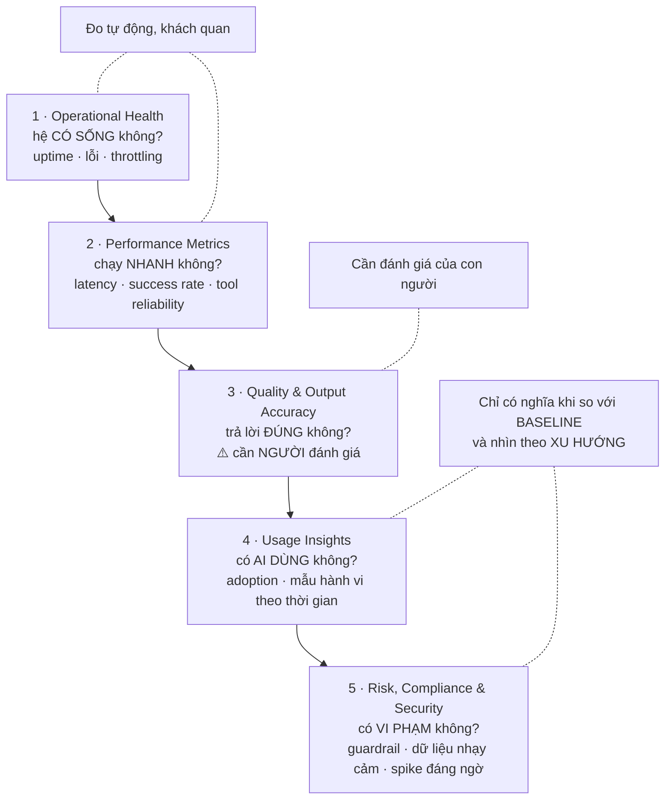

# Note 17 — Khung giám sát đa tầng & công cụ

> [!summary] TL;DR
> Note mở màn cụm **Deploy — trọng số cao nhất của đề (40–45%)**. Ba khối:
> 1. **Năm tầng giám sát** — **Operational Health · Performance Metrics · Quality and Output Accuracy · Usage Insights · Risk, Compliance and Security**. Nhớ theo thứ tự leo thang: *hệ có sống không → chạy nhanh không → trả lời đúng không → ai dùng không → có vi phạm gì không*.
> 2. **Bốn quy trình giám sát** phải khuyến nghị: **Establish a Monitoring Operating Model** (6 thành phần, gồm **vai trò, nhịp rà log, quản lý thay đổi**) · **Configure Guardrails and Threshold Alerts** · **Conduct Regular Quality Evaluations** · **Continuously Improve Based on Insights**.
> 3. **Sáu nhóm công cụ**: **Azure Monitor** (telemetry lõi + alert + **KQL**) · **Microsoft 365 Admin Analytics** (adoption) · **Copilot & Agent Analytics dashboards** · **Power Platform Admin Center** (môi trường, connector, DLP) · **nền tảng observability tập trung** (single-pane-of-glass) · **dashboard tuỳ biến** (Power BI, heatmap, **drift detection**).
>
> ⭐ Nguyên tắc chốt của architect: **khi tổ chức ĐÃ có khung giám sát, việc của bạn là tìm thành phần còn THIẾU và điểm cải thiện** — không dựng lại từ đầu.
>
> Thuật ngữ: **Observability** = khả năng suy ra trạng thái bên trong hệ thống từ dữ liệu nó phát ra (log, metric, trace). **Telemetry** = dữ liệu đo đạc hệ thống tự gửi ra. **KQL** (Kusto Query Language) = ngôn ngữ truy vấn log của Azure. **Throttling** = việc hệ thống chủ động giới hạn tốc độ xử lý khi quá tải. **Drift** = model kém dần vì dữ liệu thực tế trôi khỏi dữ liệu huấn luyện. **SLA** = cam kết mức dịch vụ. **Guardrail** = rào chắn giới hạn hành vi agent.

---

## 1. Vì sao cụm Deploy đáng học kỹ

> ⚠️ **Nhắc lại bẫy phân bổ:** 4 module của cụm **Deploy** chỉ chiếm **~29% số ký tự** giáo trình nhưng gánh **40–45% điểm thi**. Đây là cụm phải đọc kỹ hơn độ dày tài liệu gợi ý.

Giáo trình đặt vấn đề rất rõ: agent AI đang biến đổi vận hành doanh nghiệp, **nhưng thành công của chúng phụ thuộc vào giám sát vững, phân tích có cấu trúc và thực hành tinh chỉnh có hệ thống**. Vai trò của solution architect là **định nghĩa chiến lược bảo đảm agent hoạt động dự đoán được, cho kết quả chất lượng cao, và tuân thủ chuẩn governance của tổ chức**.

---

## 2. Năm tầng giám sát ⭐⭐

Giám sát agent AI đòi hỏi **cách tiếp cận đa tầng** (multilayered). Architect phải cân nhắc đủ **năm tầng**:

| # | Tầng | Đo cái gì |
|---|---|---|
| 1 | **Operational Health** | **Uptime · availability · tần suất lỗi · điều kiện throttling · độ trễ xử lý** |
| 2 | **Performance Metrics** | **Thời gian phản hồi · tỷ lệ thành công của action · độ tin cậy khi gọi tool · số đo hoàn tất workflow** |
| 3 | **Quality and Output Accuracy** | **Mức phù hợp của hành động/phản hồi sinh ra · mức khớp quy tắc nghiệp vụ · độ lệch khỏi hành vi kỳ vọng** |
| 4 | **Usage Insights** | **Xu hướng khối lượng · mức chấp nhận của người dùng đang hoạt động · mức dùng từng tính năng · mẫu hành vi theo thời gian** |
| 5 | **Risk, Compliance, and Security** | **Vi phạm guardrail · xử lý dữ liệu nhạy cảm · đột biến hoạt động đáng ngờ · mức tuân thủ chính sách tổ chức** |

`★ Insight ─────────────────────────────────────`
Năm tầng này **không phải năm danh mục ngang hàng** mà là một **thang leo dần về độ khó đo lường** — và nhận ra điều đó giúp trả lời được câu hỏi "tầng nào hay bị bỏ sót nhất".

Tầng 1 và 2 (**health, performance**) đo được **tự động, khách quan, tức thì**: uptime là con số, latency là con số. Đây là phần mọi đội đều có sẵn vì nó giống hệt giám sát một ứng dụng web thường.

Tầng 3 (**quality and output accuracy**) là chỗ **đứt gãy**. Không có đồng hồ nào đo được *"câu trả lời này có phù hợp không"* — nên nó cần **human-in-the-loop spot check** và **scenario-based evaluation**, đúng như quy trình thứ ba ở §3. Đây là tầng các đội hay bỏ qua vì nó **tốn người**, và cũng là tầng mà một agent hỏng sẽ trượt qua mà mọi dashboard vẫn xanh.

Tầng 4 và 5 khác cả bốn tầng trên ở chỗ chúng **chỉ có ý nghĩa khi nhìn theo thời gian và theo tổng thể**: một lần dùng không nói lên adoption, một prompt lạ không phải lạm dụng — phải là **"đột biến"** (spike) mới đáng báo động. Vì vậy chúng cần **baseline**, và đó chính là lý do quy trình operating model yêu cầu **"standardized metric definitions (creating a baseline with trends)"**.
`─────────────────────────────────────────────────`

---

## 3. Bốn quy trình giám sát phải khuyến nghị

> ⭐ Câu định hướng vai trò: architect **khuyến nghị quy trình giám sát cho toàn tổ chức**; **khi đã có khung sẵn thì tìm THÀNH PHẦN CÒN THIẾU và điểm cải thiện**. Đây là khác biệt giữa tư vấn và làm lại — đề hay đưa tình huống "khách hàng đã có Azure Monitor rồi, bạn làm gì tiếp".

### 3.1. Establish a Monitoring Operating Model

> Mô hình vận hành mạnh bảo đảm **tính nhất quán, quyền sở hữu và trách nhiệm giải trình** (consistency, ownership, accountability).

**Sáu thành phần:**

| # | Thành phần | Nội dung |
|---|---|---|
| 1 | **Defined roles** | **Ops team · product owners · data engineers · architects** |
| 2 | **Process workflows for incident response** | Luồng xử lý sự cố |
| 3 | **Standardized metric definitions** | **Tạo baseline kèm xu hướng** (creating a baseline with trends) ⭐ |
| 4 | **Log review cadence** | **Hằng ngày / hằng tuần / hằng tháng** |
| 5 | **Change management and version tracking** | Quản lý thay đổi và theo dõi phiên bản |
| 6 | **Documentation of expected agent behaviors and constraints** | **Tài liệu hoá hành vi kỳ vọng và ràng buộc** của agent |

> ⭐ Thành phần **6** là thứ khiến tầng 3 (*quality*) đo được: **không có tài liệu về "hành vi kỳ vọng" thì không thể phát hiện "độ lệch khỏi hành vi kỳ vọng"**. Nó cũng chính là **behavior envelope** đã định nghĩa ở [[07-Solution-Rules-Vai-tro-va-AI-CoE]] và **safety rules** ở [[11-Ba-loai-Agent-va-Foundry-Tools]] — được tái sử dụng ở giai đoạn vận hành làm **tiêu chuẩn đối chiếu**.

### 3.2. Configure Guardrails and Threshold Alerts

**Ba việc:**
1. **Đặt ngưỡng** cho **latency, khối lượng exception và hoạt động bất thường**
2. **Tạo alert tự động** cho **trigger guardrail hoặc thất bại khi gọi tool**
3. **Theo dõi đột biến bất thường về số lượng prompt** — dấu hiệu **có thể đang bị lạm dụng** (potential misuse)

### 3.3. Conduct Regular Quality Evaluations

**Bốn hoạt động:**
1. **Human-in-the-loop spot checks** (người kiểm tra ngẫu nhiên)
2. **Scenario-based evaluations** (đánh giá theo kịch bản)
3. **Review low-confidence outputs** (rà các đầu ra độ tin cậy thấp)
4. **Kiểm chứng mức khớp với quy tắc nghiệp vụ hoặc yêu cầu tuân thủ**

### 3.4. Continuously Improve Based on Insights

**Bốn việc:**
1. **Phân tích log và telemetry để tìm mẫu thất bại** (failure patterns)
2. **Xác định nhu cầu đào tạo NGƯỜI DÙNG** ⭐
3. **Khuyến nghị cải thiện prompt engineering**
4. **Đề xuất điều chỉnh workflow hoặc huấn luyện lại custom model** (nếu có)

> ⭐ Việc **2** đáng chú ý: khi thấy mẫu thất bại, **không phải lúc nào cũng sửa agent** — đôi khi cách khắc phục đúng là **đào tạo người dùng**. Bốn việc này xếp theo thứ tự chi phí tăng dần: *đào tạo người dùng → sửa prompt → sửa workflow → retrain model*. Chọn cách rẻ nhất giải quyết được vấn đề.

---

## 4. Sáu nhóm công cụ giám sát ⭐⭐

> Architect nên khuyến nghị bộ công cụ **phủ đủ ba mặt: observability, analytics và administrative insights**.

| Công cụ | Cung cấp gì | Dùng cho việc gì |
|---|---|---|
| **Azure Monitor** *(Core Telemetry + Alerts)* | **Telemetry của ứng dụng và agent** · **dashboard metric thời gian thực** · **alert rule cho bất thường** · **tích hợp Log Analytics Workspace** | **Giám sát workflow agent dựng bằng Power Platform hoặc service tuỳ biến** · **theo dõi lỗi, latency, throughput, thất bại connector** · **viết truy vấn KQL để chẩn đoán sâu** |
| **Microsoft 365 Admin Analytics** *(Usage & Adoption)* | — | **Hiểu khối lượng dùng agent** · **theo dõi adoption và engagement** · **nhận diện phòng ban dùng ít hoặc gặp rào cản vận hành** · **đo cải thiện tuần-qua-tuần** |
| **Copilot & Agent Analytics Dashboards** *(khi tenant có)* | **Tần suất gọi agent** · **xu hướng hoàn tất tác vụ** · **truy vấn phổ biến của người dùng** · **insight về mẫu năng suất** · **sự kiện lỗi hoặc kích hoạt guardrail** | Nhìn agent từ góc **người dùng cuối** |
| **Power Platform Admin Center** *(Environment-Level)* | **Sức khoẻ môi trường** · **mức dùng connector và giới hạn** · **telemetry của flow** (cho agent dùng workflow) · **khả năng thấy tác động của DLP rule** | Giám sát ở **cấp môi trường** |
| **Foundry / nền tảng observability tổ chức** | Hợp nhất **log đa hệ thống · event trace · dashboard xuyên môi trường · insight thực thi model AI** | ⭐ **Giảm phân mảnh**, cho **single-pane-of-glass** với hệ agent phức tạp |
| **Custom Dashboards** | **KPI dashboard trong Power BI** · **heatmap mức dùng** · **trực quan hoá phát hiện drift** · **báo cáo xu hướng tuân thủ** | Architect thường tự thiết kế |

`★ Insight ─────────────────────────────────────`
Sáu công cụ này **không cạnh tranh nhau — chúng nhìn hệ thống từ sáu độ cao khác nhau**, và đề hay hỏi "dùng công cụ nào cho vấn đề X".

**Azure Monitor** nhìn từ **tầng hạ tầng và ứng dụng**: lỗi, latency, throughput — đó là nơi bạn tìm khi agent *chậm hoặc gãy*. **Power Platform Admin Center** nhìn từ **tầng môi trường**: connector, giới hạn, DLP — nơi tìm khi vấn đề là *cấu hình hoặc giới hạn nền tảng*. **M365 Admin Analytics** và **Copilot Analytics** nhìn từ **tầng người dùng**: ai dùng, dùng gì, hỏi gì — nơi tìm khi agent *chạy tốt nhưng không ai dùng*.

Ánh xạ ngược về **5 tầng giám sát** ở §2 thì thấy phân công rõ: tầng 1-2 → **Azure Monitor**; tầng 4 → **M365 Admin Analytics + Copilot Analytics**; tầng 5 → **Power Platform Admin Center** (DLP) + alert của Azure Monitor. Còn **tầng 3 (quality) không có công cụ nào phủ trọn** — đó là lý do nó cần **quy trình đánh giá con người** và **dashboard tuỳ biến** tự dựng. Chỗ trống này là điểm đắt giá nhất của cả unit.
`─────────────────────────────────────────────────`

### 4.1. Ví dụ bảng Agent Health Summary

Giáo trình đưa một bảng mẫu — đáng nhớ vì nó cho thấy **bốn cột tối thiểu** của một dashboard sức khoẻ agent:

| Agent Name | Success Rate | Avg. Response Time | Errors Today | Usage Trend |
|---|---|---|---|---|
| **Sales Helper** | **98%** | **1,8 giây** | **3** | ↑ Increasing |
| **Ops Agent** | **92%** | **2,5 giây** | **17** | → Steady |
| **Finance Advisor** | **86%** | **3,2 giây** | **28** | ↓ Decreasing |

> ⭐ Đọc bảng này theo hàng thì thấy **ba chỉ số xấu đi CÙNG NHAU**: *Finance Advisor* có tỷ lệ thành công thấp nhất, phản hồi chậm nhất, nhiều lỗi nhất — **và mức dùng đang giảm**. Đó chính là bài học: **xu hướng sử dụng giảm thường là TRIỆU CHỨNG, không phải nguyên nhân**. Người dùng bỏ agent vì nó chậm và hay sai, chứ không phải vì họ không cần nó. Đây là kiểu lập luận đề hay kiểm tra: cho một bảng số rồi hỏi *"nên điều tra agent nào trước và vì sao"*.

### 4.2. Năm best practice

| # | Best practice | Vì sao |
|---|---|---|
| 1 | **Always centralize logs** | Log rải rác thì không tương quan được sự kiện |
| 2 | **Standardize naming conventions** | Không đặt tên thống nhất thì không truy vấn xuyên hệ được |
| 3 | **Define clear SLAs for agent responsiveness** | Không có SLA thì không biết ngưỡng nào là "chậm" |
| 4 | **Automate alerting for critical business workflows** | Không ai ngồi nhìn dashboard 24/7 |
| 5 | **Integrate monitoring outputs into monthly operational reviews** | Số liệu không được đọc thì không dẫn tới hành động ⭐ |

---

## 5. 🔎 Bổ sung ngoài nguồn: Application Insights & groundedness

> 🔎 **Ngoài nguồn** — hai mục sau **có trong khung kỹ năng chính thức của AB-100 nhưng nguồn giáo trình không nhắc tới** (đã đối chiếu tần suất trên toàn corpus 468K ký tự: `Application Insights` = 0 hit, `groundedness` = 0 hit). Bổ sung để không hổng khi thi.

### 5.1. Application Insights

**Application Insights** là thành phần của **Azure Monitor** chuyên về **giám sát ứng dụng (APM — Application Performance Monitoring)**. Quan hệ với Azure Monitor: Azure Monitor là **nền tảng bao trùm** (thu thập metric, log, alert cho mọi tài nguyên Azure), còn Application Insights là **dịch vụ chuyên biệt bên trong nó** cho tầng ứng dụng.

| Khả năng | Nội dung |
|---|---|
| **Distributed tracing** | Lần theo **một request đi qua nhiều dịch vụ** — quan trọng với agent gọi chuỗi tool/connector |
| **Dependency tracking** | Đo **thời gian và tỷ lệ lỗi của từng lời gọi ra ngoài** (API, database, connector) |
| **Live Metrics** | Xem **metric gần thời gian thực** khi triển khai |
| **Custom events & metrics** | Ghi **sự kiện nghiệp vụ tự định nghĩa** (ví dụ *"agent escalate lên người"*) |
| **Truy vấn bằng KQL** | Dùng chung ngôn ngữ với Log Analytics |

> Trong ngữ cảnh AB-100: khi agent gọi **custom API, Azure Functions hoặc dịch vụ tự viết**, đó là nơi Application Insights có giá trị nhất — nó trả lời câu hỏi *"chậm ở đoạn nào trong chuỗi gọi"* mà dashboard cấp agent không trả lời được.

### 5.2. Groundedness

**Groundedness** (mức có căn cứ) = **thước đo mức độ câu trả lời của model được hỗ trợ bởi dữ liệu nguồn đã cung cấp**, thay vì do model tự bịa. Đây là **metric chất lượng chính cho hệ RAG** — tức chính là **tầng 3 (Quality and Output Accuracy)** mà §2 nói là khó đo nhất.

| Metric | Trả lời câu hỏi |
|---|---|
| **Groundedness** | **Câu trả lời có được nguồn hỗ trợ không?** (chống bịa) |
| **Relevance** | Câu trả lời có **đúng ý câu hỏi** không? |
| **Coherence** | Câu trả lời có **mạch lạc** không? |
| **Fluency** | Câu trả lời có **trôi chảy về ngôn ngữ** không? |
| **Retrieval** | Đoạn văn **lấy về có liên quan** không? |

> ⭐ Groundedness là lý do note [[13-Grounding-Power-Apps-va-Well-Architected]] nhấn mạnh **provenance — trích dẫn nguồn**: có trích dẫn thì groundedness **kiểm chứng được tự động**; không có thì phải nhờ người đọc. Chi tiết kỹ thuật cách chấm các metric này trong Foundry nằm ở [[../AI-103/04-Toi-uu-Model-va-Responsible-GenAI]].

---

## Câu hỏi phỏng vấn

> [!question] Khách hàng đã có Azure Monitor và dashboard đầy đủ cho agent. Vai trò của bạn là gì?
> **Không dựng lại — tìm thành phần còn thiếu.** Giáo trình nói rõ: khi đã có khung sẵn, architect **tìm missing components và điểm cải thiện**. Cách rà là đối chiếu với **5 tầng giám sát**: hầu hết tổ chức đã phủ tốt tầng 1-2 (*operational health, performance*) vì chúng giống giám sát ứng dụng web thường và **đo được tự động**. Chỗ hay thiếu là **tầng 3 — Quality and Output Accuracy**, vì không có đồng hồ nào đo được "câu trả lời này có phù hợp không"; nó cần **quy trình con người**: human-in-the-loop spot check, scenario-based evaluation, rà đầu ra low-confidence, kiểm chứng khớp business rule. Cũng nên kiểm xem có **tài liệu hoá hành vi kỳ vọng** chưa — không có nó thì không thể phát hiện "độ lệch khỏi hành vi kỳ vọng".

> [!question] Nhìn bảng Agent Health Summary, bạn điều tra agent nào trước và vì sao?
> **Finance Advisor** — nó xấu nhất ở cả bốn cột: success rate **86%** (thấp nhất), response time **3,2 giây** (chậm nhất), **28 lỗi** hôm nay (nhiều nhất), và usage trend **đang giảm**. Điểm lập luận quan trọng: **xu hướng dùng giảm là TRIỆU CHỨNG, không phải nguyên nhân** — người dùng bỏ agent vì nó chậm và hay sai. Nếu chỉ nhìn cột usage rồi kết luận "agent này không cần thiết, cân nhắc khai tử" thì chẩn đoán ngược. Thứ tự xử lý: trước hết dùng **Azure Monitor + KQL** tìm nguyên nhân lỗi và latency (tầng 1-2), rồi mới xét tầng 3 xem chất lượng đầu ra có vấn đề riêng không.

> [!question] Bạn phát hiện một mẫu thất bại lặp lại trong log. Các phương án khắc phục theo thứ tự nào?
> Theo **thứ tự chi phí tăng dần**, đúng như bốn việc của quy trình *Continuously Improve*: (1) **đào tạo người dùng** — nhiều "lỗi" thật ra là người dùng hỏi sai cách hoặc kỳ vọng sai; (2) **cải thiện prompt engineering** — sửa chỉ dẫn, rẻ và nhanh, không cần triển khai lại; (3) **điều chỉnh workflow** — đổi luồng, tốn công thiết kế và kiểm thử; (4) **huấn luyện lại custom model** — đắt nhất, chỉ khi thật sự là vấn đề của model. Chọn cách **rẻ nhất giải quyết được vấn đề**. Điểm dễ bỏ qua nhất là (1): không phải mẫu thất bại nào cũng cần sửa agent.

> [!question] Chọn công cụ nào cho từng loại vấn đề?
> Ánh xạ theo **độ cao quan sát**. Agent **chậm hoặc gãy** → **Azure Monitor** (lỗi, latency, throughput, thất bại connector; viết **KQL** để chẩn đoán sâu; **Log Analytics Workspace**); nếu agent gọi API/Functions tự viết thì thêm **Application Insights** cho **distributed tracing** để biết chậm ở đoạn nào. Vấn đề về **cấu hình hoặc giới hạn nền tảng** → **Power Platform Admin Center** (sức khoẻ môi trường, mức dùng và giới hạn connector, telemetry flow, tác động DLP). Agent **chạy tốt nhưng không ai dùng** → **M365 Admin Analytics** (adoption, phòng ban dùng ít) và **Copilot Analytics** (tần suất gọi, truy vấn phổ biến, sự kiện guardrail). Hệ **agent phức tạp nhiều môi trường** → **nền tảng observability tập trung** để có **single-pane-of-glass**, giảm phân mảnh. Và tầng **quality** thì không công cụ nào phủ trọn — cần **dashboard tuỳ biến** (Power BI, heatmap, drift detection) cộng quy trình đánh giá của con người.

> [!question] Làm sao đo được tầng "Quality and Output Accuracy" một cách có hệ thống?
> Hai lớp. **Lớp quy trình** theo giáo trình: **human-in-the-loop spot check**, **scenario-based evaluation**, **review low-confidence output**, và **kiểm chứng khớp business rule/compliance** — cộng điều kiện tiên quyết là **tài liệu hoá hành vi kỳ vọng và ràng buộc** để có chuẩn đối chiếu. **Lớp metric** *(🔎 ngoài nguồn)*: dùng bộ metric đánh giá của hệ RAG — **groundedness** (câu trả lời có được nguồn hỗ trợ không, tức chống bịa), **relevance**, **coherence**, **fluency**, **retrieval**. Groundedness là metric trung tâm, và nó **chỉ tự động hoá được nếu hệ có trích dẫn nguồn (provenance)** — thêm một lý do để thiết kế RAG luôn kèm citation.

---

## Tự kiểm tra

1. Vì sao cụm **Deploy** đáng học kỹ hơn độ dày tài liệu gợi ý?
2. **Năm tầng giám sát** và mỗi tầng đo gì?
3. Tầng nào **đo được tự động**, tầng nào **cần con người**, tầng nào **cần baseline**?
4. Nguyên tắc vai trò của architect khi tổ chức **đã có** khung giám sát?
5. **Sáu thành phần** của Monitoring Operating Model? Thành phần nào khiến tầng 3 đo được?
6. **Ba việc** khi cấu hình guardrail và threshold alert? Đột biến prompt là dấu hiệu gì?
7. **Bốn hoạt động** đánh giá chất lượng định kỳ?
8. **Bốn việc** cải tiến liên tục — xếp theo **thứ tự chi phí** nào?
9. **Sáu nhóm công cụ** giám sát và mỗi cái nhìn hệ thống từ độ cao nào?
10. **Azure Monitor** cung cấp 4 thứ gì và dùng cho 3 việc gì? Ngôn ngữ truy vấn là gì?
11. **Power Platform Admin Center** cho thấy 4 thứ gì?
12. **Copilot & Agent Analytics** cho 5 loại insight nào?
13. Nền tảng observability tập trung giải quyết vấn đề gì?
14. Bốn loại **dashboard tuỳ biến** architect hay thiết kế?
15. Bảng **Agent Health Summary**: 5 cột nào? Đọc bảng ví dụ thì nên điều tra agent nào trước và vì sao?
16. **Năm best practice** giám sát?
17. 🔎 **Application Insights** là gì, quan hệ với Azure Monitor, và 5 khả năng chính?
18. 🔎 **Groundedness** đo gì? Bốn metric chất lượng đi kèm? Vì sao **provenance** giúp đo groundedness?

## Liên quan
- [[00-MOC-AB100]] — MOC bộ AB-100
- [[16-Orchestrate-Prebuilt-Agents-va-Apps]] — note trước, khép cụm Design
- [[18-Metrics-Telemetry-va-Tuning]] — note sau: phân tích backlog & feedback, metric, telemetry, tuning
- [[07-Solution-Rules-Vai-tro-va-AI-CoE]] — **behavior envelope** = tài liệu "hành vi kỳ vọng" mà giám sát đối chiếu
- [[11-Ba-loai-Agent-va-Foundry-Tools]] — safety rules, monitoring & logging là best practice của task agent
- [[13-Grounding-Power-Apps-va-Well-Architected]] — provenance/citation, nền của việc đo groundedness
- [[19-Testing-Quy-trinh-Metrics-va-Validation]] — kiểm thử trước khi lên production, bổ trợ cho giám sát sau đó
- [[24-Governance-Data-Residency-va-Responsible-AI]] — tầng 5: vi phạm guardrail, dữ liệu nhạy cảm
- [[../AI-103/04-Toi-uu-Model-va-Responsible-GenAI]] — cách chấm groundedness/relevance/coherence trong Foundry
- [[../../../06-DevOps/00-MOC-DevOps]] — observability & alerting góc DevOps
