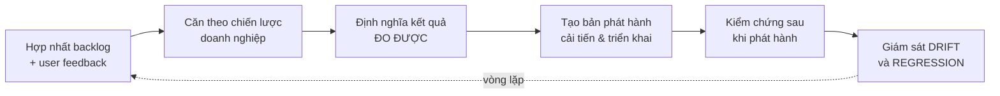
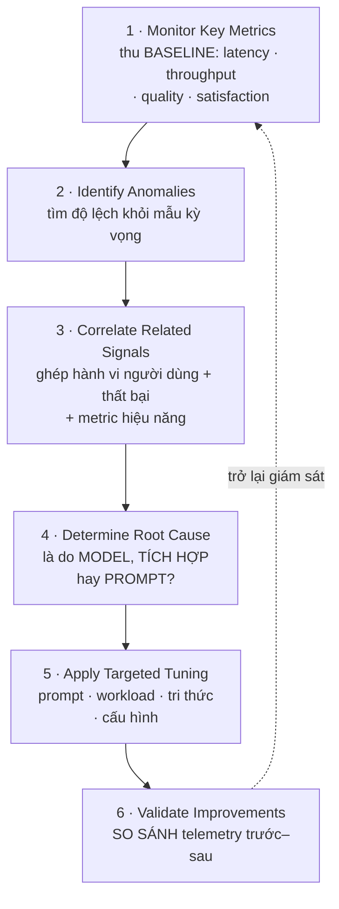

# Note 18 — Backlog & feedback, metrics, telemetry và bốn lớp tuning

> [!summary] TL;DR
> Note "vận hành" của cụm Deploy. Bốn khối:
> 1. **Phân tích backlog & user feedback** — phân loại backlog theo **6 domain**: **Accuracy · Knowledge · Performance · UX · Integration · Governance**. Bước đầu tiên **luôn là phân loại**, không phải sửa ngay. **Conversation transcript** cho thấy nguyên nhân gốc mà **telemetry thô không thấy được**.
> 2. **Ba nhóm metric** — **Operational** (latency, throughput, error rate, resource utilization) · **Quality & Reasoning** (response accuracy, knowledge coverage, action effectiveness) · **User-Centered** (satisfaction, abandonment rate, **task completion rate**). ⭐ **Task completion rate là chỉ báo TỐT NHẤT cho việc người dùng có đạt được mục tiêu hay không.**
> 3. **Telemetry** — bốn nhóm: **Operational · Model-Level · Behavioral · Governance & Compliance**. Nguyên tắc đọc: **tìm MẪU (patterns), không phải sự kiện đơn lẻ**. Ba tín hiệu điển hình: *latency tăng · error spike · token cao*.
> 4. **Bốn lớp tuning** — **Knowledge · Behavioral · Performance · Governance-aligned**. Quy trình chẩn đoán 6 bước: **Monitor → Identify anomalies → Correlate signals → Determine root cause → Apply targeted tuning → Validate improvements**.
>
> Thuật ngữ: **Backlog** = danh sách việc tồn đọng cần làm. **Abandonment rate** = tỷ lệ người dùng bỏ dở giữa chừng. **Model drift** = model kém dần vì dữ liệu thực tế trôi khỏi dữ liệu huấn luyện. **Token** = đơn vị văn bản model tính phí. **Thick vs thin prompt** = prompt dài nhiều ngữ cảnh ↔ prompt ngắn gọn. **Regression** = thứ đang chạy tốt bỗng hỏng sau một thay đổi.

---

## 1. Phân tích backlog & user feedback (U2)

### 1.1. Backlog chứa gì, feedback đến từ đâu

**Backlog của vận hành AI/agent thường chứa 6 loại:** **enhancement request** · **feature gap** · **issue hoặc failure mode lặp lại** · **friction do người dùng báo** · **rủi ro vận hành** · **lo ngại về lệch chuẩn governance hoặc chính sách**.

**User feedback đến từ 6 nguồn:** **conversation transcript** · **agent usage analytics** · **support ticket** · **khảo sát nội bộ** · **prompt đánh giá trong app** (in-app rating) · **observability dashboard**.

**Phân tích backlog hiệu quả giúp architect 5 việc:** **ưu tiên cải tiến theo tác động** · **phân loại chủ đề và phát hiện mẫu đang nổi** · **hiểu sentiment và kỳ vọng người dùng** · **kiểm chứng hành vi agent có khớp ý định nghiệp vụ không** · **nhận diện cơ hội tự động hoá và tái thiết kế quy trình**.

### 1.2. Sáu domain phân loại backlog ⭐⭐

> ⚠️ **Bước ĐẦU TIÊN khi phân tích backlog là PHÂN LOẠI theo domain** — không phải sửa prompt ngay, không phải tắt agent. Đây là đáp án một câu quiz của module.

| Category | Nội dung | Example Backlog Items |
|---|---|---|
| **Accuracy and Reasoning** | Phản hồi **sai, thiếu, hoặc độ tin cậy thấp** | **Hiểu sai truy vấn; thiếu ngữ cảnh** |
| **Knowledge Issues** | **Nội dung lỗi thời, nguồn grounding không đủ** | **Tài liệu cũ; thiếu bài viết chuyên ngành** |
| **Performance** | **Phản hồi chậm, timeout, latency cao** | **Latency cao; connector bị throttle** |
| **User Experience** | **Prompt gây khó hiểu, luồng không rõ, hướng dẫn kém** | **Luồng khó hiểu; chỉ dẫn không rõ** |
| **Integration Issues** | **Thất bại API, giới hạn connector, vấn đề truy cập dữ liệu** | **API lỗi; action gãy** |
| **Governance and Compliance** | **Guardrail bị kích hoạt, xung đột DLP, hành động bị hạn chế** | **Truy cập dữ liệu bị chặn; cảnh báo DLP** |

Sau khi phân loại, **ưu tiên theo ma trận Impact × Effort** (tác động nghiệp vụ × công sức cần bỏ).

`★ Insight ─────────────────────────────────────`
Sáu domain này **không tuỳ tiện — chúng ánh xạ gần một-một sang các lớp kiến trúc của agent**, và đó là lý do phân loại trước lại quan trọng đến vậy.

*Accuracy* → tầng **model/prompt**. *Knowledge* → tầng **grounding**. *Performance* → tầng **workflow và connector**. *UX* → tầng **thiết kế hội thoại** (topic, message node). *Integration* → tầng **API/connector**. *Governance* → tầng **chính sách (DLP, label, quyền)**.

Nghĩa là **phân loại đúng domain đã đồng thời chỉ ra ĐỘI NÀO phải sửa và LỚP NÀO phải chạm vào**. Ngược lại, nhảy thẳng vào "sửa prompt" — phản xạ tự nhiên nhất — chỉ đúng khi vấn đề thuộc domain *Accuracy*; nếu gốc rễ là *Knowledge* thì prompt có viết hay đến mấy cũng không tạo ra nội dung không tồn tại, còn nếu là *Governance* thì agent bị **chặn**, không phải **hiểu sai**.

Đối chiếu với bảng **AI Issue Mapping** ở §3.5 sẽ thấy sáu domain này tái xuất gần nguyên vẹn dưới dạng *Issue Theme → Potential Cause → Required Tuning*. Học một lần dùng được cả hai chỗ.
`─────────────────────────────────────────────────`

### 1.3. Đọc tín hiệu feedback

**Năm tín hiệu architect phải phân tích:**
1. **Tần suất phản hồi tương tự** (volume signals)
2. **Mức nghiêm trọng** của vấn đề người dùng báo
3. **Chỉ báo sentiment trong transcript**
4. **Kỳ vọng bị hụt so với workflow nghiệp vụ** (missed expectations vs business workflows)
5. **Gợi ý cải thiện hướng dẫn của agent**

### 1.4. Conversation transcript — công cụ chẩn đoán sâu nhất ⭐

> **Transcript tiết lộ 5 thứ:** **chỗ agent hiểu sai ý định** · **chỗ người dùng BỎ DỞ luồng** · **các bước suy luận sai** · **nội dung tri thức còn thiếu** · **workflow đang cần con người can thiệp**.

**Bốn việc architect làm với transcript:**
1. **Trích các đường thất bại phổ biến** (common failure paths)
2. **Map mẫu transcript về nguyên nhân gốc**
3. **Xác định nhu cầu đào tạo hoặc cập nhật tri thức**
4. **Khuyến nghị điều chỉnh guardrail hoặc giới hạn action**

> ⭐ Câu chốt trong phần tổng kết module: **"Conversation transcripts reveal root causes that aren't always visible in raw telemetry."** — transcript cho thấy nguyên nhân gốc mà **telemetry thô không phải lúc nào cũng thấy**. Telemetry nói *"70% người dùng bỏ ở bước 3"*; transcript nói *"vì bước 3 hỏi một câu mà người dùng không có thông tin để trả lời"*.

**Framework rà transcript — 5 bước** (từ U3):
1. **Xác định mục tiêu người dùng đã kích hoạt** (triggering user goal)
2. **Rà cách hệ thống diễn giải**
3. **So sánh đầu ra với hành vi kỳ vọng**
4. **Đánh dấu các điểm ma sát** (friction points)
5. **Đề xuất cải thiện về tri thức, hành vi hoặc workflow**

### 1.5. Những thứ phải theo dõi về usage & behavior

**Bảy mục:** **xu hướng dùng và adoption** · **giai đoạn cao điểm** · **intent bị kích hoạt nhiều nhất** · **prompt có tỷ lệ thất bại cao** · **số action gọi mỗi phiên** · **sự kiện guardrail can thiệp** · **các lần bị từ chối truy cập dữ liệu**.

### 1.6. Khép vòng: biến insight thành hành động

**Feedback-to-Improvement Pipeline — 6 bước:**

**Năm việc nhúng cải tiến liên tục:** **làm mới nguồn tri thức định kỳ** · **chuẩn hoá prompt và flow** · **cải thiện logic điều phối** · **cập nhật điểm chạm tích hợp** · **triển khai guardrail mới dựa trên mẫu rủi ro**.

**Năm nội dung báo cáo cho bên liên quan:** **các chủ đề backlog hàng đầu** · **kế hoạch cải tiến** · **insight về usage và thay đổi hiệu năng** · **rủi ro hoặc vấn đề tuân thủ** · **kết quả kỳ vọng**.

---

## 2. Ba nhóm metric hiệu năng agent (U4) ⭐⭐

| Nhóm | Metric | Đo gì |
|---|---|---|
| **Operational Metrics** | **Latency** | Thời gian xử lý một request của agent |
| | **Throughput** | **Khối lượng lần chạy hoàn tất trong một khoảng thời gian** |
| | **Error Rate** | **Tỷ lệ tác vụ thất bại hoặc không hoàn tất** |
| | **Resource Utilization** | **Compute, bộ nhớ và mức tiêu thụ TOKEN** |
| **Quality and Reasoning Metrics** | **Response Accuracy** | **Mức khớp với đầu ra kỳ vọng hoặc đã được kiểm chứng** |
| | **Knowledge Coverage** | **Khả năng đưa ra đúng nội dung chuyên ngành** |
| | **Action Effectiveness** | **Hoàn tất tác vụ nhiều bước đúng như dự định** |
| **User-Centered Metrics** | **Satisfaction Indicators** | **Xu hướng phản hồi và sentiment của người dùng** |
| | **Abandonment Rate** | **Tỷ lệ bỏ dở giữa luồng công việc của agent** |
| | ⭐ **Task Completion Rate** | **Người dùng có ĐẠT ĐƯỢC kết quả mong muốn hay không** |

> ⭐⭐ Phần tổng kết module gọi thẳng **Task Completion Rate** là **"the best indicator of user success"** — chỉ báo tốt nhất cho thành công của người dùng. Đây là đáp án một câu quiz: *"metric nào cho biết người dùng có đạt được kết quả dự định của workflow không?"* → **Task completion rate**, không phải token usage, không phải connector quota, không phải storage utilization.

### 2.1. Ba nhóm telemetry để thu thập

| Nhóm | Gồm |
|---|---|
| **Operational Telemetry** | **System log · execution trace · run log theo trigger · exception event · performance counter** |
| **Behavioral Telemetry** | **Log tương tác người dùng · conversation transcript · mẫu nhận diện intent · tín hiệu dùng tính năng** |
| **Analytics Dashboards** | Xu hướng về: **tác vụ hàng đầu của người dùng · phân bố thành công/thất bại · khối lượng hội thoại hoặc lần chạy · khoảng cao điểm · chỉ báo chất lượng** |

### 2.2. Giám sát hành vi MODEL cho generative AI ⭐

> ⚠️ Câu quan trọng: **"Even when agent logic is stable, model-driven behavior can shift over time."** — **kể cả khi logic agent không đổi, hành vi do model dẫn dắt vẫn có thể trôi theo thời gian.** Đây là điểm khác biệt lớn nhất giữa giám sát hệ AI và giám sát phần mềm truyền thống.

| Nhóm | Dấu hiệu phải theo dõi |
|---|---|
| **Model Drift** | **Thay đổi trong mẫu phản hồi** · **độ chính xác giảm ở các tác vụ lặp lại** · **tăng hallucination hoặc phản hồi lạc đề** |
| **Token Consumption** | **Tỷ lệ chi phí trên hiệu năng** · **hiệu quả của mẫu prompt** · **hành vi thick vs thin prompt** |
| **Reliability Indicators** | **Latency tăng đột ngột** · **thay đổi về hiệu quả chọn model** · **lỗi liên quan tới phụ thuộc bên ngoài** |

`★ Insight ─────────────────────────────────────`
Câu *"kể cả khi logic agent không đổi, hành vi model vẫn trôi"* lật ngược một giả định nền của kỹ thuật phần mềm: **code không đổi thì hành vi không đổi**. Với hệ generative, giả định đó **sai**.

Ba nguồn trôi: (1) **model phía sau được nhà cung cấp cập nhật** — bạn không kiểm soát; (2) **dữ liệu grounding thay đổi** — tài liệu được thêm, sửa, xoá; (3) **cách người dùng hỏi thay đổi** — họ học được cách nói chuyện với agent, hoặc bối cảnh nghiệp vụ đổi.

Hệ quả thực hành rất cụ thể: **không thể "kiểm thử một lần rồi yên tâm"**. Phải có **baseline** và **so sánh theo thời gian** — đó là lý do quy trình chẩn đoán ở §4.2 bắt đầu bằng *"Monitor Key Metrics: gather baseline"* và kết thúc bằng *"Validate: so sánh mẫu telemetry trước-và-sau"*. Cũng là lý do bước cuối của Feedback-to-Improvement Pipeline là **giám sát drift VÀ regression** — hai loại suy giảm khác nhau: *drift* đến từ bên ngoài, *regression* đến từ chính thay đổi của bạn.
`─────────────────────────────────────────────────`

---

## 3. Chẩn đoán vấn đề & bốn lớp tuning (U3)

### 3.1. Năm miền phân tích

**Operational Health** (latency, lỗi, độ trễ xử lý, throttling) · **Quality of Reasoning** (độ chính xác, liên quan, hữu ích của câu trả lời) · **Knowledge Coverage** (đầy đủ và mới của nội dung grounding) · **User Experience** (truy vấn bị hiểu sai, tác vụ bỏ dở, điểm ma sát) · **Governance & Compliance Signals** (guardrail bị kích hoạt, action bị chặn, vi phạm bảo mật).

### 3.2. Năm nhóm nguyên nhân gốc ⭐

| Nhóm | Nội dung |
|---|---|
| **Model or Prompt Issues** | **Hiểu sai hoặc thiếu ngữ cảnh** |
| **Knowledge Gaps** | **Thiếu nội dung tổ chức hoặc tệp lỗi thời** |
| **Integration Failures** | **Ràng buộc connector, giới hạn API, quy tắc truy cập dữ liệu** |
| **Configuration Issues** | **Biến môi trường sai, feature toggle, thiết lập vai trò** |
| **Governance Interference** | **DLP chặn, sensitivity label, action bị hạn chế** |

**Bốn thứ cần tìm khi đào sâu telemetry:** **mẫu thất bại lặp lại** · **truy vấn khối lượng lớn nhưng độ hài lòng thấp** · **tác vụ đang cần con người can thiệp** · **đột biến về việc thực thi guardrail**.

### 3.3. Performance Scorecard

| Metric Category | Target Behavior |
|---|---|
| **Success Rate** | **Tỷ lệ hoàn tất cao mà KHÔNG cần con người trợ giúp** |
| **Latency** | **Phản hồi nhanh và dự đoán được** |
| **Error Volume** | **Tối thiểu lỗi hệ thống** |
| **Knowledge Accuracy** | **Câu trả lời có căn cứ trong nội dung đúng** |
| **Guardrail Compliance** | **Không có hành động trái phép** |
| **User Satisfaction** | **Phản hồi tích cực với ít lần thử lại hơn** |

> ⭐ Chú ý hai cách phát biểu tinh tế: Success Rate đo *"không cần con người trợ giúp"* và User Satisfaction đo *"ít lần thử lại hơn"*. Cả hai đều **đo gián tiếp qua chi phí phải bỏ thêm** — một agent "thành công" nhưng người dùng phải hỏi lại ba lần thì không thành công thật.

### 3.4. Bốn lớp tuning ⭐⭐

| Lớp | Việc làm |
|---|---|
| **Knowledge Tuning** | **Thêm/cập nhật tệp tri thức lấp khoảng trống nội dung** · **gỡ thông tin lỗi thời hoặc không liên quan** · **tinh chỉnh cấu trúc tri thức cho rõ ràng và dễ truy xuất** |
| **Behavioral Tuning** | **Điều chỉnh orchestration hoặc các bước agent** · **thêm chỉ dẫn làm rõ để củng cố hành vi kỳ vọng** · **đưa vào chiến lược fallback cho truy vấn mơ hồ** |
| **Performance Tuning** | **Tối ưu connector và lời gọi dữ liệu bên ngoài** · **giảm bước thừa trong workflow** · **xử lý logic chạy chậm hoặc payload quá lớn** |
| **Governance-Aligned Tuning** | **Rà DLP, sensitivity label và quy tắc truy cập** · **căn năng lực agent theo yêu cầu tuân thủ** · ⭐ **bảo đảm logging và auditing VẪN NGUYÊN VẸN sau khi thay đổi** |

> ⭐ Vế cuối của Governance-aligned tuning rất đáng nhớ: **sau khi tinh chỉnh, phải kiểm tra log và audit trail còn hoạt động không**. Đây là kiểu lỗi thầm lặng — bạn tối ưu workflow, vô tình bỏ mất bước ghi log, và mất khả năng kiểm toán mà không có triệu chứng nào.

**Năm kỹ thuật tuning** (từ U4): **tinh chỉnh chỉ dẫn, prompt và mẫu hành vi** · **cập nhật hoặc tổ chức lại tài sản tri thức** · **điều chỉnh chuỗi action để giảm nút thắt** · **cấu hình lại môi trường hoặc connector** · **áp chiến lược versioning và rollback cho an toàn**.

### 3.5. Hai bảng ánh xạ vấn đề → tuning ⭐⭐

**Bảng A — AI Issue Mapping (U3):**

| Issue Theme | Potential Cause | Required Tuning |
|---|---|---|
| **Phản hồi sai** | **Khoảng trống tri thức** | **Thêm/cập nhật nội dung** |
| **Thực thi chậm** | **Workflow phức tạp** | **Tối ưu các bước** |
| **Action bị chặn** | **Governance** | **Điều chỉnh role/label** |
| **Hành vi bất ngờ** | **Logic model** | **Tinh chỉnh chỉ dẫn agent** |
| **Khởi động lại thường xuyên** | **Thất bại tích hợp** | **Sửa thiết lập API/connector** |

**Bảng B — Common Issue Categories (U4):**

| Issue Type | Possible Causes | Tuning Strategy |
|---|---|---|
| **Phản hồi sai** | **Tri thức thiếu hoặc lỗi thời** | **Cập nhật nội dung grounding** |
| **Phản hồi chậm** | **Workflow nặng, độ trễ phụ thuộc** | **Tinh gọn logic; điều chỉnh orchestration** |
| **Action thất bại** | **Ràng buộc connector/API** | **Sửa connector; cập nhật quyền** |
| **Tỷ lệ bỏ dở cao** | **Bước khó hiểu hoặc hướng dẫn không rõ** | **Cải thiện luồng UX và độ rõ của prompt** |
| **Vi phạm guardrail** | **Lệch chính sách hoặc thiếu quy tắc** | **Điều chỉnh DLP, sensitivity label, action được phép** |

> 💡 Hai bảng **chồng lấn nhưng không trùng**: bảng A có *"khởi động lại thường xuyên"*, bảng B có *"tỷ lệ bỏ dở cao"*. Gộp lại được **sáu triệu chứng** đề có thể hỏi. Điểm chung: mỗi triệu chứng chỉ về **một nguyên nhân chủ đạo**, và mỗi nguyên nhân ứng với **một lớp tuning** trong bốn lớp ở §3.4.

---

## 4. Diễn giải telemetry để tinh chỉnh (U5)

### 4.1. Bốn nhóm telemetry & ba tín hiệu điển hình

| Nhóm telemetry | Gồm |
|---|---|
| **Operational Telemetry** | **Latency và throughput · error rate và failure mode · mức tiêu thụ tài nguyên và throttling** |
| **Model-Level Telemetry** | **Mức dùng token và mẫu chi phí · độ nhất quán của phản hồi · chỉ báo drift và xu hướng suy giảm** |
| **Behavioral Telemetry** | **Độ hài lòng và tỷ lệ hoàn tất · mẫu prompt và tỷ lệ bỏ dở · mức khớp của model với tác vụ dự định** |
| **Governance and Compliance Signals** | **Guardrail can thiệp · action bị chặn hoặc truy cập dữ liệu bị hạn chế · xung đột chính sách hoặc sensitivity label** |

> ⭐⭐ **Nguyên tắc đọc telemetry:** *"Solution architects should focus on **patterns, not isolated events**."* — **tập trung vào MẪU, không phải sự kiện đơn lẻ**. Một lần lỗi không nói lên gì; một mẫu lỗi mới là tín hiệu.

**Ba tín hiệu hiệu năng và ý nghĩa:**

| Tín hiệu | Chỉ ra điều gì |
|---|---|
| **Latency tăng** | **Tải nặng, cấu trúc prompt kém hiệu quả, hoặc connector chậm** |
| **Error rate đột biến** | **Tích hợp gãy, cấu hình môi trường sai, hoặc model bất ổn** |
| **Token usage cao** | **Đầu ra dài dòng, prompt không rõ, hoặc workflow quá phức tạp** |

### 4.2. Performance Signal Map ⭐⭐

| Signal Type | Possible Cause | **Architect Action** |
|---|---|---|
| **Latency Increase** | **Model quá tải, connector chậm** | **Tối ưu workflow, cache dữ liệu** |
| **High Token Usage** | **Đầu ra dài dòng** | **Điều chỉnh mẫu prompt** |
| **Error Spike** | **Thất bại tích hợp/API** | **Kiểm chứng các phụ thuộc** |
| **Quality Drop** | **Model drift, thiếu ngữ cảnh** | **Cập nhật nguồn tri thức** |
| **Guardrail Triggers** | **Xung đột chính sách** | **Điều chỉnh quy tắc governance** |

### 4.3. Quy trình chẩn đoán 6 bước ⭐⭐

> ⭐ Bước **3 — Correlate Related Signals** là bước dễ bỏ qua nhất và cũng là bước tạo ra giá trị của architect. Một mình *"latency tăng"* không nói được gì; ghép nó với *"tỷ lệ bỏ dở tăng"* và *"lỗi connector tăng"* thì câu chuyện hiện ra: connector chậm → agent chậm → người dùng bỏ. Bước 4 phân loại nguyên nhân về đúng **ba khả năng: model-based, integration-based, hay prompt-based**.

### 4.4. Bốn cơ hội tuning ở góc model

| Cơ hội | Nội dung |
|---|---|
| **Prompt Refinement** | **Cải thiện chỉ dẫn, ràng buộc và kỳ vọng** để kết quả dự đoán được |
| **Knowledge Updates** | **Thêm, gỡ hoặc tái cấu trúc nguồn tri thức** cho grounding tốt hơn |
| **Behavioral Adjustments** | **Đưa vào logic fallback, làm rõ action, tinh chỉnh luồng orchestration** |
| **Cost Optimization** | **Giảm token thừa và tối ưu cấu trúc lời gọi** |

### 4.5. Năm KPI hiệu năng cho hệ AI

| KPI | Định nghĩa |
|---|---|
| **Responsiveness** | **Thời gian phản hồi TRUNG VỊ nằm trong giới hạn chấp nhận được** |
| **Accuracy & Relevance** | Đầu ra model **khớp kỳ vọng của tác vụ** |
| **Reliability** | **Tỷ lệ thất bại thấp xuyên các workflow** |
| **Cost-Effectiveness** | **Cân bằng mức dùng token và việc chọn model** |
| **User Outcome Completion** | **Người dùng hoàn tất được tác vụ mà KHÔNG cần can thiệp thủ công** |

> ⭐ Chú ý **Responsiveness dùng TRUNG VỊ (median)**, không phải trung bình. Trung bình bị vài lần chạy chậm bất thường kéo lệch; trung vị cho biết **trải nghiệm của người dùng điển hình**.

---

## 5. 🔎 Bổ sung ngoài nguồn: CSAT, containment rate, deflection rate

> 🔎 **Ngoài nguồn** — ba chỉ số này **có trong khung kỹ năng chính thức AB-100 nhưng nguồn giáo trình không nhắc** (đối chiếu tần suất trên corpus 468K: cả ba đều **0 hit**). Chúng là bộ chỉ số chuẩn của ngành **contact center / customer service**, nên rất hợp với phần D365 Customer Service đã học ở [[09-Copilot-trong-Dynamics-365-CE-va-Service]] và [[16-Orchestrate-Prebuilt-Agents-va-Apps]].

| Chỉ số | Định nghĩa | Đo cái gì | Bẫy diễn giải |
|---|---|---|---|
| **CSAT** (Customer Satisfaction Score) | **Điểm hài lòng khách hàng**, thường thu bằng khảo sát ngay sau tương tác (thang 1-5 hoặc 1-10), báo cáo dưới dạng **% người trả lời ở mức hài lòng** | **Cảm nhận chủ quan** của khách về **một tương tác cụ thể** | Chỉ phản ánh **người chịu trả lời khảo sát** — thường lệch về hai cực rất hài lòng hoặc rất bực |
| **Containment rate** | **Tỷ lệ hội thoại được agent AI xử lý TRỌN VẸN, không chuyển sang người** | **Mức tự chủ** của agent | ⚠️ **Cao chưa chắc tốt**: nếu agent giữ khách trong luồng nhưng không giải quyết được, containment cao mà CSAT thấp — dấu hiệu agent **giam chân** khách hàng |
| **Deflection rate** | **Tỷ lệ yêu cầu được chuyển hướng khỏi kênh tốn kém** (thường là tổng đài viên) sang kênh tự phục vụ | **Mức giảm tải cho kênh đắt tiền** | Đo ở **cấp kênh**, không phải cấp hội thoại — dễ nhầm với containment |

`★ Insight ─────────────────────────────────────`
**Containment và deflection nghe rất giống nhau nhưng đo hai thứ khác nhau, và đó chính là chỗ đề dễ ra câu hỏi.**

**Deflection** hỏi: *"khách hàng có tránh được việc gọi tổng đài không?"* — đo ở **cửa vào**, cấp kênh. **Containment** hỏi: *"một khi đã vào luồng AI, khách có được giải quyết trọn vẹn ở đó không?"* — đo **bên trong** một hội thoại.

Và cả hai đều **phải đọc kèm CSAT**, nếu không sẽ dẫn tới quyết định sai. Một agent làm cho việc gọi người thật trở nên khó khăn sẽ đẩy **containment và deflection lên cao** trong khi khách hàng ngày càng bực — con số đẹp, trải nghiệm tệ. Đây đúng là kiểu **chỉ số bị tối ưu sai hướng** mà nguyên tắc *"focus on patterns, not isolated events"* cảnh báo, chỉ khác là ở cấp KPI thay vì cấp telemetry.

Cách ghép đúng: **containment cao + CSAT cao** = agent thật sự giỏi. **Containment cao + CSAT thấp** = agent đang giam chân khách. **Containment thấp + CSAT cao** = agent biết chuyển người đúng lúc — không tệ, chỉ là chưa tự chủ. Nối với **Task Completion Rate** ở §2: đó mới là chỉ báo trung thực nhất, vì nó đo **kết quả**, không đo **việc ở lại trong luồng**.
`─────────────────────────────────────────────────`

---

## Câu hỏi phỏng vấn

> [!question] Nhận một backlog 200 mục từ người dùng agent. Bước đầu tiên của bạn là gì?
> **Phân loại theo domain** — không phải sửa prompt ngay, không phải tắt agent. Sáu domain: **Accuracy and Reasoning · Knowledge Issues · Performance · User Experience · Integration Issues · Governance and Compliance**. Lý do phân loại trước: mỗi domain **ánh xạ sang một lớp kiến trúc khác nhau** nên phân loại đúng đã đồng thời chỉ ra **đội nào sửa và chạm vào lớp nào**. Nhảy thẳng vào "sửa prompt" chỉ đúng khi vấn đề thuộc *Accuracy*; nếu gốc rễ là *Knowledge* thì prompt hay đến mấy cũng không tạo ra nội dung không tồn tại, còn nếu là *Governance* thì agent bị **chặn** chứ không **hiểu sai**. Sau khi phân loại, ưu tiên bằng **ma trận Impact × Effort**.

> [!question] Metric nào cho biết người dùng có thực sự đạt được mục tiêu của workflow?
> **Task Completion Rate** — giáo trình gọi thẳng nó là *"the best indicator of user success"*. Nó thuộc nhóm **User-Centered Metrics** cùng với *satisfaction indicators* và *abandonment rate*. Các phương án hay bị nhầm đều đo thứ khác: **token usage** đo chi phí (nhóm Operational, mục *resource utilization*), **connector quota** và **storage utilization** đo giới hạn hạ tầng — không cái nào nói được người dùng có xong việc hay không. Lưu ý cách phát biểu tương đương ở bộ KPI: **User Outcome Completion** — *hoàn tất tác vụ mà không cần can thiệp thủ công*.

> [!question] Logic agent không thay đổi suốt 6 tháng nhưng chất lượng câu trả lời đi xuống. Giải thích và xử lý?
> Đây đúng là điều giáo trình cảnh báo: **"kể cả khi logic agent ổn định, hành vi do model dẫn dắt vẫn có thể trôi theo thời gian."** Ba nguồn trôi: model phía sau được nhà cung cấp cập nhật, dữ liệu grounding thay đổi, và cách người dùng hỏi thay đổi. Dấu hiệu **Model Drift** cần soi: **thay đổi trong mẫu phản hồi, độ chính xác giảm ở tác vụ lặp lại, tăng hallucination hoặc phản hồi lạc đề**. Xử lý theo quy trình 6 bước: so với **baseline** → tìm bất thường → **tương quan tín hiệu** → xác định gốc là *model-based, integration-based hay prompt-based* → tuning đúng lớp (theo Signal Map, *Quality Drop* → **cập nhật nguồn tri thức**) → **so sánh telemetry trước-sau**. Bài học nền: không thể "kiểm thử một lần rồi yên tâm" với hệ generative.

> [!question] Telemetry cho thấy token usage tăng vọt. Bạn làm gì?
> Theo **Performance Signal Map**: *High Token Usage → nguyên nhân là đầu ra dài dòng → hành động là **điều chỉnh mẫu prompt***. Ba khả năng cụ thể mà giáo trình nêu cho tín hiệu này: **đầu ra dài dòng, prompt không rõ, hoặc workflow quá phức tạp**. Nhưng đừng dừng ở một tín hiệu — nguyên tắc là **tập trung vào MẪU, không phải sự kiện đơn lẻ**, và bước 3 của quy trình chẩn đoán là **tương quan các tín hiệu liên quan**. Nếu token tăng *kèm* latency tăng thì có thể workflow đã phình ra chứ không chỉ prompt dài. Tuning tương ứng nằm ở **Cost Optimization** (giảm token thừa, tối ưu cấu trúc lời gọi) và có thể cả **Performance Tuning** (giảm bước thừa, xử lý payload quá lớn).

> [!question] Vì sao transcript quan trọng khi đã có telemetry đầy đủ?
> Vì **"conversation transcripts reveal root causes that aren't always visible in raw telemetry."** Telemetry cho biết **cái gì xảy ra và ở đâu**; transcript cho biết **vì sao**. Ví dụ: telemetry nói *"70% người dùng bỏ ở bước 3"* — đó là abandonment rate; transcript cho thấy bước 3 hỏi một câu mà người dùng **không có thông tin để trả lời**. Transcript tiết lộ năm thứ: **chỗ agent hiểu sai ý định, chỗ người dùng bỏ dở, các bước suy luận sai, nội dung tri thức còn thiếu, workflow đang cần người can thiệp**. Framework rà 5 bước: xác định **mục tiêu người dùng đã kích hoạt** → rà **cách hệ thống diễn giải** → **so sánh đầu ra với hành vi kỳ vọng** → đánh dấu **điểm ma sát** → đề xuất cải thiện về tri thức/hành vi/workflow.

> [!question] 🔎 Khách hàng khoe containment rate của agent đạt 85%. Bạn hỏi gì tiếp?
> **Hỏi CSAT trong cùng kỳ.** Containment rate đo **tỷ lệ hội thoại agent xử lý trọn vẹn không chuyển sang người** — nhưng **cao chưa chắc tốt**: nếu agent giữ khách trong luồng mà không giải quyết được vấn đề, containment vẫn cao trong khi khách hàng ngày càng bực. Cách đọc đúng là ghép cặp: **containment cao + CSAT cao** = agent thật sự giỏi; **containment cao + CSAT thấp** = agent đang **giam chân** khách; **containment thấp + CSAT cao** = agent biết chuyển người đúng lúc, chưa tự chủ nhưng không tệ. Cũng nên phân biệt với **deflection rate** — chỉ số này đo ở **cấp kênh** (khách có tránh được việc gọi tổng đài không), còn containment đo **bên trong một hội thoại**. Và chỉ báo trung thực nhất vẫn là **task completion rate**, vì nó đo *kết quả* chứ không đo *việc ở lại trong luồng*.

---

## Tự kiểm tra

1. Backlog vận hành AI chứa **6 loại** gì? User feedback đến từ **6 nguồn** nào?
2. **Sáu domain** phân loại backlog kèm ví dụ? Mỗi domain ánh xạ sang **lớp kiến trúc** nào?
3. Bước **đầu tiên** khi phân tích backlog? Ưu tiên bằng ma trận nào?
4. **Năm tín hiệu feedback** phải phân tích?
5. Transcript tiết lộ **5 thứ** gì? **Bốn việc** architect làm với transcript? Framework rà **5 bước**?
6. Vì sao transcript **quan trọng hơn** telemetry thô trong việc tìm nguyên nhân gốc?
7. **Bảy mục** phải theo dõi về usage & behavior?
8. **Sáu bước** của Feedback-to-Improvement Pipeline? Bước cuối giám sát **hai** thứ gì?
9. **Ba nhóm metric** và các metric trong từng nhóm? Metric nào là **chỉ báo tốt nhất** cho thành công của người dùng?
10. **Ba nhóm telemetry** để thu thập? Analytics dashboard cho **5** loại xu hướng nào?
11. Câu nói về **model drift** khi logic agent không đổi — ba nguồn gây trôi?
12. **Ba nhóm** dấu hiệu giám sát hành vi model? **Thick vs thin prompt** là gì?
13. **Năm miền phân tích** khi chẩn đoán? **Năm nhóm nguyên nhân gốc**?
14. **Performance Scorecard 6 hàng** — Success Rate và User Satisfaction được phát biểu tinh tế thế nào?
15. **Bốn lớp tuning** và việc làm của từng lớp? Vế cuối của Governance-aligned tuning nhắc gì?
16. **Năm kỹ thuật tuning**?
17. Hai bảng ánh xạ vấn đề → tuning: gộp lại được **6 triệu chứng** nào?
18. **Bốn nhóm telemetry**? Nguyên tắc đọc telemetry là gì?
19. **Ba tín hiệu hiệu năng** và ý nghĩa từng cái?
20. **Performance Signal Map**: 5 signal → cause → architect action?
21. **Sáu bước** quy trình chẩn đoán? Bước 3 tạo giá trị gì? Bước 4 phân về **ba** khả năng nào?
22. **Bốn cơ hội tuning** ở góc model?
23. **Năm KPI** hiệu năng — vì sao Responsiveness dùng **trung vị**?
24. 🔎 Định nghĩa **CSAT · containment rate · deflection rate**? Containment và deflection khác nhau ở đâu?
25. 🔎 Bốn cách ghép **containment × CSAT** và ý nghĩa từng cặp?

## Liên quan
- [[00-MOC-AB100]] — MOC bộ AB-100
- [[17-Khung-Giam-sat-va-Cong-cu]] — note trước: 5 tầng giám sát, 6 nhóm công cụ, groundedness
- [[19-Testing-Quy-trinh-Metrics-va-Validation]] — note sau: kiểm thử agent & validation custom model
- [[12-Copilot-Studio-Topics-Agent-Flows-Prompt-Actions]] — fallback topic; tỷ lệ fallback là tín hiệu chất lượng
- [[13-Grounding-Power-Apps-va-Well-Architected]] — knowledge tuning chạm vào pipeline grounding
- [[09-Copilot-trong-Dynamics-365-CE-va-Service]] — bối cảnh customer service cho CSAT/containment
- [[16-Orchestrate-Prebuilt-Agents-va-Apps]] — KPI Sales/Service, first-contact resolution rate
- [[22-ALM-cho-Foundry-Custom-Model-va-D365]] — versioning & rollback khi tuning
- [[../AI-103/04-Toi-uu-Model-va-Responsible-GenAI]] — đánh giá model, drift, chấm điểm chất lượng
