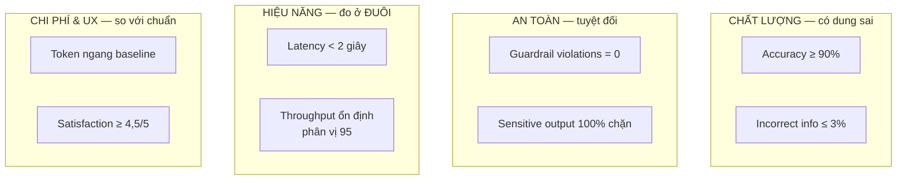

# Note 19 — Kiểm thử agent: khung, 4 loại test, metrics & validation custom model

> [!summary] TL;DR
> Note kiểm thử phần một — **trước khi lên production**. Bốn khối:
> 1. **Khung kiểm thử** — trước hết **xác lập mục tiêu test** (4 mục đích), rồi dựng **test plan 4 phần**: **Test Scope · Test Data · Test Roles · Success Criteria**.
> 2. **Bốn loại kiểm thử**: **Scenario-based** (kịch bản nghiệp vụ thật, gồm cả **đầu vào mơ hồ và thiếu**) · **Performance & reliability** (tải cao, tương tác dài, tác vụ nhiều bước, **phiên đồng thời**) · **Safety & compliance** (dữ liệu nhạy cảm, RBAC, DLP, **từ chối chỉ dẫn bị cấm**) · **Usability**.
> 3. **Ba nhóm metric kiểm thử**: **Core quantitative** (accuracy & relevance, response time, success rate, failure rate, token efficiency) · **Behavioral & quality** (user satisfaction, conversation quality, knowledge coverage) · **Observability & operational** (stability, load handling, guardrail compliance).
> 4. **Validation cho custom model** — **5 chiều**: performance · quality & accuracy · safety & compliance · cost & efficiency · user-centric. ⭐ **Bảng ngưỡng cụ thể**: **latency < 2 giây · accuracy ≥ 90% · incorrect information ≤ 3% · guardrail violations = 0 · sensitive output 100% bị chặn · satisfaction ≥ 4,5/5**.
>
> Thuật ngữ: **Multi-turn reasoning** = khả năng suy luận qua nhiều lượt hội thoại liên tiếp. **Concurrent sessions** = nhiều phiên chạy cùng lúc. **95th percentile** = giá trị mà 95% mẫu nằm dưới, dùng để đo trường hợp xấu chứ không phải trung bình. **Resilience** = khả năng phục hồi sau lỗi. **Triage** = phân loại và ưu tiên sự cố.

---

## 1. Khung kiểm thử agent AI (U1)

### 1.1. Xác lập mục tiêu kiểm thử trước

> **Trước khi bắt đầu test, phải định nghĩa MỤC ĐÍCH của test** — bốn mục đích:

| # | Mục đích |
|---|---|
| 1 | **Kiểm chứng agent có đạt được kết quả nghiệp vụ dự định** |
| 2 | **Bảo đảm độ chính xác và nhất quán xuyên các kịch bản** |
| 3 | **Xác minh guardrail, ranh giới dữ liệu và chính sách tuân thủ hoạt động đúng** |
| 4 | **Phát hiện vấn đề sớm và thiết lập BASELINE cho việc tinh chỉnh hiệu năng sau này** ⭐ |

> ⭐ Mục đích **4** nối kiểm thử với vận hành: test không chỉ để "pass/fail" mà còn để **sinh ra baseline** cho giám sát. Nếu không đo lúc test thì sau này không biết hệ đã trôi khỏi đâu — đúng vấn đề **model drift** ở [[18-Metrics-Telemetry-va-Tuning]].

### 1.2. Test plan gồm bốn phần ⭐

| Phần | Nội dung |
|---|---|
| **Test Scope** | **Tính năng, workflow, kênh và kịch bản** |
| **Test Data** | **Prompt đại diện, tình huống nghiệp vụ, và đầu vào ngữ cảnh THỰC TẾ** |
| **Test Roles** | **Ai chạy test · ai kiểm chứng đầu ra hành vi · ai ghi lại phát hiện** |
| **Success Criteria** | **Ngưỡng ĐO ĐƯỢC cho accuracy, speed, safety và usability** |

> ⭐ **Test Roles tách làm ba vai** — người *chạy*, người *kiểm chứng*, người *ghi lại*. Việc tách vai "chạy" khỏi vai "kiểm chứng" quan trọng với hệ AI vì **người viết prompt hay có thiên kiến khi chấm chính đầu ra của mình**.

### 1.3. Bốn loại kiểm thử ⭐⭐

| Loại | Kiểm cái gì |
|---|---|
| **2.1 Scenario-based testing** | Dùng **workflow nghiệp vụ THẬT** phản ánh cách nhân viên sẽ tương tác với agent · ⭐ **bao gồm cả đầu vào MƠ HỒ, THIẾU và ĐA DẠNG** · kiểm chứng **multi-turn reasoning, xử lý bộ nhớ, hành vi follow-up** · bảo đảm **đầu ra khớp kết quả kỳ vọng của từng kịch bản** |
| **2.2 Performance and reliability testing** | Đánh giá agent dưới các điều kiện: **khối lượng request cao · tương tác dài · tác vụ nhiều bước phức tạp · phiên đồng thời** |
| **2.3 Safety and compliance testing** | Xác nhận agent tôn trọng ràng buộc doanh nghiệp: **bảo vệ dữ liệu nhạy cảm · quy tắc truy cập theo vai trò · trigger chính sách (action bị hạn chế, DLP rule)** · ⭐ **TỪ CHỐI các chỉ dẫn bị cấm** (rejection of disallowed instructions) |
| **2.4 Usability testing** | Đánh giá độ rõ, mức hữu ích và dễ dùng: **câu trả lời có súc tích, chính xác, dễ hiểu không?** · **agent có đòi hỏi phải tinh chỉnh quá nhiều lần không?** · **người dùng có hiểu cách ra prompt hiệu quả không?** |

> Cả bốn loại **có thể test thủ công hoặc qua quy trình tự động**.

`★ Insight ─────────────────────────────────────`
Hai chi tiết trong bảng này là chỗ kiểm thử agent AI **khác hẳn** kiểm thử phần mềm truyền thống.

Thứ nhất, **scenario-based testing bắt buộc gồm "ambiguous, incomplete, and varied user inputs"**. Với phần mềm thường, đầu vào không hợp lệ có tập hữu hạn và bạn test biên (boundary). Với agent, **đầu vào mơ hồ là trạng thái BÌNH THƯỜNG**, không phải ngoại lệ — người dùng thật luôn hỏi cụt, thiếu ngữ cảnh, dùng từ khác nhau cho cùng một ý. Một bộ test chỉ gồm prompt sạch, đầy đủ sẽ **pass hết rồi hỏng ngay ngày đầu production**.

Thứ hai, **safety testing gồm "rejection of disallowed instructions"** — tức bạn phải chủ động **cố khiến agent làm điều nó không được làm** rồi kiểm tra nó từ chối. Đây là **kiểm thử đối kháng**, không phải kiểm thử chức năng: bạn không xác minh tính năng chạy đúng, bạn xác minh **rào chắn giữ vững khi bị đẩy**. Nó là phiên bản thu nhỏ của **red teaming** ở [[24-Governance-Data-Residency-va-Responsible-AI]].

Điểm chung của cả hai: với hệ AI, **không gian đầu vào là vô hạn và không có compiler nào bắt lỗi cho bạn** — nên test phải chủ động đi tìm chỗ vỡ thay vì chỉ xác nhận đường đi đẹp.
`─────────────────────────────────────────────────`

### 1.4. Ba nhóm metric kiểm thử ⭐

| Nhóm | Metric | Đo gì |
|---|---|---|
| **3.1 Core quantitative** | **Accuracy and relevance** | **% phản hồi trả lời ĐÚNG ý định người dùng** · **mức khớp quy trình nghiệp vụ kỳ vọng** |
| | **Response time** | **Tốc độ sinh câu trả lời hữu ích** · ⭐ **ĐỘ BIẾN THIÊN của thời gian phản hồi giữa các tác vụ** |
| | **Success rate** | **% tác vụ hoàn tất trọn vẹn mà KHÔNG cần con người can thiệp** |
| | **Failure rate** | **Câu trả lời sai, thiếu, hoặc không dùng được** · **tần suất lỗi bất ngờ hoặc guardrail bị kích hoạt** |
| | **Token efficiency** *(cho agent generative)* | **Lượng nội dung sinh ra so với chi phí** · **dấu hiệu prompt dài dòng hoặc kém hiệu quả** |
| **3.2 Behavioral & quality** | **User satisfaction** | **Tín hiệu khảo sát/đánh giá** · **số lần escalate hoặc thử lại** |
| | **Conversation quality** | **Coherence** (mạch lạc) · **chất lượng suy luận từng bước** · **khả năng hiểu câu hỏi follow-up** |
| | **Knowledge coverage** | **Chiều sâu và bề rộng tri thức chuyên ngành** · **độ đầy đủ của nguồn grounding** · **khoảng trống nơi agent không lấy được thông tin cần thiết** |
| **3.3 Observability & operational** | **Stability** | **Phiên hoàn tất không bị gián đoạn** · **đột biến lỗi hoặc mẫu bất ổn** |
| | **Load handling** | **Hành vi agent dưới tải nặng** · **năng lực throughput** |
| | **Guardrail compliance** | **Số lần hành động bị NGĂN CHẶN** · **các lần agent TIẾN GẦN tới nội dung bị hạn chế** ⭐ |

> ⭐ Hai chi tiết tinh tế: **Response time đo cả ĐỘ BIẾN THIÊN**, không chỉ giá trị trung bình — agent lúc 1 giây lúc 8 giây tệ hơn agent luôn 3 giây, vì người dùng không xây được kỳ vọng. Và **Guardrail compliance đếm cả những lần agent "tiến gần" tới nội dung bị hạn chế** — đó là **cảnh báo sớm**: rào chắn còn giữ nhưng hệ đang bị đẩy về phía đó.

### 1.5. Năm khuyến nghị cho solution architect

| # | Khuyến nghị |
|---|---|
| 1 | **Tạo một BLUEPRINT kiểm thử thống nhất dùng cho MỌI agent** |
| 2 | **Duy trì log kết quả test tập trung để so sánh giữa các bản phát hành** ⭐ |
| 3 | **Đưa tự động hoá vào chỗ có thể**, gồm **script lặp lại được cho tương tác chuẩn** |
| 4 | **Thiết lập điểm kiểm tra governance TRƯỚC MỖI lần triển khai** |
| 5 | **Ghép insight telemetry với phản hồi định tính** để dẫn dắt cải tiến liên tục** |

> ⭐ Khuyến nghị **2** là điều kiện để phát hiện **regression**: chỉ khi lưu kết quả test theo từng bản phát hành, bạn mới thấy được *"bản này kém hơn bản trước ở kịch bản X"*. Nối với bước cuối của Feedback-to-Improvement Pipeline ở [[18-Metrics-Telemetry-va-Tuning]] — *giám sát drift và regression*.

---

## 2. Tiêu chí validation cho custom AI model (U2)

### 2.1. Validation xác nhận điều gì

Tiêu chí validation giúp architect **khẳng định nhất quán rằng model đạt 5 điều**:
1. **Chính xác và có căn cứ trong dữ liệu liên quan** (accurate and grounded)
2. **Tin cậy dưới các điều kiện vận hành thay đổi**
3. **An toàn và khớp guardrail của tổ chức**
4. **Hiệu quả chi phí và mở rộng được**
5. **Được đánh giá NHẤT QUÁN trước, trong và sau khi triển khai** ⭐

**Bốn câu hỏi cốt lõi của validation:**
- **Model có sinh đầu ra đúng, liên quan, có căn cứ không?**
- **Hiệu năng có ổn định dưới các mức tải khác nhau không?**
- **Model có đáng tin trong kịch bản nhạy cảm hoặc trọng yếu với nghiệp vụ không?**
- **Hành vi model có khớp ý định nghiệp vụ và kết quả kỳ vọng đã xác lập không?**

**Năm chiều validation:** **Performance metrics · Quality and accuracy checks · Safety and compliance alignment · Cost and efficiency indicators · User-centric metrics**.

### 2.2. Tiêu chí định lượng — 6 metric

| Metric | Định nghĩa |
|---|---|
| **Accuracy Rate** | **Tần suất model sinh đầu ra đúng, kỳ vọng hoặc chấp nhận được** |
| **Latency and Response Time** | **Tốc độ cần cho workflow trọng yếu**, bảo đảm **không làm xấu trải nghiệm người dùng** |
| **Throughput** | **Model xử lý được bao nhiêu request dưới tải cao điểm** |
| **Error Rates** | **Tần suất phản hồi không hợp lệ, kết quả thiếu, hoặc workflow thất bại** |
| **Token Efficiency** | **Chi phí dùng model so với chất lượng đầu ra** |
| **Drift Indicators** | **Thay đổi về chất lượng đầu ra do dữ liệu tiến hoá hoặc mẫu chuyển dịch** |

### 2.3. Tiêu chí định tính — 4 mục ⭐

> **Đánh giá định tính giúp architect nhận diện những vấn đề tinh vi mà metric số KHÔNG bắt được.**

| Tiêu chí | Câu hỏi |
|---|---|
| **Relevance and Completeness** | **Model có trả lời ở đúng mức chi tiết, đúng ngữ cảnh, không có thông tin sai không?** |
| **Consistency of Reasoning** | **Model có đi theo các bước logic khớp với workflow doanh nghiệp không?** |
| **Grounding Integrity** | **Model có dùng tri thức tổ chức ĐÃ ĐƯỢC PHÊ DUYỆT không?** |
| **User Experience Quality** | **Độ rõ, mạch lạc, dễ đọc và tính hữu ích về mặt hướng dẫn** |

### 2.4. Validation về an toàn & tuân thủ

**Bốn tiêu chí an toàn then chốt:**
1. **Thực thi truy cập theo vai trò với nội dung bị hạn chế**
2. **Tôn trọng chính sách DLP**
3. **Ngăn sinh ra các loại nội dung bị cấm**
4. **Duy trì khả năng kiểm toán và truy vết hành động**

**Ba yêu cầu giảm thiểu rủi ro:**
1. **Human-in-the-loop review cho workflow nhạy cảm**
2. **Kiểm thử guardrail với chỉ dẫn bị cấm**
3. **Xác minh grounding CHỈ trong nguồn tri thức được uỷ quyền**

> ⚠️ Giáo trình lưu ý: tuỳ tổ chức có thể có thêm yêu cầu; **hãy dùng danh sách trên làm baseline trung lập**.

### 2.5. Validation vận hành — 4 vùng

| Vùng | Kiểm gì |
|---|---|
| **Scalability** | **Hành vi ổn định dưới các mẫu compute và tải khác nhau** |
| **Resilience** | **Phục hồi sau lỗi, timeout hoặc gián đoạn phụ thuộc** |
| **Integration Reliability** | **Hoạt động nhất quán với API, connector hoặc thành phần orchestration** |
| **Monitoring Support** | ⭐ **Telemetry sinh ra có ĐỦ cho observability và triage không** |

> ⭐ **Monitoring Support** là tiêu chí validation dễ bị bỏ sót nhất: bạn không chỉ kiểm model chạy đúng, mà kiểm **model có phát ra đủ dữ liệu để sau này chẩn đoán được khi nó chạy sai**. Một model chính xác 95% nhưng không log gì cả là **không validate được trong vận hành** — và đúng là chỗ chặn của quy trình chẩn đoán 6 bước ở [[18-Metrics-Telemetry-va-Tuning]].

### 2.6. Bảng ngưỡng validation mẫu ⭐⭐

> ⚠️ **Bảng "exam bait" đậm đặc nhất của cả module** — sáu con số cụ thể, phải nhớ **kèm ngữ cảnh**.

| Validation Area | Metric / Criteria | **Success Threshold** |
|---|---|---|
| **Performance** | **Latency** | **< 2 giây** |
| | **Throughput** | **Ổn định ở phân vị 95** (95th percentile stable) |
| **Quality** | **Accuracy** | **≥ 90% đúng** |
| | **Incorrect Information Rate** | **≤ 3%** |
| **Safety** | **Guardrail Violations** | **0** |
| | **Sensitive Output Detection** | **100% bị chặn** |
| **Cost Efficiency** | **Token Utilization** | **Ngang với baseline** |
| **User Experience** | **Satisfaction Score** | **≥ 4,5 / 5** |

`★ Insight ─────────────────────────────────────`
Bảng này đáng học không chỉ vì các con số mà vì **cách các ngưỡng được đặt khác nhau về BẢN CHẤT** — và đó là điều đề có thể kiểm tra bằng một câu hỏi tình huống.

Ngưỡng **chất lượng là tương đối và có dung sai**: accuracy ≥ 90% chấp nhận 10% sai, incorrect information ≤ 3% chấp nhận 3% sai. Nghĩa là tổ chức **đã chấp nhận rằng model sẽ sai một phần** và thiết kế quy trình chịu được điều đó.

Ngưỡng **an toàn thì TUYỆT ĐỐI**: guardrail violations = **0**, sensitive output = **100% bị chặn**. Không có dung sai. Lý do: sai về chất lượng là một câu trả lời tồi mà người dùng có thể phát hiện; sai về an toàn là **dữ liệu nhạy cảm đã rời khỏi hệ thống** — không thu hồi được.

Ngưỡng **chi phí thì tương đối so với chính mình**: token utilization *"ngang với baseline"* — không có con số tuyệt đối, vì chi phí hợp lý phụ thuộc bài toán. Và **throughput dùng phân vị 95** chứ không dùng trung bình, vì cái quan trọng là **trường hợp xấu vẫn ổn định**, không phải trung bình đẹp.

Nhớ theo ba loại này thì không cần học thuộc từng dòng: **chất lượng có dung sai · an toàn tuyệt đối · chi phí so với baseline · hiệu năng đo ở đuôi phân phối**.
`─────────────────────────────────────────────────`

---

## Câu hỏi phỏng vấn

> [!question] Test plan cho agent AI gồm những gì, và điều gì khác so với test plan phần mềm thường?
> Bốn phần: **Test Scope** (tính năng, workflow, kênh, kịch bản) · **Test Data** (prompt đại diện, tình huống nghiệp vụ, đầu vào ngữ cảnh **thực tế**) · **Test Roles** (ai chạy, ai kiểm chứng, ai ghi lại) · **Success Criteria** (ngưỡng đo được cho accuracy, speed, safety, usability). Hai điểm khác biệt: (1) **Test Data phải gồm đầu vào mơ hồ, thiếu và đa dạng** — với agent, đầu vào mơ hồ là **trạng thái bình thường** chứ không phải ngoại lệ, nên bộ test toàn prompt sạch sẽ pass hết rồi hỏng ngày đầu production; (2) **Test Roles tách người chạy khỏi người kiểm chứng**, vì người viết prompt có thiên kiến khi chấm chính đầu ra của mình.

> [!question] Bốn loại kiểm thử agent, và loại nào mang tính đối kháng?
> **Scenario-based** (workflow nghiệp vụ thật, đầu vào mơ hồ/thiếu/đa dạng, kiểm **multi-turn reasoning, xử lý bộ nhớ, hành vi follow-up**) · **Performance & reliability** (tải cao, tương tác dài, tác vụ nhiều bước, **phiên đồng thời**) · **Safety & compliance** · **Usability**. Loại **đối kháng là Safety & compliance**, cụ thể ở hạng mục **"rejection of disallowed instructions"** — bạn chủ động **cố khiến agent làm điều nó không được làm** rồi kiểm tra nó từ chối. Đây không phải xác minh tính năng chạy đúng mà là **xác minh rào chắn giữ vững khi bị đẩy** — phiên bản thu nhỏ của red teaming. Ba hạng mục còn lại của safety testing: **bảo vệ dữ liệu nhạy cảm, quy tắc RBAC, trigger chính sách (action bị hạn chế, DLP)**.

> [!question] Vì sao ngưỡng an toàn đặt tuyệt đối (0 và 100%) còn ngưỡng chất lượng lại có dung sai?
> Vì **hai loại sai có tính hoàn tác khác nhau**. Sai về chất lượng — accuracy ≥ 90% chấp nhận 10% sai, incorrect information ≤ 3% — cho ra **một câu trả lời tồi mà người dùng có thể phát hiện và bỏ qua**; tổ chức thiết kế quy trình chịu được điều đó (human review, escalation). Sai về an toàn thì **dữ liệu nhạy cảm đã rời khỏi hệ thống**, không thu hồi được — nên **guardrail violations = 0** và **sensitive output 100% bị chặn**, không có dung sai. Hai loại ngưỡng còn lại cũng đáng nhớ: chi phí đặt **tương đối so với chính mình** (token ngang baseline) vì mức hợp lý phụ thuộc bài toán; hiệu năng đo ở **đuôi phân phối** (throughput ổn định ở **phân vị 95**) vì cái quan trọng là trường hợp xấu vẫn ổn, không phải trung bình đẹp.

> [!question] Ngoài metric số, bạn kiểm chứng custom model bằng gì?
> Bằng **tiêu chí định tính**, vì chúng bắt được những vấn đề tinh vi mà metric số không thấy. Bốn mục: **Relevance and Completeness** (đúng mức chi tiết, đúng ngữ cảnh, không có thông tin sai) · **Consistency of Reasoning** (các bước logic khớp workflow doanh nghiệp) · **Grounding Integrity** (model dùng **tri thức đã được phê duyệt**) · **User Experience Quality** (rõ, mạch lạc, dễ đọc, hữu ích về mặt hướng dẫn). Ví dụ điển hình: một model có accuracy 92% vẫn có thể **suy luận qua các bước sai** rồi tình cờ ra đúng đáp án — metric số cho điểm cao, *Consistency of Reasoning* mới phát hiện được, và đó là loại lỗi sẽ vỡ ngay khi gặp tình huống hơi khác.

> [!question] "Monitoring Support" là tiêu chí validation gì và vì sao dễ bị bỏ sót?
> Nó thuộc **validation vận hành**, cùng nhóm với **Scalability, Resilience, Integration Reliability**, và hỏi: **telemetry model sinh ra có ĐỦ cho observability và triage không**. Dễ bị bỏ sót vì nó **không đo model chạy đúng hay sai** — nó đo **khả năng chẩn đoán về sau**. Một model chính xác 95% nhưng không phát ra log gì thì khi nó bắt đầu trôi, bạn không có cách nào tìm nguyên nhân: quy trình chẩn đoán 6 bước bắt đầu bằng *thu baseline* và cần *tương quan tín hiệu* — cả hai đều bất khả thi nếu không có telemetry. Nói cách khác, đây là tiêu chí bảo đảm model **validate được trong vận hành**, không chỉ trong phòng thử.

---

## Tự kiểm tra

1. **Bốn mục đích** phải xác lập trước khi test? Mục đích nào nối kiểm thử với vận hành?
2. **Bốn phần** của test plan? **Ba vai** trong Test Roles và vì sao phải tách?
3. **Bốn loại kiểm thử** và mỗi loại kiểm gì?
4. Scenario-based testing bắt buộc gồm loại đầu vào nào, và **vì sao**?
5. Safety testing có hạng mục nào mang tính **đối kháng**?
6. **Ba nhóm metric** kiểm thử và các metric trong từng nhóm?
7. Vì sao **Response time** phải đo cả **độ biến thiên**?
8. **Guardrail compliance** đếm hai thứ gì — thứ thứ hai có ý nghĩa gì?
9. **Năm khuyến nghị** cho architect? Khuyến nghị nào là điều kiện phát hiện **regression**?
10. Validation khẳng định model đạt **5 điều** gì? **Bốn câu hỏi cốt lõi**?
11. **Năm chiều** validation?
12. **Sáu metric định lượng** và định nghĩa từng cái?
13. **Bốn tiêu chí định tính** và câu hỏi tương ứng? Vì sao cần chúng bên cạnh metric số?
14. **Bốn tiêu chí an toàn** + **ba yêu cầu giảm thiểu rủi ro**?
15. **Bốn vùng** validation vận hành? Vùng nào dễ bị bỏ sót và vì sao quan trọng?
16. Bảng ngưỡng: **8 dòng** với con số cụ thể? Bốn **loại ngưỡng** theo bản chất?
17. Vì sao throughput đo ở **phân vị 95** thay vì trung bình?

## Liên quan
- [[00-MOC-AB100]] — MOC bộ AB-100
- [[18-Metrics-Telemetry-va-Tuning]] — note trước: metric vận hành, telemetry, 4 lớp tuning
- [[20-Testing-Prompt-E2E-va-Sinh-Test-Case]] — note sau: validate prompt, kịch bản E2E, sinh test case bằng Copilot
- [[17-Khung-Giam-sat-va-Cong-cu]] — baseline sinh ra từ test được dùng cho giám sát
- [[14-Extensibility-Custom-Model-M365-Copilot-MCP]] — bước 5 "Validate and evaluate" khi thiết kế custom model
- [[13-Grounding-Power-Apps-va-Well-Architected]] — grounding integrity, nguồn được phê duyệt
- [[24-Governance-Data-Residency-va-Responsible-AI]] — red teaming, prompt manipulation
- [[../AI-103/04-Toi-uu-Model-va-Responsible-GenAI]] — đánh giá model trong Foundry
