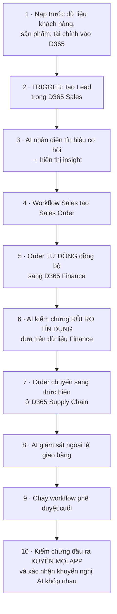

# Note 20 — Validate prompt, kịch bản E2E & sinh test case bằng Copilot

> [!summary] TL;DR
> Note kiểm thử phần hai. Ba khối:
> 1. **Validate prompt** — architect kiểm prompt **như thành phần hệ thống dùng lại được**, không phải chỉ dẫn một lần. **Sáu bước validation**, câu hỏi kiểm tra hay nhất: ⭐ ***"Hai người dùng khác nhau có hiểu prompt này giống nhau không?"***. **Năm metric chất lượng prompt** + **ba metric hành vi**. Hai phương pháp: **A/B prompt testing** và **scenario-based testing**.
> 2. **Kịch bản E2E xuyên nhiều app D365** — hai quy trình mẫu: **Order-to-Cash** (Sales → Finance → Customer Service) và **Case-to-Resolution** (Customer Service → Field Service). ⭐ **Phải kiểm thử TOÀN BỘ quy trình nghiệp vụ, không chỉ từng module**. Ba lớp validation: **functional · non-functional · outcome**.
> 3. **Sinh test case bằng Copilot** — **blueprint 8 trường** cho test case, mẫu prompt **4 phần** (Goal · Context · Constraints · Quality Expectations), và **4 tiêu chí rà kết quả**: **Completeness · Accuracy · Clarity · Maintainability**.
>
> ⭐⭐ **Câu nền của cả module kiểm thử:** *"Đầu ra AI mang tính XÁC SUẤT và có thể thay đổi tuỳ ngữ cảnh, dữ liệu và cách diễn đạt câu hỏi"* — đó là lý do kiểm thử phần mềm truyền thống (tất định) **không đủ**.
>
> Thuật ngữ: **A/B testing** = so hai biến thể trên cùng điều kiện để chọn cái tốt hơn. **Order-to-Cash** = quy trình từ đơn hàng tới thu tiền. **Precondition/postcondition** = trạng thái phải có trước / phải đạt sau khi chạy test. **Negative test** = test cố tình đưa đầu vào sai để xem hệ xử lý ra sao. **Regression trigger** = cơ chế tự kích hoạt sinh lại test khi yêu cầu thay đổi. **CI/CD** = tích hợp và triển khai liên tục.

---

## 1. Vì sao kiểm thử AI khác kiểm thử phần mềm thường ⭐⭐

> **Đầu ra AI mang tính XÁC SUẤT (probabilistic) và có thể thay đổi tuỳ ngữ cảnh, dữ liệu và CÁCH DIỄN ĐẠT câu hỏi.**

Đây là câu trả lời cho câu hỏi nền của cả module, và là gốc rễ của mọi thực hành trong hai note kiểm thử:

| Phần mềm truyền thống | Giải pháp AI |
|---|---|
| **Tất định** — cùng đầu vào luôn cho cùng đầu ra | **Xác suất** — cùng đầu vào có thể cho đầu ra khác nhau |
| Tập đầu vào không hợp lệ **hữu hạn**, test biên là đủ | Đầu vào **vô hạn về cách diễn đạt**; phải test **nhiều cách nói cho cùng một ý** |
| Test một lần, pass là xong cho tới khi code đổi | ⚠️ **Code không đổi hành vi vẫn trôi** → phải đo lặp lại theo thời gian |
| Đúng/sai rõ ràng | **Chất lượng có mức độ** → cần ngưỡng có dung sai (accuracy ≥ 90%…) |

> 💡 Ba hệ quả này giải thích ba thực hành đã gặp: **"validate AI using multiple phrasing variations"** (§2.7 dưới đây), **model drift monitoring** ([[18-Metrics-Telemetry-va-Tuning]]), và **bảng ngưỡng có dung sai** ([[19-Testing-Quy-trinh-Metrics-va-Validation]]).

---

## 2. Validate best practice cho Copilot prompt (U3)

### 2.1. Prompt hiệu quả phải đạt 5 điều

Validation xác định prompt có: **rõ ràng và không mơ hồ** · **có ngữ cảnh và được grounding** · **có cấu trúc để đầu ra dự đoán được** · **an toàn và khớp guardrail của tổ chức** · ⭐ **phù hợp để DÙNG LẠI Ở QUY MÔ LỚN** (suitable for repeated use at scale).

**Bốn thành phần cốt lõi phải validate:**

| Thành phần | Nội dung |
|---|---|
| **Goal** | **Kết quả hoặc phép biến đổi mong muốn** |
| **Context** | **Thông tin nền, nguồn dữ liệu, hoặc khung theo vai trò** |
| **Instructions** | **Định dạng, giọng điệu, cấu trúc, ràng buộc** |
| **Examples** | ⭐ **CHỈ khi chúng làm rõ thêm, không phải làm rối** (add clarity, not clutter) |

> 💡 So với **Prompt Coach 5 mục** ở [[12-Copilot-Studio-Topics-Agent-Flows-Prompt-Actions]] (Goal · Context · Instructions/Rules · Examples · Output Format): bốn thành phần ở đây là **cùng bộ khung**, gom *Output Format* vào *Instructions*. Prompt Coach dùng để **viết**, khung này dùng để **thẩm định**.

### 2.2. Sáu bước validation prompt ⭐⭐

> Câu định vị vai trò: architect validate prompt **không như chỉ dẫn dùng một lần, mà như THÀNH PHẦN HỆ THỐNG LẶP LẠI ĐƯỢC trong workflow doanh nghiệp**.

| # | Bước | Nội dung |
|---|---|---|
| 1 | **Define outcome expectations** | **Copilot phải tạo ra cái gì? "Tốt" trông như thế nào?** |
| 2 | **Check clarity and specificity** | ⭐ Câu hỏi kiểm tra vàng: ***"Would two different users interpret this the same way?"*** — *hai người dùng khác nhau có hiểu giống nhau không?* |
| 3 | **Assess grounding** | **Copilot có được chỉ rõ tới nguồn, lĩnh vực hoặc tệp liên quan không?** |
| 4 | **Validate constraints** | **Giọng điệu, độ dài, định dạng, phần loại trừ, vai trò, đối tượng** |
| 5 | **Evaluate for safety** | **Prompt có thể VÔ TÌNH kích hoạt hành động nhạy cảm hoặc bị hạn chế không?** |
| 6 | **Run multi-scenario testing** | **Kiểm chứng chất lượng prompt qua NHIỀU CÁCH DIỄN ĐẠT và NHIỀU LOẠI NGƯỜI DÙNG** |

`★ Insight ─────────────────────────────────────`
Bước 2 — ***"hai người dùng khác nhau có hiểu prompt này giống nhau không?"*** — là công cụ kiểm tra tốt nhất trong cả note, vì nó **chuyển một phán đoán chủ quan thành một phép thử làm được**.

"Prompt này có rõ không?" là câu hỏi mà người viết prompt luôn tự trả lời "có" — họ biết mình định nói gì. Nhưng "hai người khác nhau có hiểu giống nhau không?" thì **kiểm chứng được bằng cách đưa cho hai người thật đọc**, và nó phơi ra đúng loại mơ hồ mà tác giả mù quáng với nó.

Chi tiết đáng nhớ thứ hai nằm ở bước 5: **"prompt có thể VÔ TÌNH kích hoạt hành động nhạy cảm không"**. Đây khác với safety testing ở [[19-Testing-Quy-trinh-Metrics-va-Validation]], nơi bạn **cố ý** đẩy agent vượt rào. Ở đây rủi ro là một prompt **hoàn toàn thiện chí** lại được diễn giải theo hướng chạm vào dữ liệu hoặc hành động bị hạn chế — ví dụ *"tổng hợp toàn bộ thông tin về khách hàng này"* nghe vô hại nhưng có thể kéo cả trường nhạy cảm vào đầu ra. Hai loại rủi ro cần hai loại test khác nhau.
`─────────────────────────────────────────────────`

### 2.3. Metric đánh giá prompt

**Năm metric chất lượng prompt:**

| Metric | Đo gì |
|---|---|
| **Accuracy** | **Đầu ra đúng và khớp ý định người dùng** |
| **Consistency** | ⭐ **Chất lượng đáng tin cậy qua các LẦN CHẠY LẶP LẠI** |
| **Relevance** | **Thông tin tập trung vào tác vụ dự định** |
| **Format Compliance** | **Đầu ra theo đúng cấu trúc yêu cầu** |
| **Tone Alignment** | **Khớp chuẩn của tổ chức hoặc của đối tượng đọc** |

**Ba metric hành vi** — đo gián tiếp qua **công sức người dùng phải bỏ thêm**:
1. **Giảm số lần người dùng phải ra prompt lại** (re-prompts)
2. **Giảm yêu cầu làm rõ** (clarification requests)
3. **Ít trường hợp thông tin sai hoặc đầu ra không liên quan hơn**

> ⭐ **Consistency** là metric đặc thù của AI: với phần mềm thường không ai đo "chạy lại có ra cùng kết quả không" vì điều đó hiển nhiên. Với prompt thì đó là **phép thử bắt buộc** — chạy cùng prompt nhiều lần và xem chất lượng có ổn định không.

### 2.4. Sáu best practice viết prompt cấp doanh nghiệp

| # | Best practice |
|---|---|
| 1 | ⭐ **Bắt đầu bằng goal + context + constraints, THEO ĐÚNG THỨ TỰ ĐÓ** |
| 2 | **Dùng động từ hành động** (summarize, analyze, rewrite, evaluate) |
| 3 | **Dùng chỉ dẫn có cấu trúc** (danh sách bullet, bước đánh số, định dạng kỳ vọng) |
| 4 | **Tránh dài dòng không cần thiết hoặc prompt đa nhiệm gây rối cho model** |
| 5 | **Thêm "những gì KHÔNG được đưa vào"** khi cần loại trừ cho rõ |
| 6 | **Giữ ví dụ ngắn gọn và đúng trọng tâm** |

### 2.5. Mẫu prompt chất lượng cao ⭐

Ví dụ nguyên văn của giáo trình — đáng nhớ vì nó minh hoạ đủ **năm phần**, gồm cả phần **Exclude**:

| Element | Content |
|---|---|
| **Goal** | Tóm tắt xu hướng hiệu quả kinh doanh theo quý |
| **Context** | **Dùng báo cáo điều hành Q2 đính kèm; tập trung vào doanh thu, biên lợi nhuận và rủi ro** |
| **Instructions** | **Tóm tắt ngắn (120–160 từ)** · **giọng chuyên nghiệp cho bản tin điều hành** |
| **Include** | **3 gạch đầu dòng nêu các vùng rủi ro** |
| **Exclude** | **Chi tiết chiến dịch marketing; trích dẫn khách hàng** |

> ⭐ Chú ý **độ dài được nêu bằng KHOẢNG (120–160 từ)** chứ không phải một con số, và **Exclude được tách thành mục riêng**. Cả hai đều là cách biến yêu cầu mơ hồ thành ràng buộc kiểm chứng được.

### 2.6. Hai phương pháp validation

| Phương pháp | Cách làm |
|---|---|
| **A/B prompt testing** | Dùng **hai biến thể của cùng một prompt** và so: **độ chính xác đầu ra · độ rõ · độ liên quan · số bước/prompt phải hỏi tiếp** |
| **Scenario-based testing** | Test prompt qua nhiều: **loại người dùng** (*analyst mới ↔ architect kỳ cựu*) · **bối cảnh nghiệp vụ** · **mức phức tạp của tác vụ** |

### 2.7. Checklist đánh giá 7 mục & 5 kỹ thuật tinh chỉnh

**Checklist:**
1. **Mục tiêu được định nghĩa rõ**
2. **Ngữ cảnh đầy đủ**
3. **Định dạng và giọng điệu được nêu**
4. **Không có ngôn ngữ mơ hồ**
5. **Đạt kỳ vọng về an toàn/guardrail**
6. **Cho đầu ra nhất quán**
7. **Phù hợp để tái sử dụng ở quy mô doanh nghiệp**

**Năm kỹ thuật tinh chỉnh:**
1. **Chia prompt dài thành các chỉ dẫn mô-đun**
2. **Bổ sung ràng buộc còn thiếu được phát hiện trong lúc test**
3. **Bỏ chi tiết thừa gây nhiễu**
4. ⭐ **Nhờ chính Copilot đề xuất cải thiện** — *"How can this prompt be clearer?"*
5. **Kiểm chứng với đội liên chức năng trước khi phê duyệt**

---

## 3. Kịch bản test E2E xuyên nhiều app Dynamics 365 (U4)

### 3.1. Vì sao cần E2E

**Hai quy trình xuyên app điển hình:**

| Quy trình | Chuỗi app |
|---|---|
| **Order-to-Cash** | **D365 Sales → D365 Finance → D365 Customer Service** |
| **Case-to-Resolution** | **D365 Customer Service → D365 Field Service** |

> ⚠️ **Kiểm thử phải kiểm chứng TOÀN BỘ quy trình nghiệp vụ, không chỉ từng module riêng lẻ.**

**Bốn lý do E2E quan trọng:**
1. **Quyết định của AI phụ thuộc dữ liệu nằm ở nhiều app**
2. **Điều phối workflow có thể gãy khi MỘT app thay đổi**
3. **Dữ liệu có thể bị trùng lặp, đồng bộ hoặc biến đổi khác nhau ở các hệ thống**
4. ⭐ **Chất lượng đầu ra AI phụ thuộc nặng vào dữ liệu đầu vào NHẤT QUÁN, ĐÁNG TIN CẬY và ĐÚNG THỜI ĐIỂM**

> ⭐ Lý do 4 là đáp án một câu quiz của module: *"vì sao kịch bản E2E phải kiểm chứng luồng dữ liệu xuyên app?"* → vì **chất lượng đầu ra AI phụ thuộc dữ liệu nhất quán, đáng tin và đúng thời điểm từ các hệ thống tích hợp**. Chú ý cụm **"well-timed"** — không chỉ đúng mà còn phải **kịp**; dữ liệu đúng nhưng đến muộn vẫn làm AI quyết định sai.

### 3.2. Thiết kế kịch bản E2E

**Bốn thành phần định nghĩa business scenario:** **sự kiện kích hoạt (trigger event)** · **chuỗi tương tác giữa các app D365** · **kết quả kỳ vọng ở TỪNG giai đoạn** · **tín hiệu phản hồi hoặc hành động của AI**.

**Năm nhóm điểm tích hợp phải test:**

| Nhóm | Nội dung |
|---|---|
| **Data sync across entities** | **Accounts, Orders, Cases, Journals** |
| **AI predictions/insights phụ thuộc dữ liệu đa app** | |
| **Automations** | **Power Automate, custom plugin, trigger theo sự kiện** |
| **Connectors tới hệ thống ngoài** | **ERP, CRM, data lake** |
| **Security roles, privileges và thực thi ranh giới dữ liệu** | |

**Checklist sẵn sàng xuyên app — 4 mục:**
1. **Xác nhận ánh xạ thực thể (entity mapping) đúng**
2. **Kiểm chứng thời điểm làm mới dữ liệu và độ trễ**
3. **Xác minh phụ thuộc quy trình nghiệp vụ giữa các app**
4. **Bảo đảm AI dùng ĐÚNG nguồn dữ liệu grounding**

### 3.3. Cấu trúc một test E2E — 6 phần

| # | Phần | Nội dung |
|---|---|---|
| 1 | **Preconditions** | **Chuẩn bị dữ liệu, môi trường sẵn sàng** |
| 2 | **Step-by-step execution** | Trình tự thực hiện |
| 3 | **AI action hoặc prediction được kích hoạt** | |
| 4 | **Cross-app data movement** | Dữ liệu di chuyển giữa các app |
| 5 | **Post-condition validation** | Kiểm chứng trạng thái sau |
| 6 | ⭐ **Exception paths và negative tests** | **Đường ngoại lệ và test tiêu cực** |

### 3.4. Kịch bản E2E mẫu — 10 bước ⭐

> ⭐ Kịch bản này chạm **bốn app D365** (Sales → Finance → Supply Chain, và quay lại kiểm chứng chéo) với **ba lần AI can thiệp** ở các vai khác nhau: **nhận diện cơ hội** (bước 3), **đánh giá rủi ro** (bước 6), **giám sát ngoại lệ** (bước 8). Đây là ví dụ cụ thể cho **multi-system orchestration** đã học ở [[16-Orchestrate-Prebuilt-Agents-va-Apps]].

### 3.5. Ba lớp validation ⭐⭐

| Lớp | Kiểm gì |
|---|---|
| **Functional validation** | **Hành động AI được kích hoạt đúng** · **dữ liệu lấy từ ĐÚNG app D365** · **workflow tuần tự chạy không đứt** |
| **Non-functional validation** | **Latency xuyên các app** · **xử lý lỗi và phục hồi sau thất bại** · ⭐ **tính NHẤT QUÁN của các khuyến nghị AI** |
| **Outcome validation** | **Độ liên quan của đầu ra AI** · **chấm điểm quyết định đúng** · **độ chính xác của tóm tắt/insight** · **cải thiện thời gian hoàn tất tác vụ** |

> ⭐ Chú ý **"consistency of AI recommendations" nằm ở lớp NON-FUNCTIONAL**, không phải outcome. Nghĩa là: khuyến nghị AI đúng hay sai thuộc *outcome*; còn **có ổn định giữa các lần chạy hay không** là một thuộc tính **phi chức năng**, xếp cùng nhóm với latency và error handling. Đây là hệ quả trực tiếp của tính **xác suất** ở §1.

### 3.6. Bảy best practice thiết kế test E2E

| # | Best practice |
|---|---|
| 1 | **Test các quy trình nghiệp vụ THỰC TẾ, giá trị cao** |
| 2 | ⭐ **Kiểm chứng AI bằng NHIỀU BIẾN THỂ CÁCH DIỄN ĐẠT** |
| 3 | **Bao gồm cả kịch bản dữ liệu có cấu trúc và phi cấu trúc** |
| 4 | **Test ở tải bình thường VÀ điều kiện stress** |
| 5 | **Đưa vào đường ngoại lệ và ràng buộc pháp lý** |
| 6 | **Tài liệu hoá mọi test case bằng template lặp lại được** |
| 7 | **Thiết kế hướng tới tính nhất quán và lặp lại được** |

---

## 4. Chiến lược sinh test case bằng Copilot (U5)

### 4.1. Copilot làm được gì và vai trò của architect

**Bốn việc Copilot tăng tốc:** **dịch yêu cầu hoặc code thành kịch bản kiểm thử có cấu trúc** · ⭐ **nhận diện EDGE CASE dễ bị bỏ sót** · **đề xuất biến thể dữ liệu test** · **giữ tính nhất quán khi hệ thống tiến hoá**.

> ⭐⭐ Câu định vị vai trò rất quan trọng: **"Solution architects must design the strategy AROUND Copilot — not just use Copilot reactively."** — architect **thiết kế chiến lược quanh Copilot**, chứ không dùng Copilot một cách bị động. Cụ thể là định nghĩa trước: **prompt, tiêu chí validation, yêu cầu governance, và ngưỡng chất lượng** cho test case được sinh ra.

### 4.2. Xác lập mục tiêu kiểm thử trước khi dùng Copilot

**Bốn câu hỏi phải trả lời trước:**
1. **Những loại test nào quan trọng?** (unit, integration, regression, scenario-based)
2. **Quy tắc và ràng buộc nghiệp vụ nào phải được kiểm chứng?**
3. **Rủi ro nào cần được giảm thiểu bằng kiểm thử?**
4. **Yêu cầu tuân thủ hoặc audit nào áp dụng?**

> Khi mục tiêu rõ, Copilot **mới có thể được chỉ dẫn để sinh kịch bản test khớp mục tiêu**.

### 4.3. Blueprint test case — 8 trường ⭐⭐

> **Copilot làm tốt nhất khi đi theo mẫu nhất quán.** Đưa template này vào prompt bảo đảm Copilot **cho đầu ra dự đoán được, chất lượng cao**.

| Field | Description | Example |
|---|---|---|
| **Test ID** | Định danh duy nhất | **`TC-001-FIN-Q1`** |
| **Purpose / Description** | Test kiểm chứng điều gì | Xác minh tóm tắt doanh thu quý trích xuất đúng các chỉ số chính |
| **Preconditions** | Thiết lập bắt buộc | **Báo cáo tài chính Q1 đã tải lên; agent đã cấu hình quyền finance** |
| **Inputs / Parameters** | Dữ liệu test cung cấp | *"Summarize Q1 revenue trends from attached report"* |
| **Steps** | Trình tự thực hiện | 1. Tải báo cáo Q1 → 2. Gửi prompt → 3. Rà đầu ra |
| **Expected Results** | Tiêu chí thành công | **Tóm tắt chứa % tăng trưởng doanh thu, top 3 rủi ro, < 150 từ, giọng chuyên nghiệp** |
| **Edge Case Variations** | Điều kiện biên | ⭐ **Báo cáo rỗng; PDF hỏng; thiếu phần doanh thu** |
| **Dependencies** | Yêu cầu bên ngoài | **Knowledge base finance; connector phân tích PDF; schema báo cáo điều hành** |

`★ Insight ─────────────────────────────────────`
Hai trường trong blueprint này **không có trong test case phần mềm truyền thống**, và chúng chính là chỗ template được thiết kế riêng cho AI.

**Expected Results** không phải một giá trị mà là **một tập ràng buộc nhiều chiều**: *có % tăng trưởng · có top 3 rủi ro · dưới 150 từ · giọng chuyên nghiệp*. Bốn ràng buộc thuộc bốn loại khác nhau — **nội dung bắt buộc, số lượng, độ dài, và giọng điệu**. Không có phép so sánh `==` nào chấm được cả bốn; phải chấm từng chiều. Đây chính là hệ quả của tính **xác suất**: bạn không kiểm "đầu ra bằng X" mà kiểm "đầu ra thoả các điều kiện".

**Edge Case Variations** ở đây là **các dạng hỏng của ĐẦU VÀO** — báo cáo rỗng, PDF hỏng, thiếu phần doanh thu — chứ không phải giá trị biên kiểu `0, -1, MAX_INT`. Với agent, "biên" nghĩa là **dữ liệu nguồn không như kỳ vọng**, và câu hỏi test là *"agent làm gì khi tài liệu grounding không có thứ nó cần?"* — nó nói không biết, hay nó bịa? Đó chính là phép thử **groundedness** ở [[17-Khung-Giam-sat-va-Cong-cu]], đưa xuống mức một test case cụ thể.
`─────────────────────────────────────────────────`

### 4.4. Mẫu prompt chuẩn để sinh test case — 4 phần

| Phần | Nội dung | Ví dụ |
|---|---|---|
| **Goal** | **Bạn muốn Copilot tạo ra gì** | *"Generate 10 unit tests validating logic for…"* |
| **Context** | **Quy tắc nghiệp vụ, đoạn code, workflow, mô tả hành vi hệ thống** | |
| **Constraints** | **Định dạng, giọng, độ sâu bao phủ, độ chi tiết của test** | |
| **Quality Expectations** | ⭐ **Định nghĩa "tốt" nghĩa là gì** | *"Include at least two negative tests per scenario"* — **ít nhất 2 negative test cho mỗi kịch bản** |

### 4.5. Bốn tiêu chí rà test case do Copilot sinh ⭐⭐

> Architect **bắt buộc phải rà lại** — Copilot sinh nhanh nhưng không tự bảo đảm đúng.

| Tiêu chí | Kiểm gì |
|---|---|
| **Completeness** | **Mọi tiêu chí chấp nhận đã được phủ** · **các workflow chính đã có mặt** · **điều kiện biên và thất bại đã được đưa vào** |
| **Accuracy** | **Logic khớp quy tắc nghiệp vụ** · **precondition và dependency hợp lệ** |
| **Clarity** | **Các bước hành động được và không mơ hồ** · **kết quả kỳ vọng ĐO ĐƯỢC** |
| **Maintainability** | **Test case tái sử dụng được qua các phiên bản** · **quy ước đặt tên và định dạng nhất quán** |

### 4.6. Bốn cách mở rộng quy mô

| # | Cách | Nội dung |
|---|---|---|
| 1 | **Duy trì prompt library tái sử dụng** cho các kịch bản kiểm thử khác nhau | → nối [[06-Nguon-tri-thuc-Prompt-Library-va-SLM]] |
| 2 | **Đưa prompt và test template vào version control** | |
| 3 | **Tích hợp đầu ra Copilot vào workflow CI/CD** | → nối [[../../../06-DevOps/00-MOC-DevOps]] |
| 4 | ⭐ **Dùng regression trigger để yêu cầu Copilot sinh test cập nhật KHI YÊU CẦU THAY ĐỔI** | |

> ⭐ Cách **4** khép vòng: yêu cầu đổi → tự động kích hoạt sinh lại test → phát hiện regression sớm. Đây là chỗ chiến lược test bằng Copilot chuyển từ *"nhờ AI viết test hộ"* thành **một phần của hệ thống ALM** — xem [[21-ALM-cho-Du-lieu-va-Copilot-Studio]].

---

## Câu hỏi phỏng vấn

> [!question] Vì sao kiểm thử phần mềm truyền thống không đủ cho giải pháp AI?
> Vì **đầu ra AI mang tính xác suất và có thể thay đổi tuỳ ngữ cảnh, dữ liệu và cách diễn đạt câu hỏi** — trong khi phần mềm truyền thống là **tất định**: cùng đầu vào luôn cho cùng đầu ra. Ba hệ quả thực hành: (1) phải **test nhiều biến thể cách diễn đạt** cho cùng một ý, vì tập đầu vào là vô hạn về mặt ngôn ngữ; (2) phải **đo lặp lại theo thời gian**, vì code không đổi mà hành vi vẫn trôi (model drift); (3) ngưỡng thành công phải **có dung sai** (accuracy ≥ 90%, incorrect info ≤ 3%) thay vì đúng/sai tuyệt đối. Hệ quả thứ tư ở cấp thiết kế test: **"consistency" trở thành một metric phải đo** — điều không ai kiểm với phần mềm thường vì nó hiển nhiên.

> [!question] Câu hỏi tốt nhất để kiểm tra độ rõ của một prompt là gì?
> ***"Hai người dùng khác nhau có hiểu prompt này giống nhau không?"*** — bước 2 trong sáu bước validation. Nó mạnh vì **biến một phán đoán chủ quan thành phép thử làm được**: "prompt này có rõ không" là câu mà tác giả luôn tự trả lời "có" vì họ biết mình định nói gì, còn câu hỏi kia **kiểm chứng được bằng cách đưa cho hai người thật đọc** và phơi ra đúng loại mơ hồ mà tác giả mù quáng với nó. Năm bước còn lại: **định nghĩa kỳ vọng đầu ra** ("tốt" trông thế nào), **đánh giá grounding**, **kiểm ràng buộc** (tone/độ dài/định dạng/loại trừ/vai trò/đối tượng), **đánh giá an toàn**, và **test đa kịch bản** qua nhiều cách diễn đạt và nhiều loại người dùng.

> [!question] Đánh giá an toàn khi validate prompt khác gì safety testing của agent?
> Khác ở **chiều của rủi ro**. Safety testing của agent là **đối kháng**: bạn cố ý đưa chỉ dẫn bị cấm để xem agent có **từ chối** không (*rejection of disallowed instructions*). Còn đánh giá an toàn của prompt hỏi: **prompt này có thể VÔ TÌNH kích hoạt hành động nhạy cảm hoặc bị hạn chế không?** — rủi ro đến từ một prompt **hoàn toàn thiện chí** nhưng được diễn giải rộng hơn dự định. Ví dụ *"tổng hợp toàn bộ thông tin về khách hàng này"* nghe vô hại nhưng có thể kéo cả trường nhạy cảm vào đầu ra. Hai loại rủi ro cần hai loại test: một loại kiểm **rào chắn có giữ khi bị đẩy**, một loại kiểm **prompt có tự đẩy mình qua rào mà không biết**.

> [!question] Vì sao kịch bản E2E phải kiểm chứng luồng dữ liệu xuyên nhiều app D365?
> Vì **chất lượng đầu ra AI phụ thuộc nặng vào dữ liệu đầu vào nhất quán, đáng tin cậy và ĐÚNG THỜI ĐIỂM từ các hệ thống tích hợp**. Cụm *"well-timed"* quan trọng: dữ liệu đúng nhưng đến muộn vẫn khiến AI quyết định sai — ví dụ AI đánh giá rủi ro tín dụng dựa trên dữ liệu Finance chưa kịp đồng bộ. Ba lý do kèm theo: quyết định AI **phụ thuộc dữ liệu nằm ở nhiều app**; điều phối workflow **có thể gãy khi một app thay đổi**; dữ liệu có thể bị **trùng lặp, đồng bộ hoặc biến đổi khác nhau** giữa các hệ. Nguyên tắc chốt: **kiểm thử toàn bộ quy trình nghiệp vụ, không chỉ từng module**. Hai quy trình mẫu: **Order-to-Cash** (Sales → Finance → Customer Service) và **Case-to-Resolution** (Customer Service → Field Service).

> [!question] Trong ba lớp validation của test E2E, "tính nhất quán của khuyến nghị AI" thuộc lớp nào và vì sao?
> Thuộc **non-functional validation**, cùng nhóm với **latency xuyên app** và **xử lý lỗi/phục hồi**. Điều này thoạt nghe lạ — khuyến nghị AI nghe như chuyện *outcome*. Nhưng phân biệt thế này: **khuyến nghị đúng hay sai** là *outcome validation* (cùng với độ liên quan, chấm điểm quyết định, độ chính xác tóm tắt); còn **có ổn định giữa các lần chạy hay không** là **thuộc tính phi chức năng của hệ thống**, giống như "có nhanh không", "có phục hồi được không". Đây là hệ quả trực tiếp của tính xác suất: với hệ tất định, consistency không phải thứ phải kiểm; với hệ AI, nó là một chiều chất lượng riêng.

> [!question] Bạn dùng Copilot để sinh test case. Làm sao đảm bảo chất lượng?
> Bốn việc, theo đúng thứ tự. **Trước khi sinh**: xác lập **mục tiêu kiểm thử** (loại test nào quan trọng, quy tắc nghiệp vụ nào phải kiểm, rủi ro nào phải giảm, yêu cầu tuân thủ/audit nào áp dụng) — nếu không rõ thì Copilot không thể sinh đúng hướng. **Khi sinh**: đưa **blueprint 8 trường** vào prompt (Test ID, Purpose, Preconditions, Inputs, Steps, Expected Results, **Edge Case Variations**, Dependencies) và dùng mẫu prompt **4 phần** — Goal, Context, Constraints, và đặc biệt **Quality Expectations** định nghĩa "tốt" nghĩa là gì (*"ít nhất 2 negative test mỗi kịch bản"*). **Sau khi sinh**: rà theo **4 tiêu chí** — **Completeness** (phủ hết acceptance criteria, workflow chính, điều kiện biên và thất bại), **Accuracy** (logic khớp business rule, precondition hợp lệ), **Clarity** (bước hành động được, kết quả **đo được**), **Maintainability** (tái sử dụng qua các phiên bản, đặt tên nhất quán). **Về lâu dài**: prompt library tái sử dụng, **version control cho prompt và template**, tích hợp vào **CI/CD**, và **regression trigger** để tự sinh lại test khi yêu cầu thay đổi. Nguyên tắc bao trùm: **thiết kế chiến lược QUANH Copilot, không dùng Copilot bị động**.

---

## Tự kiểm tra

1. Câu nền: vì sao kiểm thử truyền thống **không đủ** cho AI? Bốn khác biệt so với phần mềm tất định?
2. Prompt hiệu quả phải đạt **5 điều** gì? **Bốn thành phần** phải validate — lưu ý gì về *Examples*?
3. **Sáu bước** validation prompt? Câu hỏi kiểm tra "vàng" ở bước 2?
4. Bước **đánh giá an toàn** của prompt khác safety testing của agent thế nào?
5. **Năm metric chất lượng** prompt? **Ba metric hành vi** đo gián tiếp qua cái gì?
6. Vì sao **Consistency** là metric đặc thù của AI?
7. **Sáu best practice** viết prompt — thứ tự ba phần mở đầu là gì?
8. Mẫu prompt chất lượng cao: **5 element** nào? Hai chi tiết đáng học về cách nêu độ dài và loại trừ?
9. **Hai phương pháp** validation prompt? A/B test so **bốn** thứ gì?
10. **Checklist 7 mục** và **5 kỹ thuật tinh chỉnh** — kỹ thuật nào dùng chính Copilot?
11. Hai quy trình xuyên app điển hình và chuỗi app của từng cái?
12. **Bốn lý do** E2E quan trọng? Lý do nào là đáp án quiz và cụm từ khoá nào dễ bỏ sót?
13. **Bốn thành phần** định nghĩa business scenario? **Năm nhóm** điểm tích hợp phải test?
14. **Checklist sẵn sàng xuyên app** 4 mục?
15. **Sáu phần** của cấu trúc test E2E?
16. Kịch bản mẫu 10 bước: chạm mấy app D365, và AI can thiệp ở **ba** vai nào?
17. **Ba lớp validation** E2E? "Consistency of AI recommendations" thuộc lớp nào và vì sao?
18. **Bảy best practice** thiết kế test E2E?
19. **Bốn việc** Copilot tăng tốc? Câu định vị vai trò của architect với Copilot?
20. **Bốn câu hỏi** phải trả lời trước khi dùng Copilot sinh test?
21. **Blueprint 8 trường** của test case? Hai trường nào đặc thù cho AI và vì sao?
22. Mẫu prompt sinh test case **4 phần** — ví dụ của *Quality Expectations*?
23. **Bốn tiêu chí** rà test case do Copilot sinh?
24. **Bốn cách** mở rộng quy mô? Cách nào khép vòng với ALM?

## Liên quan
- [[00-MOC-AB100]] — MOC bộ AB-100
- [[19-Testing-Quy-trinh-Metrics-va-Validation]] — note trước: khung test, 4 loại test, ngưỡng validation custom model
- [[21-ALM-cho-Du-lieu-va-Copilot-Studio]] — note sau: ALM cho dữ liệu & Copilot Studio
- [[12-Copilot-Studio-Topics-Agent-Flows-Prompt-Actions]] — Prompt Coach 5 mục, bản để **viết** prompt
- [[06-Nguon-tri-thuc-Prompt-Library-va-SLM]] — prompt library & 7 trường metadata governance
- [[16-Orchestrate-Prebuilt-Agents-va-Apps]] — multi-system orchestration mà E2E test kiểm chứng
- [[17-Khung-Giam-sat-va-Cong-cu]] — groundedness; edge case "thiếu dữ liệu" là phép thử groundedness cụ thể
- [[18-Metrics-Telemetry-va-Tuning]] — regression & drift sau khi phát hành
- [[../../../06-DevOps/00-MOC-DevOps]] — tích hợp test vào CI/CD
- [[../../../00-Foundations/07-GitHub-Copilot/00-MOC-GH300]] — sinh unit test bằng Copilot, góc lập trình
