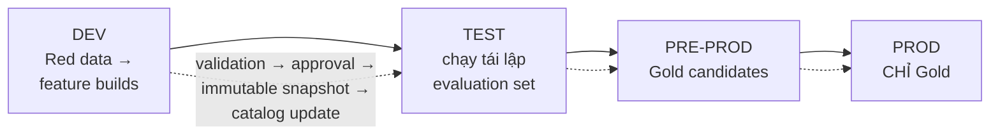
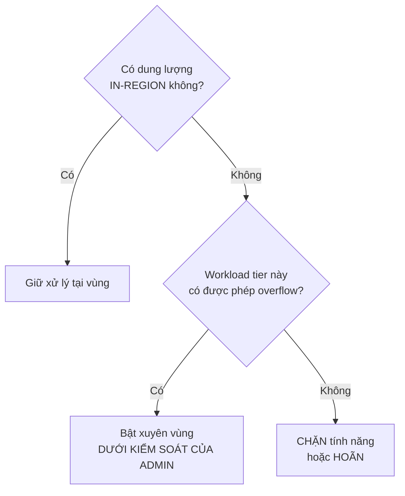
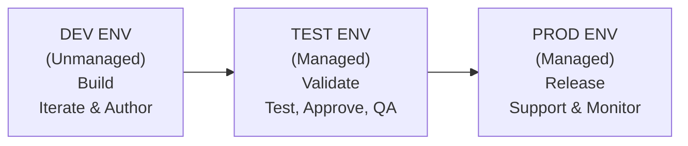
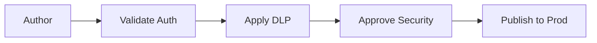

# Note 21 — ALM cho dữ liệu AI & cho Copilot Studio

> [!summary] TL;DR
> Hai khối:
> 1. **ALM cho DỮ LIỆU** — điểm đắt giá nhất: **coi dữ liệu là ARTIFACT có phiên bản và promote được**, gồm **6 loại**: *dataset huấn luyện · dataset đánh giá & "golden set" · tri thức grounding · tài sản prompt · policy & guardrail · telemetry vận hành*. Bốn môi trường **Dev → Test → Pre-Prod → Prod** với **mẫu red/gold dataset** (red = biến đổi được, thử nghiệm; gold = đóng băng, đã promote). Vòng đời **7 pha A–G** với **5 promotion gate** đòi **bằng chứng** cụ thể.
> 2. **ALM cho Copilot Studio** — tối thiểu **3 môi trường Dev/Test/Prod**; bốn nguyên tắc: ⭐ **KHÔNG sửa trực tiếp trên production · RBAC từng tầng · CHỈ managed solution ở Test và Prod · dùng solution layering để cô lập thay đổi**. Ba vòng đời riêng cho **agent · connector · action**.
>
> ⭐ Quy tắc vàng của cả note: **"never train on production knowledge"** và **"no direct editing in production"** — hai hàng rào bảo vệ ranh giới môi trường.
>
> Thuật ngữ: **ALM** (Application Lifecycle Management) = quản lý vòng đời ứng dụng, từ khi sinh ra tới khi khai tử. **Lineage** = dấu vết nguồn gốc và biến đổi của dữ liệu. **Promotion gate** = cổng phê duyệt trước khi đẩy sang môi trường cao hơn. **Managed solution** = gói giải pháp đã đóng, không sửa trực tiếp được ở môi trường đích. **Solution layering** = xếp lớp giải pháp để thay đổi chồng lên nhau mà không ghi đè. **Canary** = phát hành cho một nhóm nhỏ trước để phát hiện lỗi. **CAB** (Change Advisory Board) = hội đồng duyệt thay đổi. **HITL** = human-in-the-loop. **Circuit breaker** = cơ chế tự ngắt khi phát hiện bất thường. **p95** = phân vị 95.

---

## 1. ALM cho dữ liệu dùng trong model & agent (U1)

### 1.1. "Dữ liệu" trong AI ALM gồm những gì ⭐⭐

> **Coi 6 nhóm sau là ARTIFACT có phiên bản và promote được** (versioned, promotable ALM artifacts):

| # | Nhóm artifact | Chi tiết |
|---|---|---|
| 1 | **Training & fine-tuning datasets** | **Raw · curated · feature/embedding sets** |
| 2 | **Evaluation/Testing datasets** | Và ⭐ **"golden set" dùng cho regression testing** |
| 3 | **Grounding knowledge** | **Corpus SharePoint/OneDrive · bảng Dataverse · wiki · knowledge base** |
| 4 | **Prompt assets** | **System prompt · prompt action · template** |
| 5 | **Policies & guardrails** | **DLP · sensitivity label · connector được phép · giới hạn action** |
| 6 | **Run telemetry** | **Latency · token/cost · success/failure · sự kiện an toàn** và **feedback** |

`★ Insight ─────────────────────────────────────`
Danh sách này là **luận điểm trung tâm của cả module ALM**, và nó mở rộng khái niệm "artifact" xa hơn nhiều so với ALM phần mềm truyền thống.

Với phần mềm thường, artifact được version là **code**. Ở đây, **prompt được version như code** (nhóm 4), **policy được version như code** (nhóm 5), và — đáng ngạc nhiên nhất — **telemetry cũng là artifact được quản lý** (nhóm 6). Vì sao telemetry? Vì nếu không giữ telemetry theo từng phiên bản thì **không thể so sánh bản mới với bản cũ**, tức không phát hiện được **regression**. Nó là *bằng chứng* của một lần phát hành, không chỉ là log rác.

Nhóm 2 — **golden set** — là mắt xích khiến toàn bộ hệ này chạy được. Vì đầu ra AI mang tính **xác suất** ([[20-Testing-Prompt-E2E-va-Sinh-Test-Case]]), bạn không thể hỏi *"bản này có đúng không"* mà chỉ hỏi được *"bản này có tốt hơn bản trước trên cùng bộ đề không"*. Golden set chính là **bộ đề cố định** đó — và đó là lý do pha D bắt phải **đóng băng (freeze) gold dataset và ký chứng thực bất biến**: nếu bộ đề trôi thì mọi so sánh vô nghĩa.
`─────────────────────────────────────────────────`

### 1.2. Chiến lược môi trường & mẫu red/gold ⭐

**Bốn môi trường có data plane riêng: Dev → Test → Pre-Prod → Prod**, với ba yêu cầu:

| Yêu cầu | Nội dung |
|---|---|
| **Least privilege access** | ⭐ **Không dùng chung danh tính xuyên môi trường** (no crossing shared identity) |
| **Red / gold datasets pattern** | **Red** = **biến đổi được, thử nghiệm** ↔ **Gold** = **đóng băng, đã được promote** |
| **Promotion gates** | Đòi **bằng chứng**: **báo cáo chất lượng · kiểm tra thiên lệch · lineage · security signoff** |

> Mỗi lần chuyển môi trường đều đi qua **4 kiểm soát**: **validation → approval → immutable snapshot → catalog update**.

### 1.3. Bảy pha A–G của vòng đời dữ liệu AI ⭐⭐

| Pha | Tên | Việc làm | Gate ra |
|---|---|---|---|
| **A** | **Plan & Catalog** | **Xác định kịch bản nghiệp vụ và data contract** (mục đích, trường, thời hạn lưu, chủ sở hữu) · **phân loại độ nhạy cảm**, áp **sensitivity label**, đăng ký tài sản vào **catalog** · định nghĩa **KPI và thế trận rủi ro** (xử lý PII, ranh giới xuất dữ liệu, phạm vi audit) | **A→B:** data contract được duyệt; tài sản **khám phá được** kèm chủ sở hữu và tag |
| **B** | **Ingest & Prepare** | **Profile và khắc phục chất lượng** (thiếu dữ liệu, ngoại lai, mất cân bằng) · **sinh lineage**; **đóng dấu phiên bản schema và hash cho mỗi snapshot** · tạo **curated dataset và feature/embedding set bằng pipeline TẤT ĐỊNH** | **B→C:** báo cáo chất lượng và lineage; **nhật ký tái lập được ký** |
| **C** | **Develop & Evaluate** | ⭐ **Huấn luyện/lặp bằng dữ liệu Dev/Test — TUYỆT ĐỐI KHÔNG huấn luyện trên tri thức production** · chạy **bộ đánh giá** (accuracy, safety, robustness, cost) **trên golden set** · lưu **model/data card** kèm tham chiếu dataset và giới hạn ngữ cảnh | **C→D:** đạt ngưỡng đánh giá; đã xử lý phát hiện về rủi ro & an toàn |
| **D** | **Stage & Approve** | **Rà privacy, security, compliance** (DLP, RAI, kiểm soát xuất khẩu) · chạy **canary** bằng **dữ liệu đã che/đại diện giống Prod** · ⭐ **ĐÓNG BĂNG gold dataset và ký chứng thực bất biến** | **D→E:** **CAB phê duyệt**; runbook triển khai và **kế hoạch rollback** sẵn sàng |
| **E** | **Deploy & Serve** | **Promote gold corpora và index; làm mới semantic indexing / retrieval store** · **thực thi thiết lập region/residency và danh sách connector cho phép/cấm** · **đăng ký release vào data catalog** và **công bố consumer contract** | — |
| **F** | **Operate & Monitor** | **Theo dõi latency, cost/token, success rate, vi phạm an toàn, lần từ chối truy cập dữ liệu** · **phát hiện data drift so với baseline; kích hoạt hành động bảo vệ (circuit breaker, HITL)** · **chạy tái đánh giá theo lịch trên golden set; ghi backlog kèm trace ID** | — |
| **G** | **Evolve & Retire** | **Xoay vòng hoặc retrain trên gold set cập nhật; RETEST trước khi promote** · áp **chính sách lưu trữ & xoá** cho snapshot và transcript hết hạn · ⭐ **BẢO TỒN audit trail và lineage phục vụ tuân thủ** | — |

> ⭐ Pha **G** có một nghịch lý đáng nhớ: **xoá dữ liệu hết hạn NHƯNG giữ lại audit trail và lineage**. Nghĩa là bạn xoá *nội dung* nhưng giữ *dấu vết về việc nội dung đó từng tồn tại và được dùng thế nào* — đúng yêu cầu tuân thủ, và cũng chính là bài toán **"right to be forgotten"** đã bàn ở [[13-Grounding-Power-Apps-va-Well-Architected]].

### 1.4. Bảng kiểm tra tại 5 promotion gate ⭐⭐

| Gate | Control area | Câu hỏi phải trả lời | **Bằng chứng bắt buộc** |
|---|---|---|---|
| **A→B** | **Catalog & ownership** | **Chủ sở hữu có chịu trách nhiệm không? Độ nhạy cảm đã gắn nhãn chưa?** | **Data contract · bản ghi catalog · bằng chứng chính sách nhãn** |
| **B→C** | **Data quality & lineage** | **Dữ liệu đã được profile, cân bằng, khử định danh ở chỗ cần chưa?** | **Báo cáo profiling · đồ thị lineage · version ID** |
| **C→D** | **Evaluation & safety** | **Đánh giá có đạt ngưỡng không? Có mẫu thiên lệch hoặc không an toàn nào không?** | **Metrics pack · safety report · model/data card** |
| **D→E** | **Compliance & residency** | **Quy tắc vùng và chính sách DLP có cho phép dùng không?** | **Bản đồ residency · DLP rule · biên bản phê duyệt** |
| **E→F** | **Runtime readiness** | **Chúng ta có giám sát, rollback và giới hạn chi phí được không?** | **Dashboard · alarm · kế hoạch rollback · budget guard** |

> ⭐ Cột **"bằng chứng bắt buộc"** là điều khiến gate này khác một cuộc họp duyệt thông thường: **mỗi gate đòi hiện vật cụ thể**, không chấp nhận lời khẳng định miệng. Đây cũng là cách đề phân biệt câu trả lời tốt với câu trả lời chung chung.

### 1.5. Vùng, residency và di chuyển xuyên biên giới

**Ba nguyên tắc:**
1. **Tài liệu hoá nơi prompt/output CÓ THỂ được xử lý** cho tính năng Copilot và Power Platform, và **khi nào cần dung lượng xuyên vùng**
2. ⭐ **Trong kịch bản chịu quản lý: mặc định là IN-REGION, và phải phê duyệt tường minh mới bật xử lý tràn (overflow)**
3. **Căn vùng mailbox** (cho dữ liệu hoạt động) **và geo của môi trường theo chính sách**; định nghĩa **ngoại lệ và lịch purge**

### 1.6. RACI cho dữ liệu dùng trong model & agent ⭐

> Giáo trình lưu ý: đây là **mẫu đại diện**; architect phải **kiểm chứng và điều chỉnh** vai trò cho phù hợp dự án.

| Activity | Data Owner | AI Architect | Security/Compliance | Platform Admin | Product Owner |
|---|---|---|---|---|---|
| **Define data contract** | R | **A** | C | C | C |
| **Classify & label** | **A/R** | C | C | C | I |
| **Quality profiling & lineage** | R | **A** | C | I | I |
| **Evaluation thresholds** | C | **A/R** | C | I | C |
| **Residency configuration** | C | **A** | **R** | **R** | I |
| **Deployment & rollback** | I | **A** | C | **R** | **R** |
| **Monitoring & drift response** | C | **A** | C | **R** | **R** |
| **Retention & deletion** | **A/R** | C | C | I | I |

> ⭐ Đọc theo cột: **AI Architect giữ chữ A ở 6/8 hoạt động** — chịu trách nhiệm cuối cùng gần như toàn bộ vòng đời dữ liệu. Hai ngoại lệ đều thuộc **Data Owner**: **Classify & label** và **Retention & deletion** — tức *quyết định dữ liệu này nhạy cảm đến đâu* và *khi nào xoá nó* thuộc về **người sở hữu dữ liệu**, không phải kiến trúc sư. Đây là ranh giới trách nhiệm đề hay hỏi.
>
> So sánh với **RACI cho agent M365** ở [[16-Orchestrate-Prebuilt-Agents-va-Apps]] (nơi Product Owner giữ A ở 5/6 hàng): khác nhau vì **đối tượng quản trị khác nhau** — agent là *sản phẩm* nên Product Owner chịu trách nhiệm; dữ liệu là *nền kỹ thuật* nên AI Architect chịu trách nhiệm.

### 1.7. Telemetry vận hành & drift

**Ba việc:**
1. **Giữ metric baseline cho MỖI bản phát hành**: **latency p95 · success % · token/€ mỗi tác vụ · safety flag trên mỗi triệu lần chạy**
2. **So sánh live với baseline**; nếu **drift vượt ngưỡng** thì **tự động mở incident, định tuyến tới data owner, và TẠM DỪNG các action bị ảnh hưởng**
3. **Chạy lại bộ đánh giá hằng đêm/hằng tuần trên golden set**; **lưu chuỗi thời gian phục vụ audit**

### 1.8. Hai checklist runbook

**Go/No-Go trước production — 6 mục:**
- [ ] **Data contract được duyệt; tài sản đã gắn tag và khám phá được**
- [ ] **Sensitivity label/DLP rule đã áp; connector đã được phê duyệt**
- [ ] **Đồ thị lineage cập nhật; snapshot dataset bất biến và có phiên bản**
- [ ] **Đạt ngưỡng đánh giá; rủi ro an toàn đã được giảm thiểu**
- [ ] **Quyết định residency đã ghi lại; công tắc xuyên vùng đã được rà**
- [ ] **Dashboard, ngân sách, alert và rollback đã kiểm chứng ở Pre-Prod**

**Retirement — 3 mục:**
- [ ] **Thông báo cho bên tiêu thụ; thực hiện kế hoạch cutover**
- [ ] **Snapshot được lưu trữ/xoá theo chính sách; thu hồi quyền truy cập**
- [ ] **Bảo tồn audit và lineage; cập nhật catalog**

---

## 2. ALM cho Copilot Studio: agent, connector, action (U2)

### 2.1. Solution Copilot Studio gồm gì & ALM bảo đảm gì

**Năm thành phần trong một solution:** **agent (hội thoại hoặc tự chủ)** · **custom connector** · **action, skill và prompt asset** · **thành phần Dataverse hỗ trợ** · **dữ liệu môi trường và cài đặt ứng dụng**.

**ALM trưởng thành bảo đảm 5 điều:** **version control cho MỌI artifact** · **tách bạch rõ giữa dev, test và production** · **giám sát và kiểm chứng ở TỪNG giai đoạn promote** · **tuân thủ governance, DLP và yêu cầu data residency** · **vòng đời bền vững cho cập nhật và loại bỏ**.

### 2.2. Chiến lược môi trường & bốn nguyên tắc ⭐⭐

**Tối thiểu ba môi trường:**

| Môi trường | Trạng thái solution | Việc làm |
|---|---|---|
| **Development (Dev)** | **Unmanaged** | **Xây và lặp** trên agent, connector, action |
| **Test (UAT/QA)** | **Managed** | **Kiểm chứng hành vi, đánh giá prompt, regression check** |
| **Production (Prod)** | **Managed** | **Ổn định, đã phê duyệt, được giám sát** |

**Bốn nguyên tắc thiết kế môi trường:**
1. ⭐ **KHÔNG sửa trực tiếp trên production** (no direct editing in production)
2. **Thực thi RBAC ở từng tầng**
3. ⭐ **CHỈ dùng managed solution ở Test và Prod**
4. **Dùng solution layering để cô lập thay đổi**

`★ Insight ─────────────────────────────────────`
Nguyên tắc **"chỉ managed solution ở Test và Prod"** không phải quy ước hình thức — nó là **cơ chế kỹ thuật thực thi nguyên tắc "không sửa trực tiếp trên production"**.

Managed solution ở môi trường đích **bị khoá không cho sửa trực tiếp**. Nghĩa là ngay cả khi ai đó có quyền admin và muốn "sửa nhanh một chút trên Prod", nền tảng vẫn chặn — thay đổi bắt buộc phải quay về Dev, đi qua Test, rồi mới tới Prod. Đây là điểm khác biệt so với việc chỉ *ghi vào tài liệu* rằng không được sửa trên Prod: một bên là **chính sách trông cậy vào kỷ luật con người**, một bên là **hàng rào kỹ thuật**.

Hệ quả kèm theo mà nhiều đội gặp: nếu bạn từng import unmanaged solution vào Prod, bạn **không gỡ sạch ra được nữa** — các thành phần unmanaged bám vĩnh viễn vào môi trường đó. Đó là lý do nguyên tắc này phải được thiết lập **từ ngày đầu**, không phải sửa sau. **Solution layering** (nguyên tắc 4) là thứ cho phép nhiều solution chồng lên nhau mà thay đổi của cái này không ghi đè cái kia.
`─────────────────────────────────────────────────`

### 2.3. Ba vòng đời riêng: agent, connector, action

#### ALM cho AGENT — 3 giai đoạn

| Giai đoạn | Việc làm |
|---|---|
| **Development** | **Phác thảo phạm vi, intent và hành vi agent** · **xây action và prompt** · ⭐ **thêm knowledge source CHỈ trong Dev** · **test workflow agent bằng prompt biên (edge-case)** |
| **Testing** | **Kiểm chứng chất lượng suy luận và mẫu đầu ra** · **bảo đảm grounding đáng tin và tuân thủ** · **đánh giá action kích hoạt bởi sự kiện** · ⭐ **chạy regression test trên TẤT CẢ topic của agent** |
| **Production** | **Triển khai qua managed solution** · **giám sát usage, performance và safety** · **áp versioning và chu kỳ phát hành có kế hoạch** · **tài liệu hoá lịch sử thay đổi** |

#### ALM cho CONNECTOR — 5 nguyên tắc & luồng phát hành

**Năm nguyên tắc:** **chỉ dựng connector trong môi trường Dev** · **kiểm chứng luồng xác thực** · **áp DLP policy trong Test** · **chỉ publish connector ở Prod SAU khi rà soát đầy đủ** · **theo dõi phiên bản và chiến lược rollback**.

#### ALM cho ACTION — 5 bước vòng đời

| Bước | Nội dung |
|---|---|
| **Design** | **Định nghĩa kết quả, đầu vào, đầu ra** |
| **Build** | **Hiện thực logic bằng Power Automate, plugin hoặc API bên ngoài** |
| **Validate** | **Xác nhận trình tự action đúng và có xử lý lỗi** |
| **Promote** | **Đi qua Dev → Test → Prod BẰNG managed solution** |
| **Monitor** | **Theo dõi tỷ lệ thành công/thất bại và metric hiệu năng** |

### 2.4. Version control & quản lý phát hành

**Dùng source control:**
- **Export gói solution và lưu vào repository nguồn**
- **Theo dõi thay đổi cấu hình** của agent, connector, action qua **quy trình quản lý thay đổi chặt chẽ**
- **Dùng Visual Studio Code cho việc phát triển Copilot connector** ở chỗ áp dụng được

**Áp nhịp phát hành:** **chu kỳ hằng tháng hoặc theo sprint** · **quy trình vá khẩn cấp cho lỗi nghiêm trọng** · **kế hoạch rollback** · **kế hoạch quản lý thay đổi cho người dùng**.

### 2.5. Sáu kiểm soát governance & checklist

| # | Kiểm soát |
|---|---|
| 1 | **Thực thi DLP policy** |
| 2 | **Quy tắc connector theo từng môi trường** |
| 3 | **Hạn chế data residency** |
| 4 | **Nguồn tri thức đã được doanh nghiệp phê duyệt** |
| 5 | **Cổng rà soát về an toàn, chất lượng và rủi ro đạo đức** |
| 6 | **Dashboard giám sát hành vi agent** |

**Governance checklist (6 dấu tích):**
- [✓] **DLP Policies Applied**
- [✓] **Security Review Completed**
- [✓] **Knowledge Sources Verified**
- [✓] **Data Residency Confirmed**
- [✓] **Risk & Safety Assessment Passed**
- [✓] **Monitoring Enabled**

### 2.6. Giám sát & vòng cải tiến liên tục

**Năm tín hiệu giám sát:** **tỷ lệ thành công của phiên agent** · **sức khoẻ thực thi action** · **hiệu năng connector** · ⭐ **prompt regression — chất lượng thay đổi theo thời gian** · **insight về mức hài lòng người dùng**.

**Vòng cải tiến:** **Monitor → Analyze → Improve → Release → Validate → Monitor**

---

## 3. 🔎 Bổ sung ngoài nguồn: Power Platform pipelines, solution-aware, Git integration

> 🔎 **Ngoài nguồn** — ba mục này **có trong khung kỹ năng chính thức AB-100 nhưng nguồn giáo trình không nhắc** (đối chiếu tần suất trên corpus 468K: `Power Platform pipelines` = 0, `solution-aware` = 0, `Git integration` = 0 hit). Chúng chính là **công cụ hiện thực hoá** những nguyên tắc ALM ở §2, nên thiếu chúng thì phần ALM bị hổng về mặt "làm bằng gì".

### 3.1. Power Platform pipelines

**Pipelines in Power Platform** là năng lực **triển khai giải pháp tự động, dựng sẵn trong nền tảng** — cho phép promote solution giữa các môi trường **mà không cần dựng CI/CD riêng**.

| Khía cạnh | Nội dung |
|---|---|
| **Giải quyết vấn đề gì** | Trước đây promote solution phải **export/import thủ công** hoặc dựng pipeline Azure DevOps/GitHub — rào cản lớn với đội low-code |
| **Thành phần** | **Host environment** (nơi cấu hình pipeline) · **development environment** (nguồn) · **target environment** (Test, Prod…) · **stages** (các chặng theo thứ tự) |
| **Ai chạy được** | ⭐ **Chính maker chạy deployment từ trong Copilot Studio / Power Apps**, không cần đội DevOps thao tác |
| **Kiểm soát đi kèm** | **Phê duyệt trước khi deploy tới stage kế · lịch sử triển khai · gán quyền theo môi trường** |
| **Quan hệ với ALM ở §2** | Đây là **cơ chế thực thi** cho *"promote qua managed solution"* và *"không sửa trực tiếp trên Prod"* |

### 3.2. Solution-aware

**Solution-aware** = một thành phần **có thể nằm trong solution** và do đó **đi kèm khi export/import, được version và promote cùng solution**.

> ⚠️ **Đây là ranh giới quyết định "cái gì tự động đi theo pipeline, cái gì phải cấu hình lại bằng tay ở môi trường đích".**

| Nhóm | Ví dụ | Hệ quả ALM |
|---|---|---|
| **Solution-aware** (đi theo solution) | **Agent Copilot Studio · topic · custom connector · cloud flow · bảng và cột Dataverse · prompt action** | **Promote tự động** qua Dev → Test → Prod |
| **KHÔNG solution-aware** (phải xử lý riêng) | **Connection reference & credential thực tế · environment variable VALUE · dữ liệu trong bảng · một số cấu hình cấp môi trường** | ⭐ **Phải cấu hình lại hoặc bơm giá trị ở môi trường đích** — nguồn lỗi triển khai phổ biến nhất |

> ⭐ Cặp **environment variable** minh hoạ rõ nhất: **định nghĩa** biến là solution-aware (đi theo), nhưng **giá trị** thì không — nhờ vậy cùng một solution chạy được ở Dev trỏ về API test và ở Prod trỏ về API thật. Nếu quên đặt giá trị ở môi trường đích thì solution import thành công nhưng **agent gọi sai endpoint**.

### 3.3. Git integration (source control cho Power Platform)

**Git integration** cho phép **kết nối môi trường Power Platform trực tiếp với một repository Git** (Azure DevOps Repos), để **solution được đồng bộ dưới dạng tệp nguồn** thay vì chỉ là gói `.zip`.

| Lợi ích | Nội dung |
|---|---|
| **Diff đọc được** | Thấy được **thay đổi cụ thể ở cấp thành phần**, không phải một file nhị phân |
| **Branch & pull request** | **Nhiều maker làm song song**, rà soát trước khi merge |
| **Lịch sử thật** | **Ai đổi gì, khi nào, vì sao** — thay cho việc chỉ có các bản export |
| **Nối vào CI/CD** | Kết hợp với **Power Platform Build Tools** cho pipeline Azure DevOps/GitHub Actions đầy đủ |

> 💡 Đây chính là điều mà §2.4 gọi là *"export gói solution và lưu vào repository nguồn"* — Git integration làm việc đó **tự động và ở dạng đọc được**, thay vì export thủ công một file nén. Nối với [[../../../06-DevOps/00-MOC-DevOps]] cho phần CI/CD tổng quát.

---

## Câu hỏi phỏng vấn

> [!question] Trong ALM cho AI, "dữ liệu" gồm những gì và vì sao telemetry lại được coi là artifact?
> Sáu nhóm artifact **có phiên bản và promote được**: **dataset huấn luyện/fine-tuning** (raw, curated, feature/embedding) · **dataset đánh giá và golden set** · **tri thức grounding** (SharePoint/OneDrive, Dataverse, wiki, KB) · **prompt asset** (system prompt, prompt action, template) · **policy & guardrail** (DLP, sensitivity label, connector được phép, giới hạn action) · **run telemetry** (latency, token/cost, success/failure, sự kiện an toàn) và feedback. Telemetry là artifact vì nếu không giữ nó **theo từng phiên bản phát hành** thì không so sánh được bản mới với bản cũ, tức **không phát hiện được regression** — nó là *bằng chứng của một lần phát hành*, không phải log rác. Tương tự, **prompt và policy được version như code** vì cả hai đều quyết định hành vi hệ thống.

> [!question] Golden set là gì và vì sao pha D bắt phải đóng băng nó?
> **Golden set** là bộ dataset đánh giá cố định dùng cho **regression testing**. Nó cần thiết vì đầu ra AI mang tính **xác suất**, nên bạn không thể hỏi *"bản này có đúng không"* mà chỉ hỏi được *"bản này có tốt hơn bản trước **trên cùng bộ đề** không"*. Golden set chính là bộ đề cố định đó. Pha **D — Stage & Approve** yêu cầu **freeze gold dataset và ký chứng thực bất biến (immutability attestation)** vì **nếu bộ đề trôi thì mọi so sánh giữa các phiên bản trở nên vô nghĩa** — bạn không biết chất lượng giảm là do model kém đi hay do đề khó lên. Đây cũng là lý do mẫu **red/gold** tách bạch: red là dữ liệu thử nghiệm biến đổi được, gold là dữ liệu đã đóng băng và promote.

> [!question] Hai quy tắc ranh giới môi trường quan trọng nhất trong note này là gì?
> **"Never train on production knowledge"** (pha C) và **"No direct editing in production"** (ALM Copilot Studio). Quy tắc đầu bảo vệ **tính sạch của dữ liệu huấn luyện** — huấn luyện trên tri thức production làm rò rỉ dữ liệu thật vào model và phá vỡ khả năng tái lập. Quy tắc sau bảo vệ **tính toàn vẹn của quy trình phát hành**. Điều đáng nói: quy tắc thứ hai **được thực thi bằng kỹ thuật**, không chỉ bằng chính sách — nguyên tắc **"chỉ managed solution ở Test và Prod"** khiến nền tảng **khoá không cho sửa trực tiếp**, nên ngay cả admin muốn "sửa nhanh trên Prod" cũng bị chặn. Kèm cảnh báo thực tế: nếu đã lỡ import unmanaged solution vào Prod thì **không gỡ sạch ra được nữa**, nên phải thiết lập từ ngày đầu.

> [!question] Ai chịu trách nhiệm cuối cùng cho các hoạt động trong vòng đời dữ liệu AI?
> **AI Architect giữ chữ A (Accountable) ở 6/8 hoạt động** — define data contract, quality profiling & lineage, evaluation thresholds, residency configuration, deployment & rollback, monitoring & drift response. **Hai ngoại lệ thuộc Data Owner**: **Classify & label** và **Retention & deletion** — tức *dữ liệu này nhạy cảm đến đâu* và *khi nào xoá nó* là quyết định của **người sở hữu dữ liệu**, không phải kiến trúc sư. Đối chiếu thú vị: trong RACI cho agent M365 thì **Product Owner** mới là người giữ A ở hầu hết các hàng — khác nhau vì **đối tượng quản trị khác nhau**: agent là *sản phẩm*, còn dữ liệu là *nền kỹ thuật*.

> [!question] Khách hàng chịu quản lý về dữ liệu hỏi có nên bật xử lý xuyên vùng không?
> Nguyên tắc là **mặc định IN-REGION, và phải phê duyệt tường minh mới bật overflow**. Cây quyết định: *có dung lượng in-region không?* → có thì **giữ tại vùng**; không thì hỏi tiếp *workload tier này có được phép overflow không?* → có thì **bật xuyên vùng dưới kiểm soát của admin**; không thì **chặn tính năng hoặc hoãn**. Kèm theo ba việc phải làm: **tài liệu hoá nơi prompt/output có thể được xử lý**, **căn vùng mailbox và geo môi trường theo chính sách**, và **định nghĩa ngoại lệ cùng lịch purge**. Quyết định này còn là **bằng chứng bắt buộc ở gate D→E** (bản đồ residency, DLP rule, biên bản phê duyệt).

> [!question] 🔎 Vì sao "solution-aware" lại quan trọng khi thiết kế quy trình triển khai?
> Vì nó là **ranh giới quyết định cái gì tự động đi theo pipeline và cái gì phải cấu hình lại bằng tay ở môi trường đích**. **Solution-aware** (agent Copilot Studio, topic, custom connector, cloud flow, bảng/cột Dataverse, prompt action) được **export/import, version và promote cùng solution**. **Không solution-aware** (connection reference và credential thực tế, **giá trị** của environment variable, dữ liệu trong bảng, một số cấu hình cấp môi trường) thì **không đi theo** — và đây là **nguồn lỗi triển khai phổ biến nhất**. Ví dụ rõ nhất: **định nghĩa** environment variable là solution-aware nhưng **giá trị** thì không, nhờ vậy cùng solution chạy được ở Dev trỏ API test và ở Prod trỏ API thật; quên đặt giá trị ở đích thì **import thành công nhưng agent gọi sai endpoint**.

---

## Tự kiểm tra

1. **Sáu nhóm artifact** trong ALM cho dữ liệu AI? Vì sao **telemetry** là artifact?
2. **Golden set** dùng để làm gì và vì sao phải **đóng băng**?
3. **Bốn môi trường** data plane? Mẫu **red/gold** nghĩa là gì?
4. **Bốn kiểm soát** ở mỗi lần chuyển môi trường?
5. **Bảy pha A–G** và việc chính của từng pha?
6. Quy tắc tuyệt đối ở pha **C** là gì? Nghịch lý ở pha **G**?
7. **Năm promotion gate**: control area, câu hỏi và **bằng chứng bắt buộc** của từng gate?
8. **Ba nguyên tắc** residency? Cây quyết định xuyên vùng gồm mấy nhánh?
9. **RACI dữ liệu**: ai giữ **A** ở hầu hết hoạt động? **Hai ngoại lệ** thuộc về ai và vì sao?
10. **Ba việc** về telemetry & drift? Bốn metric baseline phải giữ mỗi bản phát hành?
11. **Sáu mục** checklist Go/No-Go? **Ba mục** checklist Retirement?
12. **Năm thành phần** của solution Copilot Studio? ALM trưởng thành bảo đảm **5 điều** gì?
13. **Ba môi trường** và trạng thái managed/unmanaged của từng cái?
14. **Bốn nguyên tắc** thiết kế môi trường? Nguyên tắc nào **thực thi bằng kỹ thuật** nguyên tắc nào?
15. ALM cho **agent**: 3 giai đoạn và việc chính? Knowledge source được thêm ở đâu?
16. ALM cho **connector**: 5 nguyên tắc và luồng phát hành 5 bước?
17. ALM cho **action**: 5 bước vòng đời?
18. Version control: 3 việc? Nhịp phát hành gồm 4 thứ gì?
19. **Sáu kiểm soát governance** và **6 dấu tích** của governance checklist?
20. **Năm tín hiệu** giám sát? Vòng cải tiến liên tục gồm mấy bước?
21. 🔎 **Power Platform pipelines**: giải quyết vấn đề gì, gồm thành phần nào, ai chạy được?
22. 🔎 **Solution-aware** là gì? Kể ví dụ ở cả hai nhóm. Vì sao **giá trị** environment variable lại không solution-aware?
23. 🔎 **Git integration** mang lại **bốn** lợi ích gì so với export thủ công?

## Liên quan
- [[00-MOC-AB100]] — MOC bộ AB-100
- [[20-Testing-Prompt-E2E-va-Sinh-Test-Case]] — note trước: test E2E, sinh test case, regression trigger
- [[22-ALM-cho-Foundry-Custom-Model-va-D365]] — note sau: ALM cho Foundry, custom model, D365
- [[13-Grounding-Power-Apps-va-Well-Architected]] — pipeline grounding, "right to be forgotten"
- [[18-Metrics-Telemetry-va-Tuning]] — drift, regression, baseline
- [[19-Testing-Quy-trinh-Metrics-va-Validation]] — ngưỡng đánh giá dùng ở gate C→D
- [[24-Governance-Data-Residency-va-Responsible-AI]] — data residency & DLP chi tiết
- [[12-Copilot-Studio-Topics-Agent-Flows-Prompt-Actions]] — topic & prompt action, đối tượng của regression test
- [[../../../06-DevOps/00-MOC-DevOps]] — CI/CD, source control, release management
