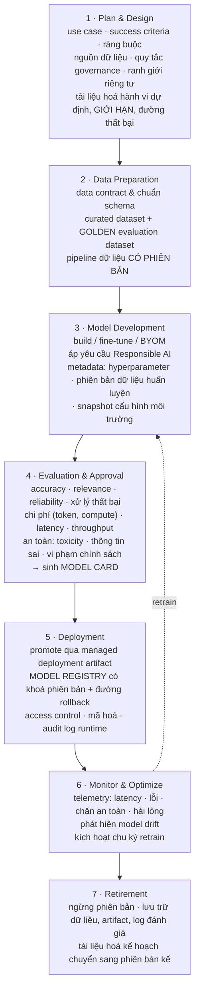

# Note 22 — ALM cho Foundry agents, custom AI model và AI trong Dynamics 365

> [!summary] TL;DR
> Bốn vòng đời ALM khác nhau, cùng một bộ xương: **tách môi trường → version hoá artifact → promotion gate có bằng chứng → giám sát & drift → retire**.
> 1. **Foundry agents** — **7 thành phần chịu ALM** (agent logic & orchestration · prompt & behavioral rule · action handler & workflow · cấu hình dữ liệu & grounding · ánh xạ bảo mật & quyền · connector & tích hợp ngoài · policy & safety control). Nguyên tắc: **mỗi agent là artifact có phiên bản**, **bản phát hành production BẤT BIẾN**, **chỉ promote bundle đã version**.
> 2. **Custom AI model** — vòng đời **7 giai đoạn** *Plan & Design → Data Preparation → Model Development → Evaluation & Approval → Deployment → Monitor & Optimize → Retirement*, với **Model Card** là hiện vật bắt buộc và **model registry có khoá phiên bản + đường rollback**.
> 3. **AI trong D365 Finance & Supply Chain** — **6 loại tài sản AI**, gate riêng, và **guardrail cho quy trình trọng yếu** (ví dụ *posting journal*, *phê duyệt purchase order*).
> 4. **AI trong D365 CE & Service** — **7 loại tài sản AI**, **4 tầng môi trường** (thêm Pre-Prod), quy trình **7 bước**, **semantic versioning** (`v1.3.2`), triển khai qua **Azure DevOps hoặc GitHub Actions**.
>
> ⭐ **Đáp án quiz của module:** dataset sẵn sàng lên Production là **dataset BẤT BIẾN, CÓ PHIÊN BẢN, CÓ SENSITIVITY LABEL và LINEAGE ĐẦY ĐỦ, đã qua các evaluation gate** — không phải bản Dev mới nhất, không phải bản Test "trông cân bằng nhưng lineage chưa đủ", không phải bản chạy nhanh trong pilot.
>
> Thuật ngữ: **Control plane** = mặt phẳng điều khiển, nơi quản trị tập trung định nghĩa và cấu hình. **Model Card** = tài liệu mô tả model: chỉ số, ràng buộc, phạm vi dùng khuyến nghị. **Model registry** = kho đăng ký model có quản lý phiên bản. **BYOM** (Bring Your Own Model) = mang model của mình vào nền tảng. **Hyperparameter** = tham số cấu hình ngoài, đặt trước khi huấn luyện (learning rate, batch size, số lớp mạng). **Semantic versioning** = đánh số `MAJOR.MINOR.PATCH`. **Change freeze** = khoảng thời gian cấm thay đổi. **Backout plan** = kế hoạch lùi lại khi triển khai hỏng.

---

## 1. ALM cho Microsoft Foundry agents (U3)

### 1.1. Bảy trụ của chiến lược ALM

**Chiến lược ALM cho Foundry agent bao gồm:** **tách môi trường (Dev → Test → Production)** · **cấu hình agent có phiên bản** · **promotion gate được kiểm soát** · **governance cho connector, secret và truy cập dữ liệu** · **pipeline triển khai lặp lại được** · **giám sát và governance vận hành** · **quy trình khai tử vòng đời**.

> ⭐ **Foundry control plane** cho phép **giám sát tập trung** định nghĩa agent, ngữ cảnh bảo mật, nguồn dữ liệu và hành vi runtime **xuyên nhiều môi trường**.

### 1.2. Ba tầng môi trường

| Môi trường | Việc làm |
|---|---|
| **Development (Dev)** | **Thiết kế agent, thử nghiệm, test prompt, cấu hình connector, nguyên mẫu tích hợp** |
| **Test (QA/UAT)** | **Regression testing, kiểm chứng kịch bản, logic tích hợp, đánh giá hành vi, kiểm tra an toàn của action** |
| **Production (Prod)** | **Agent đã kiểm chứng đầy đủ, có phiên bản, phục vụ người dùng ở quy mô lớn với giám sát được bật** |

### 1.3. Bảy thành phần chịu ALM & bốn nguyên tắc versioning ⭐⭐

**Bảy thành phần phải được quản trị và version hoá:**

| # | Thành phần |
|---|---|
| 1 | **Agent logic and orchestration** |
| 2 | **Prompts and behavioral rules** |
| 3 | **Action handlers and workflows** |
| 4 | **Data and grounding configurations** |
| 5 | **Security and permission mappings** |
| 6 | **Connectors and external integrations** |
| 7 | **Policies and safety controls** |

**Bốn nguyên tắc versioning:**
1. **Coi MỖI AGENT là một artifact có phiên bản**
2. ⭐ **Giữ bản phát hành BẤT BIẾN (immutable) cho production**
3. **Tài liệu hoá thay đổi bằng changelog và mô tả**
4. ⭐ **CHỈ promote các bundle đã được version xuyên các môi trường**

`★ Insight ─────────────────────────────────────`
Danh sách bảy thành phần đáng chú ý vì **mục 5 và 7** — *ánh xạ bảo mật & quyền* và *policy & safety control* — được xếp ngang hàng với logic và prompt.

Trong ALM phần mềm truyền thống, quyền và chính sách thường là **cấu hình môi trường**: bạn thiết lập chúng một lần ở từng môi trường rồi để yên. Ở đây chúng là **artifact di chuyển cùng agent qua các môi trường**, và có lý do: quyền của agent **là một phần định nghĩa hành vi của nó**. Một agent có quyền ghi vào bảng tài chính và một agent chỉ có quyền đọc là **hai agent khác nhau về mặt rủi ro**, dù logic giống hệt. Nếu quyền không được version cùng agent thì bạn có thể promote logic mới lên Prod nhưng vẫn chạy với bộ quyền cũ — hoặc tệ hơn, quyền rộng hơn dự định.

Nguyên tắc **"chỉ promote bundle đã version"** khoá điều này lại: bạn không đẩy từng mảnh sang môi trường mới mà đẩy **cả gói**, nên logic, prompt, quyền và policy luôn khớp nhau. Kết hợp với **"immutable release cho production"**, bạn luôn trả lời được câu hỏi audit *"phiên bản đang chạy trên Prod chính xác gồm những gì"*.
`─────────────────────────────────────────────────`

### 1.4. Hai promotion gate ⭐

| Gate | Tiêu chí |
|---|---|
| **Gate 1 — Dev → Test** | **Kiểm chứng chức năng của hành vi lõi** · **kiểm tra an toàn và guardrail ban đầu** · **xác minh ánh xạ nguồn dữ liệu** · **rà cấu hình action và connector** · **rà chất lượng code hoặc prompt** |
| **Gate 2 — Test → Prod** | **Hoàn tất regression test** · **phê duyệt về truy cập dữ liệu và tuân thủ chính sách** · **đánh giá hiệu năng và chi phí** · ⭐ **con người kiểm chứng khả năng suy luận của agent** · **tài liệu hoá phiên bản, phụ thuộc và phân tích rủi ro** |

> ⭐ **"Human validation of agent reasoning"** ở Gate 2 là điểm không thể tự động hoá — nối với tầng 3 *Quality and Output Accuracy* ở [[17-Khung-Giam-sat-va-Cong-cu]], tầng mà không công cụ nào phủ trọn.

### 1.5. Kiểm soát dữ liệu, bảo mật, residency & triển khai

**Sáu kiểm soát ALM phải thực thi:** **yêu cầu data residency** · **dùng nguồn dữ liệu đã phê duyệt** · **RBAC** · ⭐ **tách secret của production khỏi artifact của development** · **thực thi chính sách cho connector và lời gọi bên ngoài** · **dùng quản lý danh tính an toàn cho action của agent**.

**Foundry hỗ trợ triển khai có kiểm soát qua:** **solution packaging** · **pipeline triển khai tự động hoặc thủ công** · **configuration as code** (ở chỗ áp dụng được).

**Bốn thứ architect phải hiện thực:** **deployment automation** · **quy trình rollback phiên bản** · ⭐ **release calendar và change freeze** · **template kiểm chứng sẵn sàng cho production**.

**Bảy hoạt động vận hành liên tục:** **phân tích telemetry runtime** · **rà sự kiện an toàn & guardrail** · **điều tra lỗi và thất bại** · **đánh giá chất lượng suy luận** · **audit việc thực thi action** · **vòng phản hồi người dùng** · **tối ưu chi phí và hiệu năng**.

---

## 2. ALM cho custom AI model (U4)

### 2.1. Bốn điều ALM bảo đảm & thách thức riêng

| Bảo đảm | Nội dung |
|---|---|
| **Consistency** | **Mọi model đi theo các bước phát triển, kiểm thử, kiểm chứng, triển khai đã được tài liệu hoá** |
| **Compliance** | **Dữ liệu nhạy cảm, PII và yêu cầu đặc thù ngành được bảo vệ và quản trị xuyên các lần lặp model** |
| **Repeatability** | **Model retrain và redeploy được một cách dự đoán được**, với **lịch sử phiên bản và tiêu chí đánh giá rõ ràng** |
| **Operational Readiness** | **Giám sát runtime, log governance và kế hoạch rollback** bảo đảm khả năng chống chịu của nghiệp vụ |

> ⚠️ **Bốn thách thức riêng của custom model:** **data drift** · **model drift** · **căn chỉnh pháp lý** · **rủi ro triển khai tác động cao**.

### 2.2. Vòng đời 7 giai đoạn ⭐⭐

> ⭐ Giai đoạn **1** yêu cầu tài liệu hoá cả **giới hạn (limitations) và đường thất bại (failure paths)** — tức bạn phải viết ra **model này KHÔNG làm được gì** ngay từ khâu thiết kế, chứ không đợi phát hiện trong vận hành. Đây là đầu vào trực tiếp cho **Model Card** ở giai đoạn 4.

**Điều kiện retirement:** khi model **không còn đạt kỳ vọng về accuracy, safety, cost hoặc nghiệp vụ**.

### 2.3. Hai promotion gate & checklist

| Gate | Tiêu chí |
|---|---|
| **Gate 1 — Dev → Test** | **Dữ liệu huấn luyện đạt chuẩn chất lượng** · **vượt qua kiểm thử an toàn và thiên lệch** · **đã tạo tài liệu** |
| **Gate 2 — Test → Prod** | **Hiệu năng VƯỢT baseline** · **chi phí và latency trong khoảng chấp nhận** · **có phê duyệt về bảo mật và tuân thủ** · **kế hoạch rollback được xác nhận** |

**Gate checklist — 6 mục:**
- [ ] **Data quality validated**
- [ ] **Evaluation metrics achieved**
- [ ] **Safety checks completed**
- [ ] **Model Card produced**
- [ ] **Governance approvals obtained**
- [ ] **Rollback plan documented**

### 2.4. Năm yêu cầu governance & giám sát drift

**Năm yêu cầu governance:** **thực thi data residency và ranh giới vùng** · **gắn sensitivity label cho dataset huấn luyện và đánh giá** · **chính sách rõ ràng về model/nguồn dữ liệu bên ngoài được phép** · **guardrail cho prompt, dữ liệu grounding và chính sách action** · **audit trail minh bạch cho MỌI lần triển khai**.

**Bốn mặt giám sát:**
1. **KPI thời gian thực**: **accuracy · latency · cost · throughput · task success**
2. **Drift detection**: **thay đổi trong phân bố dữ liệu đầu vào HOẶC chất lượng đầu ra**
3. **Safety monitoring**: **đầu ra không phù hợp hoặc vi phạm chính sách**
4. **User behavior analysis**: **giảm số lần re-prompt, xu hướng hài lòng ổn định**

> 💡 Giáo trình minh hoạ bằng một "radar chart" dạng chữ với 5 trục: **Accuracy ●●●●○ · Latency ●●●○○ · Safety ●●●●● · Cost ●●●○○ · Consistency ●●●●○** — cách trực quan hoá **hồ sơ đánh đổi** của một model. Điểm đáng học: **Safety đạt tối đa còn Cost và Latency chỉ trung bình** — phản ánh đúng thứ tự ưu tiên đã thấy ở bảng ngưỡng của [[19-Testing-Quy-trinh-Metrics-va-Validation]] (an toàn tuyệt đối, các chiều khác có dung sai).

**Năm trách nhiệm của architect:** **định nghĩa chuẩn phát triển model** · **quản trị truy cập, secret, connector và ranh giới dữ liệu** · ⭐ **duy trì tài liệu ALM: Model Card, Data Contract, Risk Assessment** · **thiết lập dashboard giám sát, trigger retrain và luồng escalate khi thất bại** · **phối hợp với đội bảo mật, tuân thủ và dữ liệu**.

---

## 3. ALM cho AI trong D365 Finance & Supply Chain (U5)

### 3.1. Sáu loại tài sản AI phải quản trị

**AI model** (prediction, scoring, classification, anomaly detection) · **prompt và chỉ dẫn cho Copilot** · **feature engineering pipeline** · **knowledge source** (tài liệu, task guide, data entity có cấu trúc) · **automation và orchestration flow** · **thành phần tích hợp** (connector, Dataverse virtual entity, API).

**Năm nguyên tắc ALM lõi:** **tách môi trường Dev → Test → Prod** · **version control cho model, schema dữ liệu và cấu hình AI** · **gán vai trò và trách nhiệm cho phê duyệt và chu kỳ rà soát** · **mẫu triển khai lặp lại được qua managed solution hoặc pipeline** · **truy vết đầu-cuối xuyên phát triển, tinh chỉnh, triển khai và khai tử model**.

### 3.2. Ba môi trường & ba yêu cầu then chốt

| Environment | Purpose |
|---|---|
| **DEV** | **Xây và lặp** trên AI model, prompt, logic orchestration, tích hợp |
| **TEST** | ⭐ **Kiểm chứng bằng dữ liệu ĐÃ ẨN DANH, giống production**; chạy regression check |
| **PROD** | **Thực thi năng lực AI đã phê duyệt** trên workload tài chính và chuỗi cung ứng thật |

**Ba yêu cầu:**
1. **Không sửa trực tiếp trên production**
2. ⭐ **Dùng environment variable cho endpoint, tên model và connection string**
3. **Giữ nguồn dữ liệu riêng biệt**, gồm **dataset tổng hợp (synthetic) cho vận hành Test an toàn**

> ⭐ Yêu cầu 2 chính là lý do **giá trị của environment variable không solution-aware** (xem 🔎 ở [[21-ALM-cho-Du-lieu-va-Copilot-Studio]]): cùng một solution phải trỏ về endpoint khác nhau tuỳ môi trường.

### 3.3. Data contract & chuẩn bị dữ liệu

**Data contract cho Finance/SCM phải định nghĩa 4 thứ:** **thực thể tài chính và vận hành mà model cần** · **khoảng giá trị hợp lệ, ràng buộc và quy tắc nghiệp vụ** · **sensitivity label cho dữ liệu tài chính và định danh cá nhân** · **định danh phiên bản schema để căn pipeline dữ liệu với promotion gate**.

**Bốn việc chuẩn bị dữ liệu:** **curated dataset cho huấn luyện (DEV)** · **gold dataset cho đánh giá (TEST)** · ⭐ **dataset có phiên bản và BẤT BIẾN một khi đã promote** · **tài liệu hoá nguồn dữ liệu, phép biến đổi và giả định**.

### 3.4. Prompt phải nói ngôn ngữ ERP ⭐

| Yêu cầu | Nội dung |
|---|---|
| **Phản ánh ngữ cảnh ERP** | Prompt phải phản ánh **thuật ngữ, chính sách, vai trò và bối cảnh nghiệp vụ của ERP** |
| **Căn theo metadata** | Căn thuật ngữ với metadata Finance & Supply Chain — ví dụ **`vendor`, `ledger`, `work order`, `production order`** |
| **Kiểm chứng** | **Kiểm chứng hành vi prompt qua scenario-based testing** |

> 💡 Đây là **business terms** của [[09-Copilot-trong-Dynamics-365-CE-va-Service]] áp cho thế giới ERP: cùng một nguyên tắc *"AI phải nói ngôn ngữ của tổ chức"*, chỉ khác từ vựng.

**Work product của AI model:** **kiến trúc model · hyperparameter · cấu hình huấn luyện · metric hiệu năng · ràng buộc nghiệp vụ và kỳ vọng đầu ra**.

### 3.5. Hai gate, gói triển khai & guardrail cho quy trình trọng yếu

| Gate | Tiêu chí |
|---|---|
| **Gate 1 — DEV → TEST** | **Hoàn tất và phê duyệt data profiling** · **tài liệu hoá logic huấn luyện và prompt** · **vượt đánh giá chất lượng và an toàn ban đầu** |
| **Gate 2 — TEST → PROD** | **Đạt ngưỡng đánh giá model** (accuracy, relevancy, **stability**) · **không có thiên lệch hoặc đầu ra không an toàn trong kịch bản kiểm chứng** · **kiểm chứng hiệu năng dưới ràng buộc workload ERP** · **hoàn tất rà bảo mật, tuân thủ và data residency** · **gói triển khai được đội kiến trúc và governance phê duyệt** |

**Đóng gói triển khai:** **gói AI model, prompt, knowledge asset và automation flow thành các bản phát hành CÓ PHIÊN BẢN**; dùng **managed solution hoặc pipeline tự động**.

**Release readiness checklist — 5 mục:** **phiên bản model và prompt đã chốt** · **cấu hình environment variable** · **kết quả đánh giá tổng hợp và thật đã được tài liệu hoá** · **kế hoạch backout và rollback** · **dashboard giám sát đã kích hoạt**.

**Bốn kiểm soát rủi ro & tuân thủ:** **yêu cầu data residency cho dữ liệu tài chính** · **thực thi gắn sensitivity label** · **DLP rule cho AI action** · ⭐ **guardrail cho quy trình trọng yếu — ví dụ posting journal, phê duyệt purchase order**.

`★ Insight ─────────────────────────────────────`
Ví dụ guardrail ở đây — **posting journal** và **phê duyệt purchase order** — không phải chọn ngẫu nhiên. Cả hai đều là **hành động tài chính không hoàn tác được về mặt sổ sách**: một bút toán đã ghi sổ thì phải **đảo bút toán** chứ không xoá được, và một PO đã duyệt thì đã tạo cam kết với nhà cung cấp.

Điều này giải thích vì sao ALM cho Finance & Supply Chain nghiêm hơn các workload khác: **Test phải dùng dữ liệu ẩn danh giống production và cả dataset tổng hợp**, chứ không được thử trên dữ liệu thật. Với một agent customer service, thử sai thì tệ nhất là một tóm tắt kém; với một agent tài chính, thử sai trên dữ liệu thật là **một bút toán sai trong sổ cái**.

Nối lại với **behavior envelope** ở [[07-Solution-Rules-Vai-tro-va-AI-CoE]] — mẫu *"Agent may not execute financial transactions"* — và với ba kiểu safety rule ở [[11-Ba-loai-Agent-va-Foundry-Tools]]: đây chính là chỗ kiểu rule **"bắt buộc xác nhận trước khi thực hiện"** trở thành yêu cầu bắt buộc chứ không phải tuỳ chọn.
`─────────────────────────────────────────────────`

**Vòng cải tiến 5 bước:** **thu telemetry → nhận diện drift hoặc kém hiệu quả → retrain hoặc tinh chỉnh prompt/model → đánh giá lại ở môi trường Test → promote phiên bản nâng cấp qua các ALM gate**.

**Bốn mặt giám sát vận hành:** **latency, success rate và exception rate** · ⭐ **prediction drift** (accuracy đổi theo thời gian) · ⭐ **data drift** (mẫu đầu vào lệch khỏi dữ liệu huấn luyện) · **phản hồi người dùng và chỉ báo hài lòng với Copilot**.

> ⭐ Chú ý giáo trình **tách bạch prediction drift và data drift** — hai thứ khác nhau: *data drift* là **đầu vào đổi**, *prediction drift* là **đầu ra kém đi**. Data drift thường xảy ra trước và là **cảnh báo sớm** cho prediction drift.

---

## 4. ALM cho AI trong D365 Customer Engagement & Service (U6)

### 4.1. Sáu mục tiêu ALM & bảy loại tài sản AI

**Sáu mục tiêu:** **giữ hành vi AI nhất quán và dự đoán được xuyên môi trường** · **thực thi governance cho dữ liệu, prompt, model và automation** · **đường triển khai an toàn có khả năng rollback** · **hỗ trợ orchestration đa app** (Customer Service, Sales Insights, Customer Insights, Field Service) · **bảo đảm tuân thủ, hành vi Responsible AI và khả năng kiểm toán** · **cho phép cải tiến liên tục dựa trên telemetry**.

**Bảy loại tài sản AI phải đưa vào ALM:**

| # | Tài sản |
|---|---|
| 1 | **Copilot prompt và agent behavior** |
| 2 | **Knowledge source và cấu hình semantic indexing** |
| 3 | **Cấu hình AI model** (classification, summarization, extraction, prediction) |
| 4 | **Power Automate flow và plugin dùng bởi AI action** |
| 5 | **Data contract và schema tương tác khách hàng** |
| 6 | **System message, routing rule, context rule, conversation booster** |
| 7 | ⭐ **Bộ environment variable** (API key, model endpoint, **tham chiếu vector index**) |

### 4.2. Bốn tầng môi trường ⭐

> Khác ba workload trên, D365 CE/Service khuyến nghị **BỐN tầng** — thêm **Pre-Production**:

| Tầng | Việc làm |
|---|---|
| **Development (DEV)** | **Xây và lặp** prompt AI, agent workflow, ánh xạ dữ liệu, logic orchestration · **thử nghiệm conversation booster và dataset mẫu** |
| **Test/Validation (TEST)** | **Kiểm chứng hành vi AI bằng dataset thực tế** · **chạy regression test** cho prompt, tính nhất quán của tóm tắt, gợi ý giải quyết case, độ chính xác phân loại |
| **Pre-Production (UAT/PREPROD)** | ⭐ **Kiểm chứng chấp nhận nghiệp vụ, hiệu năng, an toàn và tuân thủ** · **test tích hợp với hàng đợi, tương tác và thực thể tri thức GIỐNG THẬT** |
| **Production (PROD)** | **Phục vụ tính năng AI đã kiểm chứng** với **triển khai có kiểm soát và giám sát liên tục** |

### 4.3. Quy trình ALM 7 bước

| Bước | Nội dung |
|---|---|
| **1 — Define AI Use Cases and Data Boundaries** | Xác định **mục tiêu nghiệp vụ** (tóm tắt case, phát hiện sentiment, dự đoán định tuyến, trợ giúp agent, phân loại) · định nghĩa **nguồn dữ liệu cần** và bảo đảm dùng có trách nhiệm dưới governance · **tài liệu hoá luồng dữ liệu khách hàng, sensitivity label và ràng buộc tuân thủ** |
| **2 — Prepare Data and Knowledge Assets** | **Kiểm chứng chất lượng dữ liệu** tương tác khách hàng, case, knowledge article, email, chat, bản ghi CRM · **bảo đảm schema nhất quán xuyên môi trường** · **căn knowledge source theo thực thể knowledge base của D365 Customer Service** |
| **3 — Develop and Configure AI Logic** | **Xây prompt** cho tóm tắt, phân loại, gợi ý trả lời, next-best action · **cấu hình Copilot behavior, action rule, context definition, conversation booster** · **thiết lập environment variable** cho connector, endpoint, knowledge index |
| **4 — Package and Version AI Assets** | **Quản agent, prompt, flow và data contract BÊN TRONG solution file** · **dùng repository có version control** · ⭐ **đánh dấu bản phát hành bằng semantic versioning** (ví dụ **`v1.3.2`**) |
| **5 — Validate Behavior Across Environments** | **Đánh giá tính đầy đủ, độ chính xác thực tế, giọng điệu và tuân thủ** · ⭐ **chạy kịch bản hội thoại NHIỀU LƯỢT để phát hiện lỗi logic** · **test với dữ liệu case thật đã ẩn danh** · **chạy safety test cho thông tin sai, thiên lệch và lộ dữ liệu trái phép** |
| **6 — Deploy to Production** | **Export gói managed solution** · **staging ở PRE-PROD để kiểm tra lần cuối** · ⭐ **triển khai lên PROD bằng release pipeline đã phê duyệt (Azure DevOps hoặc GitHub Actions)** · **kiểm chứng hiệu năng ngay sau triển khai** |
| **7 — Monitor, Tune, and Iterate** | Theo dõi **tỷ lệ giải quyết case thành công · chất lượng tóm tắt · xu hướng độ chính xác dự đoán · phản hồi của agent · throughput và latency** · **nhận diện drift hoặc suy giảm** · **retrain hoặc tinh chỉnh prompt và knowledge source** |

### 4.4. Governance, audit & release readiness

**Bốn kiểm soát Responsible AI:** ⭐ **bảo đảm prompt KHÔNG THỂ kích hoạt việc tiết lộ thông tin khách hàng nhạy cảm** · **thực thi truy cập dữ liệu least-privilege cho tính năng AI** · **áp DLP policy và sensitivity label xuyên các môi trường** · **tài liệu hoá giới hạn của model và kế hoạch giảm thiểu**.

**Audit & traceability:** **theo dõi phiên bản prompt, log quyết định, thay đổi ánh xạ và cập nhật agent** · ⭐ **thiết lập rà soát của CAB (Change Advisory Board) cho các bản phát hành AI rủi ro cao**.

**Data residency:** **bảo đảm dữ liệu do trợ lý AI lưu trữ hoặc xử lý tuân thủ yêu cầu vùng** · **tránh dùng knowledge source chưa được phê duyệt hoặc dataset công khai bên ngoài**.

**AI Release Readiness Checklist — 7 mục:**
- [ ] **Data quality validated**
- [ ] **Knowledge sources aligned and tested**
- [ ] **Prompts regression tested**
- [ ] **Safety and compliance verified**
- [ ] **Environment variables are configured**
- [ ] **Deployment pipeline successful**
- [ ] **Monitoring dashboards ready**

---

## 5. So sánh bốn vòng đời ALM ⭐⭐

| | **Copilot Studio** *(note 21)* | **Foundry agents** | **Custom AI model** | **D365 F&SC** | **D365 CE/Service** |
|---|---|---|---|---|---|
| **Số môi trường** | **3** (Dev/Test/Prod) | **3** | **3** | **3** | ⭐ **4** (+ Pre-Prod) |
| **Số promotion gate** | Theo solution | **2** | **2** | **2** | Theo 7 bước |
| **Artifact đặc trưng** | Solution (managed) | **Bundle agent có version** | **Model Card + model registry** | **Gói model+prompt+knowledge+flow** | **Solution file + semantic versioning** |
| **Hiện vật bắt buộc** | Governance checklist 6 mục | Changelog | ⭐ **Model Card** | Data contract ERP | Data contract khách hàng |
| **Dữ liệu Test** | Dữ liệu test | Dữ liệu test | Golden evaluation set | ⭐ **Ẩn danh + synthetic** | ⭐ **Case thật đã ẩn danh** |
| **Cơ chế triển khai** | Managed solution | Solution packaging, config as code | Managed deployment artifact | Managed solution / pipeline | ⭐ **Azure DevOps / GitHub Actions** |
| **Điểm nhấn riêng** | **Không sửa trên Prod** | **Immutable release + human validation of reasoning** | **7 giai đoạn + Model Card** | ⭐ **Guardrail cho posting journal / PO approval** | ⭐ **CAB cho bản phát hành rủi ro cao** |

`★ Insight ─────────────────────────────────────`
Bảng này cho thấy **cùng một bộ xương ALM được siết chặt dần theo MỨC RỦI RO của workload**, chứ không phải năm quy trình khác nhau.

Đáy thang là **Copilot Studio** — 3 môi trường, kiểm soát chủ yếu bằng managed solution. Lên tới **Foundry agents** thêm **immutable release** và **con người kiểm chứng suy luận**. **Custom model** thêm cả một vòng đời 7 giai đoạn với **Model Card** làm hiện vật bắt buộc, vì model là thứ khó giải thích nhất. **D365 Finance & Supply Chain** siết ở **dữ liệu test** (ẩn danh + synthetic) và **guardrail cho hành động không hoàn tác được**. Và **D365 CE/Service** — nơi dữ liệu khách hàng thật chảy qua — là workload duy nhất được khuyến nghị **bốn tầng môi trường** cộng **CAB review**.

Quy luật rút ra để trả lời câu hỏi tình huống: **mức nghiêm ngặt của ALM tỉ lệ với (a) mức khó hoàn tác của hành động và (b) độ nhạy cảm của dữ liệu chảy qua**. Không phải "workload nào cũng cần 4 môi trường" — mà là chọn mức tương xứng, đúng tinh thần chọn bậc thấp nhất đủ dùng đã gặp xuyên suốt bộ note.
`─────────────────────────────────────────────────`

---

## Câu hỏi phỏng vấn

> [!question] Dataset nào sẵn sàng để promote lên Production?
> **Dataset BẤT BIẾN, CÓ PHIÊN BẢN, ĐÃ GẮN SENSITIVITY LABEL, CÓ LINEAGE ĐẦY ĐỦ và ĐÃ VƯỢT QUA CÁC EVALUATION GATE.** Ba phương án hay bị nhầm và lý do loại: **"bản Dev mới nhất có độ phủ mẫu rộng"** — độ phủ rộng không thay được lineage và label, và Dev là dữ liệu *red* (biến đổi được) chứ không phải *gold*; **"bản Test trông cân bằng nhưng lineage chưa đầy đủ"** — thiếu lineage nghĩa là **không tái lập được**, tức trượt gate B→C; **"bản nào cho latency chấp nhận được trong pilot"** — latency là chỉ báo hiệu năng, **không nói gì về chất lượng, tuân thủ hay khả năng truy vết**. Điểm chung: promote dựa trên **bằng chứng**, không dựa trên ấn tượng.

> [!question] Vì sao quyền và policy được version cùng agent Foundry, thay vì để là cấu hình môi trường?
> Vì **quyền của agent là một phần định nghĩa hành vi của nó**. Hai agent có logic giống hệt nhưng một cái được ghi vào bảng tài chính còn cái kia chỉ đọc là **hai agent khác nhau về rủi ro**. Nếu quyền không đi cùng agent, bạn có thể promote logic mới lên Prod mà vẫn chạy với **bộ quyền cũ hoặc rộng hơn dự định**. Đó là lý do bảy thành phần chịu ALM gồm cả **security & permission mappings** và **policies & safety controls**, ngang hàng với logic và prompt. Hai nguyên tắc khoá điều này: **chỉ promote bundle đã version** (đẩy cả gói, mọi thứ khớp nhau) và **immutable release cho production** (luôn trả lời được *"bản đang chạy trên Prod gồm chính xác những gì"*).

> [!question] Model Card là gì và xuất hiện ở đâu trong vòng đời custom model?
> **Model Card** là tài liệu chứa **chỉ số đánh giá, ràng buộc, và phạm vi sử dụng khuyến nghị** của model. Nó được **sinh ra ở giai đoạn 4 — Evaluation & Approval**, sau khi đã kiểm chứng accuracy/relevance/reliability/xử lý thất bại, đánh giá chi phí-latency-throughput, và kiểm an toàn (toxicity, thông tin sai, vi phạm chính sách). Nó là **một trong 6 mục bắt buộc của gate checklist** cùng với data quality, evaluation metrics, safety checks, governance approvals và rollback plan. Đầu vào của nó bắt nguồn từ giai đoạn 1, nơi bạn phải **tài liệu hoá hành vi dự định, GIỚI HẠN và ĐƯỜNG THẤT BẠI** — tức viết ra model *không* làm được gì ngay từ khâu thiết kế. Về lâu dài, Model Card là một trong **ba tài liệu ALM** architect phải duy trì, cùng **Data Contract** và **Risk Assessment**.

> [!question] Vì sao ALM cho D365 Finance & Supply Chain nghiêm hơn các workload khác?
> Vì các hành động ở đây **không hoàn tác được về mặt sổ sách**. Giáo trình nêu đích danh hai guardrail: **posting journal** và **phê duyệt purchase order** — một bút toán đã ghi sổ phải **đảo bút toán** chứ không xoá được, một PO đã duyệt đã tạo **cam kết với nhà cung cấp**. Hệ quả về ALM: môi trường **TEST phải dùng dữ liệu đã ẩn danh giống production và cả dataset tổng hợp (synthetic)**, không thử trên dữ liệu thật; **environment variable** bắt buộc cho endpoint/tên model/connection string; và gate 2 đòi thêm **kiểm chứng hiệu năng dưới ràng buộc workload ERP** cùng **phê duyệt của đội kiến trúc và governance**. So sánh: với agent customer service, thử sai tệ nhất là một tóm tắt kém; với agent tài chính, thử sai trên dữ liệu thật là **một bút toán sai trong sổ cái**.

> [!question] Phân biệt data drift và prediction drift.
> **Data drift** = **mẫu dữ liệu ĐẦU VÀO lệch khỏi dữ liệu huấn luyện**. **Prediction drift** = **độ chính xác ĐẦU RA thay đổi theo thời gian**. Giáo trình tách bạch hai thứ này trong phần giám sát vận hành của D365 F&SC, và thứ tự nhân quả thường là: **data drift xảy ra trước** và là **cảnh báo sớm** cho prediction drift — thế giới thay đổi trước, model kém đi sau. Ý nghĩa thực hành: nếu chỉ giám sát chất lượng đầu ra thì bạn luôn phát hiện muộn; giám sát phân bố đầu vào cho bạn thời gian phản ứng. Cả hai đều là trigger cho **chu kỳ retrain**, và vòng cải tiến là: **thu telemetry → nhận diện drift → retrain/tinh chỉnh → đánh giá lại ở Test → promote qua các gate**.

> [!question] Workload nào cần 4 tầng môi trường và vì sao?
> **AI trong D365 Customer Engagement & Service** — ba workload còn lại (Copilot Studio, Foundry agents, custom model, D365 F&SC) đều khuyến nghị 3 tầng, riêng CE/Service thêm **Pre-Production (UAT/PREPROD)**. Vai trò của tầng thêm: **kiểm chứng chấp nhận nghiệp vụ, hiệu năng, an toàn và tuân thủ**, và **test tích hợp với hàng đợi, tương tác và thực thể tri thức GIỐNG THẬT**. Lý do sâu hơn: đây là workload có **dữ liệu khách hàng thật chảy qua** và **orchestration đa app** (Customer Service, Sales Insights, Customer Insights, Field Service) — nên cần một tầng "giống thật nhưng chưa phải thật" trước khi phát hành. Nó cũng là workload duy nhất được khuyến nghị **CAB review cho bản phát hành rủi ro cao** và triển khai qua **Azure DevOps hoặc GitHub Actions**. Nguyên tắc chung: **mức nghiêm ngặt của ALM tỉ lệ với mức khó hoàn tác của hành động và độ nhạy cảm của dữ liệu**.

---

## Tự kiểm tra

1. **Bảy trụ** của chiến lược ALM cho Foundry agent? **Control plane** làm gì?
2. **Bảy thành phần** chịu ALM của Foundry agent? Vì sao **quyền và policy** cũng phải version?
3. **Bốn nguyên tắc versioning** — hai nguyên tắc nào bảo đảm audit trả lời được *"Prod đang chạy gì"*?
4. **Hai promotion gate** của Foundry: tiêu chí từng gate? Tiêu chí nào **không tự động hoá được**?
5. **Sáu kiểm soát** dữ liệu/bảo mật/residency? **Bốn thứ** architect phải hiện thực khi triển khai?
6. **Bốn điều** ALM cho custom model bảo đảm? **Bốn thách thức** riêng?
7. **Bảy giai đoạn** vòng đời custom model? Giai đoạn 1 phải tài liệu hoá **ba** thứ gì?
8. **Model Card** chứa gì, sinh ra ở giai đoạn nào, thuộc checklist nào?
9. **Hai gate** của custom model + **6 mục** gate checklist?
10. **Năm yêu cầu governance** và **bốn mặt giám sát** cho custom model?
11. **Năm trách nhiệm** của architect? **Ba tài liệu ALM** phải duy trì?
12. **Sáu loại tài sản AI** trong D365 F&SC? **Năm nguyên tắc ALM lõi**?
13. **Ba yêu cầu** môi trường của F&SC? Dữ liệu Test phải là loại gì?
14. **Bốn thứ** data contract của F&SC phải định nghĩa?
15. Prompt cho ERP phải căn theo **metadata** nào — kể 4 ví dụ thuật ngữ?
16. **Hai gate** của F&SC? Gate 2 đòi thêm điều gì so với workload khác?
17. **Bốn kiểm soát rủi ro** của F&SC — **hai guardrail** được nêu đích danh và vì sao chúng đặc biệt?
18. Phân biệt **prediction drift** và **data drift** — cái nào là cảnh báo sớm?
19. **Bảy loại tài sản AI** trong D365 CE/Service?
20. **Bốn tầng môi trường** của CE/Service — tầng thêm làm gì?
21. **Bảy bước** quy trình ALM của CE/Service? Bước 4 dùng cách đánh phiên bản nào?
22. Bước 6 triển khai bằng công cụ nào? Bước 5 chạy loại kịch bản nào để bắt lỗi logic?
23. **Bốn kiểm soát Responsible AI** + **CAB** dùng cho trường hợp nào?
24. **Bảy mục** AI Release Readiness Checklist?
25. So sánh **năm vòng đời ALM**: số môi trường, artifact đặc trưng, điểm nhấn riêng? Quy luật quyết định mức nghiêm ngặt?

## Liên quan
- [[00-MOC-AB100]] — MOC bộ AB-100
- [[21-ALM-cho-Du-lieu-va-Copilot-Studio]] — note trước: ALM cho dữ liệu (7 pha A–G) & Copilot Studio; 🔎 pipelines, solution-aware, Git integration
- [[23-Bao-mat-Agent-Model-va-Access-Control]] — note sau: bảo mật agent, model security, access control
- [[14-Extensibility-Custom-Model-M365-Copilot-MCP]] — thiết kế custom model trong Foundry, 5 bước & ma trận quyết định
- [[19-Testing-Quy-trinh-Metrics-va-Validation]] — ngưỡng đánh giá dùng ở promotion gate
- [[18-Metrics-Telemetry-va-Tuning]] — drift detection, retrain trigger
- [[07-Solution-Rules-Vai-tro-va-AI-CoE]] — behavior envelope; guardrail cho giao dịch tài chính
- [[16-Orchestrate-Prebuilt-Agents-va-Apps]] — orchestration đa app mà ALM phải bao phủ
- [[../AI-103/01-Microsoft-Foundry-Tong-quan-Plan-Prepare]] — Foundry control plane, bản kỹ thuật
- [[../../../06-DevOps/00-MOC-DevOps]] — Azure DevOps, GitHub Actions, release pipeline
