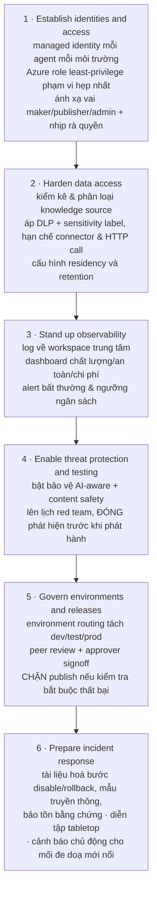
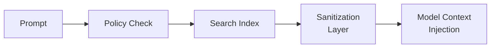

# Note 23 — Bảo mật agent, model security, access control & audit trail

> [!summary] TL;DR
> Note bảo mật của cụm Deploy. Bốn khối:
> 1. **Defense in depth cho agent** — **6 vùng thiết kế**: **Identity & access · Data governance · Observability & cost · Threat protection · Development & interoperability standards · Incident response**. Nguyên tắc nền: ⭐ **mỗi agent, tool và pipeline có MỘT DANH TÍNH HẠNG NHẤT, chủ sở hữu rõ ràng và quyền tối thiểu**; dùng **managed identity** để **không còn secret**.
> 2. **Model security** — danh tính không secret, **tách endpoint inference theo dev/test/prod**, **data minimization + redact PII**, **mã hoá at rest và in transit**, **private endpoint**, **chống model poisoning bằng lineage + validate dữ liệu mới**. **Blueprint 5 bước** hardening.
> 3. **Access control cho grounding data & model tuning** — **4 nguyên tắc thiết kế** (least privilege · phân vùng dữ liệu theo chức năng · quyền sở hữu rõ · auditability) và **luồng truy xuất 5 chặng**: ⭐ **Prompt → Policy Check → Search Index → Sanitization Layer → Model Context Injection**.
> 4. **Audit trail** — audit **model changes** và **data changes**; **5 thuộc tính kiến trúc** (immutable · timestamped · gán theo danh tính · log JSON · ghi log tách nhiệm & phê duyệt); ⭐ **log ghi METADATA, KHÔNG ghi NỘI DUNG**. Retention: **90 ngày (rủi ro thấp) · 12–24 tháng (chịu quản lý) · vô thời hạn (lưu trữ liên quan sự cố)**.
>
> ⭐ **Hai đáp án quiz của module:** defense in depth = **các lớp kiểm soát xếp chồng về identity, access, data governance, monitoring và threat protection**; giảm rủi ro lộ dữ liệu = **áp DLP, sensitivity label và ranh giới least-privilege trên MỌI nguồn dữ liệu** — *không* phải trông cậy vào chỉ dẫn của model.
>
> Thuật ngữ: **Managed identity** = danh tính do Azure quản lý, không cần lưu mật khẩu/khoá trong code. **Blast radius** = phạm vi thiệt hại khi một thành phần bị xâm phạm. **Private endpoint** = điểm truy cập riêng trong mạng nội bộ, không lộ ra Internet. **Model poisoning** = đầu độc model bằng cách chèn dữ liệu độc vào tập huấn luyện. **Prompt injection** = chèn chỉ dẫn độc vào đầu vào để lái model làm việc ngoài ý định. **SOC** (Security Operations Center) = trung tâm vận hành an ninh. **SIEM** = hệ thu thập & phân tích sự kiện an ninh (ví dụ Microsoft Sentinel). **Correlation ID** = mã liên kết các bản ghi thuộc cùng một request. **ADR** (Architecture Decision Record) = biên bản ghi quyết định kiến trúc.

---

## 1. Defense in depth cho agent trên Microsoft clouds (U1)

### 1.1. Sáu mục tiêu của unit

Unit này dạy **dịch yêu cầu nghiệp vụ và tuân thủ thành kiểm soát kỹ thuật**, gồm sáu năng lực:
1. **Map agent persona sang role và scope least-privilege** bằng **Azure RBAC và managed identity**
2. **Chọn mẫu xác thực và uỷ quyền an toàn** cho agent, tool và backend service
3. **Áp kiểm soát data governance** (DLP, sensitivity label, data residency) để **ràng buộc tri thức và đầu ra của agent**
4. **Thiết lập observability toàn tổ chức** cho hành vi, mức dùng và chi phí của agent
5. **Tích hợp threat protection đặc thù AI, red teaming và incident response vào vòng đời agent**
6. **Chuẩn hoá lựa chọn phát triển và khả năng tương tác** để giảm rủi ro và tăng khả năng bảo trì

### 1.2. Identity and access design ⭐⭐

> **Mục tiêu: mỗi agent, tool và pipeline có một DANH TÍNH HẠNG NHẤT (first-class identity), quyền sở hữu rõ ràng, và truy cập least-privilege.**

| Nhóm | Nội dung |
|---|---|
| **Agent identity** | ⭐ **Gán MỘT danh tính cloud duy nhất cho MỖI agent, ở MỖI môi trường** (prod, pre-prod, dev) và **ghi lại metadata về chủ sở hữu, phiên bản, vòng đời** · **ưu tiên managed identity** cho xác thực agent-tới-Azure để **loại bỏ secret và đơn giản hoá việc xoay khoá** |
| **Authorization patterns** | **Thực thi least privilege bằng role assignment có phạm vi hẹp** (subscription / resource group / resource) · ⭐ **Khi agent hành động THAY MẶT NGƯỜI DÙNG thì truyền quyền của người dùng; khi hành động NHÂN DANH CHÍNH NÓ thì cấp service role chỉ với các action agent cần** |
| **Separation of duties** | **Bốn vai riêng biệt: Maker · Publisher · Environment Admin · Security Admin** · **Yêu cầu phê duyệt khi publish lên production và khi thay đổi năng lực rủi ro cao** (ví dụ action sửa dữ liệu) |

`★ Insight ─────────────────────────────────────`
Câu **"một danh tính duy nhất cho mỗi agent, ở mỗi môi trường"** nghe như chi tiết vận hành nhưng thực ra là **điều kiện tiên quyết cho ba thứ khác** trong cả note.

Không có danh tính riêng thì: (1) **không thể áp least-privilege** — nhiều agent dùng chung một service principal buộc bạn phải cấp quyền bằng hợp của mọi nhu cầu, tức quyền rộng nhất; (2) **không thể quy trách nhiệm trong audit trail** — thuộc tính *"role-based attribution linked to identity provider"* ở §4.2 trở thành vô nghĩa nếu mọi hành động đều đến từ cùng một danh tính; (3) **không thể tắt một agent bị xâm phạm** mà không tắt luôn các agent khác — phá hỏng bước đầu tiên của incident response.

Cặp **"thay mặt người dùng" ↔ "nhân danh chính nó"** là quyết định kiến trúc đi kèm, và nó chính là cờ **`Enable onbehalfoflogin`** đã gặp ở [[10-Connectors-va-Contact-Center]]. Chọn sai hướng này là loại lỗi **cấu hình vẫn chạy nhưng người dùng thấy dữ liệu vượt quyền** — không có triệu chứng nào cho tới khi bị phát hiện trong một cuộc audit.
`─────────────────────────────────────────────────`

### 1.3. Data governance and protection

> **Mục tiêu: agent chỉ dùng ĐÚNG dữ liệu, ở ĐÚNG nơi, trong ĐÚNG khoảng thời gian.**

| Nhóm | Nội dung |
|---|---|
| **Data boundaries** | **Tách workload nội bộ và công khai; GIỮ nguồn bí mật ra khỏi agent hướng ra ngoài** · **tôn trọng data residency bằng cách chọn vùng tuân thủ cho tri thức, log và memory** |
| **DLP and sensitivity** | **Dùng DLP policy để hạn chế connector, action và di chuyển dữ liệu** · ⭐ **áp sensitivity label cho knowledge source; HIỂN THỊ NHÃN CAO NHẤT trong phản hồi ở chỗ hỗ trợ được** |
| **Retention and minimization** | **Định nghĩa cửa sổ lưu trữ cho log, agent memory và dữ liệu huấn luyện** · **tự động hoá purge/ẩn danh hoá** |
| **Transparency** | **Công bố việc có AI tham gia và cách dùng dữ liệu cho người dùng và bên liên quan** · **cung cấp cơ chế xoá dữ liệu** |

> ⭐ Quy tắc **"hiển thị nhãn cao nhất trong phản hồi"** rất đáng nhớ: khi agent tổng hợp từ nhiều nguồn có mức nhạy cảm khác nhau, **đầu ra phải mang nhãn của nguồn nhạy cảm nhất** — vì thông tin đã trộn lẫn thì không tách ra được nữa.

### 1.4. Observability and cost governance

> **Mục tiêu: hành động của agent KIỂM TOÁN ĐƯỢC và chi phí DỰ ĐOÁN ĐƯỢC.**

| Nhóm | Nội dung |
|---|---|
| **Unified logging** | **Tập trung telemetry cho prompt, tool call, lỗi và sự kiện an toàn vào MỘT workspace duy nhất** · **thu metric nghiệp vụ tuỳ biến** (hoàn tất tác vụ thành công, tỷ lệ escalation) |
| **Inventory and ownership** | ⭐ **Duy trì CATALOG có thẩm quyền về các agent, kèm chủ sở hữu, phiên bản, môi trường và mục đích** |
| **Cost controls** | **Gắn tag tài nguyên theo agent và cost center; theo dõi mức tiêu thụ token và API** · **đặt alert cho ngưỡng chi tiêu và mức dùng bất thường** |

> ⭐ **Agent catalog** là hàng rào chống **agent sprawl** ([[04-CAF-cho-AI-va-Vong-doi-Agent]]): không có danh mục thì không ai biết tổ chức đang chạy bao nhiêu agent, ai sở hữu, và cái nào nên bị khai tử.

### 1.5. Threat protection and assurance ⭐

> **Mục tiêu: giảm BLAST RADIUS của đầu vào đối kháng và rủi ro đặc thù model.**

| Nhóm | Nội dung |
|---|---|
| **AI threat protection** | **Bật bảo vệ phát hiện prompt manipulation, mưu toan rò rỉ dữ liệu và đầu ra rủi ro** |
| **Input/output filtering** | **Làm sạch đầu vào của tool, thực thi giới hạn kiểu/kích thước, áp kiểm duyệt an toàn cho kênh văn bản tự do** |
| **Adversarial testing** | ⭐ **Chạy red team đánh giá TRƯỚC production VÀ sau mỗi thay đổi lớn; CHẶN phát hành cho tới khi đóng hết phát hiện** |
| **Incident response** | **Định nghĩa cách VÔ HIỆU HOÁ agent NHANH CHÓNG, bảo tồn log, thông báo bên liên quan và phục hồi an toàn** · **diễn tập cho các agent trọng yếu** |

### 1.6. Development and interoperability standards

| Nhóm | Nội dung |
|---|---|
| **Frameworks and SDKs** | **Chọn một agent framework chuẩn có sẵn hook governance và tài liệu** |
| **Protocols** | ⭐ **Dùng MCP cho truy cập tool/dữ liệu có cấu trúc** · **dùng A2A cho việc uỷ thác và chia sẻ ngữ cảnh có kiểm soát giữa các agent** |
| **Environment strategy** | **Cung cấp không gian maker an toàn qua environment routing; tách dev/test khỏi production** |
| **Change control** | **Version hoá artifact, thực thi phê duyệt, và dùng kiểm tra tự động về thế trận bảo mật TRƯỚC khi publish** |

> 💡 Đây là chỗ AB-100 phát biểu rõ nhất **vai trò kiến trúc của MCP và A2A**: MCP cho **agent ↔ tool/dữ liệu**, A2A cho **agent ↔ agent**. Chi tiết giao thức ở [[../AI-103/06-Custom-Tools-va-MCP-Tools]] và [[../AI-103/10-A2A-Protocol]].

### 1.7. Sáu bước hiện thực & checklist thiết kế 10 mục ⭐

**Design checklist — 10 mục:**
1. **Có danh tính agent cho từng môi trường; đã ghi chủ sở hữu**
2. ⭐ **Dùng managed identity; KHÔNG có secret nhúng**
3. **Role assignment có phạm vi tối thiểu; đã lên lịch rà quyền**
4. **DLP policy đang hoạt động; sensitivity label đã áp lên knowledge source**
5. **Data residency và retention đã cấu hình; đã hiện thực job purge**
6. **Có logging tập trung, dashboard và alert chi tiêu**
7. **Đã bật threat protection đặc thù AI và kiểm duyệt đầu ra**
8. **Đã chạy red team; đã xử lý các rủi ro còn mở**
9. **Đã tài liệu hoá việc dùng MCP/A2A; endpoint bên ngoài được phép đã được phê duyệt**
10. **Runbook incident response đã được kiểm thử**

> 💡 Giáo trình còn cho một bài thực hành: agent triage helpdesk đọc dữ liệu ticket, tóm tắt xu hướng, cập nhật knowledge article — với **deliverable là một ADR một trang cộng ma trận RBAC**. Năm việc phải làm: đề xuất **danh tính/role/scope**, phác **ranh giới dữ liệu**, định nghĩa **tín hiệu observability và ngưỡng chi phí**, liệt kê **red team test và release gate**, phác **kế hoạch incident response cho sự cố rò rỉ dữ liệu**.

---

## 2. Model security cho Responsible AI (U3)

### 2.1. Danh tính & xác thực an toàn

| Nhóm | Nội dung |
|---|---|
| **Use managed identities** | **Gán managed identity cho MỖI model endpoint và workload Foundry** · ⭐ **Gỡ MỌI secret, static key và credential nhúng khỏi pipeline** · **thực thi vòng đời danh tính có xoay khoá, vô hiệu hoá và rà soát** |
| **Role-based access control** | **Hạn chế quyền bằng least privilege** · ⭐ **Cấp quyền theo CHỨC NĂNG của model, không theo SỰ TIỆN LỢI của developer** · **dùng role có phạm vi theo tài nguyên cho thao tác training, deployment và inferencing** |

> ⭐ Câu *"grant access based on the model's function, not developer convenience"* là cách phát biểu sắc gọn nhất về **nguyên nhân phổ biến nhất của quyền thừa**: quyền rộng thường không phải do ai đó cố tình mà do **cấp cho nhanh, cho đỡ vướng**.

### 2.2. Ranh giới uỷ quyền & bảo vệ dữ liệu

| Nhóm | Nội dung |
|---|---|
| **Segregate dev and prod** | **Endpoint inference RIÊNG cho dev, test và prod** · **RBAC chặt hơn và luồng phê duyệt ở production** |
| **Limit privileged access** | **Hạn chế quyền sửa, huấn luyện lại và triển khai lại model** · **yêu cầu phê duyệt NHIỀU BƯỚC cho cập nhật model nhạy cảm** |
| **Data minimization** | **Dùng lượng dữ liệu TỐI THIỂU cần cho mục đích của model** · ⭐ **Redact trường nhạy cảm (PII, secret, định danh tài chính) TRONG KHÂU TIỀN XỬ LÝ** |
| **Encryption and residency** | ⭐ **Mã hoá MỌI dữ liệu — đầu vào, đầu ra VÀ artifact trung gian — cả at rest lẫn in transit** · **triển khai model ở vùng đáp ứng residency và tuân thủ** |
| **DLP enforcement** | **Áp DLP rule để ngăn dữ liệu nhạy cảm bị trả về trong phản hồi model** · **hiện thực filter chặn đầu ra gây hại hoặc bị hạn chế** |

> ⭐ Cụm **"intermediate artifacts"** trong yêu cầu mã hoá dễ bị bỏ sót: người ta hay nhớ mã hoá đầu vào và đầu ra mà quên **embedding, cache, file tạm của pipeline** — những thứ vẫn chứa nội dung gốc dưới dạng khác.

### 2.3. Hardening AI workload & chống poisoning

| Nhóm | Nội dung |
|---|---|
| **Model infrastructure hardening** | **Dùng mạng cô lập hoặc private endpoint** · **thực thi build pipeline an toàn cho artifact huấn luyện** · **CHẶN lưu lượng công khai đi vào trừ khi được yêu cầu tường minh** |
| **Model drift and poisoning safeguards** | ⭐ **Theo dõi data lineage cho MỌI nguồn huấn luyện** · **kiểm chứng dữ liệu mới đưa vào TRƯỚC KHI dùng trong pipeline retrain** · **tự động phát hiện bất thường trong hành vi và mẫu đầu ra của model** |

### 2.4. Model hardening blueprint — 5 bước ⭐

| Step | Component | Trọng tâm |
|---|---|---|
| **1** | **Secure Compute** | **Bảo vệ môi trường tính toán** để bảo đảm an toàn và bảo mật của model |
| **2** | **Private Endpoints** | **Dùng endpoint mạng riêng** để hạn chế phơi bày và kiểm soát truy cập |
| **3** | **Threat Protection** | **Hiện thực biện pháp phát hiện và giảm thiểu mối đe doạ** |
| **4** | **Validation Pipeline** | **Kiểm chứng model và dữ liệu** để giữ chất lượng và tuân thủ |
| **5** | **Monitoring and Drift Detection** | **Giám sát liên tục hiệu năng model và nhận diện data/model drift** |

### 2.5. Phát hiện & ứng phó mối đe doạ

| Nhóm | Nội dung |
|---|---|
| **Threat protection** | **Bật phát hiện mối đe doạ đặc thù AI cho prompt injection, mưu toan truy cập trái phép và mẫu inference bất thường** · **quét tự động để tìm thiết lập mặc định không an toàn và cấu hình sai** |
| **Logging and monitoring** | **Thu log cho truy cập danh tính, thao tác model, sự kiện hệ thống và bất thường đầu ra** · ⭐ **định tuyến cảnh báo bảo mật vào luồng SOC để triage và escalate** |
| **Incident response for AI models** | **Định trước các bước VÔ HIỆU HOÁ một model endpoint bị xâm phạm** · **bảo tồn inference log và model artifact cho phân tích pháp chứng (forensic)** · **thiết lập quy trình rollback để khôi phục phiên bản model trước** |

### 2.6. Governance & lifecycle

| Nhóm | Nội dung |
|---|---|
| **Policy-driven model management** | **Bắt buộc có checkpoint phê duyệt cho việc triển khai, huấn luyện lại và promote phiên bản model** · **yêu cầu tài liệu về mục đích model, dữ liệu huấn luyện, tham số và hồ sơ rủi ro** |
| **Lifecycle governance** | **Gán yêu cầu lưu trữ cho dữ liệu huấn luyện, log và memory store** · **rà soát và KHAI TỬ các model lỗi thời không còn đạt chuẩn bảo mật hoặc chất lượng** |

---

## 3. Access control cho grounding data & model tuning (U7)

### 3.1. Bốn nguyên tắc thiết kế ⭐

> **Grounding data là thông tin CÓ THẨM QUYỀN dùng để tạo ra phản hồi đáng tin cậy.** Truy cập vào nó phải theo **mô hình uỷ quyền có cấu trúc**, bảo vệ tính bí mật và **ngăn việc dùng dữ liệu không được quản trị**.

| # | Nguyên tắc | Nội dung |
|---|---|---|
| 1 | **Least privilege by default** | **Cho phép mức truy cập tối thiểu cần thiết cho từng vai trò, agent, model hoặc service** |
| 2 | **Role-aligned data partitions** | ⭐ **Tách grounding data theo CHỨC NĂNG** — ví dụ customer support, finance, engineering |
| 3 | **Clear ownership and stewardship** | **Gán bên liên quan chịu trách nhiệm quản trị chất lượng và bảo mật của TỪNG data domain** |
| 4 | **Auditability** | **MỌI sự kiện truy cập và thao tác truy xuất dữ liệu phải được ghi log và rà soát được** |

### 3.2. Luồng truy xuất grounding an toàn — 5 chặng ⭐⭐

**Bốn yêu cầu mà mỗi cơ chế truy xuất phải thực thi:**

| Yêu cầu | Nội dung |
|---|---|
| **Connector-level authorization** | **Hạn chế model được truy vấn LOẠI dữ liệu nào** |
| **Structured query filtering** | **Ngăn model truy cập các TRƯỜNG không được phép** |
| **DLP và sensitivity labeling** | **Áp trên TẤT CẢ data store** |
| **Region-aligned access rules** | **Bảo đảm tuân thủ data residency** |

`★ Insight ─────────────────────────────────────`
Luồng năm chặng này đáng vẽ ra vì nó đặt **hai lớp bảo vệ ở hai đầu khác nhau của việc truy xuất**, và bỏ sót một trong hai là lỗi kiến trúc phổ biến.

**Policy Check đứng TRƯỚC Search Index** — tức quyền được kiểm **trước khi tìm kiếm**, không phải lọc kết quả sau. Khác biệt này quan trọng: lọc sau khi tìm có nghĩa hệ thống **đã đọc dữ liệu người dùng không được phép xem**, và chỉ cần một lỗi trong logic lọc là rò rỉ. Kiểm trước nghĩa là dữ liệu ngoài quyền **không bao giờ được chạm tới**.

**Sanitization Layer đứng SAU Search Index, TRƯỚC Model Context Injection** — tức ngay cả dữ liệu người dùng *được phép* xem vẫn phải qua làm sạch trước khi vào ngữ cảnh của model. Vì sao? Vì một tài liệu hợp lệ vẫn có thể chứa **PII không cần thiết cho câu hỏi** hoặc — nguy hiểm hơn — **chỉ dẫn độc được nhúng sẵn**, tức **prompt injection gián tiếp** qua nội dung tài liệu.

Nối hai lớp lại: chặng 2 trả lời *"người này được xem gì"*, chặng 4 trả lời *"nội dung này có an toàn để đưa cho model không"*. Hai câu hỏi khác nhau, cần hai lớp khác nhau.
`─────────────────────────────────────────────────`

### 3.3. Access control cho model tuning

> **Thao tác tuning — evaluation, supervised fine-tuning, reinforcement learning — cần quyền NÂNG CAO. Các quy trình này phải được CÁCH LY khỏi vận hành production.**

**Năm yêu cầu:**
1. **Môi trường tách biệt cho development, evaluation và production**
2. **Luồng phê duyệt khi đưa vào dataset huấn luyện mới**
3. **Data lineage đã được kiểm chứng và tài liệu hoá cho dataset tuning**
4. **Quét bảo mật cho MỌI đầu vào tuning**
5. ⭐ **Hạn chế khả năng promote model đã tuning lên production**

### 3.4. Guardrail cho grounding data & đầu vào tuning

**Bốn ví dụ guardrail:**
1. **Block list cho các loại tài liệu bị cấm**
2. **Sanitization pipeline gỡ dữ liệu cá nhân hoặc dữ liệu hợp đồng**
3. **Rà soát tự động kiểm chứng mức an toàn và khớp chính sách**
4. **Alert và phát hiện bất thường cho mẫu truy cập dữ liệu hoặc tuning bất thường**

**Bốn kiểm soát vận hành:** **logging cho hoạt động prompt, thao tác tuning và truy cập dựa trên truy xuất** · **rà soát định kỳ các gán RBAC** · **alert tự động cho mẫu truy xuất bất thường** · **dashboard governance theo dõi cách grounding data được dùng**.

---

## 4. Audit trail cho thay đổi về model và dữ liệu (U8)

### 4.1. Audit trail phục vụ gì

**Năm mục đích:**
1. **Theo dõi thay đổi về phiên bản model, tham số, dataset huấn luyện và kết quả đánh giá**
2. **Chẩn đoán vấn đề, bất thường và regression**
3. **Đáp ứng kỳ vọng pháp lý về minh bạch và trách nhiệm giải trình**
4. **Hỗ trợ điều tra trong sự cố và rà soát bảo mật**
5. **Củng cố governance vận hành** bằng cách cho phép **phê duyệt, rollback và kiểm soát vòng đời**

> ⭐ Một hệ audit thiết kế tốt phải **liên tục (continuous), BẤT BIẾN (immutable), và tích hợp vào control plane của nền tảng AI**.

### 4.2. Audit cho thay đổi MODEL

**Sáu sự kiện vòng đời phải audit:**
1. **Đăng ký phiên bản model mới**
2. **Thao tác tuning** — fine-tuning, cập nhật tham số, lần chạy đánh giá
3. **Promote model giữa dev/test/prod**
4. **Rollback về phiên bản trước**
5. **Hành động triển khai, cấu hình endpoint, thay đổi scaling**
6. ⭐ **Các lần THỬ truy cập tài sản model, KỂ CẢ yêu cầu trái phép**

**Năm thuộc tính kiến trúc khuyến nghị:**

| Thuộc tính | Nội dung |
|---|---|
| **Immutable logs** | **Log bất biến** |
| **Timestamped change records** | **Bản ghi thay đổi có dấu thời gian** |
| **Role-based attribution** | **Gán theo vai trò, liên kết với identity provider** |
| **JSON-structured logs** | **Log có cấu trúc JSON để máy phân tích được** |
| **Separation of duties and approval logging** | **Ghi log việc tách nhiệm và phê duyệt** |

### 4.3. Audit cho thay đổi DỮ LIỆU ⭐

**Bảy loại sự kiện phải audit:** **sự kiện nạp dữ liệu** · **thay đổi schema** · **chu kỳ làm mới dữ liệu** · **thay đổi sensitivity label** · **việc làm sạch hoặc lọc đã áp** · **di chuyển dữ liệu xuyên vùng** · **các lần thử truy cập và phê duyệt**.

> ⭐⭐ **Quy tắc vàng:** *"Architects must ensure logs capture METADATA, not CONTENT, to avoid unnecessary exposure of sensitive information."* — **log ghi SIÊU DỮ LIỆU, KHÔNG ghi NỘI DUNG**, để tránh phơi bày thông tin nhạy cảm một cách không cần thiết.

`★ Insight ─────────────────────────────────────`
Quy tắc **"metadata, not content"** giải quyết một nghịch lý mà nhiều đội mắc phải: **hệ thống audit được dựng để tăng an toàn lại tự biến thành lỗ hổng lớn nhất**.

Nếu log ghi cả nội dung prompt và phản hồi, thì kho log trở thành **một bản sao không được kiểm soát của mọi dữ liệu nhạy cảm đã chảy qua hệ thống** — và kho đó thường có chính sách truy cập lỏng hơn hệ gốc (đội vận hành, đội hỗ trợ đều đọc được), lưu lâu hơn (12–24 tháng theo §4.6), và **nằm ngoài phạm vi của các cơ chế xoá dữ liệu**. Người dùng yêu cầu xoá dữ liệu của họ, bạn xoá trong hệ chính, nhưng nó vẫn nằm nguyên trong log.

Vì vậy các trường tracing khuyến nghị ở §4.5 đều là **metadata**: *correlation ID, model version, input metadata (nonsensitive), prompt CATEGORY* — chú ý là **phân loại prompt**, không phải nội dung prompt. Bạn biết được *"đây là một truy vấn thuộc nhóm tra cứu chính sách, mất 1,2 giây, dùng model v2.3, kết quả đánh giá an toàn đạt"* mà không cần biết người dùng đã hỏi gì.
`─────────────────────────────────────────────────`

### 4.4. Azure AI Foundry control-plane auditing

**Foundry cung cấp control plane tập trung** cho **đăng ký model, cấu hình môi trường, triển khai agent và diagnostic logging**.

| Tính năng | Nội dung |
|---|---|
| **Foundry activity logs** | **Theo dõi hành động quản trị xuyên workspace, registry và deployment**. ⭐ **Xuất được sang Azure Monitor · Log Analytics · công cụ SIEM (ví dụ Microsoft Sentinel)** |
| **Foundry diagnostics and tracing** | **Truy vết thực thi xuyên: model call · hoạt động pipeline · tương tác tool · thất bại, đột biến latency hoặc hành vi bất ngờ** |

### 4.5. Thiết kế audit pipeline có tracing ⭐

**Năm giá trị của tracing khi tích hợp vào audit trail:**
1. **Nhìn xuyên suốt đầu-cuối quá trình inference của model**
2. **Nhận diện nút thắt hiệu năng**
3. **Quy request về đúng phiên bản model**
4. **Tương quan hành động người dùng với hoạt động của model**
5. ⭐ **Phát hiện mẫu bất thường: vòng lặp, đột biến token, thất bại dây chuyền (cascading failures)**

**Bảy trường tracing khuyến nghị:**

| # | Trường |
|---|---|
| 1 | **Correlation ID** |
| 2 | **Model version** |
| 3 | ⭐ **Input metadata (KHÔNG nhạy cảm)** |
| 4 | ⭐ **Prompt category hoặc classification** *(phân loại, không phải nội dung)* |
| 5 | **Response latency** |
| 6 | **Downstream tool usage logs** |
| 7 | **Safety evaluation outcomes** |

### 4.6. Quy trình audit-ready & chính sách lưu trữ ⭐⭐

**Năm workflow governance:** **luồng phê duyệt để promote phiên bản model mới** · **bắt buộc logging cho MỌI thao tác tuning model** · **rà soát audit định kỳ để phát hiện drift** · **thu thập bằng chứng tự động phục vụ báo cáo tuân thủ** · **lưu trữ BẤT BIẾN cho audit log**.

**Chính sách lưu trữ** — định nghĩa cùng đội **Legal, Compliance và Information Security**. Ba mẫu phổ biến:

| Loại workload | Thời gian lưu |
|---|---|
| **Rủi ro thấp** | **90 ngày** |
| **Chịu quản lý (regulated)** | **12–24 tháng** |
| **Lưu trữ liên quan sự cố** | ⭐ **VÔ THỜI HẠN** |

---

## Câu hỏi phỏng vấn

> [!question] Mô tả cách tiếp cận defense-in-depth cho agent doanh nghiệp.
> **Xếp chồng nhiều lớp kiểm soát về identity, access, data governance, monitoring và threat protection** — chứ không dựa vào một cơ chế duy nhất. Cụ thể sáu vùng: (1) **Identity & access** — mỗi agent một **managed identity riêng cho mỗi môi trường**, role phạm vi hẹp nhất, **tách nhiệm Maker/Publisher/Environment Admin/Security Admin**; (2) **Data governance** — tách workload nội bộ/công khai, **DLP, sensitivity label, residency, retention**; (3) **Observability & cost** — log tập trung một workspace, **catalog agent có chủ sở hữu**, tag chi phí và alert ngưỡng; (4) **Threat protection** — phát hiện prompt manipulation, lọc đầu vào/đầu ra, **red team trước production và sau mỗi thay đổi lớn**; (5) **Chuẩn phát triển** — framework chuẩn, **MCP cho tool/dữ liệu, A2A cho agent-tới-agent**, change control; (6) **Incident response** — biết cách **tắt agent nhanh**, bảo tồn log, diễn tập. Ba phương án sai điển hình: cấp quyền rộng "để dùng sau", để agent tự sửa hành vi rủi ro không cần người, và tắt logging cho đỡ tốn.

> [!question] Cách hiệu quả nhất để giảm rủi ro agent làm lộ thông tin nhạy cảm là gì?
> **Áp DLP policy, sensitivity label và ranh giới least-privilege trên MỌI nguồn dữ liệu** — kiểm soát ở tầng dữ liệu và tầng quyền, không phải ở tầng chỉ dẫn. Điểm mấu chốt: **không được trông cậy vào chỉ dẫn của model** để tránh trả về nội dung nhạy cảm, vì chỉ dẫn có thể bị vượt qua bằng prompt manipulation. Ba phương án sai: mở connector không hạn chế "để tăng độ chính xác truy xuất", chỉ dựa vào model instruction, và **nhét dữ liệu nhạy cảm vào prompt để model suy luận tốt hơn** — cái cuối biến prompt thành nơi rò rỉ. Bổ sung thực hành: **giữ nguồn bí mật ra khỏi agent hướng ra ngoài**, và khi tổng hợp nhiều nguồn thì **hiển thị nhãn nhạy cảm CAO NHẤT trong phản hồi**.

> [!question] Vì sao Policy Check phải đứng trước Search Index trong luồng truy xuất grounding?
> Vì **lọc sau khi tìm nghĩa là hệ thống đã đọc dữ liệu người dùng không được phép xem**, và chỉ cần một lỗi trong logic lọc là rò rỉ. Kiểm quyền trước nghĩa là dữ liệu ngoài quyền **không bao giờ được chạm tới**. Luồng đầy đủ là **Prompt → Policy Check → Search Index → Sanitization Layer → Model Context Injection**, và nó có **hai lớp bảo vệ trả lời hai câu hỏi khác nhau**: *Policy Check* hỏi **"người này được xem gì"**; *Sanitization Layer* hỏi **"nội dung này có an toàn để đưa vào ngữ cảnh model không"** — vì một tài liệu hợp lệ vẫn có thể chứa PII không cần thiết hoặc **chỉ dẫn độc nhúng sẵn (prompt injection gián tiếp)**. Bốn kiểm soát đi kèm: **connector-level authorization, structured query filtering, DLP & sensitivity labeling, region-aligned access rules**.

> [!question] Nguyên tắc quan trọng nhất khi thiết kế audit log cho hệ AI là gì?
> **Ghi METADATA, không ghi NỘI DUNG.** Nếu log chứa cả prompt và phản hồi thì kho log trở thành **một bản sao không được kiểm soát của mọi dữ liệu nhạy cảm đã chảy qua hệ thống** — thường có chính sách truy cập lỏng hơn hệ gốc, lưu lâu hơn (12–24 tháng với workload chịu quản lý), và **nằm ngoài phạm vi các cơ chế xoá dữ liệu**: người dùng yêu cầu xoá, bạn xoá ở hệ chính, nhưng dữ liệu vẫn nằm trong log. Vì vậy các trường tracing khuyến nghị đều là metadata: **correlation ID, model version, input metadata không nhạy cảm, PHÂN LOẠI prompt (không phải nội dung), response latency, log dùng tool phía sau, kết quả đánh giá an toàn**. Bốn thuộc tính kiến trúc còn lại: **log bất biến, có dấu thời gian, gán theo danh tính từ identity provider, cấu trúc JSON**, cộng **ghi log việc tách nhiệm và phê duyệt**.

> [!question] Agent hành động thay mặt người dùng và agent hành động nhân danh chính nó — khác nhau thế nào về quyền?
> **Thay mặt người dùng**: **truyền quyền của người dùng xuống** — agent chỉ thấy và làm được những gì người dùng đó được phép, nên RBAC và row-level security của hệ nguồn vẫn có hiệu lực. **Nhân danh chính nó**: cấp **service role chỉ với các action agent thực sự cần**, phạm vi hẹp nhất có thể (subscription / resource group / resource). Chọn sai hướng này là loại lỗi **cấu hình vẫn chạy nhưng người dùng thấy dữ liệu vượt quyền**, không có triệu chứng cho tới khi bị phát hiện trong audit — đây chính là vai trò của cờ **`Enable onbehalfoflogin`** trong custom connector. Điều kiện tiên quyết cho cả hai: **mỗi agent có danh tính riêng ở mỗi môi trường** — không có nó thì không áp được least-privilege, không quy được trách nhiệm trong audit, và không tắt được một agent bị xâm phạm mà không tắt luôn các agent khác.

> [!question] Chính sách lưu trữ audit log nên đặt thế nào?
> **Định nghĩa cùng ba đội: Legal, Compliance và Information Security** — không phải quyết định kỹ thuật đơn phương. Ba mẫu phổ biến: **90 ngày cho workload rủi ro thấp**, **12–24 tháng cho workload chịu quản lý**, và **vô thời hạn cho các bản lưu trữ liên quan tới sự cố**. Mẫu thứ ba có lý do riêng: hồ sơ sự cố có thể cần cho điều tra, tranh chấp pháp lý hoặc yêu cầu của cơ quan quản lý nhiều năm sau. Đi kèm chính sách lưu trữ là bốn workflow còn lại: **phê duyệt khi promote phiên bản model**, **bắt buộc logging cho mọi thao tác tuning**, **rà soát audit định kỳ để phát hiện drift**, **thu thập bằng chứng tự động cho báo cáo tuân thủ** — tất cả đặt trên nền **lưu trữ bất biến**.

---

## Tự kiểm tra

1. **Sáu năng lực** mục tiêu của unit thiết kế security agent?
2. **Identity and access design**: mục tiêu là gì? Ba nhóm kiểm soát và nội dung từng nhóm?
3. **Bốn vai** trong separation of duties? Khi nào bắt buộc phê duyệt?
4. Phân biệt agent hành động **thay mặt người dùng** ↔ **nhân danh chính nó**?
5. **Data governance**: bốn nhóm kiểm soát? Quy tắc về **nhãn nhạy cảm trong phản hồi**?
6. **Observability & cost**: ba nhóm? **Agent catalog** ghi những gì và chống vấn đề gì?
7. **Threat protection**: mục tiêu (blast radius)? Bốn nhóm? Red team chạy **khi nào**?
8. **Chuẩn phát triển**: MCP dùng cho gì, A2A dùng cho gì?
9. **Sáu bước hiện thực** và **10 mục** design checklist?
10. **Model security**: hai nhóm kiểm soát danh tính? Câu nói về "function, not developer convenience"?
11. **Bảo vệ dữ liệu của model**: bốn nhóm? Cụm từ nào trong yêu cầu mã hoá dễ bị bỏ sót?
12. **Hardening**: ba biện pháp hạ tầng? Ba biện pháp chống **poisoning**?
13. **Model hardening blueprint 5 bước**?
14. **Threat detection & response**: ba nhóm? Cảnh báo bảo mật định tuyến đi đâu?
15. **Grounding data**: bốn nguyên tắc thiết kế access control?
16. **Luồng truy xuất 5 chặng**? Vì sao **Policy Check** đứng trước **Search Index**? **Sanitization Layer** phòng gì?
17. **Bốn yêu cầu** mà mỗi cơ chế truy xuất phải thực thi?
18. **Model tuning**: năm yêu cầu access control? Bốn ví dụ guardrail? Bốn kiểm soát vận hành?
19. **Audit trail**: năm mục đích? Ba thuộc tính của một hệ audit tốt?
20. **Sáu sự kiện** vòng đời model phải audit? **Năm thuộc tính** kiến trúc khuyến nghị?
21. **Bảy loại sự kiện dữ liệu** phải audit? **Quy tắc vàng** về nội dung log là gì và vì sao?
22. **Foundry**: hai tính năng audit? Activity log xuất được sang **ba** nơi nào?
23. **Tracing**: năm giá trị? **Bảy trường** khuyến nghị — trường nào cho thấy nguyên tắc "metadata not content"?
24. **Năm workflow** audit-ready? **Ba mẫu** chính sách lưu trữ và đội nào cùng quyết định?

## Liên quan
- [[00-MOC-AB100]] — MOC bộ AB-100
- [[22-ALM-cho-Foundry-Custom-Model-va-D365]] — note trước: ALM cho Foundry, custom model, D365
- [[24-Governance-Data-Residency-va-Responsible-AI]] — note sau: governance, prompt manipulation, RAI, data residency
- [[10-Connectors-va-Contact-Center]] — `Enable onbehalfoflogin`, hai app registration, OBO token
- [[17-Khung-Giam-sat-va-Cong-cu]] — tầng 5 giám sát: vi phạm guardrail, dữ liệu nhạy cảm
- [[21-ALM-cho-Du-lieu-va-Copilot-Studio]] — sensitivity label & DLP ở promotion gate
- [[04-CAF-cho-AI-va-Vong-doi-Agent]] — agent sprawl; catalog agent là hàng rào
- [[07-Solution-Rules-Vai-tro-va-AI-CoE]] — behavior envelope, vai trò RAI-compliance officer
- [[../AI-103/06-Custom-Tools-va-MCP-Tools]] — MCP: agent ↔ tool/dữ liệu
- [[../AI-103/10-A2A-Protocol]] — A2A: uỷ thác và chia sẻ ngữ cảnh giữa agent
