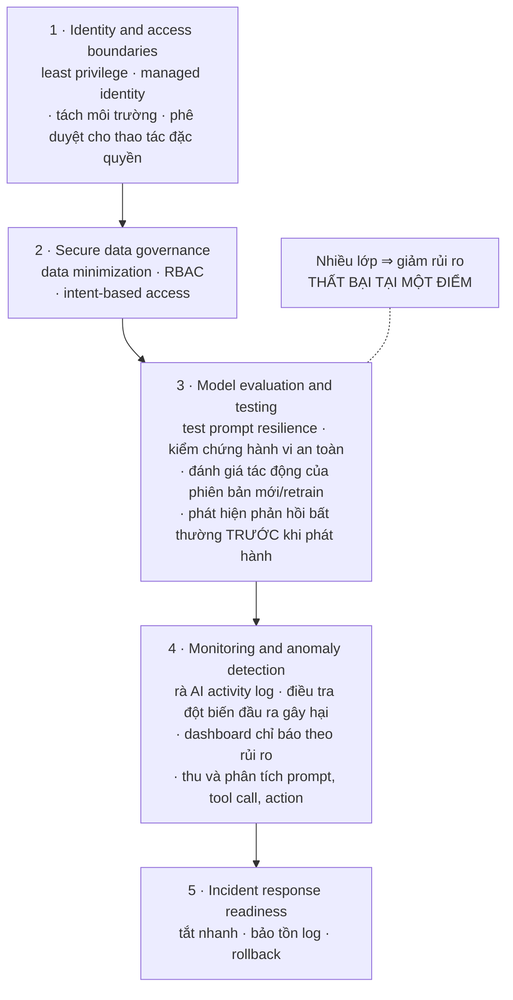
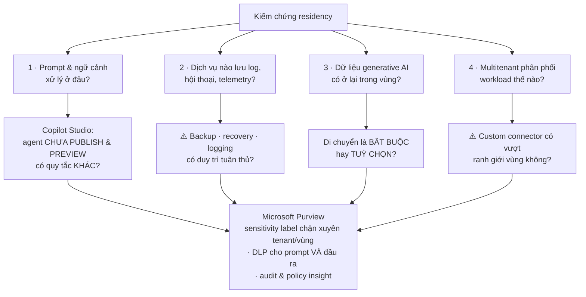

# Note 24 — Governance, lỗ hổng AI, Responsible AI & data residency

> [!summary] TL;DR
> Note khép lại cụm Deploy. Bốn khối:
> 1. **Governance model cho agent** — nguyên tắc đầu tiên là **Accountability and ownership**: **mỗi agent có một OWNER** chịu trách nhiệm vòng đời, thế trận bảo mật và phê duyệt; duy trì **agent registry** ghi *mục đích · môi trường · MỨC RỦI RO · quyền truy cập dữ liệu*; **bắt buộc phê duyệt khi publish agent xử lý dữ liệu nhạy cảm hoặc chịu quản lý**.
> 2. **Lỗ hổng AI & prompt manipulation** — **5 nhóm lỗ hổng**: *prompt manipulation · model behavior · data exposure · identity/RBAC gaps · agent & workflow*. Bốn kỹ thuật thao túng prompt: ⭐ **ghi đè chỉ dẫn hệ thống · ngữ cảnh đánh lừa · ép buộc nhiều bước / đầu vào đầu độc · NHÚNG CHỈ DẪN ẨN trong text, HTML hoặc file**. Giảm thiểu bằng **5 lớp phòng thủ**.
> 3. **Rà Responsible AI** — **6 nguyên tắc** làm lăng kính, và **mô hình rà 5 phần**: *mục đích & phạm vi sử dụng · dữ liệu, riêng tư, bảo mật · hành vi model & agent · công bằng & thiên lệch · minh bạch & trải nghiệm*. ⭐ **RAI không phải rà một lần** — cần **giám sát liên tục** kèm **sunset criteria**.
> 4. **Data residency & movement** — biết **dữ liệu ở đâu, di chuyển thế nào, thành phần nào tham gia inference/logging/xử lý/lưu trữ**; hành vi residency riêng của **Copilot Studio** (⭐ **agent chưa publish và tính năng preview có thể theo quy tắc KHÁC**); và **Microsoft Purview** cho nhãn, DLP, audit.
>
> Thuật ngữ: **Data sovereignty** = chủ quyền dữ liệu, nguyên tắc dữ liệu chịu luật của quốc gia nơi nó được lưu. **Data residency** = vị trí địa lý dữ liệu được lưu và xử lý. **Disparate impact** = tác động chênh lệch lên các nhóm người khác nhau. **Multitenant** = nhiều khách hàng dùng chung hạ tầng. **Purview** = nền tảng governance dữ liệu của Microsoft. **Declarative agent** = agent khai báo bằng cấu hình thay vì code. **Provenance** = xuất xứ dữ liệu.

---

## 1. Thiết kế governance model cho AI agent (U2)

### 1.1. Nguyên tắc nền: Accountability and ownership ⭐⭐

> **Quyền sở hữu rõ ràng bảo đảm agent hoạt động có khả năng truy vết và trách nhiệm dự đoán được.**

| Yếu tố | Nội dung |
|---|---|
| **Agent owner** | **Gán MỘT chủ sở hữu chịu trách nhiệm về vòng đời, thế trận bảo mật và phê duyệt** |
| **Agent registry** | ⭐ **Duy trì sổ đăng ký ghi: mục đích · môi trường · MỨC RỦI RO · quyền truy cập dữ liệu** |
| **Publishing approvals** | **Bắt buộc phê duyệt khi publish agent xử lý dữ liệu NHẠY CẢM hoặc CHỊU QUẢN LÝ** |

`★ Insight ─────────────────────────────────────`
**Agent registry** xuất hiện ba lần trong bộ note dưới ba tên khác nhau, và gộp lại cho thấy nó là **hiện vật governance quan trọng nhất** của cả cụm Deploy.

Ở [[23-Bao-mat-Agent-Model-va-Access-Control]] nó là *"authoritative catalog of agents with owner, version, environment, and purpose"* — góc **observability**. Ở đây nó là *agent registry* ghi thêm **mức rủi ro** và **quyền truy cập dữ liệu** — góc **governance**. Và ở [[04-CAF-cho-AI-va-Vong-doi-Agent]] nó là hàng rào chống **agent sprawl** — góc **chiến lược**.

Trường **risk level** là trường mà hai bản kia không có, và nó là thứ khiến registry **hành động được** thay vì chỉ là danh sách: nó quyết định **agent nào cần phê duyệt khi publish**, **agent nào cần CAB review** ([[22-ALM-cho-Foundry-Custom-Model-va-D365]]), **agent nào cần diễn tập incident response**. Không phân loại rủi ro thì hoặc bạn áp mức kiểm soát cao nhất cho tất cả (làm mọi thứ chậm lại), hoặc áp mức thấp nhất (bỏ lọt agent nguy hiểm).
`─────────────────────────────────────────────────`

### 1.2. Sáu vùng governance

| Vùng | Nội dung |
|---|---|
| **Identity, access & permission** | **Dùng managed identity thay vì secret nhúng** · **gán quyền least-privilege, phạm vi theo môi trường và tài nguyên** · **phân tách vai trò Makers, Approvers, Admins và Security teams** |
| **Data governance & protection** | **Thực thi phân loại dữ liệu và hạn chế agent chỉ truy cập nguồn đã phê duyệt** · **áp DLP để giới hạn việc dùng connector và ngăn dòng dữ liệu nhạy cảm ra ngoài** · **tôn trọng quy tắc residency** · **dùng sensitivity label để theo dõi và quản trị việc di chuyển thông tin XUYÊN SUỐT các phản hồi của agent** |
| **Observability & monitoring** | **Ghi log prompt, action, kết quả, lỗi và escalation** · **dashboard cho tỷ lệ thành công, mẫu thất bại và hành vi bất ngờ** · **alert cho hoạt động bất thường như đột biến token nhanh hoặc truy cập dữ liệu lạ** |
| **Cost governance** | **Gắn tag tài nguyên agent để quy chi phí** · **đặt ngưỡng dùng và alert** · **rà mẫu tiêu thụ để tối ưu tải và lựa chọn model** |
| **Security & safe deployment** | **Thực thi bảo vệ runtime và đánh giá agent về cấu hình không an toàn TRƯỚC khi publish** · **áp lọc đầu vào/đầu ra để giảm rủi ro prompt-injection và rò rỉ dữ liệu** · **tích hợp agent vào quy trình giám sát và ứng phó bảo mật của tổ chức** |
| **Development, versioning & lifecycle** | **Template chuẩn để tạo agent và tài liệu hoá** · **version control cho prompt, knowledge source và workflow** · **kiểm tra bắt buộc trước publish về bảo mật, DLP và cấu hình truy cập dữ liệu** |

### 1.3. Quản trị tích hợp bên ngoài & vòng đời

**Ba quy tắc cho agent tương tác với API/hệ thống bên ngoài:**
1. **CHỈ cho phép connector và endpoint đã được phê duyệt**
2. **Kiểm chứng phương thức xác thực và phạm vi**
3. **Bảo đảm dòng dữ liệu bên ngoài tuân thủ chính sách và nghĩa vụ hợp đồng**

**Ba chính sách vòng đời:**
1. **Rà soát theo lịch về độ chính xác, độ tươi của dữ liệu và đánh giá lại rủi ro**
2. ⭐ **Tiêu chí lưu trữ hoặc KHAI TỬ các agent không còn được dùng**
3. **Pipeline triển khai có kiểm soát cho agent production**

---

## 2. Lỗ hổng AI & giảm thiểu prompt manipulation (U4)

### 2.1. Prompt manipulation — bốn kỹ thuật ⭐⭐

> **Prompt manipulation** xảy ra khi người dùng **cố ý hoặc vô ý** lái model **rời khỏi hành vi an toàn dự định**.

| # | Kỹ thuật | Ví dụ nguyên văn |
|---|---|---|
| 1 | **Ghi đè chỉ dẫn hệ thống** | *"ignore previous instructions…"* |
| 2 | **Ngữ cảnh đánh lừa** (deceptive context) | *"you are allowed to disclose confidential…"* |
| 3 | **Ép buộc nhiều bước hoặc đầu vào đầu độc** | Multi-step coercion / poisoning inputs |
| 4 | ⭐ **Nhúng chỉ dẫn ẨN trong text, HTML hoặc file** | Embedded hidden instructions |

**Bốn vùng tác động:** **trả về dữ liệu nhạy cảm hoặc được bảo vệ** · **thực thi hành động ngoài ý muốn** · **thông tin sai hoặc đầu ra gây hại** · **thao túng các automation/tool phía sau**.

> ⭐ Kỹ thuật **4** là loại nguy hiểm nhất vì **người dùng không cần là kẻ tấn công**: một nhân viên tải lên một PDF từ nhà cung cấp, trong đó có đoạn chữ trắng trên nền trắng ghi chỉ dẫn độc — đây là **prompt injection GIÁN TIẾP**. Nó chính là lý do luồng truy xuất grounding ở [[23-Bao-mat-Agent-Model-va-Access-Control]] phải có **Sanitization Layer trước Model Context Injection**.

### 2.2. Bốn nhóm lỗ hổng còn lại

#### Model behavior vulnerabilities

**Năm rủi ro:** **thông tin sai hoặc bịa đặt** · **độc hại hoặc nội dung gây hại** · **thực thi ranh giới kém trong chỉ dẫn an toàn** · **suy luận thiên lệch hoặc kết quả không công bằng** · ⭐ **khái quát hoá quá mức (overgeneralization) tạo rủi ro tuân thủ**.

**Năm thứ phải liên tục đánh giá:** **output safety** · **output correctness** · **output consistency** · ⭐ **độ biến thiên phản hồi giữa các lần lặp** · **model drift sau khi retrain**.

#### Data exposure vulnerabilities

**Bốn tình huống lộ dữ liệu:**
1. **Prompt GIÁN TIẾP làm lộ thông tin nhạy cảm**
2. **Log, memory store hoặc transcript lưu dữ liệu không được bảo vệ**
3. **Quyền thừa cho phép model truy cập dữ liệu nó KHÔNG CẦN**
4. **File đầu vào chứa chỉ dẫn độc nhúng sẵn**

> **Best practice:** kiến trúc giải pháp bằng **data minimization, ranh giới RBAC, và truy cập theo Ý ĐỊNH khớp vai trò người dùng** (intent-based access).

#### Identity, access & RBAC gaps

**Ba điều kẻ tấn công làm được khi cấu hình danh tính yếu:** **tương tác với model bằng đặc quyền nâng cao** · **truy cập các tool phía sau do agent kích hoạt** · **leo thang đặc quyền qua connector hoặc plugin cấu hình sai**.

**Bốn biện pháp:** **thực thi least-privilege cho cả agent và người dùng** · **dùng managed identity** · **phân tách môi trường dev/test/prod** · **rà access log để tìm mưu toan nâng quyền bất thường**.

#### Agent & workflow-level vulnerabilities

**Bốn rủi ro:** ⭐ **agent tự chủ dùng tool mà không có guardrail đúng** · **hiểu sai chỉ dẫn dẫn tới hành động ngoài ý muốn** · **audit kém và thiếu khả năng rollback** · **flow không an toàn gọi endpoint ngoài Microsoft**.

**Ba điều architect phải bảo đảm:** **agent chỉ hành động TRONG ranh giới năng lực tool đã định rõ** · **audit và monitoring bật đầu-cuối** · **pipeline đánh giá test workflow TRƯỚC khi triển khai production**.

### 2.3. Năm lớp phòng thủ ⭐⭐

**Bốn biện pháp lọc đầu vào/đầu ra:** ⭐ **chặn mưu toan thực thi code** · **gỡ HTML không an toàn hoặc prompt nhúng** · **áp safety filter lên đầu ra model** · **giới hạn loại file AI được nhận**.

`★ Insight ─────────────────────────────────────`
Bốn biện pháp lọc trên đọc kỹ sẽ thấy **ba trong bốn nhắm vào ĐẦU VÀO, chỉ một nhắm vào đầu ra** — và tỷ lệ đó phản ánh đúng nơi rủi ro thật sự nằm.

Lọc đầu ra (*safety filter*) bắt được nội dung độc hại mà model **tự sinh ra**. Nhưng ba biện pháp kia — **chặn thực thi code, gỡ HTML/prompt nhúng, giới hạn loại file** — đều nhắm vào **prompt injection gián tiếp**: chỉ dẫn độc đi vào qua **nội dung mà agent đọc**, không qua câu người dùng gõ. Với hệ RAG và agent có tool, **bề mặt tấn công lớn nhất không phải ô chat mà là kho tài liệu**.

Điều này giải thích vì sao *"giới hạn loại file AI được nhận"* lại là một biện pháp bảo mật chứ không phải hạn chế tính năng: mỗi định dạng file phức tạp thêm vào (HTML, PDF có layer, tài liệu có macro) là **một kênh mới để giấu chỉ dẫn**. Và nó khớp với **"block list cho các loại tài liệu bị cấm"** trong guardrail grounding data ở note 23.
`─────────────────────────────────────────────────`

---

## 3. Rà soát mức tuân thủ Responsible AI (U5)

### 3.1. Sáu nguyên tắc làm lăng kính

| Nguyên tắc | Phát biểu |
|---|---|
| **Fairness** | **Hệ AI phải đối xử công bằng với mọi nhóm** |
| **Reliability and Safety** | **Hệ phải hoạt động đúng như dự định và ngăn tác hại** |
| **Privacy and Security** | **Bảo vệ dữ liệu cá nhân và dữ liệu tổ chức bằng kiểm soát mạnh** |
| **Inclusiveness** | **AI phải trao quyền cho người thuộc mọi khả năng và hoàn cảnh** |
| **Transparency** | **Giải pháp phải hiểu được, có công bố rõ về cách AI được dùng** |
| **Accountability** | **Tổ chức GIỮ trách nhiệm cho các quyết định do AI đưa ra** |

> Sáu nguyên tắc này là **lăng kính** để architect đánh giá **model, agent, workflow, tích hợp và trải nghiệm người dùng**. (Bản đầy đủ kèm bảng phân biệt ở [[09-Copilot-trong-Dynamics-365-CE-va-Service]] §1.)

### 3.2. Mô hình rà soát 5 phần ⭐⭐

| # | Phần | Kiểm gì |
|---|---|---|
| 1 | **Solution purpose and intended use** | **Mục đích và biện minh nghiệp vụ** · **persona người dùng và hành động kỳ vọng** · **dữ liệu dùng cho suy luận, truy xuất hoặc huấn luyện** · ⭐ **ranh giới và GIỚI HẠN đã được truyền đạt tới người dùng** |
| 2 | **Data, privacy, and security assessment** | **Phân loại độ nhạy cảm của MỌI nguồn dữ liệu** · **data minimization** · **kỳ vọng về lưu trữ và thời hạn** · **bảo vệ PII** · **cô lập dữ liệu bí mật và dùng least-privilege** |
| 3 | **Model and agent behavior evaluation** | **Nhận diện mẫu thông tin sai/bịa đặt** · **kiểm chứng việc tuân theo chỉ dẫn và prompt** · **đánh giá ranh giới an toàn trong tình huống biên** · ⭐ **xác nhận hành vi FALLBACK cho yêu cầu không biết hoặc mơ hồ** · **bảo đảm model không sinh nội dung gây hại hoặc gây hiểu lầm** |
| 4 | **Fairness and bias review** | ⭐ **Tác động chênh lệch tiềm tàng lên các nhóm người dùng khác nhau** · **tính đại diện của dữ liệu huấn luyện** · **chiến lược giảm thiểu đầu ra thiên lệch hoặc gây hại** · **kiểm thử công bằng bằng kịch bản TỔNG HỢP VÀ THỰC TẾ** |
| 5 | **Transparency and user experience** | **Việc có AI tham gia được truyền đạt rõ** · **người dùng hiểu giới hạn của hệ thống** · **có tài liệu, tóm tắt hành vi hệ thống và đường escalate** · **ghi log phản hồi người dùng để cải tiến liên tục** |

> ⭐ Phần **1** và phần **5** cùng nhắc tới **giới hạn (limitations)** — một lần ở góc *"đã xác định chưa"*, một lần ở góc *"người dùng có biết không"*. Đây là mẫu lặp lại: **biết giới hạn của mình là chưa đủ, phải nói cho người dùng biết**. Nó nối thẳng với giai đoạn 1 của vòng đời custom model ở [[22-ALM-cho-Foundry-Custom-Model-va-D365]] — *tài liệu hoá hành vi dự định, giới hạn và đường thất bại*.

### 3.3. Bộ công cụ RAI & bốn vai trò tham gia rà soát

**Bốn nhóm công cụ/thực hành:**
1. ⭐ **RAI validation checks cho declarative agent**
2. **Công cụ phát hiện thiên lệch, đánh giá an toàn và đánh giá rủi ro**
3. **Thực hành tài liệu hoá model lineage, data provenance và các quyết định**
4. **Quy trình governance cho rà soát, phê duyệt và ký duyệt**

> ⭐ Learning objective nêu rõ architect phải **điều phối một cuộc rà soát RAI LIÊN NGÀNH với đội engineering, legal, data science và compliance** — bốn nhóm, không phải một mình kiến trúc sư.

### 3.4. Giám sát vận hành: RAI không phải rà một lần ⭐

> **"Responsible AI is not a one-time review — it requires continuous monitoring."**

**Bốn yếu tố:**
1. **Kế hoạch incident response cho thất bại của hệ AI**
2. **Đánh giá định kỳ log, sự kiện an toàn và model drift**
3. **Governance board rà soát các cập nhật hoặc retrain quan trọng**
4. ⭐ **Sunset criteria cho model không còn đạt yêu cầu an toàn hoặc tuân thủ**

> ⭐ **Sunset criteria** xuất hiện lần thứ ba trong bộ note — sau **readiness checklist của agent M365** ([[16-Orchestrate-Prebuilt-Agents-va-Apps]]) và **retirement trigger của AI Builder model lifecycle** ([[16-Orchestrate-Prebuilt-Agents-va-Apps]] §4.2). Cả bộ AB-100 nhất quán ở điểm này: **mọi tài sản AI phải có kế hoạch chấm dứt, không chỉ kế hoạch ra đời.**

---

## 4. Kiểm chứng data residency & tuân thủ di chuyển dữ liệu (U6)

### 4.1. Bốn câu hỏi phải trả lời

> **Data residency** = **vị trí vật lý hoặc địa lý nơi dữ liệu khách hàng được lưu trữ và xử lý.**

Giải pháp AI dùng nhiều dịch vụ và chuỗi công cụ, nên architect phải hiểu:
1. **Prompt của người dùng, ngữ cảnh và đầu vào model được XỬ LÝ ở đâu**
2. **Dịch vụ nào LƯU log, hội thoại hoặc telemetry**
3. **Dữ liệu mà generative AI dùng có Ở LẠI trong vùng chỉ định không**
4. ⭐ **Dịch vụ cloud MULTITENANT phân phối workload thế nào**

> Câu định vị vai trò: architect **phải biết dữ liệu được lưu ở đâu, nó di chuyển giữa các dịch vụ ra sao, và THÀNH PHẦN NÀO tham gia vào inference, logging, xử lý hoặc lưu trữ**.

### 4.2. Hành vi residency của Copilot Studio ⭐⭐

**Bốn thứ architect phải kiểm chứng:**

| # | Kiểm chứng |
|---|---|
| 1 | **Dữ liệu prompt và tương tác agent được xử lý ở đâu** |
| 2 | ⭐ **Agent CHƯA PUBLISH và tính năng PREVIEW có theo quy tắc residency KHÁC không** |
| 3 | **Dữ liệu được lưu thế nào khi agent dùng connector hoặc custom plugin** |
| 4 | **Có tương tác xuyên vùng nào xảy ra trong lúc inference hoặc orchestration không** |

`★ Insight ─────────────────────────────────────`
Điểm kiểm chứng **số 2** là loại chi tiết mà chỉ người từng triển khai thật mới nghĩ tới, và nó là bẫy tuân thủ rất thực.

Suy nghĩ tự nhiên là: *"môi trường của chúng tôi ở EU, nên dữ liệu ở lại EU."* Nhưng **agent chưa publish** đang ở trạng thái tác nghiệp — maker đang thử nghiệm, dữ liệu thật có thể đã được dán vào để test — và **tính năng preview** thường chạy trên hạ tầng chưa đầy đủ cam kết residency của bản GA. Nghĩa là **giai đoạn rủi ro cao nhất về residency lại chính là giai đoạn ít bị kiểm soát nhất**: lúc phát triển và thử nghiệm.

Đây cũng là lý do nguyên tắc *"không huấn luyện trên tri thức production"* và *"Test dùng dữ liệu ẩn danh + synthetic"* ở [[21-ALM-cho-Du-lieu-va-Copilot-Studio]] và [[22-ALM-cho-Foundry-Custom-Model-va-D365]] không chỉ là vệ sinh dữ liệu — chúng đồng thời **giới hạn phơi nhiễm residency** trong các môi trường có cam kết yếu hơn.

Hệ quả tư vấn: khi khách hàng chịu quản lý hỏi về tính năng preview, câu trả lời đúng không phải *"có/không dùng được"* mà là **"quy tắc residency của preview khác GA thế nào, và ta có chấp nhận được không"**.
`─────────────────────────────────────────────────`

### 4.3. Kiểm soát di chuyển dữ liệu cho generative AI

> **Tính năng generative AI CÓ THỂ cần di chuyển dữ liệu** cho **đánh giá model, orchestration hoặc làm giàu (enrichment)**.

**Bốn bước kiểm chứng tuân thủ:**
1. **Xác định thành phần nào CÓ THỂ truyền dữ liệu ra ngoài vùng**
2. ⭐ **Xác nhận việc di chuyển đó là BẮT BUỘC hay TUỲ CHỌN**
3. **Rà thiết lập môi trường cho phép hoặc hạn chế thao tác model xuyên địa lý**
4. **Áp chính sách cấu hình CHẶN định tuyến xuyên vùng cho workload nhạy cảm**

> ⭐ Bước **2** là câu hỏi phân loại quan trọng nhất: nếu di chuyển là **tuỳ chọn** thì tắt nó đi là xong; nếu **bắt buộc** thì phải quyết định giữa *chấp nhận rủi ro có kiểm soát* và *bỏ tính năng* — đúng cây quyết định residency ở [[21-ALM-cho-Du-lieu-va-Copilot-Studio]] §1.5.

### 4.4. Microsoft Purview cho Microsoft 365 Copilot ⭐

**Bốn việc architect làm với Purview:**

| # | Việc |
|---|---|
| 1 | ⭐ **Áp sensitivity label HẠN CHẾ việc truyền xuyên tenant hoặc xuyên vùng** |
| 2 | **Dùng DLP rule ngăn dữ liệu nhạy cảm được dùng trong prompt HOẶC đầu ra của AI** |
| 3 | **Rà auditing, policy insight và tài liệu tuân thủ cho giải pháp Copilot** |
| 4 | **Kiểm chứng log tương tác Copilot tuân theo quy tắc residency của tổ chức** |

> ⭐ Việc **2** nhấn mạnh **cả prompt lẫn đầu ra** — DLP không chỉ chặn dữ liệu nhạy cảm *đi ra*, mà còn chặn nó *đi vào* prompt. Đây là hàng rào chống đúng lỗ hổng *"nhét dữ liệu nhạy cảm vào prompt để model suy luận tốt hơn"* đã nêu ở [[23-Bao-mat-Agent-Model-va-Access-Control]].

### 4.5. Năm thực hành kiến trúc tuân thủ

| # | Thực hành |
|---|---|
| 1 | **Chọn vùng tenant khớp khung pháp lý** |
| 2 | **Cấu hình môi trường Copilot Studio để thực thi chính sách residency** |
| 3 | ⭐ **Bảo đảm custom connector KHÔNG vượt qua ranh giới dữ liệu theo vùng** |
| 4 | **Tài liệu hoá MỌI luồng dữ liệu, gồm cả log, telemetry và đầu ra inference** |
| 5 | ⭐ **Kiểm chứng hệ thống backup, khôi phục và logging vẫn duy trì tuân thủ** |

> ⭐ Thực hành **3** và **5** là hai lỗ rò kinh điển: **custom connector** là cửa hậu hợp pháp ra khỏi vành đai vùng (nó gọi API bất kỳ ở đâu), còn **backup và log** thường được cấu hình bởi đội hạ tầng theo mặc định của họ, không theo chính sách AI — dữ liệu ở đúng vùng nhưng **bản sao lưu thì không**.

---

## Câu hỏi phỏng vấn

> [!question] Nguyên tắc governance đầu tiên cho AI agent là gì, và hiện vật cốt lõi của nó?
> **Accountability and ownership** — quyền sở hữu rõ ràng bảo đảm agent hoạt động **có khả năng truy vết và trách nhiệm dự đoán được**. Ba yếu tố: **gán một agent owner** chịu trách nhiệm vòng đời, thế trận bảo mật và phê duyệt; duy trì **agent registry** ghi **mục đích, môi trường, MỨC RỦI RO và quyền truy cập dữ liệu**; **bắt buộc phê duyệt khi publish agent xử lý dữ liệu nhạy cảm hoặc chịu quản lý**. Trường **risk level** là thứ khiến registry hành động được thay vì chỉ là danh sách: nó quyết định agent nào cần phê duyệt, agent nào cần CAB review, agent nào cần diễn tập incident response. Không phân loại rủi ro thì hoặc bạn áp mức kiểm soát cao nhất cho tất cả (chậm mọi thứ) hoặc mức thấp nhất (lọt agent nguy hiểm).

> [!question] Kể bốn kỹ thuật prompt manipulation và cho biết loại nào nguy hiểm nhất.
> **(1) Ghi đè chỉ dẫn hệ thống** — *"ignore previous instructions…"*; **(2) ngữ cảnh đánh lừa** — *"you are allowed to disclose confidential…"*; **(3) ép buộc nhiều bước hoặc đầu vào đầu độc**; **(4) nhúng chỉ dẫn ẩn trong text, HTML hoặc file**. Loại **4 nguy hiểm nhất** vì **người dùng không cần là kẻ tấn công**: một nhân viên tải lên tài liệu từ nhà cung cấp, trong đó có chỉ dẫn độc giấu dưới dạng chữ trắng trên nền trắng — đây là **prompt injection GIÁN TIẾP**, và bề mặt tấn công là **kho tài liệu**, không phải ô chat. Bốn vùng tác động: **trả về dữ liệu được bảo vệ, thực thi hành động ngoài ý muốn, thông tin sai/gây hại, thao túng automation phía sau**. Phòng thủ tương ứng: **Sanitization Layer trước khi đưa nội dung vào ngữ cảnh model**, cộng lọc đầu vào — **gỡ HTML/prompt nhúng, giới hạn loại file, chặn thực thi code**.

> [!question] Rà soát một giải pháp theo Responsible AI gồm những phần nào, và ai tham gia?
> **Mô hình 5 phần**: (1) **mục đích và phạm vi sử dụng** — biện minh nghiệp vụ, persona, dữ liệu dùng, và **ranh giới/giới hạn đã truyền đạt tới người dùng**; (2) **dữ liệu, riêng tư, bảo mật** — phân loại nhạy cảm mọi nguồn, data minimization, lưu trữ, bảo vệ PII, cô lập dữ liệu bí mật; (3) **hành vi model và agent** — mẫu bịa đặt, tuân theo chỉ dẫn, ranh giới an toàn ở tình huống biên, **hành vi fallback cho yêu cầu mơ hồ**; (4) **công bằng và thiên lệch** — **tác động chênh lệch lên các nhóm**, tính đại diện của dữ liệu huấn luyện, kiểm thử công bằng bằng kịch bản **tổng hợp và thực tế**; (5) **minh bạch và trải nghiệm** — công bố có AI, người dùng hiểu giới hạn, có đường escalate, ghi log phản hồi. Về người tham gia: đây là **rà soát LIÊN NGÀNH** với **engineering, legal, data science và compliance** — không phải việc riêng của architect. Và quan trọng: **RAI không phải rà một lần**, cần giám sát liên tục kèm **sunset criteria**.

> [!question] Vì sao phải kiểm chứng riêng residency của agent chưa publish và tính năng preview?
> Vì **chúng có thể theo quy tắc residency KHÁC với bản GA**. Suy nghĩ tự nhiên *"môi trường ở EU nên dữ liệu ở lại EU"* bỏ sót hai chỗ: **agent chưa publish** đang ở trạng thái tác nghiệp — maker có thể đã dán dữ liệu thật vào để test — còn **tính năng preview** thường chạy trên hạ tầng chưa có đầy đủ cam kết residency. Nghĩa là **giai đoạn rủi ro cao nhất về residency lại là giai đoạn ít bị kiểm soát nhất**. Đây cũng là một lý do nữa cho nguyên tắc *"Test dùng dữ liệu ẩn danh và synthetic"*: nó **giới hạn phơi nhiễm residency** ở môi trường có cam kết yếu hơn. Khi tư vấn khách hàng chịu quản lý về tính năng preview, câu trả lời đúng không phải "dùng được/không" mà là **"quy tắc residency của preview khác GA thế nào, ta có chấp nhận được không"**.

> [!question] Hai lỗ rò residency dễ bị bỏ sót nhất trong kiến trúc AI là gì?
> **Custom connector** và **hệ thống backup/recovery/logging**. Custom connector là **cửa hậu hợp pháp** ra khỏi vành đai vùng — nó gọi được API bất kỳ ở đâu, nên thực hành số 3 yêu cầu *"bảo đảm custom connector không vượt qua ranh giới dữ liệu theo vùng"*. Backup và log thường được **đội hạ tầng cấu hình theo mặc định của họ**, không theo chính sách AI — kết quả là dữ liệu nằm đúng vùng nhưng **bản sao lưu thì không**, nên thực hành số 5 yêu cầu *"kiểm chứng backup, recovery và logging vẫn duy trì tuân thủ"*. Ba thực hành còn lại: **chọn vùng tenant khớp khung pháp lý**, **cấu hình môi trường Copilot Studio thực thi residency**, và **tài liệu hoá MỌI luồng dữ liệu gồm log, telemetry và đầu ra inference**.

> [!question] Microsoft Purview đóng vai trò gì với Microsoft 365 Copilot?
> Bốn việc: (1) **áp sensitivity label hạn chế truyền xuyên tenant hoặc xuyên vùng**; (2) **dùng DLP rule ngăn dữ liệu nhạy cảm được dùng trong prompt HOẶC đầu ra của AI**; (3) **rà auditing, policy insight và tài liệu tuân thủ** cho giải pháp Copilot; (4) **kiểm chứng log tương tác Copilot tuân theo quy tắc residency**. Điểm đáng nhớ nhất là việc 2 nhắm **cả hai chiều**: DLP không chỉ chặn dữ liệu nhạy cảm *đi ra* trong phản hồi mà còn chặn nó *đi vào* prompt — chính là hàng rào chống lỗi "nhét dữ liệu nhạy cảm vào prompt để model suy luận tốt hơn". Purview là lớp thực thi cho toàn bộ phần data governance đã học: phân loại, nhãn, DLP, audit.

---

## Tự kiểm tra

1. **Nguyên tắc governance đầu tiên** cho agent? Ba yếu tố của nó?
2. **Agent registry** ghi những gì? Trường nào khiến nó *hành động được*?
3. **Sáu vùng governance** và nội dung chính từng vùng?
4. **Ba quy tắc** cho tích hợp bên ngoài? **Ba chính sách** vòng đời?
5. **Bốn kỹ thuật** prompt manipulation kèm ví dụ? Loại nào nguy hiểm nhất và vì sao?
6. **Bốn vùng tác động** của prompt manipulation?
7. **Năm rủi ro** về hành vi model? **Năm thứ** phải liên tục đánh giá?
8. **Bốn tình huống** lộ dữ liệu? Best practice kiến trúc gồm **ba** yếu tố nào?
9. **Ba điều** kẻ tấn công làm được khi danh tính yếu? **Bốn biện pháp**?
10. **Bốn rủi ro** ở tầng agent/workflow? **Ba điều** architect phải bảo đảm?
11. **Năm lớp phòng thủ**? **Bốn biện pháp** lọc đầu vào/đầu ra — mấy cái nhắm vào đầu vào và vì sao?
12. **Sáu nguyên tắc** Responsible AI?
13. **Mô hình rà soát 5 phần** — mỗi phần kiểm gì? Hai phần nào cùng nhắc tới **giới hạn**?
14. **Bốn nhóm công cụ RAI**? **Bốn nhóm** tham gia rà soát liên ngành?
15. Câu nói về RAI **không phải rà một lần**? **Bốn yếu tố** giám sát vận hành?
16. **Data residency** là gì? **Bốn câu hỏi** architect phải trả lời?
17. **Bốn điểm kiểm chứng** residency của Copilot Studio — điểm nào là bẫy tuân thủ và vì sao?
18. **Bốn bước** kiểm chứng di chuyển dữ liệu? Bước nào là câu hỏi phân loại quan trọng nhất?
19. **Bốn việc** với Microsoft Purview? Việc nào nhắm cả prompt lẫn đầu ra?
20. **Năm thực hành** kiến trúc tuân thủ? **Hai lỗ rò** dễ bỏ sót nhất?

## Liên quan
- [[00-MOC-AB100]] — MOC bộ AB-100
- [[23-Bao-mat-Agent-Model-va-Access-Control]] — note trước: defense in depth, model security, access control, audit trail
- [[25-AB-100-Cheatsheet-va-QA]] — note sau: cheatsheet, bảng cặp dễ nhầm, 39 câu Module assessment
- [[09-Copilot-trong-Dynamics-365-CE-va-Service]] — 6 nguyên tắc Responsible AI, bản phân biệt chi tiết
- [[21-ALM-cho-Du-lieu-va-Copilot-Studio]] — cây quyết định residency, gate D→E về compliance
- [[22-ALM-cho-Foundry-Custom-Model-va-D365]] — CAB review, sunset criteria, dữ liệu Test ẩn danh
- [[16-Orchestrate-Prebuilt-Agents-va-Apps]] — readiness checklist với sunset criteria
- [[04-CAF-cho-AI-va-Vong-doi-Agent]] — agent sprawl, pha Govern & Secure
- [[07-Solution-Rules-Vai-tro-va-AI-CoE]] — vai trò RAI-compliance officer, 4 nhóm quy định
- [[../AI-103/04-Toi-uu-Model-va-Responsible-GenAI]] — content filter, đánh giá an toàn trong Foundry
